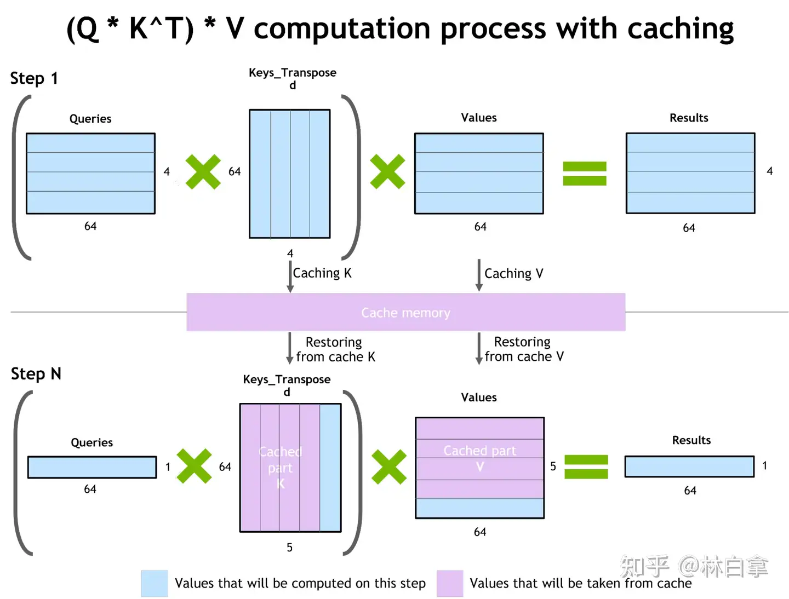
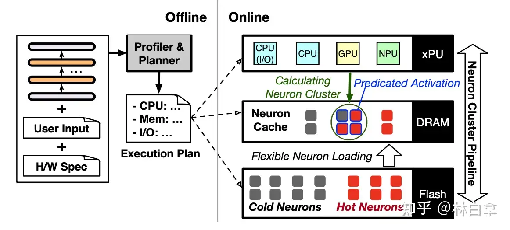
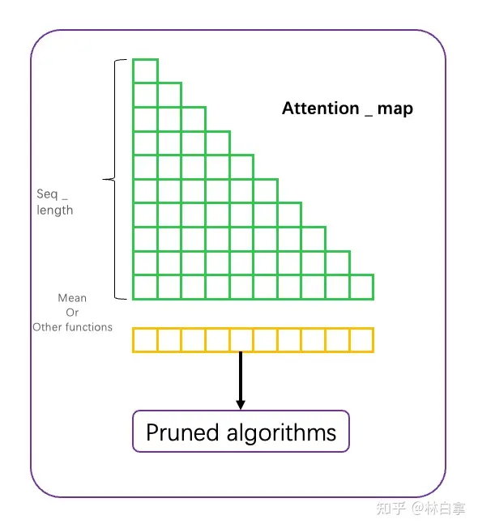
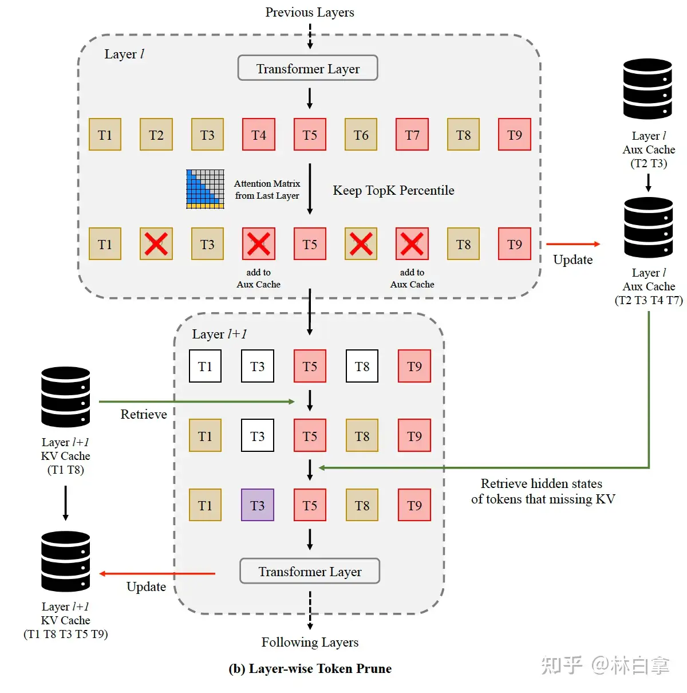

# 大模型推理加速技术的学习路线是什么&
> **作者：林白拿**  
> **链接：**[**https://www.zhihu.com/question/591646269/answer/3501605193**](https://www.zhihu.com/question/591646269/answer/3501605193)

以LLama2-7B 为例，端侧推理所需**DDR空间**：

1.  Weights 参数：4bit表示，所需空间为3.5GB
2.  KV cache：以prefill 阶段超长上下文，8K～32K token，用INT8表示。
    1.  计算公式为 2（K+V）\* bsdl；
    2.  其中 b 代表[batch size](https://zhida.zhihu.com/search?content_id=666727783&content_type=Answer&match_order=1&q=batch+size&zhida_source=entity)，端侧batch size都等于1；s是sequence length，这里是8K～32K；d 是embedding size，llama2-7B模型是4096，l是layer的层数，[llama2-7B](https://zhida.zhihu.com/search?content_id=666727783&content_type=Answer&match_order=2&q=llama2-7B&zhida_source=entity)是32个。
    3.  那么根据公式可以计算出所需KV cache空间为：2GB～8GB（惊呆了！）
3.  也就是按照最少的上下文需求也是3.5GB+2GB = 5.5GB（在没有开始生成的一个output token的情况下）

推理**带宽**及理论上最大**推理速度**：

1.  decoding过程一次所需带宽是：5.5GBs
2.  按照LPDDR 8533 70%的有效效率计算（如果AP上的NPU可以完全看到的话）是58GBs。
3.  最大推理速度是58/5.5 = 10.5 token/s。实际推理会低于该值。这么大的KV cache在NPU推理过程中，所需的ram已经远远大于tcm，肯定会和ddr交互，速度会更慢。

本文的推理加速优化手段，核心就是为什么要把所有V cache都加载参与计算呢，因为并不是V cache都是重要的，可以被忽略。具体流程如下：

*   Inference [with KV cache](https://zhida.zhihu.com/search?content_id=666727783&content_type=Answer&match_order=1&q=with+KV+cache&zhida_source=entity)：

*   TopN
    *   Softmax后取出TopN（该N值是可以设定的），所以就不需要所有的V参与计算，而是可以根据TopN选择出对应的V cache进行计算。

这个方案，虽然看上去合理。但是实际的有效性仍然需要验证：

1.  之所以说有效，是因为有类似于sliding window attention的工作已经被认证，确实并不是所有的token都重要，有一些token可以被扔掉。
2.  本工作相当于[sliding window](https://zhida.zhihu.com/search?content_id=666727783&content_type=Answer&match_order=2&q=sliding+window&zhida_source=entity)的自适应版本，自动选择topN，但问题就在于这个N时动态的，每一层layer都是不同的。可能layer 1的top N 对应的是 1～N，但是layer的topN对应的N+1～2N。那么所有的V cache就都需要在ddr hold住。完全起不到节省内存的目标。
3.  当然也存在一种可能，就是decoding过程中生成的长文本，发现对上文中的前部分依赖变少，直接压到flash中去。但这么做[runtime](https://zhida.zhihu.com/search?content_id=666727783&content_type=Answer&match_order=1&q=runtime&zhida_source=entity)做的太复杂， 不划算。
4.  实际带宽需求会减少，但是推理时间却有可能无法加速。因为TopN在DDR 地址上的不连续，要跳着去取V cache，极限的情况下需要DMA配100个地址（完成gather的操作）

所以对于手机端侧部署是一篇看上去很美的方案。想用起来，need more study。  
^\_^

论文见：Efficient LLM Inference with KCache.

增加了另外一篇 PowerInfer-2 看似很美的推理加速框架

PowerInfer-2从架构原理上，和前面的工作LLM in a flash（苹果作品）很像，或者说从基础逻辑上一摸一样。架构图如下：

主要的技术点有 或者是模型要求：

1.  模型的稀疏化。如果MOE模型是大颗粒的稀疏，通过路由的方式选择哪个FFN分支被加载。那么PowerInfer2（背后的那篇Turbo Sparse，就是FFN中参数级别的稀疏）
2.  当然这个稀疏是通过对于FFN中up projector和 down projector中间的激活函数进行改造，从而推理过程中获得很多0.那么up projector中对应的列数据，down poojector对应的行数据 实际就没有任何意义。因为要么参与计算的结果，通过激活函数变成0；要么就是输入是0，计算的输出也必然是0.
3.  以上是需要有一个predictor的，需要通过基于attention层输出的embedding 去预测 应该读up projector和down projector的哪些列和行。当然这里的predictor是有一个准确率的，它相当于一个更小的模型或者分支。
4.  当然并不一定要用[turbo sparse](https://zhida.zhihu.com/search?content_id=666727783&content_type=Answer&match_order=1&q=turbo+sparse&zhida_source=entity)的激活函数去对模型改造，就像苹果也没有一样的函数。核心在于稀疏，唯一的区别就是稀疏率。

以上是模型基本要求  
其次是对于[推理框架](https://zhida.zhihu.com/search?content_id=666727783&content_type=Answer&match_order=1&q=%E6%8E%A8%E7%90%86%E6%A1%86%E6%9E%B6&zhida_source=entity)的要求：

1.  常用的FFN 列和行放在DDR里，不常用的消失在DDR，但一直在flash里面。这是它文章里面的hot neurons
2.  有需要的时候，再从flash里加载到ddr，然后再参与计算。本文非常扎实的验证了不同大小从flash读出的带宽数据（点个赞）
3.  文章里面encoding用了npu，decoding用了cpu。这是跟真正落地有区别的。区别在于decoding落地也用的是npu，并且是W8A16的精度，并不是fp16的精度。

为什么这个工作看似很美呢？，举个具体的数据，来换算一下：

1.  假设我们使用的是7B model，INT8表达 那么需要7GB的DDR空间（为了简单计算，忽略KV cache的使用）。LPDDR5X 有效带宽在42GBs。那么最高推理速度是6Token/s
2.  7B model 7GB中，2.3GB 是 attention 部分，4.7GB是FFN 部分。（为了简单计算，请忽略embedding部分）
3.  假设FFN部分通过修改激活，实际每次推理，只需要20%的参数，那么就只需要4.7GB \* 20% = 0.94GB的数据
4.  但是同样，从DDR读到AP来测算，从原来的连续地址读操作，变成了随机读操作。有效带宽会变为原来的 \*\*%（先忽略整个系统flash的参与，而只有ddr参数。flash是一个带宽低，单位功耗高的存在），这里的 \*\* % 和 随机读的大小（行列捆绑的大小和block size有关） 和 搜寻空间范围有关
5.  那么每一册推理需要的数据load时间就变为： 2.3 GB / 42GBs + 0.94GB / （42GBs \* **%），这个** %就很重要了，因为影响到每一个load数据到底是比原来的dense model 多，还是少？
6.  随机跳地址读，问题又来了，是CPU读，还是NPU里面的DMA读。这里又有了一个效率问题。
7.  就算数据都读过来，因为下一步的相当于[sparse ffn](https://zhida.zhihu.com/search?content_id=666727783&content_type=Answer&match_order=1&q=sparse+ffn&zhida_source=entity)要交给npu去计算，那么就涉及到 数据的重新排布。
8.  又如果每一层的ffn实际稀疏化是不一致的，那么就要造成每一层的shape都是不一样的，就需要额外的padding到同一尺寸。

这里面有太多的未知量，会影响到实际的推理性能有没有收益了。（dense model简单，一张计算图，一个起始ddr地址，一个call完成）  
所以个人才说这工作看起来很美，当然也不是说它就不美。只是还有太多工作是没有完成和没有数据的了。  
还是希望交大校友们可以继续做下去。因为这工作也真的很棒，针对手机系统和手机AP，做的推理加速工作。也考虑到了很多实际手机上的限制！还是要大大的感谢！  
更多详情请看原文！[https://export.arxiv.org/pdf/2406.06282](https://link.zhihu.com/?target=https%3A//export.arxiv.org/pdf/2406.06282)

新增一篇，对于encoding的优化，苹果大作

LazyLLM 非常精妙的负载转移方案，抛开paper里面的数据不看，该思想确实是非常非常精妙。

为什么这么说 是非常精妙的？其实从端到端的角度上来讲（prefill + decoding 两个阶段，比如 encoding 1024个 token，decoding生成512 token），在使用该方案的前提下，总计算量是没有发生改变的。只是把 [prefill](https://zhida.zhihu.com/search?content_id=666727783&content_type=Answer&match_order=3&q=prefill&zhida_source=entity)过程中的计算量 部分转移到了 decoding过程中了。

那效果会像论文里一样有效吗？我觉得：有机会。原因：

1.  TTFT过程中，需要的计算量实打实变少了，减少的计算量转移到了decoding的过程。在端侧（以下所有思考逻辑，都是围绕这个方案如何落地手机 ），如果先不考虑峰值内存的因素（系统关系，峰值内存过大会杀后台进程），prefill过程是一个明确的compute bound，算力是影响TTFT的唯一因素。那么prefill阶段总计算量变少了，相应的TTFT就大概率会变少。
2.  被减少的计算量被转移到decoding的过程，实际受到的影响其实会是很小的。why？因为decoding是典型的[memory bound](https://zhida.zhihu.com/search?content_id=666727783&content_type=Answer&match_order=1&q=memory+bound&zhida_source=entity)过程（当前现在实际在工程落地的过程中，发现了其实还是算子级别的[compute bound](https://zhida.zhihu.com/search?content_id=666727783&content_type=Answer&match_order=2&q=compute+bound&zhida_source=entity)），简单的可以认为 NPU 的mac ratio 是非常低的。也就是计算在等数据，那么将部分计算转移到decoding过程，其实影响是会很小的。

以上2点，是核心的逻辑，为什么是有机会。具体行不行呢？我们再详细一点来拆开看OK不OK？

encoding阶段：

核心是做到如何对token 进行pruning，论文的方法其实也很简单就是利用 attention map。假设prefill prompt 是 1024个token，那么 attention map 的大小 就是 1024\*1024 = 1048576 个 fp16的 score，假设有 32个 head，那么就需要：

1.  16 \* 1024 \* 1024 \* 32 / 8 / 1024 / 1024 = 64MB 的空间用来存储（运大于NPU内的TCM大小，需要offload到DDR里面），如果在计算过程中就可以加权平均（如paper里面介绍的），那么就是2MB，就可以存储在NPU内的TCM吗？那么相关的排序也就可以使用NPU内的MCU去完成。
2.  看看[attention map](https://zhida.zhihu.com/search?content_id=666727783&content_type=Answer&match_order=3&q=attention+map&zhida_source=entity)的样子，如何做pruning？
3.  根据attention map 进行计算，不管是top k，还是其他的算法，基本的逻辑就是通过对于1024\*1024（实际大小跟输入的sequence—length有关）
4.  根据pruned algorithm算法决定，有哪些token继续参加后续transformers的计算，不参与计算当前的[hidden states](https://zhida.zhihu.com/search?content_id=666727783&content_type=Answer&match_order=1&q=hidden+states&zhida_source=entity)进行标记保存。

Decoding 阶段：

其实这里我是有疑问的：

1.  对于生成第一个token，也就是prefill阶段，通过pruned 是可以减少token的，按照paper里面介绍的，是从比较靠后的transformer block开始进行pruned。那么前面的KV cache其实是没有变化的（当然我们也可以自己做实验，看从哪里开始pruned比较合适）。问题在于生成第二个token，第二个token需要 去和前面所有的 prefill + first token做attention，其实第二个token 做完，也基本生成了全部的[kv cache](https://zhida.zhihu.com/search?content_id=666727783&content_type=Answer&match_order=1&q=kv+cache&zhida_source=entity)，当然也存在下面的一个问题。
2.  比如：
    1.  第一层block 做了 1，2，3，4，5，6，7，8，9，10 token（prefill）的kv cache
    2.  第二层block 因为第一层进行了裁剪 只有 1，3，5，6，7，9，10 token（prefill）的kv cache
    3.  第三层block 因为第二层又进行了裁剪 只有 1，5，7，9，10 的 kv cache
    4.  那么decoding的时候，第二层可以通过1中保存的hidden state重新生成出2，4，8的kv cache，这里相当于和待生成token和 这一层block的wq，wk，wv做并行计算。
    5.  那么decoding 第三层block的时候怎么办呢？这个2，4，8在hidden state是没有对应的，这一层的hidden state只有3和6.如果用第一层的hidden state就相当于 穿透了 第二层。
    6.  精度怎么保证？？

方案的意见：

1.  减少TTFT，这一点应该没有多大疑问。因为计算量真的变小，把不重要的token直接省略掉了。
2.  减少峰值内存，不见得。因为不能从第一层block就开始裁剪，那么峰值内存就不会发生改变。
3.  虽然TTFT变少了，但是第二个生成token，或者前面几个生成token，都有可能会变得更差。虽然是memory bound，但就像前文所说的。目前在端侧看到，attention里面的部分算子也出现了compute bound 的问题。

总之，good idea，如果工程化，简单list一下要验证的问题：

1.  pruned algorithm需要在NPU里面的mcu实现，不然rpc的时间太长。
2.  动态shape的问题，因为prefill阶段，存在每一层block需要encoding的token数目不一致的问题。目前的解决方案是，通过weights sharing + 多个计算图的方式实现。这会带来的影响是 内存footprint问题
3.  接上那个，因为pruned的可能性太多了，计算图需要按照档位去做，那么就会出现padding的问题，需要DMA实现，不然效率太低了。
4.  当然还有pruned algorithm的实验，和 decoding过程中 kv cache如何补的问题。

好在这个实现，可以完全脱离对算法伙伴的依赖。部署的伙伴，可以单独尝试。

优化encoding的性能问题，功耗问题，内存使用问题，必然是端侧部署大模型的必要路径。感谢这篇文章给的思路。具体详情请看：[https://arxiv.org/abs/2407.1405](https://link.zhihu.com/?target=https%3A//arxiv.org/abs/2407.14057)