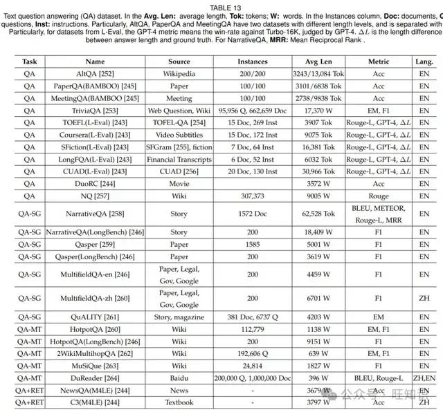
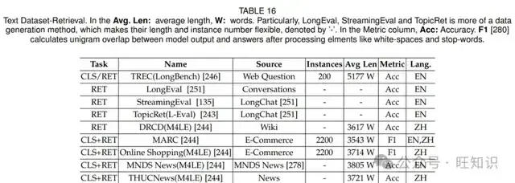

# 深度剖析&大语言模型KV缓存管理加速技术全面综述
> _**作者: 旺知识**_
> 
> _**综述:**_ [_**https://zhuanlan.zhihu.com/p/15862370960**_](https://zhuanlan.zhihu.com/p/15862370960)

随着[大语言模型](https://zhida.zhihu.com/search?content_id=252195164&content_type=Article&match_order=1&q=%E5%A4%A7%E8%AF%AD%E8%A8%80%E6%A8%A1%E5%9E%8B&zhida_source=entity)在各个领域的广泛应用,其在推理时的计算和内存需求成为了关键问题.KV 缓存管理技术应运而生,通过[优化缓存](https://zhida.zhihu.com/search?content_id=252195164&content_type=Article&match_order=1&q=%E4%BC%98%E5%8C%96%E7%BC%93%E5%AD%98&zhida_source=entity)来提高模型效率.本文对该领域的技术进行了全面梳理,有助于研究人员了解现有方法,为进一步改进和创新提供基础,推动大语言模型在实际应用中的发展,使其能更好地服务于自然语言处理、计算机视觉等众多领域,满足长上下文和实时应用的需求.

本文围绕大语言模型(LLMs)的 KV 缓存管理展开,阐述其在模型推理中面临的计算和内存挑战,详细介绍了令牌级(如选择、预算分配、合并、量化、[低秩分解](https://zhida.zhihu.com/search?content_id=252195164&content_type=Article&match_order=1&q=%E4%BD%8E%E7%A7%A9%E5%88%86%E8%A7%A3&zhida_source=entity))、模型级(注意力分组与共享、架构更改、非 Transformer 架构)和系统级(内存管理、调度、硬件感知设计)的优化策略,提及用于评估的文本和[多模态数据集](https://zhida.zhihu.com/search?content_id=252195164&content_type=Article&match_order=1&q=%E5%A4%9A%E6%A8%A1%E6%80%81%E6%95%B0%E6%8D%AE%E9%9B%86&zhida_source=entity)及基准,总结了现有研究成果与未来研究方向,旨在为提升 LLM 效率的研究提供全面指导.

摘要&解读
-----

大语言模型(LLMs)凭借其理解上下文和进行逻辑推理的能力,在自然语言处理、计算机视觉和多模态任务等众多领域引发了变革.然而,LLMs在计算和内存方面的需求,尤其是在推理过程中,给将其扩展到现实世界、长上下文和实时应用带来了重大挑战.键值(KV)[缓存管理](https://zhida.zhihu.com/search?content_id=252195164&content_type=Article&match_order=3&q=%E7%BC%93%E5%AD%98%E7%AE%A1%E7%90%86&zhida_source=entity)作为一种关键的优化技术应运而生,它通过减少冗余计算和提高内存利用率来加速LLM推理.本综述全面概述了用于LLM加速的KV缓存管理策略,将其分为令牌级、模型级和系统级优化.令牌级策略包括KV缓存选择、预算分配、合并、量化和低秩分解; 模型级优化侧重于架构创新和注意力机制以增强KV重用; 系统级方法则着眼于内存管理、调度和硬件感知设计,以提高不同计算环境下的效率.此外,本综述还介绍了用于评估这些策略的文本和多模态数据集及基准.通过呈现详细的分类和比较分析,本文旨在为研究人员和从业者提供有用的见解,以支持高效且可扩展的KV缓存管理技术的发展,推动LLMs在实际应用中的部署.

*   研究背景:  大语言模型在诸多领域取得成功,但在推理过程中面临计算和内存瓶颈,KV 缓存管理成为提升其效率的关键,现有研究在多方面进行了探索,但仍有改进空间,本文旨在全面梳理和分析相关技术.
*   研究贡献:  对 KV 缓存管理技术进行了全面分类总结,详细阐述了不同层次(令牌级、模型级、系统级)的多种创新优化策略,为研究人员提供了系统的参考框架,有助于推动该领域技术的进一步发展和创新.
*   实现设计:  在令牌级通过多种方式对 KV 缓存进行精细操作; 模型级从架构和注意力机制等方面设计新方法; 系统级从内存管理、调度和硬件感知等角度进行优化设计,各层次多种技术相互配合,共同实现提升大语言模型效率的目标.

1\. 引言
------

在大规模语料上训练的大语言模型(LLMs)已经彻底改变了自然语言处理、计算机视觉和多模态任务等多个领域.它们理解上下文和进行逻辑推理的能力使其在[时间序列分析](https://zhida.zhihu.com/search?content_id=252195164&content_type=Article&match_order=1&q=%E6%97%B6%E9%97%B4%E5%BA%8F%E5%88%97%E5%88%86%E6%9E%90&zhida_source=entity)、推荐系统、自动驾驶和医疗保健等领域取得了显著成功.这些突破得益于先进的架构和训练范式,使模型在各种任务中表现出色.著名的LLMs,如GPT、LLaMA、DeepSeek、Mistral和GLM等,都基于基础的Transformer架构,该架构擅长捕捉顺序数据中的长距离依赖关系.然而,尽管它们功能强大,但LLMs在计算和内存方面的需求,尤其是在推理阶段,在将其扩展到现实世界、长上下文和实时应用时带来了巨大挑战.

LLM推理的一个关键瓶颈在于键值(KV)对的有效管理.近年来,[缓存技术](https://zhida.zhihu.com/search?content_id=252195164&content_type=Article&match_order=1&q=%E7%BC%93%E5%AD%98%E6%8A%80%E6%9C%AF&zhida_source=entity)被广泛用于存储先前计算的中间结果,以便在后续推理步骤中重复使用,从而加速模型,如在图神经网络中.幸运的是,LLMs固有的自回归生成机制为利用[KV缓存](https://zhida.zhihu.com/search?content_id=252195164&content_type=Article&match_order=4&q=KV%E7%BC%93%E5%AD%98&zhida_source=entity)进行高效文本生成提供了机会.具体来说,自回归生成使LLMs能够逐个令牌地生成文本,每个令牌都依赖于之前生成的所有令牌.虽然这种方法在生成连贯且上下文相关的输出方面非常有效,但对于长输入序列,其扩展性较差,因为计算和内存需求随序列长度呈二次增长.KV缓存通过存储先前解码步骤的键和值矩阵来解决这个问题,使其能够被重复使用,从而显著减少冗余计算.

最近的一些综述探讨了高效大语言模型(LLMs)的领域.这些综述主要研究了LLM效率的各个方面,提供了有价值的见解,但仍有进一步改进和创新的空间.特别是,许多这些工作主要关注提高LLM效率的整体方法,研究了跨多个维度的广泛技术,如数据级优化(例如,[提示工程](https://zhida.zhihu.com/search?content_id=252195164&content_type=Article&match_order=1&q=%E6%8F%90%E7%A4%BA%E5%B7%A5%E7%A8%8B&zhida_source=entity))、模型架构级优化(例如,高效的Transformer设计)和系统级优化(例如,任务调度).例如,Ding等人探索了整合数据级和模型架构视角的效率技术,而Miao等人从综合系统级视角研究了高效的LLM推理.同样,Tang等人、Wan等人和Xu等人提供了涵盖数据、模型和系统级优化的分析,反映了LLM加速的整体方法.

另一方面,一些综述专注于LLM加速的更专业方面.例如,Zhu等人、Park等人、Wang等人和Tang等人专注于模型压缩作为模型级优化的关键方面.同样,Kachris等人研究了为LLMs量身定制的硬件加速策略,而Xu等人调查了参数高效的调整方法.Albalak等人讨论了数据选择策略以提高LLM训练的效率,Xia等人强调了诸如[推测解码](https://zhida.zhihu.com/search?content_id=252195164&content_type=Article&match_order=1&q=%E6%8E%A8%E6%B5%8B%E8%A7%A3%E7%A0%81&zhida_source=entity)等协作技术来加速模型推理.Li等人专注于提示压缩.与我们的工作类似,Shi等人、Li等人和Yuan等人也探索了使用KV缓存来加速LLMs.然而,我们的综述是互补的且更全面,提供了基于文本和多模态LLMs的KV缓存管理的详细分类.我们从令牌级、模型级和系统级的角度对技术进行分类,并包括文本和多模态场景的基准.特别是,与现有的KV缓存综述互补,我们详细比较了令牌级、模型级和系统级现有模型的差异和优势.

具体而言,本综述全面概述了KV缓存管理的现状及其在加速LLM推理中的作用.我们首先介绍Transformer架构以及KV缓存在实现高效[自回归文本](https://zhida.zhihu.com/search?content_id=252195164&content_type=Article&match_order=1&q=%E8%87%AA%E5%9B%9E%E5%BD%92%E6%96%87%E6%9C%AC&zhida_source=entity)生成中的作用.然后,我们分析了与KV缓存管理相关的挑战,包括其对计算复杂性、内存使用和实时性能的影响.接下来,我们提出了现有优化技术的分类,将其分为令牌级、模型级和系统级优化方法.此外,我们讨论了用于基准测试这些技术的数据集和评估指标,并提供了它们在各种任务和应用中的有效性的见解.

2\. 预备知识
--------

在大规模语料上预训练的大语言模型(LLMs)在上下文理解和逻辑推理方面表现出卓越的能力.这些模型在包括自然语言处理和计算机视觉等多个领域的广泛任务中取得了显著成功.主流的LLMs,如GPT、LLaMA和DeepSeek,主要基于Transformer架构.为了探索键值(KV)缓存管理在加速LLM计算中的作用,我们首先概述Transformer模型的核心组件,然后介绍管理KV缓存以加速LLMs的机制.本综述中的重要符号总结在表1中.

2.1 Transformer架构
-----------------

Transformer由于能够有效捕捉顺序数据(如文本)中的长距离依赖关系,已成为LLMs的骨干.这种能力使其特别适合机器翻译、文本生成和图像字幕等任务.Transformer架构遵循编码器 - 解码器结构,大多数LLMs仅使用解码器组件.我们首先介绍基于Transformer的解码器的核心组件,然后描述关键的自回归生成机制.特别地,我们不描述Transformer中的某些组件,如归一化,因为它们不影响对KV缓存管理的理解.

2.1.1 Transformer解码器
--------------------

如图1所示,基于解码器的Transformer架构由多个堆叠的Transformer块组成,每个块旨在有效地处理顺序数据.通常,一个Transformer块由两个核心组件组成,即[多头自注意力](https://zhida.zhihu.com/search?content_id=252195164&content_type=Article&match_order=1&q=%E5%A4%9A%E5%A4%B4%E8%87%AA%E6%B3%A8%E6%84%8F%E5%8A%9B&zhida_source=entity)(MHSA)机制和前馈神经网络(FFN).这些块按顺序排列,一个块的输出作为下一个块的输入.这种迭代设计使模型能够逐步完善对输入序列的理解,使其在文本生成和语言建模等任务中非常有效.

2.1.2 自回归生成机制
-------------

2.2 Transformer模型中的键值缓存
-----------------------

自回归生成是一种强大的机制,使LLMs能够生成高质量、上下文连贯的文本.然而,对于长序列,它在计算上存在挑战,因为在生成过程中每个令牌都需要重新计算键和值.KV缓存优化通过存储先前计算的键和值并在后续令牌生成中重复使用它们来解决这个问题,从而减少冗余计算并提高推理效率.

2.2.1 带KV缓存的自回归生成
-----------------

2.2.2 时间和空间复杂度分析
----------------

因此,对于相同的LLM模型,存储KV对所需的额外空间主要取决于缓存令牌的数量和缓存键值的精度.为了解决这个问题,现有的方法探索了各种技术来减少额外的空间消耗,例如只缓存最重要的键和值或应用量化技术来降低存储键值的位精度.

2.3 KV缓存管理的挑战
-------------

如2.2.2节所分析的,重用缓存的KV对使LLM能够避免如 2.2.2 节所分析的,重用缓存的 KV 对使 LLM 能够避免重新计算过去的令牌,从而在推理过程中显著提高速度.然而,随着序列长度的增加,KV 缓存的大小也会成比例增加,这给内存带来了巨大压力.因此,如何有效地管理这个缓存以在不过度使用空间的情况下加速 LLM 计算成为了一个具有挑战性的问题.

*   **缓存淘汰策略**: 当缓存达到其容量时,确定要淘汰哪些项是一个复杂的问题.像最近最少使用(LRU)或最不经常使用(LFU)这样的流行策略与 LLM 的模式不匹配,会导致次优性能.
*   **内存管理**: KV 缓存所需的内存随序列长度和层数线性增长,这可能会迅速超过硬件内存限制,特别是对于长序列.因此,管理不同类型的存储硬件(如 GPU、CPU 或外部内存)之间的协作成为一个重大挑战.
*   **延迟瓶颈**: 在每个解码步骤访问和更新缓存可能会引入延迟,特别是对于内存带宽有限的硬件.
*   **压缩权衡**: 压缩 KV 缓存可以减少内存使用,但如果关键信息丢失可能会降低模型性能.
*   **动态工作负载**: 处理动态和不可预测的工作负载,其中访问模式和数据需求频繁变化,需要自适应的缓存策略能够实时响应.
*   **分布式协调**: 在分布式 KV 缓存中,维护多个节点之间的协调以确保一致性、容错性和高效的资源使用增加了显著的复杂性.

3\. 分类
------

在上述部分中,我们分析了缓存的键值(KV)对的数量如何在推理过程中显著影响计算时间和所需的额外内存.高效的 KV 缓存管理对于平衡性能提升和资源利用至关重要,尤其是在序列长度和模型大小不断增长的情况下.在仔细回顾现有方法后,我们将 KV 缓存优化策略分为三个层次: 令牌级优化、模型级优化和系统级优化.每个层次都针对与 KV 缓存管理相关的特定挑战,并提供不同的技术来提高效率.详细分类如图 2 所示.

*   **令牌级优化** 是指通过专注于令牌级别的精细选择、组织和压缩来提高 KV 缓存管理效率,而无需对原始模型进行架构更改.KV 缓存选择(4.1 节)侧重于优先存储和仅保留最相关的令牌.KV 缓存预算分配(4.2 节)动态地在令牌之间分配内存资源,以确保在有限内存下高效利用缓存.此外,KV 缓存合并(4.3 节)通过组合相似或重叠的 KV 对来减少冗余,而 KV 缓存量化(4.4 节)通过降低缓存 KV 对的精度来最小化内存占用.最后,KV 缓存低秩分解(4.5 节)使用低秩分解技术来减小缓存大小.
*   **模型级优化** 是指设计高效的模型结构以优化 KV 缓存管理.这可以进一步分为几种策略: 注意力分组和共享(5.1 节)方法检查键和值的冗余功能,并在或跨 Transformer 层对 KV 缓存进行分组和共享.架构更改(5.2 节)旨在设计新的注意力机制或构建外部模块以进行 KV 优化.此外,还有一些工作设计或组合非 Transformer 架构(5.3 节),采用其他内存高效设计如循环神经网络来优化传统 Transformer 中的 KV 缓存.
*   **系统级优化** 是指通过两个经典的低级方面优化 KV 缓存管理: 内存管理(6.1 节)和调度(6.2 节).内存管理技术侧重于架构创新,如虚拟内存适应、智能前缀共享和层感知资源分配,而调度策略则通过前缀感知方法实现多样化的优化目标,以最大化缓存重用,采用抢占式技术实现公平的上下文切换,并采用层特定机制进行细粒度的缓存控制.此外,我们在 6.3 节详细介绍了硬件加速器设计,包括单/多 GPU、基于 I/O 的解决方案、异构计算和基于 SSD 的解决方案.

4\. 令牌级优化
---------

在令牌级别,优化完全专注于基于令牌的 KV 对的特征和模式来改进 KV 缓存,而不考虑模型架构改进或系统并行化技术带来的增强.一般来说,令牌级优化方法主要由对 LLM 和顺序输入的观察所指导.现有方法可以分为五种主要类型: KV 缓存选择、KV 缓存预算分配、KV 缓存合并、KV 缓存量化和 KV 缓存低秩分解.令牌级优化的分类如图 3 所示.

4.1 KV 缓存选择
-----------

KV 缓存选择机制已成为一种关键的优化策略,旨在减少 KV 缓存的内存利用率,最小化推理延迟,并提高大语言模型的整体吞吐量.这些优化目标推动了各种选择方法的发展,这些方法可分为两个不同的类别: (1)静态 KV 缓存选择,在预填充阶段仅对令牌进行过滤,选择的令牌在后续解码步骤中保持固定; (2)动态 KV 缓存选择,在解码阶段持续更新 KV 缓存,实现自适应缓存管理.在动态 KV 缓存选择方法中,未被选择的 KV 缓存令牌可能会被永久淘汰或卸载到分层缓存设备(如 CPU 内存)中,实现多层存储策略.鉴于在解码期间实时进行 KV 缓存选择可能会产生大量计算开销,一些研究专注于开发优化的检索算法以提高该过程的效率.这些优化包括以块级而不是令牌级粒度进行检索以降低搜索复杂度、异步查询机制以隐藏延迟以及并行检索管道以加速选择过程.这些优化努力旨在减轻计算负担,同时保持令牌选择的有效性.KV 缓存选择的总结如表 2 所示.

4.1.1 静态 KV 缓存选择
----------------

静态 KV 缓存选择方法在预填充阶段完成后立即对 KV 缓存进行一次性压缩.然后模型使用这个压缩后的 KV 缓存进行后续的解码推理.FastGen 引入了一种模式感知方法,通过识别五种基本的注意力结构并实施有针对性的选择策略.这些策略包括基于邻近性保留局部注意力模式、选择性保留关键令牌以关注标点、基于频率过滤稀疏注意力分布以及完全保留令牌以应对广泛的注意力模式.SnapKV 通过仅根据重要性分数检索令牌简化了 FastGen 的方法.它表明在所有提示令牌中,只有一部分携带对响应生成至关重要的信息,并且这些令牌在生成阶段保持其重要性.该方法使用位于末尾的观察窗口来检测这些重要的上下文令牌.然后将它们相应的键值对与观察窗口中的令牌连接起来.Attention-Gate 引入了一种可学习的 KV - Cache 淘汰机制,它处理整个上下文序列并通过参数化策略网络生成令牌级别的淘汰决策,实现动态上下文内存管理.

4.1.2 动态选择与永久淘汰
---------------

这类方法在解码阶段频繁进行 KV 缓存选择,永久从内存中删除未被选择的 KV 缓存令牌.早期的工作采用滑动窗口机制来应对长文本推理挑战,其中落在窗口外的令牌被永久淘汰且无法访问.StreamingLLM 揭示了 Transformer 注意力中的一个关键现象,即初始序列令牌的保留键值对维持着关键的模型性能.这种注意力汇聚效应表现为早期位置的注意力权重不对称积累,而与语义重要性无关.该方法利用这一特性,将注意力汇聚位置与最近的上下文结合起来进行高效处理.LMInfinite 表明传统技术,包括滑动窗口模式和相对位置编码,无法解决长度泛化问题.该研究通过集成 Λ 形注意力掩码和注意力距离上限机制引入了一种新的方法.

最近的工作探索了利用注意力分数作为选择重要 KV 缓存令牌的标准.H2O 观察到注意力计算主要由一组具有高影响力的令牌(称为重击球手(H2))驱动.这种方法将缓存优化重新表述为一个动态子模问题,利用累积注意力分数来指导令牌保留决策.与 H2O 不同,BUZZ 采用类似蜂巢的结构,在局部 KV 缓存段中选择重击球手.NACL 识别出 H2O 的一个基本限制,即它们依赖于可能有偏差的局部注意力统计信息.为了克服这个问题,他们开发了一种替代方法,实施多样化的随机淘汰策略进行令牌选择.Scissorhands 基于时间重要性原则,即表明在历史上重要的令牌在后续计算步骤中保持其影响力.这一观察使得通过选择性令牌保留来保留重复的注意力模式成为可能.此外,Keyformer 揭示了令牌删除会扭曲潜在的 softmax 概率分布.考虑到 softmax 分布在令牌重要性评估中的关键作用,他们纳入正则化技术来减轻这些分布扰动.SepLLM 观察到分隔符令牌(例如逗号、句号和换行符)获得不成比例的高注意力分数并且自然地总结文本段.基于此,SepLLM 在缓存中保留分隔符令牌以及初始令牌、重要令牌和最近的令牌.

4.1.3 动态选择无永久淘汰
---------------

上述基于永久淘汰的方法面临两个显著的限制.首先,令牌的不可逆淘汰可能会损害模型在长序列任务上的性能,特别是在大海捞针的场景中,并且这些方法在适应多轮对话上下文方面具有挑战性.其次,在解码阶段进行 KV 缓存选择会引入计算开销,对解码延迟产生不利影响并损害端到端加速.为了解决这些挑战,一些研究专注于开发在解码阶段无永久淘汰的 KV 缓存选择策略.这些方法通常采用多层缓存系统(例如 CPU - GPU 分层缓存)并利用先进的数据结构和系统级增强来优化检索效率,从而在减少 GPU KV 缓存占用的情况下实现高效推理.

为了加速关键令牌的检索,一些研究工作提出了基于索引的方法,以块或簇粒度组织和访问 KV 缓存,实现高效的查询和提取操作.InfLLM 以块为单位维护完整的 KV 缓存,并通过分层存储策略促进长序列处理.该框架协调 CPU - GPU 内存,将基本令牌和当前计算单元保留在 GPU 内存中,同时将不太频繁访问的单元卸载到 CPU 内存.为了进一步提高 top k 块检索精度,Quest 框架提出了一种基于 KV 缓存块中最小和最大键值的改进块表示方法.PQCache 也实现了基于块的 KV 缓存管理,并通过最大内积搜索(MIPS)识别显著令牌,利用乘积量化(PQ)码和质心.SqueezedAttention 在离线阶段使用 K - 均值聚类将语义相似的键分组,每个组由一个质心表示.在推理过程中,它将输入查询与这些质心进行比较,以识别并仅从上下文中加载语义相关的键.类似地,RetrievalAttention 使用近似最近邻搜索(ANNS)技术对 KV 缓存令牌进行索引.此外,EM - LLM 动态地将传入令牌分割为情节事件.此外,它实现了一种混合检索机制,将语义相似性匹配与时间上下文相结合,以高效访问相关的 KV 缓存段.

为了加速 top - k 令牌识别,SparQ 识别传入查询向量中的 r 个最显著元素,并选择性地检索缓存键矩阵 K 的隐藏维度上的相应组件以进行近似注意力计算.为了重叠预取延迟,InfiniGen 采用异步预取,利用来自前一层查询选择的显著 KV 条目索引来检索当前层的 KV 缓存条目.为了确保最大模型性能,RecycledAttention 在推理计算期间维持整个 KV 缓存,在内存效率方面没有改进.该方法执行周期性的 top - k 令牌选择以识别显著令牌.此外,MagicPIG 表明基于注意力的 top k 选择可能会导致性能下降.为了解决这个限制,他们引入了一种新颖的异构计算框架,利用局部敏感哈希(LSH)技术.该系统存储 LSH 哈希表并在 CPU 上进行注意力估计.

4.1.4 总结与未来方向
-------------

静态 KV 缓存选择算法在整体解码效率方面表现出色; 然而,它们在多轮对话和扩展解码长度场景中的有效性仍有待彻底验证.动态 KV 缓存选择算法虽然具有自适应性,但由于在解码阶段频繁进行缓存选择操作,会引入额外的计算开销.多层缓存架构和预取方案部分缓解了这些挑战,但其在可接受的解码延迟约束内实现快速准确检索的能力需要进一步的实证验证,特别是在涉及长序列的实际应用中.此外,现有的选择方法主要依赖于基于注意力分数的 top - k 选择机制.然而,基于现有的位置编码方案,当前的 top - k 方法可能无法在超长序列任务中有效地识别和提取相关令牌.

4.2 KV 缓存预算分配
-------------

LLM 的分层架构导致跨层的信息提取模式各不相同,每个层的 KV 缓存对模型性能的贡献也不同.这种固有的异质性表明,跨层的统一 KV 缓存压缩可能不是最优的.KV 缓存预算分配通过根据每个组件对预测准确性的重要性智能分配内存资源来解决这一挑战,从而在最小化准确性下降的同时优化内存利用.当前的预算分配策略可以分为两个粒度级别: 层间预算分配,在模型层之间分配不同的压缩比; 以及更精细的头间预算分配,在每个层内的各个注意力头之间实现精确的内存分配,提供更灵活和有针对性的优化机会.KV 预算分配的总结如表 3 所示.

4.2.1 层间预算分配
------------

与具有统一 KV 缓存大小的传统方法不同,PyramidKV 采用金字塔形内存分配策略,为较低层分配较大的缓存容量,在上层逐渐减少.这种设计基于以下观察: 较低层在输入序列上表现出均匀的注意力分布,而较高层则集中在特定令牌上.PyramidInfer 也采用金字塔形预算分配策略,并在每层选择具有高注意力值的令牌.此外,在解码阶段,PyramidInfer 通过由注意力值驱动的频繁更新动态维护一组重要令牌.与以前的方法不同,DynamicKV 通过分析注意力模式实现输入自适应预算分配策略.具体来说,它计算最近和历史上具有最高注意力值的 to k 令牌之间的平均注意力分数,并根据每层中重要令牌的密度按比例分配预算.类似地,PrefixKV 通过计算每层内令牌的平均注意力分数来识别每层的最重要令牌.PrefixKV 然后使用统一阈值确定保留令牌的数量,并根据其重要性分布自适应地调整每层的保留.CAKE 通过两个视角检查注意力分数: 令牌间注意力的空间分布和注意力焦点的时间演变.这些测量值相结合来计算层特定的重要性分数,进一步指导内存资源的分配.此外,SimLayerKV 识别出懒惰层——那些在捕捉长距离依赖方面效果有限的层.该框架然后选择性地保留缓存条目,为懒惰层保留初始和最近的令牌,而为非懒惰层保留完整的 KV 缓存.

4.2.2 头间预算分配
------------

AdaKV 利用注意力模式在不同头之间表现出明显集中的观察结果.它通过优化原始和修剪后的多头注意力输出之间的 L1 损失界来实现特定于头的内存分配.在层间预算的约束下,该方法在头之间分配缓存容量,以最大程度地共同保留注意力信息.在 AdaKV 的基础上,CriticalKV 通过认识到 KV 缓存条目的重要性不仅在于注意力权重,还包括值状态和预训练参数矩阵,引入了显著的增强.利用这一见解,该框架实施了一种新颖的选择算法,通过最小化最大潜在输出扰动来识别关键缓存条目.LeanKV 实施了一种精细的内存优化策略,针对每个注意力头和输入请求独立运行.该方法识别出保留大部分信息流所需的最小令牌子集,并根据预定义的注意力分数阈值(通常保持总注意力质量的 95%)分配缓存空间.

基于检索头的方法代表了一种专门的头间分配策略类别,专注于识别和优先考虑对于从长序列中提取关键信息至关重要的注意力头.这种方法为这些专门的头(称为检索头)分配更大的缓存预算,因为它们在信息提取中起着重要作用.RazorAttention 表征了两种不同类型的检索头: 回显头,专注于先前出现的相同令牌; 诱导头,关注当前令牌重复之前的先行令牌.该框架实施了差异化缓存策略,为检索头保留完整的缓存条目,同时将远程令牌压缩为合并的补偿令牌用于非检索头.HeadKV 通过引入一种新颖的头评估框架进一步增强了 RazorAttention,该框架同时评估检索和推理能力,以优化 KV 缓存分配策略.DuoAttention 进一步引入了一种参数化方法来区分两种类型的注意力机制: 检索头,对于全面的长上下文处理至关重要; 流城头,主要处理最近的令牌和注意力汇聚.这种分类是通过学习的参数实现的,这些参数自动识别需要完整注意力跨度的检索头.

4.2.3 总结与未来方向
-------------

尽管在 KV 缓存预算分配研究方面取得了近期进展并受到越来越多的关注,但仍有几个关键挑战尚未解决.首先,分配策略与模型性能之间的关系需要进一步研究.例如,金字塔形分配策略(如 PyramidKV、PyramidInfer)主张为较低层分配更大预算,与基于检索头的研究(如 RazorAttention、HeadKV)之间存在明显差异,后者表明较低层很少表现出检索头特征,因此需要最少的缓存资源.此外,该领域缺乏全面的实验比较,特别是关于头间预算分配策略与最先进框架(如 vLLM、FlashAttention)的兼容性和性能优势.此外,现有方法如 PyramidInfer 展示了对输入注意力模式的一定适应性.然而,未来的研究可以针对实时、特定任务的分配策略,这些策略在推理过程中根据输入特征、任务复杂性或下游要求动态调整内存预算.

4.3 KV 缓存合并
-----------

KV 缓存合并通过压缩或整合 KV 缓存而不显著降低模型准确性,提供了一种有前途的解决方案.与统一压缩策略不同,KV 缓存合并技术利用层内和层间的固有冗余来动态优化内存利用.这些方法旨在减小 KV 缓存的大小,同时保留准确这些方法旨在减小 KV 缓存的大小,同时保留准确注意力计算所需的关键信息,从而在资源受限的环境中实现高效推理.

现有 KV 缓存合并策略可分为两种主要方法: 层内合并,侧重于在单个层内整合 KV 缓存以减少每层的内存使用; 跨层合并,针对层间冗余以消除不必要的重复.这两种方法相互补充,提供了在平衡内存节省和模型性能下降方面的灵活性.KV 缓存合并的总结如表 4 所示.

4.3.1 层内合并
----------

随着输入序列长度的增加,键和值的数量会增加,导致注意力过程的计算成本更高.为了解决这个问题,CCM、LoMA、DMC 提出学习一个压缩模块来压缩令牌的 KV.

具体来说,CCM 在输入序列中插入一个特殊的指示符令牌 \[COMP\],并将这些指示符之间的每个层中累积的过去注意力键/值(KV)对压缩到一个紧凑的内存空间中.这种压缩利用了受 Compressive Transformer 和 Gisting 启发的技术.CCM 不是对所有令牌计算注意力,而是通过参考合并的令牌为每个新令牌计算注意力分数.类似地,LoMA 在输入序列中插入一个特殊令牌来确定应压缩哪些连续令牌.LoMA 使用双向注意力、重复区域监督以及精心设计的注意力掩码和损失函数进行压缩.DMC 学习一个变量,以决定在必要时是将新的 KV 对附加到缓存中还是使用加权平均将它们合并到现有的 KV 表示中.需要注意的是,CCM、LoMA 和 DMC 需要监督学习来学习压缩模块.

相反,CaM、KVMerger 和 D2O 是无需训练的,它们依赖于观察并直接提出基于规则或启发式的合并策略.具体来说,它们将每个层中的令牌键和值分为重要(保留)和不重要(淘汰)的令牌.然后,它们通过将不重要令牌的键和值与保留的重要令牌合并来保留可能有用的不重要令牌,确保不会丢失有价值的信息.特别是,D2O 根据[余弦相似度](https://zhida.zhihu.com/search?content_id=252195164&content_type=Article&match_order=1&q=%E4%BD%99%E5%BC%A6%E7%9B%B8%E4%BC%BC%E5%BA%A6&zhida_source=entity)将被淘汰令牌的键(或值)与一个保留令牌合并.与基于余弦相似度的 D2O 类似,AIM 和 Look - M 将多个令牌的键(或值)合并为一个.CaM 根据注意力分数将多个被淘汰令牌的键(或值)与保留令牌合并以获得最终合并结果.此外,KVMerger 首先通过将具有高余弦相似度的连续令牌聚类来识别合并令牌集,确保只有具有强上下文相关性的相邻令牌被分组在一起.然后,KVMerger 使用高斯核权重将每个合并集中的令牌合并到关键令牌(根据最高注意力分数选择)中,其中较近的令牌对合并状态的贡献更大.

与将多个令牌的 KV 合并为一个不同,CHAI 观察到多头注意力中的头通常会为令牌产生高度相关的注意力分数,特别是在 LLM 的后期层中.为了利用这种冗余,CHAI 在每个层内将产生相似输出的注意力头聚类,并仅为每个簇中的一个代表性头计算注意力.具体来说,在每个簇内,CHAI 选择一个代表性头来执行注意力计算,并且计算的注意力分数在簇内的所有头之间共享.

4.3.2 跨层合并
----------

MiniCache 观察到中间到深层的 KV 缓存表现出高度的角度相似性,使其适合合并.为了实现这一点,MiniCache 将相邻相似层中每个令牌的键(和值)对合并为一个共享表示.具体来说,MiniCache 将 KV 向量分解为幅度和方向分量,仅存储共享方向向量、令牌幅度和不可合并的令牌,以最大化内存效率.不同的是,KVSharer 观察到一个违反直觉的现象: 在推理过程中,当两层的 KV 缓存差异很大时,将一层的 KV 缓存与另一层共享不会导致显著的性能下降.基于此观察,KVSharer 计算所有层对之间的 KV 缓存的[欧几里得距离](https://zhida.zhihu.com/search?content_id=252195164&content_type=Article&match_order=1&q=%E6%AC%A7%E5%87%A0%E9%87%8C%E5%BE%97%E8%B7%9D%E7%A6%BB&zhida_source=entity),根据不相似度对层对进行排序,并优先选择最不相似的层进行共享.由于 KVSharer 可以将一层的 KV 缓存共享给多个其他层,因此存储的 KV 缓存显著减少.

4.3.3 总结与未来方向
-------------

KV 缓存合并是一种通过整合或压缩 KV 缓存来优化 LLM 内存利用同时保持高模型准确性的变革性方法.然而,在这个领域未来的探索中仍有几个关键方向和挑战.首先,当前的 KV 缓存合并方法通常设计用于广泛的任务,但针对特定任务或领域微调合并策略可以进一步提高效率.例如,某些任务由于其注意力模式的固有冗余可能容忍更激进的合并,而其他任务可能需要更保守的方法来保持准确性.开发能够根据任务难度、序列长度或可用硬件资源动态调整压缩级别的自适应合并机制是未来工作的一个令人兴奋的方向.其次,稀疏注意力机制已经通过对令牌子集进行操作降低了注意力的计算复杂度,可以与 KV 缓存合并相结合以实现更高的效率.探索合并如何补充基于稀疏性的方法,如块稀疏或低秩注意力,可能会导致新的混合解决方案.第三,虽然实证结果表明合并不会显著降低性能,但提供关于关键信息保留的理论保证可以增强这些方法的可靠性.未来的工作可能侧重于量化合并策略、令牌重要性和注意力准确性之间的关系,以提供更正式的保证.

4.4 KV 缓存量化
-----------

量化技术已广泛用于从不同方面加速机器学习模型,如模型参数量化和数据特征量化.同样,键值(KV)缓存量化正在成为解决 LLM 中内存和计算瓶颈的极具前景的解决方案.在自回归解码过程中,LLM 为序列中的所有令牌在每个注意力层生成键值对.如果我们以全精度在内存中存储所有 KV 对,随着序列变长,这个缓存会呈指数增长,显著增加内存和带宽需求.量化通过降低数值表示的精度(例如,从 FP32 到 INT8 或 INT4),大幅压缩 KV 缓存的大小.这种压缩可以实现高达 4 倍或更多的内存节省,使得 LLM 能够在资源受限的设备(如 GPU 或边缘设备)上运行.

然而,键和值中的异常值给低比特量化带来了重大挑战,因为这些极端值在压缩到低比特表示时可能会导致严重的性能下降.基于所使用的技术,现有 KV 缓存量化方法可分为三大类: 固定精度量化,其中所有键和值都量化到相同的位宽; 混合精度量化,为缓存的关键部分分配更高精度,同时对不太重要的组件使用较低精度; 异常值重新分配,重新分配或平滑键和值中的异常值以提高量化质量.这些方法共同实现了高效的 KV 缓存压缩,同时减轻了通常与低比特量化相关的性能下降.

4.4.1 固定精度量化
------------

固定精度量化提议将不同令牌的键(不同值)量化到相同的位宽.ZeroQuant 提出对键和值进行逐令牌量化.如图 4 所示,逐令牌量化方法单独对令牌进行量化.特别是,ZeroQuant 在推理过程中动态计算每个令牌的最小 - 最大范围.这确保每个令牌根据其独特范围进行量化,显著降低量化误差.此外,FlexGen 和 QJL 直接对键和值进行逐令牌量化,其中缩放因子和零点在同一令牌内的所有元素之间共享.PQCache 使用乘积量化方法压缩 KV 对.然而,使用固定位宽对所有令牌的键和值进行量化的统一量化方法通常不是最优的.这是因为它们忽略了令牌的不同重要性,并考虑了键和值中的异常值模式.

4.4.2 混合精度量化
------------

与将所有键或值量化到相同位宽(例如 4 位或 8 位)的固定精度量化不同,混合精度量化为关键令牌和部分的键和值分配更高或全精度,同时对不太关键的部分使用较低精度.KV 混合精度量化的总结如表 5 所示.KVQuant 基于观察提出了几种平滑量化键和值的策略.首先,KVQuant 观察到在应用 Rotary Positional Embedding(RoPE)之前,键值在特定通道中存在异常值.然而,在应用 RoPE 之后,这些异常通道的幅度变得不太一致,这给低精度量化带来了独特的挑战.因此,KVQuant 提议在应用 RoPE 操作之前按通道对键进行量化,并对值进行逐令牌量化.其次,KVQuant 观察到 KV 缓存激活包含使量化范围倾斜的异常值.为了解决这个问题,它们按向量(例如按通道或逐令牌)隔离异常值,以稀疏格式存储它们,并将其余值量化到更窄的范围.第三,LLM 不成比例地为第一个令牌(即注意力汇聚)分配高注意力分数,量化第一个令牌会损害 LLM 的性能.因此,KVQuant 保留第一个令牌为全精度(FP16),同时量化序列的其余部分,IntactKV 和 SKVQ 也采用了这种方法.与 KVQuant 类似,KIVI 按通道对键缓存进行量化,因为某些通道存在较大异常值,而对值缓存进行逐令牌量化,因为值缓存中没有明显的异常值模式.此外,KIVI 保留最近的键和值为全精度,同时量化较旧的 KV.这种方法基于这样的观察: 最近的 KV 对于生成后续令牌至关重要.

与 KIVI 类似,WKVQuant 暂时保留最近的键和值为全精度,同时仅量化过去的 KV 缓存.这种方法有助于在计算过程中保持精度.此外,WKVQuant 引入了一种二维量化策略,通过优化参数矩阵将 KV 缓存中的值对齐到更平滑和更均匀的范围,显著提高量化质量.GEAR、MiKV、ZipCache 和 ZIPVL 根据每个令牌的重要性对 KV 缓存进行量化,以实现高效且有效的压缩.首先,GEAR 应用量化将大多数不太重要的条目(例如 98%)压缩到超低精度,显著降低内存使用.接下来,GEAR 采用低秩矩阵来近似残差误差,捕捉数据中的结构化模式.此外,GEAR 使用稀疏矩阵存储异常值,纠正由这些值引起的个别误差.MiKV 是一种混合精度 KV 缓存量化方法.基于使用现有方法(如 H2O 和 SnapKV)测量的每个令牌的重要性,MiKV 将不太重要的 KV 对存储在低精度,同时保留最重要的 KV 对在高精度.PrefixQuant 不是近似每个令牌的重要性权重,而是准确计算每个令牌的重要性.与计算重要性分数不同,PrefixQuant 观察到令牌级异常值经常出现在固定位置(例如初始令牌)或低语义值令牌(例如“.”、“\\n”).基于此观察,PrefixQuant 离线识别 LLM 中的高频异常令牌,并在 KV 缓存中对其进行前缀标记,有效地消除了令牌级异常值.类似地,MiniKV 观察到重要令牌可以在生成之前识别并且在整个生成过程中保持一致,因此将这些重要令牌保留在高精度.

QAQ 提出了一种质量自适应量化方法,根据每个令牌的重要性和敏感性动态确定合适的量化位,同时处理异常值和例外情况以保持模型性能.SKVQ 引入了带有通道重排序的截断动态量化.首先,SKVQ 使用变换不变置换根据统计特征对相似通道进行分组,并应用截断动态量化来缓解异常值问题.其次,SKVQ 对初始令牌和最近令牌保持高精度,同时量化较旧令牌.因此,SKVQ 有效降低量化误差并提高量化模型的准确性.CacheGen 和 AsymKV 使用层间非对称量化,为敏感的早期层的键矩阵分配更高位精度,为不太敏感的层分配较低位精度,平衡内存效率和性能.特别是,CacheGen 还利用令牌局部性,通过编码相邻令牌的 KV 张量之间的差值(而不是原始值).Atom 识别并分离异常通道,重新排序矩阵将这些异常通道放在末尾,从而确保规则的内存访问模式以提高硬件利用率.然后,Atom 以更高精度量化异常值,而正常通道量化到 INT4 以实现最大效率.特别是,Atom 应用细粒度组量化,将矩阵划分为较小的子组(例如每组 128 个元素)并在每个子组内独立进行量化.

4.4.3 异常值重新分配
-------------

如前所述,键和值中的异常值对其量化构成了重大挑战.最近的研究提出了两种主要方法来解决这个问题: 将异常值重新分配到新添加的虚拟令牌中,或应用等效变换函数来平滑键和值以提高量化准确性.现有异常值重新分配模型的总结如表 6 所示.

具体来说,MassiveActivation 强调了大型语言模型(LLM)中大量激活的现象,其中一小部分激活比其余部分呈指数增长.为了解决这个问题,MassiveActivation 提议在输入中添加一个虚拟令牌,允许 LLM 将大量异常值封装在这些学习到的键和值中,针对每个头.然后,我们介绍基于等效变换函数的方法.首先,QuaRot、Qserve 和 Q - INT4 通过 Hadamard 旋转在所有通道上重新分配异常值,成功降低了异常令牌的最大值.激活的 Hadamard 旋转可以纳入前面的线性层,从而将键和值的异常值重新分配到参数中.尽管有此改进,但异常令牌的幅度仍然比正常令牌大数百倍,在跨令牌使用共享量化尺度时会导致明显的性能问题.在此基础上,SpinQuant 提议训练一个正交矩阵而不是依赖随机 Hadamard 矩阵来实现更好的性能.类似地,DuQuant 采用通道置换均匀分布块中的异常值,并利用块旋转进一步平滑异常值.

与使用手工制作的变换(如 DuQuant、SmoothQuant、OS +)将量化难度从激活转移到权重不同,AffineQuant 使用结合缩放和旋转变换的仿射变换矩阵.这使其能够更有效地优化权重分布,更好地使其与量化函数对齐并减少量化误差.仿射变换矩阵比 SmoothQuant 的基于标量的缩放提供了更丰富的灵活性,允许对权重和激活分布进行更精细的调整.基于 AffineQuant,FlatQuant 引入了一种快速且可学习的仿射变换来增强权重和激活的平坦度,它将变换分解为较小的矩阵以减少内存和计算成本.类似地,AWQ 和 OmniQuant 提出了可微且可学习的等效变换,使用梯度下降以端到端的方式优化等效参数(例如通道缩放和移位).

4.4.4 总结与未来方向
-------------

KV 缓存量化是在自回归解码过程中减少大型语言模型(LLM)内存和计算开销的关键技术.虽然已经取得了显著进展,但这个领域仍然充满活力且发展迅速,未来研究有几个有前途的方向.首先,一个有前途的途径是开发实时自适应量化方法.这些技术可以在推理过程中根据实时指标(如令牌重要性、异常值存在或序列长度)动态调整量化水平.这种方法可以在保持性能的同时显著提高效率,特别是对于处理具有不同复杂程度的长序列.其次,另一个重要方向是将 KV 缓存量化扩展到多模态和多任务模型.多模态模型处理来自不同领域(如文本、视觉和音频)的输入,多任务场景通常表现出高度多样化的注意力模式和内存需求.这就需要设计更先进和定制的量化策略,以在这些日益复杂的环境中平衡效率和准确性.

第三,混合量化技术也具有巨大潜力.通过结合固定精度、混合精度和异常值重新分配方法,研究人员可以开发出更通用和高效的量化框架.例如,将混合精度分配方案与异常值平滑变换相结合,可以优化内存使用和性能,提供一种适用于各种任务和模型的灵活方法.最后,解决异常值的挑战仍然是一个关键的关注领域.异常值可能会对量化效率和模型性能产生不成比例的影响.未来的研究可以探索先进的异常值检测机制或创新的编码技术来减轻它们的影响.改进对异常值的处理可以进一步提高量化方法的有效性,实现更稳健和内存高效的实现.

4.5 KV 缓存低秩分解
-------------

现有研究表明,KV 缓存中的大部分信息可以由其奇异值或低秩分量的一个小子集捕获,这使得低秩分解成为一种强大的压缩工具.通过利用这一特性,KV 缓存低秩分解技术旨在在保留准确注意力计算所需的基本信息的同时减少内存需求.低秩分解策略可分为三种主要方法: [奇异值分解](https://zhida.zhihu.com/search?content_id=252195164&content_type=Article&match_order=1&q=%E5%A5%87%E5%BC%82%E5%80%BC%E5%88%86%E8%A7%A3&zhida_source=entity)(SVD),利用 KV 矩阵的低秩结构保留最关键的奇异值; 张量分解,将 KV 矩阵分解为更小的组件以最小化冗余; 学习低秩近似,结合自适应机制根据学习的表示优化压缩.每种方法在计算效率和准确性保留之间提供了独特的平衡,从而实现可扩展且内存高效的 LLM 推理.

4.5.1 奇异值分解
-----------

此外,ShadowKV 直接对预 - RoPE 键执行 SVD 分解以降低键表示的维度.Palu 应用 SVD 压缩键和值.

4.5.2 张量分解
----------

4.5.3 学习低秩近似
------------

4.5.4 总结与未来方向
-------------

KV 缓存低秩分解是一种在压缩 KV 缓存的同时保持 LLM 注意力计算质量的强大技术.当前的方法主要依赖于在所有层或令牌上统一应用的固定低秩近似.然而,未来的进展可以集中在动态秩调整上,其中秩根据令牌重要性、序列长度或层特定属性进行定制,从而在内存效率和性能之间实现更优的平衡.此外,实时或流应用是一个有前途的探索方向.由于 KV 缓存在推理过程中动态增长,能够有效适应扩展序列的轻量级和增量分解方法对于支持此类场景而不影响延迟或准确性至关重要.

5\. 模型级优化
---------

在模型级优化中,为 Transformer 设计新的架构或机制以实现更高效的 KV 缓存重用.通常,这些方法需要对模型进行重新训练或微调才能生效.然而,也提出了高效的转换管道以实现向新架构的快速部署.根据对模型的改进位置和方式,我们将相关工作分为层内或跨层的分组和共享机制(5.1 节)、架构修改或增强(5.2 节)以及纳入非 Transformer 架构进行优化(5.3 节).模型级优化的分类如图 5 所示.

5.1 注意力分组和共享
------------

本节探讨注意力分组和共享方法作为优化键值(KV)管理的有效策略.我们将这些方法分为两个不同的子类型: 层内分组(5.1.1 节),侧重于在单个层内对查询、键和值头进行分组以减少冗余并提高效率; 跨层共享(5.1.2 节),在层间共享键、值或注意力组件以提高信息重用并减少 KV 缓存需求.注意力分组和共享的总结如表 7 所示.

5.1.1 层内分组
----------

Shazeer 首先引入了多查询注意力(MQA),它修改了传统的多头注意力机制.在 MQA 中,一个 Transformer 块中的所有注意力头共享一个单一的键和值.这个简单的策略可以大大加速解码过程.作者的实验表明,MQA 在仅产生轻微质量下降的情况下能显著提高效率.

MQA 是一种激进的策略,它不仅会导致质量下降,还会引起训练不稳定.GQA(分组查询注意力)引入了一种折衷方案,将查询头分为多个组,每个组共享自己的键和值.此外,还提出了一种升级训练过程,通过对每个组相关的键和值头进行平均池化,有效地将现有的 MHA 模型转换为 GQA 配置.实证评估表明,GQA 模型在性能上接近原始 MHA 模型,同时在推理时间上与 MQA 相当.

基于 GQA 有几个扩展.AsymGQA 通过提出一种基于激活的合并策略扩展了 GQA.它不是通过均匀聚类对头部进行分组,而是在训练期间根据它们的激活相似性动态确定查询的分组,并构建不对称的组结果,这导致更好的优化和泛化.加权 GQA 为每个键和值头引入额外的可训练权重,这些权重可以无缝集成到现有的 GQA 模型中.通过在训练期间调整权重,它提高了模型的性能而没有额外的推理开销.QCQA 利用进化算法为 GQA 识别最优的查询头分组,该算法由一个计算效率高的适应度函数指导,该函数利用权重共享误差和 KV 缓存来评估文本生成质量和内存容量.KDGQA 认为许多 GQA 的变体采用固定的分组策略,因此缺乏对训练期间键值交互演变的动态适应性.他们的动态键驱动 GQA 通过在训练期间使用键头范数自适应地分配组来解决这些问题,从而产生一种灵活的查询头分组策略并提高性能.

GQKVA 提出了一种广义的查询、键和值分组机制.它首先引入 MKVA 和 GKVA,其中键和值被分组以共享相同的查询.在此基础上,GQKVA 提出分别对查询和键值对进行分组.通常,查询被划分为组,键和值被划分为组,并且每个查询和键值对的组合将使用点积注意力进行交互.这导致个不同的输出.它概括了关于查询、键和值的不同分组策略,并保持了良好的计算效率和与 MHA 相当的性能.

5.1.2 跨层共享
----------

Brandon 等人引入了跨层注意力(CLA),它扩展了 GQA 和 MQA 的思想,通过在相邻层之间共享键和值头,进一步减少了 KV 缓存中的冗余.与 MQA 相比,这实现了额外的 2 倍 KV 缓存大小减少,在不改变计算复杂度的情况下显著提高了内存效率.

LCKV 提议仅计算和缓存一小部分层(甚至仅顶层)的键和值,然后让底层的查询与保存的键和值配对进行推理.这种方法不仅大大提高了推理速度并减少了内存消耗,而且与现有的内存节省技术正交,便于进一步优化.虽然这种机制使下一个令牌的计算依赖于前一个令牌的顶层键和值,这与 Transformer 的并行训练相矛盾,但 LCKV 引入了一种近似训练方法来支持并行训练.

SA(共享注意力)提议在多个层之间重用计算的注意力权重,而不是为每个层重新计算它们.与其他专注于共享键值缓存的方法不同,SA 利用在预训练的 LLM 中观察到的注意力分布的各向同性趋势,直接共享注意力权重,大大减少了计算开销和内存使用.

MLKV(多层键值)在多个 Transformer 层之间引入了一种简单的 KV 头共享机制.MLKV 在一层内使用与 MQA 相同的单个 KV 头,但它也在多个层之间共享这个 KV 头.这种极端策略将缓存大小减少到正常 GQA 策略的几乎 1%,并且实验表明 MLKV 仍然具有可比的性能.

LISA(注意力的轻量级替代)对跨层注意力模式的相似性进行了全面分析.直接在层间共享注意力权重是无效的,因为注意力头的不对齐和浅层的敏感性.LISA 通过纳入小型前馈网络来对齐层间的注意力头,并使用低秩矩阵来近似层间注意力权重的变化来解决这些挑战.这实现了查询和键参数的 6 倍压缩,同时保持了高准确性和困惑度.

Wu 等人引入了一个统一的框架,系统地分析和优化跨层键值缓存共享机制.他们整合了几种现有方法,在一个连贯的结构内探索新的变体,并对这些方法进行了全面评估.研究发现,将 KV 缓存大小减少 2 倍可以在吞吐量上优于标准 Transformer,而不会有显著的准确性损失,而进一步的减少需要额外的训练成本的替代设计.根据分析结果,他们提供了关于根据特定要求或约束选择合适的 KV 共享方法的见解.

CLLA(跨层潜在注意力)引入了一个集成框架,结合了多种策略: 注意力头大小和维度的减少、跨层缓存共享和 KV 缓存量化.通过统一这些策略,CLLA 实现了极端的 KV 缓存压缩,小于原始模型大小的 2%,同时保持了与未压缩模型相当的性能水平.

DHA(解耦头注意力)解决了 MHA 中的冗余问题,并自适应地配置跨层的键和值头共享组,减少了 KV 缓存需求.观察到聚类和融合相似的头可以减少 KV 缓存大小而不会显著降低性能,DHA 设计了一个搜索、融合和持续预训练框架,通过线性融合头参数,可以逐步将 MHA 检查点转换为 DHA 模型,以较小的预训练预算保留预训练知识.

观察到传统 Transformer 的后期层过度依赖狭窄的注意力区域,Zhou 等人引入了 ResFormer,它利用从第一层的值嵌入到所有后续层的残差连接,有效地近似跨层注意力,而不会产生显著的计算成本.然后他们提出了一个简化的变体 SVFormer,在所有层之间共享单个值嵌入,将 KV 缓存大小大幅减少近一半,同时保持有竞争力的性能.所提出的架构可以灵活地与其他 KV 高效策略结合,以进一步节省内存.

5.1.3 总结与未来方向
-------------

本节强调了通过层内分组和跨层共享机制优化内存和计算效率的创新策略.然而,仍有几个改进的途径.首先,在优化效率的同时保持性能,特别是对于精度敏感的任务,需要进一步研究.实施激进分组和共享机制的方法可能会在需要高精度的任务中损害模型的保真度.其次,跨不同模型架构和大小的可扩展性至关重要.像 DHA 和 LISA 这样依赖于特定架构假设的工作可能难以推广到新兴的 LLM 或非标准配置.第三,跨时间和层的注意力动态在很大程度上尚未得到探索.大多数现有方法依赖于静态或预定的分组和共享策略,忽略了注意力模式的时间和上下文变化.

为了解决这些挑战并充分发挥注意力优化的潜力,未来的研究应集中在以下几个方面.首先,开发通用的注意力分组和共享框架,需要最少的重新训练以提高适应性和可用性.其次,与其他优化技术(如量化和修剪)的协同集成具有显著的潜力,可以实现更大的效率提升.虽然一些工作如 CLLA 已经开始解决这些机会,但可以进行更多的探索以实现新的效率水平.第三,可以利用更动态和时间建模来在运行时自适应地调整分组和共享,以更好地捕捉不同任务和序列的上下文要求.最后,深入了解这些技术对微调和迁移学习的下游影响对于它们在实际场景中的有效应用至关重要.

5.2 架构更改
--------

本节探讨架构修改以优化 KV 缓存使用.我们将这些方法分为两个子部分: 改进注意力机制以提高 KV 缓存效率的方法(5.2.1 节)和引入结构变化以更好地管理 KV 的方法(5.2.2 节).许多这些工作建立在更广泛的高效注意力机制(如线性 Transformer、Performer、LinFormer 等)的基础上.由于我们的重点是直接影响 KV 缓存处理的方法,对于高效注意力机制的全面概述,我们建议读者参考专门的综述.用于 KV 重用的架构更改的总结如表 8 所示.

5.2.1 增强注意力
-----------

DeepSeek - V2 引入了多头潜在注意力(MLA),它采用低秩 KV 联合压缩机制,用压缩的潜在向量替换完整的 KV 缓存.该模型采用可训练的投影和扩展矩阵进行压缩.这种压缩机制显著减少了 KV 缓存的内存需求,并使模型能够处理长达 128K 令牌的序列.

FLASH 纳入了门控注意力单元(GAU)来替换传统 Transformer 中的 MHA 机制.GAU 利用具有门控功能的单头注意力机制,选择性地调制信息流中的重要性.FLASH 通过 GAU 模块采用线性近似方法进行注意力计算,使模型能够有效地处理长上下文,而不会出现传统自注意力的二次缩放问题,从而缓解了繁重的 KV 缓存问题.

Infini - Attention 采用表示压缩来存储长期内容.此外,他们引入了一种混合注意力机制,包括掩码局部注意力和长期线性注意力.掩码局部注意力取代了标准的 MHA,使模型仅关注局部上下文,而长期线性注意力利用压缩内存来处理远距离依赖关系,并使用线性注意力进行高效聚合.因此,Infini - Attention 结合了局部细粒度和长期压缩状态,在长短期上下文建模之间实现了无缝平衡.

5.2.2 增强架构
----------

YOCO 构建了一个由两个模块组成的解码器 - 解码器架构: 自解码器和交叉解码器.自解码器有效地编码全局键值缓存,而交叉解码器通过交叉注意力重用这些缓存.这种设计确保键值对只被缓存一次,大大减少了 GPU 内存使用,同时保持了全局注意力能力.YOCO 的计算流程还允许预填充提前退出,在不改变最终输出的情况下加快预填充阶段.

CEPE 在解码器模型的自注意力和前馈层之间交错额外的交叉注意力层.它使用一个小的编码器将长输入分块处理为编码表示,作为交叉注意力层的输入.通过这种方式,CEPE 可以避免为每个令牌都需要 KV 缓存,并通过并行处理上下文来降低计算成本.这也有助于现有 LLM 扩展其上下文,同时保持可扩展性和通用性.

XC - Cache 也利用一个编码器在现有的仅解码器预训练模型中交错交叉注意力层,以防止显式提示缓存.编码器处理上下文并将其转换为一组紧凑的键值对,总结基本信息.它还发现预训练的因果解码器可以用于替换编码器进行表示提取,进一步减少了在额外编码器上的训练成本.

Block Transformer 引入了一种分层的全局到局部架构,通过结合粗粒度的全局注意力和细粒度的局部注意力.在较低层,令牌被分组为固定大小的块,允许使用减少的 KV 缓存开销进行全局上下文建模.在较高层,注意力在单个块内操作,通过较小的局部 K 在较高层,注意力在单个块内操作,通过较小的局部 KV 缓存实现轻量级、详细的令牌解码.

5.2.3 总结与未来方向
-------------

本节探讨了引入新颖注意力机制或架构修改以改善 KV 缓存管理的研究.尽管这些方法在实现更长的上下文窗口和更快的推理方面取得了显著进展,但仍存在一些挑战.首先,许多方法,如 CEPE 和 XC - Cache,在检索增强任务上表现出色,但可能无法很好地推广到不同的工作负载.这就需要进一步研究任务自适应的 KV 缓存优化策略,以动态调整缓存行为来优化不同的任务需求.其次,将这些新颖机制集成到现有的预训练模型中通常需要大量的重新训练,这阻碍了它们在资源受限环境中的采用.开发用于将高效 KV 缓存改装到现有架构中的轻量级、模块化方法对于更广泛的实际影响至关重要.最后,这些新机制在现实世界条件下(如嘈杂或动态变化的输入)的鲁棒性和稳定性需要进一步研究.解决这些限制可以提高实际部署中的可靠性和效率.

5.3 非 Transformer 架构
--------------------

在 Transformer 架构努力解决 KV 缓存问题的同时,研究人员重新审视了传统顺序架构(如循环神经网络(RNNs))的原理,RNNs 本身在处理序列时不需要显式的 KV 缓存.受 RNNs 的轻量级和内存高效设计以及高效注意力机制的启发,非 Transformer 架构(如 Mamba 和 RWKV)应运而生,提供了有前途的替代方案.虽然有许多新的架构,但我们只列出与 KV 优化相关的方法.如需进一步了解高效的非 Transformer 工作,请参考相关综述.非 Transformer 架构的总结如表 9 所示.

5.3.1 自适应序列处理架构
---------------

RWKV(Receptance Weighted Key Value)是一种结合了 RNN 和 Transformer 优点的架构,旨在实现高效的序列处理.RWKV 集成了线性注意力机制,能够像 Transformer 一样进行并行化训练,同时保留了 RNN 的高效推理特性.通过将架构设计为可以作为 Transformer 或 RNN 运行,RWKV 在推理过程中实现了恒定的计算和内存复杂度,克服了 Transformer 的二次缩放问题.

Mamba 基于状态空间序列模型(SSMs)构建.受状态空间系统的启发,SSMs 构建了可扩展且内存高效的长程序列建模框架.Mamba 通过使参数依赖于输入来改进 SSMs,允许信息根据当前令牌在序列中选择性地传播或遗忘.这解决了传统 SSMs 无法有效处理自然语言中非线性依赖关系复杂性的问题.Mamba 省略了注意力甚至 MLP 块,完全依赖这些选择性状态空间进行序列建模.它还开发了一种硬件感知的并行算法,用于在训练和推理中进行高效的循环计算.Mamba 在长达一百万个令牌的序列上实现了线性缩放,表现出卓越的性能.

RetNet 引入了 Retentive Network,它结合了循环和注意力的元素,为序列建模提供了一种新颖的保留机制,同时提供了训练并行性、低成本推理和可扩展性能.提出的多尺度保留模块(MSR)支持多种计算范式: 并行表示类似于自注意力,增加了对因果掩码和并行训练的支持; 循环表示类似于 RNN,通过在序列解码过程中维护状态实现低成本推理; 块级循环表示构建了前两者的混合形式,进一步支持处理长序列.这些组合特性使 RetNet 成为无需繁重 KV 缓存机制的 Transformer 的有力替代方案.

MCSD 具有一个名为多通道斜率和衰减(Multi - Channel Slope and Decay)的新块,由两个部分组成: 斜率部分可以捕获短时间跨度内的局部特征,衰减部分可以捕获长时间跨度内的全局特征.这些部分通过逐元素操作进行融合.在推理过程中,过程会重新格式化为循环表示,实现空间和时间效率,最小化对维护大型 KV 缓存的需求.

5.3.2 混合架构
----------

基于这些非 Transformer 架构,一些方法构建了混合模型,以减轻对 KV 缓存的需求,同时保留自注意力机制的一些特性和优点.

MixCon 引入了一种名为 Conba 的新架构.受控制理论的启发,Conba 层纳入了反馈和自适应控制机制,能够动态适应不同的序列建模任务和要求,具有良好的计算效率.此外,MixCon 集成了专家混合(MoE)模块,该模块动态选择最相关的专家来处理序列的部分.结合 Transformer 层、Conba 层和 MoE 模块,MixCon 构建了一个在注意力有效性和计算效率之间取得良好平衡的混合模型,并显著减少了 KV 缓存的总大小.

GoldFinch 首先引入了几种新架构,包括 GOLD 层,它结合了 Llama 和 RWKV 通道混合器并进行了一些改进,以及增强的 Finch 模型(RWKV - 6),在不牺牲效率和性能的情况下显著减少了参数.GoldFinch 还提出了一种新颖的机制 TokenCat,使用 Finch 层的输出来生成高度压缩的全局键缓存.GoldFinch 构建了一个混合架构,在早期层构建键缓存,并在顶层消耗键缓存来生成输出,而无需传统的价值缓存,提供了一个紧凑且可重用的缓存管道,具有线性缩放特性.

RecurFormer 认为并非所有的 Transformer 头都需要参与自注意力机制.该工作认识到某些注意力头表现出近期感知行为,专注于局部和短程依赖关系,消耗计算资源但贡献较小.在识别出这些头之后,RecurFormer 用 Mamba 组件替换它们,直接减少了 KV 缓存.

5.3.3 总结与未来方向
-------------

通过探索非 Transformer 模块(如循环和混合设计),这些方法引入了平衡性能和计算效率的新颖范式,同时缓解了传统 Transformer 架构中的 KV 缓存问题.未来的研究应集中在几个关键领域.首先,提高循环架构(如 RWKV 和 Mamba)的可扩展性仍然至关重要.尽管这些方法降低了内存和计算成本,但它们在捕获超长程依赖关系方面的性能仍落后于 Transformer.其次,混合设计(如 MixCon 和 GoldFinch)凸显了集成不同模块的潜力,但它们的复杂性在训练稳定性和可解释性方面带来了挑战.第三,非 Transformer 架构的整体泛化能力和鲁棒性虽然高效,但需要针对不同的输入模态进行进一步探索.

6\. 系统级优化
---------

最近在 LLM 推理中对 KV 缓存的系统级优化可以大致分为三个主要方向: 内存管理(6.1 节)、调度策略(6.2 节)和硬件感知设计(6.3 节).这些互补的方法共同展示了 LLM 推理系统级优化的丰富设计空间,每个方向都解决了性能、效率和资源利用挑战的不同方面.系统级优化的分类如图 6 所示.

6.1 内存管理
--------

在大型语言模型(LLM)推理中,KV 缓存内存管理的最新进展揭示了三种旨在提高内存效率的不同方法.架构设计,以带有 PagedAttention 的 vLLM 和 vTensor 为例,通过采用经典操作系统原理来创建灵活的动态内存分配系统,通过复杂的映射和虚拟内存抽象优化物理内存的使用.前缀感知设计,如 ChunkAttention 和 MemServe,通过组织数据结构进一步完善了这种方法,以实现高效的缓存去重和共享公共前缀,从而提高内存利用率和计算效率.这些创新共同展示了通过内存管理显著增强 LLM 服务的潜力.

6.1.1 架构设计
----------

第一类专注于内存管理的架构创新,以带有 PagedAttention 的 vLLM 为首.它通过将 KV 缓存划分为固定大小的块并采用非连续存储,采用了受操作系统启发的分页概念.PagedAttention 将 KV 缓存划分为可以非连续存储在物理内存中的固定大小块,而 vLLM 实现了一个类似虚拟内存的系统,通过复杂的映射机制管理这些块.这种架构将逻辑和物理 KV 块分开,通过跟踪映射关系和填充状态的块表实现动态内存分配和灵活的块管理.这种内存管理方法在请求内和请求间实现了高效的内存利用,展示了如何有效地将经典操作系统内存管理原理应用于 LLM 推理优化.

vTensor 进一步增强了这种方法,它引入了一种虚拟内存抽象,通过三个关键组件将计算与碎片整理分离: vTensor 调度器,根据元信息生成内存管理策略; vTensor 操作,将这些策略转换为 CUDA VMM 操作; vTensor 池,维护虚拟张量映射.VTS 根据内存状态跟踪处理指令并创建策略,而 VTO 通过异步 GPU 操作执行这些策略.VTP 通过管理虚拟张量存储和更新后续内存操作的元信息来完成循环.

LeanKV 结合了统一分页与异构量化和动态稀疏机制.它实现了 Hetero - KV 量化,以不同精度存储键和值,并辅以每个头的动态稀疏机制,根据不同注意力头和请求中令牌的重要性调整内存分配.为了有效地执行这些策略,LeanKV 引入了一种先进的 GPU 内存管理系统,具有三个关键组件: 用于灵活内存组织的统一分页、用于高效协调的循环空闲页列表和用于最小化元数据开销的双向页表.

6.1.2 前缀感知设计
------------

一些最新的工作强调通过前缀感知设计优化数据组织结构.ChunkAttention 通过在[前缀树](https://zhida.zhihu.com/search?content_id=252195164&content_type=Article&match_order=1&q=%E5%89%8D%E7%BC%80%E6%A0%91&zhida_source=entity)结构中组织块来重构 KV 缓存管理,实现运行时检测和共享公共前缀.它将传统的整体 KV 缓存张量分解为较小的、可管理的块,并在前缀树结构中组织这些块,从而实现跨多个请求的公共前缀的高效运行时检测和共享.这种架构设计在内存管理方面带来了两个显著的好处: 通过基于前缀树的组织实现高效的 KV 缓存去重,以及通过用于自注意力计算的两阶段分区算法提高数据局部性.通过实现跨多个请求的公共提示前缀的动态识别和共享,ChunkAttention 优化了内存利用率和计算效率,展示了智能分块和前缀感知缓存管理如何显著提高 LLM 服务效率.

MemServe 通过其 MemPool 系统将这一概念扩展到分布式环境,该系统在服务实例之间协调 CPU DRAM 和 GPU HBM 资源,通过一套全面的分布式内存池 API 管理活动和历史 KV 缓存.它提供了一个基于提示令牌的历史 KV 缓存检索索引层、抽象硬件异构性的跨实例数据交换机制以及一个实现基于提示树的局部性感知策略以增强缓存重用的全局调度器,共同显著缩短了作业完成时间和首次令牌生成时间.

这些方法通常相互补充,表明组合多种策略可能带来的好处.例如,LeanKV 将压缩与基于页面的管理相结合,以及 MemServe 将分布式内存管理与前缀感知缓存相结合,都展示了混合方法的有效性.这些解决方案的多样性反映了 KV 缓存管理的复杂性以及在优化 LLM 推理系统方面持续创新的丰富机会空间.表 10 提供了各种 KV 缓存优化内存管理技术的比较,突出了诸如分页内存、虚拟内存、动态稀疏性、前缀共享和分布式内存等关键特征.

6.1.3 总结与未来方向
-------------

对大型语言模型推理中 KV 缓存的内存管理策略的探索揭示了一个充满希望的创新领域,可提高内存效率和整体系统性能.像 vLLM 和 LeanKV 这样的架构进步通过采用分页和虚拟内存概念进行动态分配,将传统内存管理原则应用于现代 AI 应用.像 ChunkAttention 和 MemServe 这样的前缀感知设计通过优化数据组织,实现了公共前缀的检测和共享,减少了冗余并加速了推理.

未来的工作应通过多个协同方向推进内存管理创新: 研究自适应内存层次结构,根据工作负载模式和资源约束动态调整; 探索新的压缩技术,在减少内存占用的同时保持快速访问; 开发智能预取机制,预测并预加载频繁访问的缓存条目; 研究硬件感知优化策略,利用新兴内存技术如计算存储和处理 - 在 - 内存单元; 设计分布式缓存一致性协议,在多个推理节点之间有效地维护一致性.此外,探索基于机器学习的方法可以实现预测性内存分配,从历史访问模式中学习,而研究专门的数据结构可以产生更高效的前缀检测和共享机制.这些进展与对异构内存系统的研究相结合,根据访问模式和性能要求智能协调不同类型的内存,将显著提高 LLM 推理系统在不同部署场景下的可扩展性和效率.

6.2 调度
------

基于这些面向调度的工作,我们可以将 KV 缓存调度优化分为三种主要方法: 1)前缀感知调度策略,以 BatchLLM 和 RadixAttention 为代表; 2)抢占式和公平导向调度,以 FastServe 和 FastSwitch 为例; 3)层特定和分层调度方法,由 LayerKV、CachedAttention 和 ALISA 展示.这些方法共同解决了调度优化的不同方面,从内存效率到公平性和延迟减少,而像 LAMPS 这样的专门解决方案将这些概念扩展到特定用例,如 API 增强的 LLM 请求,展示了 KV 缓存调度优化的丰富设计空间.

6.2.1 前缀感知调度
------------

与传统的基于 LRU 的缓存管理系统不同,在传统系统中共享的 KV 上下文可能会过早被淘汰或在内存中不必要地扩展,BatchLLM 实现了显式的全局前缀识别和协调共享公共 KV 缓存内容的请求的调度.它以前缀共享组为粒度调度请求,确保最佳的 KV 缓存重用,同时最小化缓存生命周期——具有相同前缀的请求被故意安排在一起,以最大化 KV 缓存共享效率.这种调度方法由一个动态规划算法补充,该算法优化一级前缀模式,实现更高效的 KV 缓存管理并减少调度开销.

RadixAttention 围绕基数树结构构建,用一种智能的缓存感知方法取代传统的先来先服务(FCFS)调度,根据匹配前缀长度对请求进行优先级排序.它实现了动态内存管理,其中缓存的令牌和运行的请求共享相同的内存池,由一个 LRU 淘汰策略控制,该策略战略性地删除叶节点,同时保留有价值的祖先前缀.这由一个引用计数机制补充,该机制在连续批处理期间防止正在使用的缓存条目被淘汰,同时在节点不再使用时实现高效的内存回收.

6.2.2 抢占式和公平导向调度
----------------

FastServe 实施了一种主动的 KV 缓存管理策略,协调 GPU 和主机内存之间的缓存移动,使数据传输与计算重叠,以最小化延迟影响.它与一个跳过 - 连接多级反馈队列调度器集成,该调度器根据输入长度信息做出 KV 缓存调度决策,允许作业直接进入适当的优先级队列,同时避免通过更高优先级队列不必要的降级.通过结合令牌级抢占与复杂的 KV 缓存管理和智能队列放置,FastServe 在性能上比传统的运行 - 到 - 完成系统(如 vLLM)有显著提高.

FastSwitch 引入了一个公平导向的 KV 缓存调度系统,解决了在 LLM 服务中抢占式调度的开销挑战.有三个关键机制: 通过智能缓存移动调度提高 I/O 利用率,在上下文切换期间最小化 GPU 空闲时间,以及在多轮对话中消除冗余 I/O 操作.与传统的基于块的 KV 缓存内存策略不同,传统策略以碎片化和粒度限制为代价优先考虑内存效率,FastSwitch 实施了一种平衡的方法,在促进更平滑的上下文切换的同时保持高效的内存使用.这种集成调度方法实现了动态优先级调整以确保公平性,同时最小化上下文切换对性能的影响.

6.2.3 层特定和分层调度
--------------

LayerKV 引入了一种新颖的层特定 KV 缓存调度方法,以解决在大上下文 LLM 服务中日益增长的首次令牌生成时间(TTFT)延迟挑战.其贡献在于其细粒度的、层特定的 KV 缓存块分配和管理策略,与传统的整体缓存管理方法不同.通过实施层特定的 KV 块调度和卸载机制,LayerKV 实现了更高效的内存利用,并减少了在大上下文窗口竞争有限的 GPU KV 缓存块时通常发生的排队延迟.它由一个 SLO 感知调度器补充,该调度器根据服务水平目标优化缓存分配决策,允许跨模型层动态管理内存资源.

CachedAttention 引入了一种分层调度方法,包括三层策略: 层特定的预加载通过调度器感知的获取和淘汰策略协调 KV 缓存在存储层次结构中的移动,异步保存使 I/O 操作与 GPU 计算重叠,智能缓存放置决策基于调度器提示,以确保频繁访问的 KV 缓存位于更快的内存层.它还提出了一种新颖的位置编码解耦机制,通过有效的截断策略防止在上下文窗口溢出期间 KV 缓存失效.

ALISA 引入了一个双层 KV 缓存调度框架,将算法稀疏性与系统级优化相结合.在算法级别,稀疏窗口注意力机制识别并优先考虑用于注意力计算的最重要令牌,创建全局动态和局部静态稀疏模式的混合,显著减少 KV 缓存内存需求.在系统级别,其三相令牌级动态调度器管理 KV 张量分配并优化缓存与重新计算之间的权衡.调度器根据令牌的重要性和系统资源约束动态决定在 GPU 内存中缓存哪些令牌以及重新计算哪些令牌.

LAMPS 实施了一种预测性调度机制,在 API 调用期间估计预 - API 输出和最佳内存处理策略,根据预测的内存浪费选择保留、丢弃或交换 KV 缓存内容.

6.2.4 总结与未来方向
-------------

表 11 根据对前缀感知、抢占式调度、公平性、层特定优化、分层结构和动态适应性的支持,比较了 KV 缓存优化的调度方法.在大型语言模型推理中 KV 缓存管理调度策略的进展凸显了一种多方面的方法来优化性能、内存效率和公平性.通过将这些策略分为前缀感知、抢占式和公平导向以及层特定调度,我们看到了应对不同挑战的多样化方法.例如,像 BatchLLM 和 RadixAttention 这样的前缀感知策略通过基于共享前缀智能分组请求来增强缓存重用,最小化缓存生命周期并减少开销.同时,像 FastServe 和 FastSwitch 这样的抢占式方法实施[主动管理技术](https://zhida.zhihu.com/search?content_id=252195164&content_type=Article&match_order=1&q=%E4%B8%BB%E5%8A%A8%E7%AE%A1%E7%90%86%E6%8A%80%E6%9C%AF&zhida_source=entity)来优化缓存移动和调度,显著改善延迟并确保上下文切换期间的公平性.像 LayerKV、CachedAttention 和 ALISA 这样的层特定调度方法通过实施针对不同模型层独特需求的细粒度管理策略进一步细化缓存分配.

未来的工作应通过几个相互关联的维度推进这些 KV 缓存调度创新: 开发自适应混合系统,根据实时工作负载特征动态选择最优调度策略; 探索预测模型,预测用户请求模式以主动优化缓存分配; 研究自动化参数调整机制,在不同部署场景中调整调度策略; 设计上下文感知架构,智能平衡前缀共享与公平性要求; 研究新颖的缓存一致性协议,有效处理分布式推理场景.此外,集成强化学习方法可以实现从历史使用模式中学习的自优化调度器,而探索硬件 - 软件协同设计可以产生直接支持高效 KV 缓存管理操作的专用加速器.这些进步将共同提高 LLM 推理系统在不同操作条件和部署规模下的鲁棒性、效率和适应性.最后,考虑到 LLM 服务,多个用户和查询的不同调度和共享可能导致潜在的隐私泄露.因此,多用户场景下 LLM 服务的隐私保护技术,如[差分隐私](https://zhida.zhihu.com/search?content_id=252195164&content_type=Article&match_order=1&q=%E5%B7%AE%E5%88%86%E9%9A%90%E7%A7%81&zhida_source=entity),值得进一步研究.

6.3 硬件感知设计
----------

最近针对 KV 缓存管理的硬件感知优化跨越了几个关键方向,基于不同的硬件架构和约束.单/多 GPU 设计专注于优化内存访问模式、GPU 内核设计以实现高效注意力计算以及具有负载平衡的并行处理.基于 I/O 的设计通过异步 I/O 和智能预取机制优化跨内存层次结构的数据移动.异构设计协调 CPU - GPU 层级的计算和内存分配.基于 SSD 的解决方案已经从基本的卸载方法发展到更复杂的设计,其中 InstInfer 利用计算存储驱动器(CSDs)在存储层内执行注意力计算,有效地绕过了 PCIe 带宽限制.这些方法展示了如何通过仔细考虑和利用不同硬件组件及其互连的特性,硬件感知设计可以显著提高 LLM 推理效率.

6.3.1 单/多 GPU 设计
----------------

基于这些专注于 GPU 导向设计的工作,我们可以将方法分为几个关键的 KV 缓存优化策略.首先,像 HydraGen 和 DeFT 这样的共享前缀优化方法专注于通过批量前缀计算和树状注意力模式实现高效的 GPU 内存利用.HydraGen 不是为具有相同前缀的每个序列维护单独的 KV 缓存,而是分解注意力计算以利用跨多个请求的公共前缀的单个共享 KV 缓存.它通过两种机制实现高效的 GPU 内存利用: 跨序列的批量前缀 KV 缓存访问和单独处理独特后缀 KV 缓存.对于 DeFT,其核心贡献有两个方面: KV - 引导分组,通过智能管理共享前缀 KV 缓存优化 GPU 内存访问模式以最小化冗余全局到共享内存传输,以及扁平化树 KV 拆分,确保跨 GPU 计算单元的平衡工作负载分布,同时最小化计算冗余.

其次,以 vLLM 和 ORCA 为例的分布式处理框架通过复杂的内存管理和同步机制优化多 GPU 场景.vLLM 还实现了一个 KV 缓存管理器,在模型并行部署中协调跨分布式 GPU 工作者的内存分配,其中每个 GPU 处理一部分注意力头,同时共享相同的逻辑到物理块映射.这种 GPU 感知设计通过近乎零碎片和灵活的 KV 缓存共享实现高效内存利用,同时支持 Megatron - LM 风格的张量并行性,其中 GPU 以同步块级矩阵操作的 SPMD 方式执行.调度器向 GPU 工作者广播包含输入令牌和块表的控制消息,允许他们独立处理分配的注意力头,同时通过 all - reduce 操作保持内存一致性,有效地消除了冗余内存管理同步开销并最大化了跨分布式资源的 GPU 利用率.

ORCA 使用层内和层间并行性将模型层分布在多个 GPU 上,其中每个工作进程管理多个 GPU 控制线程并通过注意力 KV 管理器协调 KV 缓存访问.ORCA 的 GPU 感知设计通过将控制消息通信与张量数据传输(通过 NCCL)分离来最小化 CPU - GPU 同步开销,允许每个 GPU 线程使用请求 ID 和令牌索引高效访问 KV 缓存内存.

第三,像 DistServe 这样的阶段感知设计将预填充和解码阶段分离到不同的 GPU 资源上,以优化它们不同的内存访问模式.新颖的批处理策略以 Multi - Bin Batching 为代表,专注于长度感知请求分组以提高 GPU 利用率,而像 Tree Attention 这样的高级并行计算框架引入了复杂的归约算法,以实现跨多个 GPU 的高效注意力计算.DistServe 认识到预填充和解码阶段具有不同的 KV 缓存利用特征和内存访问模式: 预填充需要大量计算,随着处理输入令牌 KV 缓存大小不断增长,而解码在生成输出令牌时保持固定的 KV 缓存大小.通过将这些阶段物理分离到不同的 GPU 上,DistServe 实现了针对每个阶段优化的 GPU 内存管理和 KV 缓存访问模式,消除了预填充的突发内存访问模式和解码的稳态 KV 缓存利用之间的干扰.Multi - Bin Batching 引入了一种长度感知批处理策略,有助于最小化在同一批处理中处理不同长度请求时通常发生的 GPU 空闲时间和[内存碎片](https://zhida.zhihu.com/search?content_id=252195164&content_type=Article&match_order=1&q=%E5%86%85%E5%AD%98%E7%A2%8E%E7%89%87&zhida_source=entity),因为它确保为每个批处理分配的 KV 缓存内存在所有请求中更均匀地利用.Tree Attention 实现了一种基于树的归约算法,从根本上改变了跨 GPU 计算和聚合注意力值的方式,通过部分归约显著减少内存带宽要求和峰值内存使用,从而实现更高效的 KV 缓存数据处理.

这些方法共同展示了如何通过仔细考虑 GPU 架构特征和内存层次结构约束,硬件感知设计可以显著提高 LLM 效率.

6.3.2 基于 I/O 的设计
----------------

最近针对 KV 缓存管理的以 I/O 为重点的优化跨越了几个关键维度,针对内存层次结构的不同级别.在 GPU 级别,像 FlashAttention 和 Bifurcated Attention 这样的方法通过复杂的分块策略和分裂注意力计算优化 HBM 和 SRAM 之间的数据移动,而像 PartKVRec 这样的 CPU - GPU 数据移动优化系统通过混合重新计算和传输策略解决 PCIe 带宽瓶颈,HCache 则优化中间激活存储和恢复.

FlashAttention 采用分块策略,仔细管理 KV 缓存访问模式,通过将频繁访问的 KV 缓存部分保留在快速 SRAM 中,同时系统地获取和淘汰数据块以最小化 HBM 访问,减少冗余内存操作.Bifurcated Attention 提出了一种 I/O 感知方法,通过战略性地将注意力计算分裂为两个不同的 GEMM 操作,在共享上下文批解码期间优化 KV 缓存访问模式.它特别针对长上下文高批量场景中的内存带宽瓶颈,通过最小化重复的 KV 缓存访问,在保持相同计算 FLOPs 的同时大幅减少内存 I/O 操作.对于 PartKVRec,其关键创新在于其在 GPU 上部分重新计算 KV 缓存,同时从 CPU 内存传输剩余缓存数据的混合策略,有效地隐藏了 PCIe 传输延迟.实现采用了一个复杂的 I/O 感知调度系统,分析输入特征和硬件能力以确定重新计算和数据传输之间的最佳平衡,动态管理 KV 缓存移动以最大化 PCIe 带宽利用,同时最小化 GPU 空闲时间.HCache 战略性地存储和恢复中间激活,而不是完整的 KV 缓存状态,实现了一个无气泡恢复调度器,仔细平衡计算和 I/O 操作以最大化带宽利用.一个关键创新是其基于块的存储管理器,解决了保存(层 - 前 - 令牌)和恢复(令牌 - 前 - 层)操作之间的 I/O 模式不匹配问题,优化数据布局和访问模式以减少 I/O 开销.Cake 解决了从磁盘加载缓存的 KV 状态到 GPU 内存的基本 I/O 瓶颈问题.它引入了一种双向并行化策略,同时利用计算和 I/O 资源.这种混合方法在从存储加载缓存的 KV 状态和在 GPU 上计算它们之间动态平衡,自动适应不同的系统条件,无需手动参数调整.

上下文管理优化以 FastSwitch 为例,它通过精细的内存管理政策为多用户场景实现高效的上下文切换机制.FastSwitch 通过实施更精细和连续的内存管理政策解决了传统基于块的 KV 缓存方法在 I/O 方面的低效问题,在抢占和上下文切换期间最小化 I/O 开销.

这些方法展示了如何通过仔细考虑 I/O 模式和内存层次结构特征,最小化数据移动并最大化带宽利用,可以显著提高 LLM 推理效率.

6.3.3 异构设计
----------

最近针对 KV 缓存的异构计算方法展示了优化 CPU - GPU 协作的多种策略.像 NEO 和 FastDecode 这样的系统通过将注意力计算卸载到 CPU 来实施战略工作负载分配,而 FlexInfer 引入虚拟内存抽象以实现最佳资源协调.

NEO 通过实施将注意力计算和 KV 缓存状态卸载到 CPU 的战略,推进了 LLM 推理的异构计算.通过不对称的 GPU - CPU 流水线和负载感知调度,它在两个计算平台之间最优地平衡工作负载,允许更大的 GPU 批处理大小而不会产生延迟惩罚.对于 FastDecode,其关键贡献在于其将内存绑定的 KV 缓存操作战略性地卸载到分布式 CPU 资源的策略,利用多个 CPU 节点的聚合内存容量和计算能力,而不是将 CPU 仅仅视为存储设备.通过在 CPU 上利用 KV 缓存计算和存储,同时将计算密集型操作保留在 GPU 上,它创建了一个高效的管道,最大化了异构基础设施上的资源利用,允许更大的批处理大小和更高的吞吐量.FlexInfer 通过引入基于虚拟内存的抽象 vTensor 协调 CPU - GPU 资源用于 LLM 推理.

高级缓存和预取机制以 InfiniGen 为例,它采用推测性预取 KV 缓存条目,Pensieve 则为对话状态实现多层缓存.对于 InfiniGen,其关键创新在于其跨异构架构运行的预测机制,使用注意力输入的部分计算和修改后的查询 - 键权重,从 CPU 内存到 GPU 识别并预取最相关的 KV 缓存条目.Pensieve 引入了一种专门为多轮对话 LLM 服务设计的异构计算架构,通过在 GPU 和 CPU 资源上实施复杂的多层缓存策略.这种有状态方法在异构内存层次结构中管理 KV 缓存数据,在多个硬件层上维护对话历史状态,而不是为每次交互重新计算它们.

复杂的调度和抢占策略以 FastServe 为例,它专注于令牌级抢占和主动内存管理,PartKVRec 则通过动态调度平衡数据传输和重新计算.对于 FastServe,其令牌级抢占能力由一个复杂的异构内存管理系统支持,该系统主动协调 GPU 和主机内存之间的 KV 缓存数据移动.它实现了一个跳过 - 连接多级反馈队列调度器,管理跨 CPU - GPU 边界的计算资源,优化计算调度和数据移动.PartKVRec 采用一个调度器,通过分析硬件能力和工作负载特征,动态优化跨异构硬件平台的任务分配.

这些方法共同展示了如何有效地利用异构架构克服单设备限制,同时保持高效的资源利用并最小化 CPU 和 GPU 资源之间的通信开销.

6.3.4 基于固态硬盘(SSD)的设计
--------------------

最近基于 SSD 的 KV 缓存管理方法展示了存储利用策略的演变,从传统的内存层次结构扩展到计算存储创新.FlexGen 引入了一种基于 SSD 的 KV 缓存管理方法,将内存层次结构扩展到 GPU、CPU 内存和磁盘存储,通过线性规划确定的智能张量存储和访问模式优化,在资源受限的硬件上实现高吞吐量的 LLM 推理.该系统的关键创新包括在所有三个存储层级上协调数据放置,优化访问模式以最小化 SSD 延迟影响,对模型权重和注意力缓存进行激进的 4 位压缩,以及将 SSD 存储有效地用作 KV 缓存管理的内存层次结构扩展.InstInfer 引入了一种更具革命性的方法,通过利用计算存储驱动器(CSDs)在存储层内直接执行注意力计算,将 SSD 从被动存储设备转变为主动计算单元,并利用闪存通道的高内部带宽绕过传统的 PCIe 带宽限制.

这些方法展示了如何将存储设备有效地集成到 LLM 推理系统中,要么作为内存层次结构的扩展,要么作为计算资源,以在资源受限的环境中实现大型模型和长序列的高效处理.表 12 比较了基于四个关键特征(单/多 GPU 支持、I/O 感知、异构计算和基于 SSD 的设计)的 KV 缓存优化的硬件感知设计方法.

6.3.5 总结与未来方向
-------------

最近针对 KV 缓存管理的硬件感知设计的进展强调了基于特定硬件架构和约束优化性能,展示了在大型语言模型推理效率方面的显著提高.单和多 GPU 设计中的方法,如 HydraGen 和 vLLM,专注于高效的内存访问模式和负载平衡,而基于 I/O 的策略,如 FlashAttention 和 PartKVRec,通过智能预取和调度机制解决数据移动瓶颈.此外,异构设计,如 NEO 和 FastDecode,有效地利用 CPU - GPU 协作最大化资源利用.

未来的工作应通过多个相互关联的方向推进这一研究: 探索新颖的架构设计,将专用硬件加速器与优化的内存层次结构相结合; 研究混合系统,利用计算存储驱动器和处理 - 在 - 内存能力; 开发自适应算法,根据工作负载模式动态优化资源分配; 研究先进的压缩技术,在减少内存要求的同时保持模型保真度; 设计智能调度机制,有效地协调包括 CPU、GPU 和定制加速器在内的异构计算资源.这些改进共同作用,将提高 LLM 推理系统在从边缘设备到数据中心的各种部署场景中的性能和可扩展性,同时保持对新兴硬件创新和不同计算需求的适应性.

7\. 文本和多模态数据集
-------------

在本节中,我们介绍用于评估 LLM 效率的文本和多模态数据集.

7.1 文本数据集
---------

我们从最先进的基准框架和各种论文中收集了许多长上下文数据集,包括 L - Eval、M4LE、BAMBOO、LongBench、LRA、SCROLLS、ZEROSCROLLS、LooGLE、LongEval 和 StreamingEval.具体来说,我们将这些数据集分为不同的任务,包括问答、文本摘要、文本推理、文本检索和文本生成.

7.1.1 问答(QA)任务
--------------

该任务的数据集通常由问答对和包含问题答案的文档组成.对于模型运行此类任务,文档和问题通常用作模型输入,而输出可能有很大差异.一些数据集的答案是封闭式的,这意味着模型应该只以指定的形式输出答案,通常是多项选择答案,而开放式答案则采用更自由的形式.根据问答对中涉及的文档数量,我们可以将 QA 任务数据集分为单文档 QA(QA - SG)和多文档 QA(QA - MT).问答数据集的详细统计信息如表 13 所示.

Qasper 由基于 1585 篇 NLP 论文的 5049 个问题组成.问题由仅阅读论文摘要和标题的 NLP 从业者提出,然后另一组从业者通过阅读整篇论文回答这些问题,并相应地提供支持证据.数据集中的每个实例由一个问题、一个答案、相应的论文和支持证据组成.LongBench 构建的实例不需要证据.

HotpotQA 是一个典型的多文档 QA 数据集.它基于维基百科构建,每个实例由多个文档、一个问题、一个答案和支持事实组成.支持事实是一组手动标注的段落索引.AltQA 基于谷歌的 NQ 数据集.答案都是数字.原始文档被“修改”,使得每个数字答案的出现都与原始文档不同,以避免预训练的数据污染.该数据集也用于 BAMBOO 基准测试.BAMBOO 基准测试中的 PaperQA 和 MeetingQA 是多项选择形式的问答任务.这两个数据集的每个实例由一个问题、证据、答案和相应的内容组成.NarrativeQA 使用复杂的自包含叙事作为输入文档.书籍和电影剧本都被使用.对于问题构建,标注者仅获得故事摘要,并被要求基于此编写问题.对于每个故事(总共 1572 个故事),从每个摘要 - 故事对构建大约 30 个问答对.值得注意的是,由于故事上下文的一致性,该任务可以简化为从与故事相关的所有答案中选择正确答案.MultifieldQA 是 Longbench 的一个原始数据集.其内容涵盖科学论文、法律文件、政府报告和谷歌搜索结果.该数据集有中文和英文版本,每个实例由基于文档构建的上下文和一个问答对组成.2WikiMultihopQA 是一个基于维基百科和 Wikidata 构建的多文档 QA 数据集.Wikidata 是一个[知识图谱](https://zhida.zhihu.com/search?content_id=252195164&content_type=Article&match_order=1&q=%E7%9F%A5%E8%AF%86%E5%9B%BE%E8%B0%B1&zhida_source=entity)数据库,作者能够从中提取与维基百科文档对应的(主题实体、属性、对象实体)三元组,并将这些三元组用作每个 QA 对的证据,作为模型展示其推理过程的一种方式.该数据集总共包含 192,606 个问题.Musique 也是一个多文档数据集(或多跳数据集,如论文中所述).其数据从现有的单跳 QA 数据集提取.这些单跳 QA 被组合成多跳 QA 对.此外,Musique 添加了一些无法回答的 QA 对,以进一步测试模型的能力.Musique 中有 24,814 个可回答的问题,每个可回答的问题对应一个无法回答的问题.DuReader 是一个多文档 QA 数据集,其数据基于百度搜索结果.它由200,000个问题、1,000,000篇文档以及相应的答案和证据组成,旨在模拟真实世界中基于搜索引擎结果进行问答的场景.

7.1.2 文本摘要任务
------------

文本摘要任务旨在将较长的文本内容提炼为简短且能涵盖关键信息的摘要.相关数据集可以根据摘要的生成方式以及文本来源等因素进行分类.

CNN/Daily Mail是一个经典的文本摘要数据集,它从美国有线电视新闻网(CNN)和《每日邮报》(Daily Mail)的新闻文章中选取内容,人工为每篇文章撰写相应的摘要,以此构建数据集.其目的是让模型学习如何从新闻报道中提取关键信息并生成简洁的摘要.

20 Newsgroups是另一个常用的数据集,它包含了来自20个不同主题的新闻文章,这些文章的摘要需要模型通过对文本主体内容的理解来生成,有助于考察模型在不同主题领域内进行文本摘要的能力.

XSum是一个聚焦于单文档摘要的数据集,所选取的文档大多来自英国广播公司(BBC)的新闻报道,其特点是摘要更为简短精炼,要求模型具备很强的信息筛选和提炼能力,能够精准地抓住文章的核心要点并转化为简洁的表述.

LCSTS是一个中文文本摘要数据集,收集了大量来自网络新闻、博客等多种渠道的中文文本,并配有相应的人工撰写摘要,可用于评估模型在处理中文文本摘要任务时的性能表现.

7.1.3 文本推理任务
------------

文本推理任务主要考查模型依据给定文本进行逻辑推理、判断等能力,相关数据集各有其侧重和特点.

SNLI数据集包含了成对的句子,分别标记为前提和假设,以及对应的蕴含关系标签(蕴含、矛盾、中立),模型需要根据这两个句子的语义关系来判断它们之间属于哪种逻辑关系,以此来评估模型的文本推理能力.

MNLI数据集与SNLI类似,不过它的文本来源更为广泛,涵盖了不同体裁、不同领域的文本内容,且规模更大,要求模型能在更复杂多样的文本情境下准确判断句子间的逻辑关系,对模型的通用性和推理准确性是个较大的考验.

GLUE基准测试中的一些数据集,如QNLI、RTE等也都属于文本推理任务相关数据集.QNLI数据集是将问答任务转换为文本推理形式,通过判断给定的问题与句子之间是否存在问答关系来进行逻辑推理评估; RTE数据集则侧重于考查模型对文本中细微语义变化的推理能力,例如能否根据简短的文本描述判断某些陈述是否真实有效等.

7.1.4 文本检索任务
------------

文本检索任务旨在让模型根据给定的查询条件,从大量文本数据中快速准确地检索出相关的文本内容,相关数据集为这一能力的评估提供了基础.

TREC数据集有着多种不同的任务类型和子数据集,例如它的Ad-hoc任务,会给定一些查询词,要求模型从预先设定的[文档集合](https://zhida.zhihu.com/search?content_id=252195164&content_type=Article&match_order=1&q=%E6%96%87%E6%A1%A3%E9%9B%86%E5%90%88&zhida_source=entity)中检索出与之匹配度高的文档,常用于评估文本检索系统的性能,通过比较检索出的文档与正确结果之间的符合程度等指标来衡量模型在这一任务上的表现.

MS MARCO是一个大规模的文本检索数据集,它的特点是数据来源于真实的网络搜索场景,包含了大量的查询以及对应的相关文档,通过对模型检索结果的准确率、召回率等指标进行评估,能很好地考查模型在实际网络搜索情境下的文本检索能力.

7.1.5 文本生成任务
------------

文本生成任务是让模型基于给定的输入条件,自主生成符合一定要求的文本内容,其相关数据集种类繁多,各有侧重.

WikiText系列数据集(如WikiText-103等)是以维基百科文章为基础构建的,通过选取部分文章内容作为输入,让模型接着往下生成内容,以此来考察模型在延续文本、保持文本连贯性以及知识运用等方面的能力,常用于语言模型的预训练和评估.

BookCorpus数据集则是从众多书籍中选取文本内容,为模型提供了丰富的文学性语言素材,可用于训练和评估模型在生成富有文学色彩、情节连贯的文本方面的能力,有助于提升模型在创作故事、小说等类型文本时的表现.

7.1.6 总结与未来方向
-------------

文本数据集在评估大语言模型(LLM)在不同任务中的效率方面起着关键作用.目前,虽然已经有了种类丰富的文本数据集,但仍存在一些有待改进和探索的方向.

一方面,随着现实应用场景的日益复杂和多样化,现有的数据集可能无法完全覆盖所有实际应用场景下的任务需求,例如一些特定行业领域(如医疗、金融等)的专业文本任务,需要进一步开发针对性更强的专业数据集,以更好地评估模型在这些领域的实际应用能力.

另一方面,对于长文本任务,现有的部分数据集在文本长度、文本复杂性等方面可能还不够充分,需要构建更具挑战性的长文本数据集,来进一步考查模型在处理长文本时的性能表现,推动模型在长文本应用场景中的优化和发展.

此外,在数据集的构建过程中,如何保证数据质量,例如避免数据标注错误、确保数据的一致性和合理性等,也是需要进一步关注和完善的重要方面,这将有助于提升基于这些数据集评估结果的可靠性和准确性.

7.2 多模态数据集
----------

除了文本数据集外,多模态数据集在评估能够处理多种模态信息(如文本、图像、音频等)的模型效率方面也起着重要作用.以下是一些常见的多模态数据集介绍.

7.2.1 图像 - 文本数据集
----------------

这类数据集包含图像和与之对应的文本描述,模型需要学习图像与文本之间的关联,以便在相关任务中进行有效的处理.

COCO数据集是一个非常知名的图像 - 文本数据集,它包含了大量的自然场景图像,每张图像都配有多个不同的文本描述,这些描述涵盖了图像中的各种元素、场景、动作等信息,可用于训练和评估模型在图像 captioning(图像字幕)、图像检索等任务中的表现,让模型学会根据图像内容生成准确的文字说明以及依据文字描述检索出相应的图像.

Flickr800k数据集同样是关于图像 - 文本的数据集,它收集了来自Flickr网站上的800,000张图像,并为每张图像配备了相应的文本描述,常用于图像 - 文本匹配、图像分类与文本描述关联等相关任务的训练和评估,帮助模型建立起图像和文本之间的对应关系.

7.2.2 音频 - 文本数据集
----------------

音频 - 文本数据集则聚焦于音频信息与文本信息的关联,用于评估模型在处理音频相关任务以及音频与文本交互任务中的能力.

LibriSpeech数据集主要是由有声读物构建而成,包含了大量的语音音频以及对应的文本转录内容,常被用于语音识别、语音合成等音频相关任务的研究和评估,让模型能够学习根据音频内容准确地转换为相应的文本,或者依据文本生成相应的语音.

VCTK数据集也是一个重要的音频 - 文本数据集,它包含了109个不同说话人的语音音频以及对应的文本,在语音识别、说话人识别、语音合成等多个音频相关任务中有着广泛的应用,有助于考察模型在不同说话人语音特征下处理音频与文本转换等任务的能力.

7.2.3 视频 - 文本数据集
----------------

视频 - 文本数据集涉及视频内容与文本描述的配合,用于考查模型在处理视频相关任务以及视频与文本协同任务中的能力.

You Tube - 8M数据集是一个大规模的视频 - 文本数据集,它包含了来自YouTube网站上的800万个视频片段以及对应的文本描述,可用于训练和评估模型在视频 captioning(视频字幕)、视频检索、视频分类等众多视频相关任务中的表现,帮助模型根据视频内容生成合适的文字说明以及依据文字描述找到相应的视频.

HowTo100M数据集则是聚焦于教学视频与文本描述的数据集,它收集了100万个教学视频以及对应的文本,常用于训练和评估模型在理解教学视频内容、根据视频生成相应的操作指南等任务中的表现,对于考察模型在学习和传播知识方面的能力有着重要意义.

7.2.4 总结与未来方向
-------------

多模态数据集为评估多模态模型的效率提供了关键支撑,然而目前在其发展过程中也面临着一些挑战与有待探索的方向.

首先,在数据的多样性方面,现有的多模态数据集虽然涵盖了多种模态组合,但对于一些新兴的模态或者一些特殊应用场景下的模态组合可能覆盖不足,例如虚拟现实(VR)、增强现实(AR)等领域涉及的多模态信息,需要进一步扩充数据集的模态种类,以更好地适应不断发展的多模态应用需求.

其次,在数据的标注质量上,由于多模态数据往往涉及多个维度的信息标注,其标注难度相对较大,容易出现标注不准确、标注不一致等问题,这会影响到基于这些数据集评估结果的可靠性,所以需要进一步加强数据标注的规范和质量控制,提高标注的准确性和一致性.

最后,在跨模态的关联建立方面,目前模型在处理多模态数据时,对于不同模态之间深层次的关联把握还不够精准,需要构建更具挑战性、更能体现深层次跨模态关联的数据集,以推动多模态模型在跨模态理解、融合等方面的深入发展,提升其在复杂多模态应用场景中的性能表现.

9\. 结论
------

在本文中,我们对大型语言模型(LLM)中键值(KV)缓存管理的优化策略进行了全面综述.我们从不同层面(令牌级、模型级、系统级)深入剖析了现有方法,并介绍了用于评估LLM效率的文本和多模态数据集以及相应的基准测试框架和评估指标.

9.1 研究总结
--------

从令牌级优化来看,我们探讨了诸如KV缓存选择、预算分配、合并、量化以及低秩分解等多种策略,这些策略旨在通过对令牌层面的KV对进行精细操作,在不改变模型架构的前提下提高KV缓存的管理效率,从而提升LLM的推理速度、降低内存占用等.例如,KV缓存选择方法通过不同的选择机制,决定哪些令牌的KV对应该被保留或淘汰,以此来优化缓存空间利用; KV缓存量化方法则通过降低数值表示的精度,大幅压缩KV缓存的大小,使得LLM能够在资源受限的设备上运行.

在模型级优化方面,我们聚焦于通过设计新的模型架构或机制来优化KV缓存的重用,涵盖了注意力分组和共享、架构更改以及纳入非Transformer架构等不同方式.像注意力分组和共享机制通过在层内或跨层对查询、键和值头进行分组、共享,减少了KV缓存中的冗余,提高了信息重用效率; 而采用非Transformer架构的方法,如RWKV、Mamba等,结合了循环神经网络和Transformer的优点,提供了更具内存和计算效率的序列处理方式,缓解了传统Transformer架构中KV缓存带来的压力.

对于系统级优化,我们详细阐述了内存管理、调度策略以及硬件感知设计这三个主要方向.内存管理方面的创新,例如采用分页、虚拟内存抽象以及前缀感知设计等手段,有效地提高了内存利用率; 调度策略通过前缀感知、抢占式和公平导向以及层特定和分层调度等多种方法,从不同角度优化了KV缓存的调度,提升了系统的性能和公平性; 硬件感知设计则针对不同的硬件架构(如单/多GPU、基于I/O的、异构、基于SSD的),通过相应的优化策略,充分利用硬件资源,提高了LLM推理的效率.

此外,我们还介绍了用于评估LLM效率的丰富多样的文本和多模态数据集,以及多个成熟的基准测试框架和一系列评估指标,这些为客观、准确地衡量LLM以及KV缓存管理策略的性能提供了重要依据.

9.2 未来研究方向
----------

尽管目前在KV缓存管理优化方面已经取得了显著进展,但仍存在许多值得深入探索的方向,这些方向对于进一步提升LLM的性能、拓展其应用范围以及推动整个领域的发展都至关重要.

在令牌级优化领域,一方面,当前的选择、分配、合并、量化以及低秩分解等方法大多基于相对固定的规则或模式,缺乏对实时变化的任务需求和输入特征的自适应能力.未来研究可以致力于开发能够根据实时指标(如令牌重要性、异常值存在、序列长度等)动态调整优化策略的自适应方法,以更好地应对复杂多变的实际应用场景.另一方面,虽然现有方法在一定程度上解决了KV缓存的内存占用和计算效率问题,但在处理超长序列时,仍可能面临性能瓶颈,需要进一步探索更有效的长序列处理机制,确保在长序列任务中也能维持高效的KV缓存管理和LLM推理性能.

从模型级优化角度出发,一是要进一步深化对注意力机制的创新研究,探索如何在保证模型性能的前提下,通过更灵活、高效的注意力分组和共享策略,实现更极致的KV缓存优化,同时提高模型在不同任务和架构下的可扩展性.二是对于非Transformer架构,虽然它们展现出了一定的优势,但在通用性、可训练性以及与现有预训练模型的融合等方面还存在诸多不足,后续需要着重研究如何提升其通用性并更好地整合到现有的AI生态系统中,使其能够被更广泛地应用.

在系统级优化层面,首先,随着硬件技术的不断发展,需要持续开展针对新兴硬件(如新型GPU、专用加速器等)的适配研究,开发与之相匹配的内存管理、调度和硬件感知设计策略,充分发挥新硬件的性能优势,提高LLM推理在不同硬件平台上的效率.其次,目前的系统级优化大多是从单一维度(如内存管理或调度等)进行考虑,未来可以探索将多个维度的优化策略深度融合,构建更全面、一体化的系统级优化方案,实现更显著的性能提升.

最后,关于数据集和基准测试方面,为了更全面、准确地评估LLM以及KV缓存管理策略在不同领域、不同场景下的性能,一方面需要不断扩充和完善现有的文本和多模态数据集,使其涵盖更多的行业领域、任务类型以及模态组合,另一方面要进一步改进和创新评估指标,使其能够更精准地反映模型在复杂任务和实际应用中的真实性能,同时提高不同基准测试框架之间的兼容性和统一性,便于进行更客观、全面的模型比较.

总之,大型语言模型中KV缓存管理的优化是一个充满活力且极具挑战性的研究领域,未来的研究工作有望在提升LLM性能、拓展应用场景以及推动AI技术整体进步等方面发挥重要作用.

> 作者: 张长旺,图源: 旺知识

参考资料
----

*   标题: A Survey on Large Language Model Acceleration based on KV Cache Management
*   作者: Haoyang Li, Yiming Li, Anxin Tian, Tianhao Tang, Zhanchao Xu, Xuejia Chen, Nicole Hu, Wei Dong, Qing Li, Lei Chen
*   单位: The Hong Kong Polytechnic University, Hong Kong University of Science and Technology, Huazhong University of Science and Technology, The Chinese University of Hong Kong, Nanyang Technological University 等
*   标签: 大语言模型、KV 缓存管理、人工智能、自然语言处理、计算机科学
*   概述: 本文综述了基于 KV 缓存管理的大语言模型加速技术,包括令牌级、模型级和系统级优化策略,以及相关数据集和基准测试,为研究人员提供了全面的参考.
*   链接: [https://arxiv.org/pdf/2412.19442](https://link.zhihu.com/?target=https%3A//arxiv.org/pdf/2412.19442)