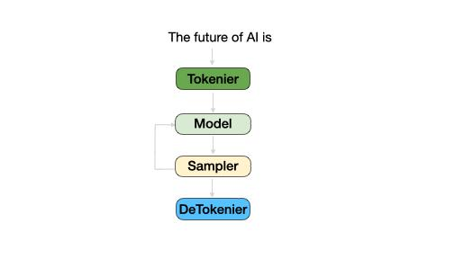

# 大语言模型推理，用动画一看就懂！
这是《vLLM 深入浅出》系列的第一篇，用动画带你直观了解[大语言模型](https://zhida.zhihu.com/search?content_id=252765583&content_type=Article&match_order=1&q=%E5%A4%A7%E8%AF%AD%E8%A8%80%E6%A8%A1%E5%9E%8B&zhida_source=entity)推理的秘密，并解锁其中的三个核心挑战。

### **大语言模型的推理过程**

假设输入的prompt是 "The future of AI is"，那么需要经历四个模块：Tokenizer、Model、Sampler、DeTokenizer。  
动画流程图如下：

### **Tokenizer:**

把人类的文本语言变成模型自己的语言：`Token`，就是一串数字，是文本切分为多个单词后，每个单词对应的编号。Tokenizer 里有模型的词表，代表了模型认识哪些文本。  
 

### **Model:**

模型就像个预言家，根据你输入的内容，预测下一个词会是什么，这个预测结果叫做[logits](https://zhida.zhihu.com/search?content_id=252765583&content_type=Article&match_order=1&q=logits&zhida_source=entity)。它代表了模型预测的当前下一个词在词表里的概率，模型的第一次前向推理称之为 prefill（装填）阶段，而后续的前向推理称之为decode（解码）阶段。

### **Sampler:**

Sampler 就像从词表中抓阄，参考 logits 里指示的概率来选定下一个词。比如上述动图例子里，通过模型的四次前向推理，我们依次输出了 "promising"，"and"，"challenging"，"EOS" 四个字符对应的 token id。当遇到 EOS%28End of Sequence%29，说明预测到了句子的结束符号，模型推理结束。

### **DeTokenizer:**

它是 Tokenizer 的反向过程，把 token 转换为文本。

动画让你一目了然，背后其实有三个核心问题。  
 

### **显存瓶颈问题：**

就像衣柜里虽然有很多空位，但因为空间零散，没法放下一件冬天的大衣一样。[模型推理](https://zhida.zhihu.com/search?content_id=252765583&content_type=Article&match_order=3&q=%E6%A8%A1%E5%9E%8B%E6%8E%A8%E7%90%86&zhida_source=entity)过程中需要频繁在 GPU 显存里申请和释放 Tensor，因此很容易出现类似问题导致的 OOM。vLLM 里创新地提出了 Paged Attention 技术，利用类似操作系统里的[虚拟内存](https://zhida.zhihu.com/search?content_id=252765583&content_type=Article&match_order=1&q=%E8%99%9A%E6%8B%9F%E5%86%85%E5%AD%98&zhida_source=entity)技术来优化显存碎片问题，几十倍提升系统吞吐。

### **计算瓶颈问题：**

我们可以从三个层面来看推理过程中的挑战，每个层面都有不同的难题需要解决。  
**模型**[**内部算子**](https://zhida.zhihu.com/search?content_id=252765583&content_type=Article&match_order=1&q=%E5%86%85%E9%83%A8%E7%AE%97%E5%AD%90&zhida_source=entity)**：**在单次前向计算中，优化模型的[矩阵](https://zhida.zhihu.com/search?content_id=252765583&content_type=Article&match_order=1&q=%E7%9F%A9%E9%98%B5&zhida_source=entity)运算是关键，尤其是 attention 机制。为了提速，vLLM 引入了多种计算方式，比如 [flash attention](https://zhida.zhihu.com/search?content_id=252765583&content_type=Article&match_order=1&q=flash+attention&zhida_source=entity)、flash infer，还有 [xformers](https://zhida.zhihu.com/search?content_id=252765583&content_type=Article&match_order=1&q=xformers&zhida_source=entity) 库，最近甚至考虑用 torch.compile 进行图优化。这些优化手段听上去复杂，其实就是在尽量让每次计算“少花时间，多干活”。  
**单条请求的多次推理：**每当生成一个新 token，我们都要重新计算下一步。在像 Llama 这样的 decoder 架构中，这意味着会重复很多不必要的 self attention 计算。为了避免计算浪费，vLLM 采用了 KV Cache 技术，用额外的空间来换取更快的推理速度。  
**多条请求推理：**对于多条请求，很多文本前缀是一样的，比如统一的 system prompt。vLLM 里使用了 Prefix Cache 技术，把 KV Cache 的优势扩展到不同的请求中，节省大量重复计算的时间。

### **调度问题：**

[调度问题](https://zhida.zhihu.com/search?content_id=252765583&content_type=Article&match_order=2&q=%E8%B0%83%E5%BA%A6%E9%97%AE%E9%A2%98&zhida_source=entity)就像一场策略游戏，你要在有限的资源里，高效分配任务，尽可能多地完成，同时避免用户感受到卡顿。vLLM 里使用了 Anyscale 提出的 Continuous Batch 技术，它就像个高效的时间[管理大师](https://zhida.zhihu.com/search?content_id=252765583&content_type=Article&match_order=1&q=%E7%AE%A1%E7%90%86%E5%A4%A7%E5%B8%88&zhida_source=entity)，帮助模型快速应对各种请求，指导资源分配策略。

这只是个开始，接下来，我们将揭开更多 vLLM 的秘密，带你深入理解每个细节。