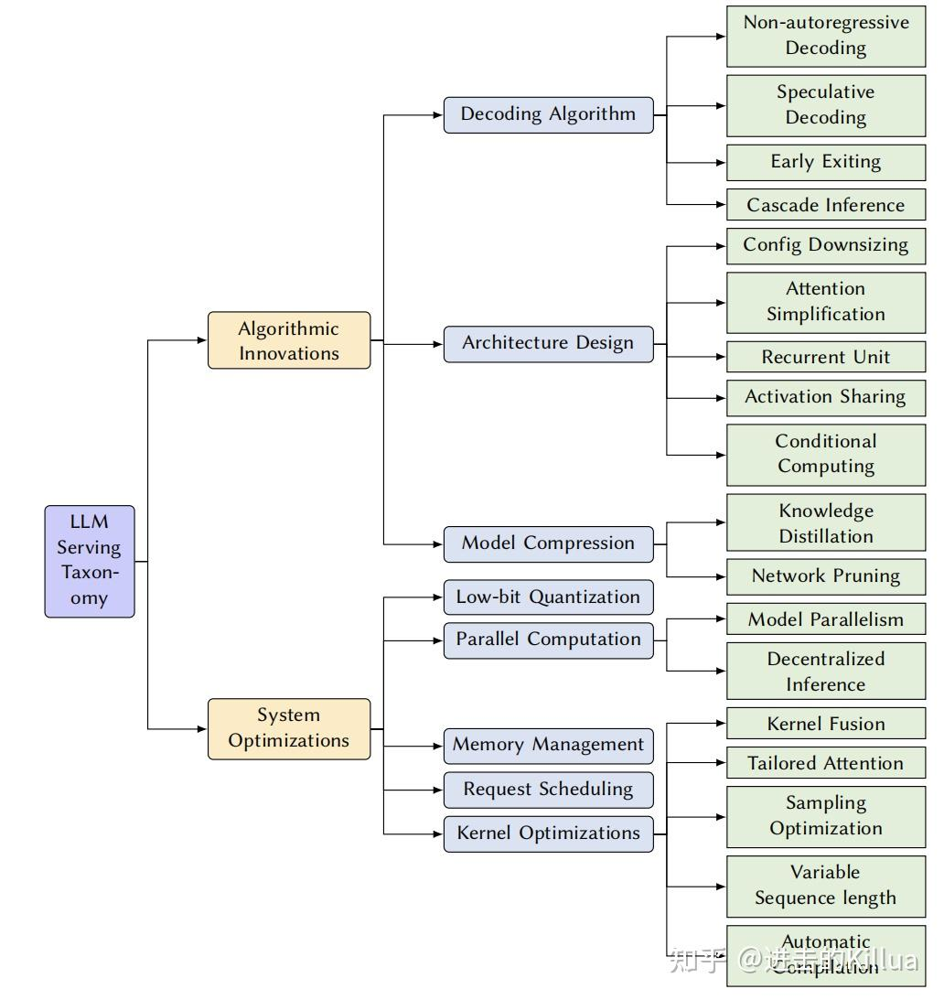
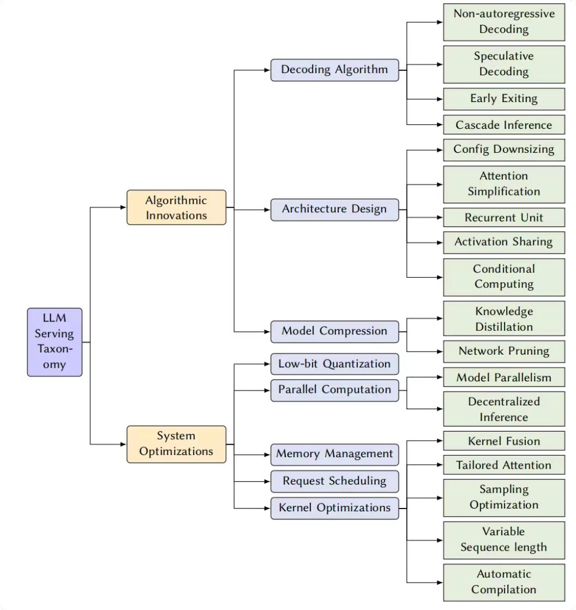
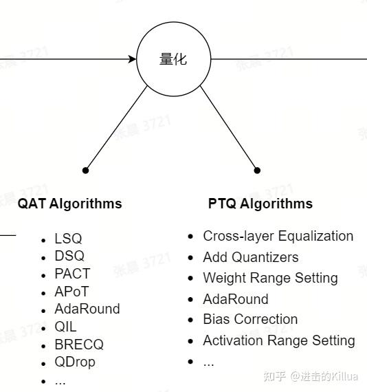
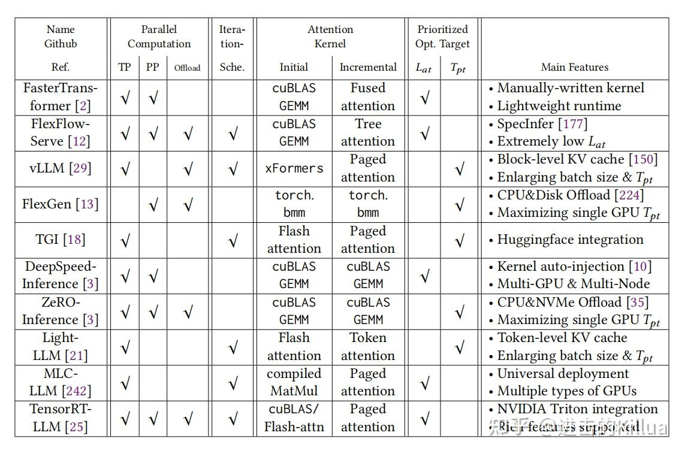

# LLM推理优化系统工程概述
> **作者:** [**进击的Killua**](https://www.zhihu.com/people/zeroine-68)
> 
> **原文:** [**https://zhuanlan.zhihu.com/p/680635901**](https://zhuanlan.zhihu.com/p/680635901)

最近看了CMU Catalyst团队23年底出的一篇总结LLM推理加速的综述文章[Towards Efficient Generative Large Language Model Serving: A Survey from Algorithms to Systems](https://link.zhihu.com/?target=https%3A//arxiv.org/abs/2312.15234),覆盖面还是挺广的,文章从算法和系统工程两个大的视角出发对业界现有工作进行了归纳和总结,最后还提出了对未来发展方向的几点预测. **本文主要对系统工程和市面上已有的推理框架进行一些讲解,算是查漏补缺吧**,算法部分可以看[Hsword: 大模型如何高效部署？CMU最新万字综述纵览LLM推理MLSys优化技术](https://zhuanlan.zhihu.com/p/677635306)这篇文章,讲的很详细了.

  
推理加速技术分类

系统工程优化
------

系统工程优化旨在不改变LLM计算语义的前提下进行LLM推理加速,翻译成白话就是不改变[模型结构](https://zhida.zhihu.com/search?content_id=239382300&content_type=Article&match_order=1&q=%E6%A8%A1%E5%9E%8B%E7%BB%93%E6%9E%84&zhida_source=entity). 这一工作的目标是通过改进用于[大语言模型](https://zhida.zhihu.com/search?content_id=239382300&content_type=Article&match_order=1&q=%E5%A4%A7%E8%AF%AD%E8%A8%80%E6%A8%A1%E5%9E%8B&zhida_source=entity)推理的底层系统和推理框架来提高系统效率,包括[低比特量化](https://zhida.zhihu.com/search?content_id=239382300&content_type=Article&match_order=1&q=%E4%BD%8E%E6%AF%94%E7%89%B9%E9%87%8F%E5%8C%96&zhida_source=entity)、并行计算、内存管理、请求调度和内核优化,下面我们进行逐一介绍.

### 1\. 低比特量化

量化已经不是什么新技术了,通过使用更少的位表示数值来显著地减少内存消耗,加速在硬件平台上的推理过程. 传统的[量化方法](https://zhida.zhihu.com/search?content_id=239382300&content_type=Article&match_order=1&q=%E9%87%8F%E5%8C%96%E6%96%B9%E6%B3%95&zhida_source=entity)分为Quantization-Aware Training (QAT) 和 Post-Training Quantization (PTQ),可以简单通过是否需要重新训练来进行区分,经过这些年的发展围绕QAT和PTQ也衍生了很多经典算法,如下图所示,而在LLM时代,PTQ和QAT又焕发出新的活力,成为模型压缩的一大重要技术.

PTQ主要是对模型权重值和[激活值](https://zhida.zhihu.com/search?content_id=239382300&content_type=Article&match_order=1&q=%E6%BF%80%E6%B4%BB%E5%80%BC&zhida_source=entity)进行INT8/INT4量化,[A Comprehensive Study on Post-Training Quantization for Large Language Models](https://link.zhihu.com/?target=https%3A//arxiv.org/pdf/2303.08302v2.pdf)这篇文章是LLM PTQ的一篇[综述文章](https://zhida.zhihu.com/search?content_id=239382300&content_type=Article&match_order=1&q=%E7%BB%BC%E8%BF%B0%E6%96%87%E7%AB%A0&zhida_source=entity),介绍对比了RTN、GPTQ、ZQ-Global、ZQ-Local这些算法,其中[GPTQ](https://link.zhihu.com/?target=https%3A//arxiv.org/abs/2210.17323)、[SmoothQuant](https://link.zhihu.com/?target=https%3A//arxiv.org/abs/2211.10438)算法影响力都不小,都可以展开看一看. 因为权重和激活值的不同属性有多种精度组合,如W8A16(权重INT8+激活值FP16或BF16)、W4A16、W8A8、W4A4,分别有很多文章来介绍这些类型的[量化技术](https://zhida.zhihu.com/search?content_id=239382300&content_type=Article&match_order=1&q=%E9%87%8F%E5%8C%96%E6%8A%80%E6%9C%AF&zhida_source=entity). 当然这也是需要硬件来支持,N厂的[Ampere架构](https://zhida.zhihu.com/search?content_id=239382300&content_type=Article&match_order=1&q=Ampere%E6%9E%B6%E6%9E%84&zhida_source=entity)支持了INT8和INT4的tensor core,[Hopper架构](https://zhida.zhihu.com/search?content_id=239382300&content_type=Article&match_order=1&q=Hopper%E6%9E%B6%E6%9E%84&zhida_source=entity)支持了FP8的tensor core, 其实也进一步说明了这方面的需求非常旺盛,得到了硬件厂商的肯定.

QAT一般效果是更好的,但是它需要重训模型所以成本会大一些,相关的研究成果相较PTQ也少一些,在fintune阶段会用的比较多一些,例如 [QLoRA: Efficient finetuning of quantized llms](https://link.zhihu.com/?target=https%3A//arxiv.org/abs/2305.14314)、[LLM-QAT: Data-Free Quantization Aware Training for Large Language Models](https://link.zhihu.com/?target=https%3A//arxiv.org/abs/2305.17888)、[Memory-Efficient Fine-Tuning of Compressed Large Language Models via sub-4-bit Integer Quantization](https://link.zhihu.com/?target=https%3A//arxiv.org/abs/2305.14152)

[LLM.int8(): 8-bit Matrix Multiplication for Transformers at Scale](https://link.zhihu.com/?target=https%3A//arxiv.org/abs/2208.07339)这篇文章还提到一个值得关注的点,相较于传统的FP16量化,低精度量化方法可能会有更低的推理速度,我们最近也遇到了这个问题,其实对底层的系统实现带来了很大的挑战.

### 2\. 并行计算

利用现代硬件架构的并行处理能力,并行计算方法将计算分配给多个核心或设备,从而在推理过程中实现实质性的加速,主要有两类并行: [模型并行](https://zhida.zhihu.com/search?content_id=239382300&content_type=Article&match_order=1&q=%E6%A8%A1%E5%9E%8B%E5%B9%B6%E8%A1%8C&zhida_source=entity)和非集中式推理.

**模型并行**

大多数模型并行都是应用在分布式训练场景,比如Tensor Parallelism(TP)和Pipeline Parallelism(PP),不过像[PaLM](https://link.zhihu.com/?target=https%3A//arxiv.org/abs/2211.05102) inference继承了TP的思想是应用在大规模Transformer推理场景的. 而Sequence Parallelism(SP)具有多种不同的设计和实现方式,但其针对[大型语言模型](https://zhida.zhihu.com/search?content_id=239382300&content_type=Article&match_order=1&q=%E5%A4%A7%E5%9E%8B%E8%AF%AD%E8%A8%80%E6%A8%A1%E5%9E%8B&zhida_source=entity)推理的关键思想,是通过沿序列长度维度将长序列的处理过程拆分到多个[GPU](https://zhida.zhihu.com/search?content_id=239382300&content_type=Article&match_order=1&q=GPU&zhida_source=entity)上,从而实现计算和存储负载的[分布式处理](https://zhida.zhihu.com/search?content_id=239382300&content_type=Article&match_order=1&q=%E5%88%86%E5%B8%83%E5%BC%8F%E5%A4%84%E7%90%86&zhida_source=entity),不过这个的应用相对来说没有前两个这么广泛.

此外不同的[并行性](https://zhida.zhihu.com/search?content_id=239382300&content_type=Article&match_order=1&q=%E5%B9%B6%E8%A1%8C%E6%80%A7&zhida_source=entity)技术会引入不同程度的通信开销和计算延迟. 为了实现最佳性能和资源利用率,[分布式训练](https://zhida.zhihu.com/search?content_id=239382300&content_type=Article&match_order=2&q=%E5%88%86%E5%B8%83%E5%BC%8F%E8%AE%AD%E7%BB%83&zhida_source=entity)中的自动并行性已受到广泛研究,像 AlpaServe, FlexFlow-Serve, SpotServe已经实现了一些自动化策略,有时间可以去实践一下.

**非集中式推理**

非集中式处理方法主要是利用一些非中心化的节点来处理数据进行推理,这个方法面向的场景是计算资源是物理隔离的通过Internet互联的,可以充分利用一些消费级GPU的计算资源,同样也有很多挑战,比如设备的异构特性、有限的计算[存储容量](https://zhida.zhihu.com/search?content_id=239382300&content_type=Article&match_order=1&q=%E5%AD%98%E5%82%A8%E5%AE%B9%E9%87%8F&zhida_source=entity)、低带宽的网络、[容错性](https://zhida.zhihu.com/search?content_id=239382300&content_type=Article&match_order=1&q=%E5%AE%B9%E9%94%99%E6%80%A7&zhida_source=entity)、隐私保护等等,目前业界比较成熟的这类系统就是[Petals](https://link.zhihu.com/?target=https%3A//arxiv.org/abs/2209.01188).

### 3\. 内存管理

众所周知高效的内存管理是[LLM serving](https://zhida.zhihu.com/search?content_id=239382300&content_type=Article&match_order=1&q=LLM+serving&zhida_source=entity)一个很大的挑战,随着[KV Cache](https://zhida.zhihu.com/search?content_id=239382300&content_type=Article&match_order=1&q=KV+Cache&zhida_source=entity)优化变成一个事实标准,对存储的使用需求越来越大. 这里主要提三个系统优化,[vLLM](https://link.zhihu.com/?target=https%3A//arxiv.org/abs/2309.06180)使用的paged[Attention](https://zhida.zhihu.com/search?content_id=239382300&content_type=Article&match_order=1&q=Attention&zhida_source=entity)优化、[SpecInfer](https://link.zhihu.com/?target=https%3A//arxiv.org/abs/2305.09781)提出的tree attention优化和[LightLLM](https://link.zhihu.com/?target=https%3A//github.com/ModelTC/lightllm)采用的更精细的标记级内存管理机制. 但这些优化在提高吞吐量的同时会牺牲一部分请求响应延时,这其实就需要做出一定的取舍,所以这里的挑战仍然很大.

### 4\. 请求调度

高效地调度请求输入[推理引擎](https://zhida.zhihu.com/search?content_id=239382300&content_type=Article&match_order=1&q=%E6%8E%A8%E7%90%86%E5%BC%95%E6%93%8E&zhida_source=entity)对于优化LLM服务至关重要. [请求调度算法](https://zhida.zhihu.com/search?content_id=239382300&content_type=Article&match_order=1&q=%E8%AF%B7%E6%B1%82%E8%B0%83%E5%BA%A6%E7%AE%97%E6%B3%95&zhida_source=entity)算法旨在最大限度地提高资源利用率,确保在延迟服务级别目标(SLO)内达到响应时间,并有效地处理不同的请求负载. LLM的请求调度和ML的常规调度没有太大区别,主要包括动态批处理、抢占、优先级、交换、模型选择、成本效率、负载平衡和资源分配这些.

早期的[LLM 推理框架](https://zhida.zhihu.com/search?content_id=239382300&content_type=Article&match_order=1&q=LLM+%E6%8E%A8%E7%90%86%E6%A1%86%E6%9E%B6&zhida_source=entity)只支持request-level的调度,比如像[fastertransformer](https://zhida.zhihu.com/search?content_id=239382300&content_type=Article&match_order=1&q=fastertransformer&zhida_source=entity)这种,[ORCA](https://link.zhihu.com/?target=https%3A//www.usenix.org/conference/osdi22/presentation/yu)率先提出了iteration-level的调度系统,结合selective-batching输出了更高效的调度能力. 后来continuous batching逐步应用到vLLM、TensorRT-LLM(flight batching)和[RayLLM](https://link.zhihu.com/?target=https%3A//github.com/ray-project/ray-llm)上,也成为了事实标准. [FastServe](https://zhida.zhihu.com/search?content_id=239382300&content_type=Article&match_order=1&q=FastServe&zhida_source=entity)则专注于作业完成时间(JCT),并涉及迭代级抢占,优先处理输入长度较短的任务,而不是先进先出策略. [S3](https://link.zhihu.com/?target=https%3A//arxiv.org/abs/2306.06000)包含一个输出序列长度预测器,有助于在GPU内存有限的情况下调度更多并发请求,从而实现更高的推理吞吐量.

### 5\. 内核优化

文章把一些利用硬件特性加速特定操作的优化归纳到[内核优化](https://zhida.zhihu.com/search?content_id=239382300&content_type=Article&match_order=3&q=%E5%86%85%E6%A0%B8%E4%BC%98%E5%8C%96&zhida_source=entity)的范畴,主要提出了5点,即内核融合、定制attention、采样优化、变长序列优化和自动编译优化.

**内核融合**

[内核融合](https://zhida.zhihu.com/search?content_id=239382300&content_type=Article&match_order=3&q=%E5%86%85%E6%A0%B8%E8%9E%8D%E5%90%88&zhida_source=entity)是一个广泛使用的内核优化手段,可以减少内核launch和访存开销,一些推理引擎像[FasterTransformer](https://zhida.zhihu.com/search?content_id=239382300&content_type=Article&match_order=1&q=FasterTransformer&zhida_source=entity)、LightSeq、ByteTransformer都用到了内核融合的技术. 常规做法是把相同shape的GEMM进行融合、addBias和其他非GEMM层([残差](https://zhida.zhihu.com/search?content_id=239382300&content_type=Article&match_order=1&q=%E6%AE%8B%E5%B7%AE&zhida_source=entity)、LN、Relu)融合、通过[CUTLASS](https://zhida.zhihu.com/search?content_id=239382300&content_type=Article&match_order=1&q=CUTLASS&zhida_source=entity)将GEMM和一些激活层融合等等.

**定制Attention**

由于attention是transformer-base模型中核心模块,会有很多对它进行优化的成果,比如像融合的[MHA](https://zhida.zhihu.com/search?content_id=239382300&content_type=Article&match_order=1&q=MHA&zhida_source=entity) kernel. LLM 推理分为[prefill](https://zhida.zhihu.com/search?content_id=239382300&content_type=Article&match_order=1&q=prefill&zhida_source=entity)和decode阶段,prefill阶段并行地接收prompt,decode阶段逐步迭代生成token. 针对prefill阶段,[xFormers](https://link.zhihu.com/?target=https%3A//github.com/facebookresearch/xformers)沿用online softmax思想使用CUTLASS来进行整个[attention计算](https://zhida.zhihu.com/search?content_id=239382300&content_type=Article&match_order=1&q=attention%E8%AE%A1%E7%AE%97&zhida_source=entity). 而decode阶段主流的加速方法就是基于[KVCache](https://zhida.zhihu.com/search?content_id=239382300&content_type=Article&match_order=1&q=KVCache&zhida_source=entity)的[FlashDecoding](https://link.zhihu.com/?target=https%3A//pytorch.org/blog/flash-decoding/)和[FlashDecoding++](https://link.zhihu.com/?target=https%3A//arxiv.org/abs/2311.01282),他们都起到提升GPU利用率、降低访存的作用.

**采样优化**

[采样算法](https://zhida.zhihu.com/search?content_id=239382300&content_type=Article&match_order=1&q=%E9%87%87%E6%A0%B7%E7%AE%97%E6%B3%95&zhida_source=entity)的选择会极大地影响LLM的生成质量. 并行采样技术已被广泛使用,如beamSearch,通过在每次迭代中维护固定数量的最高得分的序列,解码近似最优序列. 各种[随机采样](https://zhida.zhihu.com/search?content_id=239382300&content_type=Article&match_order=1&q=%E9%9A%8F%E6%9C%BA%E9%87%87%E6%A0%B7&zhida_source=entity)技术(例如,top-k,top-p ,温度控制)也层出不穷,通过引入随机性以获得多样化的输出. 然而,它们仍然面临着一些实际系统挑战. 一个是由冗余的KVCache增加的内存压力,另一个是由于LLM巨大词汇量引起的[采样效率](https://zhida.zhihu.com/search?content_id=239382300&content_type=Article&match_order=1&q=%E9%87%87%E6%A0%B7%E6%95%88%E7%8E%87&zhida_source=entity)问题. [LightSeq](https://link.zhihu.com/?target=https%3A//arxiv.org/abs/2010.13887)提供了一种高效的分层实现,将词汇表分成 组,使用几个GPU指令在每个组内检索候选者,然后对这些候选者进行重新排名以获得前 个token.

**变长序列优化**

LLM推理的另一个独特挑战在于,序列的输入长度和输出长度都可以变化,而后者是事先未知的. 通常使用批处理的方式来处理请求,然而当一批序列具有可变的输入长度时,还需要使用Padding填充手段,而这会浪费计算和内存资源. 为了缓解这些低效情况,[Packing](https://link.zhihu.com/?target=https%3A//github.com/bytedance/effective_transformer)是常用的手段. Packing 将序列存储在连续的内存空间中,无需填充,由于attention计算无法通过连续空间进行,所以在注意力计算之前需要unPacking,在[ByteTransformer](https://link.zhihu.com/?target=https%3A//arxiv.org/abs/2210.03052)中有关于Packing和unPacking的详细应用.

**自动编译优化**

大多数现有的[LLM推理系统](https://zhida.zhihu.com/search?content_id=239382300&content_type=Article&match_order=1&q=LLM%E6%8E%A8%E7%90%86%E7%B3%BB%E7%BB%9F&zhida_source=entity)使用NVIDIA 提供的函数库作为其后端,例如cuBLAS、[cuDNN](https://zhida.zhihu.com/search?content_id=239382300&content_type=Article&match_order=1&q=cuDNN&zhida_source=entity)和CUTLASS,这些库提供了优化的内核实现. 为了进一步提高推理效率,他们还针对NVIDIA GPU上的特定LLM操作(例如,注意力)手动优化内核. 尽管有这些工作,使用自动化DNN编译器的趋势仍然存在,例如TVM(即Unity、Relax和[TensorIR](https://zhida.zhihu.com/search?content_id=239382300&content_type=Article&match_order=1&q=TensorIR&zhida_source=entity))、MLIR、JAX、OpenAI Triton、TASO 和[TorchInductor](https://zhida.zhihu.com/search?content_id=239382300&content_type=Article&match_order=1&q=TorchInductor&zhida_source=entity). [编译方法](https://zhida.zhihu.com/search?content_id=239382300&content_type=Article&match_order=1&q=%E7%BC%96%E8%AF%91%E6%96%B9%E6%B3%95&zhida_source=entity)可以帮助发现潜在的更高效的运算符实现,更重要的是可以促进适应其他硬件平台,包括移动设备和边缘设备、CPU、DL加速器和其他类型的GPU(例如,[AMD GPU](https://zhida.zhihu.com/search?content_id=239382300&content_type=Article&match_order=1&q=AMD+GPU&zhida_source=entity)和Apple M2 Ultra).

推理框架
----

从并行计算支持方法、迭代粒度、attention kernel实现方案和优先级支持几个维度对常见推理框架进行了对比. 然后每家因为出生不同都有一些自身特性.

FasterTransformer是NVIDIA开发的,为了提高GPU的利用率,它手动将attention计算(例如,线性投影、位置偏置、[点积](https://zhida.zhihu.com/search?content_id=239382300&content_type=Article&match_order=1&q=%E7%82%B9%E7%A7%AF&zhida_source=entity)、softmax等)融合到一个高性能的内核模板中,并涉及多种内核优化技术,例如shard缓存、warp-shuffle reduce指令、使用了TensorCore的半[矩阵乘法](https://zhida.zhihu.com/search?content_id=239382300&content_type=Article&match_order=1&q=%E7%9F%A9%E9%98%B5%E4%B9%98%E6%B3%95&zhida_source=entity)累积(HMMA).

FlexFlow-Serve支持[投机解码](https://zhida.zhihu.com/search?content_id=239382300&content_type=Article&match_order=1&q=%E6%8A%95%E6%9C%BA%E8%A7%A3%E7%A0%81&zhida_source=entity),并提供基于树的[并行解码](https://zhida.zhihu.com/search?content_id=239382300&content_type=Article&match_order=1&q=%E5%B9%B6%E8%A1%8C%E8%A7%A3%E7%A0%81&zhida_source=entity)内核来验证来自多个序列(即来自多个小型模型)的预测token,具有零内存冗余和最大线程并行性.

vLLM继承了FasterTransformer中的融合MHA内核,通过将KV Cache划分为页来消除冗余内存使用.

LightLLM采取了一种后续方法,将KV Cache划分为更精细的token级片段.

事实上这些框架都有自己的优化目标,需要在吞吐量和延时之间做取舍,这就体现出了多样性. 比如vLLM主要的目标是吞吐量,而FlexFlow-Serve主要的目标是低延时. 此外经济成本也是一个设计和实现的核心目标,谁不想多快好省呢？相信未来这些[推理框架](https://zhida.zhihu.com/search?content_id=239382300&content_type=Article&match_order=6&q=%E6%8E%A8%E7%90%86%E6%A1%86%E6%9E%B6&zhida_source=entity)会集成更多好用的feature,持续提升系统性能和资源利用率.

参考
--

[https://vgel.me/posts/faster-inference/](https://link.zhihu.com/?target=https%3A//vgel.me/posts/faster-inference/)

[Towards Efficient Generative Large Language Model Serving: A Survey from Algorithms to Systems](https://link.zhihu.com/?target=https%3A//arxiv.org/abs/2312.15234)