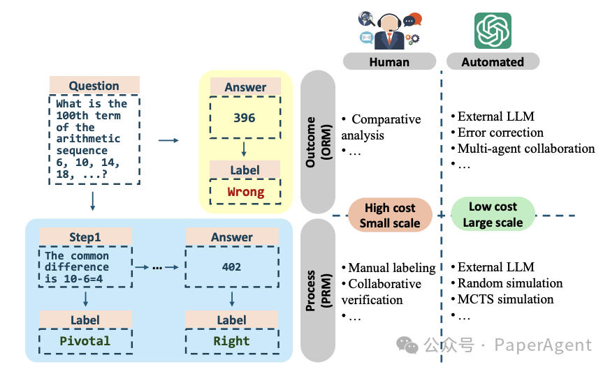
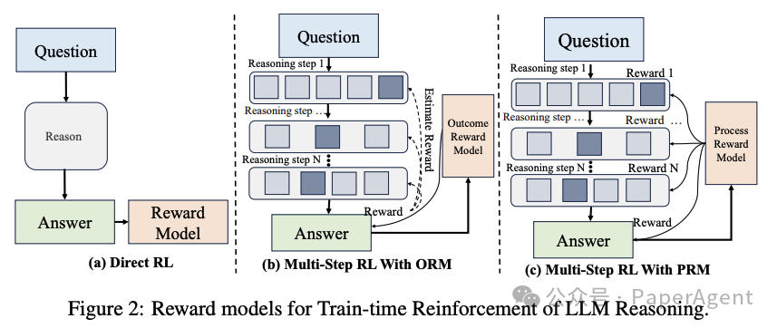
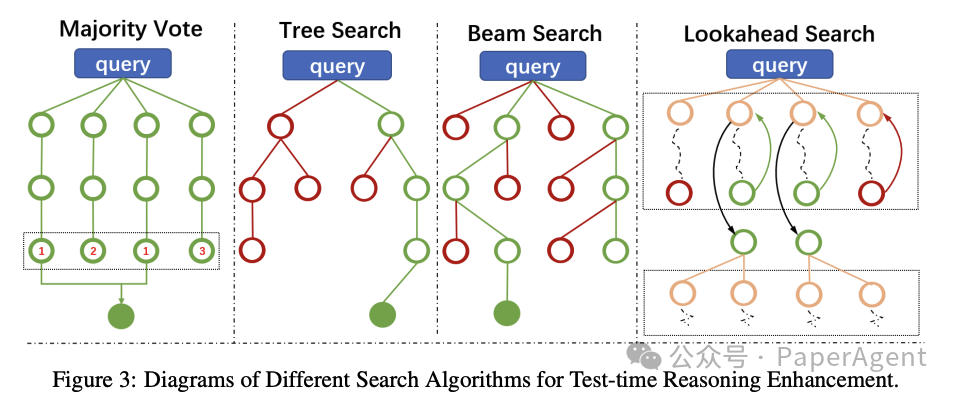
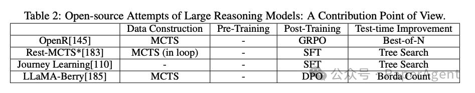
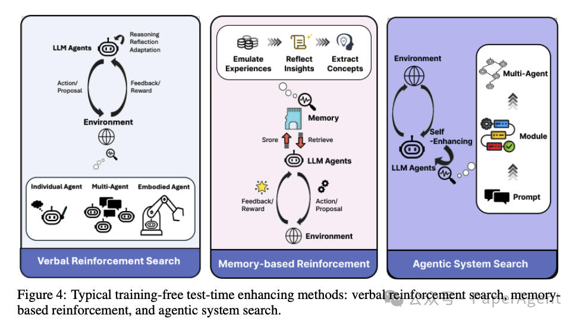
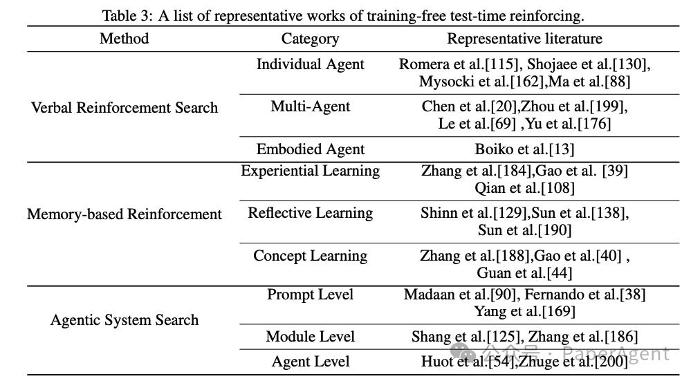
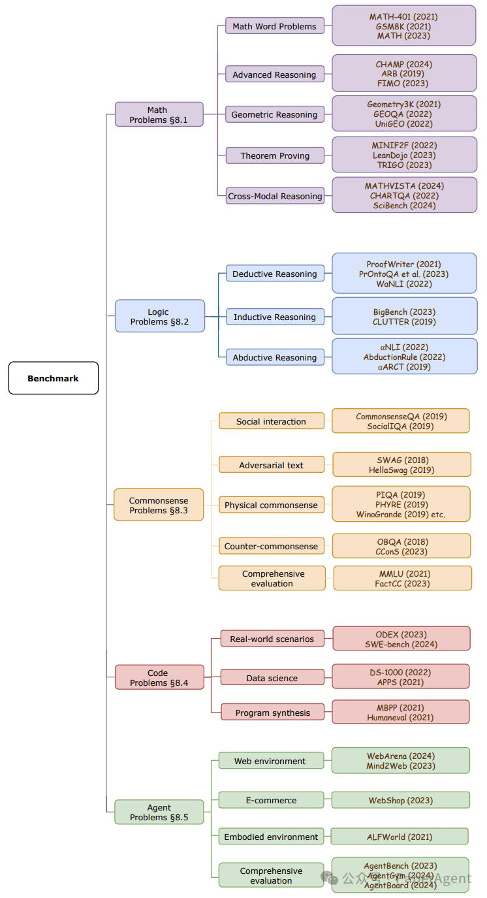

# R1风起，清华、港科大发布大模型强化推理技术最新全面综述
> _**作者: PaperAgent**_
> 
> _**原文:**_ [_**https://mp.weixin.qq.com/s/bUc12P81kLLSXQRj3MODKQ**_](https://mp.weixin.qq.com/s/bUc12P81kLLSXQRj3MODKQ)
> 
> _**Pdf:**_ [_**https://arxiv.org/pdf/2501.09686**_](https://arxiv.org/pdf/2501.09686)

全面回顾了大型语言模型（LLMs）在**推理能力提升**方面的最新进展，从简单的自回归token生成到引入“**思维（thought）**”概念的转变，以及如何通过强化学习（RL）训练LLMs掌握推理过程，再到鼓励LLMs在测试时推理中使用更多token进行“**思考**”，最终，**训练时和测试时**的扩展相结合——通往大型推理模型的道路。

**展示标注LLM推理数据的不同范式**

学习推理：监督式微调到强化微调
---------------

*   监督式微调（SFT）的重要性：SFT是提升LLMs特定任务推理能力的关键步骤，通过标记数据使模型适应特定任务需求，但受限于数据成本、灾难性遗忘和计算成本等问题。
*   强化学习（RL）的崛起：RL作为一种替代框架，使模型通过试错和奖励信号学习最优策略，RLHF和RLAIF是目前LLMs训练中的主导方法，分别依赖人类标注数据和原则进行训练。
*   结果奖励模型（ORM）的挑战：在复杂推理任务中，基于ORM的训练需区分中间推理步骤的正确性和重要性，ReFT和VinePPO等方法通过不同策略应对ORM的偏差问题，CPL则通过高层次抽象计划内搜索增强泛化能力。

*   过程奖励模型（PRM）的进步：PRM通过评估中间步骤优化模型行为，更符合人类偏好和任务要求，SELF-EXPLORE、MATH-SHEPHERD、DeepSeekMath和Scaling Automated Process Verifiers等研究展示了PRM在数学和逻辑推理中的应用。
*   强化微调（RFT）的潜力：RFT作为新兴技术，利用少量用户偏好数据和评分模型优化LLMs的多步推理能力，在数据效率和训练稳定性方面表现出色，为领域定制的专家LLMs开发提供了新途径。

测试时扩展：从链式思考（CoTs）到PRM引导的搜索
--------------------------

#### 1 通过提示引导深思熟虑的思考

*   测试时提示技术：研究人员发现，测试时的提示技术（如链式思考和树状思考）可以进一步增强LLMs的能力。与直接要求模型提供答案相比，引导模型在测试时进行明确的推理过程可以显著提高其性能。
*   结构化提示方法：如ReAct和最少到最多提示（Least-to-Most Prompting）等结构化提示方法，通过明确指导模型组织思考过程，使LLMs能够更可靠、更可解释地输出结果。
*   测试时计算开销：这些方法虽然增加了标记消耗和计算开销，但通过在测试时增强LLMs的推理能力和解决方案准确性，提供了一种不依赖于模型参数修改的改进方向。

#### 2 PRM引导的搜索

*   PRM的重要性：PRM（过程奖励模型）从稀疏的结果反馈转向详细的流程导向监督，不仅在训练阶段，也在测试阶段发挥重要作用。
*   OpenAI o1系列模型：OpenAI的o1系列模型是PRM高级应用的突出例子，通过在测试时增加计算资源，显著提升了模型的推理能力。
*   测试时扩展法则：新的测试时扩展法则表明，通过优化测试时计算策略，可以在各种推理任务中实现显著的性能提升，特别是在复杂问题解决场景中。

通往大型推理模型的路径
-----------

#### 1 OpenAI o1系列的发展

*   o1模型的发布：2024年9月，OpenAI发布了o1模型，这是AI推理能力的一个重大进步，尤其在数学、编程和科学问题解决方面表现出色。
*   o3模型的升级：2024年12月20日，OpenAI开放了o3模型的测试申请，被认为是具有博士级智能的升级版本。
*   关键研究成果：
*   有效知识整合：o1模型在基础问题解决任务中展示了结构化分析方法和知识整合能力，通过逐步逻辑推理在竞争性编程中取得83.3%的成功率。
*   系统性问题分解：o1模型在处理不同复杂度的任务时表现出一致的性能，能够系统地分解问题，特别是在数学推理和编程任务中。
*   复杂任务中的可靠和连贯推理：o1模型在不同问题类型中表现出一致的推理链，特别是在规划任务和复杂规划任务中，能够有效管理长期依赖和上下文转换。

#### 2 开源的大型推理模型尝试

*   OpenR项目：OpenR是第一个尝试复现OpenAI o1模型核心方法的开源框架，通过构建逐步推理数据和训练过程奖励模型（PRM）来提升推理能力。
*   Rest-MCTS\*项目：该项目通过将PRM训练和策略模型微调集成在一个相互自我训练的循环中，提升了模型的推理能力。
*   o1 Replication Journey项目：该项目通过全面的训练策略复现OpenAI o1模型的推理能力，强调结构化训练图和高质量训练数据的生成。
*   LLaMA-Berry项目：该项目专注于在推理阶段优化推理能力，通过结合蒙特卡洛树搜索（MCTS）和自 refining（SR-MCTS）动态探索和优化解决方案路径。

其他测试时增强技术
---------

#### 1 语言强化搜索（Verbal Reinforcement Search）

*   概述：语言强化搜索（VRS）利用LLMs的预训练推理和语义能力，在测试时通过迭代反馈循环优化解决方案，无需额外训练。
*   应用场景：
*   个体代理（Individual Agent）：适用于数学优化、符号推理和假设驱动的发现任务，通过系统性细化显著提高问题解决效果。
*   多代理系统（Multi-Agent）：通过自然语言通信促进LLM基础代理之间的协作，共同解决复杂的解决方案空间。
*   具身代理（Embodied Agent）：通过整合推理与物理交互，支持实验室环境中的实验规划和执行等实际任务。

#### 2 基于记忆的强化（Memory-based Reinforcement）

*   概述：在开放性任务中，解决方案空间往往大幅扩展，简单的解决方案空间搜索效率低下。一些研究通过引入外部记忆模块来增强LLM代理的能力。
*   应用场景：
*   体验式学习（Experiential Learning）：鼓励LLM代理模仿记忆中存储的有利经验，避免不利经验。
*   反思式学习（Reflective Learning）：LLM代理直接反思记忆中存储的成功和失败，总结根本原因，并将其作为指导。
*   概念学习（Concept Learning）：使LLM代理能够发展超越具体任务的通用“概念”，促进对环境和任务的更广泛理解。

#### 3 代理系统搜索（Agentic System Search）

*   概述：设计代理系统在许多下游任务中发挥重要作用。测试时增强技术的一个重要分支是利用LLMs搜索代理系统。
*   搜索级别：
*   提示级别（Prompt Level）：通过迭代整合有用反馈经验改进提示，提示本身也值得搜索和优化。
*   模块级别（Module Level）：使用LLM搜索代理系统的模块化设计，模块是具有特定功能的提示块。
*   代理级别（Agent Level）：利用LLMs搜索整个代理系统，多代理系统在共享环境中做出决策和实现目标。

**LLM推理基准的分类体系**

