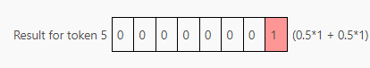

# 大模型推理加速
> **作者: OneFlow**
> 
> **原文: https://www.zhihu.com/question/638655129/answer/3556042883**

本文是一篇关于加快语言大模型推理速度的综合指南。从硬件优化到各种解码技巧，文章介绍了各种优化策略，旨在帮助读者更好地理解和优化LLM的性能。相信不论是这一领域的初学者或是专家，都能从中有所收获。

本文作者为工程师和计算语言学家Theia。（以下内容由OneFlow编译发布，转载请联系授权。原文：[https://vgel.me/posts/faster-inference/](https://link.zhihu.com/?target=https%3A//vgel.me/posts/faster-inference/)）

**作者 | Theia**

**OneFlow编译**

**翻译｜宛子琳、杨婷**

在我的上一篇文章（[_https://vgel.me/posts/handmade-transformer_](https://link.zhihu.com/?target=https%3A//vgel.me/posts/handmade-transformer)）中，手动实现了一个Transformer。该文使用了经典的自回归采样器，大致如下：

```text-plain
tokens = tokenize(prompt)
    for i in range(tokens_to_generate):
        next_token = model(tokens)
        tokens.append(next_token)
    return detokenize(tokens)
```

这种推理方法非常巧妙，深入探究了语言大模型的工作原理：它们是自回归的，消耗自身的输出。对于玩具模型（仅有几千个参数），这种方法完全可行。但遗憾的是，对于真实模型来说，这种方法太慢了\[1\]。为什么会这样，我们该如何让它运行得更快？

本文是一篇长篇调研，广泛探究了提升语言大模型性能的各种方法，内容涵盖了从更好的硬件利用到巧妙的解码技巧。但它并非面面俱到，也不是针对各个主题最深入的探究，毕竟我并不是所有领域的专家！但希望本文提供的信息对你学习自己感兴趣的主题会是一个不错的起点。

**1.为何简单推理如此缓慢？**
-----------------

使用简单的自回归generate函数进行推理的速度缓慢，主要有两个主要原因：一是算法原因，二是硬件原因。

在算法方面，每个周期的generate函数都必须处理逐渐增多的词元，因为每个周期我们都要在上下文中添加新词元。这意味着要从一个由10个词元组成的提示生成100个词元，你需要在模型上运行的不止109个词元，而是10 + 11 + 12 + 13 + ... + 109 = 5950个词元！（初始提示可以并行处理，这也是为什么在推理API中提示词元通常更便宜的原因之一。）同时也意味着，随着生成的进行，模型会越来越慢，因为每个连续的词元生成都有一个越来越长的前缀。


注意力机制，至少是最基本的注意力机制（vanilla attention），也是一个二次算法：所有词元都需要关注所有其他词元，这导致了N²的扩展，使得一切变得更慢。

以上是算法原因。那硬件原因呢？很简单。LLM规模庞大，即便像GPT2（117M 参数）这样相对较小的模型也有数百兆，而所有这些数据都必须存储在内存中。内存的速度非常慢，而现代处理器（包括CPU和GPU）通过在靠近处理器的位置拥有大量更快访问的高速缓存来弥补这一点\[2\]。具体的细节因处理器类型和模型不同而异，但重点在于，LLM的权重无法储存在缓存中，因此会花费大量时间等待从内存中加载权重。

这导致了一些令人费解的结果！例如，从上面的图表可以看出，处理10个词元的操作并不一定比处理单个词元的操作慢很多（即使激活张量的大小增加了10倍），因为主要的时间浪费在搬运模型权重，而不是进行计算。

**评估指标**
--------

顺便一提，当我们说“慢”时，到底是指什么呢？在涉及语言大模型推理时，人们讨论的评估标准有很多：

*   首词元时间（Time to First Token）：接收提示后多久才返回第一个词元？
*   生成时延（Generation Latency）：接收提示后多久才返回最终词元？
*   吞吐量（Throughput）：能够同时通过pipeline传递多少个不同的生成？
*   硬件利用率（Hardware Utilization）：在多大程度上有效地利用计算、内存带宽和硬件的其他能力？

不同的优化方式对这些指标的影响各不相同。例如，批处理提高了吞吐量并更有效地利用硬件，但可能会增加首词元时间和生成时延。

2\. **硬件优化**
------------

加速推理有一个直截了当的方法（尤其是如果你有风险投资) ，就是购买更好的硬件，或者如果负担不起，就充分利用已有的硬件。

如果你购买更好的硬件，很可能会选择某种加速器，通常是GPU，有时候（如果是谷歌）可能是TPU。

使用加速器可以产生显著的加速效果（由此得名），但请注意CPU和加速器之间存在传输瓶颈。如果你的模型不适应加速器的内存，它将需要在前向传递过程中被交换出去，这可能会显著降低速度。（这也是为什么苹果的M1/M2/M3芯片在推理方面表现突出的原因之一，因为它们具有统一的CPU和GPU内存。）

但要注意，无论是CPU还是加速器推理，都需要先考虑是否充分利用了硬件。一个经过适当优化的程序可以从较差的硬件中获得更多收益，而一个未充分优化的程序尽管使用了最好的硬件，获得的收益可能还不如前者。

例如，你可以在PyTorch中用F.softmax(q @ k.T / sqrt(k.size(-1)) + mask) @ v编写注意力，这样可以得到正确的结果。但如果你改用 torch.nn.functional.scaled\_dot\_product\_attention，它将在可用时将计算委托给FlashAttention，从而通过更好地利用缓存的手写kernel实现3倍的加速。

**编译器**
-------

更为通用的是torch.compile、TinyGrad和ONNX这样的编译器，可以将简单的Python代码融合成为针对你的硬件进行优化的kernel。例如，我可以编写如下函数：

```text-plain
  s = torch.sin(x)
  c = torch.cos(x)
  return s + c
```

简单来说，这个函数需要：

1.  为 s 分配 x.shape()大小的内存
2.  对 x 进行线性扫描，计算每个元素的 sin 值
3.  为 c 分配x.shape()大小的内存
4.  对 x 进行线性扫描，计算每个元素的 cos 值
5.  为结果张量分配 x.shape() 大小的内存
6.  对 s 和 c 进行线性扫描，将它们相加到结果中

这些step都比较慢，且其中一些step需要跳过Python和本地代码间的界线，不利于加速。那如果我使用torch.compile 来编译这个函数会怎样呢？

```text-plain
>>> compiled_foo = torch.compile(foo, options={"trace.enabled": True, "trace.graph_diagram": True})
>>> # call with an arbitrary value to trigger JIT
>>> compiled_foo(torch.tensor(range(10)))
Writing FX graph to file: .../graph_diagram.svg
[2023-11-25 17:31:09,833] [6/0] torch._inductor.debug: [WARNING] model__24_inference_60 debug trace: /tmp/...zfa7e2jl.debug
tensor([ 1.0000,  1.3818,  0.4932, -0.8489, -1.4104, -0.6753,  0.6808,  1.4109,
         0.8439, -0.4990])
```

如果我进入调试跟踪目录并打开 output\_code.py 文件，`torch` 就为我的CPU生成了一个经过优化的C++ kernel，将foo融合成一个单一的kernel。（如果我用GPU运行这个kernel，torch将为GPU生成一个CUDA kernel。）

```text-plain
​#include "/tmp/torchinductor_user/ib/cibrnuq56cxamjj4krp4zpjvsirbmlolpbnmomodzyd46huzhdw7.h"
extern "C" void kernel(const long* in_ptr0,
                       float* out_ptr0)
{
    {
        #pragma GCC ivdep
        for(long i0=static_cast<long>(0L); i0<static_cast<long>(10L); i0+=static_cast<long>(1L))
        {
            auto tmp0 = in_ptr0[static_cast<long>(i0)];
            auto tmp1 = static_cast<float>(tmp0);
            auto tmp2 = std::sin(tmp1);
            auto tmp3 = std::cos(tmp1);
            auto tmp4 = tmp2 + tmp3;
            out_ptr0[static_cast<long>(i0)] = tmp4;
        }
    }
}
```

接下来的step是：

1.  为结果张量分配 x.shape() 大小的内存
2.  对 `x` (`in_ptr0`)进行线性扫描，计算sin和cos值，并将它们相加到结果中

对于大规模输入来说，这样更简单，更快速！

```text-plain
>>> x = torch.rand((10_000, 10_000))
>>> %timeit foo(x)
246 ms ± 8.89 ms per loop (mean ± std. dev. of 7 runs, 1 loop each)
>>> %timeit compiled_foo(x)
91.3 ms ± 14 ms per loop (mean ± std. dev. of 7 runs, 1 loop each)
# (for small inputs `compiled_foo` was actually slower--not sure why)
```

请注意，torch.compile专门为我们传入的张量大小(`(10,)`)优化了以上的代码。如果我们传入了许多不同大小的张量，torch.compile将生成一个针对不定大小的代码，但在某些情况下，固定大小使编译器能够生成更好的代码（例如通过循环展开或更好的矢量化）。

以下是另一个函数，展示了torch.compile进行的一些令人惊讶的操作：

```text-plain
def gbreak(x):
  r = torch.sin(x) + torch.cos(x)
  if r.sum() < 0:
    return r + torch.tan(x)
  else:
    return r - torch.tan(x)
```

该函数具有\_数据依赖的控制流\_，这意味着根据变量的运行时的值执行不同的操作。如果我们以与编译foo相同的方式对其进行编译，将得到两张图（因此有两个调试目录）：

```text-plain
>>> compiled_gbreak = torch.compile(gbreak, options={"trace.enabled": True, "trace.graph_diagram": True})
>>> compiled_gbreak(torch.tensor(range(10)))
Writing FX graph to file: .../model__27_inference_63.9/graph_diagram.svg
[2023-11-25 17:59:32,823] [9/0] torch._inductor.debug: [WARNING] model__27_inference_63 debug trace: /tmp/torchinductor_user/p3/cp3the7mcowef7zjn7p5rugyrjdm6bhi36hf5fl4nqhqpfdqaczp.debug
Writing FX graph to file: .../graph_diagram.svg
[2023-11-25 17:59:34,815] [10/0] torch._inductor.debug: [WARNING] model__28_inference_64 debug trace: /tmp/torchinductor_user/nk/cnkikooz2z5sms2emkvwj5sml5ik67aqigynt7mp72k3muuvodlu.debug
tensor([ 1.0000, -0.1756,  2.6782, -0.7063, -2.5683,  2.7053,  0.9718,  0.5394,
         7.6436, -0.0467])
```

第一个kernel实现了torch.sin(x) + torch.cos(x) 和 `r.sum() < 0` 函数的部分：

```text-plain
​#include "/tmp/torchinductor_user/ib/cibrnuq56cxamjj4krp4zpjvsirbmlolpbnmomodzyd46huzhdw7.h"
extern "C" void kernel(const long* in_ptr0,
                       float* out_ptr0,
                       float* out_ptr1,
                       bool* out_ptr2)
{
    {
        {
            float tmp_acc0 = 0;
            for(long i0=static_cast<long>(0L); i0<static_cast<long>(10L); i0+=static_cast<long>(1L))
            {
                auto tmp0 = in_ptr0[static_cast<long>(i0)];
                auto tmp1 = static_cast<float>(tmp0);
                auto tmp2 = std::sin(tmp1);
                auto tmp3 = std::cos(tmp1);
                auto tmp4 = tmp2 + tmp3;
                out_ptr0[static_cast<long>(i0)] = tmp4;
                tmp_acc0 = tmp_acc0 + tmp4;
            }
            out_ptr1[static_cast<long>(0L)] = tmp_acc0;
        }
    }
    {
        auto tmp0 = out_ptr1[static_cast<long>(0L)];
        auto tmp1 = static_cast<float>(0.0);
        auto tmp2 = tmp0 < tmp1;
        out_ptr2[static_cast<long>(0L)] = tmp2;
    }
}
```

而第二个kernel实现了 return r - torch.tan(x) 分支，因为这是示例输入中的分支：

```text-plain
#include "/tmp/torchinductor_user/ib/cibrnuq56cxamjj4krp4zpjvsirbmlolpbnmomodzyd46huzhdw7.h"
extern "C" void kernel(const float* in_ptr0,
                       const long* in_ptr1,
                       float* out_ptr0)
{
    {
        #pragma GCC ivdep
        for(long i0=static_cast<long>(0L); i0<static_cast<long>(10L); i0+=static_cast<long>(1L))
        {
            auto tmp0 = in_ptr0[static_cast<long>(i0)];
            auto tmp1 = in_ptr1[static_cast<long>(i0)];
            auto tmp2 = static_cast<float>(tmp1);
            auto tmp3 = std::cos(tmp2);
            auto tmp4 = tmp0 - tmp3;
            out_ptr0[static_cast<long>(i0)] = tmp4;
        }
    }
}
```

这被称为图中断（graph break），由于这个原因，编译函数变得更慢，因为我们必须离开优化的kernel并返回Python来评估分支。此外，另一个分支(`return r + torch.tan(x)`)尚未被编译，因为它尚未被执行！这意味着在需要时它将进行即时编译，如果这发生在不合适的时间（例如在为用户请求提供服务的过程中），结果可能会很糟糕。

一个用于理解图中断的便利工具是 torch.\_dynamo.explain：

```text-plain
# get an explanation for a given input
>>> explained = torch._dynamo.explain(gbreak)(torch.tensor(range(10)))
​
# there's a break, because of a jump (if) on line 3
>>> explained.break_reasons
[GraphCompileReason(reason='generic_jump TensorVariable()', user_stack=[<FrameSummary file <stdin>, line 3 in gbreak>], graph_break=True)]
​
# there are two graphs, since there's a break
>>> explained.graphs
[GraphModule(), GraphModule()]
​
# let's see what each graph implements, without needing to dive into the kernels!
>>> for g in explained.graphs:
...   g.graph.print_tabular()
...   print()
... 
opcode         name    target                                                  args          kwargs
-------------  ------  ------------------------------------------------------  ------------  --------
placeholder    l_x_    L_x_                                                    ()            {}
call_function  sin     <built-in method sin of type object at 0x7fd57167aaa0>  (l_x_,)       {}
call_function  cos     <built-in method cos of type object at 0x7fd57167aaa0>  (l_x_,)       {}
call_function  add     <built-in function add>                                 (sin, cos)    {}
call_method    sum_1   sum                                                     (add,)        {}
call_function  lt      <built-in function lt>                                  (sum_1, 0)    {}
output         output  output                                                  ((add, lt),)  {}
​
opcode         name    target                                                  args         kwargs
-------------  ------  ------------------------------------------------------  -----------  --------
placeholder    l_x_    L_x_                                                    ()           {}
placeholder    l_r_    L_r_                                                    ()           {}
call_function  tan     <built-in method tan of type object at 0x7fd57167aaa0>  (l_x_,)      {}
call_function  sub     <built-in function sub>                                 (l_r_, tan)  {}
output         output  output                                                  ((sub,),)    {}
​
# pretty cool!
```

类似 torch.compile 这样的工具是优化代码、提升硬件性能的绝佳选择，而无需使用CUDA以传统方式编写kernel。

（如果你实在想要按照传统方式编写kernel，或者对此感到好奇，那么强烈推荐这篇关于尝试在A6000上从头开始匹配cuBLAS SGEMM性能的文章，[_https://siboehm.com/articles/22/CUDA-MMM_](https://link.zhihu.com/?target=https%3A//siboehm.com/articles/22/CUDA-MMM))

（如果你对编译器感兴趣，@tekknolagi 的这篇文章\_[https://bernsteinbear.com/blog/compiling-ml-models/](https://link.zhihu.com/?target=https%3A//bernsteinbear.com/blog/compiling-ml-models/)\_）探讨了将用micrograd编写的模型编译成C语言，从而实现1000-7500倍的速度提升）

**3\. 批处理**
-----------

在未经优化的generate函数版本中，我们一次向模型传递一个序列，并在每个step要求它附加一个词元：


为了进行批次生成，我们改为一次向模型传递多个序列，在同一前向传递中为每个序列生成一个补全（completion）\[3\] 。这需要在左侧或右侧使用填充词元对序列进行填充，使它们达到相同的长度。填充词元（可以是任何词元，我这里使用 \[end\]）在注意力掩码中被屏蔽，以确保它们不会影响生成。


因为以这种方式批处理序列允许模型权重同时用于多个序列，所以将整个序列批次一起运行所需的时间比分别运行每个序列所需的时间少。例如，我使用GPT-2生成下一个词元的情况：

*   20 个词元 x 1 个序列 = 约 70 毫秒
*   20 个词元 x 5 个序列 = 约 220 毫秒（线性扩展约 350 毫秒）
*   20 个词元 x 10 个序列 = 约 400 毫秒（线性扩展约 700 毫秒）

### **连续批处理**

在上面的例子中，请注意 “Mark is quick. He moves quickly.” 在其他序列之前完成，但由于整个批次尚未完成，我们被迫继续为其生成词元（“Random”）。这并不影响准确度，我们只需简单地将生成的序列截断到 \[end\] 词元即可，但这样很浪费资源，因为GPU资源正在用于生成我们即将丢弃的词元。

在其他序列补全后，连续批处理通过将新序列插入批次来解决这一问题，插入位置是 \[end\] 词元之后。在 \[end\] 词元之后生成随机词元的代替方案是，在批次的相应行中插入新序列，并使用注意力掩码机制来防止该序列受到上一序列中词元的影响。（实际上，先前的序列充当了额外的填充内容。）


**4\. 模型权重的缩减**
---------------

浮点数有不同的大小，这对性能很重要。对于常规软件（例如 JavaScript 数字和 Python 浮点数），我们大多使用64位（双精度）IEEE 754 浮点数。然而，大多数机器学习一直以来都使用的是32位（单精度）IEEE 754：

```text-plain
>>> gpt2.transformer.h[0].attn.c_attn.weight.dtype
torch.float32
```

模型使用fp32进行训练和推理效果良好，而且这可以节省4字节/每参数（50%），是巨大的改进：一个70 亿参数的模型在fp64下需要占用56GB，而在fp32下只需28GB。请记住，在训练和推理期间，大量的时间都用来将数据从内存搬运到缓存和寄存器，所以搬运的数据越少越好。因此，尽管fp32优于fp64，但我们能否做得更好呢？

### **16位浮点数**

fp16（或半精度）显然是我们接下来的目标，能够再节省50%！这时你有两个主要选项：fp16和bfloat16（Google Brain开发的brain float的缩写），后者具有更宽的表示范围但硬件支持较差。

通过展示每个域（field）的大小的图表，很容易看出它们的区别：


当减小浮点数的域时，fp16和bfloat16的权衡各不相同：通过缩小指数和小数域，fp16试图在表示范围和精度之间取得平衡，而bfloat16通过保留8位指数域保留了fp32的表示范围，同时通过将小数域缩小到比fp16更小来牺牲精度。在fp16训练时，范围的损失有时可能会出问题（[_https://x.com/sytelus/status/1713462678226968973_](https://link.zhihu.com/?target=https%3A//x.com/sytelus/status/1713462678226968973)），但对于推理，两者都可用，如果你的GPU不支持bfloat16，fp16可能是更好的选择。

### **模型还能更小！**

我们能否进一步缩小模型规模呢？当然可以！

一种方法是对使用更大格式（如fp16）训练的模型进行量化。llama.cpp项目（以及相关的ML库ggml）定义了一整套量化格式（README目前已过时，因此要同时查看k-quants，[_https://github.com/ggerganov/llama.cpp/pull/1684_](https://link.zhihu.com/?target=https%3A//github.com/ggerganov/llama.cpp/pull/1684)），可以将fp32或fp16模型的每个权重减少到少于5位。

这些量化方式与fp16 / bfloat16有些许不同：在这个空间内没有足够的地方来容纳一个完整的数字，因此权重以块（block）的形式进行量化，其中fp16表示这个块的扩展尺度（block scale），然后量化权重块分别与该扩展尺度相乘。（在某些格式中，还有一个最小值，有时扩展尺度和最小值本身也会被量化为比FP16更小的值，这很复杂。有关GGML的实现细节，请参阅k-quants PR，还可参阅此文章（[_https://timdettmers.com/2022/08/17/llm-int8-and-emergent-features/_](https://link.zhihu.com/?target=https%3A//timdettmers.com/2022/08/17/llm-int8-and-emergent-features/)）中的更多细节，其中探讨了量化所面临的挑战。

bitsandbytes项目还为非llama.cpp项目提供了量化支持。

然而，通过对使用更大的参数规模训练的模型进行量化的幅度越小，就越可能影响模型的性能，降低响应质量。最好选择可接受推理速度下的最小量化程度。

然而，也可以对数据类型小于fp16的模型进行微调或训练。例如，可以使用QLoRA训练量化的低秩适配器，一篇 2022 年的论文（[_https://arxiv.org/abs/2209.05433_](https://link.zhihu.com/?target=https%3A//arxiv.org/abs/2209.05433)）展示了在（模拟的）fp8中训练175亿参数的语言模型，实现了与fp16非常相似的结果。

需要注意，截至2023年，GPU不支持小于fp16的数据格式，除了int8（8 位整数）。某种程度上，你可以使用int8进行训练和推理，但大多数量化需要将权重从量化格式转换为其他类型（如fp16）进行计算，然后在不需要时再转换回来，这会带来一些性能开销，是否补偿开支可能会根据GPU的内存大小和内存速度，但值得注意的是，量化并不是免费的。

5\. **KV 缓存**
-------------

要解释这个问题，我将借用一些图表，这些图表在我的上一篇文章（[_https://vgel.me/posts/handmade-transformer/_](https://link.zhihu.com/?target=https%3A//vgel.me/posts/handmade-transformer/)）中介绍了Transformer的工作原理。如果感觉这部分介绍太简略，请阅读那篇文章以获取更详细的解释。这个解释也是基于GPT-2，因为它是我在那篇文章中介绍的模型。其他架构的工作方式略有不同，我会解释相关的差异，但大多数对理解KV缓存不会产生太大影响。

在Transformer内部，激活通过前馈层运行，生成一个qkv矩阵，其中每一行对应一个词元：


然后，将qkv矩阵分割为q、k和v，类似这样与注意力结合：


从而生成这样一个矩阵：


现在，根据此层在Transformer中的位置，这些行可能会被（经过MLP处理后）输入到下一个Transformer块，或者成为下一个词元的预测，但要注意，对于上下文窗口中的每个词元都有一行！这是因为Transformer被训练来预测上下文中每个单独词元的下一个词元。

```text-plain
# the gpt2 tokenizer produces 3 tokens for this string
​>>> tokens = tokenizer(" A B C").input_ids
>>> tokens
[317, 347, 327]
​
# if we put that into the model, we get 3 rows of logits
>>> logits = gpt2(input_ids=torch.tensor(tokens)).logits.squeeze()
>>> logits.shape
torch.Size([3, 50257])
​
# and if we argmax those, we see the model is predicting a next token
# for _every_ prompt token!
>>> for i, y in enumerate(logits.argmax(-1)):
...     print(f"{tokenizer.decode(tokens[:i+1])!r} -> {tokenizer.decode(y)!r}")
' A' -> '.'
' A B' -> ' C'
' A B C' -> ' D'
```

在训练期间，这种行为是可取的，这意味着与仅评估一个词元相比，更多的信息正在流入Transformer。但通常在推理期间，我们只关心最后一行，也就是最后一个词元的预测。

那么，我们如何从一个被训练成为预测整个上下文的Transformer中，只获取我们需要的部分呢？好吧，让我们回到注意力计算。假设q只有一行，对应最后一个词元的行，会怎样呢？


这样，我们就可以获得所需的结果——只关注最后一个词元，完全符合我们的需求。



尽管现在的情况很理想，但仅生成Q矩阵的最后一行意味着我们只能在单行上运行生成qkv矩阵的层。但我们还需要K和V的其他行，它们从何而来？答案就在其名字中——KV缓存。我们可以从前一个词元生成step中重复使用它们！在模型内部，我们保存在每个Transformer块中计算的注意力的KV值。然后在下一次生成时，只会传入一个单独的词元，缓存的KV行将叠加在新词元的K和V行上，以产生我们想要的单行Q和多行K和V。

以下是使用 HuggingFace transformers API 进行的KV缓存示例，该API默认在模型前向传递的一部分返回KV缓存。缓存是一个元组，每层都有一个(k, v) 元组。k和v张量的形状分别为 (batch\_size, n\_head, n\_seq, head\_size)。

```text-plain
>>> tokens
[317, 347, 327] # the " A B C" string from before
>>> key_values = gpt2(input_ids=torch.tensor(tokens)).past_key_values
>>> tuple(tuple(x.shape for x in t) for t in key_values)
((torch.Size([1, 12, 3, 64]), torch.Size([1, 12, 3, 64])),
 (torch.Size([1, 12, 3, 64]), torch.Size([1, 12, 3, 64])),
 (torch.Size([1, 12, 3, 64]), torch.Size([1, 12, 3, 64])),
 (torch.Size([1, 12, 3, 64]), torch.Size([1, 12, 3, 64])),
 (torch.Size([1, 12, 3, 64]), torch.Size([1, 12, 3, 64])),
 (torch.Size([1, 12, 3, 64]), torch.Size([1, 12, 3, 64])),
 (torch.Size([1, 12, 3, 64]), torch.Size([1, 12, 3, 64])),
 (torch.Size([1, 12, 3, 64]), torch.Size([1, 12, 3, 64])),
 (torch.Size([1, 12, 3, 64]), torch.Size([1, 12, 3, 64])),
 (torch.Size([1, 12, 3, 64]), torch.Size([1, 12, 3, 64])),
 (torch.Size([1, 12, 3, 64]), torch.Size([1, 12, 3, 64])),
 (torch.Size([1, 12, 3, 64]), torch.Size([1, 12, 3, 64])))
```

如果我们将返回的KV缓存传递给模型前向传递，模型将处理我们传入以生成缓存的词元，即使我们不再提供这些词元。请注意，这里我们仅传递了一个单一词元，并且返回了一个单行的对数值！

```text-plain
>>> new_token = tokenizer(" D").input_ids
>>> new_token
[360]
>>> logits = gpt2(input_ids=torch.tensor(new_token), past_key_values=key_values).logits
>>> logits.shape
torch.Size([1, 50257])
>>> tokenizer.decode(logits.argmax(-1))
' E'
```

相比之下，如果我们只传递单个词元而不传递 past\_key\_values，我们会得到一个补全（completion），但它并不取决于生成KV缓存所依赖的先前词元。

```text-plain
>>> tokenizer.decode(gpt2(input_ids=torch.tensor(new_token)).logits.argmax(-1))
'.'
```

（还要注意，例如 lit-gpt 有一个更好的KV缓存API，它会为你处理缓存，而不需要手动进行传递）

KV缓存有助于解决LLM较慢的算法问题。因为现在每一步都只传递一个词元，因此，无需为每个新词元重新执行所有操作。然而，它并不能完全解决问题，因为KV缓存在每一步都会增长，减慢注意力计算的速度。KV缓存的大小也可能带来其自身的新问题。例如，对于1000个词元的KV缓存，即使用最小的GPT-2模型也会有18432000个值被缓存。如果每个值都是fp32类型，就是约74MB的缓存，对于一个相对较小的模型来说，这是单一生成的缓存量，而对于如今的大型模型，特别是在需要处理许多同时客户端的服务器上运行时，KV缓存很快就会变得难以管理，因此出现了一些技术对其进行改进。

**多查询注意力**
----------

多查询注意力是一种改变模型架构的方法，通过将多个头分配给Q，而将单个头分配给K和V，从而缩小了KV缓存的大小。它需要从一开始就训练到模型中，不仅仅是在推理时进行优化。但是如果你尝试选择模型，了解这点就很有帮助，因为相比使用常规注意力训练的模型，采用MQA训练的模型可以在KV缓存中支持更多的词元。为了理解这一点，首先我们需要了解多头注意力。

当代语言大模型通常不会像我上面描述的那样，一次性对整个QKV矩阵执行注意力；相反，KQV矩阵被分成多个更小的 "头"。这意味着它看起来并不像上图中显示的那样，更像是这样：


然后，每个头如前所述在注意力中合并：


然后将每个小结果矩阵重新组合在一起，以重新创建形状为 (seq\_len, embed\_size) 的最终结果矩阵，就像常规注意力机制的结果一样。这一过程允许每个头用于不同的任务（例如，一个头可以处理缩写中的标点符号，另一个头可以处理法语文章），而不是将整个Transformer块用于单个任务，这很浪费。

那么，什么是多查询注意力（[_https://arxiv.org/abs/1911.02150_](https://link.zhihu.com/?target=https%3A//arxiv.org/abs/1911.02150)）？不同于Q、K和V都分割成单独的头，多查询注意力只有Q被分割。K和V更小，大小与单个头相同，并且这个单个的K和V在所有的Q头之间共享。


你可能会认为，这对于模型来说会造成严重问题，但实际上，它对困惑度的影响很小。MQA论文中的这张表显示，其结果略逊于多头注意力基线，但优于涉及缩小MHA所有维度的替代方案。


好处在于，因为K和V比MHA中的要小得多，KV缓存也相应地更小。由于这个原因，LLAMA-2和Falcon都使用MQA。

Mistral 7B使用了一种称为分组查询注意力（Grouped-Query Attention）的变体，它是MQA和MHA间的混合体。如果MHA是 Q\_heads=K\_heads=V\_heads=N，而MQA是 Q\_heads=N; K\_heads=V\_heads=1，那么GQA是 Q\_heads=N; K\_heads=V\_heads=G，其中 1 < G < N。GQA声称对困惑度的影响更小，并具有比MQA更好的训练稳定性。

**分页注意力**

大型KV缓存的另一个问题是：我们通常需要将其存储为连续张量，而不管这些缓存是否正在使用。这会导致许多问题：

*   需要预先分配比实际需要更多的空间，因为我们需要在使用KV缓存前提前预测其最大尺寸。
*   即使暂时不需要，预留的空间也不能被其他请求使用。
*   具有相同前缀的请求不能共享该前缀的KV缓存，因为它们后续可能会发生变化。

受操作系统利用用户空间程序处理类似问题的启发，分页注意力解决了这些问题。

让我们花点时间来探讨一下操作系统的分页机制。与张量类似，程序希望将它们的内存视为一个连续的线性空间。（如果我分配了一个百万字节的数组x，我希望x\[n\] + 1的地址不多不少恰好等于x\[n\] + 1。许多代码都依赖于这一点。）然而，物理内存并非总是能够完全满足程序的内存需求，操作系统需要关注内存的碎片化问题，并应对内存分配问题（[_https://vgel.me/posts/mmap-arena-alloc/_](https://link.zhihu.com/?target=https%3A//vgel.me/posts/mmap-arena-alloc/)）。

操作系统会与硬件协作，利用内存管理单元 (MMU) 将虚拟页面映射到页面表中的物理页面。当你在用户空间程序中访问一个地址时，这个地址会通过页面表（以及TLB缓存）从程序的地址空间转换为物理地址，然后进行读取或写入。重要的是，该物理地址可能尚不存在，它可能是按需为写入动态生成的。以在C语言中映射16页内存为例：

```text-plain
uint8_t *pages = mmap(NULL, page_size * 16,
                      PROT_READ | PROT_WRITE,
                      MAP_PRIVATE | MAP_ANONYMOUS,
                      -1, 0);
```

如果我们对正在运行的程序执行页面映射转储（pagemap-dump，[_https://stackoverflow.com/questions/6284810/proc-pid-pagemaps-and-proc-pid-maps-linux/45500208#45500208_](https://link.zhihu.com/?target=https%3A//stackoverflow.com/questions/6284810/proc-pid-pagemaps-and-proc-pid-maps-linux/45500208%2345500208)），我们会得到一个页面地址及其关联的pfn物理地址列表（以及其他元数据）。

```text-plain
# addr pfn soft-dirty file/shared swapped present library
7fbe0fe6a000 0 1 0 0 0 
7fbe0fe6b000 0 1 0 0 0 
7fbe0fe6c000 0 1 0 0 0 
7fbe0fe6d000 0 1 0 0 0 
7fbe0fe6e000 0 1 0 0 0 
7fbe0fe6f000 0 1 0 0 0 
7fbe0fe70000 0 1 0 0 0 
7fbe0fe71000 0 1 0 0 0 
7fbe0fe72000 0 1 0 0 0 
7fbe0fe73000 0 1 0 0 0 
7fbe0fe74000 0 1 0 0 0 
7fbe0fe75000 0 1 0 0 0 
7fbe0fe76000 0 1 0 0 0 
7fbe0fe77000 0 1 0 0 0 
7fbe0fe78000 0 1 0 0 0 
7fbe0fe79000 0 1 0 0 0
```

需要注意的是，所有页面的物理地址都为零，这表示它们尚不存在！这种情况被称为内存超额承诺（memory overcommit）。kernel不知道我们是否会使用这些页面，因此暂时不会设置它们的映射。如果尝试从这些页面读取数据，将会返回一个未指定的值（这也是C语言中读取未初始化内存会导致未定义行为的原因之一）。

如果我对每个页面进行写入操作：

```text-plain
// pages is our page_size * 16 map from earlier
for (int i = 0; i < page_size * 16; i++) pages[i] = 1;
```

页面映射结果将会改变！

```text-plain
# addr pfn soft-dirty file/shared swapped present library
7fbe0fe6a000 14a009 1 0 0 1 
7fbe0fe6b000 50eca5 1 0 0 1 
7fbe0fe6c000 175a5d 1 0 0 1 
7fbe0fe6d000 148d85 1 0 0 1 
7fbe0fe6e000 2de86c 1 0 0 1 
7fbe0fe6f000 13a300 1 0 0 1 
7fbe0fe70000 8f25b4 1 0 0 1 
7fbe0fe71000 15ae63 1 0 0 1 
7fbe0fe72000 6e1d7f 1 0 0 1 
7fbe0fe73000 13a307 1 0 0 1 
7fbe0fe74000 14a074 1 0 0 1 
7fbe0fe75000 14a0a7 1 0 0 1 
7fbe0fe76000 7e2662 1 0 0 1 
7fbe0fe77000 1ccdc2 1 0 0 1 
7fbe0fe78000 2a4f06 1 0 0 1 
7fbe0fe79000 2169ef 1 0 0 1
```

现在，所有页面都有了物理地址，因为它们已经被写入。然而，需要注意的是物理地址不像虚拟地址那样是连续的（最大物理地址是0x7e2662，对应的虚拟地址为0x7fbe0fe76000，第13页的映射。）它们分散在各个地方，只要有空闲的位置就会被分配。如果我们的C程序只涉及了一半的页面，那么就只有这些页面会被映射，其他页面将保持未映射状态。这意味着操作系统只有在确实需要内存的时刻，才会保留物理内存。

我只能与另一个进程共享部分内存。假设我映射了4个共享内存页：

```text-plain
7fbe0fe6a000 14a009
7fbe0fe6b000 50eca5 
7fbe0fe6c000 175a5d
7fbe0fe6d000 148d85
```

其他进程可能将这些页面视为：

```text-plain
5581627bb000 14a009
5581627bc000 50eca5
5581627bd000 175a5d
5581627be000 148d85
```

虚拟地址不同，但物理地址是相同的。每个程序可能会在不同的上下文中交错地看到这些页面，但底层数据可以存储在物理内存中的单一位置上，并进行去重（deduplication）。

如何将其应用于分页注意力呢？与上文想法相同，分页注意力在论文中也明确提到了这一点。\[4\]

与页面不同，分页注意力使用了KV缓存块来存储词元。不同于进程访问页面，分页注意力使用LLM请求来访问词元块。

启动时，分页注意力会为请求分配一个类似于硬件MMU的块表。这个块表最初是空的，没有任何块被映射，就像C进程一样。

不同于将请求与一个KV缓存的大张量相关联，分页注意力中每个请求只有一个相对较小的块索引列表，与操作系统分页中的虚拟地址类似。这些块索引指向存储在全局块表中的具体块。与操作系统页面类似，这些块索引不一定按顺序排列，可以被放置在任何可容纳的地方。


在进行注意力计算时，分页注意力kernel遍历请求的块索引列表，并从全局块表中获取这些块，按照正确的顺序进行常规的注意力计算。

重要的是，由于块已经与个体请求解耦，它们可以被共享，就像操作系统分页中的共享内存示例一样。如果两个请求使用相同的长前缀（例如，多个并行翻译任务的k-shot示例，最新的Twitter提示技巧等），那么该前缀的KV缓存块可以被多个请求共享，只需将该块的索引放置在每个请求的块索引列表的适当位置即可。


**6\. 推测性解码**
-------------

要理解推测性解码，我们需要记住三件事。

首先，由于内存访问开销，通过模型运行少量词元所需的时间与运行单个词元所需的时间大致相同：


其次，LLM为上下文中的每个词元生成一个预测：

```text-plain
>>> for i, y in enumerate(logits.argmax(-1)):
...     print(f"{tokenizer.decode(tokens[:i+1])!r} -> {tokenizer.decode(y)!r}")
' A' -> '.'
' A B' -> ' C'
' A B C' -> ' D'
```

最后，有些单词在给定上下文中非常容易预测。例如，在给定单词"going"之后，即使不是GPT-4等高级语言模型，也能轻易预测出"to"很可能就是下一个词元。

我们可以利用这一点来优化生成！试想一下，当最近的词元是"going"时，我们可以在实际运行生成文本之前，将"to"添加到文本末尾。在运行模型生成文本之后，我们可以检查模型在"going"后的预测是否确实是"to"。如果预测正确，我们就免费获得了一个"to"词元，而无需模型再次生成。如果预测不正确也没关系，我们只需简单接受模型在"going"后预测的词元，这不会增加困惑度，因为这个词元是模型在没有采用优化策略的情况下生成的。

```text-plain
def generate(prompt: str, tokens_to_generate: int) -> str:
    tokens: list[int] = tokenize(prompt)
    GOING, TO = tokenize(" going to")
​
    for i in range(tokens_to_generate):
        if tokens[-1] == GOING:
          # do our speculative decoding trick
          logits = model.forward(tokens + [TO])
          # the token the model predicts will follow "... going"
          going_pred = argmax(logits[-2, :])
          # the token the model predicts will follow "... going to" 
          to_pred = argmax(logits[-1, :])
          if going_pred == TO:
            # if our guess was correct, accept "to" and the next token after
            tokens += [TO, to_pred]
          else:
            # otherwise, accept the real next token
            # (e.g. "for" if the true generation was "going for broke")
            tokens += [going_pred]
        else:
          # do normal single-token generation
          logits = model.forward(tokens)
          tokens += [argmax(logits[-1])]
​
    return detokenize(tokens)
```

这种方法绝对有效，并且可以为你带来（微小的）速度提升。要进一步提升效果，可以考虑更多的启发式方法：比如预测逗号后的下一个词元是"and"，"is"后的下一个词元是"the"。甚至可以制定多个单词的启发式规则：如果看到了"The early bird"，为什么不大胆在后面添加"catches the worm"呢？即使短语有所改变，你仍然可以获得 "catches" 和 "the"两个词元，而不必完全接受整个短语。

但为什么要手动设定这些启发式规则呢？我们试图找到一个词元的可能补全方式，这正是语言模型擅长的事！如果我们使用语言模型来生成可能的词元，甚至可以捕捉到来自之前上下文中更复杂的模式。

我们只需要使用一个足够小（因此运行速度快）的“草稿”模型，这样做可以避免频繁访问更大的“预测”模型（"oracle" model），从而节省时间和资源。一个很好的经验法则是："草稿"模型的大小应该约为"预测"模型的1/10。它还应该使用相同的分词器，以避免对序列进行反分词（detokenize）和再分词（retokenize）。

以下是草稿模型的生成循环示例：

```text-plain
def generate(prompt: str, tokens_to_generate: int, n_draft: int = 8) -> str:
    tokens: list[int] = tokenize(prompt)
​
    for i in range(tokens_to_generate):
        # generate `n_draft` draft tokens in the usual autoregressive way
        draft = tokens[:]
        for _ in range(n_draft):
            logits = draft_model.forward(draft)
            draft.append(argmax(logits[-1]))
​
        # run the draft tokens through the oracle model all at once
        logits = model.forward(draft)
        checked = logits[len(tokens) - 1 :].argmax(-1)
​
        # find the index of the first draft/oracle mismatch—we'll accept every
        # token before it
        # (the index might be past the end of the draft, if every draft token
        # was correct)
        n_accepted = next(
            idx + 1
            for idx, (checked, draft) in enumerate(
                # we add None here because the oracle model generates one extra
                # token (the prediction for the last draft token)
                zip(checked, draft[len(tokens) :] + [None])
            )
            if checked != draft
        )
        tokens.extend(checked[:n_accepted])
​
    return detokenize(tokens)
```

在这里，我使用了上述循环，其中 GPT-2-XL（1558M参数）是预测模型，GPT-2-small（124M参数）是草稿模型，设置 n\_draft=8。绿色词元表示由草稿模型生成，蓝色词元表示草稿模型出错的地方，需要使用预测模型更正后的词元。


草稿模型尤其擅长快速复制问题中的文本（如 "A tensor is a"），补全常见的 N-gram（如 "It" -> "is a", "can" -> "can be"），并插入常见短语（比如 "a set of data points"），因此预测模型只需处理几个关键词汇。

以下是另一个设置相同但提示不同的示例：


草稿模型在字母部分的表现十分出色，实际上有几次达到了草稿模型的限制（例如，草稿模型本可以正确预测 "L"，但我们限制它一次最多生成 8 个词元）。但一旦进入后续的散文生成阶段，草稿模型的表现就没有那么出色了。

以下是一个特殊案例：


一开始两个模型的生成结果一致，但随着草稿模型准确性的下降，两个模型很快出现了分歧。因为草稿模型变得不准确，生成速度慢得无法忍受。对于每个词元，它都会生成8个草稿词元，然后这些草稿词元会被立即舍弃。

这表明推测性解码的性能可能高度依赖上下文！如果草稿模型与预测模型高度相关，并且文本容易预测，那么你将得到大量草稿词元和极快的推理速度。但如果模型之间没有相关性，那么推测性解码会拖慢推理速度，因为你将时间浪费在了生成最终会被拒绝的草稿词元上。

**阈值解码？**
---------

阈值解码（threshold decoding）可以缓解使用固定数量的草稿词元所带来的问题。

与其总是解码到最大数量的草稿词元，我们保持一个不断调整的概率阈值，这根据当前被接受的词元数量进行校准。草稿词元会被生成，直到目前为止已生成的草稿词元的累积概率（基于草稿模型的logits）低于这个阈值为止。

比如，若阈值为0.5，我们生成了一个概率为0.75的草稿词元"the"，那么我们会继续生成。如果接下来的词元"next"的概率为0.5，累积概率为0.375，低于了这个阈值，我们就会停止生成，并将这两个草稿词元提交给预测模型进行进一步处理。

我们会根据已接受的草稿部分的情况动态调整阈值，以尝试校准草稿模型的置信度与实际接受率。目前这使用了简单的移动平均数（moving average）和一些阈值处理方法，但可能存在更科学的，基于真实统计数据的调整方法。

以下是代码（使用我自己开发的框架）：

```text-plain
def speculative_threshold(
    prompt: str,
    max_draft: int = 16,
    threshold: float = 0.4,
    threshold_all_correct_boost: float = 0.1,
):
    tokens = encoder.encode(prompt)
    # homegrown KV cache setup has an `n_tokens` method that returns the length
    # of the cached sequence, and a `truncate` method to truncate that sequence
    # to a specific token
    model_kv = gpt2.KVCache()
    draft_kv = gpt2.KVCache()
​
    while True:
        # generate up to `max_draft` draft tokens autoregressively, stopping
        # early if we fall below `threshold`
        draft = tokens[:]
        drafted_probs = []
        for _ in range(max_draft):
            logits = draft_model.forward(draft[draft_kv.n_tokens() :], draft_kv)
            next_id = np.argmax(logits[-1])
            next_prob = gpt2.softmax(logits[-1])[next_id]
            if not len(drafted_probs):
                drafted_probs.append(next_prob)
            else:
                drafted_probs.append(next_prob * drafted_probs[-1])
            draft.append(int(next_id))
            if drafted_probs[-1] < threshold:
                break
        n_draft = len(draft) - len(tokens)
        # run draft tokens through the oracle model
        logits = model.forward(draft[model_kv.n_tokens() :], model_kv)
        checked = logits[-n_draft - 1 :].argmax(-1)
        n_accepted = next(
            idx + 1
            for idx, (checked, draft) in enumerate(
                zip(checked, draft[len(tokens) :] + [None])
            )
            if checked != draft
        )
        yield from checked[:n_accepted]
        tokens.extend(checked[:n_accepted])
​
        if n_accepted <= n_draft:
            # adjust threshold towards prob of last accepted token, if we
            # ignored any draft tokens
            threshold = (threshold + drafted_probs[n_accepted - 1]) / 2
        else:
            # otherwise, lower the threshold slightly, we're probably being
            # too conservative
            threshold -= threshold_all_correct_boost
        # clamp to avoid pathological thresholds
        threshold = min(max(threshold, 0.05), 0.95)
        # don't include oracle token in kv cache
        model_kv.truncate(len(tokens) - 1)
        draft_kv.truncate(len(tokens) - 1)
```

这个表格比较了使用阈值解码和不同固定草稿长度下的常规推测性解码（以及KV缓存，以确保比较的公平性）用于之前展示的测试提示的效果。表格的最右边一列是一个小型走势图，展示了随着时间推移，生成速度的变化情况。


例如，在提示"Index: A B C"中，n\_draft=16 的模型在初始阶段表现得非常好，但在随后的句子部分，因为过度生成错误的词元，其性能出现了明显下降。与此相反，阈值解码能够根据需要逐渐增加生成速度，以充分利用简单的字母词元，然后在处理更困难的散文部分时，逐渐降低生成速度，以避免过度生成不正确的内容：


**分阶段推测性解码**
------------

与普通推测性解码相比，分阶段推测性解码（[_https://arxiv.org/abs/2308.04623_](https://link.zhihu.com/?target=https%3A//arxiv.org/abs/2308.04623)）具有以下两个优点：

首先，分阶段推测性解码将草稿批次（draft batch）重构为树形结构，而不是单一的生成序列。因为在复杂的文本上，较长的草稿批次可能会迅速偏离基础模型的生成结果。相反，进行多次、较短的草稿生成，使其分支相互连接，并使用特制的注意力掩码对它们进行验证更加合理。生成的多个草稿序列可以重复使用先前的词元，并批次对草稿模型进行采样，从而进一步加速整个生成过程。

（我们可以将常规推测性解码理解为"深度"，将树形结构理解为"广度"，这引出了一个问题，即在处理某些文本时，应该如何权衡深度和宽度。也许像阈值解码那样使用一个可调参数会有效。）

第二项改进是对草稿模型进行推测性解码，因为草稿模型通常也是一个Transformer模型。在进行推测性解码时可以使用更小的Transformer（建议比预测模型小15-20倍），甚至可以使用简单的N-gram模型。

**指导性生成**
---------

语法引导生成让你可以限制模型的输出，使其符合某种语法，从而确保生成的内容符合一定的语法规则，比如JSON。一开始，人们可能会觉得语法引导生成与速度无关，它有很高的可靠性，很难想象它还能提升速度。然而，实际上这是有可能的。

假设我们正在使用一个LLM生成JSON，当前生成的部分如下：

GPT-4可以在这里生成超100000个词元，但实际上只有少数词元是有效的：空格、方括号、引号、数字、null等等。在常规（非引导）生成过程中，我们只希望模型已经正确学习了这些情况，不会生成在语法上无效的JSON。然而，在引导生成过程中，采样器会忽略其他词元，只从有效词元中采样，即使那些无效词元被生成的可能性更高\[5\]。

更棒的是，有了Outlines或jsonformer等库，我们可以为引导生成的采样器提供一个模式（schema），它将在该模式内进行采样！例如，如果一个键需要一个数字，它将仅在该键名称之后采样数字。请注意，此示例中返回的对象与Pydantic模式完全匹配：

```text-plain
...
​
class Weapon(str, Enum):
    sword = "sword"
    axe = "axe"
    mace = "mace"
    spear = "spear"
    bow = "bow"
    crossbow = "crossbow"
​
​
class Armor(str, Enum):
    leather = "leather"
    chainmail = "chainmail"
    plate = "plate"
​
class Character(BaseModel):
    name: constr(max_length=10)
    age: int
    armor: Armor
    weapon: Weapon
    strength: int
​
model = ...
generator = outlines.generate.json(model, Character, max_tokens=100)
print(generator("Give me a character description", rng=...))
# {
#   "name": "clerame",
#   "age": 7,
#   "armor": "plate",
#   "weapon": "mace",
#   "strength": 4171
# }
```

这有利于提升模型的可靠性，但与速度有什么关系？让我们再次回到这个响应。如果我们将其与模式所要求的响应相比较，对大部分响应来说，几乎没有任何词元是模棱两可的，模型只有一个可能的词元可供选择。在这种情况下，采样器可以完全绕过模型，直接选择该词元！实际上，只有一小部分词元（绿色高亮部分）需要模型进行前向调用：


在JSON语法和模式之间，我们已经知道前7个词元是{\\n "name": "，因此我们可以在第一次模型调用之前自动将它们添加到上下文中。然后在模型生成了"clerame",\\n 之后，我们知道了下一个词元，直到模型需要实际生成age("age":) ，因此在再次调用模型生成7之前，我们会追加这些词元。这一过程可以一直进行下去。（我们甚至可以通过将"m"补全为"mace"来节省词元，因为没有其他武器是以"m"开头的！）

完整响应包含了41个词元，但只有11个词元是需要通过模型生成的，其他词元是自动插入的，只需作为提示词元处理，处理速度更快。这种方法可以有效加速生成数据的过程，同时也更加可靠。因此，如果需要使用LLM生成结构化数据，特别是那些可以使用自定义采样器的开源LLM，那么一定要使用Outlines等库。

**前向解码**
--------

前向解码（lookahead decoding，[_https://lmsys.org/blog/2023-11-21-lookahead-decoding/_](https://link.zhihu.com/?target=https%3A//lmsys.org/blog/2023-11-21-lookahead-decoding/)）是一种新的推测性解码，它不需要草稿模型。相反，模型本身被用于两个分支：一个是前向分支，用于预测和扩展候选的N-gram（N个词元的短序列），另一个是验证分支，用于验证这些候选项。前向分支类似于常规推测解码中的草稿模型，验证分支则扮演着与预测模型相同的角色。

与常规推测解码不同，这种前向解码不仅是在单个模型中完成，而且还是在单个模型调用中使用特制的注意力掩码完成的。


在这里我不会做过多解释，因为可以在lmsys博客发布的关于前向解码的帖子中找到一些很好的动画演示（尽管解释可能有些复杂）。

**提示查找解码**

提示查找解码（prompt lookup decoding，[_https://twitter.com/apoorv\_umang/status/1728831397153104255_](https://link.zhihu.com/?target=https%3A//twitter.com/apoorv_umang/status/1728831397153104255)）是另一种解码技术，其中草稿模型被简单的字符串匹配上下文所替代。他们声称这在代码编辑或RAG等任务中表现良好，因为输出必然包含大量直接从输入中复制的内容。我认为它也同样适用于分阶段推测性解码，以推测性地解码一个草稿模型。

7\. **训练时间优化**
--------------

我将快速介绍一些优化方法，如果没有资源使用它们从头开始预训练一个模型，那么这些优化方法就不太相关。

**稀疏注意力**
---------

注意力机制算法的计算复杂度是二次的：随着序列长度增加，每N个词元都需要关注其他N个词元。稀疏注意力试图通过减少注意力计算来解决这一问题。例如，Mistral 7B使用滑动窗口注意力，其中在某些层中的词元只能关注附近的词元。Longformer还探索了一些有趣的稀疏注意力模式，比如让所有词元都能够访问特定位置，扩张滑动窗口，在不同层上使用不同大小的窗口，以及其他技巧。（Longformer早于Mistral，但据我所知，Mistral没有使用Longformer的全部技巧，目前我还不确定是出于什么原因。）

这种类型的注意力机制有时可以在进行微调时直接加入，或者在事后直接添加但不进行微调，但要达到最佳性能，最好是从一开始就将其融入到模型的训练中，就像Mistral模型所做的那样。

**非Transformer架构**
------------------

最近，人们对非Transformer架构的LLM再次产生了浓厚兴趣。如果你是这个领域的新手，那么你可能不太熟悉循环神经网络（RNN）/长短时记忆网络（LSTM），但在“Attention is All You Need”发表之前（即Transformer架构崭露头角之前），它们是主要的序列建模架构。在Transformer中，模型可以一次性获取整个上下文信息。与此不同，RNN通过对序列进行线性扫描，逐步构建一个隐藏状态来模拟之前的信息。（此外，还有反向和双向RNN，它们是一类。）

RNN/LSTM之所以输给了Transformer，是因为它们难以扩展，并且存在遗忘等问题。但最近有一些论文在尝试重新引入RNN/LSTM，或发明新的次二次复杂度架构，以期超越Transformer架构。其中包括RWKV（一种新型RNN）、Mamba（状态空间模型）、Hyena（卷积型）、以及Recurrent Memory Transformers（使用Transformer处理段落，然后使用特殊的记忆词元处理全局上下文）。到目前为止，尽管Transformer仍然是最大最好的模型，但未来其地位可能会出现变化。

8 **结论**
--------

感谢阅读！遗憾的是，因为篇幅限制，我无法在这篇文章中涵盖想要讨论的所有内容，如结构稀疏性、专家混合、激活量化、静态与动态量化等许多其他精彩主题。不过，这篇文章很好地概述了LLM的不同优化领域。LLM目前的运行速度较慢且难以操作，但这种情况正在不断改善。在我写这篇文章期间，前向解码（Lookahead Decoding）就已经发布。

我认为，在未来几年内，随着硬件的改进、训练方法、量化技术的改善、更多推理优化技巧以及开源社区的不断努力，我们有望在消费级硬件上运行比GPT-4更强大的模型，而这些技术等将对实现这一目标起到重要作用。（当然，到那时可能已经出现GPT-5了，但我们在不断进步。）

**注释：**

\[1\] 在我的笔记本电脑上（Intel i7-10510U (8) @ 4.900GHz, 48Gb RAM）上使用GPT-2-XL（15亿个参数）生成50个词元的平均速度为0.22 tok/s。与此相比，使用一些优化措施（如KV缓存和推测性解码），在相同输入提示下可以达到2.01 tok/s的速度，这还是没有进行量化的情况，量化以后生成速度可能会进一步提升。

\[2\] 这篇博客文章涵盖了各种GPU型号的内存带宽和缓存大小的重要信息。全局内存访问所需时间大约是张量核心进行4x4矩阵乘法时间的380倍！而对L1缓存的访问仅比矩阵乘法操作慢34倍，比全局内存访问快大约10倍。

\[3\] 通常情况下，人们需要手动处理，但如果使用JAX，jax.vmap可以自动批处理针对单个示例操作设计的函数。

\[4\] 为什么不跳过分页注意力，直接使用MMU呢？原因之一是，MMU要求的分配需要页面对齐（page-aligned），这可能无法整除KV缓存的条目大小。更重要的是，用户空间进程无法要求将虚拟页面映射到特定的物理页面，即使该物理页面已经在该进程中被映射过了，这个功能是留给内核的。如果我理解错了请指出!

\[5\] OpenAI的JSON模式的工作原理正是如此。这也是为什么你在提示中仍然需要向模型请求JSON，否则词元概率将完全与JSON无关，整个过程将陷入生成无尽空白的循环之中。

* * *

**【语言大模型推理最高加速10倍】** SiliconLLM是由硅基流动开发的高效、易用、可扩展的LLM推理加速引擎，旨在为用户提供开箱即用的推理加速能力，显著降低大模型部署成本，加速生成式AI产品落地。（技术合作、交流请添加微信：SiliconFlow01）


SiliconLLM的吞吐最高提升近4倍，时延最高降低近4倍


数据中心场景：SiliconLLM的吞吐最高提升近5倍；消费卡场景：SiliconLLM的吞吐最高提升近3倍


System Prompt场景：SiliconLLM的吞吐最高提升11倍；MoE模型：推理 SiliconLLM的吞吐最高提升近10倍

其他人都在看

*   [800+页免费“大模型”电子书](https://link.zhihu.com/?target=http%3A//mp.weixin.qq.com/s%3F__biz%3DMzU5ODY2MTk3Nw%3D%3D%26mid%3D2247493221%26idx%3D1%26sn%3D0c75b8115f4d4a27c8a5d6505a0a4986%26chksm%3Dfe426853c935e145d21abd30e0ceb29486c9e306032dfcb3d071ce34d171425c11341a57d7bf%26scene%3D21%23wechat_redirect)
*   [语言大模型的推理技巧](https://link.zhihu.com/?target=http%3A//mp.weixin.qq.com/s%3F__biz%3DMzU5ODY2MTk3Nw%3D%3D%26mid%3D2247493108%26idx%3D1%26sn%3Db254dff8281096bf6f5462489e94658a%26chksm%3Dfe426bc2c935e2d404fb803985241ea05109aa9d7925a1876304a51c322fa5e6e57dd41e2e66%26scene%3D21%23wechat_redirect)
*   [语言大模型的推理演算](https://link.zhihu.com/?target=http%3A//mp.weixin.qq.com/s%3F__biz%3DMzU5ODY2MTk3Nw%3D%3D%26mid%3D2247491309%26idx%3D1%26sn%3D407fefb7ec76a2c9fdfe1ae960f7de4d%26chksm%3Dfe4190dbc93619cd0b9bfecb979e142a125fd8548d323dd9bdc2cbeb619400202e6e1affced0%26scene%3D21%23wechat_redirect)
*   [大模型的规模扩展是否可持续？](https://link.zhihu.com/?target=http%3A//mp.weixin.qq.com/s%3F__biz%3DMzU5ODY2MTk3Nw%3D%3D%26mid%3D2247493247%26idx%3D1%26sn%3D92ee571f12e812ff14736b57d633e1b4%26chksm%3Dfe426849c935e15fab43bf490ffd0446fc263b80e1affe1acb0136cda3d1d0940dd0350ff61f%26scene%3D21%23wechat_redirect)
*   [语言大模型推理性能工程：最佳实践](https://link.zhihu.com/?target=http%3A//mp.weixin.qq.com/s%3F__biz%3DMzU5ODY2MTk3Nw%3D%3D%26mid%3D2247492811%26idx%3D1%26sn%3D916e330a2a4152dab3192635c3e475fa%26chksm%3Dfe426afdc935e3eb2f371ff5f56247c95800ce91a950a89bea871c26ddc4c3d13371acf03978%26scene%3D21%23wechat_redirect)
*   [迈向100倍加速：全栈Transformer推理优化](https://link.zhihu.com/?target=http%3A//mp.weixin.qq.com/s%3F__biz%3DMzU5ODY2MTk3Nw%3D%3D%26mid%3D2247493149%26idx%3D1%26sn%3Dfd0369875ad89e8ad173935ec7b38126%26chksm%3Dfe42682bc935e13d91f1ae73cb0135cca0d815c0356baef29c20ab985c9279280e28ae956642%26scene%3D21%23wechat_redirect)
*   [Mistral AI:LLM推理的吞吐、时延及成本空间](https://link.zhihu.com/?target=http%3A//mp.weixin.qq.com/s%3F__biz%3DMzU5ODY2MTk3Nw%3D%3D%26mid%3D2247493282%26idx%3D1%26sn%3D7f91a174ab4cccf16303aa3ce11afac7%26chksm%3Dfe426894c935e182d15b65dbf6d1e3d4d12398664ceae848f6fa79ee289dff1fad23a9c8aea5%26scene%3D21%23wechat_redirect)

**试用OneDiff:**