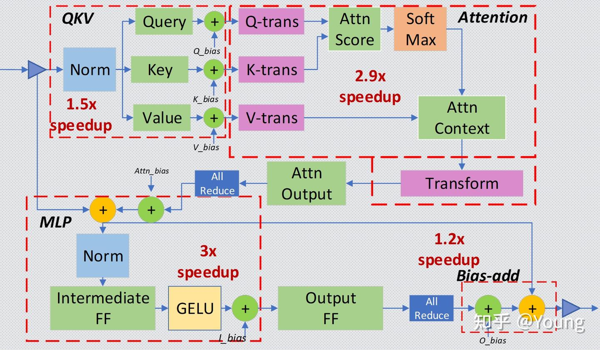

# 大语言模型推理性能优化综述
> _**作者: Young**_
> 
> _**原文: https://zhuanlan.zhihu.com/p/656485997**_

1 摘要
----

自 OpenAI 发布 ChatGPT 以来，基于 Transformer 架构的[大语言模型](https://zhida.zhihu.com/search?content_id=234014369&content_type=Article&match_order=1&q=%E5%A4%A7%E8%AF%AD%E8%A8%80%E6%A8%A1%E5%9E%8B&zhida_source=entity) (LLM) 在全球范围内引发了深度的技术关注，并取得了令人瞩目的成就。其强大的理解和生成能力，正在深刻改变我们对人工智能的认知和应用。然而大语言模型的推理应用成本过高，高昂的成本大大阻碍了技术落地。因此，大语言模型的推理性能优化成为业界研究的热点。

大语言模型推理面临计算资源的巨大需求和计算效率的挑战。优化推理性能不仅可以减少硬件成本，还可以提高模型的实时响应速度。它使模型能够更快速地执行[自然语言理解](https://zhida.zhihu.com/search?content_id=234014369&content_type=Article&match_order=1&q=%E8%87%AA%E7%84%B6%E8%AF%AD%E8%A8%80%E7%90%86%E8%A7%A3&zhida_source=entity)、翻译、文本生成等任务，从而改善用户体验，加速科学研究，推动各行业应用的发展。

本文从推理服务系统全局视角介绍典型性能优化技术和各自特点，最后分析未来大语言模型推理优化技术的发展趋势和演进方向，最终为未来的人工智能应用打开更广阔的可能性。

2 优化技术
------

LLM 推理服务重点关注两个指标：吞吐量和时延：

*   吞吐量：主要从系统的角度来看，即系统在单位时间内能处理的 tokens 数量。计算方法为系统处理完成的 tokens 个数除以对应耗时，其中 tokens 个数一般指输入序列和输出序列长度之和。吞吐量越高，代表 LLM 服务系统的资源利用率越高，对应的系统成本越低。
*   时延：主要从用户的视角来看，即用户平均收到每个 token 所需位时间。计算方法为用户从发出请求到收到完整响应所需的时间除以生成序列长度。一般来讲，当时延不大于 50 ms/token 时，用户使用体验会比较流畅。

吞吐量关注系统成本，高吞吐量代表系统单位时间处理的请求大，系统利用率高。时延关注用户使用体验，即返回结果要快。这两个指标一般情况下需要会相互影响，因此需要权衡。例如， 提高吞吐量的方法一般是提升 batchsize，即将用户的请求由串行改为并行。但 batchsize 的增大会在一定程度上损害每个用户的时延，因为以前只计算一个请求，现在合并计算多个请求，每个用户等待的时间变长。

LLM 推理性能优化主要以提高吞吐量和降低时延为目的，具体可以划分为如下六部分，下面详细展开描述。

图 1 LLM推理性能优化技术概览

### 2.1 显存相关优化

### 2.1.1 KV Cache

大模型推理性能优化的一个最常用技术就是 KV Cache，该技术可以在不影响任何计算精度的前提下，通过空间换时间思想，提高推理性能。目前业界主流 LLM [推理框架](https://zhida.zhihu.com/search?content_id=234014369&content_type=Article&match_order=1&q=%E6%8E%A8%E7%90%86%E6%A1%86%E6%9E%B6&zhida_source=entity)均默认支持并开启了该功能。

Transformer 模型具有[自回归推理](https://zhida.zhihu.com/search?content_id=234014369&content_type=Article&match_order=1&q=%E8%87%AA%E5%9B%9E%E5%BD%92%E6%8E%A8%E7%90%86&zhida_source=entity)的特点，即每次推理只会预测输出一个 token，当前轮输出token 与历史输入 tokens 拼接，作为下一轮的输入 tokens，反复执行多次。该过程中，前后两轮的输入只相差一个 token，存在重复计算。KV Cache 技术实现了将可复用的[键值向量](https://zhida.zhihu.com/search?content_id=234014369&content_type=Article&match_order=1&q=%E9%94%AE%E5%80%BC%E5%90%91%E9%87%8F&zhida_source=entity)结果保存下来，从而避免了重复计算。

图 2 KV Cache在Self-Attention中的位置

具体来讲，KV Cache 技术是指每次自回归推理过程中，将 Transformer 每层的 Attention 模块中的 `X_i`\*`_W_k_` _和_ `_X_i_`_\*_`W_v` 结果保存保存在一个数据结构（称为 KV Cache）中（如图 2 所示），当执行下一次自回归推理时，直接将 `X_i+1`\*`_W_k_` _和_ `_X_i+1_`_\*_`W_v` 与 KV Cache 拼接在一起，供后续计算使用（如下图所示）。其中，`X_i` 代表第 `i` 步推理的输入，`W_k` 和 `W_v` 分别代表键值权重矩阵。

图 3 利用KV Cache执行推理示意图

KV Cache 缓存每一轮已计算完毕的键值向量，因此会额外增加显存开销。以 LLaMA-7B 模型为例，每个 token 对应的 KV Cache 空间 `cache_per_tokens` 可通过如下公式计算：

\\begin{equation} \\begin{split} cache\\\_per\\\_token=2\*n\\\_layer\*n\\\_head\*d\\\_head\*dtype\\\_size \\label{eq:cachepertoken公式} \\end{split} \\end{equation}

公式中第一个因子 2 代表 Key/Value 两个向量，每层都需存储这两个向量，`n_layer` 为 Transformer layer 个数，`n_head` 代表 KV head 个数（模型为多头注意力时，该值即注意力头数，模型为多查询注意力时，该值为 1），`d_head` 为每个 KV head 的维度，`dtype_size` 为每存放一个 KV Cache 数据所需的字节数。模型推理所需的 KV Cache 总量为公式 如下：

\\begin{equation} total\\\_cache=batchsize\*context\\\_length\*cache\\\_per\\\_token \\label{eq:totalcache} \\end{equation}

其中 `context_length` 为输入和输出序列长度之和。因此，KV Cache 与 batchsize 和序列长度呈线性关系。

KV Cache 的引入也使得推理过程分为如下两个不同阶段，进而影响到后续的其他优化方法。

*   预填充阶段：发生在计算第一个输出 token 过程中，计算时需要为每个 Transformer layer 计算并保存 key cache 和 value cache；FLOPs 同 KV Cache 关闭一致，存在大量 GEMM (GEneral Matrix-Matrix multiply) 操作，属于 [Compute-bound](https://zhida.zhihu.com/search?content_id=234014369&content_type=Article&match_order=1&q=Compute-bound&zhida_source=entity) 类型计算。
*   解码阶段：发生在计算第二个输出 token 至最后一个 token 过程中，这时 KV Cache 已存有历史键值结果，每轮推理只需读取 Cache，同时将当前轮计算出的新的 Key、Value 追加写入至 Cache；GEMM 变为 GEMV (GEneral Matrix-Vector multiply) 操作，FLOPs 降低，推理速度相对预填充阶段变快，这时属于 Memory-bound 类型计算。

### 2.1.2 Paged Attention

LLM 推理服务的吞吐量指标主要受制于显存限制。研究团队发现现有系统由于缺乏精细的显存管理方法而浪费了 60% 至 80% 的显存，浪费的显存主要来自 KV Cache。因此，有效管理 KV Cache 是一个重大挑战。

在 Paged Attention 之前，业界主流 LLM 推理框架在 KV Cache 管理方面均存在一定的低效。HuggingFace Transformers 库中，KV Cache 是随着执行动态申请显存空间，由于 GPU显存分配耗时一般都高于 CUDA kernel 执行耗时，因此动态申请显存空间会造成极大的时延开销，且会引入显存碎片化。FasterTransformer 中，预先为 KV Cache 分配了一个充分长的显存空间，用于存储用户的上下文数据。例如 LLaMA-7B 的上下文长度为 2048，则需要为每个用户预先分配一个可支持 2048 个 tokens 缓存的显存空间。如果用户实际使用的上下文长度低于2048，则会存在显存浪费。Paged Attention 将传统操作系统中对内存管理的思想引入 LLM，实现了一个高效的显存管理器，通过精细化管理显存，实现了在物理非连续的显存空间中以极低的成本存储、读取、新增和删除键值向量。

具体来讲，Paged Attention 将每个序列的 KV Cache 分成若干块，每个块包含固定数量token 的键和值。

首先在推理实际任务前，会根据用户设置的 `[max_num_batched_tokens](https://zhida.zhihu.com/search?content_id=234014369&content_type=Article&match_order=1&q=max_num_batched_tokens&zhida_source=entity)` 和 `gpu_memory_util` 预跑一次推理计算，记录峰值显存占用量 `peak_memory`，然后根上面公式获得当前软硬件环境下 KV Cache 可用的最大空间，并预先申请缓存空间。其中，`max_num_batched_tokens` 为部署环境的硬件显存一次最多能容纳的 token 总量，`gpu_memory_util` 为模型推理的最大显存占用比例，`total_gpu_memory` 为物理显存量， `block_size` 为块大小（默认设为 16）。

\\begin{equation} num\\\_gpu\\\_blocks = \\frac{total\\\_gpu\\\_memory\*gpu\\\_memory\\\_util-peak\\\_memory}{cache\\\_per\\\_token\*block\\\_size} \\label{eq:numgpublocks计算公式} \\end{equation}

在实际推理过程中，维护一个逻辑块到物理块的映射表，多个逻辑块可以对应一个物理块，通过[引用计数](https://zhida.zhihu.com/search?content_id=234014369&content_type=Article&match_order=1&q=%E5%BC%95%E7%94%A8%E8%AE%A1%E6%95%B0&zhida_source=entity)来表示物理块被引用的次数。当引用计数大于一时，代表该物理块被使用，当引用计数等于零时，代表该物理块被释放。通过该方式即可实现将地址不连续的物理块串联在一起统一管理。

Paged Attention 技术开创性地将操作系统中的分页内存管理应用到 KV Cache 的管理中，提高了显存利用效率。另外，通过 token 块粒度的显存管理，系统可以精确计算出剩余显存可容纳的 token 块的个数，配合后文 Dynamic Batching 技术，即可避免系统发生[显存溢出](https://zhida.zhihu.com/search?content_id=234014369&content_type=Article&match_order=1&q=%E6%98%BE%E5%AD%98%E6%BA%A2%E5%87%BA&zhida_source=entity)的问题。

### 2.2 计算相关优化

### 2.2.1 算子融合

算子融合是深度学习模型推理的一种典型优化技术，旨在通过减少计算过程中的访存次数和 Kernel 启动耗时达到提升模型推理性能的目的，该方法同样适用于 LLM 推理。

以 HuggingFace Transformers 库推理 LLaMA-7B 模型为例，经分析模型推理时的算子执行分布如下图所示，该模型有 30 个类型共计 2436 个算子，其中 aten::slice 算子出现频率为 388 次。大量小算子的执行会降低 GPU 利用率，最终影响推理速度。

图 4 LLaMA-7B模型的算子分布

目前业界基本都针对 Transformer layer 结构特点，手工实现了算子融合。以 DeepSpeed Inference 为例，算子融合主要分为如下四类：

*   [归一化层](https://zhida.zhihu.com/search?content_id=234014369&content_type=Article&match_order=1&q=%E5%BD%92%E4%B8%80%E5%8C%96%E5%B1%82&zhida_source=entity)和 QKV 横向融合：将三次计算 Query/Key/Value 的操作合并为一个算子，并与前面的归一化算子融合。
*   [自注意力](https://zhida.zhihu.com/search?content_id=234014369&content_type=Article&match_order=1&q=%E8%87%AA%E6%B3%A8%E6%84%8F%E5%8A%9B&zhida_source=entity)计算融合：将自注意力计算涉及到的多个算子融合为一个，业界熟知的 FlashAttention 即是一个成熟的自注意力融合方案。
*   [残差连接](https://zhida.zhihu.com/search?content_id=234014369&content_type=Article&match_order=1&q=%E6%AE%8B%E5%B7%AE%E8%BF%9E%E6%8E%A5&zhida_source=entity)、归一化层、全连接层和[激活层](https://zhida.zhihu.com/search?content_id=234014369&content_type=Article&match_order=1&q=%E6%BF%80%E6%B4%BB%E5%B1%82&zhida_source=entity)融合：将 MLP 中第一个全连接层上下相关的算子合并为一个。
*   偏置加法和残差连接融合。

图 5 Transformer layer中的算子融合示意

由于算子融合一般需要定制化实现算子 CUDA kernel，因此对 GPU 编程能力要求较高。随着编译器技术的引入，涌现出 OpenAI Triton 、TVM 等优秀的框架来实现算子融合的自动化或半自动化，并取得了一定的效果。

### 2.2.2 [高性能算子](https://zhida.zhihu.com/search?content_id=234014369&content_type=Article&match_order=1&q=%E9%AB%98%E6%80%A7%E8%83%BD%E7%AE%97%E5%AD%90&zhida_source=entity)

针对 LLM 推理运行热点函数编写高性能算子，也可以降低推理时延。

*   GEMM 操作相关优化：在 LLM 推理的预填充阶段，Self-Attention 和 MLP 层均存在多个 GEMM 操作，耗时占据了推理时延的 80% 以上。GEMM 的 GPU 优化是一个相对古老的问题，在此不详细展开描述算法细节。英伟达就该问题已推出 cuBLAS、CUDA、CUTLASS 等不同层级的优化方案。例如，FasterTransformer 框架中存在大量基于 CUTLASS 编写的 GEMM 内核函数。另外，Self-Attention 中存在 GEMM+Softmax+GEMM 结构，因此会结合算子融合联合优化。
*   GEMV 操作相关优化：在 LLM 推理的解码阶段，运行[热点函数](https://zhida.zhihu.com/search?content_id=234014369&content_type=Article&match_order=2&q=%E7%83%AD%E7%82%B9%E5%87%BD%E6%95%B0&zhida_source=entity)由 GEMM 变为 GEMV。相比 GEMM，[GEMV](https://zhida.zhihu.com/search?content_id=234014369&content_type=Article&match_order=4&q=GEMV&zhida_source=entity) 的计算强度更低，因此优化点主要围绕降低访存开销开展。

高性能算子的实现同样对 GPU 编程能力有较高要求，且算法实现中的若干超参数与特定问题规模相关。因此，编译器相关的技术如自动调优也是业界研究的重点。

### 2.3 服务相关优化

服务相关优化主要包括 Continuous Batching、Dynamic Batching 和 异步 Tokenize / Detokenize。其中 Continuous Batching 和 Dynamic Batching 主要围绕提高可并发的 batchsize 来提高吞吐量，异步 Tokenize / Detokenize 则通过多线程方式将 Tokenize / Detokenize 执行与模型推理过程时间交叠，实现降低时延目的。

| 问题分类 | 现象  | 解决方法 | 实现原理 | 特点  |
| --- | --- | --- | --- | --- |
| 问题一 | 同批次序列推理时，存在“气泡”，导致 GPU 资源利用率低 | Continuous Batching | 由 batch 粒度的调度细化为 step 级别的调度 | 在时间轴方向动态插入新序列 |
| 问题二 | 批次大小固定不变，无法随计算资源负载动态变化，导致 GPU 资源利用率低 | Dynamic Batching | 通过维护一个作业队列实现 | 在 batch 维度动态插入新序列 |
| 问题三 | Tokenize / Detokenize 过程在 CPU 上执行，期间 GPU 处于空闲状态 | 异步 Tokenize / Detokenize | 多线程异步 | 流水线 overlap 实现降低时延 |

大语言模型的输入和输出均是可变长度的。对于给定问题，模型在运行前无法预测其输出长度。在实际服务场景下，每个用户的问题长度各不相同，问题对应的答案长度也不相同。传统方法在同批次序列推理过程中，存在“气泡”现象，即必须等同批次内的所有序列完成推理之后，才会执行下一批次序列，这就会引起 GPU 资源的浪费，导致 GPU 利用率偏低。

图 6 Static Batching示意图

图中序列 3 率先结束，但由于其他序列尚未结束，因此需要等待直至所有序列计算完毕。理想情况下，同批次的所有序列的输入加输出的长度均相同，这时不存在“气泡”现象；极端情况下则会出现超过 50\\% 以上的资源浪费。

另一方面，传统方法推理时 batchsize 是固定不变的，无法随计算资源负载动态变化。比如某一段时间内，同批次下的序列长度都偏短，原则上可以增加 batchsize 以充分利用 GPU 计算资源。然而由于固定 batchsize，无法动态调整批次大小。

Continuous Batching 和 Dynamic Batching 思想最早来自论文 Orca: A Distributed Serving System for Transformer-Based Generative Models。针对问题一，提出 Continuous Batching，原理为将传统 batch 粒度的任务调度细化为 step 级别的调度。首先，调度器会维护两个队列，分别为 Running 队列和 Waiting 队列，队列中的序列状态可以在 Running 和 Waiting 之间转换。在自回归迭代生成每个 token 后，调度器均会检查所有序列的状态。一旦序列结束，调度器就将该序列由 Running 队列移除并标记为已完成，同时从 Waiting 队列中按 FCFS (First Come First Service) 策略取出一个序列添加至 Running 队列。

图 7 Continuous Batching示意图

图中，序列 3 率先在 T5 时刻结束，这时调度器会检测到序列 3 已结束，将序列 3 从 Running 队列中移除，并从 Waiting 队列中按 FCFS 策略取出序列 5 添加至 Running 队列并启动该序列的推理。通过该方法，即可最大限度地消除“气泡”现象。

问题一可以理解为在时间轴方向动态插入新序列，问题二则是在 batch 维度动态插入新序列，以尽可能地充分利用显存空间。具体来讲，在自回归迭代生成每个 token 后，调度器通过当前剩余显存量，动态调整 Running 队列的长度，从而实现 Dynamic Batching。例如，当剩余显存量较多时，会尽可能增加 Running 队列长度；当待分配的 KV Cache 超过剩余显存时，调度器会将 Running 队列中低优先级的序列换出至 Waiting 队列，并将换出序列占用的显存释放。

如上两个 batching 相关的优化技术可有效提升推理吞吐量，目前已在 HuggingFace Text-Generation-Interface (TGI)、vLLM、OpenPPL-LLM 等多个框架中实现。

### 2.4 分布式相关优化

由于大语言模型参数量较大，可能无法存放到单一计算设备中，分布式并行可以有效解决该问题。分布式并行中的模型并行和流水线并行已在 LLM 推理中得到应用。由于篇幅有限，本文聚焦模型并行。模型并行通过将权重参数拆分到多个计算设备中，实现分布式计算。

图 8 两种常见的模型并行方式：Column Parallel和Row Parallel

图中，第一行代表 Column Parallel，即将权重数据按列拆分到多个 GPU 中，每个 GPU 上的本地计算结果需要在列方向拼接为最终结果；第二行代表 Row Parallel，即将权重数据按行拆分到多个 GPU 中，每个 GPU 上的本地计算结果需要 AllReduce 规约为最终结果。

图 9 MLP和Self-Attention中的模型并行

业界最流行的模型并行方案来自 Megatron-LM，其针对 Self-Attention 和 MLP 分别设计了简洁高效的模型并行方案。

*   MLP: 第一个全连接层为 Column Parallel，第二个全连接层为 Row Parallel，整个 MLP 只需在 Row Parallel 后执行一次 AllReduce 规约操作即可。
*   Self-Attention：在计算 Query、Key 和 Value 向量时执行 Column Parallel（按注意力头个数均分到每个 GPU），在将注意力得分做空间映射时执行 Row Parallel，整个 Self-Attention 只需在 Row Parallel 后执行一次 AllReduce 规约操作即可。

上面分析了 Transformer layer 的模型并行方式。除此之外，LLM 模型中的 Input Embedding 采用 Row Parallel，Output Embedding 采用 Column Parallel；Dropout / Layer Norm / Residual Connections 等操作都没有做并行拆分。例如 Layer Norm 的权重参数和计算，在每个 GPU 上都是完整的。

| Layers | Model Parallel Method |
| --- | --- |
| Input Embedding | Row Parallel |
| Self-Attention | Column Parallel + Row Parallel |
| MLP | Column Parallel + Row Parallel |
| Output Embedding | Column Parallel |

基于以上基础，以 LLaMA-34B 模型为例进行通信量分析。该模型包含 48 个 Transformer layers，隐藏层大小 8192，每次单 batch 推理共 2\*_48=96 次 Broadcast 和_ 2\*_48=96_ 次 AllReduce 操作，每次通信传输的数据量均为 16 KB（此处假设数据类型为半精度浮点，8192\*2/1024=16 KB）。考虑到推理服务一般都是按多 batch 推理执行，假设 batchsize 为 64，每次通信传输的数据量也仅为 1 MB。下图在 A100-PCIE-40GB 机器上测试 NCCL AllReduce 带宽数据，PCIE 理论带宽为 32-64 GB/s 左右，实际推理场景下的通信数据量主要集中在 1 MB 以下，对应的实际带宽约为 1-10 GB/s。NVLink 理论带宽为 400-600 GB/s，但由于每次的通信量很小，实际带宽也远远小于理论带宽。因此模型参数量越大、batchsize 越大，通信效率越高，使用模型并行获得的收益约明显。

图 10 AllReduce实际带宽测试

### 2.5 低比特量化

回归到 LLM 模型推理吞吐量和时延这两个重要的性能指标上：吞吐量的提升主要受制于显存容量，如果降低推理时显存占用量，就可以运行更大的 batchsize，即可提升吞吐量；LLM 推理具有 Memory-bound 特点，如果降低访存量，将在吞吐量和时延两个性能指标上都有收益。低比特量化技术可以降低显存占用量和访存量，其能取得加速的关键在于显存量和访存量的节省以及量化计算的加速远大于反量化带来的额外开销。

| 被量化的对象 | 量化方法 | 特点  |
| --- | --- | --- |
| 权重量化 | LLM.int8(), GPTQ | 显存占用减半，但由于计算结果需反量化，时延基本无收益 |
| 权重和激活同时量化 | SmoothQuant | 显存占用减半，时延有收益，精度几乎匹配 FP16 |
| KV Cache量化 | INT8 或 FP8 量化 | 方法简单，吞吐量收益明显 |
| 基于硬件特点的量化：英伟达 Hopper 架构下的 FP8 | 直接利用 TensorCore FP8 计算指令 | 不需要额外的量化/反量化操作，时延收益明显 |

表中的四类量化方法各有特点，业界在低比特量化方向的研究进展也层出不穷，希望探索出一个适用于大语言模型的、能够以较高压缩率压缩模型、加速端到端推理同时保证精度的量化方法。

### 2.6 其他新技术

当前，业界在将传统优化技术引入 LLM 推理的同时，同时也在探索从大模型自回归解码特点出发，通过调整推理过程和引入新的模型结构来进一步提升推理性能。

例如，投机采样（Speculative decoding）针对 LLM 推理串行解码特点，通过引入一个近似模型来执行串行解码，原始模型执行并行评估采样，通过近似模型和原始模型的互相配合，在保证精度一致性的同时降低了大模型串行解码的次数，进而降低了推理时延。美杜莎头（Medusa head）则是对投机采样的进一步改进，其摒弃了近似模型，在原始模型结构上新增了若干解码头，每个解码头可并行预测多个后续 tokens，然后使用基于树状[注意力机制](https://zhida.zhihu.com/search?content_id=234014369&content_type=Article&match_order=1&q=%E6%B3%A8%E6%84%8F%E5%8A%9B%E6%9C%BA%E5%88%B6&zhida_source=entity)并行处理，最后使用典型接收方案筛选出合理的后续 tokens。该方法同样降低了大模型串行解码的次数，最终实现约两倍的时延加速。

3 总结
----

大语言模型推理性能优化技术正迅速演进，不仅涉及计算机科学和人工智能领域，还融合了多个学科的知识，实现了前所未有的跨学科交叉渗透。演进的动力源自对大规模模型应用的需求，为了充分发挥这些模型的潜力，研究人员正在不断改进推理性能，包括算法优化、硬件加速、分布式计算等方面的创新。这一快速演进和跨学科渗透的趋势不仅将提高大语言模型的实用性，还为未来的自然语言处理应用和人工智能技术带来更大的创新和应用潜力。

参考
--

1\. W. Kwon, Z. Li, S. Zhuang, Y. Sheng, L. Zheng, C. H. Yu,J. E. Gonzalez, H. Zhang and I. Stoica, Efficient MemoryManagement for Large Language Model Serving with Page-dAttention, Proceedings of the ACM SIGOPS 29th Sympo-sium on Operating Systems Principles, 2023.  
2\. S. Z. Y. S. L. Z. C. Y. J. G. H. Z. Woosuk Kwon, Zhuohan Liand I. Stoica, vLLM: Easy, Fast, and Cheap LLM Servingwith PagedAttention,[https://vllm.ai/](https://link.zhihu.com/?target=https%3A//vllm.ai/), 2022.  
3\. HuggingFace, Transformers: State-of-the-art MachineLearning for Pytorch, TensorFlow, and JAX.,[https://github.com/huggingface/transformers](https://link.zhihu.com/?target=https%3A//github.com/huggingface/transformers).  
4\. NVIDIA, FasterTransformer,[https://github.com/NVIDIA/FasterTransformer](https://link.zhihu.com/?target=https%3A//github.com/NVIDIA/FasterTransformer), 2021.  
5\. R. Y. Aminabadi, S. Rajbhandari, A. A. Awan, C. Li, D. Li,E. Zheng, O. Ruwase, S. Smith, M. Zhang, J. Rasley et al.,DeepSpeed-inference: enabling efficient inference of trans-former models at unprecedented scale, SC22: InternationalConference for High Performance Computing, Networking,Storage and Analysis, 2022, 1–15.  
6\. P. Tillet, H.-T. Kung and D. Cox, Triton: an intermedi-ate language and compiler for tiled neural network com-putations, Proceedings of the 3rd ACM SIGPLAN Inter-national Workshop on Machine Learning and ProgrammingLanguages, 2019, 10–19.  
7\. T. Chen, T. Moreau, Z. Jiang, L. Zheng, E. Yan, H. Shen,M. Cowan, L. Wang, Y. Hu, L. Ceze et al., TVM: An au-tomated End-to-End optimizing compiler for deep learning,13th USENIX Symposium on Operating Systems Design andImplementation (OSDI 18), 2018, 578–594.  
8\. M. Shoeybi, M. Patwary, R. Puri, P. LeGresley, J. Casperand B. Catanzaro, Megatron-lm: Training multi-billion pa-rameter language models using model parallelism, arXivpreprint arXiv:1909.08053, 2019.  
9\. T. Dettmers, M. Lewis, Y. Belkada and L. Zettlemoyer, Llm.int8 (): 8-bit matrix multiplication for transformers at scale,arXiv preprint arXiv:2208.07339, 2022.  
10\. E. Frantar, S. Ashkboos, T. Hoefler and D. Alistarh,Gptq: Accurate post-training quantization for generativepre-trained transformers, arXiv preprint arXiv:2210.17323,2022.  
11\. G. Xiao, J. Lin, M. Seznec, H. Wu, J. Demouth and S. Han,Smoothquant: Accurate and efficient post-training quanti-zation for large language models, International Conferenceon Machine Learning, 2023, 38087–38099.  
12\. A. C. Elster and T. A. Haugdahl, Nvidia hopper gpu andgrace cpu highlights, Computing in Science & & Engineering, 2022, 24, 95–100.  
13\. C. Chen, S. Borgeaud, G. Irving, J.-B. Lespiau, L. Sifreand J. Jumper, Accelerating large language model decodingwith speculative sampling, arXiv preprint arXiv:2302.01318,2023.  
14\. Y. Leviathan, M. Kalman and Y. Matias, Fast inference fromtransformers via speculative decoding, International Confer-ence on Machine Learning, 2023, 19274–19286.  
15\. T. Cai, Y. Li, Z. Geng, H. Peng and T. Dao, Medusa: SimpleFramework for Accelerating LLM Generation with MultipleDecoding Heads,[https://github.com/FasterDecoding/Medusa](https://link.zhihu.com/?target=https%3A//github.com/FasterDecoding/Medusa), 2023.