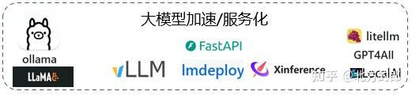
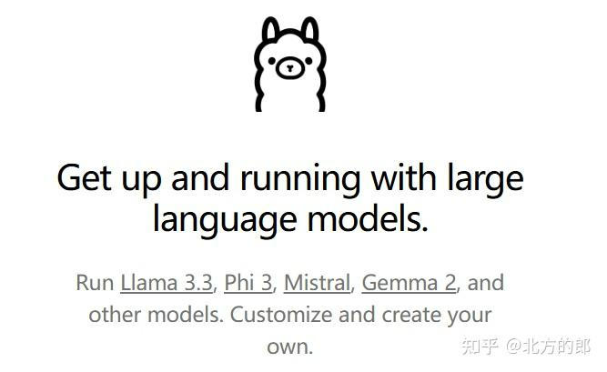
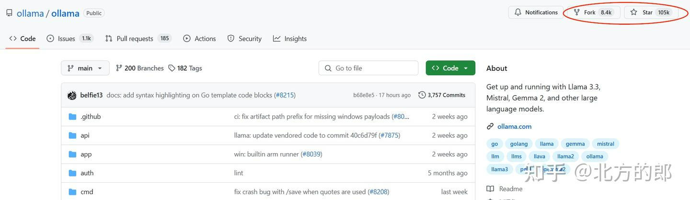
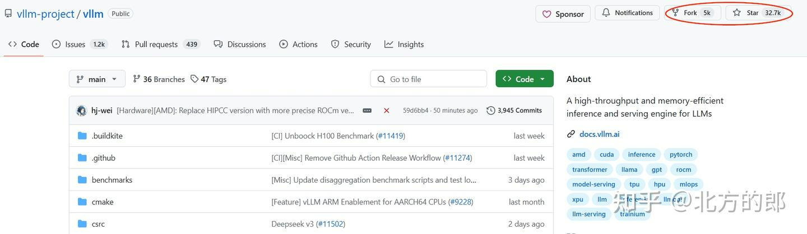
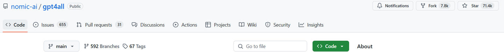
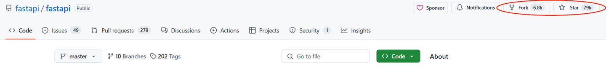

# 简单整理&一句话点评&我常用的几款大模型&以及工具模型&推理、加速开源工具
> _**作者: 北方的郎**_
> 
> _**原文:**_ [_**https://zhuanlan.zhihu.com/p/15224010652**_](https://zhuanlan.zhihu.com/p/15224010652)

简单整理了一下,我用到的大模型(以及工具模型)推理、加速工具.本人水平有限,如有错漏,请多谅解.

Ollama
------

官网: [Ollama](https://link.zhihu.com/?target=https%3A//ollama.com/)

Github: [https://github.com/ollama/ollama](https://link.zhihu.com/?target=https%3A//github.com/ollama/ollama)

点评: Ollama是以llama.cpp为后端的前端大模型推理框架,可快速部署主流模型.它一开始主要目的是让用户轻松地在自己的电脑上使用LLMs,现在也逐渐增强对并发等2B场景的支持.可以处理多个请求.相对适合**个人或小规模使用,对于多用户、大并发稍差**.

Ollama是我现在最喜欢的大模型推理工具,资源占用少,使用起来简单、方便,推理速度也很不错.一般模型的支持速度也非常快,不过对于超大型模型(如DeepSeek-V3)的支持速度不如vLLM和LMDeploy.

个人感觉,除非你的应用对大吞吐、大并发有很大要求,否则可以考虑它.

场景: 商业+个人,偏个人一些.

我的使用经验及案例:

[北方的郎: 整合Live2D数字人和VAD模型,实现自动唤醒及交互](https://zhuanlan.zhihu.com/p/11157791341)

[北方的郎: Ollama(0.3.5)国产海光DCU(K100-AI)适配记录](https://zhuanlan.zhihu.com/p/6460116181)

[北方的郎: Vanna+Ollama部署本地智能数据库](https://zhuanlan.zhihu.com/p/709168817)

[北方的郎: 安装测试 langchain-chatchat 0.3.1 版](https://zhuanlan.zhihu.com/p/709383659)

[北方的郎: 在AiStudio上跑Ollama,让免费GPU资源用起来更方便](https://zhuanlan.zhihu.com/p/705449447)

[北方的郎: DB-GPT+Ollama构建本地智能数据平台](https://zhuanlan.zhihu.com/p/704308463)

[北方的郎: Ollama\_functions +QWen2实现Agent函数调用,2G显卡就可以跑的Demo](https://zhuanlan.zhihu.com/p/702377926)

[北方的郎: 使用Ollama+Qwen-Agent快速构建智能体应用](https://zhuanlan.zhihu.com/p/702244190)

[北方的郎: QWen2 调用测试,包括Ollama及代码调用等,模型很好、量化版有待优化](https://zhuanlan.zhihu.com/p/702122804)

[北方的郎: 远端ollama+CPU环境部署QAnything,构建本地大模型应用平台](https://zhuanlan.zhihu.com/p/699384310)

[北方的郎: 简单测试Ollama上两个新的VLM: llava-phi3和llava-llama3](https://zhuanlan.zhihu.com/p/701492644)

[北方的郎: AutoGen+Ollama:构建多智能体应用](https://zhuanlan.zhihu.com/p/700107605)

[北方的郎: open-interpreter+ollama构建LLM自动编码智能体](https://zhuanlan.zhihu.com/p/698245718)

[北方的郎: anytingllm+ollama构建大模型应用](https://zhuanlan.zhihu.com/p/697594423)

[北方的郎: dify+ollama构建本地大模型平台](https://zhuanlan.zhihu.com/p/697386670)

VLLM:
-----

github:[GitHub - vllm-project/vllm: A high-throughput and memory-efficient inference and serving engine for LLMs](https://link.zhihu.com/?target=https%3A//github.com/vllm-project/vllm)

点评: vLLM是一个快速且易于使用的LLM推理和服务库,使用PageAttention高效管理kv内存,Continuous batching传入请求,支持很多Hugging Face模型.

我总结它的特点就是大,大吞吐、大并发、大模型(对大型模型的支持一般都比较快).

场景: 偏商业

我的使用经验:

[北方的郎: ollama, vLLM等几款大模型加速/服务化软件简单对比](https://zhuanlan.zhihu.com/p/691919250)

[北方的郎: vllma环境安装及部署测试](https://zhuanlan.zhihu.com/p/689669901)

LMDeploy
--------

LMDeploy 由 MMDeploy 和 MMRazor 团队联合开发,是涵盖了 LLM 任务的全套轻量化、部署和服务解决方案.看介绍来说,SGLang 的吞吐能力比起 vllm 是相当或者要好一些的.不过我测试感觉差不多.

感觉LMDeploy的特点及生态位上和vLLM重叠.

场景: 偏商业

GPT4ALL
-------

[https://github.com/nomic-ai/gpt4all](https://link.zhihu.com/?target=https%3A//github.com/nomic-ai/gpt4all)

这个是在各种硬件(如CPU,arm等)上跑大模型的,也是在llama.cpp基础上搞的.比ollama更偏端侧一些.

XInference
----------

[https://github.com/xorbitsai/inference](https://link.zhihu.com/?target=https%3A//github.com/xorbitsai/inference)

Xorbits Inference(Xinference)是一个高性能大模型分布式推理平台,将大模型变成API可以访问的服务.Xinference支持不同的推理引擎,如vLLM、sglang、llama.cpp、transformers等,以适应不同的模型和应用需求.

我一般不会用XInference跑大模型服务(感觉这样有点多此一举),我经常用它跑各种工具模型,如ASR、TTS等.

我的应用经验:

[北方的郎: 海光DCU上利用XInference服务化部署SenseVoiceSmall等ASR服务](https://zhuanlan.zhihu.com/p/7506063762)

[北方的郎: 在海光DCU上部署ChatTTS及XInference服务化处理](https://zhuanlan.zhihu.com/p/6857961272)

[北方的郎: 在XInference上部署ChatTTS为Dify提供本地TTS服务](https://zhuanlan.zhihu.com/p/5161920338)

FastAPI
-------

[GitHub - fastapi/fastapi: FastAPI framework, high performance, easy to learn, fast to code, ready for production](https://link.zhihu.com/?target=https%3A//github.com/fastapi/fastapi)

我用FastAPI,主要是对XInference等工具也不支持的工具模型进行封装.对于ASR,TTS等服务,我一般都是封装成openai兼容模式,方面使用.

[北方的郎: 小快灵的TTS模型piper,模型部署及服务化处理](https://zhuanlan.zhihu.com/p/8013125459)

[北方的郎: MeloTTS部署问题解决,及服务化处理](https://zhuanlan.zhihu.com/p/7798105492)

[北方的郎: YOLOv10 发布！技术原理、功能调用、模型服务化、应用一站式详解](https://zhuanlan.zhihu.com/p/700013499)

[北方的郎: FastAPI+yolov8构建图像识别服务](https://zhuanlan.zhihu.com/p/699605317)

LiteLLM
-------

LiteLLM可以将大模型,或者服务,封装成OpenAI格式,方便大家使用

我的使用经验:

[北方的郎: 模拟OpenAI API的利器: litellm介绍](https://zhuanlan.zhihu.com/p/692686053)

llama.cpp
---------

[https://github.com/ggerganov/llama.cpp](https://link.zhihu.com/?target=https%3A//github.com/ggerganov/llama.cpp)

\_llama.cpp\_主要目标是在最小化设置和硬件上实现大规模语言模型(LLM)的推理,并在本地和云端都能达到最先进的性能.