# FlashInfer：为LLM推理服务打造的高效、可定制注意力引擎
> _**作者: 北方的郎**_
> 
> _**原文: https://zhuanlan.zhihu.com/p/17655257694**_

在当今人工智能领域，大型语言模型（LLMs）如GPT、BERT等已经成为推动技术进步的核心力量。然而，随着这些模型的规模不断扩大，如何在推理过程中高效地处理[注意力机制](https://zhida.zhihu.com/search?content_id=252553102&content_type=Article&match_order=1&q=%E6%B3%A8%E6%84%8F%E5%8A%9B%E6%9C%BA%E5%88%B6&zhida_source=entity)成为了一个巨大的挑战。注意力机制是Transformer架构的核心，它负责处理历史上下文并生成输出。然而，随着模型规模的增加，传统的注意力计算方法在GPU上的效率逐渐成为瓶颈。为了解决这一问题，来自华盛顿大学、NVIDIA等机构的研究团队提出了**FlashInfer**，一个专为LLM推理服务设计的高效、可定制的注意力引擎。FlashInfer不仅优化了内存访问，还通过[动态调度](https://zhida.zhihu.com/search?content_id=252553102&content_type=Article&match_order=1&q=%E5%8A%A8%E6%80%81%E8%B0%83%E5%BA%A6&zhida_source=entity)和JIT编译技术，显著提升了推理性能。

论文地址：[FlashInfer: Efficient and Customizable Attention Engine for LLM Inference Serving](https://link.zhihu.com/?target=https%3A//arxiv.org/abs/2501.01005)

**1\. 引言**
----------

Transformer架构已经成为大型语言模型（LLMs）的主要支柱，而注意力机制则是其最核心的组成部分。随着LLMs的快速发展和广泛应用，对高效GPU注意力内核的需求日益增长，以实现可扩展和响应迅速的[模型推理](https://zhida.zhihu.com/search?content_id=252553102&content_type=Article&match_order=1&q=%E6%A8%A1%E5%9E%8B%E6%8E%A8%E7%90%86&zhida_source=entity)。在LLM推理中，注意力计算扮演着关键角色，它负责处理历史上下文并基于查询向量生成输出。在LLM服务中，注意力机制从[KV-Cache](https://zhida.zhihu.com/search?content_id=252553102&content_type=Article&match_order=1&q=KV-Cache&zhida_source=entity)中读取历史上下文，并根据当前查询计算输出。因此，注意力操作符的效率对整个LLM推理系统的性能至关重要。然而，为LLM服务构建高效注意力内核面临着传统训练环境中不常见的挑战。

**挑战一：LLM应用的工作负载模式和输入动态性多样化。**  
LLM服务涉及多种注意力计算模式，从上下文处理的预填充计算到服务期间的批量解码。随着多个请求的处理，**前缀重用**的机会出现，而在推测性场景中引入的树解码则创造了额外的注意力模式。此外，查询长度和KV-Cache在批次内和随时间变化，简单的实现可能会遇到负载不平衡问题，最优调度需要内核动态适应以实现最佳性能。

**挑战二：现代硬件实现需要定制注意力操作符。**  
在内存方面，高效的存储格式（如分页注意力和[基数树](https://zhida.zhihu.com/search?content_id=252553102&content_type=Article&match_order=1&q=%E5%9F%BA%E6%95%B0%E6%A0%91&zhida_source=entity)）对于管理不断增长的KV-Cache大小和多样化的存储模式至关重要。在计算方面，为每个GPU架构量身定制的硬件特定管道和模板是充分发挥性能潜力的关键。此外，设计还必须适应现代LLM中日益多样化的注意力机制，如分组注意力头、专用掩码和自定义注意力分数计算。

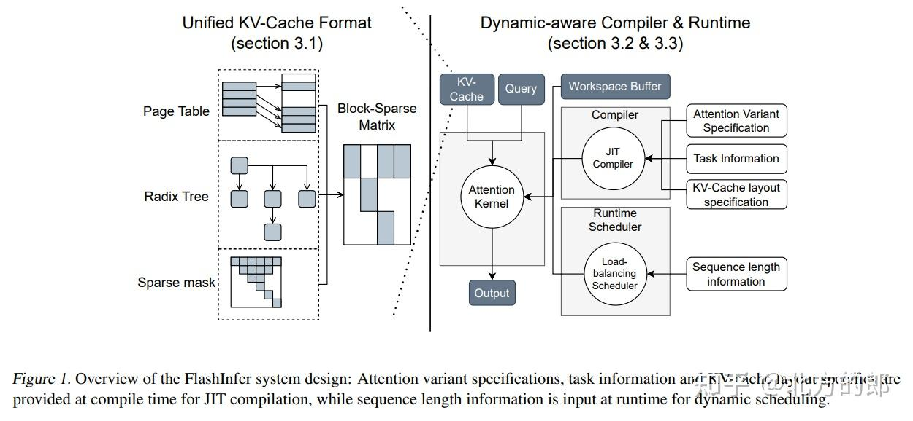

为了解决这些挑战，研究团队提出了**FlashInfer**，一个基于代码生成的注意力引擎，旨在加速LLM中的注意力计算。FlashInfer采用了多种关键设计：

1.  **FlashInfer使用块稀疏格式来应对KV-Cache存储的异构性。**  
    这种格式作为各种KV-Cache配置的统一数据结构，允许通过可调整的块大小实现细粒度稀疏性，如向量级稀疏性。这种方法统一了多样化的KV-Cache模式，并提高了内存访问效率。
2.  **FlashInfer提供了一个可定制的注意力模板，支持不同的注意力变体。**  
    FlashInfer为用户提供了一个可定制的编程接口，用户可以实现自己的注意力变体。FlashInfer使用即时（JIT）编译将这些变体转换为高度优化的块稀疏实现，确保快速适应不同的注意力配置。
3.  **FlashInfer采用**[**动态负载平衡**](https://zhida.zhihu.com/search?content_id=252553102&content_type=Article&match_order=1&q=%E5%8A%A8%E6%80%81%E8%B4%9F%E8%BD%BD%E5%B9%B3%E8%A1%A1&zhida_source=entity)**调度框架，有效处理输入动态性。**  
    它将编译时的Tile大小选择与运行时调度分离，提供轻量级API，自适应地管理推理过程中KV-Cache长度变化的调度，同时保持与CUDAGraph的兼容性。

**2\. 背景**
----------

### **2.1 FlashAttention**

FlashAttention是一种高效的计算精确注意力的算法，能够减少内存使用。在前向传播过程中，它采用了在线softmax技巧，使用恒定数量的片上内存实时更新注意力输出，从而避免了在GPU全局内存中物化注意力矩阵。FlashAttention2和FlashAttention3通过优化循环顺序和管道设计，进一步提升了性能。FlashInfer在这些进展的基础上进行了构建。

### **2.2 注意力组合**

块并行Transformer（BPT）展示了通过保留注意力输出及其比例，可以对相同查询和不同键/值的注意力输出进行组合。FlashInfer采用了**注意力状态**作为注意力操作的规范输出，并使用⊕作为这些状态的标准归约操作符。

### **2.3 块向量稀疏性**

块压缩稀疏行（BSR）是一种硬件高效的稀疏格式，它将非零元素分组为连续矩阵。BSR格式在GPU和NPU上表现出更好的兼容性，特别是在子计算与硬件矩阵乘法指令对齐时。FlashInfer基于这些技术，支持任意列大小的块，提供了更大的灵活性和效率。

**3\. 设计**
----------

### **3.1 KV-Cache存储**

### **3.1.1 块稀疏矩阵作为统一格式**

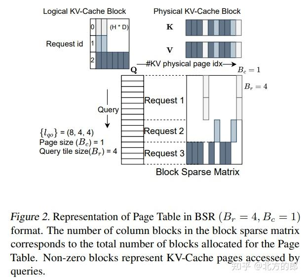

FlashInfer将块稀疏矩阵作为KV-Cache存储的统一格式。这种格式能够有效地表示各种注意力机制，如树注意力和重要性掩码。FlashInfer通过块稀疏行（BSR）格式存储KV-Cache，块大小由应用需求定义。

**块稀疏矩阵的优势：**  
块稀疏矩阵将非零元素分组为连续矩阵，这种格式在GPU和NPU上表现出更好的兼容性，特别是在子计算与硬件矩阵乘法指令对齐时。FlashInfer支持任意块大小，允许通过可调整的块大小实现细粒度稀疏性，如向量级稀疏性。这种方法统一了多样化的KV-Cache模式，并提高了内存访问效率。

**具体实现：**  
在FlashInfer中，查询和输出矩阵被高效地存储为[不规则张量](https://zhida.zhihu.com/search?content_id=252553102&content_type=Article&match_order=1&q=%E4%B8%8D%E8%A7%84%E5%88%99%E5%BC%A0%E9%87%8F&zhida_source=entity)（也称为锯齿数组），无需填充。这种存储方式有助于将来自不同请求的查询和输出紧凑地打包到单个张量中。初始时，键和值也使用与查询相同的索引指针存储在锯齿数组中，因为它们来自相同的输入[投影矩阵](https://zhida.zhihu.com/search?content_id=252553102&content_type=Article&match_order=1&q=%E6%8A%95%E5%BD%B1%E7%9F%A9%E9%98%B5&zhida_source=entity)。随后，这些键和值被更新到KV-Cache中，采用块稀疏行（BSR）格式存储。

### **3.1.2 可组合格式以提高内存效率**

FlashInfer通过可组合格式提高了注意力计算的效率。这种方法允许使用多个块稀疏格式来存储稀疏矩阵，提供了更大的灵活性和内存效率。

**可组合格式的设计：**  
传统的块稀疏格式受限于固定的块大小，限制了内存效率。较大的块大小可以提高同一块内请求的共享内存和寄存器重用，但也会增加碎片化。相反，不同块中的请求无法访问彼此的共享内存。

FlashInfer的可组合格式设计允许根据[先验知识](https://zhida.zhihu.com/search?content_id=252553102&content_type=Article&match_order=1&q=%E5%85%88%E9%AA%8C%E7%9F%A5%E8%AF%86&zhida_source=entity)对KV-Cache稀疏矩阵进行分解。例如，如果某些请求共享前缀，相应的行和列在KV-Cache中形成一个密集子矩阵。可以使用较大的块稀疏矩阵来高效存储这些子矩阵。这种方法不需要在KV-Cache中进行数据移动，而是通过计算稀疏子矩阵的索引和索引指针数组来实现。

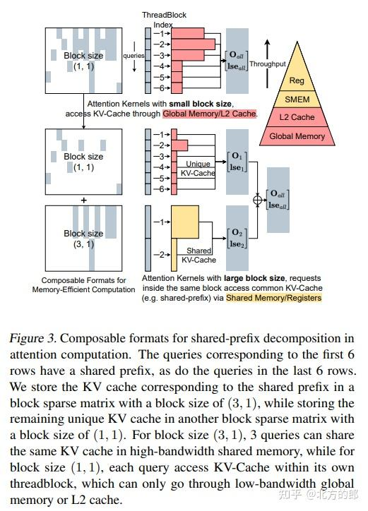

**具体实现：**  
在图3中，展示了如何使用可组合格式优化共享前缀的计算。对于较大的块大小，注意力计算可以访问共享的KV-Cache条目，使用快速的共享内存和寄存器，显著提高了内存效率。

### **3.2 计算抽象**

FlashInfer开发了CUDA/CUTLASS模板，专门为密集和块稀疏矩阵设计，兼容从Turing到Hopper的NVIDIA GPU架构。FlashInfer的注意力模板支持任意块大小，并通过将分散的全局内存Tile传输到连续的共享内存中来实现密集张量核心操作。

### **3.2.1 全局到共享内存的数据移动**

FlashInfer的注意力模板支持任意块大小，需要一种专门的数据加载方法，因为块可能与张量核心形状不对齐。FlashInfer通过将稀疏KV-Cache的地址计算为BSR矩阵的索引数组，而密集KV-Cache则使用行索引仿射变换。

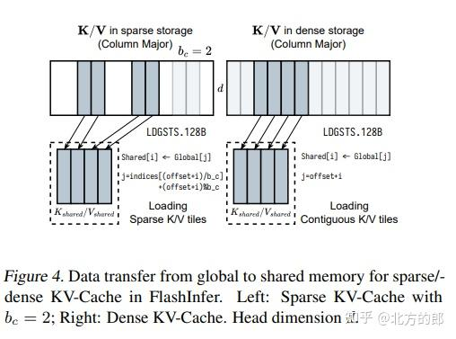

**具体实现：**  
在图4中，展示了FlashInfer如何从稀疏/密集KV-Cache加载Tile到共享内存。稀疏KV-Cache的地址使用BSR矩阵的索引数组计算，而密集KV-Cache则使用行索引仿射变换。KV-Cache的最后一个维度保持连续（大小为头维度d，通常为128或256），确保符合GPU缓存行大小的合并内存访问。FlashInfer使用128B宽度的异步复制指令LDGSTS来最大化内存带宽。

### **3.2.2 不同Tile大小的微内核**

为了适应LLM应用的不同操作强度，FlashInfer实现了FA2算法的多个Tile大小。传统的FA2使用有限的Tile大小（如128×64），FlashInfer提供了FA2内核，Tile大小为（1,16,32,64,128）×（32,64,128），并根据硬件资源和工作负载强度选择最佳Tile大小。

**具体实现：**  
FlashInfer通过以下[启发式方法](https://zhida.zhihu.com/search?content_id=252553102&content_type=Article&match_order=1&q=%E5%90%AF%E5%8F%91%E5%BC%8F%E6%96%B9%E6%B3%95&zhida_source=entity)选择Tile大小：

1.  确定每个批次的平均查询长度（对于分组查询注意力，查询长度与头组维度融合），选择满足或超过该长度的最小查询Tile大小。
2.  将寄存器和共享内存约束公式化为K/V Tile大小的函数，最大化SM资源占用率。

### **3.2.3 注意力变体的JIT编译器**

FlashInfer设计了一个可定制的CUDA模板和JIT编译器，用户可以通过定义变体函数来生成优化的内核代码。这些变体函数包括查询变换、键变换、值变换、输出变换、logits变换和logits掩码等。

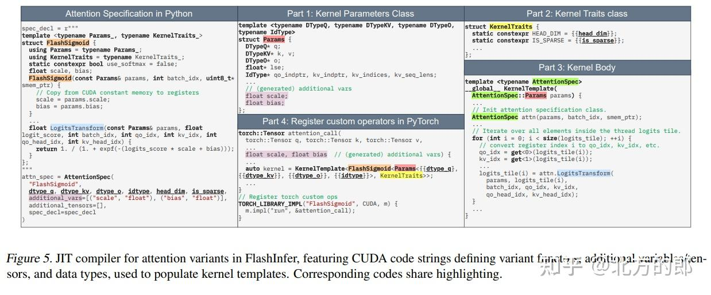

**具体实现：**  
在图5中，展示了FlashInfer如何将FlashSigmoid的注意力规范映射到FlashInfer的CUDA模板的不同部分。注意力规范接受一段CUDA代码来定义变体函数，这种设计还允许用户使用高级PTX指令或自己的库。JIT编译器通过将变体类和其他信息插入模板来生成CUDA代码，生成的CUDA代码使用PyTorch的JIT编译器编译并注册为自定义操作符。

### **3.3 动态感知运行时**

### **3.3.1 负载平衡调度**

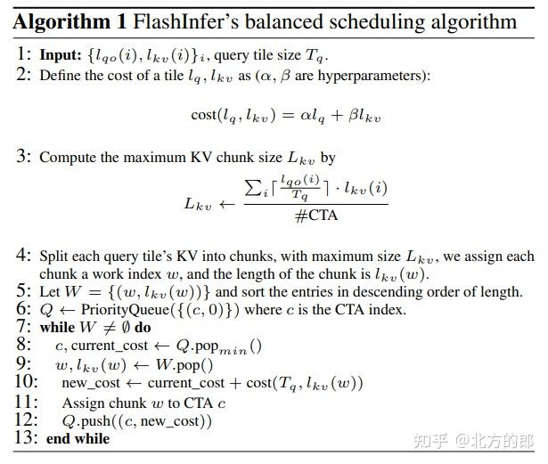

FlashInfer的负载平衡调度算法旨在通过将工作负载均匀分配到所有SM上来最小化SM空闲时间。该算法生成确定性的聚合顺序，确保在提供相同序列长度信息时输出一致。

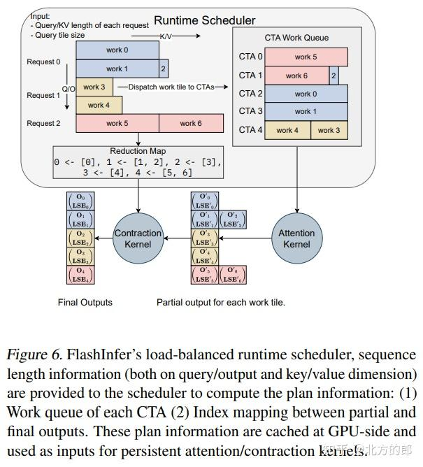

**具体实现：**  
在图6中，展示了FlashInfer的运行时调度器的工作流程。注意力内核不直接生成最终输出，因为一些长KV被分割成多个块，最终输出是所有块的局部输出的收缩（使用第2.2节中提到的注意力组合操作符）。局部输出存储在用户提供的工作空间缓冲区中。FlashInfer实现了高效的注意力组合操作符，可以处理可变长度的聚合。每个CTA的工作队列以及局部输出和最终输出之间的映射需要由调度器规划。一旦在CPU上计算了计划信息，FlashInfer异步将计划信息复制到GPU上的工作空间缓冲区的特定区域，计划信息用作持久注意力/收缩内核的输入。

### **3.3.2 内存高效的可组合格式**

FlashInfer通过可组合格式实现了内存高效的注意力计算。这种方法允许根据先验知识对KV-Cache稀疏矩阵进行分解，从而优化共享前缀的计算。

**具体实现：**  
在图3中，展示了如何使用可组合格式优化共享前缀的计算。对于较大的块大小，注意力计算可以访问共享的KV-Cache条目，使用快速的共享内存和寄存器，显著提高了内存效率。

### **3.4 编程接口**

FlashInfer提供了一个编程接口，旨在与现有的LLM服务框架（如vLLM、MLC-Engine和SGLang）无缝集成。用户可以通过提供注意力变体规范、任务信息和用户分配的工作空间缓冲区来初始化包装器。内核在初始化时进行JIT编译并缓存以供重用。

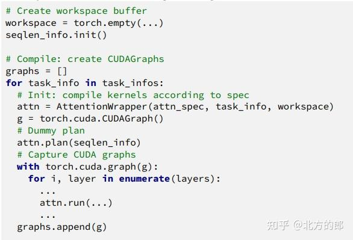

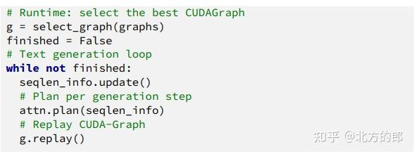

**具体实现：**  
在列表1中，展示了FlashInfer的PyTorch编程接口。用户通过提供注意力变体规范、任务信息和用户分配的工作空间缓冲区来初始化包装器。内核在初始化时进行JIT编译并缓存以供重用。对于可组合格式，FlashInfer创建多个注意力包装器，每个包装器具有不同的块大小。具有不同平均查询长度和可组合格式配置的内核被编译并捕获到不同的CUDAGraph中。在运行时，服务框架根据当前的KV-Cache配置选择最合适的CUDAGraph，确保在不同工作负载特性下的最佳性能。

**计划函数：**  
计划函数通过处理序列长度数据生成负载平衡调度计划，从而激活动态调度器。这些计划是可缓存的，允许在具有匹配序列长度规范的操作符之间重用，例如生成步骤中的所有解码注意力。

**运行函数：**  
运行函数使用查询、键、值和缓存的计划数据作为输入执行注意力计算，输出注意力结果。CUDAGraph可以捕获对运行函数的调用，并将整个注意力生成步骤编译为单个图。然而，计划函数不会被CUDAGraph捕获，因为它在CPU上运行。

通过本文的详细介绍，读者可以全面了解FlashInfer的设计原理、实现细节及其在实际应用中的卓越表现。FlashInfer不仅为LLM推理服务提供了高效的解决方案，还为未来的研究和应用开辟了新的方向。

**4\. 评估**
----------

### **4.1 端到端LLM服务性能**

FlashInfer在标准LLM服务环境和创新场景中进行了评估，包括前缀共享和推测解码。FlashInfer已集成到主流的LLM服务引擎中，如vLLM、MLC-Engine和SGLang。评估结果显示，FlashInfer在标准LLM服务基准测试和长上下文推理、并行生成等新应用中显著提升了性能。

**评估设置：**  
实验在NVIDIA A100 40GB SXM和H100 80GB SXM GPU上进行，使用CUDA 12.4和PyTorch 2.4.0，存储和计算精度为f16。

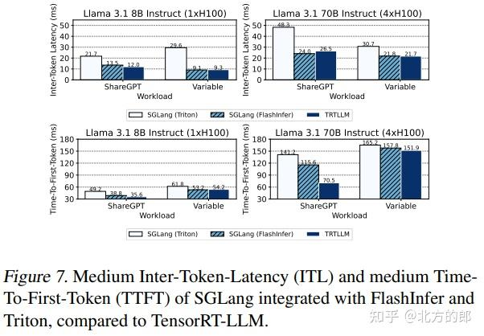

**评估结果：**  
在图7中，展示了SGLang集成FlashInfer和Triton后的中等Inter-Token-Latency（ITL）和中等Time-To-First-Token（TTFT）性能。与使用Triton后端的SGLang相比，FlashInfer后端在所有设置中均表现出显著的加速。与TensorRT-LLM相比，FlashInfer在ShareGPT上的性能稍弱（尤其是在Llama 3.1 70B的TTFT上），但在Variable工作负载上的性能与TensorRT-LLM相当。SGLang和TensorRT-LLM之间的性能差距不仅源于注意力内核，还源于其他内核（如allreduce）和系统设计的差异。总体而言，FlashInfer后端在LLM服务基准测试中表现出竞争力。

### **4.2 内核性能对输入动态性的影响**

在本节中，我们测量了FlashInfer生成的内核在不同序列长度分布下的性能，并与最先进的开源FlashAttention库进行了比较。我们使用了最新的主分支，其中包括FlashAttention2和FlashAttention3内核。我们将批量大小固定为16，并选择了三种不同的序列长度分布：恒定（1024）、均匀（512到1024）和偏斜（Zipf分布，平均长度为1024）。对于预填充内核，我们启用了因果掩码，因为这是LLM服务中的常见设置。

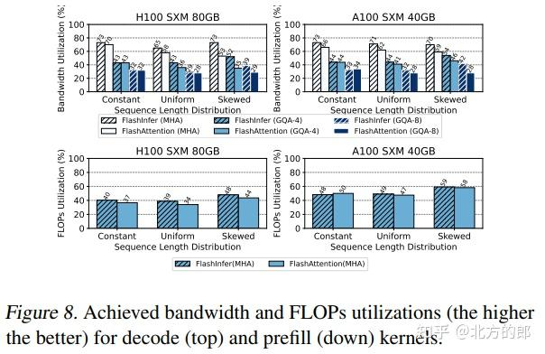

**评估结果：**  
在图8中，展示了解码和预填充内核的带宽和FLOPs利用率。FlashInfer的内核在均匀和偏斜序列长度分布下显著优于FlashAttention内核，这得益于我们的负载平衡动态调度器（第3.3.1节）。FlashInfer的解码注意力内核优于FlashAttention内核，因为我们的多样化Tile大小选择（第3.2.2节）和FlashAttention使用次优的Tile大小进行解码。

### **4.3 长上下文推理的可定制性**

在本节中，我们展示了FlashInfer的定制注意力内核如何显著加速LLM推理。我们专注于Streaming-LLM，这是一种能够在恒定GPU内存使用下进行百万token推理的最新算法。虽然Streaming-LLM需要专门的注意力内核以实现最佳性能，特别是将RoPE与注意力融合的内核，但FlashInfer仅需20行额外的查询/键变换代码即可生成此类融合内核。我们比较了FlashInfer生成的融合内核与未融合内核（包括FlashInfer和FlashAttention的）的性能，并量化了将FlashInfer内核集成到StreamingLLM中所实现的端到端延迟减少。

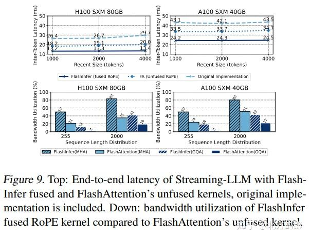

**评估结果：**  
在图9中，展示了Streaming-LLM在使用FlashInfer融合内核和未融合内核时的Inter-Token-Latency（ITL）。FlashInfer的融合内核在不同设置下（通过改变Streaming-LLM的最近窗口大小）实现了28-30%的延迟减少。原始实现作为基线参考。我们还展示了FlashInfer的融合RoPE内核与FlashAttention的未融合内核的带宽利用率比较。FlashInfer的融合RoPE内核比未融合内核实现了1.6-3.7倍的带宽利用率提升，这凸显了注意力内核可定制性的重要性。

### **4.4 并行生成性能**

在本节中，我们展示了FlashInfer的可组合格式如何增强并行解码。随着并行生成在LLM服务中成为一个重要任务，它在LLM代理中提供了极大的实用性。OpenAI API提供了一个“n”参数，以便同时生成多个token。由于共享前缀经常存在，前缀缓存可以显著提高并行生成的效率。FlashInfer中的可组合格式（见第3.1.2节）允许将注意力计算在共享前缀和后续后缀之间解耦，从而加速并行解码。

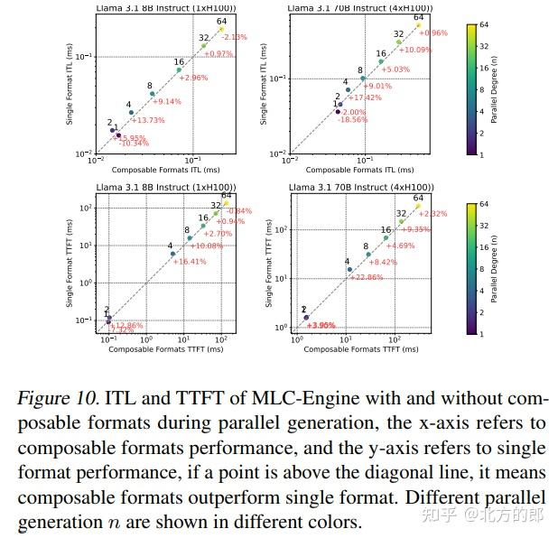

**评估结果：**  
在图10中，展示了MLC-Engine在使用和不使用可组合格式时的ITL和TTFT结果。对于中等并行生成水平（4≤n≤32），FlashInfer的可组合格式在ITL和TTFT上均实现了持续的加速。峰值加速出现在n=4时，其中8B模型的ITL减少了13.73%，70B模型的ITL减少了17.42%，而8B模型的TTFT减少了16.41%，70B模型的TTFT减少了22.86%。较小的n值不会从可组合格式中受益，因为块大小的增加不足。对于较大的n，计算不再由注意力过程主导（尤其是在ShareGPT的短序列长度情况下），导致可组合格式的优势趋于平稳。

**5\. 相关工作**
------------

在LLM推理服务领域，FlashInfer与现有的注意力优化、稀疏优化和注意力编译器工作进行了对比，展示了其在LLM服务系统中的独特优势。以下是对相关工作的详细分析：

### **5.1 注意力优化**

**多头注意力（MHA）**  
多头注意力（MHA）是Transformer架构的核心，但其计算和I/O开销较大。FasterTransformer通过融合多头注意力（FMHA）减少了全局内存占用，但在长上下文场景中表现不佳，因为共享内存使用量与序列长度呈线性关系。ByteTransformer优化了FMHA在变长输入上的性能，但仍未解决长上下文问题。

**FlashAttention**  
FlashAttention通过在线softmax技巧减少了共享内存占用，使其在长上下文场景中表现出色。FlashAttention2和FlashAttention3进一步优化了循环结构和软最大与GEMM的重叠，显著提升了性能。FlashDecoding应用了Split-K技术来优化解码注意力内核。LeanAttention使用StreamK技术减少了注意力中的波量化问题，但仅限于固定序列长度。

**FlashInfer的贡献**  
FlashInfer扩展了FlashAttention2和FlashAttention3模板，支持稀疏注意力内核，并在变长序列上应用了类似StreamK的优化。Nanoflow引入了GEMM、注意力和通信操作的水平融合，而POD-Attention则专注于优化分块预填充注意力。FlashInfer的JIT编译框架可以扩展以支持这些融合技术。FlashDecoding++利用注意力比例统计预定义统一的最大值，将注意力组合转换为求和，从而实现了TMA Store Reduce的异步更新，这与FlashInfer的贡献正交，未来可以进一步探索。

### **5.2 稀疏优化**

**FusedMM**  
FusedMM探索了稀疏-密集矩阵乘法（SpMM）的融合，但忽略了软最大计算，限制了其在加速注意力方面的直接应用。Zhang等人探索了图注意力网络（GAT）内核融合，SAR将稀疏注意力聚合序列化，类似于FlashAttention，但这些工作未探索使用张量核心。

**Blocksparse库**  
Blocksparse库实现了使用张量核心的BSR GEMM。Chen等人、TC-GNN和Magicube提出了向量稀疏格式，以有效利用张量核心。FlashInfer在此基础上进行了改进，支持FlashAttention中的任意块大小（br,bc_br_​,_bc_​）。

### **5.3 注意力编译器**

**FlexAttention**  
FlexAttention提供了一个用户友好的接口，用于编程注意力变体，并将其编译为在Triton中实现的块稀疏FlashAttention。它使用PyTorch编译器自动生成反向传播。FlashInfer扩展了FlexAttention的编程接口，支持查询/键变换，并专注于LLM服务中的向量稀疏和负载平衡。FlashInfer生成CUDA代码而不是Triton，因为Triton在许多用例中仍不及CUDA和CUTLASS。FlashInfer可以作为FlexAttention的前向传递后端。

**Mirage**  
Mirage使用概率等价验证器优化了GEMM和FlashAttention的瓦片策略，依赖于Triton和CUTLASS进行代码生成。然而，它缺乏对变长和稀疏数据结构的支持，并且不包括安全软最大，而FlashInfer直接适用于LLM服务。

### **5.4 LLM服务系统**

**Orca**  
Orca引入了连续批处理以提高吞吐量。PagedAttention使用页表进行KV-Cache管理。Sarathi-serve通过将解码操作与分块预填充相结合提高了效率，而SGLang使用RadixTree进行更好的前缀缓存和KV管理。FlashInfer通过块稀疏注意力内核为这些注意力机制提供了统一的解决方案。

**vAttention**  
vAttention展示了GPU虚拟内存可以在没有特殊内核的情况下管理PageAttention中的地址转换。然而，动态KV-Cache稀疏性等挑战仍然存在，如Quest所示。FlashInfer的块稀疏内核在此类场景中仍然有效。此外，FlashInfer可以与vAttention结合，通过生成连续KV-Cache存储的内核来进一步提升性能。

**6\. 结论与未来工作**
---------------

FlashInfer是一个高效、可定制的注意力引擎，通过统一的块稀疏存储和可组合格式、JIT编译和负载平衡调度器，显著提升了LLM推理服务的性能。未来，研究团队计划探索将更高级的DSL编译为FlashInfer的注意力规范，并生成其他后端代码。