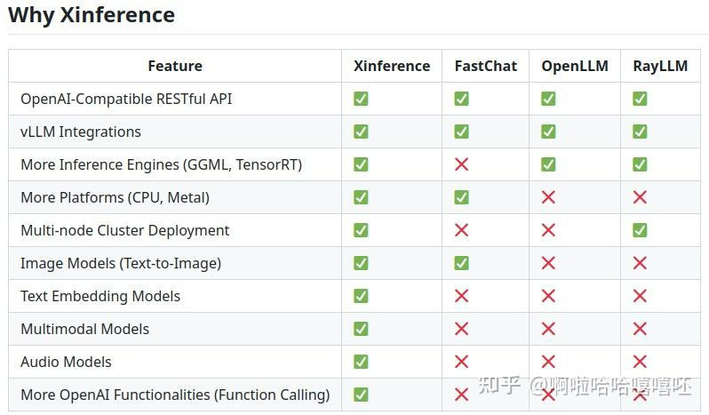
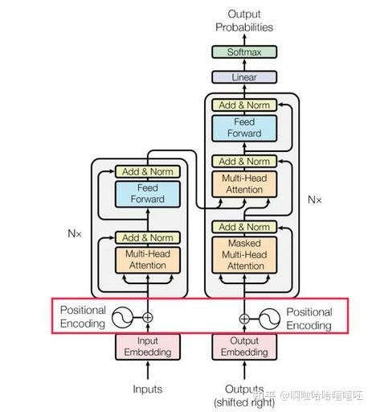
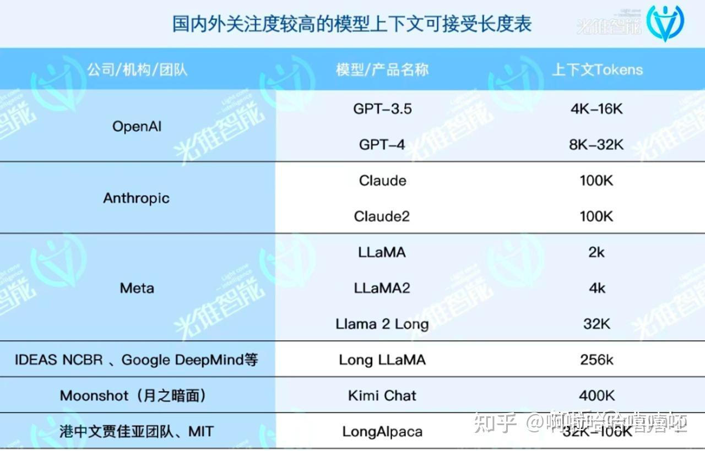

# vLLM推理加速与参数配置
> _**作者: 啊啦哈哈嘻嘻呸**_
> 
> _**原文:**_ [_**https://zhuanlan.zhihu.com/p/3722264996**_](https://zhuanlan.zhihu.com/p/3722264996)

一、背景介绍
------

**大模型推理引擎**就像是大型AI模型的加速工具，帮助AI模型在实际使用时更快地响应，同时减少计算机资源消耗。具备对模型的计算图进行优化、支持多种硬件平台（如CPU、GPU、TPU等）、提供模型压缩、[知识蒸馏](https://zhida.zhihu.com/search?content_id=249767007&content_type=Article&match_order=1&q=%E7%9F%A5%E8%AF%86%E8%92%B8%E9%A6%8F&zhida_source=entity)等技术、优化计算资源的使用等多种特点。

目前有一些主流的大模型推理引擎，TGI（Text Generation Inference）、vLLM、SG-Lang和[lmdeploy](https://zhida.zhihu.com/search?content_id=249767007&content_type=Article&match_order=1&q=lmdeploy&zhida_source=entity)等。

| **框架名称** | **特点** | **优点** | **缺点** | **备注** |
| --- | --- | --- | --- | --- |
| TGI (Text Generation Inference) | Hugging Face开发的文本生成推理[工具包](https://zhida.zhihu.com/search?content_id=249767007&content_type=Article&match_order=1&q=%E5%B7%A5%E5%85%B7%E5%8C%85&zhida_source=entity) | 起了个大早赶了个晚集 | TGI的cpu和gpu调度是串行模型(vllm都已经改成优化了)，导致cpu调度计算时候gpu是闲置的，吞吐变差 | 开发人员投入不够，版本更新太慢，各种新的功能没有，提issue也没什么反馈 |
| vLLM | 开源的大模型推理加速框架，通过PagedAttention高效管理缓存张量 | 快速部署开箱即用 | 合入的功能太多，代码臃肿复杂，[二次开发](https://zhida.zhihu.com/search?content_id=249767007&content_type=Article&match_order=1&q=%E4%BA%8C%E6%AC%A1%E5%BC%80%E5%8F%91&zhida_source=entity)  <br>困难 | 在v0.6.0版本之前，vllm中cpu和gpu的调度是串行的，cpu计算时候gpu是闲置的 |
| SG-Lang | 基于图结构的推理引擎，处理图数据和[知识图谱](https://zhida.zhihu.com/search?content_id=249767007&content_type=Article&match_order=1&q=%E7%9F%A5%E8%AF%86%E5%9B%BE%E8%B0%B1&zhida_source=entity) | 吞吐性能最优，便于二次开发 | 社区活跃度虽然比不上vllm | 核心团队基本都是交大 |
| lmdeploy | 推理性能是 vLLM 的 1.8 倍 | cpu调度策略是最优；对国内GPU厂商的硬件支持较好 | 社区活跃度虽然比不上vllm | 上海人工智能实验室团队开发 |

小结：不具备二次开发能力，想要快速部署开箱即用，vllm是最好的选择[\[1\]](https://zhuanlan.zhihu.com/p/3722264996#ref_1)。

补充问题

**（1）经常看到使用ollama部署大语言模型，ollama是大模型推理引擎吗？**

不是。  
Ollama旨在让用户轻松地在自己的电脑上使用LLMs。可以处理多个请求，但随着请求增多，速度会变慢；适合**个人或小规模使用**但不适合服务多个用户的场景，并行处理能力不太行。  
主要功能是简化本地大模型的运行和使用，而不是专注于推理加速和资源优化。

**（2）Xinference是什么吗？为什么可以经常看到和vLLM组合使用？**

Xorbits Inference（Xinference）是一个高性能大模型分布式推理平台，将大模型变成API可以访问的服务[\[2\]](https://zhuanlan.zhihu.com/p/3722264996#ref_2)。  
Xinference支持不同的推理引擎，如vLLM、sglang、llama.cpp、[transformers](https://zhida.zhihu.com/search?content_id=249767007&content_type=Article&match_order=1&q=transformers&zhida_source=entity)等，以适应不同的模型和应用需求。  
Xinference一般和FastChat、OpenLLM、RayLLM做比较。  
**小结**：Xinference提供了一个更为广泛的**企业级推理平台**，而vLLM则专注于提供高效、易用的LLM推理服务。如果需要一个能够同时处理多种模型（不仅仅是语言模型）和多种任务的推理平台，Xinference可能是更好的选择。如果应用主要集中在大型语言模型的推理上、GPU资源受限，vLLM提供了针对性的优化。



二、vLLM介绍
--------

### 1、vLLM为什么可以加速推理？

核心是PagedAttention技术，让KVcache不用再存储在一大块连续的空间中，解决了LLM服务中内存瓶颈问题。

从PagedAttention到连续批处理（Continuous Batching）、CUDA Graphs、模型量化（Quantization）、模型并行、[前缀缓存](https://zhida.zhihu.com/search?content_id=249767007&content_type=Article&match_order=1&q=%E5%89%8D%E7%BC%80%E7%BC%93%E5%AD%98&zhida_source=entity)（Prefix Caching），[推测解码](https://zhida.zhihu.com/search?content_id=249767007&content_type=Article&match_order=1&q=%E6%8E%A8%E6%B5%8B%E8%A7%A3%E7%A0%81&zhida_source=entity)（Speculative Decoding）等等一系列的技术都被包括在项目里面[\[3\]](https://zhuanlan.zhihu.com/p/3722264996#ref_3)，一套组合拳下来，提高了大型语言模型的推理速度和资源利用率。

### 2、安装要求

`vllm`对`torch`和其CUDA版本有强依赖[\[4\]](https://zhuanlan.zhihu.com/p/3722264996#ref_4)。

vLLM 最新版v0.6.3.post1在2024年10月18日左右：[https://github.com/vllm-project/vllm/releases](https://link.zhihu.com/?target=https%3A//github.com/vllm-project/vllm/releases)

v0.6.3.post1要求cuda 12.0以后版本：[https://github.com/vllm-project/vllm/blob/v0.6.3.post1/CMakeLists.txt](https://link.zhihu.com/?target=https%3A//github.com/vllm-project/vllm/blob/v0.6.3.post1/CMakeLists.txt)

cuda安装：[https://developer.nvidia.com/cuda-toolkit-archive](https://link.zhihu.com/?target=https%3A//developer.nvidia.com/cuda-toolkit-archive)

Python: 3.8 – 3.12

### 3、安装方式

conda安装：无法正常加载NCCL库，目前不推荐[\[5\]](https://zhuanlan.zhihu.com/p/3722264996#ref_5)[\[6\]](https://zhuanlan.zhihu.com/p/3722264996#ref_6)。

[pip](https://zhida.zhihu.com/search?content_id=249767007&content_type=Article&match_order=1&q=pip&zhida_source=entity)安装：pip install vllm

docker安装：vLLM提供官方镜像，Docker Hub as [vllm/vllm-openai](https://link.zhihu.com/?target=https%3A//hub.docker.com/r/vllm/vllm-openai/tags).

### 3、vLLM 0.6以后的提升

vLLM 0.6是个大版本更新，吞吐量大幅提升[\[7\]](https://zhuanlan.zhihu.com/p/3722264996#ref_7)。

在吞吐量和延迟方面进行了优化，与v0.5.3相比吞吐量提高了1.8-2.7倍[\[8\]](https://zhuanlan.zhihu.com/p/3722264996#ref_8)。

vLLM的性能瓶颈主要是由阻塞GPU执行的CPU开销造成的。在vLLM v0.6.0中引入了一系列优化，以减小这些开销。

三、vLLM参数配置
----------

### **1、tensor\_parallel\_size分布式推理**

[分布式推理](https://zhida.zhihu.com/search?content_id=249767007&content_type=Article&match_order=3&q=%E5%88%86%E5%B8%83%E5%BC%8F%E6%8E%A8%E7%90%86&zhida_source=entity)是指在多个计算节点上并行执行推理任务的过程。

**单卡**：无分布式推理，至少两张显卡。

**单台服务器多显卡（张量并行推理）**：当模型的规模超过了单个GPU的内存容量时，将模型的输入数据（张量）分割成多个小部分，每个GPU处理其中的一部分。如果服务器有4个GPU，你可以将张量并行大小设置为4，这意味着你的模型将被分割成4部分，每个GPU处理其中的一部分。

```text-plain
# 张量并行大小：设置为要使用的GPU数量，例如在4个GPU上运行推理
tensor_parallel_size = 4

# 隐藏配置：管道并行大小（暂放）
# 管道并行是测试功能。它仅支持在线服务以及 LLaMa、GPT2、Mixtral、Qwen、Qwen2 和 Nemotron 风格的模型。
# pipeline-parallel-size
```

**多服务器多 GPU（张量并行加流水线并行推理）**：张量并行是指将模型的参数（权重和激活）分割到不同的GPU上。[流水线并行](https://zhida.zhihu.com/search?content_id=249767007&content_type=Article&match_order=2&q=%E6%B5%81%E6%B0%B4%E7%BA%BF%E5%B9%B6%E8%A1%8C&zhida_source=entity)（也称为层间并行）是指将模型的不同层分配到不同的节点上。每个节点负责模型的一部分层，数据在节点间流动，通过流水线的方式进行处理。张量并行大小是你想要在每个节点中使用的 GPU 数量，流水线并行大小是你想要使用的节点数量。例如，如果你在 2 个节点中拥有 16 个 GPU（每个节点 8 个 GPU），你可以将张量并行大小设置为 8，流水线并行大小设置为 2。

**小结**：根据显卡数量配置

### **2、Quantization量化**

量化(Quantization)是本地运行大规模语言模型的主要议题，因为它能减少内存占用。

vLLM 支持多种类型的[量化模型](https://zhida.zhihu.com/search?content_id=249767007&content_type=Article&match_order=1&q=%E9%87%8F%E5%8C%96%E6%A8%A1%E5%9E%8B&zhida_source=entity)，例如 AWQ、GPTQ、SqueezeLLM 等，选择哪种量化（quantization）方法确实需要根据模型来决定。

```text-plain
# --quantization {aqlm,awq,deepspeedfp,tpu_int8,fp8,fbgemm_fp8,modelopt,marlin,gguf,gptq_marlin_24,gptq_marlin,awq_marlin,gptq,compressed-tensors,bitsandbytes,qqq,experts_int8,neuron_quant,ipex,None}
# AWQ（即激活值感知的权重量化，Activation-aware Weight Quantization)
# GPTQ（针对类GPT大型语言模型的量化方法）
# gptq_marlin是vLLM0.6版本以后引入的一个特性，对GPTQ的一种优化实现，优选。

# demo
llm = LLM(model="TheBloke/Llama-2-7b-Chat-AWQ", quantization="AWQ")
llm = LLM(model="Qwen/Qwen2.5-7B-Instruct-GPTQ-Int4", quantization="GPTQ")
```

**小结**：根据使用的模型和vLLM版本选择。

### 3、enforce-eager

`enforce_eager`是一个参数，用于控制vLLM是否始终使用PyTorch的eager模式（即时执行模式），默认为False，vLLM会默认使用eager模式和CUDA图的[混合模式](https://zhida.zhihu.com/search?content_id=249767007&content_type=Article&match_order=1&q=%E6%B7%B7%E5%90%88%E6%A8%A1%E5%BC%8F&zhida_source=entity)来执行操作，这种混合模式旨在提供最大的性能和灵活性。

CUDA图是PyTorch中用于优化性能的一种技术。禁用CUDA图（即设置`enforce_eager`为True）可能会影响性能，但可以减少内存需求。对于小型模型，CUDA图可能对性能提升有帮助，但对于大型模型，性能差异可能不大[\[9\]](https://zhuanlan.zhihu.com/p/3722264996#ref_9)。

**小结**

如果你的模型较小，且性能是关键考虑因素，可以考虑使用CUDA图，即默认状态，不做变动。  
如果你的模型较大，或者需要减少内存使用，可以考虑启用`enforce_eager`。  
在实际部署之前，最好进行一系列的测试，以确定最佳的配置。可以先尝试不启用`enforce_eager`，如果遇到显存不足或性能问题，再考虑启用它。

### 4、[gpu-memory-utilization](https://zhida.zhihu.com/search?content_id=249767007&content_type=Article&match_order=1&q=gpu-memory-utilization&zhida_source=entity)

gpu-memory-utilization：控制GPU显存使用量的百分比。

如果设置的值过高，可能会导致GPU内存不足，影响模型的性能或者导致程序崩溃；如果设置的值过低，可能会导致GPU内存没有得到充分利用，影响模型的运行效率。

默认值为0.9。

### 5、max-model-len

模型的上下文长度（[context length](https://zhida.zhihu.com/search?content_id=249767007&content_type=Article&match_order=1&q=context+length&zhida_source=entity)）指模型在生成响应之前可以“回顾”和“理解”的输入内容的长度，是模型在处理输入时能够考虑的历史信息的总长度。通过max-model-len控制，不添加此参数时，系统将尝试使用最大可能的[序列长度](https://zhida.zhihu.com/search?content_id=249767007&content_type=Article&match_order=1&q=%E5%BA%8F%E5%88%97%E9%95%BF%E5%BA%A6&zhida_source=entity)。

配置要求：

（1）小于模型本身的最大位置嵌入（max\_position\_embedding）

单词的顺序通常包含重要的语义信息，位置嵌入（[position\_embedding](https://zhida.zhihu.com/search?content_id=249767007&content_type=Article&match_order=2&q=position_embedding&zhida_source=entity)）是模型用来标记输入数据位置信息的，指定了模型在处理序列数据时能够考虑的最大位置数。例如Transformer架构，在输入的部分由文本的每个Token的向量(Input Embedding) 与每个Token的位置编码(Postional Encoding)向量进行相加处理后的值再输入到每个Attention Block。  
现在的GPT模型基本是Decoder-only架构，即下图右半部分。



> transformer架构为例



> [https://zhuanlan.zhihu.com/p/678196390](https://zhuanlan.zhihu.com/p/678196390)

上图表示热门大语言模型的Postional Encoding长度设置（即上下文长度）。

（2）根据显存需求

在某些情况下，可能会因为GPU内存限制而需要调整模型的最大序列长度（缩小输入长度，可以减少模型在处理序列时需要存储的Key-Value缓存（[KV缓存](https://zhida.zhihu.com/search?content_id=249767007&content_type=Article&match_order=1&q=KV%E7%BC%93%E5%AD%98&zhida_source=entity)）的数据量，从而节省内存需求）。

上下文窗口变大了，LLM就需要更多的脑力和记忆空间来工作，这就有点像是我们的电脑需要更多的内存和处理器一样。这意味着成本也会增加。

（3）【补充】输出长度控制

既然输入的长下文长度可以用max-model-len控制，那么输出的长度如何控制呢？

max\_tokens`max_tokens` 指定了在补全（completion）过程中模型可以生成的最大tokens数。这是模型输出的上限，即模型在生成回答或内容时，不会超过这个tokens数。  
不过在函数调用的过程中使用。例如以下是使用 Python 调用 OpenAI API 的一个基本示例，使用 `max_tokens` 参数控制生成序列的长度。

```text-plain
import openai

# 用你的 OpenAI API 密钥替换此处
openai.api_key = 'your_openai_api_key'

# 定义请求参数
prompt = "解释一下量子力学的基本原理。"
model_name = "text-davinci-003"  # 选择一个合适的模型
max_tokens = 150  # 你想要生成的最大令牌数

# 调用 OpenAI API
response = openai.Completion.create(
  engine=model_name,
  prompt=prompt,
  max_tokens=max_tokens,
  n=1,  # 生成的完成数
  stop=None,  # 停止生成的令牌
  temperature=0.7  # 创造性参数
)

# 打印生成的文本
print(response.choices[0].text.strip())
```

max\_tokens的值要怎么设置比较合适？

（1）建议 max\_tokens 设置小一点。因为在[自然语言处理](https://zhida.zhihu.com/search?content_id=249767007&content_type=Article&match_order=1&q=%E8%87%AA%E7%84%B6%E8%AF%AD%E8%A8%80%E5%A4%84%E7%90%86&zhida_source=entity)中，较长的文本输出通常需要更长的计算时间和更多的计算资源。  
（2）不可以大于上下文长度。上下文长度限制了模型在任何给定时间点能够处理的信息总量，无论是输入还是输出。上下文长度=输入长度（包括prompt）+输出长度  
（3）prompt长度：限制 max\_tokens 能够增加 prompt 的长度，如 gpt-3.5-turbo 的限制为 4097 tokens，如果设置 max\_tokens=4000，那么 prompt 就只剩下 97 tokens 可用，如果超过就会报错[\[10\]](https://zhuanlan.zhihu.com/p/3722264996#ref_10)

### 6、OOM

遇到OOM（[内存溢出](https://zhida.zhihu.com/search?content_id=249767007&content_type=Article&match_order=1&q=%E5%86%85%E5%AD%98%E6%BA%A2%E5%87%BA&zhida_source=entity)）问题

`--max-model-len`：最大长度会导致高内存需求，将此值适当减小通常有助于解决OOM问题。

`--gpu-memory-utilization`：默认情况下，该值为 `0.9`会占用大量显存。

`--enforce-eager`：使用CUDA Graphs，额外占用显存。使用会影响推理效率。

`tensor_parallel_size`使用张量并行来运行模型，提高模型的处理吞吐量，分布式服务。

参考
--

1.  [^](https://zhuanlan.zhihu.com/p/3722264996#ref_1_0)\[原创长文\]2024.10-开源大模型推理引擎现状及常见推理优化方法 [https://zhuanlan.zhihu.com/p/755874470](https://zhuanlan.zhihu.com/p/755874470)
2.  [^](https://zhuanlan.zhihu.com/p/3722264996#ref_2_0)Xorbits Inference: Model Serving Made Easy [https://github.com/xorbitsai/inference/tree/main](https://github.com/xorbitsai/inference/tree/main)
3.  [^](https://zhuanlan.zhihu.com/p/3722264996#ref_3_0)LLM推理加速方法：vLLM背后的PagedAttention [https://zhuanlan.zhihu.com/p/715032641](https://zhuanlan.zhihu.com/p/715032641)
4.  [^](https://zhuanlan.zhihu.com/p/3722264996#ref_4_0)vLLM install [https://qwen.readthedocs.io/zh-cn/latest/deployment/vllm.html](https://qwen.readthedocs.io/zh-cn/latest/deployment/vllm.html)
5.  [^](https://zhuanlan.zhihu.com/p/3722264996#ref_5_0)conda安装可能报错 [https://github.com/vllm-project/vllm/issues/8420](https://github.com/vllm-project/vllm/issues/8420)
6.  [^](https://zhuanlan.zhihu.com/p/3722264996#ref_6_0)pytorch在conda模式下无法加载libnccl.so [https://github.com/pytorch/pytorch/issues/132617](https://github.com/pytorch/pytorch/issues/132617)
7.  [^](https://zhuanlan.zhihu.com/p/3722264996#ref_7_0)是时候更新vllm了，新版吞吐提升2倍 [https://developer.volcengine.com/articles/7428432984568496137](https://developer.volcengine.com/articles/7428432984568496137)
8.  [^](https://zhuanlan.zhihu.com/p/3722264996#ref_8_0)vLLM v0.6.0版本：vLLM v0.6.0，与v0.5.3相比，吞吐量提高了1.8-2.7倍 [https://news.miracleplus.com/share\_link/39977](https://news.miracleplus.com/share_link/39977)
9.  [^](https://zhuanlan.zhihu.com/p/3722264996#ref_9_0)what is enforce\_eager [https://github.com/vllm-project/vllm/issues/4449](https://github.com/vllm-project/vllm/issues/4449)
10.  [^](https://zhuanlan.zhihu.com/p/3722264996#ref_10_0)为什么建议 max\_tokens 设置小一点？ [https://docs.dify.ai/zh-hans/learn-more/faq/llms-use-faq](https://docs.dify.ai/zh-hans/learn-more/faq/llms-use-faq)