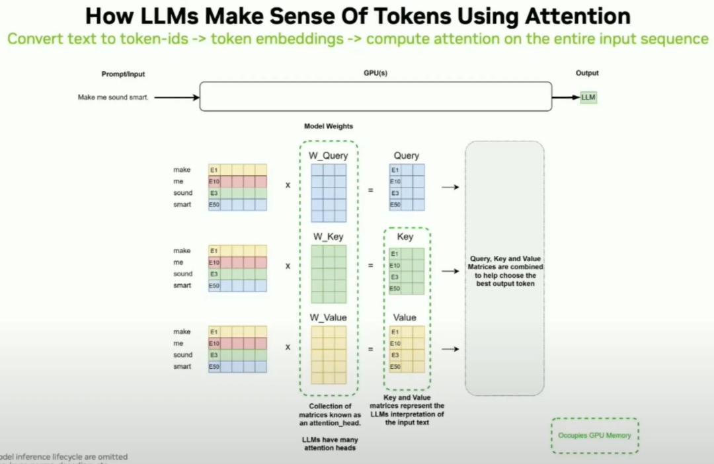

# 一起理解下LLM的推理流程
> _**作者: oldpan博客**_
> 
> _**原文:**_ [_**https://mp.weixin.qq.com/s/Qu2K0ZhhnOhOPE60pRfMug**_](https://mp.weixin.qq.com/s/Qu2K0ZhhnOhOPE60pRfMug)

本文来源自Pytorch Conference 2024的talking —— **Understanding the LLM Inference Workload**，由NVIDIA的高级解决方案架构师讲述，感兴趣的可以看原演讲视频：

*   [**https://www.youtube.com/watch?v=z2M8gKGYws4&list=PL\_lsbAsL\_o2B\_znuvm-pDtV\_cRhpqZb8l&index=23**](https://www.youtube.com/watch?v=z2M8gKGYws4&list=PL_lsbAsL_o2B_znuvm-pDtV_cRhpqZb8l&index=23)**\[1\]**

本文总结和整理下其描述的基于TRT-LLM的LLM推理流程。

**0x10 推理**
-----------

以下是简单的LLM推理流程（下图中输入 Write me a presentation... ），注意两个事儿：

*   我们的输入prompt是放在GPU中的，
*   然后output的时候，是>一个一个出来的：LLM inference is hard，而且每次输出一个token都会这个将这个token之前的输入（也是tokens）全送进GPU再吐下一个token

根据上述的LLM推理流程，很容易推理出：

*   输入的prompt token数越多，LLM反应越慢，因为LLM要处理你输入的prompt，这是要在GPU上算的，越多计算的时间越长
*   因为输入的prompt token和后续输出的token都存在GPU中，这些是要占显存的

如下图，原始输入文本转换为tokens传给LLM，然后最后输出的tokens再还原回文本，GPU中存着模型权重和输入输出处理过程中的中间变量和cache：

### **0x11 推理两阶段**

LLM推理有两个阶段：

*   prefill 输入prompt处理的阶段，会生成cache
*   decode 后续新生成token的阶段，会利用prefill的cache以及阶段本身产生的cache

prefill推理阶段，一开始需要输入文本转换为token id，需要依赖Tokenization：

但实际LLM模型中最终拿到的是embedding向量：

分词过程，由于“smart”和“smarter”是不同的单词，分词器会为它们生成不同的token ID，即使它们看起来很相似。

根据prefill的过程，我们也可以总结出：

*   输入的prompt在LLM中的存储格式为矩阵
*   输入的prompt越多，最终转化为的矩阵也就越大，占用的显存也就越大

embedding matrix 用于将离散的token ID映射到一个连续的向量空间中，便于模型理解和处理

所以在LLM，最终输入self-attention层的是embedding矩阵向量，具体执行细节可以看[这篇](https://mp.weixin.qq.com/s?__biz=Mzg3ODU2MzY5MA==&mid=2247495213&idx=1&sn=04f5a805d3426c335d64205a3c27f831&chksm=cf137628f864ff3e6ee731c1a59e2de54d0629e8cc1dedfe2f0f89e6d03562444795f5d6f9e1&token=186290164&lang=zh_CN&scene=21#wechat_redirect)，这里简单描述下（下图为精简省略了LN、FFN），模型权重包含着QKV投射权重，以及后续算出来的KV-cache，注意这几个都是显存大户：

> Attention Mechanism enables LLMs to focus on important information (tokens)

KV cache在整个LLM推理过程很重要，如果没有kv-cache这个机制，计算量和显存则：

*   每生成一个新token，都需要重新计算当前序列中所有token的key-value对。这会导致重复计算每个生成步骤中的注意力矩阵（QK^T）和其它中间值，增加计算负担
*   随着序列长度的增加，模型需要存储更多的中间计算结果，导致显存占用成倍增加。这种情况下，显存消耗可能呈现出**二次增长**的趋势，而使用KV缓存时，显存需求是线性增长的，这显著降低了显存的压力

更多关于kv-cache的一些细节，也可以看：

*   [**https://huggingface.co/docs/transformers/llm\_tutorial\_optimization**](https://huggingface.co/docs/transformers/llm_tutorial_optimization)**\[2\]**

另外一个占用显存的就是模型权重，因为大部分LLM结构都是transformer，而transformer中主要是MHA结构。

> 简单计算下，一个8B的llama3，在FP16精度下占用显存大小事8\*2=16G，在INT8精度下是8G。

之前已经聊过，整个推理过程分为Prefill和Decode/generation阶段，一个请求过来后实际的执行顺序就是Prefill+decode。但实际过程中肯定不只有一个请求打过来，如果当第一个请求执行到decode阶段的时候，如果第二个请求打过来，这个时候肯定不能拒接第二个请求，而是同样第二个请求也开始执行，此时第二个请求在prefill阶段而第一个请求在decode阶段：

在LLM推理过程中，prefill和decode两个阶段都是必须的，但各自的运行特性和资源需求有显著的不同：

Prefill阶段：

*   Prefill阶段会并行处理输入的所有token，这种处理方式使得即使在较小的batch size下也能打满GPU的利用率
*   由于在prefill阶段需要处理长输入（如512 tokens），所以这个阶段的计算开销很大，显卡利用率很容易打满了
*   增大batch size时，prefill阶段每个token的处理开销几乎保持不变，这意味着prefill的效率在小batch size时就已经非常高，说明开销是固定的

Decode 阶段：

*   Decode阶段是自回归的，每次只生成一个token，因此这一阶段的GPU利用率通常较低
*   IO密集型：Decode过程中需要频繁地读取KV Cache，导致IO开销较大。即使输入的长度始终为1，反复的KV Cache访问也使得这一阶段成为IO密集型
*   扩大batch size可以显著降低decode阶段的开销，因为更大的batch size能更有效地分摊固定的IO读写成本，不过开再大也不能完全打满GPU，毕竟KV Cache的读写开销过大，导致decode阶段难以成为计算密集型

### **0x12 Chunked Prefil**

Chunked Prefil，这也是TRT-LLM中支持的一个功能，熟悉LLM推理的应该也都知道这个技术，在TRT-LLM中是这么描述的：

\_In the original state, the common behavior was to process all context tokens at once. This feature splits the context into several chunks. In this way, the context chunks can be batched with more tokens during the generation phase, which is expected to increase the total throughput. Chunking contexts also removes constraints on input length. To enable this feature, the FMHA paged kv-cache also needs to be enabled. \_

刚才也说过，Prefill效率高但性能一般固定，在小batch size下即可达到高GPU利用率，对batch size不敏感。但Decode效率低且受batch size影响大，也就是说Decode阶段需要大batch size才能提高GPU利用率，但同时受限于KV Cache的性能瓶颈。

此时一个新的技术出场了，Chunked Prefil，目前是各大LLM推理框架标配：

具体的执行细节图如下：

随着模型隐藏层尺寸的增大，较小的 chunk size 更容易填满 GPU。在实际模型部署中，通常会遇到非常长的 system prompts，因此采用 chunk 是可行的。然而，若将 chunk size 设置得非常小，prefill 阶段的效率可能会下降，因为 GPU 利用率变低了。

在进行 chunked prefill 时，需要特别处理 attention mask 的问题。尽管 chunked prefill 增加了一些开销，这是因为计算后续 chunk 的键值对（KV）时需要不断从 GPU 内存中读取当前 chunk 的 KV 以供 kernel 使用；而在不使用 chunked prefill 时，初始的 KV Cache 可以保持在 kernel 中，避免频繁从 GPU 内存中读取。然而，我们仍然选择进行 chunked prefill，因为这样可以在 chunk 的 “空隙” 中同时处理 decode 请求。

这种 piggyback 的方法（即 decode-maximal batching）对于减少 decode 阶段的内存开销十分有益。decode 阶段的开销不仅来自从 GPU 内存中获取 KV Cache，还包括提取模型参数。而通过这种 piggyback 方法，decode 阶段能够重用 prefill 时已提取的模型参数，几乎将 decode 阶段从一个以内存为主的操作转变为一个计算为主的操作。测试表明，这种 piggyback decode 方法的耗时可显著减少至原来的 10%。

因此，可以总结出，尽管较小的 chunk size 能够处理更多的 decode 请求，但也会降低 prefill 的效率。chunk size 的选择实际上是一种权衡。尤其是在序列长度能够整除 GPU tile size 时，GPU 的效率是最高的；如果序列长度仅增加一个 token，GPU 的效率可能会显著下降。

对于Pipeline Parallelize的情况，需要优化pipeline bubble；而Chunked Prefill策略通过将不同长度的prompts拆分成长度一致的chunks来进行prefill，同时利用这些chunks间的间隙进行decode的插入/捎带操作，以提高整体效率和资源利用率。

**另外提一下kv-cache的显存占用量**：

每个输入序列中的 token 都需要分配相应的内存大小，也就是输入批次中的所有 token。

假设使用半精度，KV 缓存的总大小由以下公式给出：

KV 缓存的总大小（单位：字节）= (batch\_size) \* (sequence\_length) \* 2 \* (num\_layers) \* (hidden\_size) \* sizeof(FP16)

例如，使用FP16的 Llama2-7B 模型，batchsize为1，kv-cache的大小将为 1 \* 4096 \* 2 \* 32 \* 4096 \* 2 字节，大约为 2 GB。

### **0x13 推理评测指标**

有几个评测指标需要注意下，第一个是TTFT——Time to First Token，从发送请求到开始收到token的时间，适用于stream模式：

还有一个指标其实也需要关注，这个很容易和TPOT (Time per Output Token) 搞混，TPOP就是每秒钟能生成多少个**token\[3\]**，这个不多说了，我们重点看下Inter-token Latency：

ITL (Inter-token Latency) 和 TPOT (Time per Output Token) 在以下情况下可能会表现不一致：

*   生成速度不均匀：如果模型在生成过程中速度不稳定，ITL会显示出这种波动，而TPOT则会平均化这些差异。假如某些token生成特别慢，而其他的很快，ITL会反映这种差异，TPOT则会给出一个平均值。
*   首个token生成时间异常：TPOT专门排除了首个token的生成时间，而ITL包含了除第一个token外的所有间隔，如果首个token生成时间特别长或特别短，可能会导致TPOT和ITL的趋势不一致。
*   批处理效应：某些模型可能会进行批处理，一次生成多个token。这种情况下，ITL可能会显示为周期性的模式（批次内快，批次间慢），而TPOT会平滑这种效果。
*   长序列生成：在生成长序列时，模型可能会因为上下文增长而逐渐变慢，ITL会清楚地显示这种逐渐减速的趋势，而TPOT只会反映整体的平均速度。
*   硬件资源波动：如果服务器负载不稳定或存在资源竞争，可能会导致某些时刻的生成速度突然变慢，ITL能够捕捉到这些瞬时的波动，而TPOT则会将其平均化。
*   模型架构特性：某些模型架构可能在生成特定类型的token时更快或更慢。ITL可以反映出这种因token类型而异的速度差异，TPOT则会给出一个整体的平均值。
*   缓存效应：如果模型使用缓存来加速生成，可能会导致某些token生成得特别快。ITL会显示出这种不均匀的速度，而TPOT会平均化这种效果。

总之就是，ITL提供了更细粒度的性能视图，能够反映出生成过程中的变化和波动。而TPOT则提供了一个整体的、平均的性能指标。在分析模型性能时，最好同时考虑这两个指标，而不是只看常用的TPOT。

最后一个整体时间（从一开始吐字到最后吐完字的时间），整体时间一般更多用于非stream的场景：

### **0x14 推理运行时**

LLM推理运行过程中和普通小模型在显存的利用上有很大的不同，这里的小模型指的是多个cv或者nlp模型（比如yolov10、bert）这种。

服务运行多个小模型的话，显存占用注意是：

*   模型权重
*   模型运行时中间变量（一般推理框架会负责）
*   一些前后处理的额外显存开辟（临时存中间图片、中间过程图等）

而大模型则显著不同，一般decoder都支持inflight batching，模型权重一般只存一份，大部分显存都是在prefill和decode阶段占用了（上文已经聊过）：

另外，不同序列的长度也占用的显存大小也是不一样的，这种一般会提前开辟算好，可以理解为什么长上下文支持比较难了吧？

接下来的部分是TRT-LLM，关于TRT-LLM后续再单独讲吧～

**参考**
------

*   [**https://www.youtube.com/watch?v=z2M8gKGYws4&list=PL\_lsbAsL\_o2B\_znuvm-pDtV\_cRhpqZb8l&index=23**](https://www.youtube.com/watch?v=z2M8gKGYws4&list=PL_lsbAsL_o2B_znuvm-pDtV_cRhpqZb8l&index=23)**\[4\]**
*   [**https://huggingface.co/docs/transformers/llm\_tutorial\_optimization**](https://huggingface.co/docs/transformers/llm_tutorial_optimization)**\[5\]**

**参考资料**

\[1\]

[https://www.youtube.com/watch?v=z2M8gKGYws4&list=PL\_lsbAsL\_o2B\_znuvm-pDtV\_cRhpqZb8l&index=23](https://www.youtube.com/watch?v=z2M8gKGYws4&list=PL_lsbAsL_o2B_znuvm-pDtV_cRhpqZb8l&index=23): [_https://www.youtube.com/watch?v=z2M8gKGYws4&list=PL\_lsbAsL\_o2B\_znuvm-pDtV\_cRhpqZb8l&index=23_](https://www.youtube.com/watch?v=z2M8gKGYws4&list=PL_lsbAsL_o2B_znuvm-pDtV_cRhpqZb8l&index=23)

\[2\]

[https://huggingface.co/docs/transformers/llm\_tutorial\_optimization](https://huggingface.co/docs/transformers/llm_tutorial_optimization): [_https://huggingface.co/docs/transformers/llm\_tutorial\_optimization_](https://huggingface.co/docs/transformers/llm_tutorial_optimization)

\[3\]

token: [_https://zhida.zhihu.com/search?content\_id=692276832&content\_type=Answer&match\_order=2&q=token&zhida\_source=entity_](https://zhida.zhihu.com/search?content_id=692276832&content_type=Answer&match_order=2&q=token&zhida_source=entity)

\[4\]

[https://www.youtube.com/watch?v=z2M8gKGYws4&list=PL\_lsbAsL\_o2B\_znuvm-pDtV\_cRhpqZb8l&index=23](https://www.youtube.com/watch?v=z2M8gKGYws4&list=PL_lsbAsL_o2B_znuvm-pDtV_cRhpqZb8l&index=23): [_https://www.youtube.com/watch?v=z2M8gKGYws4&list=PL\_lsbAsL\_o2B\_znuvm-pDtV\_cRhpqZb8l&index=23_](https://www.youtube.com/watch?v=z2M8gKGYws4&list=PL_lsbAsL_o2B_znuvm-pDtV_cRhpqZb8l&index=23)

\[5\]

[https://huggingface.co/docs/transformers/llm\_tutorial\_optimization](https://huggingface.co/docs/transformers/llm_tutorial_optimization): [_https://huggingface.co/docs/transformers/llm\_tutorial\_optimization_](https://huggingface.co/docs/transformers/llm_tutorial_optimization)