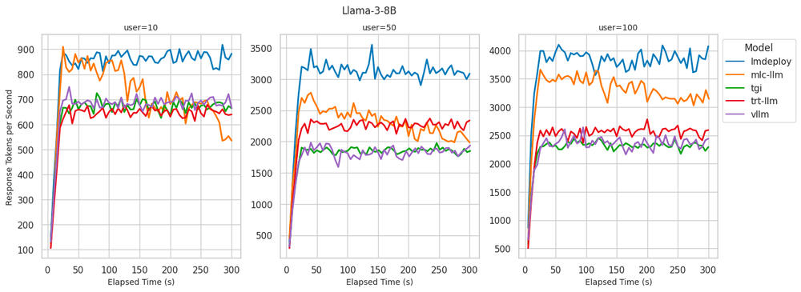
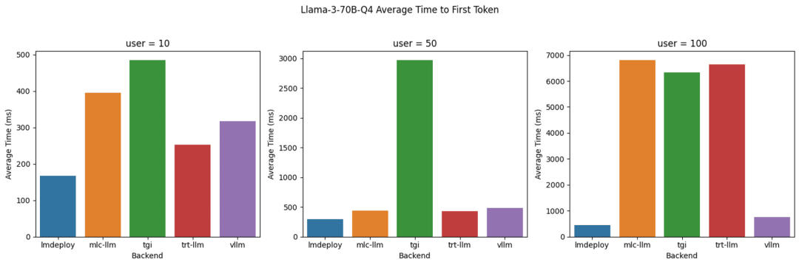

# LLM后端推理引擎性能大比拼
> **原文：BentoML 工程团队**
> 
> **翻译：OpenMMLab**
> 
> **原文链接：**[**https://www.bentoml.com/blog/benchmarking-llm-inference-backends**](https://www.bentoml.com/blog/benchmarking-llm-inference-backends)

选择适宜的推理后端来服务大语言模型 (LLMs) 至关重要。它不仅可以确保用户通过快速生成速度获得最佳体验，还可以通过 token 的高生成率和资源利用率降本增效。如今，开发者可以选择多种由知名研究和行业团队创建的推理后端。但是，为特定用例选择最佳后端可能具有挑战性。

为了帮助开发者做出明智的决策，BentoML 工程团队在 BentoCloud 上，分别使用 vLLM、LMDeploy、MLC-LLM、TensorRT-LLM 和 Hugging Face TGI 搭建了 Llama 3 推理服务，并对推理性能进行了全面的基准测试。

这些推理后端使用以下两个关键指标进行评估：

*   **Time to First Token (TTFT)**：首 token 延时，衡量从发送请求到生成第一个 token 所花费的时间，以毫秒为单位。对于需要即时反馈的应用（如交互式聊天机器人）来说，TTFT 非常重要。更低的延迟可以提高感知性能和用户满意度。
*   **Token Generation Rate**：token 生成率，评估**模型在 decoding 阶段每秒生成的 token 数量**，以 token 每秒为单位。token 生成率是衡量模型处理高负载能力的指标。较高的生成率表明模型能够高效地处理多个请求并快速生成响应，适合高并发环境。

**1\. Benchmark 核心洞见**

我们在 BentoCloud 上使用 A100 80GB GPU 实例（ gpu.a100.1x80 ）对 Llama 3 8B 和 70B 4-bit 量化模型进行了基准测试，涵盖了三种不同的推理负载（10、50 和 100 个并发用户）。以下是我们的一些主要的发现：

**Llama 3 8B**

Llama 3 8B: 不同后端的 Time to First Token（TTFT）

Llama 3 8B: 不同后端的 token 生成速率

*   **LMDeploy**：在 token 生成率方面表现最佳。对于 100 个并发用户，每秒生成高达 4000 个 token。在 10 名用户的情况下实现了同类最佳的 TTFT。尽管随着用户数量的增加，TTFT 会逐渐增加，但始终保持在较低水平且在可接受的范围内。
*   **MLC-LLM**：实现了略低的 decoding 性能，对于 100 个用户而言，每秒可处理约 3500 个 token。然而，在运行基准测试 5 分钟后，性能有所下降，降至每秒约 3100 个 token。当用户数达到 100 时，TTFT 性能会显著下降。
*   **vLLM**：**在所有并发用户级别上实现了同类最佳的 TTFT 性能。但是，其 decoding 性能与 LMDeploy 和 MLC-LLM 相比稍显逊色，每秒 decoding 2300-2500 个 token，与 TGI 和 TRT-LLM 类似。**

**LLama3 70B 4bit 量化**

Llama 3 70B Q4: 不同后端的 Time to First Token (TTFT)

Llama 3 70B Q4: 不同后端的 Token 生成速率

*   **LMDeploy**：**在服务 100 个用户时提供了最佳的 token 生成率，达到每秒 700 token，同时在所有并发用户级别上保持最低的 TTFT。**
*   **TensorRT-LLM**：在 token 生成率方面表现出与 LMDeploy 相似的性能，在低并发用户数时保持了较低的 TTFT。但是，当并发用户数达到 100 时，TTFT 显著增加至 6 秒以上。
*   **vLLM**：在所有并发用户级别上都表现出了稳定的低 TTFT，这与我们在 8B 模型上看到的情况类似。相比于 LMDeploy 和 TensorRT-LLM，其生成 token 的速度较低，这可能是由于缺乏针对量化模型的推理优化所致。

我们发现，token 生成率与推理后端实现的 GPU 利用率之间存在很强的相关性。能够维持高 token 生成率的后端也显示出接近100%的 GPU 利用率。相反，GPU 利用率较低的后端似乎受到了 Python 进程的限制。

**2\. 性能之外**

在为 LLMs 服务选择推理后端时，除了性能，还有其他一些重要考虑因素。以下是我们认为在选择理想推理后端时需要考虑的关键维度：

**3\. 开发者体验**

用户友好的推理后端应该为在 LLMs 上运行的 AI 应用提供快速开发能力和代码的高可维护性。

**稳定版本**：LMDeploy、TensorRT-LLM、vLLM 和 TGI 均提供稳定版本。MLC-LLM 目前没有稳定的标记版本，只有夜间构建；一种可能的解决方案是从源代码构建。

**模型编译**：TensorRT-LLM 和 MLC-LLM 需要明确的模型编译步骤，这可能会在部署期间引入额外的冷启动延迟。

**文档**：

*   LMDeploy、vLLM 和 TGI 的文档全面且包含示例，易于学习。
*   MLC-LLM 的学习曲线适中，这主要是因为需要了解模型编译步骤。
*   在我们的基准测试中，TensorRT-LLM 的设置最具挑战性。由于没有足够的优质示例，我们不得不通读 TensorRT-LLM、tensorrtllm\_backend 和 Triton Inference Server 的文档，转换模型，构建 TRT 引擎，并编写大量配置。

**4\. 概念**

**Llama 3**

Llama 3 是 Llama LLM 系列的最新版本，有多种配置可供选择。我们在基准测试中使用了以下模型大小。

*   **8B**：该模型拥有 80 亿个参数，在计算资源的管理上既强大又易于操作。使用 FP16 时，它需要大约 16GB 的内存（不包括 KV 缓存和其他开销），可以适配单个 A100-80G GPU 实例。
*   **70B 4位量化**：将这个拥有 70 亿个参数的模型量化为 4 位，可以显著减少其内存占用。量化通过减少每个参数的位数来压缩模型，在保持性能损失最小的情况下，提供更快的推理速度和更低的内存使用量。**使用 4 位 AWQ 量化后，在单个 A100-80G 实例上加载模型权重需要大约 37 GB 的 RAM**。在单个 GPU 设备上服务量化后的权重通常可以实现模型的最佳吞吐量，而将模型服务于多个设备则效果不佳。

**BentoML 和 BentoCloud**

*   BentoML：一个统一的模型服务框架，允许开发者使用任何开源或自定义 AI 模型构建模型推理 API 和多模型服务系统。开发者可以将所有依赖项、运行时配置和模型打包成一个自包含的单元，称为 Bento。
*   BentoCloud：面向企业 AI 团队的 AI 推理平台，提供专为模型推理而定制的完全托管基础架构。开发人员可将其与 BentoML 结合使用，以可扩展且安全的方式部署 AI 模型，并具有自动扩展、内置可观察性和多模型编排等高级功能。

我们确保使用 BentoML 提供的推理后端与使用 Python 原生提供的推理后端相比，只增加了极小的性能开销。开销是由于提供了扩展、可观察性和 IO 序列化功能。使用 BentoML 和 BentoCloud 为我们提供了适用于不同推理后端的一致 RESTful API，从而简化了基准测试设置和操作。

**推理后端（Inference backends ）**

不同的后端提供各种方式来服务 LLM，每种方式都有独特的功能和优化技术。我们测试的所有推理后端均遵循 Apache 2.0 许可证。

*   **LMDeploy**：推理后端专注于提供高 decoding 速度和高效处理并发请求。它支持各种量化技术，适合部署内存要求较低的大型模型。
*   **vLLM**：为服务 LLM 而优化的高性能推理引擎。它以高效利用 GPU 资源和快速 decoding 能力而闻名。
*   **TensorRT-LLM**：推理后端利用了 NVIDIA 的 TensorRT（一种高性能深度学习推理库）。它针对在 NVIDIA GPU 上运行大型模型进行了优化，提供快速推理并支持量化等高级优化。
*   **Hugging Face Text Generation Inference (TGI)**：用于部署和服务 LLM 的工具包。它在 Hugging Face 的生产中用于为 Hugging Chat、推理 API 和推理端点提供支持。
*   **MLC-LLM**：适用于 LLM 的 ML 编译器和高性能部署引擎。它建立在 Apache TVM 之上，在提供模型之前需要进行编译和权重转换。

将 BentoML 与各种推理后端集成以自托管 LLM 非常简单。BentoML 社区在 GitHub 上提供了以下示例项目来协助您完成整个过程。

BentoVLLM：[_https://github.com/bentoml/BentoVLLM_](https://github.com/bentoml/BentoVLLM)

BentoMLCLLM：[_https://github.com/bentoml/BentoMLCLLM_](https://github.com/bentoml/BentoMLCLLM)

BentoLMDeploy：[_https://github.com/bentoml/BentoLMDeploy_](https://github.com/bentoml/BentoLMDeploy)

BentoTRTLLM：[_https://github.com/bentoml/BentoTRTLLM_](https://github.com/bentoml/BentoTRTLLM)

BentoTGI：[_https://github.com/bentoml/BentoTGI_](https://github.com/bentoml/BentoTGI)

**5\. 基准测试设置**

我们按如下方式设置测试环境。

**模型**

我们测试了 Meta-Llama-3-8B-Instruct 和 Meta-Llama-3-70B-Instruct 4-bit 量化模型。对于 70B 模型，我们执行了 4-bit 量化，以便它可以在单个 A100-80G GPU 上运行。如果推理后端支持本机量化，我们将使用推理后端提供的量化方法。例如，对于 MLC-LLM，我们使用 q4f16\_1 量化方案。否则，我们使用 Hugging Face 的 AWQ 量化 casperhansen/llama-3-70b-instruct-awq模型。

请注意，除了启用常见的推理优化技术（例如：连续批处理、flash attention 和前缀缓存）之外，**我们没有针对每个后端微调推理配置（GPU 内存利用率、最大序列数、分页 KV 缓存块大小等）。这是因为随着我们服务的 LLM 数量越来越多，这种方法无法扩展**。提供一组最佳的推理参数是后端性能和易用性的隐性衡量标准。

**基准测试客户端**

为了准确评估不同 LLM 后端的性能，我们创建了一个自定义基准测试脚本。该脚本通过改变用户负载并在不同并发级别下发送生成请求来模拟真实场景。

我们的基准客户端可以在 20 秒内生成目标数量的用户，之后它会通过发送带有随机选择提示词的并发生成请求来对 LLM 后端进行压力测试。我们测试了 10、50 和 100 个并发用户，以评估系统在不同负载下的表现。

每次压力测试都持续了5分钟，在此期间，我们每5秒收集一次推理指标。这个持续时间足以观察到潜在的性能下降、资源利用瓶颈或其他在较短测试中可能无法显现的问题。

想了解更多信息，请查看我们基准测试客户端的源代码：[https://github.com/bentoml/llm-bench](https://github.com/bentoml/llm-bench)

**提示词数据集**

我们的测试提示词是从 **databricks-dolly-15k 数据集**提取的。对于每个测试会话，我们从该数据集中随机选择提示词。我们还测试了有系统提示和无系统提示的文本生成。**一些后端可能通过启用前缀缓存来优化常见的系统提示场景**。

**库版本（Library versions）**

*   BentoML: 1.2.16
*   vLLM: 0.4.2
*   MLC-LLM: mlc-llm-nightly-cu121 0.1.dev1251 (No stable release yet)
*   LMDeploy: 0.4.0
*   TensorRT-LLM: 0.9.0 (with Triton v24.04)
*   TGI: 2.0.4

**6\. 建议**

LLM 推理优化领域正在迅速发展，并得到了大量研究。当今最好的推理后端可能很快就会被新来者超越。根据我们在撰写本文时进行的基准测试和可用性研究，我们针对在各种情况下为 Llama 3 模型选择最合适的后端提出了以下建议。

**Llama 3 8B**

对于 Llama 3 8B 模型，\*\*LMDeploy 在所有用户负载下始终提供较低的 TTFT 和最高的 token 生成速度。它的易用性是另一个重要优势，因为它可以动态将模型转换为 TurboMind 引擎格式，从而简化部署过程。\*\*在撰写本文时，LMDeploy 对使用滑动窗口注意机制的模型（例如 Mistral 和 Qwen 1.5）提供有限的支持。

**即使用户负载增加，vLLM 也能始终保持较低的 TTFT，这使其适用于保持低延迟至关重要的场景。vLLM 提供轻松集成、广泛的模型支持和广泛的硬件兼容性**，所有这些都由强大的开源社区提供支持。

MLC-LLM 在较低用户负载下提供最低的 TTFT，并在最初保持较高的 decoding 速度。经过长时间的压力测试后，其 decoding 速度明显下降。尽管面临这些挑战，MLC-LLM 仍显示出巨大的潜力。解决这些性能问题并实施稳定版本可以大大提高其有效性。

**Llama 3 70B 4-bit 量化**

对于Llama 3 70B 4 bit 量化，**LMDeploy 在所有用户负载下都展现出了令人印象深刻的性能，其 TTFT 最低。它还保持了较高的 token 生成速度，使其成为在需要低延迟和高吞吐量应用中理想的选择**。LMDeploy 还因其易用性而脱颖而出，它可以在无需进行大量设置或编译的情况下快速转换模型，使其成为快速部署场景的理想选择。

TensorRT-LLM 在吞吐量方面与 LMDeploy 相当，但\*\*在高用户负载场景下的延迟表现不如 LMDeploy。\*\*由于 TensorRT-LLM 由 Nvidia 支持，我们预计这些差距将很快得到解决。然而，它对模型编译的内在需求以及对 Nvidia CUDA GPU 的依赖是有意的设计选择，这可能在部署时带来限制。

**vLLM 能够在用户负载增加的情况下保持较低的 TTFT，其易用性对于许多用户来说是一个显著的优势**。然而，截至撰写本文时，后端对于 AWQ 量化的优化不足，导致量化模型的 decoding 性能不尽理想。

**更多的资源**

我们希望这个基准测试能够帮助开发者在选择理想的推理后端时做出明智的决策。在我们的基准测试过程中，BentoML 和 BentoCloud 发挥了重要作用，使我们能够轻松地将不同的后端与 Llama 3 集成，并专注于性能评估。