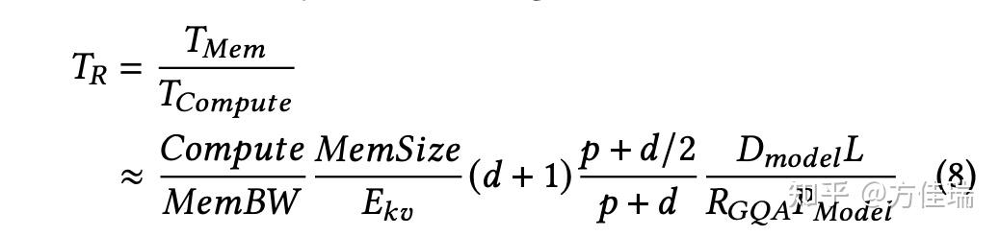
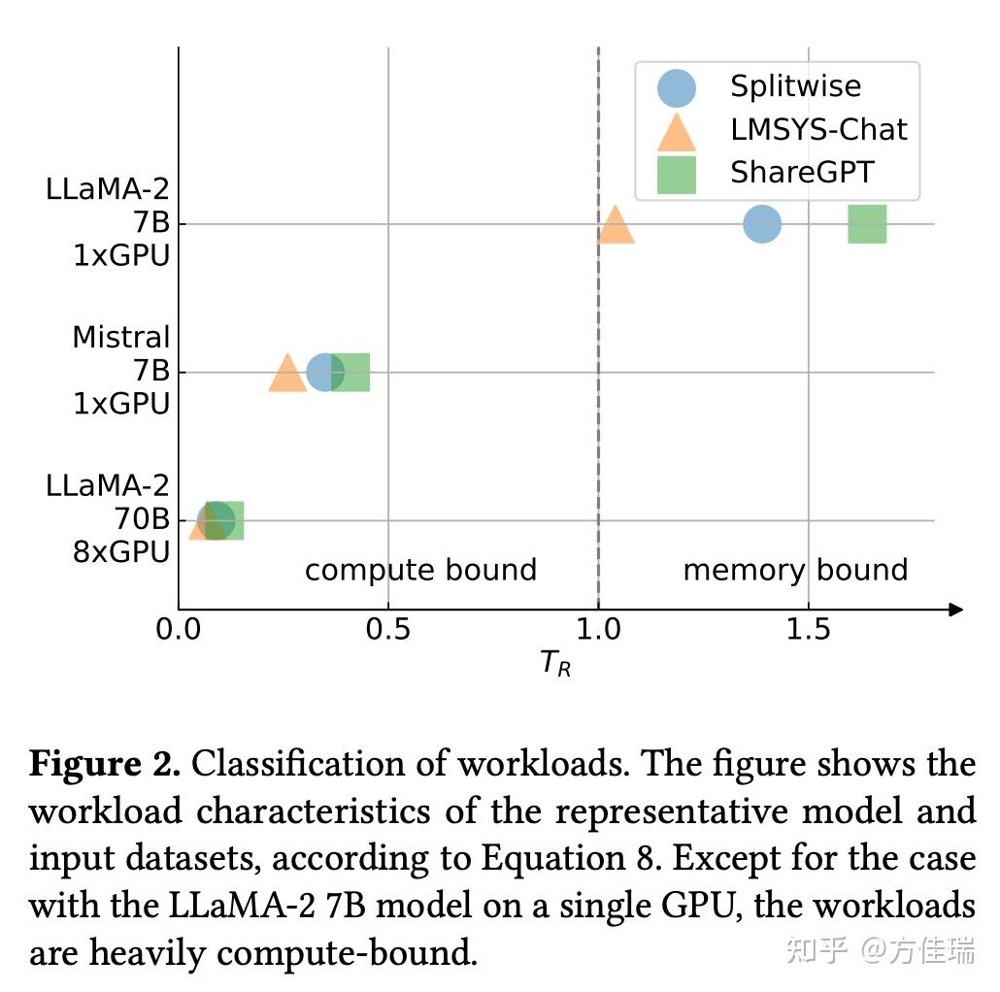
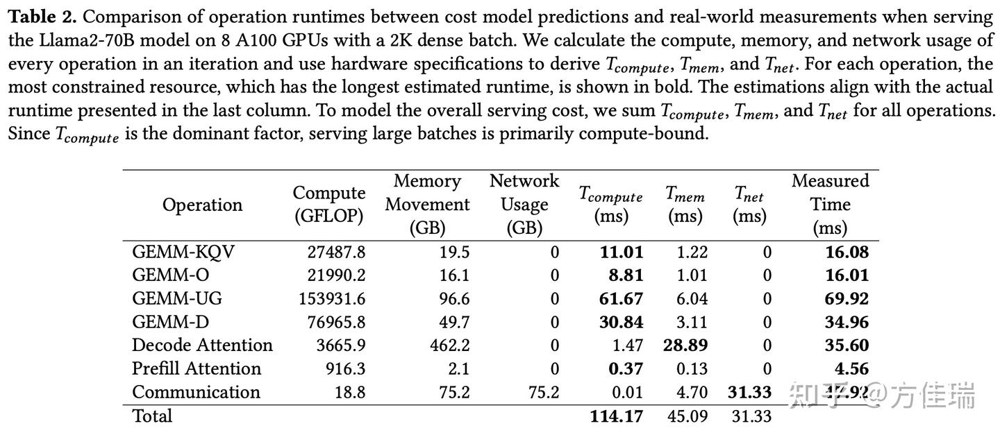
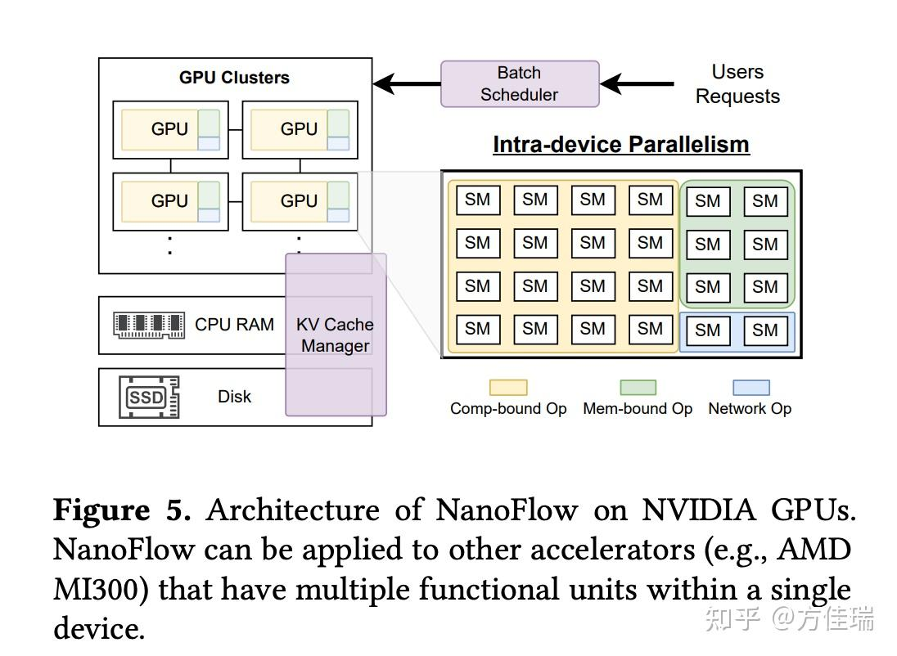
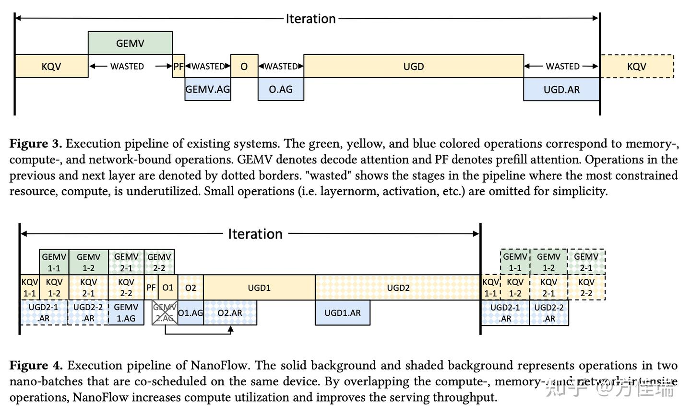

# NanoFlow：当 LLM推理框架优化进入深水区
> _**作者: 方佳瑞**_ 
> 
> _**原文:**_ [_**https://zhuanlan.zhihu.com/p/19187838229**_](https://zhuanlan.zhihu.com/p/19187838229)

2024 年，[LLM](https://zhida.zhihu.com/search?content_id=252860022&content_type=Article&match_order=1&q=LLM&zhida_source=entity) 模型推理的 [low hanging fruits](https://zhida.zhihu.com/search?content_id=252860022&content_type=Article&match_order=1&q=low+hanging+fruits&zhida_source=entity) 几乎被采摘殆尽，优化进入了深水区。在算子、并行、量化、投机采样等层面已经玩不出新花样，需要啃硬骨头的事情优先级得到提升。为了继续降低服务成本，大幅度重构现有框架，甚至用 C++重写来换取更高效的运行时，是大家不得不面临的选择。一个明显的信号是：消除框架的 CPU层面开销成为许多[开源框架](https://zhida.zhihu.com/search?content_id=252860022&content_type=Article&match_order=1&q=%E5%BC%80%E6%BA%90%E6%A1%86%E6%9E%B6&zhida_source=entity)近期的主旋律，比如[vllm v0.6.0](https://link.zhihu.com/?target=https%3A//blog.vllm.ai/2024/09/05/perf-update.html)和 [SGLang v0.4.0](https://link.zhihu.com/?target=https%3A//lmsys.org/blog/2024-12-04-sglang-v0-4/) 的版本升级。

NanoFlow 正是一个在深水区作业的工作。 2024 年 8 月发布时，有朋友向我推荐过这个项目。我刚开始也只是以为是高校实验室出品的 yet another vLLM 的 Demo 级别的作品。不过半年过去了，还是见证了 NanoFlow 的影响逐步发酵，SGLang的最新升级都对其进行了引用。火到出圈的 DeepSeekV3 的推理优化中也有 NanoFlow 思想的影子（经读者指正，技术报告中并没有引用 NanoFlow）。

[NanoFlow: Towards Optimal Large Language Model Serving Throughput](https://link.zhihu.com/?target=https%3A//arxiv.org/abs/2408.12757)

最近笔者抽空精读 NanoFlow 论文，希望看看深水区的别样风景。

简而言之：NanoFlow 是面向吞吐指标（系统的整体 token/sec）做优化的，如果你的任务对延迟很敏感可能还有副作用。他首先论证高吞吐场景下，LLM 推理应该是 compute-bound 的，然后提出Intra-device parallelism来实现此目的。我们分别来看这两部分：

LLM 推理是 Compute-Bound 的？

文章花了大幅篇幅来论证这个看起来反直觉的结论。如下引用第 7 页原文：

> Therefore, the optimal throughput depends only on the [GPU](https://zhida.zhihu.com/search?content_id=252860022&content_type=Article&match_order=1&q=GPU&zhida_source=entity)s’ aggregated computing power for the corresponding data type and the number of parameters in the model. Other factors, including the GPU memory size, bandwidth, the data type of the model, or the length of prefill/decode, do not affect the [optimal](https://zhida.zhihu.com/search?content_id=252860022&content_type=Article&match_order=2&q=optimal&zhida_source=entity) throughput substantively.  
> （因此，最优吞吐量仅取决于GPU在相应数据类型上的聚合计算能力以及模型中的参数数量。其他因素，包括GPU内存大小、带宽、模型的数据类型或预填充/解码的长度，对最优吞吐量没有实质性影响。）

按照目前主流说法：LLM 推理分为 Prefill 和 [Decode](https://zhida.zhihu.com/search?content_id=252860022&content_type=Article&match_order=1&q=Decode&zhida_source=entity) 两个阶段，Prefill 是 Compute-bound，Decode 是 Memory-bound。几乎所有的[优化技术](https://zhida.zhihu.com/search?content_id=252860022&content_type=Article&match_order=1&q=%E4%BC%98%E5%8C%96%E6%8A%80%E6%9C%AF&zhida_source=entity)本质都是来 Decode 缓解 memory-bound 的程度，比如[投机采样](https://zhida.zhihu.com/search?content_id=252860022&content_type=Article&match_order=2&q=%E6%8A%95%E6%9C%BA%E9%87%87%E6%A0%B7&zhida_source=entity)、权重量化、GQA/ MLA和 P-D 分离等等。

那 NanoFlow 是如何得到这个有些惊世骇俗的结论的呢？作者先抛出了一个简单的性能模型，原文有些绕，笔者用自己理解方式复述。此性能模型本质是 Roofline Model，它计算显存允许范围内，最大 [Batch](https://zhida.zhihu.com/search?content_id=252860022&content_type=Article&match_order=1&q=Batch&zhida_source=entity) Size 情况下的 AI （Arithmetic Intensity）。文中 TR （AI 的倒数）的计算公式如下，它是访存时间和计算时间的比值。

模参数含义：

*   Dmodel：隐藏层维度大小
*   L ：模型的层数
*   Pmodel ：模型的参数数量
*   RGQA ：GQA（Grouped Query Attention）的分组大小
*   p ：Prefill prompt的平均token 数
*   d ：Decode输出的平均token数

已知模型参数和 GPU 显存上限，就能得出 E\_kv（一个反映内存最多能同时存放多少 token 的 [KVCache](https://zhida.zhihu.com/search?content_id=252860022&content_type=Article&match_order=1&q=KVCache&zhida_source=entity) 的值）。然后，根据这些 token 中 prefill 和 decode 的比例，即 p:d，可以知道 prefill 和 decode 的计算比例，从而预估出总体计算时间。

观此公式可知， decode 生成越长（d 越大）越偏 [memory-bound](https://zhida.zhihu.com/search?content_id=252860022&content_type=Article&match_order=2&q=memory-bound&zhida_source=entity)，prefill 越长（p 越大）任务越偏 compute-bound（但是长到一定程度就没用了），GQA group 越多越偏 [compute-bound](https://zhida.zhihu.com/search?content_id=252860022&content_type=Article&match_order=3&q=compute-bound&zhida_source=entity)，这都是很直觉的。

作者代入 LLAMA2 7B，70B 和 Mistral 7B三个Dense 模型和三个 request 数据集（ Splitewise、LMSYS-Chat 和 ShareGPT）一算，得到 Figure 2，发现除了 LLAMA-2，剩下两个在三个数据集上都是 [compute bound](https://zhida.zhihu.com/search?content_id=252860022&content_type=Article&match_order=1&q=compute+bound&zhida_source=entity) 的。图中GPU 都是 A100 的，注意LLAMA2用了 8 个 A100，剩下两个小模型只用 1 个。

我来分析一下这个性能模型可能有争议之处：

1.  性能模型假设 request 输入输出长度是相对稳定的，如果流量的 p 和 d 变化范围比较大，那么在线服务仍存在负载在 memory-bound 范围的时刻。
2.  性能模型建立在 Batch Size 尽可能开成最大的假设。注意这个 Batch Size 是总的 token 数而非 request 数目，区别在于一个 prefill 请求包含多个 token。那么在非常大的 Batch Size 下单个用户的[TPOT](https://zhida.zhihu.com/search?content_id=252860022&content_type=Article&match_order=1&q=TPOT&zhida_source=entity)（Time Per Output Token）还是可以保证的么？即使系统整体的 TPOT 很高，但是平摊到每个用户上则是 TPOP\*B\_req（Batch 中 request 数目），如果 B\_req很大，那么单个用户的 TPOT 仍然很高。不过笔者认为它也可以通过 [Tensor Parallel](https://zhida.zhihu.com/search?content_id=252860022&content_type=Article&match_order=1&q=Tensor+Parallel&zhida_source=entity) 来解决，增加 TP degree 不会影响 T\_R 和 B\_req ，因为整体算力上去了，TPOT 会变化高。所以咱们暂时认为它也是合理的。
3.  性能模型没有考虑 MoE。如果使用非常稀疏激活的 MoE，系统应该更偏 [memory bound](https://zhida.zhihu.com/search?content_id=252860022&content_type=Article&match_order=1&q=memory+bound&zhida_source=entity)。

从这个性能模型，得到了 LLM 推理只受限于 GPU 的[峰值算力](https://zhida.zhihu.com/search?content_id=252860022&content_type=Article&match_order=1&q=%E5%B3%B0%E5%80%BC%E7%AE%97%E5%8A%9B&zhida_source=entity)的惊人结论，比如Table 2 展示 LLAMA2-70B 的推理任务中 ，其中T\_compute，T\_mem，T\_net都是用性能模型算出来的，最后一列 Measured Time 实测值，可以看到T\_compute显著高于 T\_mem + T\_net。那为什么 Measured Time的 Total 行没有值呢？嘿嘿，笔者认为可能是因为端到端结果和分解相加和起来没对上，哪部分被重叠或者拖慢了，又不敢贸然给一个结论。

既然理论是[Compute-bound](https://zhida.zhihu.com/search?content_id=252860022&content_type=Article&match_order=2&q=Compute-bound&zhida_source=entity)，那为什么现有LLM 推理系统实际上显然不是 Compute-bound 的呢？

由于 Decode Attention等操作是明显 memory bound 的，Table 种2 1.47 sec（计算） vs 28.89 sec（访存），TP 通信也导致计算资源限制，Table 2 种占据了 31.33 sec。这些非 compute bound operation的顺序执行阻碍了资源的最大化利用。

何解？本文提出了 intra-device parallelism 去破解这个顺序执行问题。

intra-device parallelism 和黑科技
-----------------------------

NanoFlow 的设计 Figure 5 所示。它通过全局 Batch Scheduler 根据离线数据选择最佳[batch size](https://zhida.zhihu.com/search?content_id=252860022&content_type=Article&match_order=1&q=batch+size&zhida_source=entity)。每个 GPU 内，intra-device parallelism engine把任务被拆分为更小的nano-batching [并行执行](https://zhida.zhihu.com/search?content_id=252860022&content_type=Article&match_order=1&q=%E5%B9%B6%E8%A1%8C%E6%89%A7%E8%A1%8C&zhida_source=entity)。KV Cache manager 将已完成任务的缓存转移到 CPU 或 SSD，腾出空间处理新任务。

### Batch Scheduler

这个模块就是负责在 continous batching 中把 request 加入 系统正在处理的 global batch 的，其他推理框架也都有。它使用了 chunked prefill， 这对提升operantion 的 Batch Size 很关键。另外采用[张量](https://zhida.zhihu.com/search?content_id=252860022&content_type=Article&match_order=1&q=%E5%BC%A0%E9%87%8F&zhida_source=entity)并行而非流水并行，因为流水并行要把 Batch Size 拆成 [micro-batch](https://zhida.zhihu.com/search?content_id=252860022&content_type=Article&match_order=1&q=micro-batch&zhida_source=entity)，同等显存限制条件下，张量并行的 Batch Size 更大。

笔者认为 BatchScheduler 这个模块没啥创新，限制使用 chunkedprefill 和张量并行，还带来很多限制。首先，这导致 P-D 分离不适合 NanoFlow，因为它不用 chunked prefill，Decode 实例实现 compute-bound 更困难。另外，拒绝使用流水并行。流水卡间并行信量少，做通信计算重叠更容易，按照直觉来说适合吞吐型任务，实验部分也没和流水并行对比，这也有待商榷。

### Intra-device parallelism engine

这是 NanoFlow 系统的核心部分。LLM operation 有顺序依赖的特点，所以在一个 batch 的计算里，不同的 operation 难以重叠处理。那就把 global batch 分成更小的 nano-batch，这样不同 nano-batch 之间的 operation 在计算时就能重叠。比如在下面的 Figure 4 中，像 GEMV 这种受内存限制的 operation 可以和 GEMM 这种受计算限制的 operation 一起发给 GPU 执行，因为利用不同的硬件资源，执行时间可以互相重叠。同样，GPU 间的通信操作还能进一步和 GEMV 以及 GEMM 重叠。

那么该如何选择 nano-batch 的大小呢？因为 nano-batch 个数太多，GPU 利用率就会降低；个数太少，之间又无法重叠。对于 LLaMA-2-70B 的工作流，作者设计 KQV 和 Decode Attention Operation 时使用 4 个 nano-batch，以避免流水线气泡。

这里能看到 NanoFlow 处理与张量并行兼容的一个trick。标准张量并行在 O Linear 结束后做 AllReduce，但这样会在 NanoFlow 中产生气泡。所以将其[等价变换](https://zhida.zhihu.com/search?content_id=252860022&content_type=Article&match_order=1&q=%E7%AD%89%E4%BB%B7%E5%8F%98%E6%8D%A2&zhida_source=entity)为在 O Linear 之前做一个 AllGather（AG），然后在 O 之后再做一个 AG。2 个 AG 的通信量与 AllReduce 相同，不过这样能把一半通信提前，用于重叠。

从这里也能看出，NanoFlow 若要实现重叠，nano batch 个数、通信方式等设计会非常定制化，比如换成序列并行可能又要精心调优。

Figure 4 看起来很美好，但是怎么把 GEMV， GEMM，AR 相互重叠给实现出来，这是需要黑科技的。因为调用 [cutlass](https://zhida.zhihu.com/search?content_id=252860022&content_type=Article&match_order=1&q=cutlass&zhida_source=entity) 和 FlashAttention 等[算子库](https://zhida.zhihu.com/search?content_id=252860022&content_type=Article&match_order=1&q=%E7%AE%97%E5%AD%90%E5%BA%93&zhida_source=entity)，同一时间 GPU 上只能 launch 一个 [kernel](https://zhida.zhihu.com/search?content_id=252860022&content_type=Article&match_order=1&q=kernel&zhida_source=entity)。为了实现重叠，要么去做 [kernel fusion](https://zhida.zhihu.com/search?content_id=252860022&content_type=Article&match_order=1&q=kernel+fusion&zhida_source=entity)，要么用multi-stream 来做并发。前者需要很高人力，后者如果多个kernel同时请求大量SM，GPU 调度器可能会拒绝[并发运行](https://zhida.zhihu.com/search?content_id=252860022&content_type=Article&match_order=1&q=%E5%B9%B6%E5%8F%91%E8%BF%90%E8%A1%8C&zhida_source=entity)这些内核。

基于 multi-stream方案，作者设计了一种custom execution unit schedudling，在使用 [CUDA](https://zhida.zhihu.com/search?content_id=252860022&content_type=Article&match_order=1&q=CUDA&zhida_source=entity) 多流启动不同操作时，限制每个kernel的执行单元（在 [NVIDIA](https://zhida.zhihu.com/search?content_id=252860022&content_type=Article&match_order=1&q=NVIDIA&zhida_source=entity) GPU 上就是 SM，[AMD](https://zhida.zhihu.com/search?content_id=252860022&content_type=Article&match_order=1&q=AMD&zhida_source=entity) 上可能是CU？）使用量。通过控制执行单元，该调度有效缓解了kernel干扰，并充分利用了高资源利用率。

支持custom execution unit schedudling 的关键洞察是 GPU 资源利用的非线性特性。例如，仅使用 108 个 SM 中的 35 个（32%），网络kernel 即可实现高达 92% 的峰值性能，表明网络资源利用率与 SM 数量呈非线性关系。因此，通过限制 SM 使用量重叠多个操作，每个操作都能以更高的 SM 效率执行，从而提升整体资源利用率。  
为实现 custom execution unit schedudling，作者需对 cutlass、flashinfer 等算子库进行改造。读者可在 github 代码中查找改造方式。

DeepSeekV3推理时也是利用类似的技巧来重叠通信和计算，如下部分出自 [DeepSeekV3 技术报告](https://link.zhihu.com/?target=https%3A//arxiv.org/pdf/2412.19437)Sec 3.4。

> Additionally, to enhance throughput and hide the overhead of all-to-all communication, we are also exploring processing **two** [**micro-batches**](https://zhida.zhihu.com/search?content_id=252860022&content_type=Article&match_order=1&q=micro-batches&zhida_source=entity) with similar computational workloads simultaneously in the decoding stage. Unlike prefilling, attention consumes a larger portion of time in the [decoding](https://zhida.zhihu.com/search?content_id=252860022&content_type=Article&match_order=2&q=decoding&zhida_source=entity) stage. Therefore, **we overlap the attention of one micro-batch with the dispatch+MoE+combine of another**. In the decoding stage, the batch size per expert is relatively small (usually within 256 tokens), and the bottleneck is memory access rather than computation. Since the MoE part only needs to load the parameters of one expert, the memory access overhead is minimal, so using fewer SMs will not significantly affect the overall performance. Therefore, to avoid impacting the computation speed of the attention part, we can allocate only a small portion of SMs to dispatch+MoE+combine.

### KV-cache manager

为优化 GPU 内存使用并避免内存不足，NanoFlow 的 KV-cache manager 基于请求的[负载特性](https://zhida.zhihu.com/search?content_id=252860022&content_type=Article&match_order=1&q=%E8%B4%9F%E8%BD%BD%E7%89%B9%E6%80%A7&zhida_source=entity)预测未来内存峰值。它跟踪每个请求的 decode token数，使用平均decode长度估算完成时间，并计算未来内存使用的最高值。仅当预估内存峰值低于 GPU 总内存时，才会调度新请求。在极少数内存耗尽情况下，管理器会丢弃请求以释放内存。

KVCache也会 offload 到 CPU 内存和 SSD 上，用异步方式传输。这个很多Prefix Cache 优化中已经见怪不怪了，这里不做赘述。

### Top-level scheduling

刚才说的是在模型一次模型前向传播forward 中为接近计算上限所做的优化。NanoFlow 还降低了 CPU 进行Batch 调度的开销，以减少 KVCache 管理和Batch调度的开销。为降低 CPU 调度开销，组Batch 和 KV-cache 管理器通过异步方式与 GPU 内核并行运行。

在每次迭代 中，NanoFlow 在当前迭代结束前为下一迭代做出Batch调度决策并分配 KV-cache entries。NanoFlow 直接启动迭代 + 1，而无需检测迭代 生成的结束符（EOS）。启动迭代 + 1 后，EOS 被检测到，已完成请求将在迭代 + 2 的Batch 调度形成时从全局批次中移除。

这种减少 CPU 调度 overhead 方式和 [vllm 0.6.0 升级方式](https://link.zhihu.com/?target=https%3A//blog.vllm.ai/2024/09/05/perf-update.html)非常像。vllm 用来重叠每个迭代 forward 的前后处理的 CPU overhead。

总结：
---

NanoFlow 乃是 2024 年 LLM 推理领域中一项非常硬核的工作。笔者认为，其并非于大方向上具有开拓性，然而在 GPU 使用方式点上了[黑科技](https://zhida.zhihu.com/search?content_id=252860022&content_type=Article&match_order=3&q=%E9%BB%91%E7%A7%91%E6%8A%80&zhida_source=entity)。其思想涵盖以下部分：

1.  文章抛出这样一个相对惊世骇俗的观点：LLM 推理是 compute bound 的。在 PD 分离和 MoE 大行其道的今天，这个结论是否适用，仁者见仁，智者见智，相信一线做优化的读者更有发言权。
2.  为了增大operation 计算时的 batch size，NanoFlow 强制绑定了 chunked prefill 和张量并行，要是这两个条件不再绑定，很多设计可能会面临挑战。
3.  将大 batch 拆成 nano batch，让不同 nano batch 中不同性质的 operation （compute bound，memory bound 和 inter-GPU communication）互相重叠，可以接近 compute bound 的上限。 这里用的最重要的技巧就是custom execution unit schedudling，限制 kernel 执行的 SM 个数。我认为这个对于非 CUDA 老炮来说是个黑科技，也是本文对领域的最大贡献点。
4.  Zero CPU overhead 调度现在看起来见怪不怪了，但NanoFlow 这方面应该是和 vLLM 的同期工作，亦对社区有所贡献。