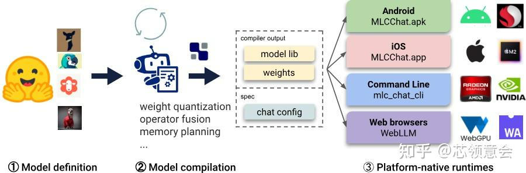
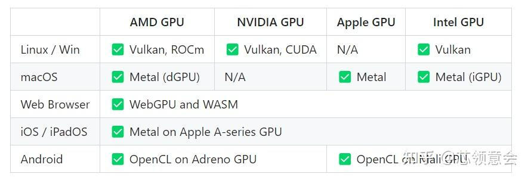
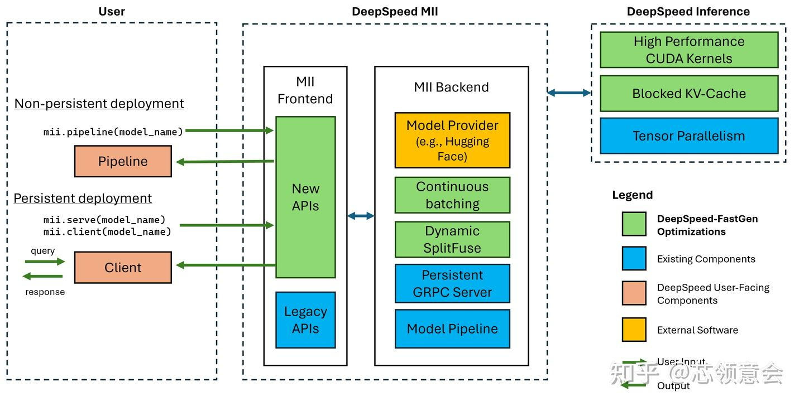
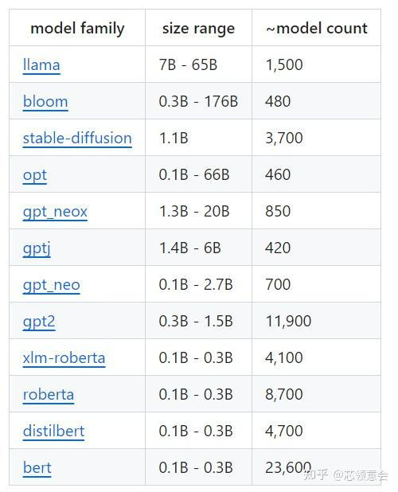
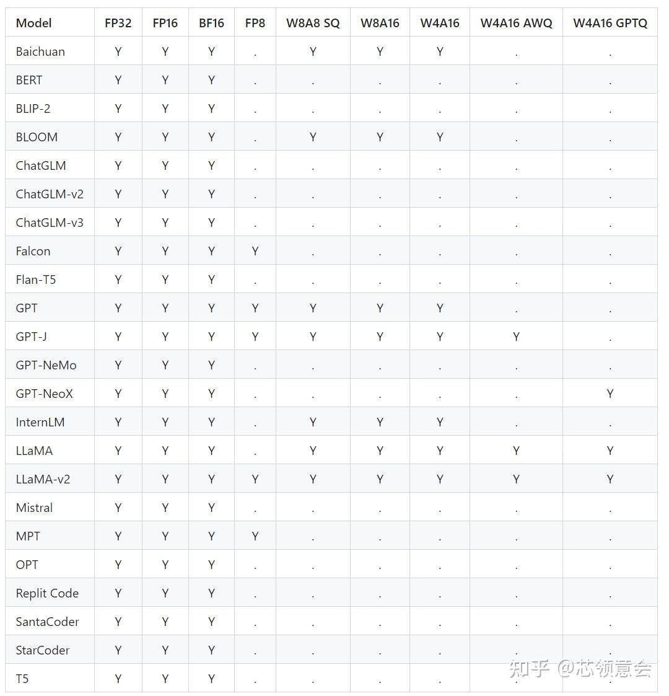

# 大模型&LLM&推理框架汇总
> _**作者: 芯领意会**_
> 
> _**原文:**_ [_**https://zhuanlan.zhihu.com/p/671347964**_](https://zhuanlan.zhihu.com/p/671347964)

MLC LLM
-------

> submodules in MLC LLM

大模型(LLM)好性能通用部署方案，[陈天奇](https://zhida.zhihu.com/search?content_id=237318308&content_type=Article&match_order=1&q=%E9%99%88%E5%A4%A9%E5%A5%87&zhida_source=entity)(tvm发起者)团队开发.

### 项目链接

docs: [https://llm.mlc.ai/docs/](https://link.zhihu.com/?target=https%3A//llm.mlc.ai/docs/)

github: [https://github.com/mlc-ai/mlc-llm](https://link.zhihu.com/?target=https%3A//github.com/mlc-ai/mlc-llm)

### 支持的平台和硬件

> platforms & hardware

### 支持的模型

| **Architecture** | **Prebuilt Model Variants** |
| --- | --- |
| Llama | Llama-2, Code Llama, Vicuna, WizardLM, WizardMath, OpenOrca Platypus2, FlagAlpha Llama-2 Chinese, georgesung Llama-2 Uncensored |
| GPT-NeoX | RedPajama |
| GPT-J |     |
| RWKV | RWKV-raven |
| MiniGPT |     |
| GPTBigCode | WizardCoder |
| ChatGLM |     |
| ChatGLM |     |

### 接口API 支持

Javascript API, Rest API, C++ API, Python API, Swift API for iOS app, Java API & Android App

### 量化(Quantization) 方法支持

4-bit, LUT-GEMM, GPTQ

ref: [https://llm.mlc.ai/docs/compilation/configure\_quantization.html](https://link.zhihu.com/?target=https%3A//llm.mlc.ai/docs/compilation/configure_quantization.html)

### 其他

最大的特点是可以快速部署大模型到iOS 和 Android 设备上, 浏览器上运行[文生图模型](https://zhida.zhihu.com/search?content_id=237318308&content_type=Article&match_order=1&q=%E6%96%87%E7%94%9F%E5%9B%BE%E6%A8%A1%E5%9E%8B&zhida_source=entity)(sd1.5/2.1)和大模型, 推理框架基于tvm-unity.

vLLM
----

快速简单易用的大模型推理框架和服务，来自[加州大学伯克利分校](https://zhida.zhihu.com/search?content_id=237318308&content_type=Article&match_order=1&q=%E5%8A%A0%E5%B7%9E%E5%A4%A7%E5%AD%A6%E4%BC%AF%E5%85%8B%E5%88%A9%E5%88%86%E6%A0%A1&zhida_source=entity)

vLLm 运行大模型非常快主要使用以下方法实现的：

1.  先进的服务吞吐量
2.  通过PageAttention 对attention key & value 内存进行有效的管理
3.  对于输入请求的连续批处理
4.  高度优化的[CUDA kernels](https://zhida.zhihu.com/search?content_id=237318308&content_type=Article&match_order=1&q=CUDA+kernels&zhida_source=entity)

### 项目链接

docs: [Welcome to vLLM!](https://link.zhihu.com/?target=https%3A//docs.vllm.ai/en/latest/)

github: [https://github.com/vllm-project/vllm](https://link.zhihu.com/?target=https%3A//github.com/vllm-project/vllm)

### 支持的平台和硬件

NVIDIA CUDA, AMD ROCm

### 支持的模型

vLLM seamlessly supports many Hugging Face [models](https://zhida.zhihu.com/search?content_id=237318308&content_type=Article&match_order=1&q=models&zhida_source=entity), including the following architectures:

*   Aquila & Aquila2 (`BAAI/AquilaChat2-7B`, `BAAI/AquilaChat2-34B`, `BAAI/Aquila-7B`, `BAAI/AquilaChat-7B`, etc.)
*   Baichuan & Baichuan2 (`baichuan-inc/Baichuan2-13B-Chat`, `baichuan-inc/[Baichuan-7B](https://zhida.zhihu.com/search?content_id=237318308&content_type=Article&match_order=1&q=Baichuan-7B&zhida_source=entity)`, etc.)
*   BLOOM (`bigscience/bloom`, `bigscience/bloomz`, etc.)
*   ChatGLM (`THUDM/chatglm2-6b`, `THUDM/chatglm3-6b`, etc.)
*   Falcon (`tiiuae/falcon-7b`, `tiiuae/[falcon-40b](https://zhida.zhihu.com/search?content_id=237318308&content_type=Article&match_order=1&q=falcon-40b&zhida_source=entity)`, `tiiuae/falcon-rw-7b`, etc.)
*   GPT-2 (`gpt2`, `gpt2-xl`, etc.)
*   GPT BigCode (`bigcode/starcoder`, `bigcode/gpt_bigcode-santacoder`, etc.)
*   GPT-J (`EleutherAI/[gpt-j-6b](https://zhida.zhihu.com/search?content_id=237318308&content_type=Article&match_order=1&q=gpt-j-6b&zhida_source=entity)`, `nomic-ai/[gpt4all-j](https://zhida.zhihu.com/search?content_id=237318308&content_type=Article&match_order=1&q=gpt4all-j&zhida_source=entity)`, etc.)
*   GPT-NeoX (`EleutherAI/gpt-neox-20b`, `databricks/dolly-v2-12b`, `stabilityai/[stablelm-tuned-alpha-7b](https://zhida.zhihu.com/search?content_id=237318308&content_type=Article&match_order=1&q=stablelm-tuned-alpha-7b&zhida_source=entity)`, etc.)
*   InternLM (`[internlm/internlm-7b](https://zhida.zhihu.com/search?content_id=237318308&content_type=Article&match_order=1&q=internlm%2Finternlm-7b&zhida_source=entity)`, `internlm/[internlm-chat-7b](https://zhida.zhihu.com/search?content_id=237318308&content_type=Article&match_order=1&q=internlm-chat-7b&zhida_source=entity)`, etc.)
*   LLaMA & LLaMA-2 (`[meta-llama](https://zhida.zhihu.com/search?content_id=237318308&content_type=Article&match_order=1&q=meta-llama&zhida_source=entity)/Llama-2-70b-hf`, `lmsys/[vicuna-13b-v1.3](https://zhida.zhihu.com/search?content_id=237318308&content_type=Article&match_order=1&q=vicuna-13b-v1.3&zhida_source=entity)`, `young-geng/koala`, `[openlm-research](https://zhida.zhihu.com/search?content_id=237318308&content_type=Article&match_order=1&q=openlm-research&zhida_source=entity)/open_llama_13b`, etc.)
*   Mistral (`mistralai/[Mistral-7B-v0.1](https://zhida.zhihu.com/search?content_id=237318308&content_type=Article&match_order=1&q=Mistral-7B-v0.1&zhida_source=entity)`, `mistralai/[Mistral-7B-Instruct-v0.1](https://zhida.zhihu.com/search?content_id=237318308&content_type=Article&match_order=1&q=Mistral-7B-Instruct-v0.1&zhida_source=entity)`, etc.)
*   MPT (`mosaicml/[mpt-7b](https://zhida.zhihu.com/search?content_id=237318308&content_type=Article&match_order=1&q=mpt-7b&zhida_source=entity)`, `mosaicml/[mpt-30b](https://zhida.zhihu.com/search?content_id=237318308&content_type=Article&match_order=1&q=mpt-30b&zhida_source=entity)`, etc.)
*   OPT (`facebook/opt-66b`, `facebook/opt-iml-max-30b`, etc.)
*   Phi-1.5 (`microsoft/phi-1_5`, etc.)
*   Qwen (`Qwen/Qwen-7B`, `Qwen/Qwen-7B-Chat`, etc.)
*   Yi (`01-ai/Yi-6B`, `01-ai/Yi-34B`, etc.)

### 接口API支持

OpenAI-compatible API server

分布式推理和服务（支持Megatron-LM's tensor parallel algorithm）

可以使用SkyPilot 框架运行在云端

可以使用NVIDIA Triton 快速部署

可以使用LangChain 提供服务

### 量化(Quantization)方法

[4-bit](https://zhida.zhihu.com/search?content_id=237318308&content_type=Article&match_order=2&q=4-bit&zhida_source=entity): [AutoAWQ](https://link.zhihu.com/?target=https%3A//github.com/casper-hansen/AutoAWQ)

OpenLLM
-------

促进实际生产过程中的大模型的部署，微调，服务和监测.

### 项目链接

github: [GitHub - bentoml/OpenLLM: Operating LLMs in production](https://link.zhihu.com/?target=https%3A//github.com/bentoml/OpenLLM)

### 支持的平台和硬件

GPU

### 支持的模型

| **model** |
| --- |
| Baichuan |
| ChatGLM |
| DollyV2 |
| Falcon |
| FlanT5 |
| GPTNeoX |
| Llama |
| Mistral |
| MPT |
| OPT |
| Phi |
| Qwen |
| StableLM |
| StarCoder |
| Yi  |

### 接口API支持 & Integrations

Serve LLMs over a RESTful API or gRPC with a single command. You can interact with the model using a Web UI, CLI, Python/JavaScript clients, or any HTTP client of your choice.

[BentoML](https://link.zhihu.com/?target=https%3A//github.com/bentoml/BentoML),[OpenAI's Compatible Endpoints](https://link.zhihu.com/?target=https%3A//platform.openai.com/docs/api-reference/completions/object),[LlamaIndex](https://link.zhihu.com/?target=https%3A//www.llamaindex.ai/),[LangChain](https://link.zhihu.com/?target=https%3A//github.com/hwchase17/langchain), and[Transformers Agents](https://link.zhihu.com/?target=https%3A//huggingface.co/docs/transformers/transformers_agents).

### 量化(Quantization)方法

*   [LLM.int8(): 8-bit Matrix Multiplication](https://link.zhihu.com/?target=https%3A//arxiv.org/abs/2208.07339) through [bitsandbytes](https://link.zhihu.com/?target=https%3A//github.com/TimDettmers/bitsandbytes)
*   [SpQR: A Sparse-Quantized Representati](https://link.zhihu.com/?target=https%3A//arxiv.org/abs/2306.03078)on for Near-Lossless LLM Weight Compression through [bitsandbytes](https://link.zhihu.com/?target=https%3A//github.com/TimDettmers/bitsandbytes)
*   [AWQ: Activation-aware Weight Quantization](https://link.zhihu.com/?target=https%3A//arxiv.org/abs/2306.00978),
*   [GPTQ: Accurate Post-Training Quantization](https://link.zhihu.com/?target=https%3A//arxiv.org/abs/2210.17323)
*   [SqueezeLLM: Dense-and-Sparse Quantization](https://link.zhihu.com/?target=https%3A//arxiv.org/abs/2306.07629).

支持多个Runtime, 主要为使用 vllm 和 pytorch backend.

DeepSpeed-MII
-------------

> MII architecture

### 针对DeepSpeed 模型实现的，专注于高吞吐量，低延迟和成本效益的开源推理框架

MII(Model Implementations for Inference) 提供加速的文本生成推理通过Blocked KV Caching, Continuous Batching, Dynamic SplitFuse 和高性能的CUDA Kernels, 细节请参考:[https://github.com/microsoft/DeepSpeed/tree/master/blogs/deepspeed-fastgen](https://link.zhihu.com/?target=https%3A//github.com/microsoft/DeepSpeed/tree/master/blogs/deepspeed-fastgen)

### 项目链接

[https://github.com/microsoft/DeepSpeed-MII](https://link.zhihu.com/?target=https%3A//github.com/microsoft/DeepSpeed-MII)

### 支持的平台和硬件

NVIDIA GPUs

### 支持的模型

> MII model support

### 接口API支持

RESTful API

TensorRT-llm
------------

组装优化[大语言模型](https://zhida.zhihu.com/search?content_id=237318308&content_type=Article&match_order=1&q=%E5%A4%A7%E8%AF%AD%E8%A8%80%E6%A8%A1%E5%9E%8B&zhida_source=entity)推理解决方案的工具，提供Python API 来定义大模型，并为 NVIDIA GPU 编译高效的 TensorRT 引擎.

TensorRT-LLM is a toolkit to assemble [optimized](https://zhida.zhihu.com/search?content_id=237318308&content_type=Article&match_order=1&q=optimized&zhida_source=entity) solutions to perform Large Language Model (LLM) inference. It offers a Python API to define models and compile efficient[TensorRT](https://link.zhihu.com/?target=https%3A//developer.nvidia.com/tensorrt)engines for NVIDIA GPUs. It also contains Python and C++ components to build runtimes to execute those engines as well as backends for the[Triton Inference Server](https://link.zhihu.com/?target=https%3A//developer.nvidia.com/nvidia-triton-inference-server)to easily create [web-based](https://zhida.zhihu.com/search?content_id=237318308&content_type=Article&match_order=1&q=web-based&zhida_source=entity) services for LLMs. TensorRT-LLM supports multi-GPU and multi-node [configurations](https://zhida.zhihu.com/search?content_id=237318308&content_type=Article&match_order=1&q=configurations&zhida_source=entity) (through MPI).

### 项目链接

docs: [https://github.com/NVIDIA/TensorRT-LLM/tree/main/docs/source](https://link.zhihu.com/?target=https%3A//github.com/NVIDIA/TensorRT-LLM/tree/main/docs/source)

github: [https://github.com/NVIDIA/TensorRT-LLM](https://link.zhihu.com/?target=https%3A//github.com/NVIDIA/TensorRT-LLM)

### 支持的平台和硬件

NVIDIA GPUs (H100, L40S, A100, A30, V100)

### 支持的模型

*   [Baichuan](https://link.zhihu.com/?target=https%3A//github.com/NVIDIA/TensorRT-LLM/blob/main/examples/baichuan)
*   [Bert](https://link.zhihu.com/?target=https%3A//github.com/NVIDIA/TensorRT-LLM/blob/main/examples/bert)
*   [Blip2](https://link.zhihu.com/?target=https%3A//github.com/NVIDIA/TensorRT-LLM/blob/main/examples/blip2)
*   [BLOOM](https://link.zhihu.com/?target=https%3A//github.com/NVIDIA/TensorRT-LLM/blob/main/examples/bloom)
*   [ChatGLM](https://link.zhihu.com/?target=https%3A//github.com/NVIDIA/TensorRT-LLM/blob/main/examples/chatglm)
*   [Falcon](https://link.zhihu.com/?target=https%3A//github.com/NVIDIA/TensorRT-LLM/blob/main/examples/falcon)
*   [Flan-T5](https://link.zhihu.com/?target=https%3A//github.com/NVIDIA/TensorRT-LLM/blob/main/examples/enc_dec)
*   [GPT](https://link.zhihu.com/?target=https%3A//github.com/NVIDIA/TensorRT-LLM/blob/main/examples/gpt)
*   [GPT-J](https://link.zhihu.com/?target=https%3A//github.com/NVIDIA/TensorRT-LLM/blob/main/examples/gptj)
*   [GPT-Nemo](https://link.zhihu.com/?target=https%3A//github.com/NVIDIA/TensorRT-LLM/blob/main/examples/gpt)
*   [GPT-NeoX](https://link.zhihu.com/?target=https%3A//github.com/NVIDIA/TensorRT-LLM/blob/main/examples/gptneox)
*   [InternLM](https://link.zhihu.com/?target=https%3A//github.com/NVIDIA/TensorRT-LLM/blob/main/examples/internlm)
*   [LLaMA](https://link.zhihu.com/?target=https%3A//github.com/NVIDIA/TensorRT-LLM/blob/main/examples/llama)
*   [LLaMA-v2](https://link.zhihu.com/?target=https%3A//github.com/NVIDIA/TensorRT-LLM/blob/main/examples/llama)
*   [Mistral](https://link.zhihu.com/?target=https%3A//github.com/NVIDIA/TensorRT-LLM/blob/main/examples/llama%23mistral-v01)
*   [MPT](https://link.zhihu.com/?target=https%3A//github.com/NVIDIA/TensorRT-LLM/blob/main/examples/mpt)
*   [mT5](https://link.zhihu.com/?target=https%3A//github.com/NVIDIA/TensorRT-LLM/blob/main/examples/enc_dec)
*   [OPT](https://link.zhihu.com/?target=https%3A//github.com/NVIDIA/TensorRT-LLM/blob/main/examples/opt)
*   [Qwen](https://link.zhihu.com/?target=https%3A//github.com/NVIDIA/TensorRT-LLM/blob/main/examples/qwen)
*   [Replit Code](https://link.zhihu.com/?target=https%3A//github.com/NVIDIA/TensorRT-LLM/blob/main/examples/mpt)
*   [SantaCoder](https://link.zhihu.com/?target=https%3A//github.com/NVIDIA/TensorRT-LLM/blob/main/examples/gpt)
*   [StarCoder](https://link.zhihu.com/?target=https%3A//github.com/NVIDIA/TensorRT-LLM/blob/main/examples/gpt)
*   [T5](https://link.zhihu.com/?target=https%3A//github.com/NVIDIA/TensorRT-LLM/blob/main/examples/enc_dec)
*   [Whisper](https://link.zhihu.com/?target=https%3A//github.com/NVIDIA/TensorRT-LLM/blob/main/examples/whisper)

### 接口API支持

Python API, Pytorch API, C++ API, NVIDIA Triton Inference Server,

### 量化(Quantization)方法

INT8 SmoothQuant (W8A8), NT4 and INT8 Weight-Only (W4A16 and W8A16), GPTQ and AWQ (W4A16), FP8 (Hopper)

ref: [https://github.com/NVIDIA/TensorRT-LLM/blob/main/docs/source/precision.md](https://link.zhihu.com/?target=https%3A//github.com/NVIDIA/TensorRT-LLM/blob/main/docs/source/precision.md)

### 其他

TensorRT-LLM 主要特色：

*   Multi-head Attention([MHA](https://link.zhihu.com/?target=https%3A//arxiv.org/abs/1706.03762))
*   Multi-query Attention ([MQA](https://link.zhihu.com/?target=https%3A//arxiv.org/abs/1911.02150))
*   Group-query Attention([GQA](https://link.zhihu.com/?target=https%3A//arxiv.org/abs/2307.09288))
*   In-flight Batching
*   Paged KV Cache for the Attention
*   Tensor Parallelism
*   Pipeline Parallelism
*   INT4/INT8 Weight-Only Quantization (W4A16 & W8A16)
*   [SmoothQuant](https://link.zhihu.com/?target=https%3A//arxiv.org/abs/2211.10438)
*   [GPTQ](https://link.zhihu.com/?target=https%3A//arxiv.org/abs/2210.17323)
*   [AWQ](https://link.zhihu.com/?target=https%3A//arxiv.org/abs/2306.00978)
*   [FP8](https://link.zhihu.com/?target=https%3A//arxiv.org/abs/2209.05433)
*   Greedy-search
*   Beam-search
*   RoPE