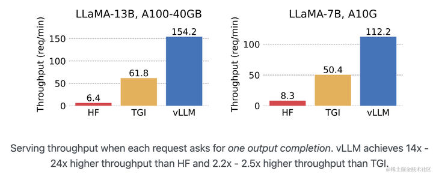
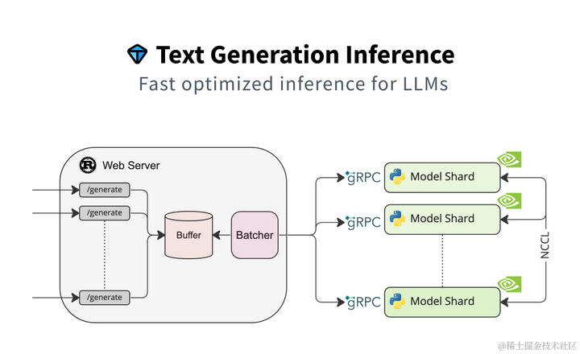
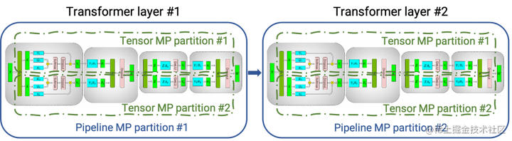
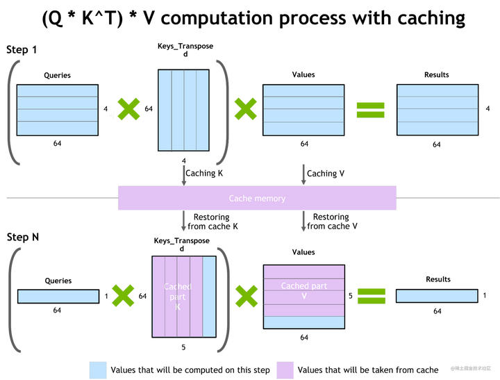
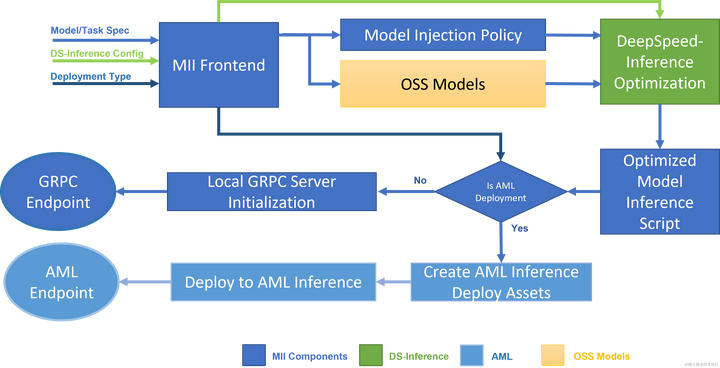
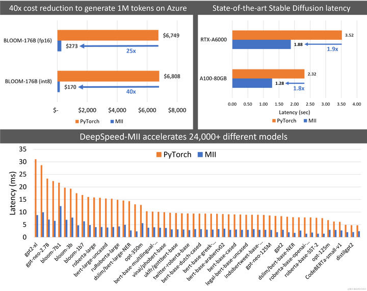
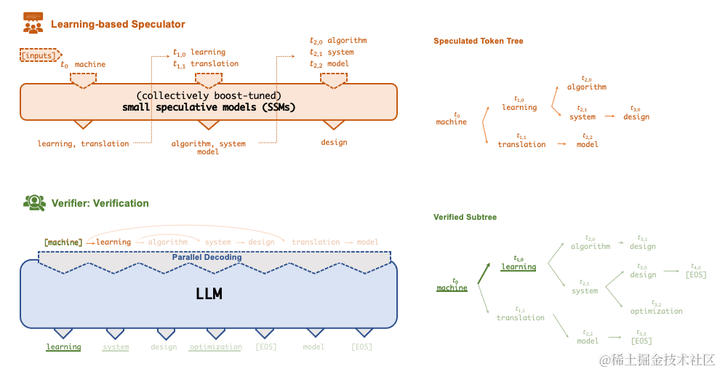
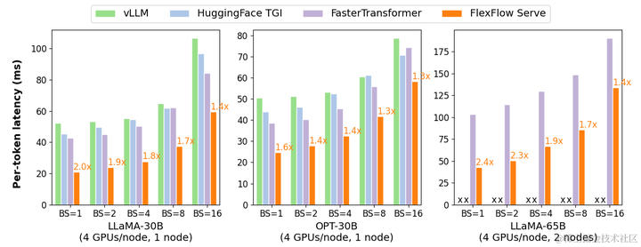
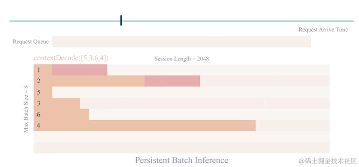
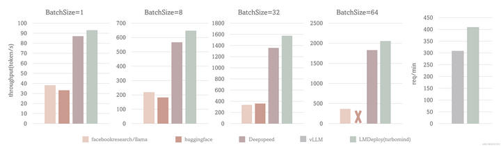

# 目前业界大模型推理框架很多，各有什么优缺点，应该如何选择&​
[目前业界大模型推理框架很多，各有什么优缺点，应该如何选择？](https://www.zhihu.com/question/625415776/answer/3243562246?utm_psn=1853250501627494400)

从 ChatGPT 面世以来，引领了大模型时代的变革，除了大模型遍地开花以外，承载大模型进行推理的框架也是层出不穷，大有百家争鸣的态势。本文主要针对业界知名度较高的一些大模型推理框架进行相应的概述。

**vLLM**
--------

*   GitHub: [https://github.com/vllm-project/vllm](https://link.zhihu.com/?target=https%3A//github.com/vllm-project/vllm)

### **简介**

vLLM是一个开源的大模型推理加速框架，通过PagedAttention高效地管理attention中缓存的张量，实现了比HuggingFace Transformers高14-24倍的吞吐量。

PagedAttention 是 vLLM 的核心技术，它解决了LLM服务中内存的瓶颈问题。传统的注意力算法在自回归解码过程中，需要将所有输入Token的注意力键和值张量存储在GPU内存中，以生成下一个Token。这些缓存的键和值张量通常被称为KV缓存。

### **主要特性**

*   通过PagedAttention对 KV Cache 的有效管理
*   传入请求的continus batching，而不是static batching
*   支持张量并行推理
*   支持流式输出
*   兼容 OpenAI 的接口服务
*   与 HuggingFace 模型无缝集成

### **与其他框架（HF、TGI）的性能对比**

vLLM 的吞吐量比 HF 高 14 - 24 倍，比 TGI 高 2.2 - 2.5 倍。

  
image.png

### **存在的问题**

*   同样的模型、参数和prompt条件下，vLLM推理和Huggingface推理结果不一致。具体请参考：[https://zhuanlan.zhihu.com/p/658780653](https://zhuanlan.zhihu.com/p/658780653)

### **业界案例**

vLLM 已经被用于 Chatbot Arena 和 Vicuna 大模型的服务后端。

**HuggingFace TGI**
-------------------

*   GitHub: [https://github.com/huggingface/text-generation-inference](https://link.zhihu.com/?target=https%3A//github.com/huggingface/text-generation-inference)

### **简介**

Text Generation Inference（TGI）是 HuggingFace 推出的一个项目，作为支持 HuggingFace Inference API 和 Hugging Chat 上的LLM 推理的工具，旨在支持大型语言模型的优化推理。

  
image.png

### **主要特性**

*   支持张量并行推理
*   支持传入请求 Continuous batching 以提高总吞吐量
*   使用 flash-attention 和 Paged Attention 在主流的模型架构上优化用于推理的 transformers 代码。**注意：并非所有模型都内置了对这些优化的支持**。
*   使用bitsandbytes(LLM.int8())和GPT-Q进行量化
*   内置服务评估，可以监控服务器负载并深入了解其性能
*   轻松运行自己的模型或使用任何 HuggingFace 仓库的模型
*   自定义提示生成：通过提供自定义提示来指导模型的输出，轻松生成文本
*   使用 Open Telemetry，Prometheus 指标进行分布式跟踪

### **支持的模型**

*   [BLOOM](https://link.zhihu.com/?target=https%3A//huggingface.co/bigscience/bloom)
*   [FLAN-T5](https://link.zhihu.com/?target=https%3A//huggingface.co/google/flan-t5-xxl)
*   [Galactica](https://link.zhihu.com/?target=https%3A//huggingface.co/facebook/galactica-120b)
*   [GPT-Neox](https://link.zhihu.com/?target=https%3A//huggingface.co/EleutherAI/gpt-neox-20b)
*   [Llama](https://link.zhihu.com/?target=https%3A//github.com/facebookresearch/llama)
*   [OPT](https://link.zhihu.com/?target=https%3A//huggingface.co/facebook/opt-66b)
*   [SantaCoder](https://link.zhihu.com/?target=https%3A//huggingface.co/bigcode/santacoder)
*   [Starcoder](https://link.zhihu.com/?target=https%3A//huggingface.co/bigcode/starcoder)
*   [Falcon 7B](https://link.zhihu.com/?target=https%3A//huggingface.co/tiiuae/falcon-7b)
*   [Falcon 40B](https://link.zhihu.com/?target=https%3A//huggingface.co/tiiuae/falcon-40b)
*   [MPT](https://link.zhihu.com/?target=https%3A//huggingface.co/mosaicml/mpt-30b)
*   [Llama V2](https://link.zhihu.com/?target=https%3A//huggingface.co/meta-llama)
*   [Code Llama](https://link.zhihu.com/?target=https%3A//huggingface.co/codellama)

### **适用场景**

依赖 HuggingFace 模型，并且不需要为核心模型增加多个adapter的场景。

**大家如果希望深度了解模型推理加速、模型推理引擎等，推荐深蓝学院最近刚出的深度学习模型推理加速项目实践课程，精选百度文心大模型ERNIE部署实践中的推理加速为例，详细讲解项目实践中常见推理加速方法与策略，培养真实推理加速任务中分析与拆解问题的能力，小班教学，专家讲师直播与录播结合授课，感兴趣的朋友可以看看。**

**FasterTransformer**
---------------------

*   GitHub: [https://github.com/NVIDIA/FasterTransformer](https://link.zhihu.com/?target=https%3A//github.com/NVIDIA/FasterTransformer)

### **简介**

[NVIDIA FasterTransformer (FT)](https://link.zhihu.com/?target=https%3A//github.com/NVIDIA/FasterTransformer/) 是一个用于实现基于Transformer的神经网络推理的加速引擎。它包含Transformer块的高度优化版本的实现，其中包含编码器和解码器部分。使用此模块，您可以运行编码器-解码器架构模型（如：T5）、仅编码器架构模型（如：BERT）和仅解码器架构模型（如： GPT）的推理。

FT框架是用C++/CUDA编写的，依赖于高度优化的 cuBLAS、cuBLASLt 和 cuSPARSELt 库，这使您可以在 GPU 上进行快速的 Transformer 推理。

与 NVIDIA TensorRT 等其他编译器相比，FT 的最大特点是它支持以分布式方式进行 Transformer [大模型推理](https://zhida.zhihu.com/search?content_id=619819381&content_type=Answer&match_order=3&q=%E5%A4%A7%E6%A8%A1%E5%9E%8B%E6%8E%A8%E7%90%86&zhida_source=entity)。

下图显示了如何使用张量并行 (TP) 和流水线并行 (PP) 技术将基于Transformer架构的神经网络拆分到多个 GPU 和节点上。

*   当每个张量被分成多个块时，就会发生张量并行，并且张量的每个块都可以放置在单独的 GPU 上。在计算过程中，每个块在不同的 GPU 上单独并行处理；最后，可以通过组合来自多个 GPU 的结果来计算最终张量。
*   当模型被深度拆分，并将不同的完整层放置到不同的 GPU/节点上时，就会发生流水线并行。

  
image.png

在底层，节点间或节点内通信依赖于 MPI 、 NVIDIA NCCL、Gloo等。因此，使用FasterTransformer，您可以在多个 GPU 上以张量并行运行大型Transformer，以减少计算延迟。同时，TP 和 PP 可以结合在一起，在多 GPU 节点环境中运行具有数十亿、数万亿个参数的大型 Transformer 模型。

除了使用 C ++ 作为后端部署，FasterTransformer 还集成了 TensorFlow（使用 [TensorFlow op](https://zhida.zhihu.com/search?content_id=619819381&content_type=Answer&match_order=1&q=TensorFlow+op&zhida_source=entity)）、PyTorch （使用 Pytorch op）和 Triton 作为后端框架进行部署。当前，TensorFlow op 仅支持单 GPU，而 PyTorch op 和 Triton 后端都支持多 GPU 和多节点。

### **FasterTransformer 中的优化技术**

与深度学习训练的通用框架相比，FT 使您能够获得更快的推理流水线以及基于 Transformer 的神经网络具有更低的延迟和更高的吞吐量。 FT 对 GPT-3 和其他大型 Transformer 模型进行的一些优化技术包括：

1.  层融合（[Layer fusion](https://zhida.zhihu.com/search?content_id=619819381&content_type=Answer&match_order=1&q=Layer+fusion&zhida_source=entity)）

这是预处理阶段的一组技术，将多层神经网络组合成一个单一的神经网络，将使用一个单一的核（kernel）进行计算。 这种技术减少了数据传输并增加了数学密度，从而加速了推理阶段的计算。 例如， multi-head attention 块中的所有操作都可以合并到一个核（kernel）中。

1.  自回归模型的推理优化(激活缓存)

为了防止通过Transformer重新计算每个新 token 生成器的先前的key和value，FT 分配了一个缓冲区来在每一步存储它们。

虽然需要一些额外的内存使用，但 FT 可以节省重新计算的成本。该过程如下图所示，相同的缓存机制用于 NN 的多个部分。

  
image.png

1.  内存优化

与 BERT 等传统模型不同，大型 Transformer 模型具有多达数万亿个参数，占用数百 GB 存储空间。即使我们以半精度存储模型，GPT-3 175b 也需要 350 GB。因此有必要减少其他部分的内存使用。

例如，在 FasterTransformer 中，我们在不同的解码器层重用了激活/输出的内存缓冲（buffer）。由于 GPT-3 中的层数为 96，因此我们只需要 1/96 的内存量用于激活。

1.  使用 MPI 和 NCCL 实现节点间/节点内通信并支持模型并行

FasterTransormer 同时提供张量并行和流水线并行。 对于张量并行，FasterTransformer 遵循了 [Megatron](https://link.zhihu.com/?target=https%3A//arxiv.org/pdf/1909.08053.pdf) 的思想。 对于自注意力块和前馈网络块，FT 按行拆分第一个矩阵的权重，并按列拆分第二个矩阵的权重。 通过优化，FT 可以将每个 Transformer 块的归约（reduction）操作减少到两次。

对于流水线并行，FasterTransformer 将整批请求拆分为多个微批，隐藏了通信的空泡（bubble）。 FasterTransformer 会针对不同情况自动调整微批量大小。

1.  MatMul 核自动调整（GEMM 自动调整）

矩阵乘法是基于 Transformer 的神经网络中最主要和繁重的操作。 FT 使用来自 CuBLAS 和 CuTLASS 库的功能来执行这些类型的操作。 重要的是要知道 MatMul 操作可以在“硬件”级别使用不同的底层（low-level）算法以数十种不同的方式执行。

[GemmBatchedEx](https://link.zhihu.com/?target=https%3A//docs.nvidia.com/cuda/cublas/index.html%23cublas-GemmBatchedEx) 函数实现了 MatMul 操作，并以cublasGemmAlgo\_t作为输入参数。 使用此参数，您可以选择不同的底层算法进行操作。

FasterTransformer 库使用此参数对所有底层算法进行实时基准测试，并为模型的参数和您的输入数据（注意层的大小、注意头的数量、隐藏层的大小）选择最佳的一个。 此外，FT 对网络的某些部分使用硬件加速的底层函数，例如： \_\_expf、\_\_shfl\_xor\_sync。

1.  低精度推理

FT 的核（kernels）支持使用 fp16 和 int8 等低精度输入数据进行推理。 由于较少的数据传输量和所需的内存，这两种机制都会加速。 同时，int8 和 fp16 计算可以在特殊硬件上执行，例如：Tensor Core（适用于从 Volta 开始的所有 GPU 架构）。

除此之外还有**快速的 C++ BeamSearch 实现**、当模型的权重部分分配到八个 GPU 之间时，**针对 TensorParallelism 8 模式优化的 all-reduce**。

### **支持的模型**

目前，FT 支持了 Megatron-LM GPT-3、GPT-J、BERT、ViT、Swin Transformer、Longformer、T5 和 XLNet 等模型。您可以在 GitHub 上的 \*\*[FasterTransformer](https://link.zhihu.com/?target=https%3A//github.com/NVIDIA/FasterTransformer%23support-matrix)\*\*库中查看最新的支持矩阵。

### **与其他框架（PyTorch）的性能对比**

FT 适用于计算能力 >= 7.0 的 GPU，例如: V100、A10、A100 等。

下图展示了 GPT-J 6B 参数的模型推断加速比较：

  
image.png

### **存在的问题**

*   英伟达新推出了TensorRT-LLM，相对来说更加易用，后续FasterTransformer将不再为维护了。

**DeepSpeed-MII**
-----------------

*   GitHub: [https://github.com/microsoft/DeepSpeed-MII](https://link.zhihu.com/?target=https%3A//github.com/microsoft/DeepSpeed-MII)

### **简介**

DeepSpeed-MII 是 DeepSpeed 的一个新的开源 Python 库，旨在使模型不仅低延迟和低成本推理，而且还易于访问。

*   MII 提供了对数千种广泛使用的深度学习模型的高度优化实现。
*   与原始PyTorch实现相比，MII 支持的模型可显著降低延迟和成本。
*   为了实现低延迟/低成本推理，MII 利用 DeepSpeed-Inference 的一系列广泛优化，例如：transformers 的深度融合、用于多 GPU 推理的自动张量切片、使用 ZeroQuant 进行动态量化等。
*   MII 只需几行代码即可通过 AML 在本地和 Azure 上低成本部署这些模型。

### **MII 工作流程**

下图显示了 MII 如何使用 DS-Inference 自动优化 OSS 模型；然后，使用 GRPC 在本地部署，或使用 AML Inference 在 Microsoft Azure 上部署。

  
image.png

MII 的底层由 DeepSpeed-Inference 提供支持。 根据模型类型、模型大小、批量大小和可用硬件资源，MII 自动应用 DeepSpeed-Inference 中的一组适当的系统优化，以最大限度地减少延迟并最大限度地提高吞吐量。它通过使用许多预先指定的模型注入策略之一来实现这一点，该策略允许 MII 和 DeepSpeed-Inference 识别底层 PyTorch 模型架构并用优化的实现替换它。在此过程中，MII 使 DeepSpeed-Inference 中一系列的优化自动可用于其支持的数千种流行模型。

### **支持的模型和任务**

MII 目前支持超过 50,000 个模型，涵盖文本生成、问答、文本分类等一系列任务。 MII 加速的模型可通过 Hugging Face、FairSeq、EluetherAI 等多个开源模型存储库获取。我们支持基于 Bert、Roberta 或 GPT 架构的稠密模型，参数范围从几亿参数到数百亿参数。除此之外，MII将继续扩展该列表，支持即将推出的大规模千亿级以上参数稠密和稀疏模型。

目前 MII 支持以下 HuggingFace Transformers 模型系列：

model family

size range

~model count

llama

7B - 65B

1,500

bloom

0.3B - 176B

480

stable-diffusion

1.1B

3,700

opt

0.1B - 66B

460

gpt\_neox

1.3B - 20B

850

gptj

1.4B - 6B

420

gpt\_neo

0.1B - 2.7B

700

gpt2

0.3B - 1.5B

11,900

xlm-roberta

0.1B - 0.3B

4,100

roberta

0.1B - 0.3B

8,700

distilbert

0.1B - 0.3B

4,700

bert

0.1B - 0.3B

23,600

### **与其他框架（PyTorch）的性能对比**

MII 将 Big-Science Bloom 176B 模型的延迟降低了 5.7 倍，同时将成本降低了 40 倍以上。同样,它将部署 Stable Diffusion 的延迟和成本降低了 1.9 倍。

  
image.png

**FlexFlow Server**
-------------------

*   GitHub: [https://github.com/flexflow/FlexFlow/tree/inference](https://link.zhihu.com/?target=https%3A//github.com/flexflow/FlexFlow/tree/inference)

### **简介**

FlexFlow Serve 是一个开源编译器和分布式系统，用于低延迟、高性能 LLM 服务。

### **主要特征**

### **投机（Speculative） 推理**

使 FlexFlow Serve 能够加速 LLM 服务的一项关键技术是Speculative推理，它结合了各种集体boost-tuned的小型投机模型 (SSM) 来共同预测 LLM 的输出；

预测被组织为token树，每个节点代表一个候选 token 序列。 使用一种新颖的基于树的并行解码机制，根据 LLM 的输出并行验证由 token 树表示的所有候选 token 序列的正确性。

FlexFlow Serve 使用 LLM 作为 token 树验证器而不是增量解码器，这大大减少了服务生成 LLM 的端到端推理延迟和计算要求，同时，可证明保持模型质量。

  
image.png

### **CPU Offloading**

FlexFlow Serve 还提供基于Offloading的推理，用于在单个 GPU 上运行大型模型（例如：llama-7B）。

CPU Offloading是将张量保存在CPU内存中，并且在计算时仅将张量复制到GPU。

> 注意： 现在我们有选择地offload最大的权重张量（线性、注意力中的权重张量）。 此外，由于小模型占用的空间要少得多，如果不构成GPU内存瓶颈，offload会带来更多的运行空间和计算成本，因此，我们只对大模型进行offload。 可以通过启用 -offload 和 -offload-reserve-space-size 标志来运行offloading。

### **支持量化**

FlexFlow Serve 支持 int4 和 int8 量化。 压缩后的张量存储在CPU端， 一旦复制到 GPU，这些张量就会进行解压缩并转换回其原始精度。

### **支持的 LLMs 和 SSMs**

FlexFlow Serve 当前支持以下模型架构的所有Hugingface模型：

*   LlamaForCausalLM / LLaMAForCausalLM (例如：LLaMA/LLaMA-2, Guanaco, Vicuna, Alpaca, ...)
*   OPTForCausalLM (OPT家族模型)
*   RWForCausalLM (Falcon家族模型)
*   GPTBigCodeForCausalLM (Starcoder家族模型)

以下是我们已经测试过并且可以使用 SSM 的模型列表：

模型

在 HuggingFace 中的模型 id

Boost-tuned SSMs

LLaMA-7B

decapoda-research/llama-7b-hf

LLaMA-68M , LLaMA-160M

LLaMA-13B

decapoda-research/llama-13b-hf

LLaMA-68M , LLaMA-160M

LLaMA-30B

decapoda-research/llama-30b-hf

LLaMA-68M , LLaMA-160M

LLaMA-65B

decapoda-research/llama-65b-hf

LLaMA-68M , LLaMA-160M

LLaMA-2-7B

meta-llama/Llama-2-7b-hf

LLaMA-68M , LLaMA-160M

LLaMA-2-13B

meta-llama/Llama-2-13b-hf

LLaMA-68M , LLaMA-160M

LLaMA-2-70B

meta-llama/Llama-2-70b-hf

LLaMA-68M , LLaMA-160M

OPT-6.7B

facebook/opt-6.7b

OPT-125M

OPT-13B

facebook/opt-13b

OPT-125M

OPT-30B

facebook/opt-30b

OPT-125M

OPT-66B

facebook/opt-66b

OPT-125M

Falcon-7B

tiiuae/falcon-7b

Falcon-40B

tiiuae/falcon-40b

StarCoder-15.5B

bigcode/starcoder

### **与其他框架（vLLM、TGI、FasterTransformer）的性能对比**

FlexFlow Serve 在单节点多 GPU 推理方面比现有系统高 1.3-2.0 倍，在多节点多 GPU 推理方面比现有系统高 1.4-2.4 倍。

  
image.png

### **提示数据集**

FlexFlow 提供了五个用于评估 FlexFlow Serve 的提示数据集：

*   Chatbot 指令提示：[https://specinfer.s3.us-east-2.amazonaws.com/prompts/chatbot.json](https://link.zhihu.com/?target=https%3A//specinfer.s3.us-east-2.amazonaws.com/prompts/chatbot.json)
*   ChatGPT 提示：[https://specinfer.s3.us-east-2.amazonaws.com/prompts/chatgpt.json](https://link.zhihu.com/?target=https%3A//specinfer.s3.us-east-2.amazonaws.com/prompts/chatgpt.json)
*   WebQA：[https://specinfer.s3.us-east-2.amazonaws.com/prompts/webqa.json](https://link.zhihu.com/?target=https%3A//specinfer.s3.us-east-2.amazonaws.com/prompts/webqa.json)
*   Alpaca：[https://specinfer.s3.us-east-2.amazonaws.com/prompts/alpaca.json](https://link.zhihu.com/?target=https%3A//specinfer.s3.us-east-2.amazonaws.com/prompts/alpaca.json)
*   PIQA：[https://specinfer.s3.us-east-2.amazonaws.com/prompts/piqa.json](https://link.zhihu.com/?target=https%3A//specinfer.s3.us-east-2.amazonaws.com/prompts/piqa.json)

### **未来的规划**

FlexFlow Serve 正在积极开发中，主要专注于以下任务：

*   AMD 基准测试。目前正在积极致力于在 AMD GPU 上对 FlexFlow Serve 进行基准测试，并将其与 NVIDIA GPU 上的性能进行比较。
*   Chatbot prompt 模板和多轮对话
*   支持 FastAPI
*   与LangChain集成进行文档问答

**LMDeploy**
------------

*   GitHub: [https://github.com/InternLM/lmdeploy](https://link.zhihu.com/?target=https%3A//github.com/InternLM/lmdeploy)

### **简介**

LMDeploy 由 [MMDeploy](https://link.zhihu.com/?target=https%3A//github.com/open-mmlab/mmdeploy) 和 [MMRazor](https://link.zhihu.com/?target=https%3A//github.com/open-mmlab/mmrazor) 团队联合开发，是涵盖了 LLM 任务的全套轻量化、部署和服务解决方案。 这个强大的工具箱提供以下核心功能：

*   **高效推理引擎 TurboMind**：基于 \*\*[FasterTransformer](https://link.zhihu.com/?target=https%3A//github.com/NVIDIA/FasterTransformer)\*\*推理引擎，实现了高效推理引擎 TurboMind，支持 InternLM、LLaMA、vicuna等模型在 NVIDIA GPU 上的推理。
*   **交互推理方式**：通过缓存多轮对话过程中 attention 的 k/v，记住对话历史，从而避免重复处理历史会话。
*   **多 GPU 部署和量化**：提供了全面的模型部署和量化（支持使用AWQ算法对模型权重进行 INT4 量化，支持 KV Cache INT8 量化）支持，已在不同规模上完成验证。
*   **persistent batch 推理**：进一步优化模型执行效率。
*   支持张量并行推理（注意：量化部署时不支持进行张量并行）

  
image.png

### **支持的模型**

LMDeploy 支持 TurboMind 和 Pytorch 两种推理后端。

**TurboMind**

> **注意：** W4A16 推理需要 Ampere 及以上架构的 Nvidia GPU

模型

模型并行

FP16

KV INT8

W4A16

W8A8

Llama

Yes

Yes

Yes

Yes

No

Llama2

Yes

Yes

Yes

Yes

No

InternLM-7B

Yes

Yes

Yes

Yes

No

InternLM-20B

Yes

Yes

Yes

Yes

No

QWen-7B

Yes

Yes

Yes

No

No

Baichuan-7B

Yes

Yes

Yes

Yes

No

Baichuan2-7B

Yes

Yes

No

No

No

Code Llama

Yes

Yes

No

No

No

**Pytorch**

模型

模型并行

FP16

KV INT8

W4A16

W8A8

Llama

Yes

Yes

No

No

No

Llama2

Yes

Yes

No

No

No

InternLM-7B

Yes

Yes

No

No

No

### **与其他框架（HF、DeepSpeed、vLLM）的性能对比**

**场景一**: 固定的输入、输出token数（1,2048），测试 output token throughput

**场景二**: 使用真实数据，测试 request throughput

测试配置：LLaMA-7B, NVIDIA A100(80G)

TurboMind 的 output token throughput 超过 2000 token/s, 整体比 DeepSpeed 提升约 5% - 15%，比 huggingface transformers 提升 2.3 倍 在 request throughput 指标上，TurboMind 的效率比 vLLM 高 30%。

  
image.png

**结语**
------

总而言之，大模型推理框架的核心目标都是为了降低延迟；同时，尽可能地提升吞吐量；从上面的框架中可以看到，每个框架各有优缺点，但是目前来看，还没有一个LLM推理框架有一统天下的态势，大家都在加速迭代。

> 作者：吃果冻不吐果冻皮  
> 链接：[https://www.zhihu.com/question/625415776/answer/3243562246](https://www.zhihu.com/question/625415776/answer/3243562246)