# LLM时代，数据为王，19个开源数据集下载网站汇总
* * *

created: 2025-01-24T00:20 updated: 2025-01-26T02:14
---------------------------------------------------

大模型时代，数据为王，在哪里寻找开源数据集，是一个比较头疼的问题。经过调研整理，下面列出了目前可以寻找开源大模型数据集的网站清单。

1、HuggingFace开源数据集

链接：[https://huggingface.co/datasets](https://huggingface.co/datasets)

镜像：[https://hf-mirror.com/datasets](https://hf-mirror.com/datasets)

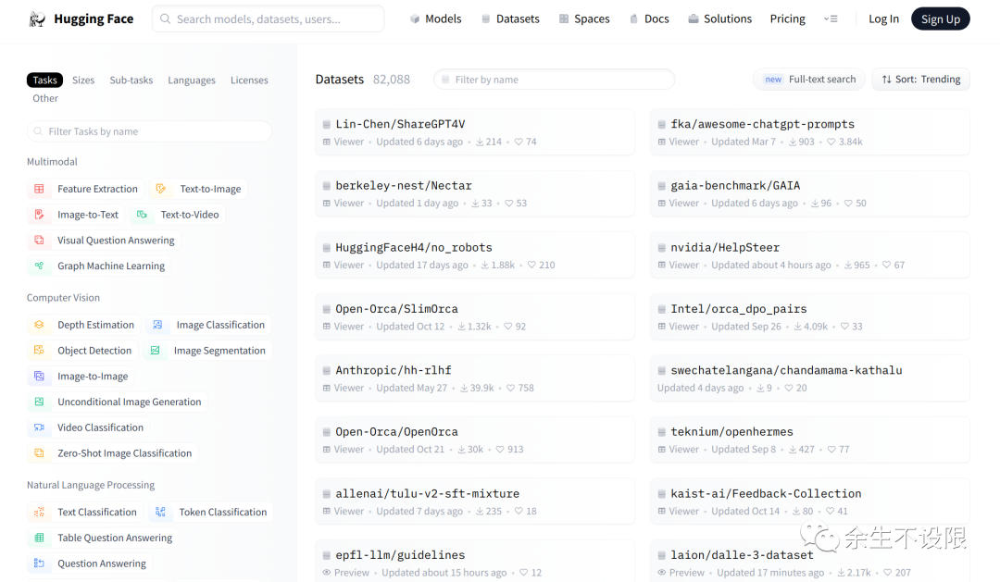

2、OpenDataLab开源数据集

链接：[https://opendatalab.com/](https://opendatalab.com/)

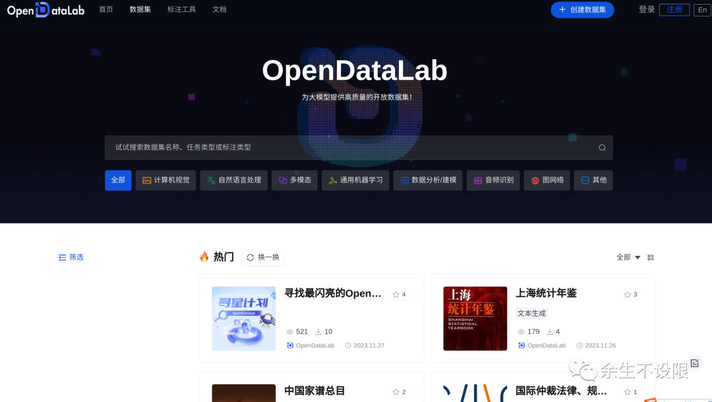

3、AWS亚马逊开源数据集

链接：[https://registry.opendata.aws/](https://registry.opendata.aws/)

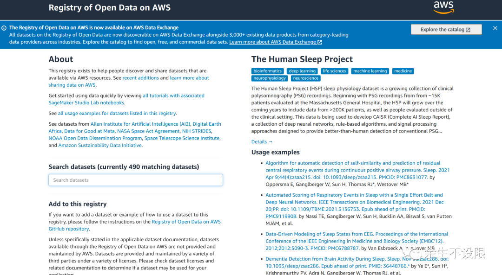

4、微软开源数据集

链接：[https://www.microsoft.com/en-us/research/tools/](https://www.microsoft.com/en-us/research/tools/)

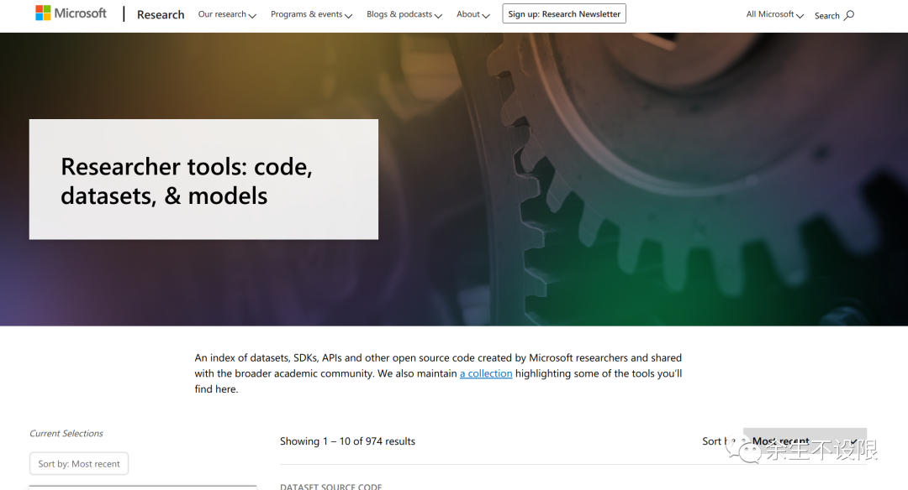

5、谷歌开源数据集

链接：[https://datasetsearch.research.google.com/](https://datasetsearch.research.google.com/)

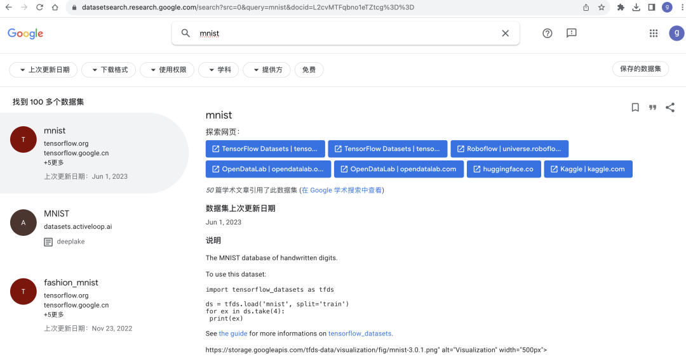

6、GitHub开源数据集

链接：[https://github.com/awesomedata/awesome-public-datasets](https://github.com/awesomedata/awesome-public-datasets)

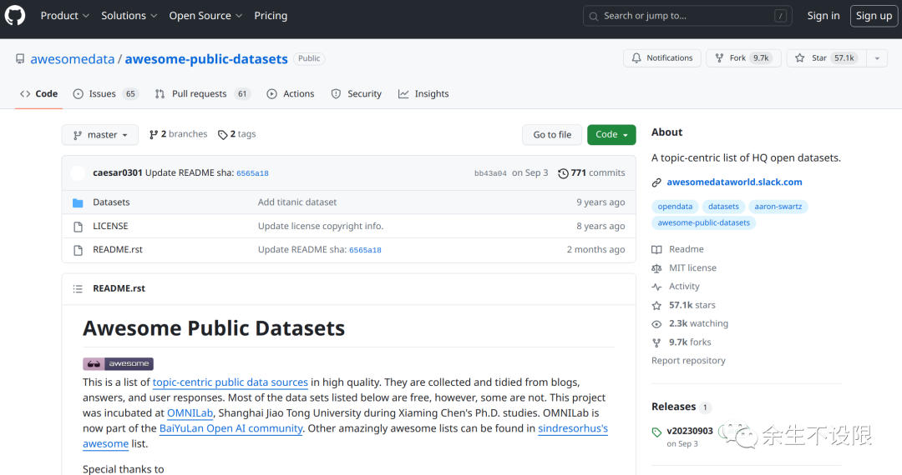

7、ModelScope开源数据集

链接：[https://modelscope.cn/datasets](https://modelscope.cn/datasets)

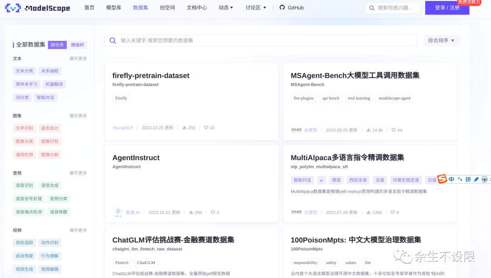

8、LUGE千言开源数据集

链接：[https://www.luge.ai/](https://www.luge.ai/)

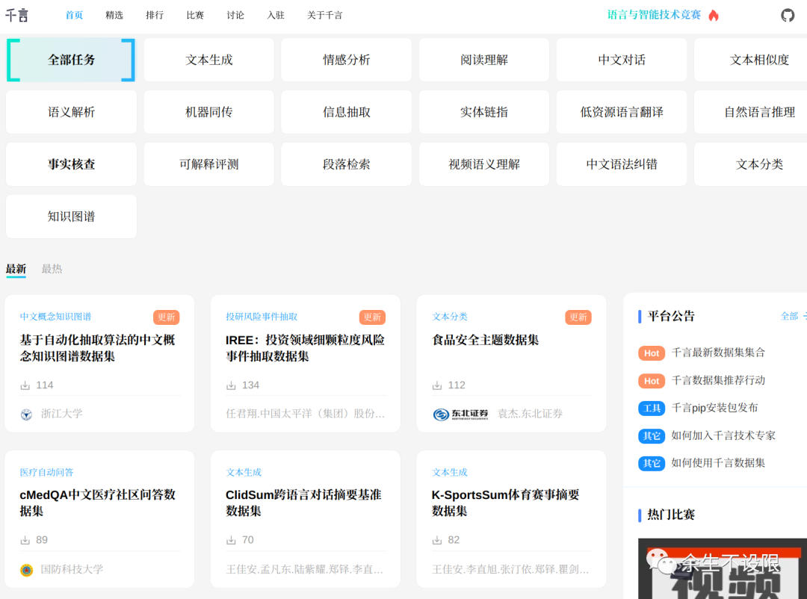

9、TIANCHI天池开源数据集

链接：[https://tianchi.aliyun.com/dataset/](https://tianchi.aliyun.com/dataset/)

10、kaggle开源数据集

链接：[https://www.kaggle.com/datasets](https://www.kaggle.com/datasets)

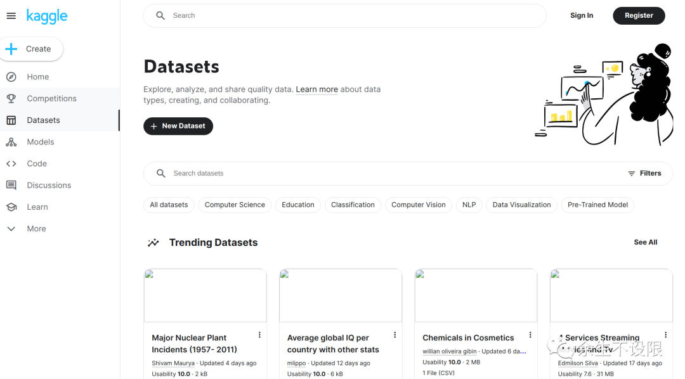

11、UCI开源数据集

链接：[https://archive.ics.uci.edu/datasets](https://archive.ics.uci.edu/datasets)

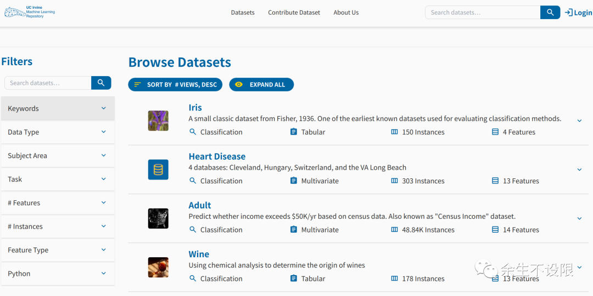

12、计算机视觉开源数据集

链接：[https://visualdata.io/discovery](https://visualdata.io/discovery)

13、Dataju聚数力开源数据集

链接：[http://dataju.cn/Dataju/web/home](http://dataju.cn/Dataju/web/home)

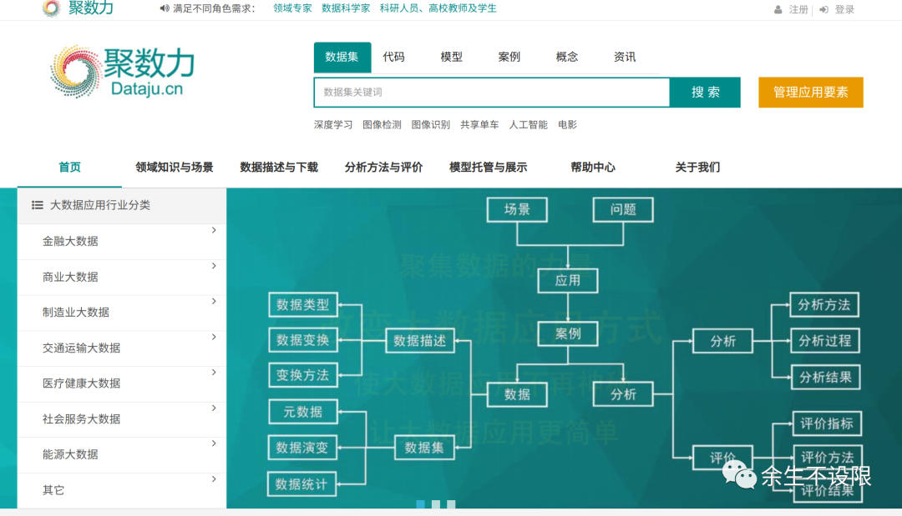

14、Hyper超神经开源数据集

链接：[https://hyper.ai/datasets](https://hyper.ai/datasets)

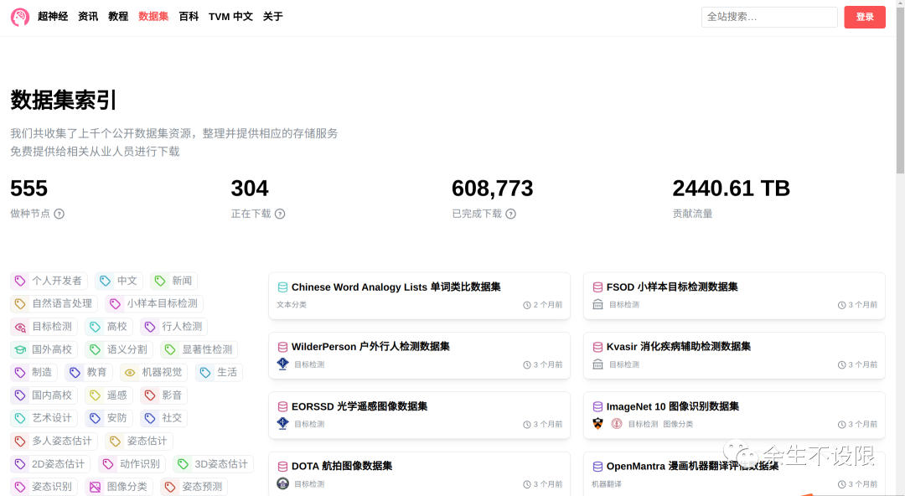

15、BAAI开源数据集

链接：[https://data.baai.ac.cn/data](https://data.baai.ac.cn/data)

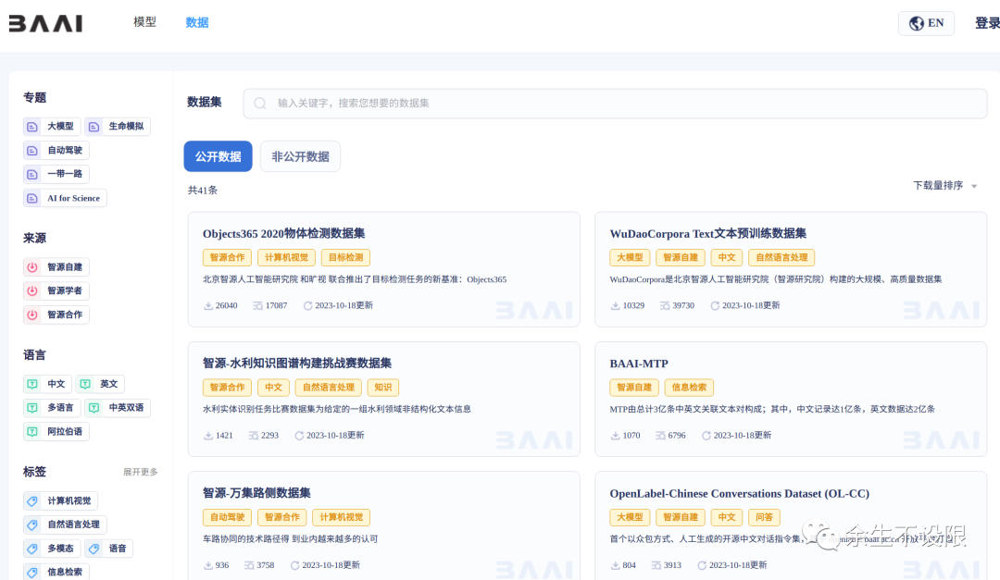

16、百度飞桨开源数据集

链接：[https://aistudio.baidu.com/datasetoverview](https://aistudio.baidu.com/datasetoverview)

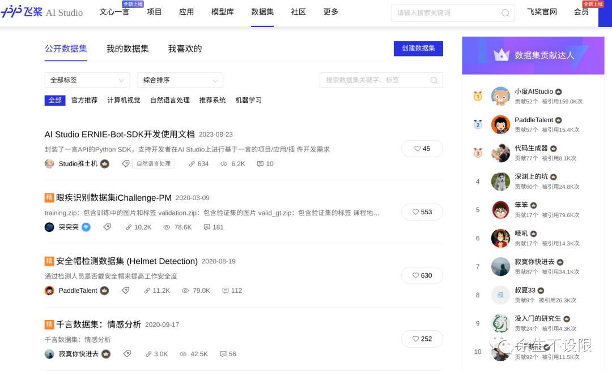

17、payititi帕衣提提开源数据集

链接：[https://www.payititi.com/opendatasets/](https://www.payititi.com/opendatasets/)

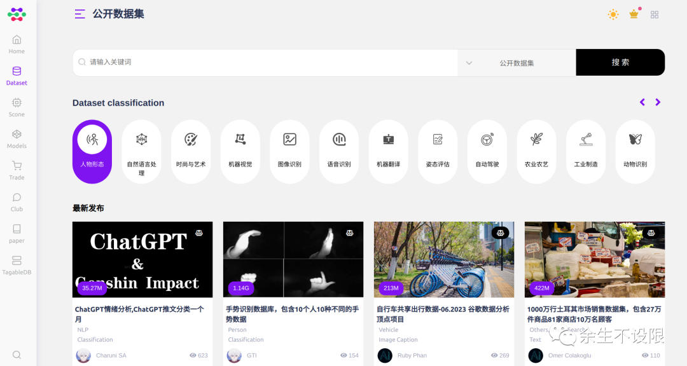

18、启智开源数据集

链接：[https://openi.pcl.ac.cn/explore/datasets](https://openi.pcl.ac.cn/explore/datasets)

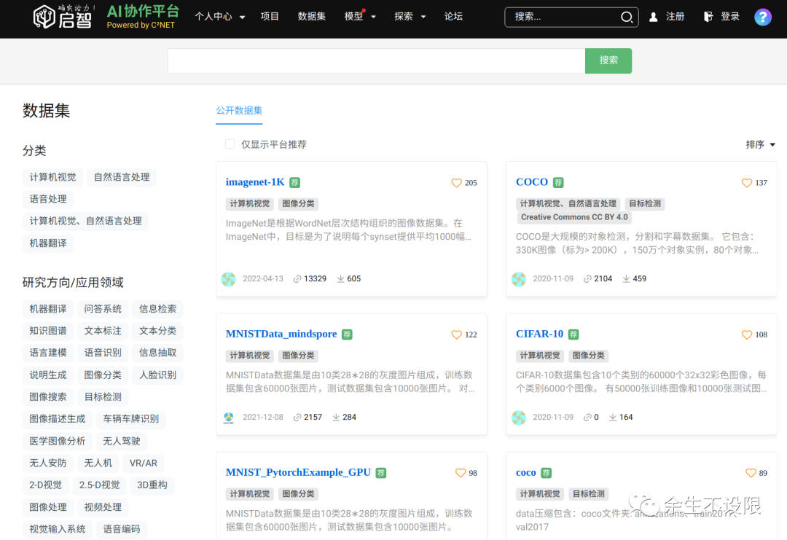

19、和鲸开源数据集

链接：[https://www.heywhale.com/home/dataset](https://www.heywhale.com/home/dataset)

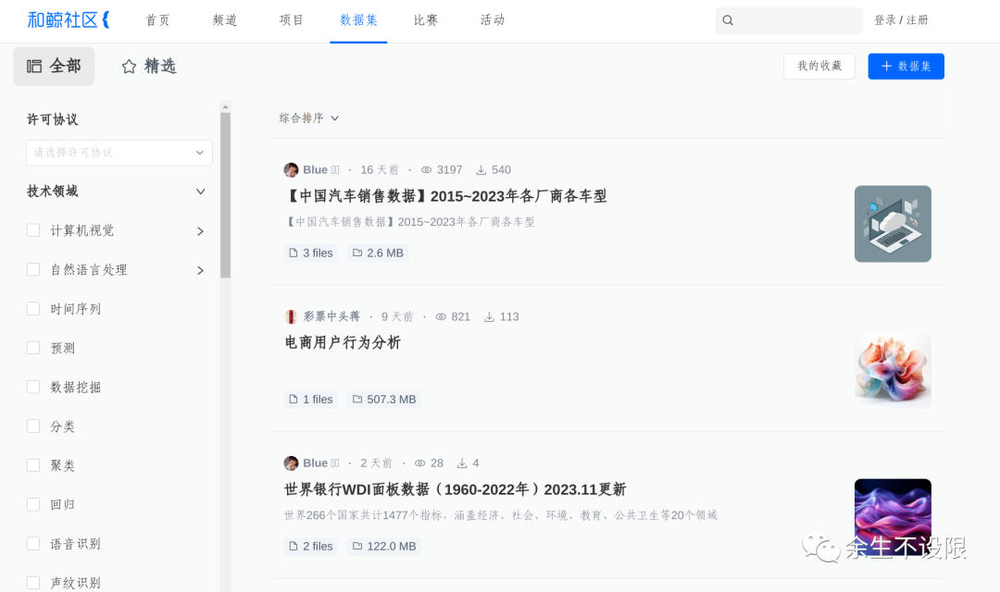

希望以上开源数据集网站清单，能对您训练大模型有所帮助，持续关注开源数据集，为持续大模型输送语料。