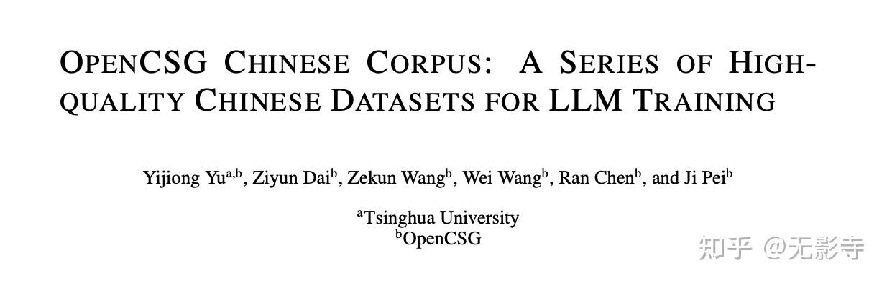
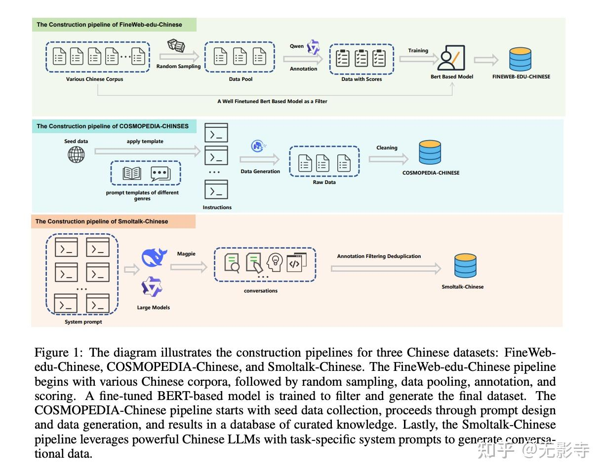
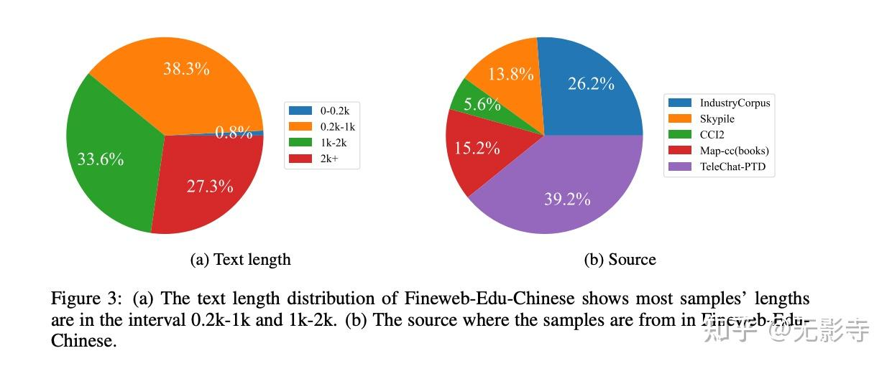
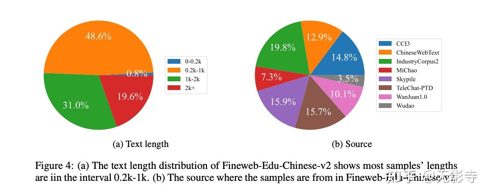
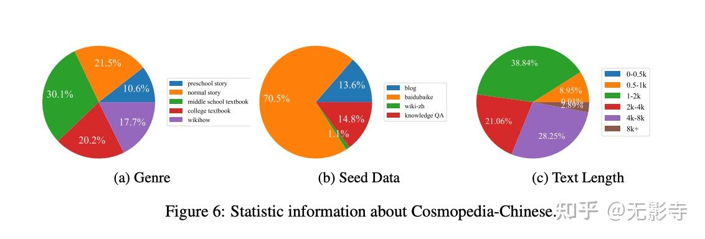

# OpenCSG：为中文大模型打造的高质量开源语料库
* * *

created: 2025-01-27T15:22 updated: 2025-01-27T15:23
---------------------------------------------------

> _**作者: 无影寺**_ _**原文: [https://zhuanlan.zhihu.com/p/19343039843](https://zhuanlan.zhihu.com/p/19343039843)**_

**问题：中文大模型的最大瓶颈是什么？**  
尽管中文[大语言模型](https://zhida.zhihu.com/search?content_id=252891172&content_type=Article&match_order=1&q=%E5%A4%A7%E8%AF%AD%E8%A8%80%E6%A8%A1%E5%9E%8B&zhida_source=entity)（LLMs）如Qwen2、GLM等已经取得显著成就，但它们的成功离不开高质量的训练数据。然而，目前中文语料的开源资源极为匮乏，存在标注成本高、版权复杂、覆盖面不足等问题。这种限制不仅阻碍了模型性能的进一步提升，也拖慢了中文NLP领域的社区化进程。

**解决方案：四大数据集，助力中文大模型**  
OpenCSG项目提出了四个高质量中文数据集：  
**Fineweb-edu-chinese**和**Fineweb-edu-chinese-v2**：从多样化的中文网络资源中筛选出高教育价值的文本，v1包含约90M样本，v2扩展至180M样本，重点提升文本的清晰度和完整性。  
**Cosmopedia-chinese**：合成的类教科书数据，生成结构化、知识密集型内容，用于模型的知识强化。  
**Smoltalk-chinese**：通过高级中文LLMs生成多轮对话数据，强调对用户指令的对齐与风格多样性，避免人工采集的对话风格单一问题。  
这些数据集结合了自动评分、合成文本生成与领域特定筛选，确保了[可扩展性](https://zhida.zhihu.com/search?content_id=252891172&content_type=Article&match_order=1&q=%E5%8F%AF%E6%89%A9%E5%B1%95%E6%80%A7&zhida_source=entity)、数据多样性以及高质量标准的平衡。

**效果：[数据质量](https://zhida.zhihu.com/search?content_id=252891172&content_type=Article&match_order=1&q=%E6%95%B0%E6%8D%AE%E8%B4%A8%E9%87%8F&zhida_source=entity)如何提升模型表现？**  
实验表明，这些数据集显著提升了中文大模型的性能：  
**Fineweb-edu-chinese**在C-Eval等基准任务中表现优异，大幅提高了模型的下游任务能力。  
**Cosmopedia-chinese**虽然在基准任务上的提升有限，但生成了高度一致且知识丰富的内容，展现了合成数据的潜力。  
**Smoltalk-chinese**在用户指令对齐和多样性对话任务中表现突出，为对话式模型开发提供了强有力的支持。

1.  **意义：开源语料推动中文NLP发展**

OpenCSG不仅为中文大模型提供了多样化、高质量的语料，也解决了成本高昂、版权复杂的难题，推动了中文NLP的开源[生态建设](https://zhida.zhihu.com/search?content_id=252891172&content_type=Article&match_order=1&q=%E7%94%9F%E6%80%81%E5%BB%BA%E8%AE%BE&zhida_source=entity)。尽管项目仍有改进空间，例如优化合成数据的真实感和评价指标的多样性，但这套[语料库](https://zhida.zhihu.com/search?content_id=252891172&content_type=Article&match_order=1&q=%E8%AF%AD%E6%96%99%E5%BA%93&zhida_source=entity)已经为中文LLMs的开发奠定了坚实基础，助力下一代[智能应用](https://zhida.zhihu.com/search?content_id=252891172&content_type=Article&match_order=1&q=%E6%99%BA%E8%83%BD%E5%BA%94%E7%94%A8&zhida_source=entity)的发展。

**总结：中文大模型的未来不再受限于数据匮乏，OpenCSG让开源语料成为发展的加速器！**

论文标题：OPENCSG CHINESE CORPUS: A SERIES OF HIGHQUALITY CHINESE DATASETS FOR LLM TRAINING

论文链接：[https://arxiv.org/pdf/2501.0819](https://link.zhihu.com/?target=https%3A//arxiv.org/pdf/2501.08197)