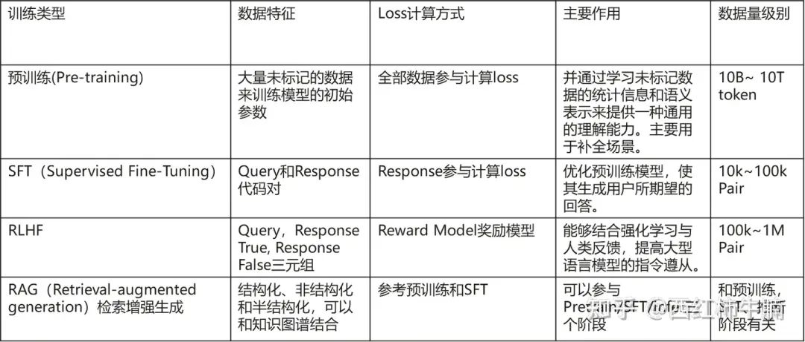

# 研发大模型的血液--万字长文详谈数据工程
> **作者: 吃果冻不吃果冻皮**
> 
> **原文:** [**https://mp.weixin.qq.com/s/izePeavfxezfEkkPzgMmjQ**](https://mp.weixin.qq.com/s/izePeavfxezfEkkPzgMmjQ)

最近1年研究大模型，有个很不好的现象，大家都认为做大模型，认为只要喂数据就行，甭管数据噪声。CV计算机视觉时代，需要人工标注每一个图片，分类检测分割，标注数据都需要97%以上准确率；有多少智能就需要多少人工。计算机视觉的鼻祖李飞飞，就是靠人工标注ImageNet 300M数据集，才走进大众视野。

数据在大型语言模型（LLM）的训练中起着基础性作用。在预训练和监督微调阶段，有效的数据管理对于增强模型性能和提高训练效率具有重要意义。23年的实践表明，即使最强大的模型，没有领域知识的协同，也根本无法上生产。本文依据相关论文和研发实际设计-开发-测试-知识QA case整理，\*\*期望在澄清通用数据处理方法的基础上，快速聚焦研发场景特定任务需要的数据采集、处理、数据集&知识库的构建。\*\*尝试回答针对研发具体的场景任务：基础模型能否完成任务？需要什么数据？/ 数据从哪里来？/ 增量训练 还是 SFT，还是知识库？/ 如何构造训练数据集、检索知识库？/推理时能否用这些数据/如何管理这些数据…

知识密集型领域使用通用大模型，主要三个核心方法：

1、 \*\*Domain-Adaptive Pre-Training (DAPT) \*\*of foundation models with domain-adapted tokenizers，基础模型的领域自适应预训练，即Continue PreTraining，增量预训练。这一阶段需要使用或者增加领域token。参考论文Don’t Stop Pretraining: Adapt Language Models to Domains and Tasks

2、 \*\*Supervised Fine-Tuning，\*\*model alignment using general and domain-specific instructions，使用通用和领域特定指令进行模型对齐

3、 \*\*retrieval-augmented generation (RAG) \*\*with a trained domain-adapted retrieval model，使用训练有素的领域自适应检索模型的检索增强生成

研发大模型数据工程
---------

我们可将**狭义研发大模型数据工程**定义为：依据研发场景与任务，采集相关研发数据，生成模型预训练语料或者微调数据集。实质上在增量预训练、SFT、RAG、Prompt都要应用数据，如何处理和应用这些数据，可以定义为**广义研发大模型数据工程**。这些数据是什么，是研发资产，是作业用的RawData、是工程规范积累等等。

参考：**A Survey of Knowledge-Enhanced Pre-trained**以及**A Comprehensive Survey on Instruction Following**。\*\*研发数据工程核心诉求是能处理所有风格的研发资产（文本、图像、知识图谱、数据库..），将形成预训练语料或者指令微调数据集。并针对不同的资产格式（文本、KG、Rules..）或者研发场景任务（编码、UT、检视..）设计详细的训练数据以及分层知识库。\*\*管理框架参考：

Pretraining预训练阶段
----------------

预训练为 LLM 的能力奠定了基础。通过在大规模语料库上进行预训练，LLM 可以获得基本的语言理解和生成能力。预数据用有通用文本和专用文本。

通用文本包含：

1、 网页，如CommonCrawl，数据量大，使得 LLM 能够获得多样化的语言知识并增强 LLM 的泛化能力

2、 对话文本，如公共对话语料，对话数据可以**增强 LLM 的对话能力 ，改善 LLM 在问答任务上的表现**

3、 书集，如Books3，提供更正式的文本，**语言知识建模长期依赖关系以及连贯文本能力**

专用文本包括：

1、 多语言文本：整合多语言语料库，能够增强多语言的生成和理解能力

2、 科学文本：如论文、教材，使能LLM在科学和推理任务中取得良好性能

3、 代码：显著提升代码编写能力，且可能是复杂推理能力CoT的来源

收集大量文本数据后，对数据进行预处理，特别是消除噪声、冗余、无关和潜在有害的数据 \[56, 59\]，对于构建预训练 语料库是必不可少的，因为这些数据可能会极大地影响 LLM 的能力和性能。预处理 LLM 的预训 练数据的典型流程：

1、 质量过滤：删除收集到的语料库中的低质量数据，可以通过设置规则过滤

2、 去重：重复数据降低语言模型的多样性，从而影响模型想，应该在不同层级上去重

3、 隐私去除：敏感或个人信息的用户生成内容，可能增加隐私泄露分析，需要从语料库中删除个人信息

4、 分词：用于将文本分解为词或子词的组合，使机器更好地理解和分析文本。

A Survey of Large Language Models 总结了大型语言模型（LLMs）准备预训练数据的一般程序和关键点

1、 Data collection数据收集。预训练数据中包括多样化的数据来源。典型的方法是同时结合各种高质量文本，如代码、书籍、科学论文等。**如果LLM专注于某种特定技能，相应数据来源的比例应该相应增加。**

2、 Data cleaning数据清洗。在数据收集之后，清洗原始语料库以尽可能提高其质量至关重要。首先，去重是现有工作中常见的做法。其次，应该在不同粒度（如文档、段落或句子）上去除低质量文本、有毒内容和涉及隐私问题的数据。第三，使用清洗后的数据，可以进一步统一或指定预训练数据的格式，并在过滤和去重的语料库上训练分词器进行分词。

3、 Data scheduling数据调度。在预处理数据之后，下一步是确定预训练LLMs的数据混合和具体的数据顺序。为了确定这两个设置，一个实际的方法是先使用多个候选计划训练几个小型语言模型，然后在它们之间选择一个好的计划。

**吃果冻不吐果冻皮**

致力于分享AI前沿技术（如：LLM/MLOps/RAG/智能体）、AI工程落地实践、AI基建（如：算力、网络、存储）等。

165篇原创内容

公众号

continual pre-training阶段，清洗领域语料
-------------------------------

预训练(pre-train)的语料与下游任务(finetune)语料的【数据分布/领域差异】大时，需要继续预训练（领域增强预训练or增量预训练）。领域差距的本质，还是数据问题。token/word/n-gram的不同以及其出现的上下文的不同造成的。例如：现在你的任务是从法律文件中做NER任务，但你使用的模型为普通的bert-base-chinese，那么如果想要达到一个下游任务上更好的效果，你最好使用大量的法律领域语料来继续预训练从而得到一个适应法律领域的预训练模型。

领域预训练，包括数据设计（挖掘领域和领域任务数据）、训练方法设计（挖掘领域词汇）、数据增强等。Don't Stop Pretraining Adapt Language Models to Domains and Task表明，进行第二阶段预训练（领域自适应预训练, domain-adaptive pretraining or DAPT）可以带来性能提升。此外，适应任务的无标签数据（任务自适应预训练，task-adaptive pretraining, or TAPT）在领域自适应预训练之后也能提高性能。

多个预训练的文章提到了分词的重要：在适配预训练的分词器时，主要目标是提高特定领域数据的Token效率，同时在通用数据集上保持效率和语言模型性能，并尽量减少重新训练/微调的工作量。为了实现这一目标，ChipNeMo一个四步方法：

• 步骤 1：使用特定领域数据从头开始训练一个标记器。

• 步骤 2：从新分词器的词汇表中，识别出在通用目的分词器中缺失且在通用数据集中很少出现的Token。

• 步骤 3：使用步骤 2 中新识别的Token扩展通用目的分词器。

• 步骤 4：利用通用目的分词器初始化新Token的嵌入

Lawyer LLaMA: Enhancing LLMs with Legal Knowledge中提到的**领域预训练语料包括：从中国法院网站收集了包括判决书、法律文章、司法解释、法院新闻以及各种法律普及文章**。为了缓解常识的遗忘 ,从悟道 Corpora CLUE Corpus 中抽取了中文文本 , 以及从 C4 中抽取的英文文本 , 用于基于情节生成文本。

ChipNeMo: Domain-Adapted LLMs for Chip Design,用到的领域训练语料为NVID内部数据,包含了各种与芯片设计相关的文本来源 ,包括设计、验证、基础设施以及内部文档。

也有文献中提到了预训练阶段，使用微调数据或者基于领域任务特定的数据集进行训练，可以使用更少的数据获得较好的效果，匹配领域任务TAPT。

continual pre-training数据工程和预训练阶段类似。针对研发当前选择Pangu 38B（测试模型）、Code LIaMa 34B L0基础预训练模型，我们会依据L0评估结果：

1） 补充研发通用知识增量训练，TBD

2） 对于系统模型、检索模型，增加研发资产增量训练

微调阶段，构建指令格式
-----------

预训练后，LLM 可以获得解决各种任务的通用能力。越来越多的研究表明，LLM 的能力可以进一步适配到特定的任务。两种适配预训练后的LLM 的方法：指令微调（instruction tuning）和对齐微调（alignment tuning）。\*\*前一种方法旨在增强（或解锁） LLM 的能力，而后一种方法旨在将 LLM 的行为与人类的价值观或偏好对齐。\*\*本质上，指令微调首先需要收集或构建指令格式（instruction-formatted） 的实例。然后，使用这种格式的实例以有监督的方式微调 LLM。

通常情况下，一个指令格式的实例包括一个任务描述（称为指令）、一对输入-输出以及少量示例（可选）。作为重要的公共资源，现有大量开源的指令数据集（NLP task:P3,FLAN、chat: OpenAssistant、合成: Self-Instruct）。这些数据集具体的Dataset Structure参见Hugging Face。

**指令格式结构：**

Task description：XXX

Demonstrations：XXX （Optional）

Input：XXX， Output：XXX

指令实例的质量对模型的性能有重要影响。关注指令规模、指令格式设计。通常来说，可以向现有数据集的输 入-输出对添加任务描述和可选的示例，其中任务描述是 LLM 理解任务的最关键部分。此外，使用适当数量的示例作对模型可以产生实质性的改进，这也减轻了其对指令工程的敏感性 。将其他部分（例如：避免事项、原因和建议）添加到指令中对 LLM 的性能提升十分轻微。为了引出 LLM 的逐步推理能力，建议同时使用包含和不包含 CoT 的样本微调 LLM。

**Lawyer LLaMA: Enhancing LLMs with Legal Knowledge**中提到两种SFT。

1、 国家司法考试JE，将多选择题转为问答风格，采用了三种方法。JE-Q2EA（Question to Explanation+Answer）, JE-QA2E（Question+Answer to Explanation)） and JE-EXPERT（专家整理）。

2、 法律咨询：case专注于关于婚姻的问题 ,从一个开源的法律咨询 dataset 中抽取与婚姻相关的种子问题 , 然后要求 ChatGPT 扮演律师角色并生成回答。当生成回答时 ,ChatGPT 倾向于提供过时或根本不存在的法律文章 。为了提高生成回答的准确性 , 采用了一个法律文章检索组件 ,为给定的问题搜索相关的法律文章。前三个检索到的法律文章被附加到输入提示中 , 帮助 ChatGPT 生成更准确的回答。

**ChipNeMo: Domain-Adapted LLMs for Chip Design**，用到的领域训练语料为NVID内部数据,包含了各种与芯片设计相关的文本来源 ,包括设计、验证、基础设施以及内部文档。

1、 在监督微调 (SFT)过程中 , 使用了一个通用的聊天 SFT 指令数据集 ,该数据集可供商业用途。\*\*该数据集主要由包括 OASST, FLAN, P3 等公开的指令遵循数据集构成 , 以及一小部分涵盖各种主题的广泛领域的专有数据集 , 如头脑风暴 , 开放式问题回答 , 重写 ,总结等。\*\*需要注意的是 ,我们讨论的 SFT 指令数据主要针对通用自然语言任务 , 并且不包含与下游设计芯片的使用案例相关的任何信息或任务。总之 , 这个数据集包含了 128,000 个训练样本。

2、 此外 , 精心组装了一个针对下游使用案例(an engineering assistant chatbot, EDA tool script generation, and bug summarization and analysis.)对模型进行对齐的领域特定的指令数据集。这些示例由领域专家精心制作 , 并以单次问题和答案的形式进行格式化。表二展示了我们**领域特定指令数据集的数量**。值得一提的是 , 与大量的生成聊天指令数据相比 , 领域特定指令数据集中的训练样本数量相对较小。

RAG，事实知识处理
----------

总的来说通用大模型缺乏领域专业知识，且不实时。试验表明 , 即使模型在持续训练阶段反复学习领域文章 ,参考2.1 它在生成回应时也无法正确使用它们，可能会引用无关的文章，或者混淆术语。为了让模型生成更可靠的回应 ,我们将模型与检索模块结合使用。

Lawyer LLaMA: Enhancing LLMs with Legal Knowledge：收集用户的法律咨询问题 , 并请法律专业人员为每个问题标记最多 3 篇必要的法律文章以回答问题。**基于 RoBERTa训练了一个法律文章检索模型**。在保留集上该模型可以实现 0.543 的 Macro Recall@1 和 0.807的 Macro-Recall@3。

ChipNeMo: Domain-Adapted LLMs for Chip Design，幻觉特别影响工程助手聊天机器人的准确性，建议利用检索增强生成 (RAG) 方法。减轻幻觉的影响。文章认为\*\*使用针对特定领域的语言模型来进行 RAG, 可以显著提高我们领域特定问题的答案质量 , **通过使用适度数量的领域特定训练数据对检索模型进行微调 , 可以显着提高检索准确性**。\*\*领域适应 RAG实现图：检索模型为微调后的E5（EmbEddings from bidirEctional Encoder rEpresentations）

当前研发广泛使用RAG技术：

1、 **参与训练SFT DataSet 构建**，SFTV3格式已明确RAG参与SFT构建。

2、 **参与推理Prompt构建**，如相似代码、API等， PromptCenter已明确对接RAG

研发知识文档，大量的向量化研发资产，并对语言模型进行QA微调

推理阶段，数据参与Prompt Engineering
---------------------------

在预训练或适应性调整之后 , 使用 LLMs 的主要方法是为解决各种任务设计适合的提示策略（提示工程）。设计良好的提示对于揭示 LLMs 完成特定任务的能力非常有帮助，提示词设计的几个**原则**：清晰明确地表达任务目标、将任务分解为易懂的子任务、提供 few-shot、利用模型友好的格式。提示工程需要考虑**关键要素** 包括任务描述 , 输入数据 , 上下文信息、提示风格以及示例。

1、 任务描述。\*\*应该用自然语言清楚地描述任务目标。\*\*对于具有特殊输入或输出格式的任务 , 通常需要详细澄清 , 并可以利用关键字来突出显示特殊设置 , 以更好地指导 LLM 完成任务。

2、 输入数据。在大多数情况下 ,可以用自然语言描述输入数据 (例如 , 由 LLMs 回答的实例 ) 。对于特殊输入数据 ,如知识图谱和表格、数据库等结构化数据,需要采用适当且方便的方法API使它们对 LLMs 可读。

3、 上下文信息。除了任务描述和输入数据 ,上下文或背景信息对于特定任务也是必不可少的。例如 , retrieved documents 对于开放领域问题回答作为支持证据非常有用。**上下文任务描述对于引导 LLM 完成复杂任务也很有帮助 , 可以更好地描绘任务目标 , 特殊输出格式以及输入和输出之间的映射关系。**

4、 提示风格。对于不同的 LLM, 设计适合的提示风格以揭示它们解决特定任务的能力是很重要的。应该将提示表达为一个清晰的问题或详细的指令 ,可以被很好地理解和回答。在某些情况下 , 添加前缀或后缀可以更好地指导 LLMs 。例如 , 使用前缀“**让我们逐步思考**”可以帮助 LLMs 进行逐步推理 ,使用前缀“**你是这个任务 ( 或这个领域 ) 的专家**”可以提高 LLMs 在某些特定任务中的性能。

5、 示例：LLMs 可以从上下文学习中受益 , 以解决复杂任务 , 其中提示包含一小部分所需输入 - 输出对的任务示例 , 即少而精的演示。few-shot demonstrations 可以帮助 LLMs 学习输入与输出之间的语义映射 ,而无需参数调整。在实践中 ,建议为目标任务生成几个高质量的演示 , 这将极大地提升任务性能。

当前研发通过SFT在代码生成的一些场景，测试集命中率操过50%，但是放开给用户使用只有20%+，关键是高质量的Prompt工程，譬如如何传递代码逻辑关系、API调用等等。研发资产数据如何参与Prompt构建任务意图以及上下文是当前核心问题。

AI BOM，SBOM的扩展
--------------

将 SBOM 概念扩展到“AIBOMs”, 可以通过记录 AI 训练数据的源代码 , 模型架构 , 监控程序和其他 AI 特定元数据 , 提高透明度和风险评估。

Prompt\\RAG\\SFT协同策略
--------------------

需要明确的是Prompt（ICL）、微调和检索增强生成并非矛盾，它们可以同时使用，以利用每种方法的优点。Fine-tuning可以帮助通用语言模型适应特定任务，使其更加任务特定。检索增强生成（RAG）专注于通过检索机制将LLM与外部知识源连接起来。它将生成能力与从知识库中搜索并整合相关信息的能力相结合。RAG和微调的互补角色，提供了强大的协同作用，可以显著提高模型性能和可靠性。

虽然 rag 在提供访问动态外部数据源方面表现出色，并提供了响应生成的透明度，但微调添加了一层关键的适应性和精细的改进。没有微调，模型可能会继续犯同样的错误。微调通过使用领域特定和纠错数据来微调模型，使其能够纠正这些错误。

其他好处还包括学习所需的生成语气。依据业界的建议，以及23年的实践，**坚持作业数据-语料-数据集SFT/知识库RAG-应用解耦原则，依据任务场景特点综合使用，当前研发场景SFT/RAG建议策略：**

不完全参考文献：
--------

Lawyer LLaMA: Enhancing LLMs with Legal Knowledge

BloombergGPT: A Large Language Model for Finance

Biomedlm: a domain-specific large language model for biomedical text

SCIBERT: A Pretrained Language Model for Scientific Text

ChipNeMo: Domain-Adapted LLMs for Chip Design