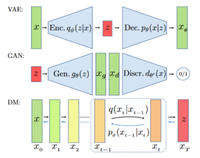

# 关于 MoE 大模型负载均衡策略演进的回顾：坑点与经验教训
> _**作者: 小天狼星不来客**_ 
> 
> _**原文:**_ [_**https://zhuanlan.zhihu.com/p/19117825360**_](https://zhuanlan.zhihu.com/p/19117825360)

故事要从 [GShard](https://zhida.zhihu.com/search?content_id=252846138&content_type=Article&match_order=1&q=GShard&zhida_source=entity) 说起——当时，人们意识到拥有数十亿甚至数万亿参数的模型可以通过某种形式的“[**稀疏化**](https://zhida.zhihu.com/search?content_id=252846138&content_type=Article&match_order=1&q=%E7%A8%80%E7%96%8F%E5%8C%96&zhida_source=entity)**（sparsified）**”来在保持高精度的同时加速训练。自那以后，我们见证了各种让人眼花缭乱的创新。本文将尝试把从 **GShard** 到 [**DeepSeek-V3**](https://zhida.zhihu.com/search?content_id=252846138&content_type=Article&match_order=1&q=DeepSeek-V3&zhida_source=entity) 这一系列关键方案串联起来，看看每一次迭代都给我们带来了什么改进，又踩过哪些坑，还有哪些重要问题尚未解决。

* * *

### 简介

### 为什么要用稀疏专家（Sparse MoE）？

先说点背景吧。[MoE 架构](https://zhida.zhihu.com/search?content_id=252846138&content_type=Article&match_order=1&q=MoE+%E6%9E%B6%E6%9E%84&zhida_source=entity)之所以瞬间火起来，是因为人们发现，你可以在不等比例增加计算开销（FLOPs）的前提下，让模型拥有极其庞大的参数量。核心思路在于：对每个 token，只激活少量的专家参与计算，而不是让所有参数统统上场。

但这种“只让部分专家工作”的做法，很快就暴露了一大问题：如果只把 token 分给几个专家，那怎么保证负载是均衡的？要是某个专家被一大堆 token 疯狂轰炸，而其他专家却闲得无聊怎么办？这就是[负载均衡](https://zhida.zhihu.com/search?content_id=252846138&content_type=Article&match_order=1&q=%E8%B4%9F%E8%BD%BD%E5%9D%87%E8%A1%A1&zhida_source=entity)的本质，也是 MoE 要大规模应用时必须解决的一道难题。

### 这篇博文要讨论些什么？

我会带着大家依次走过几个标志性的 MoE 系统，从 GShard（最早把大规模 MoE 推向主流的方案）一直到最新的 DeepSeek-V3。在过程中，我们也会顺带聊聊 [Switch Transformer](https://zhida.zhihu.com/search?content_id=252846138&content_type=Article&match_order=1&q=Switch+Transformer&zhida_source=entity)、GLaM 这些经典“选手”，重点剖析它们在负载均衡上遇过的坑和后来的改进思路。

如果你想获得一些实践层面的启发——没问题，我会尽量保持足够的学术严谨，让研究人员或资深从业者也能从中受益。也希望我这篇文章能写得有点意思，让你不会看几段就昏昏欲睡——毕竟这是篇博客，又不是考试题嘛！

### 我注意到的一些关键主题

1.  **路由方式**：top-2 gating、single-expert gating、top-K gating、correlation-aware gating……我们对 gating 的花式名词似乎永远都不嫌多。
2.  **辅助损失 (Auxiliary Loss)**：用来帮助专家均衡使用，但如果过于强势，也会让模型的性能受限。
3.  [**容量约束**](https://zhida.zhihu.com/search?content_id=252846138&content_type=Article&match_order=1&q=%E5%AE%B9%E9%87%8F%E7%BA%A6%E6%9D%9F&zhida_source=entity)**（Capacity Constraints）**：所谓“capacity factor”，其实就是“每个专家最多能接收多少 token，超了就丢”。
4.  **实现细节**：从“随机分配”到分层的 all-to-all 传输，[高性能计算](https://zhida.zhihu.com/search?content_id=252846138&content_type=Article&match_order=1&q=%E9%AB%98%E6%80%A7%E8%83%BD%E8%AE%A1%E7%AE%97&zhida_source=entity)（HPC）的那一套在这里特别重要。
5.  **可扩展性**：有时候我们要上千个专家，因此[分布式计算](https://zhida.zhihu.com/search?content_id=252846138&content_type=Article&match_order=1&q=%E5%88%86%E5%B8%83%E5%BC%8F%E8%AE%A1%E7%AE%97&zhida_source=entity)的开销非常值得关注。

* * *

### 历史脉络：从 GShard 到 Switch

### GShard：先锋之作

**GShard**（谷歌提出）通常被视为最早实现大规模超稀疏 MoE 的框架之一。它让人们真正意识到，只要把层和 token 智能拆分并均衡地分配给各个专家，训练几百亿甚至上千亿参数的模型是可以做到的。

GShard 的路由通常采用 **top-2** 的 gating 方式，即：

GATE(x)=Top2(Wgate⋅x)

其中 $x$ 是 token 的[嵌入向量](https://zhida.zhihu.com/search?content_id=252846138&content_type=Article&match_order=1&q=%E5%B5%8C%E5%85%A5%E5%90%91%E9%87%8F&zhida_source=entity)，$W\_{gate}$ 是路由器（router）的[权重矩阵](https://zhida.zhihu.com/search?content_id=252846138&content_type=Article&match_order=1&q=%E6%9D%83%E9%87%8D%E7%9F%A9%E9%98%B5&zhida_source=entity)。 只有排名前两名的专家会被激活。不过，为了防止某些专家超负荷，训练时一般会引入以下概念：

1.  [**专家容量**](https://zhida.zhihu.com/search?content_id=252846138&content_type=Article&match_order=1&q=%E4%B8%93%E5%AE%B6%E5%AE%B9%E9%87%8F&zhida_source=entity) **(Expert Capacity)**，约为 $C \\approx \\frac{2N}{E}$（如果共有 $N$ 个 token，$E$ 个专家）。一旦某个专家被分配的 token 超过了这个容量，就可能丢弃一些 token（或者在下一层再处理）。
2.  **辅助负载均衡损失 (Auxiliary Loss)**，形式通常如下：  
    Laux ∑e=1EfePe  
    其中 $f\_e$ 表示实际路由到专家 $e$ 的 token 比例，$P\_e$ 是专家 $e$ 的平均 gating 概率。这个损失会“鼓励”各专家负载更加均衡。
3.  **本地分组 (Local Groups)**：不是所有 token 都在全局竞争，而是先进行分组后再分配给专家。这样能缩小混乱程度。

**痛点**：没错，token 被丢弃肯定不是什么好事——如果超容量了，就只好忍痛割爱。而且 top-2 gating 在规模很大时会带来不小的通信和计算开销，再加上依赖辅助损失有时会让路由分布变得“人为”偏均匀，反而牺牲了一定的性能。不过，GShard 为后续所有的 MoE 研究铺好了路：它证明了稀疏专家是有价值的，还为后来的方案指明了“[容量因子](https://zhida.zhihu.com/search?content_id=252846138&content_type=Article&match_order=1&q=%E5%AE%B9%E9%87%8F%E5%9B%A0%E5%AD%90&zhida_source=entity)”这些关键概念的重要性。

### Switch Transformer：当“少就是多”

Switch Transformer 的思路很直接：“我们干脆只给每个 token 选一个专家得了。” 这样做一来简化了 gating 的逻辑（直接挑最高 logit 的专家），二来也极大降低了计算和通信负担。具体做法是：

gi(x)=softmax(Wrouter⋅x)i

然后我们选

expert\_index(x)=argmaxigi(x).

Switch Transformer 最重要的创新点在于它的 **单专家路由**：每个 token 只走一个专家，代码好写，训练速度也快得多。为了保持负载均衡，还是会用类似 GShard 的辅助损失，并且提出了一个 **capacity factor** 的概念：

C=CF×tokens per batchnumber of experts

这就告诉模型每个专家能接收多少 token，多的就要丢（或者用 residual 旁路继续传递）。

**利弊**：从直觉上讲，单专家路由能带来更高的速度，因为每个 token 只过一个 FFN，少了大把计算开销。但问题也很明显：要是 capacity factor 调不好，某些专家可能被疯狂挤爆，造成大量 token overflow，或者路由又太松导致浪费。Switch Transformer 让我们看到，哪怕是只用 top-1 gating，也能成功扩展大规模模型——只要你肯下功夫调好那些超参。它也把问题抛给了业界：到底选 top-K 里的哪个 “K”才最优？overflow 又怎么处理才好？

* * *

### 进一步改进与变体：GLaM、DeepSpeed-MoE、ST-MoE、[Mixtral](https://zhida.zhihu.com/search?content_id=252846138&content_type=Article&match_order=1&q=Mixtral&zhida_source=entity)

### GLaM：带着效率回归 Top-2

**GLaM**（Generalist Language Model）在 Switch Transformer 之后又把 **top-2 gating** 搬了回来，但增加了对 [**能耗效率**](https://zhida.zhihu.com/search?content_id=252846138&content_type=Article&match_order=1&q=%E8%83%BD%E8%80%97%E6%95%88%E7%8E%87&zhida_source=entity) 的关注，并声称他们只用了大约 GPT-3 训练能耗的三分之一，却在 [zero-shot](https://zhida.zhihu.com/search?content_id=252846138&content_type=Article&match_order=1&q=zero-shot&zhida_source=entity) 任务上表现更好。核心公式大概是：

y=∑i=12gi⋅Ei(x),

其中 $g\_i$ 是 gating 权重，$E\_i(x)$ 是被选中的两个专家输出。同样，GLaM 也采用了一个精心设计的辅助损失来鼓励专家负载更均衡，损失函数类似：

\\mathcal{L}_{\\text{aux}}=\\alpha \\cdot \\sum_{i=1}^E f\_i \\cdot p\_i,

并设置了一个容量约束：

C = \\frac{\\text{tokens per batch}}{\\text{number of experts}} \\cdot \\text{capacity factor}.

超出这个容量的 token 还是要被丢弃，通过 residual 路径让网络继续往后走。一般会把 capacity factor 设为 1.25，来兼顾效率和 overflow 问题。

**坑与经验**：GLaM 让大家看到，真正只激活一小部分参数，就能在算力和能耗上吊打类似 GPT-3 的 [dense 模型](https://zhida.zhihu.com/search?content_id=252846138&content_type=Article&match_order=1&q=dense+%E6%A8%A1%E5%9E%8B&zhida_source=entity)——这是一次在大规模模型的“能效”上非常耀眼的案例。但仍然需要提醒的是，如果真实数据分布不平衡，专家可能还是会出现负载不均，而 GLaM 也花了不少心思去调节 gating、capacity 等超参。

### DeepSpeed-MoE：主打[推理效率](https://zhida.zhihu.com/search?content_id=252846138&content_type=Article&match_order=1&q=%E6%8E%A8%E7%90%86%E6%95%88%E7%8E%87&zhida_source=entity)

**DeepSpeed-MoE**（由微软提出）算是将负载均衡做到了一个更成熟的层次，既解决了训练时如何把 token 分配给专家的问题，也兼顾了推理阶段如何让专家有效利用的挑战。它把之前很多 MoE 的坑都总结了，并提出一系列优化方案来应对。

**核心思路**：DeepSpeed-MoE 从 Switch Transformer 的 top-1 gating 出发，通过多专家并多[数据并行](https://zhida.zhihu.com/search?content_id=252846138&content_type=Article&match_order=1&q=%E6%95%B0%E6%8D%AE%E5%B9%B6%E8%A1%8C&zhida_source=entity)的设计，让负载尽可能均匀，避免任何一个专家“堵车”。辅助损失的形式一般是：

\\mathcal{L}_{aux} = \\alpha \\sum_{i=1}^E \\bigl| f\_i - \\frac{1}{E}\\bigr|,

用来鼓励各个专家的分配更加均匀。与之前最大的不同在于，它会 **动态重分配** 那些超容量的 token，而不是简单地丢弃。此外，它还提出了 [**Residual-MoE**](https://zhida.zhihu.com/search?content_id=252846138&content_type=Article&match_order=1&q=Residual-MoE&zhida_source=entity) 结构，把 dense MLP 的输出和专家输出相加，类似一种“微调”式的组合，以便即使是被选中较少的专家也能对最终输出作出贡献。

**跨 GPU 的负载均衡**：DeepSpeed-MoE 也关注到，不同层数可能拥有不同数量的专家，导致如果用统一的并行度会不灵活。它会 **动态调整并行度**，让每张 GPU 都刚好处理一个专家的负载。例如，有些层有 32 个专家，就用 32 路专家并行加 4 路数据并行；有些层有 128 个专家，就 128 路专家并行加 1 路数据并行。这样可以保证每张 GPU 不会因为专家数不同而分配不均。

**痛点与教训**：DeepSpeed-MoE 整体的负载均衡做得相当不错，但要调对 capacity factor、辅助损失权重、并行度这些仍然是一门学问，而且真实世界的文本分布通常并不均匀，如果不针对性地调参，也可能在某些场景里栽跟头。不过它一再强调，无论训练多么牛，推理时也要有一套负载均衡策略，否则延迟可能非常糟糕。

### ST-MoE：聚焦容量因子与路由器 Z-Loss

**ST-MoE (Stable and Transferable Mixture-of-Experts)** 在稀疏专家模型中迈出了稳定性和可迁移性的一大步。像 Switch Transformer 和 GLaM 其实都打下了基础，但 ST-MoE 进一步在一些老大难问题上做了提升，包括路由稳定性与[超参调优](https://zhida.zhihu.com/search?content_id=252846138&content_type=Article&match_order=1&q=%E8%B6%85%E5%8F%82%E8%B0%83%E4%BC%98&zhida_source=entity)等。

ST-MoE 有个亮点叫 **router z-loss**，主要是为了缓解训练过程中数值不稳定的问题。因为路由里的指数函数特别容易放大微小数值误差，[z-loss](https://zhida.zhihu.com/search?content_id=252846138&content_type=Article&match_order=2&q=z-loss&zhida_source=entity) 就是给那些过大的 logit 值加点惩罚：

\\mathcal{L}_z = \\frac{1}{B} \\sum_{i=1}^B(\\log\\sum\_{j=1}^N \\exp(x\_{ij}))^2

这样能够抑制极端数值，也往往能带来一点点精度增益。

**容量因子调优**：ST-MoE 还强调了 capacity factor 的重要性，用辅助损失来让 token 尽量平均分布。相比之前的方法，它在训练稳定性和模型质量上找到了更平衡的点。当然，这些改进背后依然离不开超参的精细调试。换句话说，ST-MoE 告诉我们，通过合理的设计，你既能得到相对稳定的训练过程，也能保住最终的性能。

### Mixtral 8x7B：时间局部性与专门的稀疏 [Kernel](https://zhida.zhihu.com/search?content_id=252846138&content_type=Article&match_order=1&q=Kernel&zhida_source=entity)

**Mixtral 8x7B** 是一个比较有意思的稀疏 MoE（SMoE）语言模型，针对负载均衡有一些独到见解。它还是用 **Top-2 gating**，每层 8 个专家，token 每次只用到其中两个专家，从而大大削减了激活的参数量（13B 级别，而不是像 Llama 2 70B 那样全部激活）。

**时间局部性**：Mixtral 在分析[路由模式](https://zhida.zhihu.com/search?content_id=252846138&content_type=Article&match_order=1&q=%E8%B7%AF%E7%94%B1%E6%A8%A1%E5%BC%8F&zhida_source=entity)时发现，token 在相邻位置往往会被分配给同样的专家——尤其在网络的深层。也就是同一个专家常常连续处理好几步的 token，这就会带来“高重复率”现象。这有利于减少专家负载的突发波动，但也可能导致专家被局部数据“霸占”，对分布多样的[数据集](https://zhida.zhihu.com/search?content_id=252846138&content_type=Article&match_order=1&q=%E6%95%B0%E6%8D%AE%E9%9B%86&zhida_source=entity)就需要留意一下。另外，它也采用类似 DeepSpeed-MoE 的 **动态重分配**：当某个专家容量满了，就把多余 token 分给其他忙得没那么厉害的专家。

**稀疏 Kernel 优化**：Mixtral 利用像 [Megablocks](https://zhida.zhihu.com/search?content_id=252846138&content_type=Article&match_order=1&q=Megablocks&zhida_source=entity) 这样专为稀疏计算优化的 [GPU kernel](https://zhida.zhihu.com/search?content_id=252846138&content_type=Article&match_order=1&q=GPU+kernel&zhida_source=entity)，让 token 分配更加高效。一边分配一边做并行处理，这需要在 GPU 的层面做好负载均衡，否则还是可能出现一些 GPU 过载的问题。

**经验**：Mixtral 强调，你需要了解数据集的“局部规律”，因为一旦数据分布换了（比如从新闻文本转到代码），它原先的路由模式就可能失效。要做大规模的 MoE，就得好好考虑数据特征和专家分配之间的关系。

* * *

### 新一代方案：OpenMoE、[DeepSeekMoE](https://zhida.zhihu.com/search?content_id=252846138&content_type=Article&match_order=1&q=DeepSeekMoE&zhida_source=entity)、JetMoE、DeepSeek-V3 等等

### OpenMoE：上下文无关的“专长化”与末端 Token 的“掉队”问题

OpenMoE 依旧遵循常见的 top-k gating + capacity constraints + 辅助负载损失这一整套，但它提出了两个在大规模训练中比较显著的现象：

*   **上下文无关的专长化（Context-Independent Specialization）**：专家可能只根据 token 的表面特征或 ID 来决定路由，而不是更深层的语义。
*   **末端 Token 掉队（Drop-Towards-the-End）**：在处理[长序列](https://zhida.zhihu.com/search?content_id=252846138&content_type=Article&match_order=1&q=%E9%95%BF%E5%BA%8F%E5%88%97&zhida_source=entity)时，如果前面 token 就把专家容量吃满了，那么后面的 token 更容易被丢弃。

OpenMoE 也是用 top-2 gating，用一个和 GShard、Switch 类似的负载均衡损失。还引入了 router loss 来惩罚过大的 logits，以稳定训练。和前辈们一样，它在容量因子和专家并行上做了细致的设计，但首次严肃讨论了序列末端被丢弃的问题，尤其在自回归结构里，后面 token 常常携带关键信息，如果被丢，性能就会打折。

**结论**：OpenMoE 提醒我们，如果你的任务特别依赖完整序列（例如指令跟随、对话系统），那就要小心这个末端 token 掉队的问题，而且要注意 gating 可能会学到一些“表面化”模式。

### DeepSeekMoE：细粒度专家与共享专家

在正式介绍最新版本 DeepSeek-V3 之前，我们先来看看 **DeepSeekMoE**。该方法的最大特点之一，是将每个专家切分为更细粒度的子专家（sub-experts），并引入一部分“共享专家”（shared experts）。这些共享专家在推理过程中总是被激活，不需要经过 gating 判断。这样做的目标是减少参数冗余，同时又保留足够的多样性，让子专家可以针对不同模式或特征进行专门化学习。

**细粒度专家拆分 (Fine-Grained Expert Segmentation)**  
DeepSeekMoE 提出了细粒度专家拆分的概念，以提升专家的专门化程度。具体而言，它将每个专家拆分成多个更小的单元，但总参数量和总体计算成本保持不变。如下所示：

h\_t^l = \\sum\_{i=1}^{mN} g\_{i,t} \\cdot \\text{FFN}\_i (u\_t^l) + u\_t^l,

其中，$mN$ 表示所有子专家（细粒度专家）的总数，$g\_{i,t}$ 是针对第 $i$ 个专家在第 $t$ 个 token 上的 gating 权值。路由机制会从所有细粒度专家中为每个 token 选出前 $mK$ 个得分最高的专家。

设想我们一共有 $mN$ 个子专家，其中一部分是“可路由的”（总数为 $N\_r = mN$），再加上 $N\_s$ 个“共享专家”。在第 $l$ 层，对于第 $t$ 个 token $u\_t^l$，计算公式如下：

h\_t^l = u\_t^l + \\sum\_{i=1}^{N\_s} \\text{FFN}_i^{(s)} (u\_t^l) + \\sum_{j=1}^{N\_r} g\_{j,t} \\cdot \\text{FFN}\_j^{(r)} (u\_t^l),

其中，$g\_{j,t}$ 是第 $j$ 个子专家在该 token 上的 gating 权值，通常从前 $K\_r$ 个得分最高的子专家中选出。

**两级负载均衡损失**  
为了防止路由塌缩（routing collapse）以及在计算分配上出现瓶颈，DeepSeekMoE 同时设计了专家级别 (expert-level) 和设备级别 (device-level) 的负载均衡损失。

1.  **专家级负载均衡损失 (Expert-Level Balance Loss)**  
    这部分损失用来保证在专家之间分配的均衡性： \\mathcal{L}_{\\text{ExpBal}} = \\alpha\_1 \\sum_{i=1}^{mN - K\_s} f\_i \\cdot P\_i, 其中，$f\_i$ 表示路由到专家 $i$ 的 token 占比，$P\_i$ 表示专家 $i$ 的平均路由概率（gating probability）。$\\alpha\_1$ 是损失系数。
2.  **设备级负载均衡损失 (Device-Level Balance Loss)**  
    这部分损失用来确保在不同 GPU 或设备之间的计算负载也是均衡的： \\mathcal{L}_{\\text{DevBal}} = \\alpha\_2 \\sum_{i=1}^D f'\_i \\cdot P'\_i, 这里，$D$ 表示设备数，$f'\_i$ 与 $P'\_i$ 分别表示设备 $i$ 上所占的平均 token 比例和平均路由概率。$\\alpha\_2$ 则是另一层的损失系数。

通过这种双重均衡损失设计，DeepSeekMoE 能在保证专家内部细粒度专长化的同时，尽量避免某些专家或某些设备被过度使用，进而减小路由不均带来的计算瓶颈。

### JetMoE：无 Token 丢弃的 MoE 与流水线并行

大多数 MoE 都会在超容量时丢 token，而 **JetMoE** 则提出“dropless”策略，保证所有 token 都能被处理：

1.  **Dropless MoE**：精心控制 gating，不让任何专家超过容量上限。
2.  **流水线并行 (Pipeline Parallelism)**：把每一层的专家都放在同一个设备上，分层排队处理，以此简化通信和分配逻辑。

JetMoE 仍然用 top-2 gating，负载均衡也离不开辅助损失和 z-loss 等手段。它借鉴 MegaBlocks 的做法，用块稀疏（block-sparse）的方式在 GPU 上实现“无丢弃”，不过实现起来也更复杂，需要随时管理各专家的接收量并进行动态调度。

**经验教训**：不丢 token 很理想，但实现门槛更高。尤其在大规模场景里，如何实时监控并重分配 token 不是个简单活儿。不过对那些对后续 token 极其敏感的任务（如问答系统、代码生成），dropless 模式确实很有吸引力。

### [Skywork-MoE](https://zhida.zhihu.com/search?content_id=252846138&content_type=Article&match_order=1&q=Skywork-MoE&zhida_source=entity)：gating logit 归一化 & 自适应辅助损失

**Skywork-MoE** 是一个 1460 亿参数、16 专家的大模型，建立在已有的 Skywork-13B dense 模型之上做的 MoE 化。它有两大特色来缓解专家不均衡问题：

1.  **gating logit 归一化**：在做 softmax 之前先做标准化，控制输出分布的“尖锐度”。
2.  **自适应辅助损失系数**：如果某层丢 token 太多，就自动调大该层的均衡惩罚；反之则调小。

它还是会加一个类似的均衡损失来避免路由塌缩，并在 gating 过程中针对 logits 做归一化处理，让模型更好地区分专家，同时又不会让[概率分布](https://zhida.zhihu.com/search?content_id=252846138&content_type=Article&match_order=1&q=%E6%A6%82%E7%8E%87%E5%88%86%E5%B8%83&zhida_source=entity)过度极端。

**痛点与收获**：不同层的负载问题可能不一样，一刀切的超参不一定好，所以 Skywork-MoE 那套自适应机制很有启发意义。但同样，如果归一化或辅助损失的力度没调好，依然可能造成路由极端或专家专长度不足。

* * *

### DeepSeek-V3：偏置加成与弱化辅助损失

终于说到 **DeepSeek-V3**。它是目前的前沿之作，主打“砍掉大的辅助损失，用更加直接的偏置调节 (bias-based) 来控制负载”。想深入了解负载均衡最前沿，DeepSeek-V3 是个很好的例子。

[**模型结构**](https://zhida.zhihu.com/search?content_id=252846138&content_type=Article&match_order=1&q=%E6%A8%A1%E5%9E%8B%E7%BB%93%E6%9E%84&zhida_source=entity)：DeepSeek-V3 延续了 DeepSeekMoE 在 FFN 结构上的思路，将专家拆分成更细粒度的子专家，并保留一些“共享专家”。对第 $t$ 个 token $u\_t^l$ 在第 $l$ 层的输出可写作：

h\_t^l = u\_t^l + \\sum\_{i=1}^{N\_s} \\text{FFN}_i^{(s)} (u\_t^l) + \\sum_{j=1}^{N\_r} g\_{j,t} \\cdot \\text{FFN}\_j^{(r)} (u\_t^l),

其中 $g\_{j,t}$ 来自对 token 与专家的亲和度 $s\_{i,t}$ 做 top-K 选择并归一化而得。

**无辅助损失的负载均衡策略**  
传统 MoE 通常为了防止专家负载过度不均，都会引入一个或多个辅助损失，而这些损失可能会与语言建模本身的目标相冲突。DeepSeek-V3 则提出了一种 **偏置 (bias) 调整策略**：给每个专家定义一个偏置项 $b\_i$，在路由打分时直接加到专家得分上：

g'_{i,t} = \\begin{cases} s_{i,t} + b\_i, & \\text{如果在TopK之内} \\ 0, & \\text{否则} \\end{cases}

如果某个专家频繁超载，就降低它的 $b\_i$，让它在后续分配中被选中的概率下降；如果某个专家很闲，就提高它的 $b\_i$ 让它更有机会接收 token。通过这种简单、直接的调整来实现负载均衡，而不是依赖强力的全局辅助损失。

**序列级别的辅助损失**  
DeepSeek-V3 并没有 100% 摒弃辅助损失。为了避免在同一个序列里出现极度不均衡的情况，它保留了一个序列级别的平衡损失，不过其权重相对较小：

\\mathcal{L}_{\\text{Bal}} = \\alpha \\sum_{i=1}^{N\_r} f\_i P\_i,

这里 $f\_i$ 表示在该序列里，专家 $i$ 被选中的 token 占比，$P\_i$ 表示专家 $i$ 的平均 gating 概率，$\\alpha$ 通常取一个比较小的值。

[**动态路由**](https://zhida.zhihu.com/search?content_id=252846138&content_type=Article&match_order=1&q=%E5%8A%A8%E6%80%81%E8%B7%AF%E7%94%B1&zhida_source=entity)**和节点上限**  
DeepSeek-V3 还进一步在并行体系中做了优化，提出 **node-limited** 路由方式，每个 token 最多只被送到 $M$ 个节点，每个节点再选择若干专家处理其子集，减少通信开销。这对在大规模 GPU 集群上的并行效率有显著帮助。

**风险与启示**：如果偏置更新速度 ($\\gamma$) 过大，负载会在不同专家之间来回猛跳，不利于模型收敛；要是过小，又跟不上数据分布的变化。不过总体而言，这比在主损失上附加大量均衡惩罚要“温和”得多，也不会过多干扰语言建模本身的学习目标。

* * *

### 趋势与总结

从 **GShard** 到 **DeepSeek-V3**，我们看到 **MoE 中的负载均衡** 已经从一个“小问题”变成了整个架构设计中至关重要的一环。GShard 引领了 top-2 gating 和容量约束；Switch Transformer 用 top-1 gating 打开了更大规模的可能性；GLaM 让我们见识了训练能耗可以大幅下降；DeepSpeed-MoE 则深入挖掘了训练和推理层面的负载平衡；ST-MoE 用 z-loss 改善了稳定性；Mixtral 看到了专家分配的时间局部性；等等……最后到一些更灵活的思路，如 **DeepSeek-V3** 依靠偏置更新替代沉重的辅助损失。

**核心教训**：想要完美的负载均衡几乎是不可能的——做得过火，语言模型主任务会受损；不做又浪费资源。未来的研究可能还会借助更多 HPC 技巧，也会出现更自动化、更自适应的 gating 机制，帮助我们在训练和推理阶段都实现高效、均衡的专家分配。

* * *

### 经历的坑和总结的教训

负载均衡在 MoE 里就是双刃剑：过度追求均衡会压制模型的表达能力；对均衡不管不顾又会浪费一半专家。下面是一些常见的坑和应对思路：

*   **路由塌缩 (Routing Collapse) 与过度专长化**  
    如果几个专家接收了大部分 token，就等于浪费了其它专家。轻度的辅助损失或偏置修正有助于防止塌缩。
*   **容量因子的调节**  
    设置太高，几乎不丢 token，但算力浪费会高；设置太低，token 大批被丢，严重影响训练效果。这里没有固定公式，必须结合数据分布反复实验。
*   **过度依赖辅助损失**  
    有些 MoE 架构重度依赖均衡损失，[最后的语言](https://zhida.zhihu.com/search?content_id=252846138&content_type=Article&match_order=1&q=%E6%9C%80%E5%90%8E%E7%9A%84%E8%AF%AD%E8%A8%80&zhida_source=entity)建模目标被削弱，导致专家学不到真正的专长。要拿捏好度。
*   **推理时的瓶颈**  
    训练时的负载均衡不一定能适配推理场景。一旦在推理中某些专家被频繁调用，会让延迟变高，所以需要类似[分层路由](https://zhida.zhihu.com/search?content_id=252846138&content_type=Article&match_order=1&q=%E5%88%86%E5%B1%82%E8%B7%AF%E7%94%B1&zhida_source=entity)、动态分组等技巧。
*   **领域迁移的挑战**  
    路由网络可能固化在某些训练数据模式上，如果应用场景的分布变了， gating 也可能变得不匹配，需要额外的微调或重新训练。

* * *

### 结语

从 **GShard** 到 **DeepSeek-V3**，我们不难发现负载均衡已经成为 MoE 模型能否取得成功的关键因素之一。GShard 提出了 top-2 gating 和容量限制的雏形；Switch 用 top-1 gating 证明了简单路由也能支撑大规模；GLaM 强调能效；DeepSpeed-MoE 则兼顾了训练和推理；ST-MoE 用 z-loss 解决稳定性；Mixtral 强调路由的时间局部性；OpenMoE 暴露了末端 token 掉队等问题；JetMoE 尝试 dropless；DeepSeekMoE 做了细粒度拆分和共享专家；最后，DeepSeek-V3 又带来了更“轻量级”的偏置调节策略。

**主要启示**：负载均衡永远在动态平衡——过度干预会损害模型本身的学习目标，完全无视则会出现专家闲置或拥堵。往后我们大概率会看到更多 HPC 技巧与更灵活的 gating 机制，以及更多针对推理部署的优化。MoE 研究还在不断前进，我对未来的发展方向也非常期待。

发布于 2025-01-18 12:05・IP 属地美国

### 内容所属专栏

\[

\]([https://www.zhihu.com/column/c\_1863920090791153664](https://www.zhihu.com/column/c_1863920090791153664))

\[
--

浅谈大语言模型

\]([https://www.zhihu.com/column/c\_1863920090791153664](https://www.zhihu.com/column/c_1863920090791153664))

学习大模型中的一些思考与感悟

订阅专栏

\[

LLM

\]([https://www.zhihu.com/topic/20660508](https://www.zhihu.com/topic/20660508))

\[

LLM（大型语言模型）

\]([https://www.zhihu.com/topic/26797383](https://www.zhihu.com/topic/26797383))

\[

混合专家模型

\]([https://www.zhihu.com/topic/29033870](https://www.zhihu.com/topic/29033870))

​赞同 46​​2 条评论

​分享

​喜欢​收藏​申请转载

​

赞同 46

​

分享

理性发言，友善互动

2 条评论

默认

最新

[欲壑难填](https://www.zhihu.com/people/e4a6e0437b2459c4b972574a1587833d)

知乎这个行内公式没法直接识别 md 语法![[捂脸]](3_关于 MoE 大模型负载均衡策略演进的回顾：坑点与经验教训_.jpg)

01-19 · 北京

​回复​喜欢

[小天狼星不来客](https://www.zhihu.com/people/b205a603e7a15ee2869a0f189f80313d)

作者

![[捂脸]](3_关于 MoE 大模型负载均衡策略演进的回顾：坑点与经验教训_.jpg)是的 我直接从个人博客上粘过来的，看到的时候人都傻了，一艘有五十多个行内公式，就懒得管了![[捂脸]](3_关于 MoE 大模型负载均衡策略演进的回顾：坑点与经验教训_.jpg) 各位看官将就看吧

01-19 · 美国

​回复​1

### 推荐阅读

\[

NeurIPS 2024｜单步生成：让扩散模型实现高速无损的内容生成
----------------------------------

齐国君

\]([https://zhuanlan.zhihu.com/p/7726186859)\%5B)

基于生成模型的复杂流体重建方法总结
-----------------

AI4Sc...发表于AI fo...

\]([https://zhuanlan.zhihu.com/p/687860273)\%5B)

基于Abaqus的DLOAD子程序实现移动载荷
-----------------------

有限元模型中，当载荷比较复杂时，难以通过ABAQUS/CAE界面直接进行设置，这时候就需要使用DLOAD子程序。在工程实际应用中，经常会遇到移动载荷的例子，如车辙实验，汽车过桥等。本案例介绍…

技术邻发表于技术邻CA...

\]([https://zhuanlan.zhihu.com/p/265912386)\%5B)

扩散模型优化笔记
--------

目前diffusion类模型主要有如下几类优化思路 使用更好的solver，减少采样步数(e.g DPM-Solver可以10-20步生成高质量图像; Latent Consistency Model可以1-4步)利用模型压缩的方法(比如pruni…

陈star

\]([https://zhuanlan.zhihu.com/p/719869904](https://zhuanlan.zhihu.com/p/719869904))