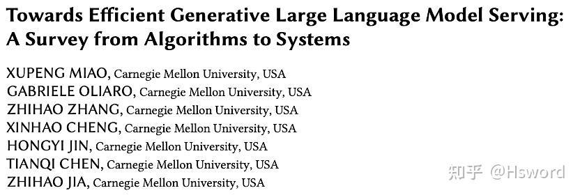
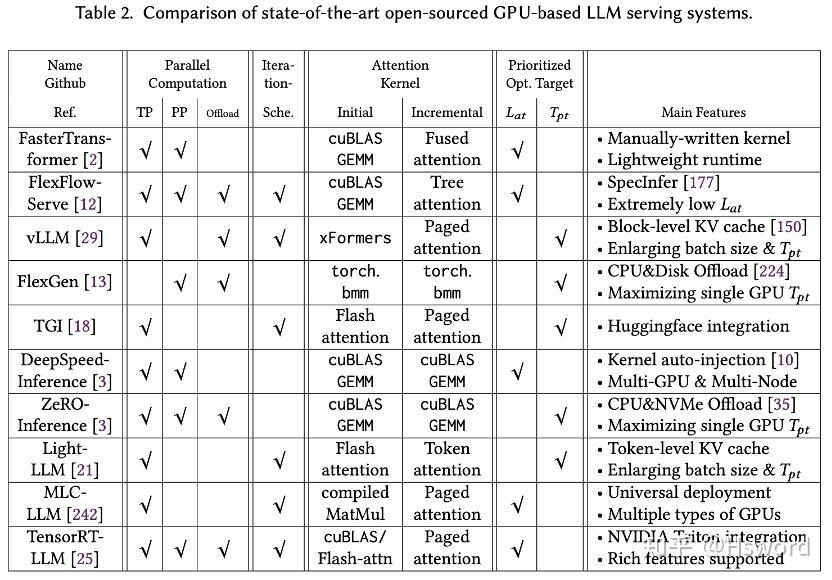

# 大模型如何高效部署&CMU最新万字综述纵览LLM推理MLSys优化技术
> **作者:** [**Hsword**](https://www.zhihu.com/people/miao-xu-peng)
> 
> **原文:** [**https://zhuanlan.zhihu.com/p/677635306**](https://zhuanlan.zhihu.com/p/677635306)

> 近日，CMU Catalyst团队推出了一篇关于[高效LLM推理](https://zhida.zhihu.com/search?content_id=238715765&content_type=Article&match_order=1&q=%E9%AB%98%E6%95%88LLM%E6%8E%A8%E7%90%86&zhida_source=entity)的综述，覆盖了300余篇相关论文，从MLSys的研究视角介绍了算法创新和系统优化两个方面的相关进展。  
> _论文链接：_[_https://arxiv.org/abs/2312.15234_](https://link.zhihu.com/?target=https%3A//arxiv.org/abs/2312.15234)

在人工智能（AI）的快速发展背景下，[大语言模型](https://zhida.zhihu.com/search?content_id=238715765&content_type=Article&match_order=1&q=%E5%A4%A7%E8%AF%AD%E8%A8%80%E6%A8%A1%E5%9E%8B&zhida_source=entity)（[LLMs](https://zhida.zhihu.com/search?content_id=238715765&content_type=Article&match_order=1&q=LLMs&zhida_source=entity)）凭借其在语言相关任务上的杰出表现，已成为AI领域的重要推动力。然而，随着这些模型在各种应用中的普及，它们的复杂性和规模也为其部署和服务带来了前所未有的挑战。LLM部署和服务面临着密集的计算强度和巨大的内存消耗，特别是在要求低延迟和高吞吐量的场景中，如何提高LLM服务效率，降低其部署成本，已经成为了当前AI和系统领域亟需解决的问题。

来自[卡内基梅隆大学](https://zhida.zhihu.com/search?content_id=238715765&content_type=Article&match_order=1&q=%E5%8D%A1%E5%86%85%E5%9F%BA%E6%A2%85%E9%9A%86%E5%A4%A7%E5%AD%A6&zhida_source=entity)的Catalyst团队在他们的最新[综述论文](https://zhida.zhihu.com/search?content_id=238715765&content_type=Article&match_order=1&q=%E7%BB%BC%E8%BF%B0%E8%AE%BA%E6%96%87&zhida_source=entity)中，从机器学习系统（MLSys）的研究视角出发，详细分析了从前沿的LLM推理**算法**到**系统**的革命性变革，以应对这些挑战。该综述旨在提供对高效LLM服务的当前状态和未来方向的全面理解，为研究者和实践者提供了宝贵的洞见，帮助他们克服有效LLM部署的障碍，从而重塑AI的未来。

> Towards Efficient Generative Large Language Model Serving: A Survey from Algorithms to Systems

该论文的[第一作者](https://zhida.zhihu.com/search?content_id=238715765&content_type=Article&match_order=1&q=%E7%AC%AC%E4%B8%80%E4%BD%9C%E8%80%85&zhida_source=entity)是卡内基梅隆大学的Xupeng Miao（苗旭鹏）博士后研究员，合作者还包括Tianqi Chen和Zhihao Jia助理教授。此外，其他学生作者也均来自于[CMU Catalyst Group实验室](https://zhida.zhihu.com/search?content_id=238715765&content_type=Article&match_order=1&q=CMU+Catalyst+Group%E5%AE%9E%E9%AA%8C%E5%AE%A4&zhida_source=entity)，该实验室由Zhihao Jia与Tianqi Chen [@陈天奇](https://www.zhihu.com/people/1d09d935246523c51f69bd13d3c35cfe) 在CMU共同主持，致力于集成来自于机器学习算法、系统、硬件等多方面的优化技术，构造自动化的机器学习系统。此前，该实验室还推出了SpecInfer, MLC-LLM, [SpotServe \[ASPLOS‘24\]](https://zhida.zhihu.com/search?content_id=238715765&content_type=Article&match_order=1&q=SpotServe+%5BASPLOS%E2%80%9824%5D&zhida_source=entity)等[开源项目](https://zhida.zhihu.com/search?content_id=238715765&content_type=Article&match_order=1&q=%E5%BC%80%E6%BA%90%E9%A1%B9%E7%9B%AE&zhida_source=entity)，推进LLM大模型相关系统的研究和应用。实验室主页：[https://catalyst.cs.cmu.edu](https://link.zhihu.com/?target=https%3A//catalyst.cs.cmu.edu)。

综述概览
----

该综述系统地审视了现有LLM推理技术，覆盖了300余篇相关论文，从**算法创新**和**系统优化**两个方面展开介绍。论文以此为基础，对现有工作设计了一套清晰且详尽的**分类法**，突出了各种方法的优势和局限性，逐类别搜集整理并介绍了每种方法的相关论文。除此之外，论文还对当前的主流**LLM**[**推理框架**](https://zhida.zhihu.com/search?content_id=238715765&content_type=Article&match_order=1&q=%E6%8E%A8%E7%90%86%E6%A1%86%E6%9E%B6&zhida_source=entity)在系统设计与实现方面进行了深入的对比和分析。最后，作者对未来如何继续提高LLM推理效率进行了展望，在技术层面提出了**六大潜在发展方向**。

分类法
---

> 图1：LLM推理优化技术分类

### 算法创新

这一节对提出的各种算法和技术进行了全面分析，旨在改进大规模[Transformer模型](https://zhida.zhihu.com/search?content_id=238715765&content_type=Article&match_order=1&q=Transformer%E6%A8%A1%E5%9E%8B&zhida_source=entity)推理的原生性能缺陷，包括**解码算法**、**架构设计**、和**模型压缩**等等。

> 图2：LLM解码算法示意图

一、解码算法：在这一部分中，我们回顾了在图2中展示的几种LLMs推理优化过程的新颖解码算法。这些算法旨在减少计算复杂度，并提高语言模型推理在生成任务中的总体效率，包括：

*   [**非自回归解码**](https://zhida.zhihu.com/search?content_id=238715765&content_type=Article&match_order=1&q=%E9%9D%9E%E8%87%AA%E5%9B%9E%E5%BD%92%E8%A7%A3%E7%A0%81&zhida_source=entity)：现有LLMs的一个主要限制是默认的自回归解码机制，它逐个顺序生成输出标记。为解决这一问题，一种代表性的工作方向是非自回归解码\[97, 104, 108，271\]，即放弃自回归生成范式，打破单词依赖并假设一定程度的条件独立性，并行解码输出token。然而，尽管这类方法解码速度有所提高，但大多数[非自回归方法](https://zhida.zhihu.com/search?content_id=238715765&content_type=Article&match_order=1&q=%E9%9D%9E%E8%87%AA%E5%9B%9E%E5%BD%92%E6%96%B9%E6%B3%95&zhida_source=entity)的输出质量仍不如自回归方法可靠。
*   **投机式推理**：另一类工作是通过投机执行思想\[47\]实现并行解码。自回归LLM推理过程中的每个解码步骤都可以被视为带有条件分支的程序执行语句，即决定接下来生成哪个token。投机式推理\[51, 155\]先使用较小的草稿模型进行多步解码预测，然后让LLM同时验证这些预测以实现加速。然而，将[投机解码](https://zhida.zhihu.com/search?content_id=238715765&content_type=Article&match_order=1&q=%E6%8A%95%E6%9C%BA%E8%A7%A3%E7%A0%81&zhida_source=entity)应用于LLMs时仍然存在一些实际挑战，例如，如何使解码预测足够轻量且准确，以及如何借助LLMs实现高效的并行验证。SpecInfer \[177\]首次引入了基于tree-based speculative decoding和tree attention的，并提出了一个低延迟LLM服务系统实现，该机制也被后续多个工作\[48, 118, 168, 185, 229, 236, 274, 310\]直接采用。

[Hsword：CMU发布「投机式推理」引擎SpecInfer，大小模型联动让LLM推理提速2-3倍！103 赞同 · 6 评论文章](https://zhuanlan.zhihu.com/p/634342816)

*   **提前退出**：这类方法主要利用LLMs的深层多层结构，在中间层就提前推出推理，中间层输出可以通过分类器转化成输出的token，从而降低推理开销\[117, 147, 163, 167, 234, 272, 282, 291, 308\]，它们也被称为自适应计算\[68, 219\]。
*   [**级联推理**](https://zhida.zhihu.com/search?content_id=238715765&content_type=Article&match_order=1&q=%E7%BA%A7%E8%81%94%E6%8E%A8%E7%90%86&zhida_source=entity)：这类方法级联了多个不同规模的[LLM模型](https://zhida.zhihu.com/search?content_id=238715765&content_type=Article&match_order=1&q=LLM%E6%A8%A1%E5%9E%8B&zhida_source=entity)，用于分别处理不同复杂度的推理请求，代表性工作包括CascadeBERT\[157\]和FrugalGPT\[53\]

**二、架构设计：**

*   **配置缩小**：直接缩小模型配置
*   **注意力简化**：最近出现了很多研究工作，它们主要是将之前的长序列高效注意力机制\[240\]应用在LLM上，以缩短上下文，减少KV缓存，以及注意力复杂度，同时略微降低解码质量（如[滑动窗口](https://zhida.zhihu.com/search?content_id=238715765&content_type=Article&match_order=1&q=%E6%BB%91%E5%8A%A8%E7%AA%97%E5%8F%A3&zhida_source=entity)\[129, 299\]、[哈希](https://zhida.zhihu.com/search?content_id=238715765&content_type=Article&match_order=1&q=%E5%93%88%E5%B8%8C&zhida_source=entity)\[198\]、dilated\[74\]、动态选择等等）。表1中总结了一些近期的热门方法和之前的工作之间的对应关系。

> 表1：注意力简化方法对比

*   **激活共享**: 这类方法主要是通过共享attention计算的中间激活来降低推理内存开销，代表性工作包括MQA\[220\]和GQA\[32\]。
*   **条件计算**：这类方法主要是指稀疏专家[混合模型](https://zhida.zhihu.com/search?content_id=238715765&content_type=Article&match_order=1&q=%E6%B7%B7%E5%90%88%E6%A8%A1%E5%9E%8B&zhida_source=entity)（Sparse MoE），比如最近大火的Mistrial 7Bx8模型就属于此类。
*   [**循环单元**](https://zhida.zhihu.com/search?content_id=238715765&content_type=Article&match_order=1&q=%E5%BE%AA%E7%8E%AF%E5%8D%95%E5%85%83&zhida_source=entity)：尽管Transformer已经替代了RNN模型，但考虑到[注意力机制](https://zhida.zhihu.com/search?content_id=238715765&content_type=Article&match_order=2&q=%E6%B3%A8%E6%84%8F%E5%8A%9B%E6%9C%BA%E5%88%B6&zhida_source=entity)的二次复杂性，人们始终未曾放弃将recurrent unit机制重新引入LLM的尝试，比如RWKV\[200\]、RetNet\[235\]，以及[状态空间模型](https://zhida.zhihu.com/search?content_id=238715765&content_type=Article&match_order=1&q=%E7%8A%B6%E6%80%81%E7%A9%BA%E9%97%B4%E6%A8%A1%E5%9E%8B&zhida_source=entity)\[91, 102, 103, 176\]等等。

三、**模型压缩：**

*   [**知识蒸馏**](https://zhida.zhihu.com/search?content_id=238715765&content_type=Article&match_order=1&q=%E7%9F%A5%E8%AF%86%E8%92%B8%E9%A6%8F&zhida_source=entity)：这类方法以大型的教师模型为监督，训练一个小型的学生模型。大多数之前的方法都在探索[白盒蒸馏](https://zhida.zhihu.com/search?content_id=238715765&content_type=Article&match_order=1&q=%E7%99%BD%E7%9B%92%E8%92%B8%E9%A6%8F&zhida_source=entity)\[106, 133, 214, 233, 255\]，需要访问整个教师模型的参数。由于基于API的LLM服务（如[ChatGPT](https://zhida.zhihu.com/search?content_id=238715765&content_type=Article&match_order=1&q=ChatGPT&zhida_source=entity)）的出现，一些黑盒蒸馏模型吸引了很多关注\[238,59, 273, 201, 313\]，这些模型通常具有更少的模型参数，与原始LLMs（如[GPT-4](https://zhida.zhihu.com/search?content_id=238715765&content_type=Article&match_order=1&q=GPT-4&zhida_source=entity)\[195\]）相比，在各种下游任务上表现出了相当的性能。
*   **网络剪枝**：过去几年中，网络剪枝方法\[180, 215, 215\]已被广泛研究，但并非所有方法都可以直接应用于LLMs，需要考虑重新训练可能带来的过高计算成本，以及评估剪枝是否可以在底层系统实现上取得效率提升。大致上可以分为[结构化剪枝](https://zhida.zhihu.com/search?content_id=238715765&content_type=Article&match_order=1&q=%E7%BB%93%E6%9E%84%E5%8C%96%E5%89%AA%E6%9E%9D&zhida_source=entity)\[80, 149, 174, 216, 172\]和半结构化稀疏化\[40, 87, 232, 251, 276\]等。

### 系统优化

本节研究LLM[推理系统优化](https://zhida.zhihu.com/search?content_id=238715765&content_type=Article&match_order=1&q=%E6%8E%A8%E7%90%86%E7%B3%BB%E7%BB%9F%E4%BC%98%E5%8C%96&zhida_source=entity)技术，以加速LLM推理，而不改变LLM计算语义。这一工作的目标是通过改进用于大型语言模型推理的底层系统和框架来提高系统效率，包括[**低比特量化**](https://zhida.zhihu.com/search?content_id=238715765&content_type=Article&match_order=1&q=%E4%BD%8E%E6%AF%94%E7%89%B9%E9%87%8F%E5%8C%96&zhida_source=entity)、**并行计算**、[**内存管理**](https://zhida.zhihu.com/search?content_id=238715765&content_type=Article&match_order=1&q=%E5%86%85%E5%AD%98%E7%AE%A1%E7%90%86&zhida_source=entity)、**请求调度**、和[**内核优化**](https://zhida.zhihu.com/search?content_id=238715765&content_type=Article&match_order=1&q=%E5%86%85%E6%A0%B8%E4%BC%98%E5%8C%96&zhida_source=entity)等。

_**注：这一章节的内容实际篇幅很长，更偏向于有系统背景的MLSyser阅读，后续有空会回来接着更新中文版本，感兴趣的同学可以先阅读论文原文。**_

软件框架
----

> 表2：主流开源GPU LLM推理系统对比

论文还对一些目前最先进的基于GPU的开源LLM推理系统进行了深入的分析，并从多个方面总结了它们在设计与实现上的差异。

_**注：对这一章节感兴趣的同学也强烈安利大家阅读论文原文，或许会对你有帮助！**_

未来方向
----

1.  **专用硬件加速器的发展**：生成型LLM服务效率的显著提升可能在很大程度上依赖于专用硬件加速器的发展和提升，尤其是软硬[协同设计](https://zhida.zhihu.com/search?content_id=238715765&content_type=Article&match_order=1&q=%E5%8D%8F%E5%90%8C%E8%AE%BE%E8%AE%A1&zhida_source=entity)方法。例如，让内存单元更加接近处理单元，或是针对LLM算法数据流优化芯片架构，这些硬件优化可以在很大程度上为LLM推理在软件层面带来便利和机会。
2.  **高效有效的解码算法**：开发更高效的解码算法可以显著提高服务效率。受对实时应用更快生成速度的需求驱动，一个有前途的方向是广义的投机式推理（generalized speculative inference），不仅会带来显著加速，同时保持相同的生成质量。正如SpecInfer中所指出的，广义的投机式推理中，用于生成草稿token的小模型可以被替换为任何快速的token生成方法，比如自定义函数、召回方法、甚至[早停机制](https://zhida.zhihu.com/search?content_id=238715765&content_type=Article&match_order=1&q=%E6%97%A9%E5%81%9C%E6%9C%BA%E5%88%B6&zhida_source=entity)和非自回归解码等等。
3.  **长上下文/序列场景优化**：随着应用场景变得更加复杂，处理更长的上下文或序列的需求不断增长。服务长序列负载的LLM需要解决[算法和系统](https://zhida.zhihu.com/search?content_id=238715765&content_type=Article&match_order=1&q=%E7%AE%97%E6%B3%95%E5%92%8C%E7%B3%BB%E7%BB%9F&zhida_source=entity)两方面的挑战。在算法方面，它们依然面临长度泛化失效问题，甚至可能出现“loss in the middle”的情况。目前的解法主要是通过召回增强、序列压缩和缓存来尽可能缩短序列长度并保存相关信息。
4.  **探索替代基础架构**：尽管Transformer模型和[自注意力机制](https://zhida.zhihu.com/search?content_id=238715765&content_type=Article&match_order=1&q=%E8%87%AA%E6%B3%A8%E6%84%8F%E5%8A%9B%E6%9C%BA%E5%88%B6&zhida_source=entity)目前主导着LLM领域，但探索替代架构是未来研究的一个有前景的方向。例如，一些最新研究探索了无注意力方法，使用纯MLP（[多层感知机](https://zhida.zhihu.com/search?content_id=238715765&content_type=Article&match_order=1&q=%E5%A4%9A%E5%B1%82%E6%84%9F%E7%9F%A5%E6%9C%BA&zhida_source=entity)）架构来替代注意力机制，可能会改变目前LLM推理优化的格局。
5.  **在复杂环境中的部署探索**：随着LLM应用的扩展，探索并优化它们在各种复杂环境中的部署成为一个关键的未来方向。这一探索不仅限于传统的基于云的部署，还包括[边缘计算](https://zhida.zhihu.com/search?content_id=238715765&content_type=Article&match_order=1&q=%E8%BE%B9%E7%BC%98%E8%AE%A1%E7%AE%97&zhida_source=entity)、混合计算（cloud+edge）、去中心化计算以及廉价的可抢占资源等。
6.  **特定需求的自动适应**：应用特定需求的多样性创造了一系列创新的LLM服务优化机会，例如[模型微调](https://zhida.zhihu.com/search?content_id=238715765&content_type=Article&match_order=1&q=%E6%A8%A1%E5%9E%8B%E5%BE%AE%E8%B0%83&zhida_source=entity)（parameter-efficient fine-tuning）、[向量数据库检索](https://zhida.zhihu.com/search?content_id=238715765&content_type=Article&match_order=1&q=%E5%90%91%E9%87%8F%E6%95%B0%E6%8D%AE%E5%BA%93%E6%A3%80%E7%B4%A2&zhida_source=entity)、多模态负载等等。这些独特的挑战也要求将LLM服务技术自动且顺利地集成到现有IT基础设施中，将优化空间扩展到整个LLM生命周期。

总结
--

总的来说，该综述不仅是对当前LLM服务优化研究的全面概述，也为未来在这一领域的探索和发展指明了方向。通过深入了解这些先进的解决方案，研究者和实践者可以更好地理解和应对在实际应用中部署大型语言模型时面临的挑战。

[Towards Efficient Generative Large Language Model Serving: A Survey from Algorithms to Systems](https://arxiv.org/abs/2312.15234)

[Catalyst: Home](https://catalyst.cs.cmu.edu/)