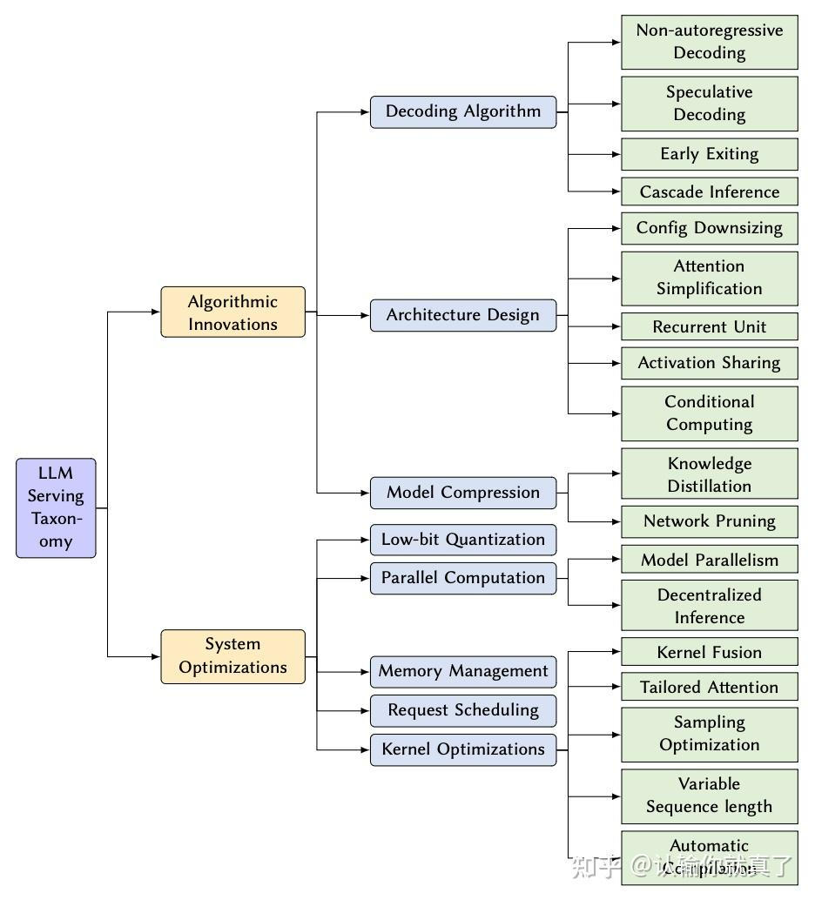
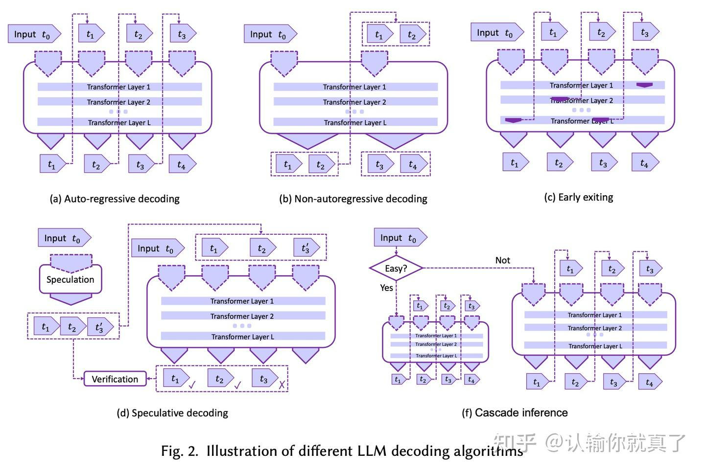
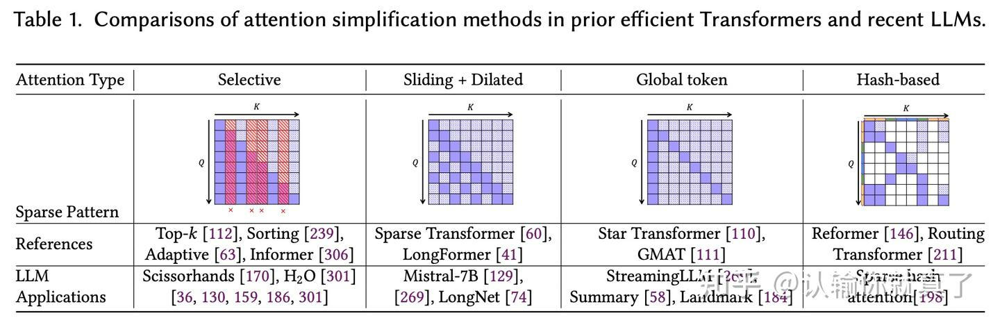
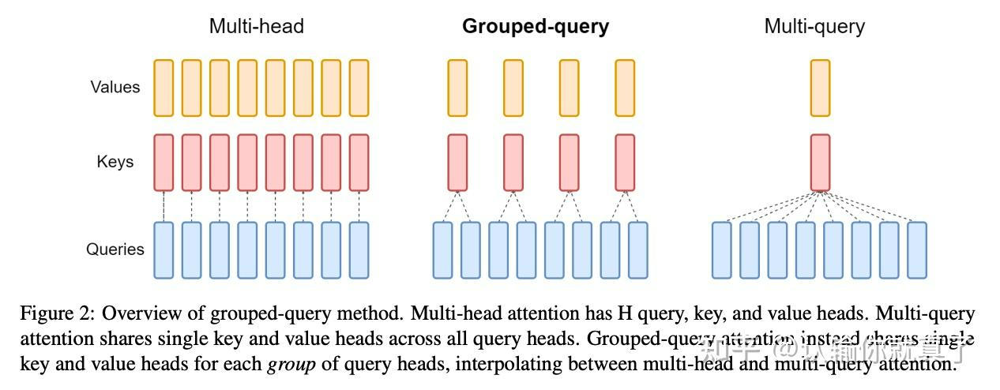
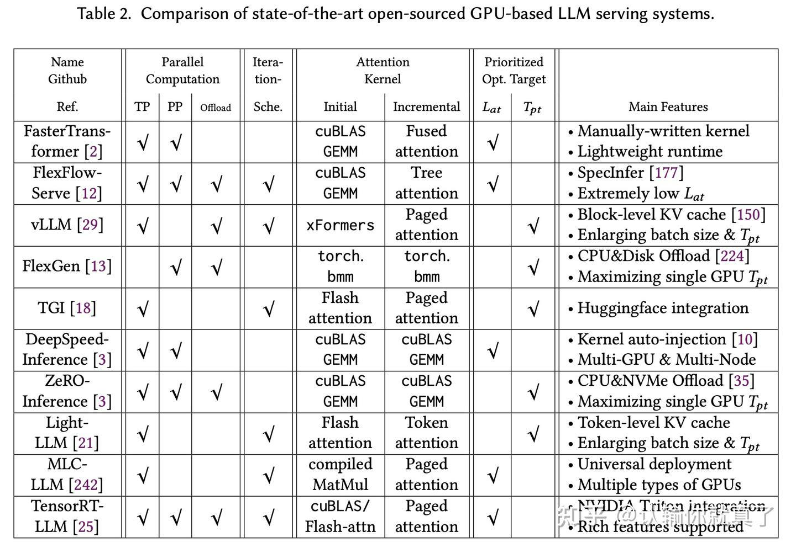

# 大模型部署综述
[Towards Efficient Generative Large Language Model Serving: A Survey from Algorithms to Systems](https://arxiv.org/abs/2312.15234)

> _**作者: 认输你就真了**_
> 
> _**原文:**_ [_**https://zhuanlan.zhihu.com/p/690743788**_](https://zhuanlan.zhihu.com/p/690743788)

**1 背景**
--------

这是一篇关于大语言模型（LLM）部署的综述，作者重点讨论了高效部署生成式大型语言模型的挑战，从机器学习系统（MLSys）的角度，强调了在需要低延迟和高吞吐量的场景中优化 LLM 服务的重要性，因为这些模型的计算强度和内存消耗。要点如下：

*   高效部署 LLM 的挑战包括计算强度、内存消耗和服务效率；
*   从算法创新到系统设计以优化 LLM 服务的一系列解决方案；
*   讨论基于 Transformer 的 LLM、GPU 和其他加速器，以及 LLM 推理方法；
*   为研究人员和从业者提供见解，以提高 LLM 部署效率并重塑 AI 的未来

**2 当前的挑战**
-----------

文中作者提到了五点大模型部署时遇到的巨大挑战：

1.  **Latency and Response Time**\*\* \*\*在一些聊天机器、智能助理的场景下，往往要求模型有较低的延迟和等待时间；
2.  **Memory Footprint and Model Size**\*\* \*\*模型太大导致显存或内存不够用的情况；
3.  **Scalability and Throughput**\*\* \*\*在实际应用场景，模型推理系统可能要面对不同的请求负载，为了有效处理多个同时发生的请求，需要系统有较好的可扩展性和高吞吐，整合各种计算存储资源。这里会涉及并行计算、请求调度和其他系统级优化等技术；
4.  **Hardware Compatibility and Acceleration**\*\* \*\*如何有效地利用硬件资源是至关重要的，系统需要适应多种硬件平台和架构（包括CPU、GPU和专用加速器）需要进行硬件感知的算法设计和优化，以充分利用底层硬件的潜力；
5.  **Trade-offs between Accuracy and Efficiency**\*\* \*\*优化大语言模型推理的效率有时可能会涉及到与模型准确性的权衡。在模型大小、计算复杂性和性能之间找到正确的平衡是一项挑战性的任务，需要仔细考虑和评估各种算法和系统级技术。

**3 当前的进展**
-----------

文中介绍了模型部署中的算法创新和系统优化两个部分（如下图），这也是当前大模型的两个主要工作方向（算法or工程）。算法创新部分又分为解码算法、架构设计和模型压缩三个方面；系统优化又分为[低比特量化](https://zhida.zhihu.com/search?content_id=241629167&content_type=Article&match_order=1&q=%E4%BD%8E%E6%AF%94%E7%89%B9%E9%87%8F%E5%8C%96&zhida_source=entity)、并行计算、内存管理、请求调度和内核优化。

### **3.1 算法创新**

**3.1.1**\*\* [**非自回归解码**](https://zhida.zhihu.com/search?content_id=241629167&content_type=Article&match_order=1&q=%E9%9D%9E%E8%87%AA%E5%9B%9E%E5%BD%92%E8%A7%A3%E7%A0%81&zhida_source=entity)（Non-autoregressive decoding）\*\*

非自回归解码技术是一种用于提高大型语言模型（LLM）解码效率的方法。在传统的自回归解码方法中，模型会逐个生成输出序列的每个元素，每次生成都依赖于之前已经生成的所有元素。这种方法虽然能够生成连贯且上下文相关的文本，但是计算效率较低，因为它需要对每个输出元素进行顺序处理。

非自回归解码技术的目标是打破这种顺序依赖性，允许模型并行生成多个输出元素，从而提高解码速度。这种方法的基本思想是，在解码过程中，不再要求每个新生成的词都依赖于之前所有生成的词，而是允许模型在生成当前词时只考虑一部分或根本不考虑之前的输出。

然而，这种方法也面临一些挑战，比如如何确保解码质量不会因为并行处理而降低。有了后续的一些改进，如半自回归解码（Semi-autoregressive decoding）、迭代细化（Iterative refinement）、块状并行解码（Blockwise parallel decoding）。

**3.1.2 早退（Early exiting）**

早退技术通过在解码过程中提前结束序列生成来减少不必要的计算。具体来说，早期退出技术会在模型生成序列的过程中寻找合适的退出点，一旦模型对于当前生成的序列具有足够的信心，就可以停止进一步的生成过程。这种方法可以显著减少计算量，因为它避免了对那些已经可以确定的序列部分进行额外的计算。

早期退出技术的关键优势包括：

*   计算效率：通过减少生成序列所需的步骤，早期退出可以显著提高模型的推理速度。
*   资源优化：在处理大量并发请求时，早期退出可以帮助更有效地分配计算资源，因为它允许模型在完成某些请求后立即释放计算资源，从而为其他请求提供服务。
*   灵活性：早期退出提供了一种灵活的解码策略，可以根据具体任务的需求和上下文来调整退出点，以达到速度和准确性之间的最佳平衡。

然而，早期退出技术也面临一些挑战，例如确定合适的退出条件和处理不同任务的退出策略。此外，早期退出可能会影响生成文本的一致性和完整性，因为在某些情况下，提前退出可能会导致生成的序列不完整或缺乏上下文连贯性。

**3.1.3**\*\* [**投机解码**](https://zhida.zhihu.com/search?content_id=241629167&content_type=Article&match_order=1&q=%E6%8A%95%E6%9C%BA%E8%A7%A3%E7%A0%81&zhida_source=entity)（Speculative decoding）\*\*

投机解码的核心思想是在解码的每个步骤中，不仅生成一个最可能的词，而是生成一组候选词，并对这些候选词进行并行处理。这样，模型可以在一个解码步骤中同时考虑多个可能的输出序列，而不是一次只处理一个。这种方法可以显著提高解码的并行度，从而加快整体的解码速度。

具体来说，投机解码包括以下几个关键步骤：

i）生成候选序列：在每个解码步骤中，模型生成一组候选词，而不是单一的最可能词。

ii）并行处理：对这些候选词进行并行处理，以快速探索多种可能的输出序列。

iii）验证与选择：在生成了一组候选序列后，模型需要验证这些序列的有效性，并从中选择最佳的输出。这通常通过与原始的LLM进行比较来完成，确保所选序列的质量。

iv）迭代优化：在某些情况下，投机解码可能是一个迭代过程，模型在每次迭代中都会生成新的候选序列，并逐步优化解码结果。

**3.1.4**\*\* [**级联推理**](https://zhida.zhihu.com/search?content_id=241629167&content_type=Article&match_order=1&q=%E7%BA%A7%E8%81%94%E6%8E%A8%E7%90%86&zhida_source=entity)（Cascade inference）\*\*

级联推理是一种用于提高大型语言模型（LLM）推理效率的技术，它通过利用一系列不同规模的模型来最小化响应时间。级联推理的核心思想是根据输入请求的复杂性或难度，动态选择最合适的模型来处理该请求，从而在保证输出质量的同时，尽可能地减少计算资源的消耗和提高推理速度。然而，级联推理也面临一些挑战，比如如何设计一个准确的调度机制来决定使用哪个模型，以及如何平衡模型大小、计算资源和推理性能之间的关系。此外，级联推理可能需要更复杂的系统设计和更精细的资源管理策略。

下图形象地展示了1-4解码技术的区别，

下面看架构设计，

**3.1.5 配置缩减（Configuration downsizing）**

配置缩减是一种蛮简单的减少模型计算成本和内存占用的方法，例如：

*   浅层编码器/解码器：通过减少模型中编码器或解码器的层数，降低模型的复杂度。这种方法可以减少模型参数的数量，从而降低计算和存储需求。
*   权重共享：在模型的不同部分之间共享权重，这样可以减少模型中唯一的参数数量。权重共享不仅可以降低模型大小，还可以在一定程度上保持模型的性能，因为共享的权重可以在不同任务或数据间传递知识。
*   词汇表缩减：通过限制模型使用的词汇表大小，减少模型需要处理的词汇数量。这可以通过词干提取、词形还原或使用更小的子集词汇表来实现。虽然这可能会影响模型处理罕见词汇的能力，但在很多情况下，这种影响是可以接受的。

**3.1.6 注意力简化（Attention simplification）**

注意力简化是一种针对大型语言模型（LLM）中的自注意力（Self-Attention）机制的优化技术。[自注意力机制](https://zhida.zhihu.com/search?content_id=241629167&content_type=Article&match_order=1&q=%E8%87%AA%E6%B3%A8%E6%84%8F%E5%8A%9B%E6%9C%BA%E5%88%B6&zhida_source=entity)是Transformer模型的核心组成部分，它允许模型在处理序列时考虑序列中不同位置的信息。然而，标准的自注意力计算复杂度随着序列长度的增加而呈二次方增长（O(n^2)），这在处理长序列时会导致显著的计算和内存开销。

注意力简化的目标是在保持模型性能的同时，降低自注意力机制的计算和内存成本。以下是一些常见的注意力简化方法：

*   [**稀疏注意力**](https://zhida.zhihu.com/search?content_id=241629167&content_type=Article&match_order=1&q=%E7%A8%80%E7%96%8F%E6%B3%A8%E6%84%8F%E5%8A%9B&zhida_source=entity)**（Sparse Attention）**：通过限制注意力机制中每个元素只关注序列中的一部分元素，而不是全部元素，从而减少计算量。这可以通过滑动窗口、块状注意力或其他稀疏模式来实现。
*   **核化注意力（Kernelized Attention）**：使用核技巧（Kernel Trick）来近似标准的自注意力计算，从而降低复杂度。这种方法通常涉及到将注意力机制的计算转化为线性操作，例如通过使用[低秩近似](https://zhida.zhihu.com/search?content_id=241629167&content_type=Article&match_order=1&q=%E4%BD%8E%E7%A7%A9%E8%BF%91%E4%BC%BC&zhida_source=entity)或其他变换技术。
*   **因子化注意力（Factorized Attention）**：将注意力矩阵分解为较小的因子，这些因子可以单独计算和存储，从而降低内存占用和计算需求。
*   **局部注意力（Local Attention）**：将长序列分割成较短的片段或块，并在每个块内独立地应用注意力机制。这种方法可以减少每次注意力计算所需的序列长度，从而降低复杂度。
*   **哈希注意力（Hash Attention）**：使用哈希函数将输入序列映射到一个固定大小的空间，并在这个空间上应用注意力机制。这种方法可以显著减少长序列的注意力计算。

下图总结了几种常见的简化方法：

**3.1.7 激活共享（Activation sharing）**

激活共享的核心思想是在模型的不同部分之间重用中间激活，从而减少重复的计算和内存占用。例如Falcon和PaLM中使用的Multi-query attention (MQA)、LLaMA-2和[Mistral-7B](https://zhida.zhihu.com/search?content_id=241629167&content_type=Article&match_order=1&q=Mistral-7B&zhida_source=entity)中的Group-query attention (GQA) 。

**3.1.8 条件计算（Conditional computing）**

条件计算主要涉及各种[混合专家模型](https://zhida.zhihu.com/search?content_id=241629167&content_type=Article&match_order=1&q=%E6%B7%B7%E5%90%88%E4%B8%93%E5%AE%B6%E6%A8%A1%E5%9E%8B&zhida_source=entity)（Mixture-of-Experts, MoE），这些“专家”是专门处理不同数据子集的较小神经网络。这些专家是根据某些路由机制有选择地调用的，允许系统仅通过对给定输入使用必要的专家来有效地计算。这种方法通过避免对整个大规模模型进行计算来提高计算和内存效率。

**3.1.9 循环单元（Recurrent unit）**

在某些方法中，循环单元被用于替换大型语言模型 （LLM） 中的 Transformer 模块，并在推理过程中实现线性计算和内存复杂性。此类方法的示例包括 RWKV 和 RetNet，它们建立在[线性注意力](https://zhida.zhihu.com/search?content_id=241629167&content_type=Article&match_order=1&q=%E7%BA%BF%E6%80%A7%E6%B3%A8%E6%84%8F%E5%8A%9B&zhida_source=entity)表示之上。这些最近的探索旨在克服递归神经网络（RNN）在捕获序列（如LSTM）中的长期依赖性方面的局限性。这些模型的设计包含各种组件，如位置编码模块、指数衰减机制和标记式非线性 MLP 或 GLU，以增强模型表示能力。然而，循环单元是否可以有效地取代 LLM 中的 Transformer 仍然是一个悬而未决的问题，尤其是在处理长序列时。

最后是模型压缩技术，

**3.1.10 知识蒸馏（Knowledge Distillation）**

知识蒸馏是模型压缩中的一种技术，涉及在较大的教师模型的指导下训练较小的学生模型。这种方法在白盒蒸馏的背景下得到了广泛的探索，在白盒蒸馏中，教师模型的整个参数都是在训练期间访问的。此外，与原始的大型语言模型相比，Alpaca、Vicuna 和 WizardLM 等黑盒蒸馏模型因其在各种下游任务上的性能而受到关注。

**白盒蒸馏**：

*   在白盒蒸馏中，学生模型使用教师模型的内部表示或中间输出（通常称为“软目标”）进行训练。这通常需要能够访问教师模型的内部结构，例如隐藏层，这些信息通常在教师模型由同一团队或研究者设计和训练时可用。
*   由于学生模型可以利用教师模型的内部状态，因此它可以更准确地模仿教师模型的行为。这通常可以带来更好的性能，特别是当学生模型与教师模型在架构上相似时。
*   白盒蒸馏通常更有效，因为它利用了关于教师模型决策过程的详细信息。然而，如果教师模型是商业产品，或者学生模型是由没有访问教师模型内部信息的不同团队设计的，那么白盒蒸馏可能不可行。

**黑盒蒸馏**：

*   黑盒蒸馏将教师模型视为一个黑盒，学生模型仅通过教师模型的输入和输出进行训练。这意味着学生模型不需要访问教师模型的内部结构或参数。
*   学生模型通过学习模仿教师模型的输出来训练，通常是通过一些损失函数来最小化学生模型输出和教师模型输出之间的差异。
*   黑盒蒸馏的优势在于它的通用性和灵活性，因为它不依赖于对教师模型的内部工作机制的了解。这使得它适用于更广泛的情况，尤其是在教师模型是由第三方提供或作为服务（Model-as-a-Service）提供时。
*   然而，由于学生模型无法直接利用教师模型的中间表示，黑盒蒸馏可能不如白盒蒸馏那样有效，特别是在教师模型和学生模型架构差异较大时。

**3.1.11 网络剪枝（Network pruning）**

网络剪枝是一种模型压缩技术，旨在通过移除神经网络中的一些参数或神经元来减少模型的大小和计算需求，同时尽量保持或仅轻微牺牲模型的性能。网络剪枝的目的是优化模型的效率，使其更适合在资源受限的环境中部署和运行，例如移动设备或边缘计算设备。

网络剪枝的主要方法包括：

*   **结构化剪枝（Structured Pruning）**：这种方法通常移除整个神经元、过滤器（filters）或层，从而在减少模型大小和计算量的同时，保持模型结构的完整性。结构化剪枝可以更容易地实现，并且对模型的推理过程影响较小。
*   **非结构化剪枝（Unstructured Pruning）**：与结构化剪枝不同，非结构化剪枝可以移除网络中的任意参数，而不仅仅是整个神经元或过滤器。这种方法可以提供更细粒度的压缩，但可能会对模型的推理过程产生更大的影响。
*   **逐层剪枝（Layer-Wise Pruning）**：在这种方法中，模型的每一层都会根据预定的策略进行单独的剪枝，例如根据权重的重要性或对模型性能的影响。
*   **基于敏感度的剪枝（Sensitivity-Based Pruning）**：这种方法根据参数对模型输出的敏感度来决定是否剪枝，移除那些对输出影响最小的参数。

网络剪枝的挑战在于如何平衡模型的压缩和性能保持。过度剪枝可能会导致模型性能显著下降，而不足的剪枝可能无法实现所需的压缩效果。因此，研究者们通常会通过实验来确定最佳的剪枝策略和程度，以实现模型压缩和性能之间的最佳平衡。

### **3.2 系统优化**

系统优化需要结合硬件提升模型推理的效率。

**3.2.1 低比特量化（Low-bit Quantization）**

低比特量化是一种技术，涉及使用更少的位（小于 32 位）来表示模型权重和激活，从而显著减少内存消耗并加速硬件平台上的推理。模型量化技术可分为两个主要方向：量化感知训练 （QAT） 和训练后量化 （PTQ）。这种技术可以很好的配合英伟达CUDA定制加速方案，在Turing和Ampere架构中已支持INT8和INT4的tensor core，在H100芯片上支持的FP8的算力是FP32的60倍，在最新的B200芯片上甚至支持了FP4类型。

**3.2.2 并行计算（Parallel Computation）**

并行计算涉及将计算任务分布在多个内核或设备之间，以在推理过程中实现显著加速，尤其是对于大型语言模型。利用模型并行性（TP）、序列并行性（SP）、流水线模型（PP）并行性等多种并行计算策略来优化资源利用率，提高系统性能。此外，去中心化推理结合了模型和数据并行性（DP），其中多个去中心化节点协作处理数据并推断输出，为具有地理分布的硬件资源的场景提供了一种独特的方法。

**3.2.3 内存管理（Memory Management）**

内存管理是指对内存资源的高效处理和优化，以提高系统性能和推理效率。传统方法（如FasterTransformer）会预先分配内存，由于输入batch的不确定和复杂的解码策略（如beam）可能带来内存极大的浪费。于是就有了各种新的技术来有效地管理内存，例如vLLM采用Paged-Attention将键值缓存（KV-cache） 划分为不连续的内存块，SpecInfer提出Tree-Attention再利用深度优先树遍历来消除冗余的 KV 缓存分配，以及LightLLM实现的token级内存管理机制以减少内存使用。

这些内存管理策略旨在优化内存占用、改善批处理大小、增强吞吐量，并解决 LLM 推理系统中增量解码期间内存需求的动态和不可预测性。

**3.2.4 请求调度（Request Scheduling）**

请求调度是LLM服务的一个关键方面，它涉及有效管理传入的推理请求，以优化资源利用率，保证延迟服务级别目标 （SLO） 内的响应时间，并有效处理不同的请求负载。LLM 服务的请求调度算法与通用机器学习服务技术具有共性，包括动态批处理、抢占、优先级、交换、模型选择、成本效益、负载均衡和资源分配。LLM 服务中的独特挑战，例如大规模模型大小、迭代自回归解码机制、未知变量输出长度和上下文信息的状态管理，需要专门的请求调度策略。已经开发了各种方法来应对这些挑战，例如选择性批处理、迭代级调度、推测解码和作业完成时间优先级。这些策略旨在提高硬件利用率，提高吞吐量，并优化 LLM 服务系统中推理任务的执行。

早期LLM的部署系统（如英伟达Triton上的FasterTransformer）只支持request- level scheduling，然后Orca考虑到可变的输出序列长度, 开始采用first-come-first-serve (FCFS)的顺序按迭代粒度计划engine的执行，同时配合批处理来提高硬件利用率，后来vLLM和RayLLM延续了这种做法使用continuous batching，以及TensorRT-LLM使用的Inflight batching。连续批处理涉及处理连续的请求流，而无需等待先前请求的完成，这有助于最大限度地提高资源利用率和吞吐量。动态批处理是指通过并行处理一批请求来批处理一组选定的操作以提高硬件利用率，这可以提高同时处理多个请求的效率。

类似的还有SpecInfer、FastServe、SARATHI、Dynamic SplitFuse、S3等。

**3.2.5 内核优化（Kernel Optimization）**

大型语言模型服务系统中的内核优化是指优化语言模型推理管道中的特定操作以提高性能的过程。这种优化涉及利用特定于硬件的功能和软件技术来加速关键计算内核。内核优化中使用的一种常用技术是内核融合，其中将具有相似特征的操作组合在一起，以减少内核启动和内存访问的开销。这种方法被各种 DNN 框架和编译器广泛采用以提高效率。此外，定制注意力是内核优化的另一个方面，它专注于自定义专门用于注意力计算的 GPU 内核，以确保在 GPU 硬件上高效执行。通过定制注意力操作，可以通过最大化线程占用率和最小化高带宽内存访问来实现性能提升。这些优化技术有助于提高大型语言模型推理系统的整体性能和效率。

这边列举了几个技术点，包括：

**1） Kernel fusion**

内核融合是一种性能优化技术，它通过合并多个计算内核（kernels）来减少运行时的开销，例如减少内核启动的开销和内存访问的成本。在深度神经网络（DNN）和特别是Transformer模型的上下文中，内核融合通常用于将多个连续的或相关的计算步骤合并为单个内核，这样可以减少在执行过程中的同步和内存传输操作。

在LLM推理过程中，注意力机制和前馈网络（Feed-Forward Networks, FFNs）是计算密集型的操作，它们包含多个线性变换和非线性激活函数。内核融合技术可以将这些操作中的多个步骤（如矩阵乘法、加法、应用激活函数等）合并为一个单一的内核，从而减少运行时的开销并提高执行效率。

例如，对于Transformer模型中的多头注意力（Multi-Head Attention, MHA）机制，可以将计算查询（queries）、键（keys）和值（values）的线性变换步骤融合为一个内核，然后将这些结果传递给应用激活函数的步骤。通过这种方式，可以减少在不同内核之间传输数据的次数，从而减少内存访问延迟，并提高整体的计算吞吐量。

内核融合的一个关键优势是能够针对特定的硬件平台进行定制优化。例如，在NVIDIA GPU上，可以利用CUDA编程模型中的特定特性来实现更高效的内核融合策略。此外，随着硬件架构的发展，如NVIDIA的Ampere和Hopper架构，内核融合技术也在不断进化，以适应新的硬件特性和优化需求。

**2） Tailored attention**

定制化注意力是指为了提高GPU上的注意力操作效率而定制或特别优化GPU内核的方法。由于注意力计算是Transformer模型中的一个关键组成部分，因此在GPU上高效地执行这些操作对于整个模型的性能至关重要。

定制化注意力的目标是针对特定的硬件平台调整注意力机制的实现，以便更好地利用GPU的并行处理能力。例如，cuDNN库提供了一个融合的多头注意力（Multi-Head Attention）内核API，而一些研究工作则提出了开源实现，以进一步提高性能。这些定制化的注意力实现通常会针对Transformer模型的初始阶段（并行处理所有输入token）和增量阶段（每次生成一个输出token）采取不同的优化策略，以最大化线程占用率并最小化对高带宽内存（HBM）的访问。

**3） Sampling optimization**

在LLM的自回归解码过程中，模型在每一步都会基于当前已生成的文本序列来预测下一个最可能的词。这个过程通常涉及到对词汇表中的所有词进行概率估计，然后选择概率最高的词作为下一步的输出。

为了提高解码效率，研究者们提出了各种采样优化技术，这些技术旨在减少在每一步中需要评估的候选词数量，同时尽量保持生成文本的质量。以下是一些常见的采样优化方法：

*   **Top-k Sampling（Top-k采样）**：Top-k 采样是大型语言模型中使用的一种采样算法，它涉及在生成的每个步骤中根据概率选择最有可能的 top-k 标记，然后从这组简化的标记中采样。这种技术有助于在文本生成过程中通过考虑最可能的标记的子集而不是整个词汇表来平衡探索和利用。Top-k 采样通常用于提高生成的文本输出的多样性和质量。
*   **Temperature Scaling（温度缩放）**：通过调整 softmax 函数概率分布的温度参数，可以控制生成文本的随机性。较高的温度会导致概率分布更加平坦，从而增加生成文本的多样性；较低的温度则会使概率分布更加尖锐，倾向于选择概率最高的词，从而提高生成文本的流畅性。
*   **Beam Search（束搜索）**：这是一种启发式搜索算法，它在每一步不是只生成一个词，而是同时保留多个最有可能的候选序列（称为“束宽”），然后基于这些候选序列继续生成下一词。通过这种方式，可以在有限的计算资源下探索更多可能的解码路径，从而提高最终生成文本的整体质量。
*   **Stochastic Sampling（随机采样）**：这种方法涉及在每一步中根据概率分布随机选择下一个词。这种采样方式可以引入更多的随机性和多样性，有时能够产生更自然和创造性的文本。

采样优化的目标是在保持生成文本质量的同时，减少计算资源的消耗，加快解码速度。这些优化技术在实际应用中非常重要，尤其是在需要实时或近实时生成文本的场景中，如聊天机器人、自动写作助手等。通过采样优化，可以使LLM在有限的硬件资源下提供更快的响应时间和更高的吞吐量。

**4） Variable sequence length**

在自然语言处理任务中，文本序列的长度通常是不一致的。例如，一个问题可能很短，而答案可能很长；一条推文可能有严格的字符限制，而一本书的摘要可能包含数百个词。因此，LLM需要能够处理不同长度的输入和输出序列。

对于输入序列，可变长度不是主要问题，因为模型通常可以设计成能够接受任意长度的输入。然而，对于输出序列，情况就复杂得多。在[自回归模型](https://zhida.zhihu.com/search?content_id=241629167&content_type=Article&match_order=1&q=%E8%87%AA%E5%9B%9E%E5%BD%92%E6%A8%A1%E5%9E%8B&zhida_source=entity)中，模型在生成文本时是逐个词或标记地进行的，这意味着输出序列的长度在生成过程中是动态变化的，且在开始生成之前是未知的。

这种可变性带来了几个挑战：

\-\*\* \*\***内存管理**：模型需要能够根据输出序列的实际长度动态分配和调整内存。如果输出序列比预期的要长，模型必须能够扩展其内存分配；如果序列较短，模型需要有效地释放未使用的内存。

*   **计算效率**：在推理过程中，模型需要能够根据当前生成的序列长度来调整计算资源的使用。例如，如果一个序列提前结束（如句子结尾的句号），模型应该能够停止进一步的计算，而不是继续执行无谓的计算。
*   **批处理**：在批量处理多个序列时，如果序列长度不一致，会导致填充（padding）问题。模型需要能够有效地处理填充，以保持批处理的效率。

为了解决这些挑战，研究者们提出了多种策略，包括但不限于：

*   **填充技术**：使用特殊的填充标记来统一不同长度的序列，以便批处理。然而，这会增加不必要的计算和内存开销。
*   **桶（Bucketing）技术**：将长度相似的序列分组在一起进行处理，以减少填充的需要。
*   **动态计算**：设计能够根据序列长度动态调整计算的模型结构，例如通过使用条件计算来仅处理必要的序列部分。

**5） Automatic compilation**

自动编译是指使用自动化工具或框架来优化和编译深度学习模型，特别是大型语言模型（LLM），以提高其在特定硬件平台上的推理效率。自动编译的目的是发现更高效的操作实现，并适应不同的硬件平台，包括移动设备、CPU、专用深度学习加速器和其他类型的GPU。

自动编译技术通常涉及以下几个方面：

*   **表达式推导（Expression Derivation）**：自动编译器可以对计算图进行分析和转换，以发现更高效的计算路径。例如，它可以合并操作、消除冗余计算或重新排列计算顺序，以减少内存访问和提高计算效率。
*   **硬件适应性（Hardware Adaptation）**：自动编译器可以根据目标硬件的特性来优化代码。例如，它可以为不同的GPU架构生成特定的内核，或者为移动设备优化内存使用。
*   **中间表示（Intermediate Representation, IR）**：自动编译器使用IR来表示计算图，这使得它可以更容易地进行代码转换和优化。IR是一种与平台无关的表示，它可以被转换成多种目标硬件的代码。
*   **性能预测（Performance Prediction）**：自动编译器可以预测不同优化策略对性能的影响，从而选择最佳的编译选项。这通常涉及到对硬件性能特征的理解和建模。
*   **端到端优化（End-to-End Optimization）**：自动编译器可以在整个模型部署过程中进行优化，从模型训练到推理，甚至包括模型压缩和量化等步骤。

自动编译的挑战在于，它需要在保持模型精度的同时，最大化推理速度和硬件利用率。这通常需要综合考虑多种因素，包括计算图的结构、硬件的并行处理能力、内存带宽和延迟等。

一些知名的自动编译工具和框架包括：

*   **TVM**：一个开源的深度学习编译器，它可以将高层次的计算图自动编译为低层次的优化代码。
*   **MLIR**：一个编译器基础设施项目，旨在为机器学习硬件和软件提供统一的编译器框架。
*   **JAX**：一个由Google开发的库，它可以自动将NumPy计算转换为支持GPU和TPU的高效计算。
*   **OpenAI Triton**：一个用于部署和扩展深度学习模型的开源库，它提供了自动编译和优化功能。

通过使用自动编译技术，研究人员和开发人员可以更专注于模型的设计和训练，而将繁琐的优化工作交给编译器来完成，从而加速模型的部署和应用。

**4 软件框架**
----------

这一节作者介绍了一些主流的基于GPU开发的大语言模型推理框架，如下图所示，他们中的大部分都支持模型并行，有的还支持offloading。近期的一些研究把推理响应时间细分为TTFT+TPOT × output sequence length，TTFT代表Time To First Token，TPOT表示Time Per Output Token。前者，也就是在推理的perfill阶段，这些框架通常会用cuBLAS或torch来完成batched GEMM，并且使用flash-attention或xFormers技术来减少对HBM的依赖。而在decoding阶段，问题就不再是计算密集型的了，为了增加GPU利用率，通常会做算子融合、算子优化、内存管理等，GEMM算子也变成了GEMV。思路大致如此，但各家在实际操作中可能采用不同的实现方式，如TGI采用原始的Flash/Paged attention库，LightLLM采用OpenAI的Triton，MLC-LLM用TVM生成kernel，TensorRT-LLM则是从FasterTransformer改进过来。此外不同框架在优化的优先级上也有不同的侧重，如vLLM倾向于增加吞吐（Tpt），而FlexFlow-Serve倾向于降低延迟（Lat）。高吞吐和低延迟不可兼得，因此厂商在做框架设计的时候需要考虑业务场景的实际需求。

**5 Benchmarks**
----------------

基准测试的挑战包括需要考虑各种因素，例如模型配置、硬件环境、请求负载和评估设置，以得出可信的结论。目前还没有一个公认比较好的LLM推理的benchmark，即便是MLPerf也不够全面。但建立一个全面且可重复的基准来评估不同大型语言模型服务系统对于学术界和工业界选择合适的系统解决方案并鼓励优化方面的进步是十分重要的。此外，本节还强调了在测量推理延迟时排除与 GPU 无关的开销（如请求调度开销和网络延迟）的重要性，以确保公平的基准测试。模型输出内容的对齐也被强调为许多基准测试中经常被忽视的关键方面。

**6 发展方向**
----------

大概归纳如下：

*   **开发硬件加速器**：开发和完善专用的硬件加速器，采用软硬件协同优化的共同设计；
*   **改进解码算法**：探索替代传统的自回归方法的新方法，以实现更快的解码速度和实时应用，同时保持解码质量；
*   **长序列场景的优化**：处理更长的上下文或序列的需求不断增长。这需要从算法和系统两个方面解决挑战，包括改进模型的泛化能力和优化服务系统以处理更长序列带来的内存和计算复杂性问题；
*   **探索替代架构**：虽然Transformer模型和自注意力机制目前主导了LLM领域，但探索替代架构是未来研究的一个有前景的方向；
*   **复杂环境中的部署**：LLM应用的扩展涉及到多种复杂环境，如边缘计算、混合计算、去中心化计算等。这些环境提出了独特的挑战和机遇，需要对LLM服务进行优化，以适应不同的计算和存储能力；
*   **自适应特定需求**：多样化的应用需求创造了广泛的LLM服务优化机会，包括参数高效的微调、外部向量存储的检索、在线学习和知识更新、多模态工作负载等。这些挑战需要将LLM服务技术自动且平滑地集成到现有的IT基础设施中。