# 大模型分布式高效训练技术综述
> 大规模语言模型，如GPT和LLaMA，以其先进的能力正在彻底改变人工智能行业。训练这些模型需要大量的GPU集群和显著的计算时间，在可扩展性、效率和可靠性方面带来了主要挑战。本调查探讨了LLMs训练系统的最近进展，包括在AI加速器、网络、存储和调度方面的训练基础设施的创新。此外，调查涵盖了并行策略，以及在分布式LLM训练中的计算、通信和内存优化。它还包括在长时间训练期间维护系统可靠性的方法。通过检查当前的创新和未来的方向，本调查旨在为改进LLM训练系统和应对持续挑战提供有价值的见解。此外，传统的基于数字电路的计算系统在满足LLMs的计算需求方面面临重大限制，凸显了需要创新解决方案，如光子计算和光子网络。

1 引言
----

> 大规模语言模型（LLMs）正在改变人工智能行业，展示了在广泛的任务和应用中的卓越能力，包括个人助理\[1\]、代码副驾驶\[2\]、芯片设计\[3\]和科学发现\[4\]。这一革命的成功建立在基于transformer的LLMs前所未有的规模上，如GPT\[5\]、LLaMA\[6\]、Gemini\[7\]等。此外，有证据表明LLMs的扩展尚未达到平台期\[8\]。这一趋势显著改变了底层训练系统和基础设施的设计，因为LLM通常遵循相对固定的架构，其训练专门占据了大量的GPU集群超过延长的时间段。例如，在Meta的生产集群上，LLaMA-3的预训练大约需要54天，使用16K H100-80GB GPU\[9\]。LLM训练突显了当今训练系统和基础设施在“SER”，即可扩展性、效率和可靠性方面的重大挑战。可扩展性要求基础设施和系统无缝适应数万个GPU或AI加速器的大规模集群，同时保持训练的正确性和模型的准确性。这需要在硬件配置、网络和训练框架方面的创新解决方案。效率侧重于在整个集群中最大化资源利用率，通常通过模型FLOPs利用率（MFU）来衡量。实现高MFU涉及优化计算、最小化通信开销，并以前所未有的规模有效管理内存。可靠性对于LLM训练的持续时间至关重要，通常持续数周到数月。系统必须保持一致的性能，并对各种类型的故障具有弹性，包括硬件故障、网络问题和软件错误。它应该能够快速检测并从这些故障中恢复，而不会显著损失进度或训练质量。这些相互关联的挑战需要系统和基础设施设计的全面方法，推动大规模分布式计算和高性能机器学习系统的界限，并为研究和创新开辟新途径。这篇综述论文旨在提供LLM训练系统和基础设施进展的全面概述，解决上述挑战。

2 背景
----

2.1 基于Transformer的LLMs
----------------------

> 当前最先进的LLMs主要是基于Transformer的。它们的核心架构围绕注意力机制构建\[10\]，该机制允许模型动态地权衡句子中不同单词的重要性。图2描绘了一个典型的Transformer层的架构\[10\]，该层可以多次堆叠以构建一个LLM。输入文本首先被标记化为单个标记，然后通过嵌入层转换为标记向量X。为了保持文本的顺序特性，将位置信息嵌入到标记向量中。然后，得到的标记向量被送入Transformer层，该层由一个注意力块和一个前馈神经网络（FFN）块组成。假设输入的标记向量是X = \[x1, x2, ..., xn\]。这些标记首先通过线性变换转换为查询Q、键K和值V张量。注意力机制如下计算注意力输出：

> 其中d是键张量的维度。这个公式通过计算加权和来确保LLM可以专注于输入序列的相关部分，其中权重来源于查询和键之间的相似性。在注意力层之后，输出被传递到FFN进行进一步处理。如今，LLMs通常遵循原始的仅解码器Transformer架构，但对注意力机制和FFN进行了修改以提高效率和性能。原始的注意力机制，称为多头注意力（MHA）\[10\]，由于对键-值缓存的二次计算复杂度和高内存消耗而受到限制。为了解决这些问题，提出了几种变体，如多查询注意力（MQA）\[11\]、组查询注意力（GQA）\[12\]和多潜在注意力（MLA）\[13\]。FFN组件的一个显著进步是混合专家（MoE）\[14\]，\[15\]架构，它采用稀疏激活的FFN。在MoE中，每个输入只有一部分FFN层（或专家）被激活，显著减少了计算负载，同时保持了高模型容量。

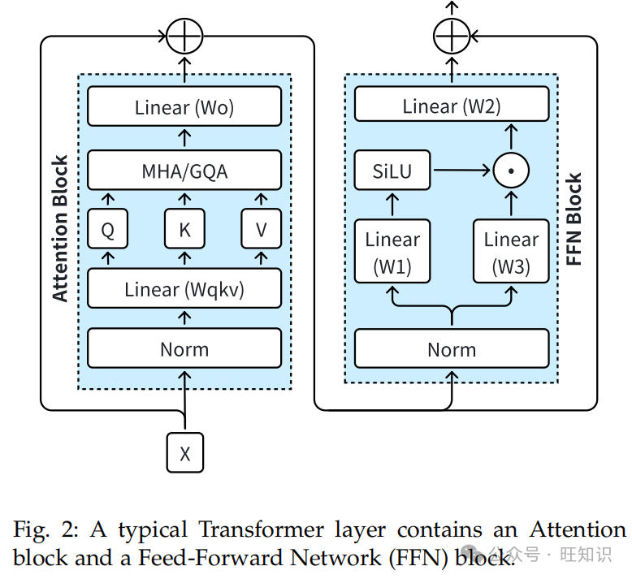

2.2 LLM训练工作负载特性
---------------

> LLM训练工作负载的特性与传统的深度学习工作负载显著不同，主要是因为它们的复杂性和规模。这些独特的特性影响训练系统设计、性能、可扩展性和资源利用率。在这里，我们强调LLMs的关键差异和要求。

**(1) 同质模型架构。**与以往采用不同模型架构（例如，LSTM \[16\]，CNN \[17\]）执行不同任务的DL工作负载不同，LLMs主要使用Transformer架构\[10\]。像GPT \[5\]、LLaMA \[6\]、InternLM \[18\]和MOSS \[19\]这样的模型都共享这一共同基础。这种架构的统一性为针对特定模型架构优化系统性能提供了重要潜力。

**(2) 前所未有的规模和训练时长。**LLM训练以前所未有的规模运行，通常使用具有数千亿参数的模型和TB级训练数据集进行更新。这种规模需要在大型GPU集群上进行分布式训练，并在保持高效率方面提出挑战。此外，LLMs的训练可以持续数周或数月，要求强大的容错机制和高效的检查点策略，以防止数据丢失并促进中断训练会话的恢复。

**(3) 专门的软件优化。**为了适应LLMs的巨大模型大小，专门的系统实现了先进的技术来优化执行。例如，Megatron \[20\]和Alpa \[21\]通过混合并行性加速训练。DeepSpeed \[22\]通过集成状态分片优化器减少内存消耗。

**(4) 训练范式的转变。**传统的DL工作负载遵循特定于任务的范式，在特定领域的数据上训练模型以执行特定任务，例如翻译。相比之下，LLMs采用自监督训练方法，在大量数据集上进行训练以创建基础模型，然后适应各种下游任务。这一范式转变代表了模型开发流程的实质性变化，包括预训练和对齐阶段，并且与以前的DL工作负载相比，产生了不同的工作负载特性。从数据中心的角度来看，LLM开发涉及许多与预训练相关的小规模工作负载，包括对齐（即微调）和定期评估工作负载\[23\]。

2.3 LLM训练挑战
-----------

> LLM训练工作负载的独特特性带来了在开发高效训练系统和基础设施方面的重大挑战。这些挑战主要表现在三个关键领域：可扩展性、效率和可靠性。每个挑战都直接源于LLMs的大规模和其训练过程的复杂性，需要创新解决方案，推动分布式计算和机器学习系统的界限。下面，我们详细讨论这些挑战及其对LLM训练的影响：

**(1) 可扩展性。**LLMs的成功在很大程度上归因于它们的规模，随着LLMs变得更大，性能通常会提高\[8\]。然而，模型规模的扩展引入了可观的可扩展性挑战，因为训练LLMs需要越来越大的GPU或专门的AI加速器集群。首先，构建可扩展的基础设施，提供巨大的计算和内存容量是必要的。这涉及设计和部署大量的GPU或专门的AI加速器、连接这些设备的高性能网络，以及能够处理庞大数据集和模型检查点的分布式存储系统。挑战在于确保这些组件在大规模上高效协同工作，管理大规模部署中的热散失、功耗和硬件故障。其次，设计可扩展的训练系统，可以有效地并行使用大量加速器至关重要。这包括设计并行化策略和通信算法，以实现在数千个加速器上近乎线性的可扩展性，同时保持一致的LLM准确性。

**(2) 效率。**LLM训练的巨大计算需求转化为高昂的训练成本，这使得最大限度地提高硬件和软件系统的效率变得至关重要。效率可以通过MFU（模型FLOPs利用率）来衡量，它量化了系统使用可用计算资源的有效性。然而，在大规模上实现高效率仍然是一个重大挑战。例如，LLaMA3在16K GPU上仅实现了38%到41%的MFU\[9\]，突显了随着系统规模扩大，保持高利用率的难度。最大化效率要求在并行性、计算、通信和内存方面进行优化。首先，分布式LLM训练的并行性需要精心设计，以最小化通信需求。其次，优化的计算操作符和较低精度的算术是实现高GPU FLOPS利用率的关键。第三，需要最小化通信开销，以减少GPU空闲时间。最后，需要有效的内存优化，以在现有硬件中容纳LLMs并减少重计算的FLOPs浪费。

**(3) 可靠性。**确保LLM训练在长时间内的可靠性至关重要。由于训练作业可以在大型GPU集群上持续数周到数月，训练失败的可能性增加，需要快速的故障检测和恢复机制，以实现弹性的LLM训练。首先，LLM训练作业可能因各种错误而崩溃，使得在数万个GPU上快速确定确切的故障原因变得困难。其次，LLM训练作业的挂起导致所有GPU由于训练的同步性质而变得空闲，导致显著的浪费。此外，一些复杂异常，如冗余链路故障或落后者，可能不会导致立即崩溃，但可能导致训练减速。这种不稳定性可能导致训练效率降低。为了应对这些挑战，需要强大的异常检测系统，能够检测出灾难性故障和性能下降。此外，实施能够无缝处理节点故障和网络问题的容错训练框架至关重要。

2.4 相关工作
--------

> 这项工作侧重于基于Transformer的LLMs的高效训练系统和基础设施，包括分布式基础设施的设计、并行范式、计算和通信优化、内存管理的有效性和训练系统的弹性。我们还研究了新兴工作负载（如MoE，一种有前景的高效LLM变体）和微调的高效训练系统，微调是调整LLMs能力的必要阶段。然而，这项工作没有涵盖有前途的LLM架构的演变\[24\]、\[25\]以及训练\[26\]、指令调整\[27\]和对齐\[28\]的算法，以实现强大和安全的LLMs。虽然以前的工作\[29\]–\[31\]讨论了LLM训练系统的一些方面，但它们的主要焦点不是高效训练系统和基础设施的设计。Wan等人\[29\]旨在提供模型和数据为中心方法中高效LLM进展的全面视图。Liu等人\[30\]涵盖了LLMs的训练和推理部署技术。Xu等人\[31\]针对LLM开发讨论了资源高效策略，包括算法和系统方面。这项工作还讨论了量化LLM训练和高效LLM微调的方法，但我们专注于系统方法。Zhu等人\[32\]和Han等人\[33\]讨论了压缩和微调LLMs的算法方法。这项工作讨论范围不包括高级优化算法\[34\]和分布式DNN训练系统\[35\]。虽然Liang等人\[36\]广泛回顾了自动并行化方法，它们的重点是一般的DNN，而不是特定的LLMs。

3 LLM训练的基础设施
------------

> 在本节中，我们探讨了用于训练LLMs的基础设施设计，包括加速器、网络和调度系统（见图3）。

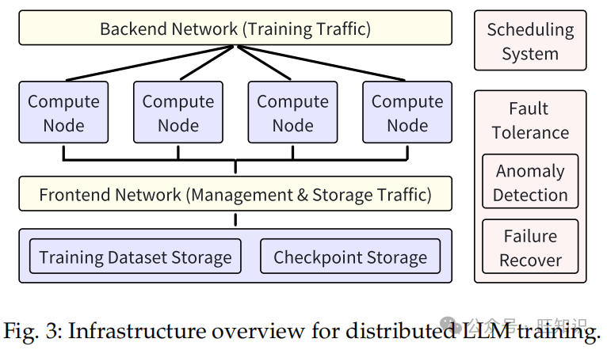

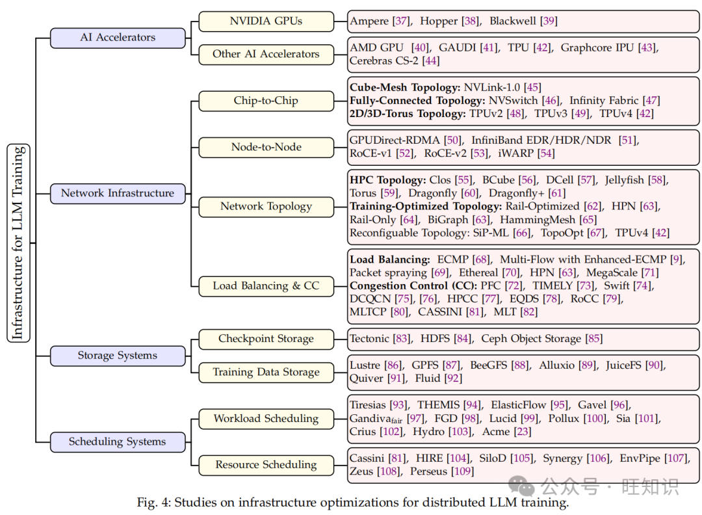

3.1 AI加速器
---------

> LLMs的快速发展在很大程度上得益于GPU和AI加速器的进步，这些加速器对提高模型训练性能至关重要。

### 3.1.1 NVIDIA图形处理单元（GPU）

> NVIDIA GPU已成为分布式LLM训练的重要组成部分，因为它们具有处理并行计算的卓越能力。这些处理器构建有众多紧凑、高效的内核，能够同时执行众多任务。GPU的设计非常适合LLM训练中的矩阵和向量运算。它们支持各种数值精度格式，如FP32、TF32、FP16、BF16、FP8、INT8，甚至是FP4。这使得研究人员能够很好地平衡训练速度和准确性，使LLM训练更加高效\[110\]。NVIDIA的GPU编程语言（即CUDA）使研究人员更容易管理在GPU上并行拆分和处理任务的方式。这有助于研究人员充分利用GPU来训练先进的LLMs。一个典型的GPU由一系列流式多处理器（SM）组成，每个SM包含多个核心，它们共享一个指令单元，但能够并行执行不同的线程。每个SM中的共享内存允许线程之间进行有效的数据交换和同步，这对于优化LLM计算所需的内存访问模式至关重要。此外，GPU配备了高带宽内存（HBM），这加速了数据传输并缓解了计算密集型任务中的内存访问瓶颈。最新的GPU架构，如NVIDIA的Ampere\[37\]、Hopper\[38\]和Blackwell\[39\]，正在不断推动LLM计算的边界。它们提供了增强的内存带宽和容量、每秒浮点运算次数（FLOPS）的增加，以及专门的混合精度计算单元，如Tensor Cores。值得注意的是，NVIDIA的Hopper架构通过引入Transformer Engine\[111\]，这是一个利用混合FP8和FP16精度来加速基于Transformer的LLMs训练的功能。

### 3.1.2 其他AI加速器

> 在AMD GPU上进行分布式LLM训练已成为现实，特别是在Frontier\[112\]上，这是世界上第一台E级超级计算机。每个Frontier节点都配备了8个MI250X\[40\] AMD GPU，每个GPU有64GB的HBM，理论FP16峰值性能为191.5 TFLOPS。这种配置为高效训练万亿参数模型提供了无与伦比的机会。解锁这一潜力的关键在于适应现有的CUDA基础工具和框架到ROCm平台\[113\]、\[114\]。值得注意的是，已经开发了ROCm支持的FlashAttention\[115\]和FlashAttention2\[116\]版本，允许高效执行注意力。各种具有强大计算能力和软件优化的AI加速器已经被开发出来训练LLMs。GAUDI\[41\]提供了一个异构计算架构，包括两个矩阵乘法引擎和一群完全可编程的张量处理核心，能够高效处理LLM训练操作。这个处理器可以使用384个GAUDI2卡训练具有1750亿参数的GPT-3模型\[117\]。Google TPUv4\[42\]超级计算机有4096个芯片，支持LLM训练，平均达到峰值FLOPS的约60%。Graphcore Bow Pod64\[43\]，一个包含64个Bowclass IPUs的机架设置，实现了22 petaFLOPS。它支持使用256个IPUs训练GPT-3模型。Cerebras CS-2\[44\]是一个晶圆级深度学习加速器，包含850,000个处理核心，每个核心提供48KB的专用SRAM内存。它被用来训练Cerebras-GPT，一个开放计算优化的语言模型家族\[118\]。

3.2 网络基础设施
----------

> 通信开销是扩展LLM训练的主要障碍\[119\]、\[120\]。例如，在训练期间减少模型梯度可能导致超过90%的训练时间花在通信上\[121\]。为了解决这个问题，研究社区专注于改善LLM训练的通信基础设施。

### 3.2.1 芯片到芯片通信

> 芯片到芯片通信对于节点内AI加速器之间的数据传输至关重要，这显著影响了LLM训练的效率。传统上，这种通信依赖于PCI Express（PCIe）\[122\]，它采用树形拓扑结构——一个分层结构，多个设备连接到单个根复杂体。多年来，PCIe已经提高了其带宽：PCIe 3.0每条线路提供大约1 GB/s的带宽，对于16条线路的配置总计约16 GB/s；PCIe 4.0将带宽翻倍至每条线路2 GB/s，而PCIe 5.0进一步将其增加到每条线路4 GB/s。尽管这些增强，PCIe在带宽、延迟和可扩展性方面的固有限制使其对LLM训练不太理想\[123\]。为了解决这些限制，像NVLink\[45\]这样的专用芯片到芯片互连越来越多地被用于LLM训练。与传统PCIe相比，这些高级互连通过使用各种拓扑结构：立方体网格、全连接和3D-环面，提供了显著更高的带宽和更低的延迟。此外，共享内存模型、专门的通信协议和同步机制也起着至关重要的作用。

**立方体网格拓扑。**NVLink-1.0\[45\]为GPU提供了直接和高速的连接，每个链路提供160 GB/s的双向带宽。这种架构能够在四个GPU之间形成平面网格结构，在八个GPU之间形成立方体网格拓扑，可以配置成DGX-1服务器。这种立方体网格配置，尽管不是全到全连接，但显著提高了GPU上的数据通信效率和训练性能。

**全连接拓扑。**许多互连使用基于交换机的或基于P2P的全连接拓扑来提高芯片到芯片通信性能。NVIDIA使用NVSwitch\[46\]实现GPU之间的基于交换机的全到全互连。在DGX-2\[124\]系统中，六个NVSwitch完全连接了十六个GPU，提供了任何两个GPU之间300 GB/s的双向带宽。这个带宽在NVSwitch 2.0中增加到600 GB/s，在NVSwitch 3.0中进一步增加到900 GB/s。Intel、AMD和华为Ascend使用基于P2P的全连接拓扑为他们的加速器，其中每个芯片使用以太网或无限Fabric\[47\]直接连接到同一节点中的每个其他芯片。与传统的基于交换机的拓扑相比，基于P2P拓扑中两个GPU之间的带宽受到直接连接链路带宽的限制。

**2D/3D-环面拓扑。**Google的TPU系统使用环面网络拓扑\[59\]进行芯片到芯片通信。它通过将每个TPU芯片连接到其四个相邻邻居在一个网格中，边缘包裹，形成一个环形结构。这种架构设计确保了由于芯片之间存在多个直接路径，因此具有低延迟和高带宽。具体来说，TPUv2\[48\]超级计算机采用了16x16的2D环面配置，包含256个芯片，通过高速芯片间互连（ICI）链路相互连接。TPUv3\[49\]超级计算机使用32x32的2D环面，包含1024个芯片。从2D环面设计发展而来，TPUv4\[42\]超级计算机将计算资源组织成多机器立方体，具有3D环面拓扑。每个TPU机器包含四个芯片，以2x2x1网格排列，通过ICI链路相互连接。十六个这样的TPU机器组合成一个数据中心机架，其中机架内的ICI链路相互连接，形成一个4x4x4网格，从而形成一个3D环面结构。这种高级配置显著提高了通信效率和可扩展性，特别有利于LLM训练。

### 3.2.2 节点到节点通信

> 远程直接内存访问（RDMA）\[54\]实现了节点间高速、低延迟的数据传输。RDMA允许直接从一个计算机的内存访问另一个计算机的内存，而不涉及任一节点的操作系统。GPUDirect-RDMA\[50\]通过启用跨不同节点的GPU之间的直接通信来增强这一过程，完全绕过CPU。这项技术对LLM训练特别有益，因为它加速了模型参数和梯度的同步。两种最流行的RDMA技术是InfiniBand\[51\]和基于汇聚以太网的RDMA（RoCE）\[52\]。InfiniBand是一种高速、低延迟的网络技术，广泛用于HPC（高性能计算）环境，如Eagle超级计算机\[125\]。这项技术需要专用的网络基础设施，反映了它在提供卓越性能方面的设计重点。多年来，InfiniBand在带宽能力方面有了显著的演进，从EDR（增强数据速率）的100 Gbps发展到HDR（高动态范围）的200 Gbps，最近发展到每个链路的NDR（下一个数据速率）400 Gbps\[126\]。RoCE利用现有的以太网基础设施提供RDMA能力。这种方法提供了一种更具成本效益和更易于部署的解决方案，特别是在已经使用以太网的数据中心。RoCE有两个版本：RoCE-v1\[52\]，作为以太网链路层协议运行，和RoCE-v2\[53\]，通过UDP运行。行业领导者如字节跳动和Meta已经采用了这些技术来扩展LLM训练。另一种RDMA协议，互联网广域网RDMA协议（iWARP）\[54\]，通过TCP/IP网络启用RDMA。然而，由于其相对较低的性能，iWARP通常不用于分布式LLM训练\[127\]。

### 3.2.3 网络拓扑

> 在LLM训练集群中，网络架构被结构化为前端和后端组件（见图3）。前端网络处理各种流量，如作业管理、模型推理和存储活动，而后端网络专门用于训练过程中产生的大量流量。我们在优化LLM训练的主要关注点在于提高后端网络的性能和效率，以便将AI加速器扩展到数万个。

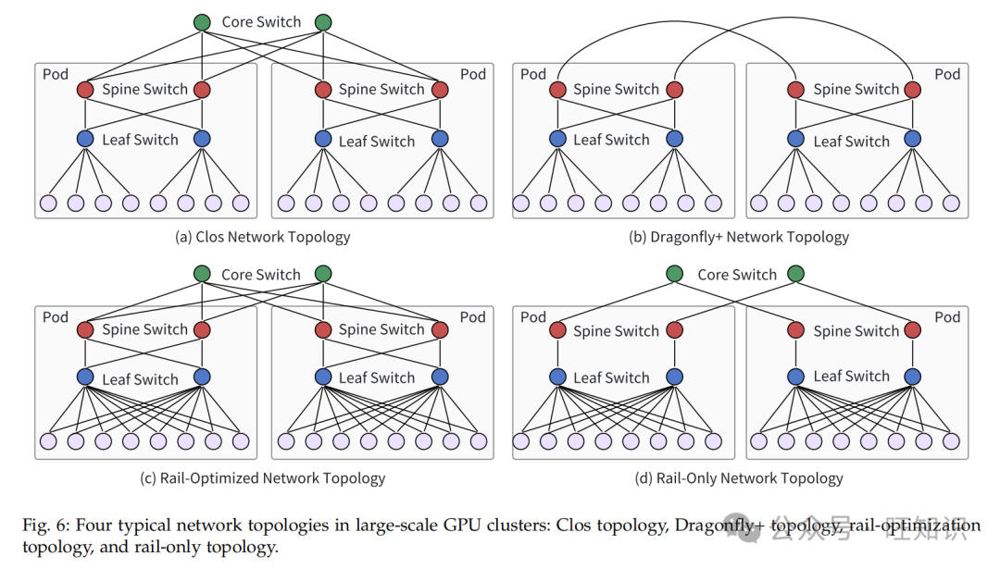

**HPC网络拓扑。**传统的HPC环境拓扑也可以在AI集群中用于分布式训练，如Clos\[55\]、BCube\[56\]、DCell\[57\]、Jellyfish\[58\]、Torus\[59\]、Dragonfly\[60\]和Dragonfly+\[61\]。Clos网络架构，通常被称为Fat-Tree拓扑，在LLM训练集群中广泛使用。在基于Clos的集群中，每台服务器都配备了一个或多个NIC，并被组织成连接到叶交换机的机架。这些叶交换机连接到脊柱交换机，提供机架间的连通性，并形成一个豆荚。豆荚进一步通过核心交换机相互连接，促进集群内服务器之间的任何到任何通信。例如，Meta的最后一代GPU集群架构，支持多达24,000个GPU，由八个豆荚组成，它们之间具有全脂带宽，并在核心层使用7:1的过度订阅比率\[9\]。Meta使用这个集群上的24,000个GPU来训练Llama 3 405B。

**训练优化拓扑。**许多网络拓扑是与分布式训练算法共同设计的。铁路优化拓扑\[62\]增强了GPU到叶交换机的连接。在每个铁路中，跨不同服务器具有相同索引的GPU通过同一个叶交换机相互连接。这种配置通过减少数据流之间的网络干扰来提高集体通信性能。SuperPod架构使用了一个铁路优化网络，能够连接超过16,000个GPU\[128\]。字节跳动在其MegaScale系统设计中采用了三层铁路优化网络，连接了超过10,000个GPU\[71\]。然而，铁路优化网络设计可能效率较低，因为它们需要将GPU连接到远处的交换机，这需要昂贵且耗电的光收发器。这些光组件增加了功耗和热量，导致网络故障率更高，这对于分布式LLM训练来说是重要的。阿里巴巴进一步优化了铁路优化拓扑，采用了一个名为HPN\[63\]的2层双平面架构。这种架构采用了最新的51.2Tbps单芯片交换机，支持一个tier1网络中的1,000个GPU，并且在一个豆荚内支持多达15,000个GPU。对GPT/OPT-175B模型训练的网络流量分析显示，99%的GPU对不承载任何流量，并且不到0.25%的GPU对处理流水线/张量并行和数据并行流量\[64\]。基于这些发现，铁路唯一拓扑\[64\]在铁路优化网络中消除了不同铁路之间的连接。每个铁路通过专用但独立的Clos网络连接。不同铁路上的GPU之间的通信通过通过内部芯片到芯片互连转发数据来管理。这种方可以有效降低成本，同时保持性能。HammingMesh\[65\]将GPU组织成具有2D-环面拓扑的组，并通过稀疏连接的交换机连接这些2D-环面组。这种设计旨在在不牺牲训练性能的情况下节省成本。鉴于GPU仅通过PCIe连接，BiGraph\[129\]提出了一种新的网络架构，将节点内GPU通信导出到节点外，绕过PCIe带宽瓶颈。它采用两层网络，通过Clos架构相互连接，具有支持应用控制流量路由的唯一最短路径。

**可重配置拓扑。**可重配置网络可以动态调整，以优化通信模式，提高训练性能。它们通常使用光交换和自定义配置来提高网络基础设施的带宽利用率、灵活性和可扩展性。在硅光子（SiP）接口的驱动下，SiP-ML\[66\]推进了两个主要架构：SiP-OCS和SiP-Ring。SiP-OCS采用完全连接的配置，通过使用商业上可获得的光电路交换机，通过Tbps SiP接口将GPU连接到所有交换机，从而最大化带宽。相反，SiP-Ring利用无交换机的环形配置，通过在SiP接口中集成微环谐振器来减少重配置延迟。Wang等人提出了TopoOpt\[67\]，用于共同优化网络拓扑和并行化策略，在分布式训练中。这种方法不仅优化了计算和通信需求，还解决了网络拓扑的物理层。TPUv4\[42\]具有光学电路交换机（OCS），允许动态重配置基于3D-环面的互连拓扑，优化了LLM训练的多样化和密集通信模式的数据流。例如，使用512个芯片，TPUv4提供了4x4x32或8x8x8等3D-环面拓扑的灵活性。

### 3.2.4 负载均衡和拥塞控制

**负载均衡。**LLM训练的网络流量特点是少量的大象流。具体来说，LLM训练表现出由于梯度同步导致的网络流量的周期性突发。每个突发都需要大量的网络带宽。此外，参与LLM训练的每个计算节点生成的连接非常少\[63\]。传统的负载均衡技术，ECMP（等成本多路径路由）\[68\]，使用哈希算法将流量均匀分布在等价路径上，例如在Clos拓扑中从叶交换机到脊柱交换机的路径。然而，这种基于哈希的方案在处理LLM训练流量时是低效的，因为它们由少量的大象流组成。当多个大象流被路由到同一链路时，可能导致拥塞和高延迟。为了解决大规模GPU集群中的负载均衡挑战，已经开发了各种策略。在Llama 3 405B训练期间，集体库在两个GPU之间建立了16个网络流，而不是单个流，从而减少了每个流的流量并增强了负载均衡的机会\[9\]。此外，增强的ECMP（E-ECMP）协议通过在RoCE数据包头中对更多字段进行哈希，有效地在不同的网络路径上分布这16个流。数据包喷涂\[69\]将来自一个流的数据包分散到所有可用的并行链路上，这可能导致数据包乱序。NIC需要处理乱序的RDMA数据包。基于LLM训练的流量模式，Ethereal\[70\]展示了贪婪地为每个流分配路径可以均匀地将负载分布在所有网络路径上，并解决ECMP哈希冲突问题。在大规模GPU集群中，HPN\[63\]通过识别精确的不相交等路径并在集体通信库内平衡负载来实现高效的负载均衡。MegaScale\[71\]表明，铁路优化拓扑也可以缓解ECMP哈希冲突。

**拥塞控制。**无损传输在RDMA集群中至关重要。基于优先级的流控制（PFC）\[72\]是一种流控制机制，可以防止数据包丢失。当PFC启用的下游设备上的队列发生拥塞时，设备会指示上游设备在队列中停止流量，从而确保零数据包丢失。由于PFC是一种粗粒度机制，它可能导致头部阻塞\[130\]，这显著降低了网络吞吐量。为了解决这些挑战，开发了各种通用拥塞控制方案。这些技术包括TIMELY\[73\]、数据中心量化拥塞通知（DCQCN）\[75\]、\[76\]、Swift\[74\]、高精度拥塞控制（HPCC）\[77\]、边缘排队数据报服务（EQDS）\[78\]和鲁棒拥塞控制（RoCC）\[79\]。这些方案监控网络拥塞，调整数据速率以缓解拥塞，并恢复速率以最小化吞吐量降低。当有并发训练作业时，许多拥塞控制方案利用突发性和周期性的流量模式有效地交错网络流量。MLTCP\[80\]基于关键见解交错作业的通信阶段：训练流量应该根据每次训练迭代中发送的字节数调整其拥塞窗口大小。CASSINI\[81\]通过考虑不同作业的通信模式来优化网络链接上的作业放置。MLT\[82\]利用LLM训练的特点，其中早期层的梯度不如后期层的梯度重要，较大的梯度比较小的梯度更重要。因此，在通信拥塞的情况下，MLT根据它们在开关级别中包含的梯度的重要性优先排队或丢弃数据包，以缓解通信拥塞问题。

3.3 存储
------

> 存储系统在分布式LLM训练中起着至关重要的作用，需要满足几个关键要求。首先，它应该与GPU的计算能力相一致，以最大化它们的利用率，并避免由于存储瓶颈造成的资源浪费。其次，它应该支持大规模结构化和非结构化训练数据集的存储，并在分布式处理环境中具有可扩展性。此外，模型检查点的存储和检索在LLM训练中提出了挑战，要求系统满足由模型大小和训练时长决定的写入和读取带宽。最后，存储系统应该满足传统的企业级要求，如数据保护、高可用性和安全性。

### 3.3.1 检查点存储系统

> 在LLM训练中，模型检查点的尺寸非常庞大。随着参数数量的增加，需要写入的数据量也在增加，这要求存储系统提供更大的写入带宽。例如，对于一个具有700亿参数的LLM，检查点大小为980GB。为了管理大规模的GPU数据中心中的模型检查点，已经部署了多种存储系统。Meta的分布式文件系统Tectonic\[83\]能够使数千个GPU同时保存和加载模型检查点，为广泛的训练操作提供高效和可扩展的存储解决方案\[131\]。在字节跳动，HDFS\[84\]被用于集中式模型检查点维护，确保规模上的一致性和可靠性\[71\]。为了缓解检查点恢复期间的带宽瓶颈，一种常见的方法是指定一个单独的工作器从HDFS读取检查点分区，然后将其广播给共享相同数据的其他工作器。分布式对象存储，如Ceph对象存储\[85\]，由于它们没有层次目录树或名称空间，简化了一致性维护，从而提供了更容易的可扩展性。由于这些优势，对象存储已经广泛用于模型检查点存储。

### 3.3.2 训练数据存储系统

> LLM训练的原始数据集是巨大的。LLaMA 3在超过15万亿个token上进行了训练，这比LLaMA 2的数据集大七倍以上\[6\]。每个token需要大约2个字节，相当于大约30TB的数据。准备训练数据集涉及广泛的预处理步骤，包括数据抓取和清洗，需要大量的实验。通常，在这些步骤中处理的数据量超过最终训练数据集大小的100倍\[132\]。例如，WanJuan-CC数据集\[132\]选择性地提取了大约60亿份文档，生成了大约1万亿个高质量token，相当于2TB的数据大小，在丢弃了99%的原始数据后。因此，预计LLM训练的总数据量将超过数十PB。并行文件系统，如Lustre\[86\]、GPFS\[87\]和BeeGFS\[88\]，经常部署在领先的高性能计算系统上，以确保高效的I/O、持久存储和可扩展的性能。这些系统也广泛用于训练集群中的数据加载，为高效处理大规模训练数据提供了必要的基础设施。此外，对于文件系统来说，使工程师能够在使用数千个GPU的作业上执行交互式调试至关重要，因为代码更改需要立即对所有节点可访问\[131\]。在大多数LLMs的训练中，每个token通常只遇到一次。然而，使用数据缓存仍然至关重要，以缓解数据加载期间的I/O瓶颈。这种策略涉及从较慢的后端存储预取训练数据到较快的缓存存储。Alluxio\[89\]和JuiceFS\[90\]通过从底层存储系统（如HDFS或对象存储）有效缓存训练数据来增强LLM训练。Quiver\[91\]支持跨多个作业和用户操作同一数据集时的缓存数据的透明重用。Fluid\[92\]利用Alluxio进行数据缓存，并结合了一种机制，根据I/O条件启用缓存的即时自动扩展。

3.4 调度
------

> LLM训练工作负载通常在大规模多租户基础设施（例如，GPU集群、公共云）上运行，其中用户共享集群资源。有效的调度机制对于管理这些工作负载至关重要，确保资源的高效利用和任务执行\[133\]。

> 与任务级调度（例如，流水线调度\[134\]–\[136\]）不同，它专注于单个作业执行的细粒度优化（§4.1.3），集群级调度旨在优化整个集群的资源分配和任务调度。我们根据它们主要优化的方面，将现有的集群级调度系统分为两种类型：工作负载调度和资源调度。

### 3.4.1 工作负载调度

> 近年来，针对DL训练工作负载的调度器已经被积极探索\[93\]–\[95\]，\[137\]–\[141\]。为了提高资源利用率，通常实现了三个高级功能：(1)异构感知调度器（例如，Gavel\[96\]，Gandivafair\[97\]）专注于在不同GPU代之间优化作业分配；(2)作业打包调度器（例如，FGD\[98\]，Lucid\[99\]）启用细粒度的GPU共享，充分利用硬件能力；(3)自适应缩放调度器（例如，Pollux\[100\]，Sia\[101\]）动态调整GPU数量以及训练超参数，以加速训练进度。然而，这些调度器是为通用DL工作负载设计的，可能不直接适用于LLMs，因为LLM工作负载具有独特的特性\[23\]。为了更好地管理LLM工作负载，一些最近的研究提出了针对LLMs的系统。Crius\[102\]联合考虑了混合并行性（§4.1）和异构集群中的硬件亲和性。它调查了在集群调度级别集成自适应并行性配置的工作流程效率，为同时提高多个LLMs训练效率提供了重要机会。为了实现LLMs的高效超参数调整，Hydro\[103\]将模型缩小到较小的代理模型进行超参数搜索，然后融合多个模型到一个单一实体中，以提高硬件利用率。此外，Hydro通过将它们与流水线启用的LLM预训练任务交错，扩展了调整工作负载的资源，有效地利用了流水线泡沫。Acme\[23\]进一步对LLM开发工作流程的工作负载混合进行了表征，并提出了一个系统，以有效调度与LLM训练相关的相关作业，包括解耦的评估调度，以便及时提供模型质量反馈，以及涉及LLM的故障诊断和自动恢复。

### 3.4.2 资源调度

> 除了工作负载调度外，相关资源调度（例如，CPU、内存和网络）是集群级管理的另一个关键方面。对于网络，Cassini\[81\]通过使用亲和图确定时间偏移值来调整不同作业的通信阶段，从而在不同作业的上下阶段期间交错带宽需求。HIRE\[104\]引入了一个创新的数据中心交换机的网络计算调度系统，显著减少了网络绕路和尾部放置延迟。对于存储，SiloD\[105\]将数据缓存和远程I/O视为一级资源进行联合分配，显示出显著的吞吐量改进。对于CPU和内存，Synergy\[106\]通过优化CPU核心分配而不是依赖于GPU成比例分配，提高了训练效率。此外，一些工作专注于节能。EnvPipe\[107\]利用了流水线中的时间扩展，通过降低SM频率来节省能源，同时拉伸了流水线单元的执行时间。Zeus\[108\]自动配置批量大小和GPU功率限制，以提高训练期间的能效。Perseus\[109\]引入了一个高效的基于图割的迭代算法，以获得大型模型训练作业的迭代时间-能量Pareto前沿。

4 LLM训练的并行策略
------------

> LLMs不断增长的规模需要大量的计算资源和内存容量。分布式训练，利用大规模HPC集群，已成为有效训练这些模型的关键方法。在本节中，我们调查了提出用于提高HPC集群LLM训练利用率的各种并行策略。我们将这些方法归类为三个主要组：混合并行、自动并行和异构并行。混合并行结合了多种手工制作的并行化策略，如数据并行、张量并行、流水线并行、序列并行和专家并行。自动并行根据模型和硬件特性自动确定最优的并行化策略。异构并行利用硬件或模型中的异构性进行有效训练。这包括利用不同类型的加速器或利用单个模型内的异构性（例如，RLHF训练）来提高HPC集群上的整体训练效率。大多数当今最先进的并行化策略采用单一程序多数据（SPMD）编程模型，类似于MPI范式\[239\]，其中相同的程序在多个处理器上运行，每个处理器处理不同的数据\[225\]。例如，数据、模型和序列并行使用SPMD编程模型。这种方法确保了操作的一致性和一致性，使其非常适合大规模、分布式训练环境。一些策略探索打破SPMD的限制，通过多程序多数据（MPMD）模型进一步提高资源利用率，其中不同的程序（或程序的不同部分）在不同的处理器上运行，处理数据或模型的不同部分\[225\]。例如，流水线并行在不同的设备上运行LLM的不同部分。此外，自动并行和异构并行可以利用SPMD和MPMD模型来增加资源利用率。因此，我们根据并行发生的维度以及使用的计算设备是同构还是异构，而不是关注底层编程模型，来讨论这些方法。

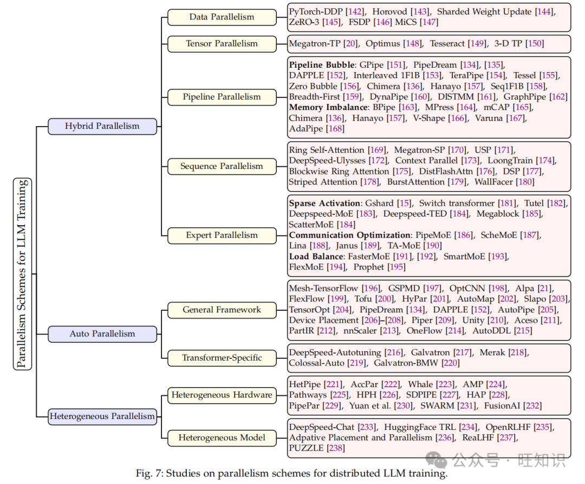

4.1 混合并行
--------

> 混合并行通常结合多种手工制作的并行化策略，以划分LLM的不同可并行化维度。这些策略包括数据并行、张量并行、流水线并行和序列并行，如图8所示。数据并行、张量并行和流水线并行的组合也称为3D并行。

### 4.1.1 数据并行

> 数据并行是分布式训练中最常用的并行化策略，由于其高可扩展性和易于实现。它遵循单一程序多数据（SPMD）编程模型。数据并行沿批量维度划分输入训练数据，每个GPU处理其分配的数据段，如图8(a)所示。在整个训练过程中，数据首先通过完整的模型权重逐层进行前向计算，然后按相反的顺序执行反向计算。每层生成的梯度将通过集体通信操作跨所有GPU聚合以进行优化器更新。数据并行包括各种分片策略，这些策略显著影响内存占用和通信开销。假设全局世界大小为W（即设备数量），引入分片因子F来控制使用的分片策略\[146\]，定义为参数被划分的设备数量（1 ≤ F ≤ W）。我们有以下情况：

**全复制（F = 1）：**这种分片策略被简化为普通的数据并行。Pytorch-DDP\[240\]和Horovod\[143\]在所有设备上完全复制模型，并使用All-Reduce进行梯度聚合。它们还将梯度划分为小桶，以重叠梯度通信和反向计算。全分片（F = W）。这种分片策略具有最低的内存消耗，但通信开销最大（比普通数据并行多1.5倍）。全分片策略完全分片模型，每个设备只持有1/W的模型参数。完整的权重和梯度在计算前按需通信和恢复，并在之后立即丢弃。ZeRO-3\[145\]采用每个参数分片来分片完整模型，并分别使用All-Gather和Reduce-Scatter进行无分片和分片通信。分片权重更新\[144\]也采用每个参数分片，但更侧重于在所有设备上分片冗余的参数更新计算。FSDP（完全分片数据并行）\[146\]通过在模块单元粒度上分片模型参数来实现相同的功能，并提供更用户友好的API。

混合分片（1 < F < W）。在这种策略\[146\]中，所有设备被划分为N×M设备网格。模型参数沿网格的N维度分片，并沿M维度复制。MiCS\[147\]调用All-Gather集体操作来收集分片参数，并使用All-Reduce聚合梯度。FSDP\[146\]用Reduce-Scatter替换All-Reduce，以减少内存和通信开销。与全复制和全分片相比，混合分片更灵活，可以通过调整F来提供内存消耗和通信开销之间的权衡，基于模型架构和硬件限制。

### 4.1.2 张量并行

> 张量并行（图8(b)），也称为层内模型并行，是一种提出的技术，用于在多个GPU上训练LLMs。它沿多个维度划分每层的参数张量，有效地将模型参数分布在可用的GPU上。与数据并行不同，张量并行通常需要高带宽连接进行通信，因此更常用于单个GPU节点。张量并行可以按划分的维度分为1-D\[20\]、2D\[148\]、2.5-D\[149\]和3-D\[150\]并行。基于Transformer的LLMs的MLP和自注意力模块中都有两个参数矩阵。Megatron-LM\[20\]首先采用1D张量并行将第一个参数矩阵沿其列划分，第二个参数矩阵沿其行划分。它复制每个划分模块的输入和输出张量，并引入两个All-Reduce集体通信，以适应多个GPU上的LLM。受到可扩展通用矩阵乘法算法（SUMMA）\[241\]和Cannon算法\[242\] 2-D并行矩阵乘法的启发，Optimus\[148\]进一步将输入和参数张量沿2个维度划分，以提高1-D张量并行的通信和内存效率。Tesseract\[149\]扩展了2.5-D矩阵乘法方法\[243\]，该方法被提出以提高Cannon算法的效率，用于LLM训练，并提出了2.5-D张量并行，以克服由于模型尺寸增加而导致的不必要通信过多。3-D张量并行\[150\]采用并改进了3-D并行矩阵乘法算法\[244\]，用于线性操作，并在多个设备上实现LLM训练的完美负载平衡。

### 4.1.3 流水线并行

> 流水线并行（图8(c)) \[151\]，也称为层间模型并行，被提出以适应大型模型在多个GPU上，特别是在不同节点上的分布。流水线并行将模型的层划分为多个阶段，每个阶段由模型中的一组连续层组成，并映射到一组GPU。与通常需要高带宽连接进行通信的张量并行不同，流水线并行只需要在指定的切割点交换中间张量，因此通信需求较少。因此，流水线并行适用于在连接带宽较小的多个GPU节点上扩展LLM训练。例如，Strati等人\[245\]采用流水线并行充分利用地理分布式资源，以克服GPU短缺的问题。由于不同阶段的数据依赖性，流水线并行通常将输入数据拆分为多个微批次以实现流水线化，从而有效训练大型模型。然而，它带来了两个显著问题。首先，流水线泡沫问题由于等待前一阶段的输出而降低了GPU的利用率。其次，不同阶段之间的内存消耗不平衡，因为前几个阶段需要持有更多的活动微批次，以实现更好的流水线化和更高的利用率。我们下面详细说明每个问题。

**流水线泡沫。**高效的微批次调度算法可以减少流水线泡沫。GPipe\[151\]引入了一个填充-排空调度，一次性注入所有微批次进行前向传递执行，然后是反向传递。Gpipe由于前向和反向传递的预热和冷却，引入了显著的流水线泡沫。PipeDream\[134\]，\[135\]引入了一个1F1B（1个前向1个反向）调度，一旦相应的前向传递完成，就执行微批次的反向传递，以减少异步场景中的流水线泡沫。DAPPLE\[152\]采用早期反向调度，在每个阶段的开始首先注入固定数量的微批次，然后通过轮询交错前向和反向传递。交错1F1B\[153\]适应1F1B调度，但为每个GPU分配多个阶段（即循环流水线放置）。流水线泡沫以更高的通信和峰值内存消耗为代价减少了。Chimera\[136\]引入了一个双向流水线来减少泡沫，通过权重复制。Hanayo\[157\]进一步提出了一个波浪形流水线，将多个对称阶段分配给一个GPU，以提高流水线利用率。零泡沫\[156\]将反向计算分为两部分：激活和参数梯度计算。它按1F1B安排前向和激活梯度计算，然后用参数梯度计算填充泡沫，这以更高的峰值内存消耗减少了泡沫。Breadth-First\[159\]在循环流水线放置中一次性运行所有微批次，以减少与分片数据并行结合时的通信开销。TeraPipe\[154\]沿序列维度拆分微批次，并利用更细粒度的标记并行来减少流水线泡沫

> 。然而，TeraPipe的内存开销很大，因为它基于GPipe调度。Seq1F1B\[158\]将序列拆分成块，并使用1F1B调度来降低峰值内存消耗，同时实现低流水线泡沫率。DynaPipe\[160\]使用动态微批次方法对具有可变长度输入的LLMs进行多任务训练。它引入了一种内存感知的自适应调度算法和提前通信计划，以进一步减少流水线泡沫率。Tessel\[155\]是一个两阶段方法，包括重复模式构建和调度完成，以自动搜索指定分区策略的高效流水线调度。DISTMM\[161\]启动双倍微批次以绕过由多模态训练的大批量需求引起的依赖性障碍，从而减少空闲周期。GraphPipe\[162\]保持DNN图拓扑结构，并将其划分为可以同时执行的阶段，以提高流水线利用率并减少内存消耗。

**内存不平衡。**流水线并行通常向开始阶段注入更多的微批次，以提高流水线利用率，导致这些阶段的激活内存消耗更高。为了解决这个问题，BPipe\[163\]和MPress\[164\]采用D2D（设备到设备）传输，在运行时将高负载GPU上的中间激活张量交换到负载较轻的GPU。MPress还结合了激活重计算以减少内存占用。Chimera\[136\]引入了一个双向流水线，将两个不同方向的流水线结合起来，以实现更平衡的内存消耗。每个GPU持有两个对称阶段，导致权重复制。Hanayo\[157\]将双向流水线变为两个数据并行流水线，通过对称地将多个阶段分配给一个GPU来消除权重复制，并实现平衡的内存消耗。V-Shape\[166\]将模型划分为设备数量两倍的阶段，将两个阶段的一半以相反顺序放置。通过变化阶段之间的偏移量，V-Shape在峰值内存消耗和泡沫利用率之间做出权衡。mCAP\[165\]使用增量分析方法，根据峰值内存使用情况在GPU上均匀划分模型。峰值内存消耗限制了流水线并行中活动的微批次数量，从而限制了其效率。激活重计算可以有效地减少峰值内存消耗。Varuna\[167\]结合了流水线并行和激活重计算来实现这一目标。它为给定的流水线设计了基于静态规则的调度，并列出了机会主义策略，以隐藏抖动并减少泡沫。静态调度是基于包括激活重计算时间、激活内存管理和反向计算优先级在内的约束生成的。为了解决内存不平衡问题并降低重计算开销，AdaPipe\[168\]采用了自适应重计算，支持不同阶段的不同重计算策略，并根据1F1B调度自适应分区，以平衡每个阶段的计算。

### 4.1.4 序列并行

> 当今LLMs的上下文窗口迅速增长，最强大的LLM可以支持数百万token\[7\]。这种超长序列导致LLM训练的内存和计算需求显著增加：激活的内存占用线性增加，注意力机制的复杂度呈二次方增长。在反向传播中重新计算激活可以减少峰值内存消耗，但也引入了显著的开销（全部重新计算时为30%）。大张量并行度引入了显著的通信开销。序列并行（图8(d)) \[169\]，\[170\]被提出以适应长序列训练，并在内存容量内高效地在多个GPU上分布计算。它将输入数据沿序列维度划分为多个块，每个块被送入一个GPU进行计算。由于序列并行复制了模型参数，因此通常与张量和流水线并行结合使用，以扩展LLM训练。当与张量并行一起使用时，序列并行在多个GPU上分布了注意力的内存和计算，但引入了非张量并行区域内的冗余内存消耗和计算。Megatron-SP\[170\]沿着序列维度拆分这些计算，减少了冗余激活计算和内存消耗，而没有增加通信。尽管序列并行在多个GPU上划分了内存、计算和通信，但二次因果注意力在训练效率方面仍然存在显著挑战，包括键-值张量通信开销、IO感知注意力计算开销和由于因果注意力掩码导致的GPU之间负载不平衡。大多数序列并行方法的注意力是基于环形的\[169\]，\[173\]，\[175\]，\[176\]，\[178\]，\[179\]。Ring Self-Attention\[169\]利用序列并行，并以环形通信方式计算自注意力，以扩展LLM训练的上下文窗口。它首先在GPU之间传输键张量以计算注意力分数，然后根据传输的注意力分数和值张量以类似方式计算自注意力输出。DistFlashAttn\[176\]同时传输键-值张量块，利用IO感知FlashAttention\[115\]内核，并通过用早期token的空闲周期填充后期token的计算来平衡不同GPU的计算。Megatron Context Parallel\[173\]也利用FlashAttention内核，并消除了由低三角因果掩码引起的不必要计算。它通过交换一半的块与对称GPU，进一步平衡了GPU之间的计算。DistFlashAttn和Context Parallel还在单独的CUDA流中重叠了键-值张量通信和注意力计算。Striped Attention\[178\]通过为每个GPU分配一个在序列中均匀分布的token子集来解决不平衡问题，而不是连续的块。BurstAttention\[179\]在每个GPU上使用FlashAttention计算注意力，并使用双缓冲区来重叠通信和计算。Blockwise Ring Attention\[175\]将Ring Self-Attention\[169\]扩展到块状注意力，通过以小块计算注意力来减少内存占用。受到N体模拟的启发，WallFacer\[180\]首先将GPU划分为子组，并通过异步AllGather在每个子组内复制查询和键-值张量。注意力计算利用多个环形P2P通信来提高效率。最后需要一个异步ReduceScatter来分发注意力输出。DeepSpeed-Ulysses\[172\]与以前的基于环的方法不同，通过拆分头维度而不是序列维度，并利用All-to-All将分区维度从序列转移到头。DeepSpeed-Ulysses可以与现有的注意力实现（例如，FlashAttention）无缝结合，并且GPU之间的工作负载自然平衡。然而，DeepSpeed-Ulysses的并行度受到头数的限制，特别是对于使用MQA\[11\]和GQA\[12\]的LLMs。LoongTrain\[174\]和USP\[171\]是并发工作，集成了DeepSpeed-Ulysses和Ring Attention的优势。它们将GPU组织成二维网格，形成混合的ulysses和ring风格的进程组。在训练期间，它们首先在ulysses组之间执行All-to-All以将分区从序列维度切换到头维度，然后在ring组中使用Ring-Attention进行注意力计算。LoongTrain进一步提出了Double-Ring-Attention，以充分利用节点间通信的可用带宽，并重叠通信与计算。DSP\[177\]根据多维变换器（如DiT\[246\]）的计算阶段动态切换并行维度。

### 4.1.5 专家并行

> Mixture-of-Experts (MoE)目前是LLMs中最受欢迎的稀疏模型。虽然MoE显著增加了LLMs中的参数数量，但由于条件计算，它并没有大幅增加计算成本\[247\]。MoE的基本框架，如图9所示，由多个专家网络组成，这些网络处理不同的训练数据子集，以及一个门网络，该网络应用路由算法将输入token分配给不同的专家网络。MoE能够训练具有超过万亿规模参数的大型模型，并且声称已在流行的LLM模型中使用，如Mixtral 8x7B\[248\]和DeepSeek2\[13\]。

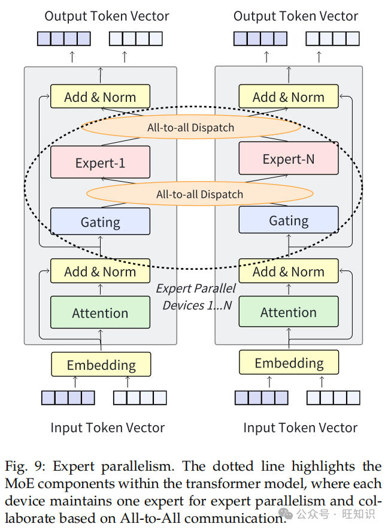

**稀疏激活。**随着模型大小的增加，并非所有专家都能适应并训练在单个设备上。因此，GShard\[15\]将MoE的思想扩展到分布式设置中的Transformers，专家分布在不同的工作器上，并通过All-to-All通信进行协作，如图9所示。随后的专家并行研究通常遵循相同的范式。例如，Switch Transformer\[181\]在T5模型上结合了分布式MoE训练的设计。但与GShard使用的前2个路由算法不同，Switch Transformer将每个token路由到仅有的前1个专家，以最大化计算效率。此外，DeepSpeed-MoE\[183\]提出了一种新的分布式MoE架构，它在每个工作器中应用共享专家，并将更多的专家放置在更深层，以平衡通信成本与训练精度。专家并行可以有效地与常规的3D并行集成。例如，GShard、Switch Transformer和DeepSpeed-MoE都把专家并行视为混合并行的正交维度。为了有效的混合训练，DeepSpeed-TED\[249\]提出了一种混合并行算法，结合了数据、张量和专家并行，以启用MoE模型的训练。作者将MoE参数划分为预定义大小的“瓦片”，以避免优化器内存峰值过高，并提出了像Duplicate Token Dropping (DTD)和激活检查点这样的通信优化，以消除All-to-All通信中的重复数据。然而，由于MoE的动态特性，选择最优的混合并行计划具有挑战性，并且在运行时在不同的并行策略之间切换也会带来相当的开销。因此，一些研究如Tutel\[182\]设计了一种自适应并行策略切换算法，它对所有可能的最优策略应用相同的分布模型布局，并且可以在每次迭代中动态切换并行策略，而不会产生任何额外开销。由于一般矩阵乘法（GeMMs）要求所有专家的输入大小一致，现有的MoE训练框架通常执行token丢弃和填充，以匹配相同的专家容量，这会浪费计算。Megablocks\[185\]通过实现块稀疏矩阵乘法来优化分组GeMMs，并支持单个内核中不同批量大小的专家计算，以避免MoE训练中的不必要token丢弃。另一个支持分组GeMMs的框架是ScatterMoE\[184\]，它实现了ParallelLinear内核，该内核融合了分组GeMMs和分散的读写操作，以减少top-k（k ≥ 2）门控的内存占用。

**通信优化。**专家并行中的All-to-all通信可能会严重影响MoE的训练效率，特别是在网络环境不佳的情况下。现有的分布式训练系统尝试通过使通信任务与计算任务重叠来优化MoE的性能，以便一些通信成本可以被隐藏。例如，Tutel\[182\]沿专家容量维度将输入张量划分为组，并重叠不同组之间的计算和通信，以隐藏All-to-All开销。FasterMoE\[191\]，\[192\]使用与Tutel类似的策略，但沿专家维度拆分张量。此外，Tutel\[182\]还通过在节点内部聚合小消息为单个大块来优化All-to-All内核实现，然后交换不同节点之间的数据。这种优化也用于FasterMoE和ScheMoE\[187\]。基于Tutel中的重叠策略，PipeMoE\[186\]基于工作负载对通信和计算任务的执行时间进行建模，并设计了自适应算法，以找到最小化训练时间的最佳分区数。ScheMoE\[187\]考虑了All-to-All通信前的数据压缩方法，并将耗时操作模块化，包括数据压缩、集体通信和专家计算。ScheMoE然后提出了一种自适应最优调度算法，以流水线方式调度通信和计算操作，以提高训练效率。专家并行通常与MoE训练中的其他并行策略相互作用。通过细粒度任务调度，可以减少通信开销。例如，Lina\[188\]系统地分析了分布式训练和推理期间MoE的All-to-All开销，并发现当All-to-All与AllReduce操作重叠时，All-to-All延迟会延长。Lina提出优先考虑All-to-All而不是AllReduce，以提高其带宽并减少分布式训练中的阻塞期。此外，Lina结合了张量划分和流水线，以类似于Tutel的方式执行微操作调度。Lina还根据专家的受欢迎程度在推理期间动态调度资源，以最小化开销。Janus\[189\]设计了一种以数据为中心的范式，将数据保持在原地，并根据参数服务器上的GPU移动专家。以数据为中心的范式使用细粒度异步通信，并允许专家使用非阻塞通信原语（如pull）在GPU之间移动。Janus实现了一种拓扑感知策略，以有效地在节点之间拉动专家，并支持专家预取，将所有外部专家拉到本地CPU内存中。

> 有一些研究从模型-系统共同设计的角度优化MoE训练。例如，TA-MoE\[190\]提出了一种大规模MoE训练的拓扑感知路由策略。TA-MoE将调度问题抽象为一个优化目标，以在不同拓扑下获得目标调度模式，并根据调度模式设计了拓扑感知辅助损失。这种方法自适应地路由数据以适应底层拓扑，而不会牺牲模型精度。

**负载平衡。**由于MoE的稀疏和条件计算特性，一个受欢迎的专家可能会收到比其他专家更多的token（通常是由较差的路由算法引起的），导致严重的负载不平衡，并影响MoE的训练效率。FasterMoE\[192\]提出了影子专家方法，根据前几次迭代的工作负载动态广播受欢迎专家的参数到所有其他GPU。通过将受欢迎专家的工作负载分散到不同的设备上，影子专家方法减少了倾斜专家受欢迎程度的影响。SmartMoE\[193\]采用两阶段方法搜索负载平衡的最优并行计划。首先，SmartMoE设计了一个数据感知性能模型，将并行计划划分为池，在池内的并行模式切换成本相对较低。然后，SmartMoE可以切换到适当的并行性（在SmartMoE中称为专家放置），以保持在线阶段的负载平衡。FlexMoE\[194\]发现专家到设备的映射分布在短期内不会显著变化，因此它引入了细粒度的复制专家并行，将重专家复制到多个设备。FlexMoE监控数据工作负载，并使用三种放置调整原语（即扩展、收缩、迁移），如果超出平衡比率，则生成最优放置解决方案。Prophet\[195\]提出了一种系统化、细粒度和高效的大规模MoE模型的负载平衡训练方法。以MoE模型、设备池和token分布为输入，Prophet的计划器迭代搜索和评估专家放置，最后输出一个平衡良好的专家放置。此外，Prophet使用逐层调度策略隐藏了这些资源分配操作的开销。

4.2 自动并行
--------

> 给定任意DNN模型和GPU集群，存在着大量的并行选项，包括单个层的划分及其划分程度。设计可以最大化训练效率的手工混合并行方法是一个耗时且知识密集型的过程，需要专家对模型架构、硬件特性和并行化策略中涉及的复杂权衡有深入的理解。此外，有效实现最优并行化策略通常需要大量的人力努力。为了应对这些挑战，自动并行作为一种有希望的解决方案出现了，它寻求自动确定给定DNN模型在特定GPU集群上最有效的并行化策略。通过利用复杂的算法和启发式方法，自动并行系统可以分析模型架构、硬件规格和性能特征，以识别数据、张量和流水线并行等并行化技术的最佳组合。这种方法简化了在各种模型和基础设施上优化分布式训练的过程，提高了整体效率并减少了手动工作。此外，自动并行可以适应不断变化的硬件配置和模型架构，自动调整并行化策略以保持最佳性能。在下面，我们根据目标模型架构将现有的自动并行系统分为通用和特定于Transformer的框架。

### 4.2.1 通用框架

> 通用自动并行框架专注于在特定计算集群上自动并行化通用DNN。这些框架通常遵循三个步骤：(1)定义并行化策略的搜索空间；(2)开发性能模型以衡量不同策略的训练效率；(3)设计算法以有效识别最优并行化策略。下面我们根据它们所涵盖的搜索空间来研究不同的方法。一些工作已经探索了DNN训练优化的混合数据和流水线并行策略的搜索空间。这些方法专注于自动划分DNN并设计流水线调度以提高流水线利用率。PipeDream\[134\]通过最慢阶段的执行时间来衡量流水线分区的效率，并开发了一种动态规划算法，通过最小化最慢阶段来均匀划分DNN。DAPPLE\[152\]构建了一个分析模型来估计一个分区策略的执行时间，并使用动态规划来确定最优的流水线分区。AutoPipe\[205\]构建了一个模拟器来模拟流水线执行，并提出了一种启发式算法来获得平衡的分区。AutoPipe还自动拆分微批次以减少热身阶段的延迟。一些设备放置方法\[206\]–\[208\]使用强化学习来预测流水线并行的最优操作员放置。

> 研究人员还通过沿不同维度划分操作员来探索自动化数据和模型并行。OptCNN\[198\]沿其输出张量的可划分维度划分操作员，并使用分析性能模型选择最优的并行化策略，包括可并行化的维度和并行度，这定义了如何在不同设备上并行化单个层。FlexFlow\[199\]进一步将搜索空间扩展到Sample-Operator-AttributeParameter (SOAP)，其中几乎包括了输入和输出张量的所有可划分维度，并引入了一种新的执行模拟器进行准确的性能建模。FlexFlow使用MCMC抽样有效地找到最优的并行化策略。Tofu\[200\]和HyPar\[201\]开发了动态规划算法，通过最小化总通信成本而不是端到端性能，来确定每个操作员在混合数据和模型并行空间中的最优分区。TensorOpt\[204\]在给定内存预算下使用前沿跟踪算法优化并行化策略。AutoMap\[202\]采用蒙特卡洛树搜索（MCTS）选择由PartIR\[212\]定义的一系列分区规则，通过学习得到的评分器为一组选定的重要操作员传播整个并行化策略。最近的工作还设计了自动化数据、模型和流水线并行的方法。Piper\[209\]设计了一个两级动态规划方法，以找到最优的混合数据、张量和流水线并行结合激活重计算。它首先将模型划分为流水线的小分区，然后在每个分区内拆分操作员。Alpa\[21\]将并行化视为两个层次：操作员间和操作员内并行化，然后自动派生每个并行化级别的有效并行执行计划。Unity\[210\]通过将它们表示为统一的并行计算图上的替换，联合优化并行化和代数变换。Aceso\[211\]提出了一种迭代瓶颈缓解方法，显著减少了搜索时间。它在每一步识别性能瓶颈，并调整策略以缓解瓶颈，直到收敛。nnScaler\[213\]引入了三个原语，以启用与任意分区和分区模型的空间-时间调度的搜索空间的组合。领域专家可以对原语应用约束，以构建有效且小的搜索空间，这些空间可以以低开销自动探索。AutoDDL\[215\]通过迭代更新每层的SBP\[214\]分布，定制坐标下降算法，并快速发现具有近乎最优通信成本的最优策略。通用自动并行框架需要有效的系统支持各种并行化策略，以及用于发现最优并行化策略的快速优化算法。这是因为并行化通常涉及复杂的计算和通信操作员，特别是对于模型并行化，它划分了操作员。以前的工作已经开发了支持各种并行化策略的高效系统，要么通过构建在现代DL框架\[21\]，\[213\]之上，要么从头开始实现\[199\]。Mesh-TensorFlow\[196\]观察到实现并行化策略的固有复杂性，并首先提出将设备集群抽象为多维网格，并将并行化抽象为划分迭代空间（即张量维度）。通过将张量和网格维度映射，可以轻松实现高性能的混合数据和模型并行化策略。例如，数据和模型并行化分别划分批次和隐藏维度。GSPMD\[197\]进一步提供了一种统一的方式来实现各种通用并行方案，基于JAX\[250\]和XLA\[251\]的简单张量分片注释。OneFlow\[214\]提出了SBP（分割、广播、部分值）抽象进行分区，并允许用户指定张量的放置和SBP签名，以实现不同的并行化策略。PartIR\[212\]将模型与其分区解耦，并为用户设计了一个编译器堆栈，通过计划逐步组合SPMD分片策略。与TVM\[252\]类似，Slapo\[203\]定义了一组全面的调度原语用于并行化和子图优化，如操作员融合和激活检查点。这些调度与执行分离，并保留原始模型结构以进行逐步优化。

### 4.2.2 特定于Transformer的框架

> 由于LLMs基于Transformer架构，最近的工作为Transformer量身定制了自动化系统。DeepSpeed-Autotuning\[216\]自动调整系统旋钮，以找出用户定义的调优空间中的性能相关配置，包括并行度。Galvatron\[217\]设计了一个动态规划算法，以生成最有效的混合数据、张量和流水线并行策略。Merak\[218\]引入了一个非侵入性的自动模型分区器和高性能的3D并行运行时引擎，以提高可用资源的利用率。Colossal-AI\[219\]，\[253\]为混合数据、张量、序列和流水线并行提供了统一的接口。Galvatron-BMW\[220\]扩展了Galvatron的空间，包括分片数据并行和激活重计算，并在考虑内存消耗和计算的同时搜索最优策略，以最大化硬件利用率。

4.3 异构并行
--------

> LLM训练的不断增长的计算需求推动了异构硬件的发展，利用多样化的计算资源和全球分布的设备。这种异构性也反映在模型架构中，特别是通过人类反馈的强化学习（RLHF）。利用异构硬件和多样化的模型架构已成为高效训练LLMs的关键。

### 4.3.1 异构硬件

> LLM训练的大规模计算需求推动了加速器的发展，导致集群具有混合设备类型和不均匀的互连带宽。此外，现代数据和计算集群通常由于电力短缺等因素而分布在全球范围内。这些现象激发了采用异构并行，利用多样化的计算资源和地理分布的设备来加速LLM训练。

> 一些工作利用CPU、GPU和专用加速器等异构计算资源来提高LLMs的性能。这些设备的计算能力、内存容量和互连带宽的差异为有效LLM预训练带来了挑战。HetPipe\[221\]将异构集群划分为多个虚拟工作区。每个虚拟工作区使用流水线并行处理小批量数据，并使用异步数据并行来提高吞吐量。AccPar\[222\]提出了灵活的张量划分，以平衡不同加速器的计算，并使用动态规划自动决定异构设备上的张量划分。Whale\[223\]提出了一个统一的抽象，以简化在异构集群上进行大型模型并行训练的努力。它通过自动图优化无缝适应异构GPU，并通过硬件信息平衡工作负载。AMP\[224\]使用异构感知性能模型来找到最优的混合数据、张量和流水线并行策略。HPH\[226\]根据计算-通信比率的降序排列不同的GPU，并将模型划分问题表述为整数规划问题，以最小化迭代时间。Pathways\[225\]采用分片数据流模型和异步帮派调度，在异构集群上有效执行ML模型。SDPIPE\[227\]引入了一种半去中心化方案，将通信模型同步去中心化，并将组调度过程集中化，以利用异构设备进行流水线并行。HAP\[228\]使用A\*基于搜索算法生成最优的张量分片策略、异构设备上的分片比例和分布式训练的通信方法。PipePar\[229\]提出了一种动态规划算法，考虑GPU的异构性和网络带宽，将模型划分为流水线阶段。

> 一些其他工作探索了以低网络带宽为特征的地理分布设备，以提高训练效率。Yuan等人\[230\]将LLM划分为计算任务单元，并提出了一种新的调度算法，以有效利用由慢速异构网络连接的一组异构设备进行混合数据和流水线并行。SWARM并行\[231\]将模型划分为等大小的阶段，并优先将输入路由到具有较低延迟的稳定对等体，以实现工作负载平衡。它还自适应地在阶段之间移动设备，以最大化训练吞吐量。FusionAI\[232\]将训练计算图（DAG）拆分为子图（subDAG），并生成一个负载平衡的任务调度，以利用低带宽连接的异构消费级GPU进行流水线训练。还可以利用像CocktailSGD\[254\]这样的通信压缩方法，在低带宽集群中高效地训练LLMs。

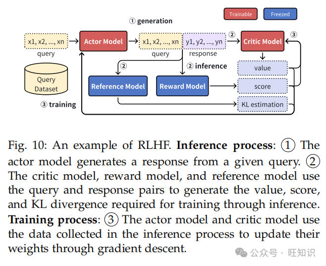

> 图10: RLHF的一个例子。推理过程：1 演员模型从给定的查询中生成响应。2 评论家模型、奖励模型和参考模型使用查询和响应对通过推理生成训练所需的值、分数和KL散度。训练过程：3 演员模型和评论家模型使用推理过程中收集的数据通过梯度下降更新它们的权重。

### 4.3.2 异构模型

> 在LLM训练过程中，异构性不仅反映在硬件上，还反映在模型中。训练可能涉及几个不同模型的交互。一个具体的例子是通过人类反馈的强化学习（RLHF）。RLHF是一种训练方法，旨在使AI系统更贴近人类的偏好\[255\]，利用人类在判断适当行为方面的优势，而不是展示。这种方法特别受到关注，尤其是用于微调大型语言模型。然而，由于近端策略优化（PPO）\[256\]算法的特殊性，RLHF训练引入了模型异构性，使得RLHF训练过程与预训练和监督微调非常不同。原则上，RLHF包括三个不同的阶段：第一阶段是监督微调，第二阶段是奖励模型的训练，第三阶段是PPO训练。模型异构性在第三阶段呈现，如图10所示。PPO训练阶段包括两个不同的过程，即生成数据的推理过程和更新演员模型和评论家模型权重的训练过程。PPO训练通过这两个过程的协作来执行。此外，训练阶段引入了更高的内存成本，因为我们需要同时提供多个自回归生成模型和奖励模型的副本，以及更多的时间成本，因为我们必须等待经验生成完成后才能更新权重。已经提出了许多框架来支持RLHF训练。例如，DeepSpeed-Chat\[233\]使用混合引擎在训练和推理之间无缝切换模型分区，如在推理期间使用张量并行来提高吞吐量，在训练期间使用ZeRO\[145\]或LoRA\[257\]来提高内存利用率，为RLHF训练提供了卓越的系统效率。HuggingFace TRL\[234\]可以充分利用各种参数高效微调（PEFT）方法，如LoRA或QLoRA\[258\]，以节省内存成本，并使用由unsloth\[259\]设计的专用内核来提高RLHF的训练速度。ColossalAI-Chat\[253\]是另一个端到端RLHF训练框架，也支持LoRA，并支持使用ZeRO\[145\]来减少内存冗余。然而，上述工作采用了平面化策略进行模型放置，即将RLHF中的四个模型放置在同一设备上，然后使用ZeRO或LoRA等方法最小化内存成本。但是，仅使用ZeRO在训练较大模型时会导致内存瓶颈，而使用像LoRA这样的高效参数微调策略会损害模型性能。为了解决这个问题，OpenRLHF\[235\]使用Ray\[260\]和vLLM\[261\]将奖励模型分布到不同的设备上，避免将所有四个模型都放在PPO的同一设备上。类似地，Adpative Placement and Parallelism (APP)框架\[236\]提出了两种其他模型放置策略，即交错策略和分离策略。它捕捉到生成部分和训练部分在PPO训练期间可以独立运行的事实，并且一些串行化可以通过将它们放置在不同设备上来消除，这引入了额外的通信，但可以与计算很好地重叠。同时，还有一些工作将前两个阶段中的并行策略以细粒度调度的方式应用到RLHF的第三阶段。例如，ReaLHF\[237\]通过重新分配参数，在第三阶段的不同子阶段之间切换最合适的并行模式，大大扩展了优化空间。PUZZLE\[238\]根据不同阶段的亲和性重新安排任务执行顺序，以便具有更好亲和性的阶段可以有效覆盖执行并提高训练效率。

5 计算优化
------

> 当今的AI加速器在FLOPs方面提供了前所未有的计算能力。然而，要充分利用这些FLOPs，需要复杂的优化技术。本节介绍了LLM训练的系统和计算优化技术。我们首先详细讨论操作符优化，包括核心注意力操作符优化和通过编译器进行的自动优化。基于利用大量并行性和针对底层硬件特性的有效多级内存访问，基于操作符和计算图的显著性能获得了。其次，详细介绍了混合精度训练，其中计算通过降低精度而加速。16位浮点混合训练已成为大多数训练系统的事实上的方法。低至1位的低位固定点也已被研究和用于高训练效率。

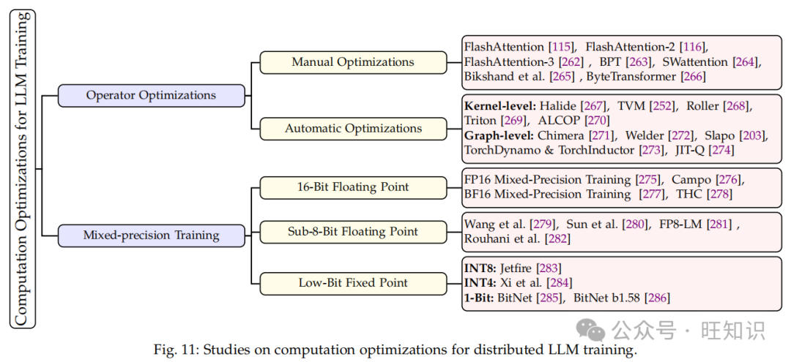

5.1 操作符优化
---------

> 操作符优化可以分为手动优化和自动优化。手动优化主要关注注意力操作符，而自动优化应用更广泛。

### 5.1.1 手动优化的注意力操作符

> 注意力作为Transformer架构的核心，在LLMs的训练效率中起着至关重要的作用。给定一个查询q和列表k1、k2、...、kn以及值v1、v2、...、vn，其中q、ki、vi ∈ Rd，注意力计算如下：

> 自注意力相对于序列长度表现出二次时间和内存复杂度。由自注意力引起的大量内存消耗和对高带宽内存（HBM）的频繁访问限制了变换器模型的性能和上下文长度。为了优化自注意力，提出了大量工作。我们关注精确的注意力优化，而像线性注意力这样的有损优化不在讨论范围内。内存高效注意力主要是为了缓解大内存成本。Rabe等人\[287\]证明，自注意力需要O(logn)的内存复杂度而不是O(n^2)。通过使用延迟softmax，softmax中的除法∑j exp(sj)可以推迟到注意力操作的最后来进行。因此，求和可以递增地处理，只需要一个标量（即O(1)）来维护中间结果，而不会改变输出。自注意力需要额外的O(logn)内存复杂度来保持查询列表中的附加索引，以顺序计算所有查询的结果。FlashAttention系列进一步展示了快速和内存高效的精确注意力与IO感知性、高并行性和平衡的工作负载在GPU上。在FlashAttention\[115\]中，提出了一种IO感知平铺算法，以减少基于在线softmax的慢HBM和快片上SRAM之间的内存读写次数。更具体地说，softmax可以通过跟踪包括最大分数和指数分数总和在内的归一化统计数据，逐块计算。因此，平铺算法将自注意力中的所有计算操作链，包括矩阵乘法、softmax、矩阵乘法等，融合在一个cuda内核中，以减少HBM访问。FlashAttention2\[116\]通过在序列长度维度上增加并行性和改进线程块内数据共享的warp级调度，进一步提高了FlashAttention中的低占用率和不必要的共享内存读写。此外，流行的训练系统\[174\]通常采用FlashAttention-2进行高性能。FlashAttention-3\[262\]通过挖掘新推出的硬件功能来加速H100 GPU上的注意力，因为以前的FlashAttention实现基于A100 GPU。基于FlashAttention-2，重新设计了一种交错块状GEMM和softmax算法，以隐藏softmax中的非GEMM操作与异步WGMMA指令的GEMM。此外，通过利用Tensor Cores和张量内存加速器（TMA）的异步性，通过warp专门的软件流水线方案，使整体计算与数据移动重叠。Blockwise Parallel Transformer (BPT) \[263\]通过扩展FlashAttention中的平铺算法来进一步减少大量内存需求，将前馈网络融合起来。还针对各种架构优化了注意力机制，利用硬件特定特性。例如，SWattention\[264\]为Sunway新架构设计，建立在FlashAttention之上。同样，Bikshand等人\[265\]在H100 GPU上实现FlashAttention-2，使用Cutlass库。他们利用TMA和WarpGroup Matrix-Multiply-Accumulate (WGMMA)指令分别优化数据复制和GEMM操作。此外，基于Cutlass库，精心设计了基于张量布局变换和两个GEMM之间的数据复制与计算之间的软件流水线。注意力机制还针对分布式LLM训练中常见的变长序列进行了优化。这些变长序列如果填充到最大长度，可能会产生显著的内存和计算成本。FlashAttention-2通过不可分割地并行化序列长度维度来高效处理变长输入。ByteTransformer\[266\]专注于无填充变换器，针对变长输入，维护一个位置数组，在计算期间记录原始张量和中间打包张量之间有效token的映射关系。这种长序列的融合多头注意力算法采用针对未填充张量的优化分组GEMM。这种优化减少了填充引起的内存和计算开销，从而提高了性能。

### 5.1.2 通过编译器的自动优化

> DNN编译器在优化LLM训练中的关键计算中发挥着重要作用。自动生成高效的操作员内核，大大减轻了不同硬件供应商对库基础内核优化的负担。在训练过程中，通过自动分析计算图执行操作员融合。

**高效的操作员内核生成。**Halide\[267\]和TVM\[252\]自动生成高性能的操作员实现，依赖于多个有效的调度原语，利用各种后端上的并行性和数据局部性。此外，Roller\[268\]优化了在内核实现的大搜索空间中寻找最优替代方案的成本。它主要生成一个由Load、Store和Compute接口组成的tile内核，然后通过扩展然后扩展的方法构建完整的操作员内核。Triton\[269\]提供了一种基于C的语言和编译器，便于表达和优化tile张量程序，以获得竞争性的性能。特别是，通过机器依赖的编译通道支持有效的优化，如层次化平铺和共享内存分配。ALCOP\[270\]对操作员在GPU上执行自动负载-计算流水线，以重叠高延迟内存访问与计算。通过流水线缓冲区检测以及复杂的索引分析和替换，在复杂的循环结构中使用多阶段流水线。

**图级别操作员融合优化。**随着计算核心速度和内存带宽差异的扩大，现代DNN受到内存访问的限制。通过编译器执行的操作员融合，挖掘了操作员间的数据重用。许多编译器工作\[288\]–\[291\]通过设置专家规则执行操作员融合。特别是，Chimera\[271\]致力于优化计算密集型操作员链。首先将操作员链分解为一系列计算块，然后根据分析模型选择最优的块执行顺序，以最大化数据重用。此外，设计了可替换的微内核以利用硬件特定的块内优化。Welder\[272\]将计算图降低到平铺级别的数据流图，其中节点是操作员平铺，边用连接节点的张量数据重用的内存级别标记。在平铺级别搜索最大化不同内存层次结构中数据重用的操作员融合组合。

> Pytorch2\[273\]展示了两个扩展，即Python级JIT编译器TorchDynamo和相应的编译器后端TorchInductor，以在各种后端上实现更强大的图编译，显著提高性能，同时不牺牲Python的灵活性。Slapo\[203\]提出了一种调度语言，将模型执行与定义解耦。声明一组调度原语，用户可以转换模型以获得高性能内核。JIT-Q\[274\]提出了一种针对权重的即时量化方法，该方法在训练期间只存储高精度副本的权重，并根据商业PIM（内存内处理）解决方案的内存内ALU增强创建基于低精度权重副本。

5.2 混合精度训练
----------

> 低精度训练是降低大规模模型训练中的计算、存储和通信成本的有效方法。如今，LLM训练通常利用FP16和BF16数据类型。特别是，BF16可以表示与FP32相同的值范围。由于在FP16中损失标量变得太低时损失会缓慢发散\[293\]，BF16训练在BLOOM\[292\]等模型中得到应用。然而，快速的bfloat16支持仅在TPU或在NVIDIA Ampere系列或之后开发的GPU上可用。此外，混合精度训练和技术，如损失缩放，被利用以确保由于表示的动态范围有限而减少精度时的数值稳定性。8位甚至更低位训练也成为量化研究的焦点。

### 5.2.1 16位浮点

  
 

> 流行的训练系统通常采用FP16/BF16混合精度策略，在训练期间降低精度，如Megatron-LM\[20\]和ColossalAI\[253\]的工作所强调。FP16混合精度训练方案\[275\]利用IEEE半精度格式存储权重、激活和前向和后向算术操作的梯度。为了在降低精度的同时保持模型精度，每个优化器步骤都会保留权重的单精度副本进行累积。还应用了损失缩放，以保留小幅度梯度的值。Campo\[276\]通过自动图重写优化了FP32和FP16之间转换引起的铸造成本。这很关键，因为铸造成本有时可能会抵消低精度的性能优势。Campo还使用离线训练的线性回归模型预测FP32和FP16操作的铸造成本和执行时间。BF16\[277\]也在各个领域\[294\]、\[295\]的混合精度训练中得到广泛应用。它具有与FP32相同的表示范围，并且不需要为收敛进行超参数调整。此外，THC\[278\]通过消除压缩和解压缩的需求，解决了参数服务器架构中的计算开销，从而提高了效率。

### 5.2.2 低于8位的浮点

> 随着以FP8等低精度数据类型为特征的新芯片的推出，混合精度训练旨在使用更低精度进行训练。新设计的数据格式结合了确保数值稳定性的技术，主要利用FP8训练深度学习神经网络。Wang等人\[279\]使用新的FP8浮点格式进行数据的数值表示和计算。块计算和随机舍入分别在浮点累加和权重更新过程中使用，以保持模型精度。Sun等人\[280\]提出了一种适用于整个深度学习模型的混合8位浮点训练，而不会降低精度。新颖的混合FP8格式为前向和后向传播使用不同的指数位和尾数位，因为前向和后向传递在范围和精度之间的最佳平衡不同。此外，使用如损失缩放等技术以避免精度降低。随着更多FP8数据类型的加速器的成熟，基于NVIDIA H100 GPU\[296\]的FP8自动混合精度框架（FP8-LM）\[281\]被提出，逐渐融合了8位梯度、优化器状态和分布式并行训练，并且指定了包括张量、流水线和序列并行在内的FP8低位并行性。此外，设计了精度解耦和自动缩放，以解决由于动态范围较窄和精度降低导致数据下溢或上溢的问题。FlashAttention-3还采用了块GEMM量化和非相干处理，利用硬件对H100 GPU上FP8低精度的支持。此外，Rouhani等人\[282\]利用与细粒度子块相关联的缩放因子的微缩数据格式，在权重、激活和梯度的1位精度下训练LLMs，以最小的精度损失。

### 5.2.3 低位固定点

> LLM训练中的低位固定点训练也被研究。Jetfire\[283\]保持INT8数据流，其中输入和输出以INT8数据格式加载和存储，以加速计算约束的线性操作员和内存约束的非线性操作员。此外，利用平铺算法挖掘共享内存数据访问，采用每个块的量化方法，其中执行更高精度的计算，即在线性操作员的WMMA张量核心操作中使用INT32和非线性操作中的FP32，以保持预训练变换器的精度。Xi等人\[284\]提出了一种针对变换器模型的新型INT4训练算法。在前向传播中，首先将激活矩阵转换为块对角哈达玛矩阵，以减轻激活中的异常值引起的精度降低，然后对转换后的矩阵进行量化。在反向传播中，利用位分割和利用分数采样根据激活梯度的结构稀疏性选择信息性梯度进行量化。最近，LLMs的低精度训练已经发展到使用1位精度。BitNet\[285\]在变换器块内使用1位权重和8位激活的新型低位精度矩阵乘法，将模型权重集中在零点周围，以在有限的数值范围内最大化容量，然后使用符号函数将其二值化为+1或-1。为了确保训练稳定性和精度，梯度、优化器状态和高精度潜在权重副本被维护以进行参数更新。在BitNet的基础上，BitNet b1.58\[286\]通过将模型权重降低到三元值{-1, 0, 1}来增强建模能力。权重矩阵通过其平均绝对值进行缩放，每个值四舍五入到-1、0和+1中最近的整数。

6 内存优化
------

> LLM训练期间的内存消耗可以分为四个主要部分：模型状态、激活、临时缓冲区和内存碎片化。

*   **模型状态**：模型状态包括优化器状态、梯度和模型参数所占用的内存。在混合精度训练\[275\]中，模型参数和激活以16位精度存储。当训练具有Φ参数的模型时，需要4Φ字节来存储参数和梯度。32位参数、动量和方差的副本各需要4Φ字节，总计12Φ字节。因此，存储模型状态所需的总内存为16Φ字节。
*   **激活**：激活指的是在前向传播期间生成的张量。这些张量在后向传播阶段用于梯度计算。
*   **临时缓冲区**：临时缓冲区用于存储中间结果。例如，像梯度AllReduce这样的操作通常将梯度在单个扁平缓冲区中融合，以提高吞吐量。
*   **内存碎片化**：内存碎片化可能导致尽管有大量可用内存，但内存请求失败，因为可用内存变得碎片化，没有足够的连续内存来满足内存请求\[145\]。

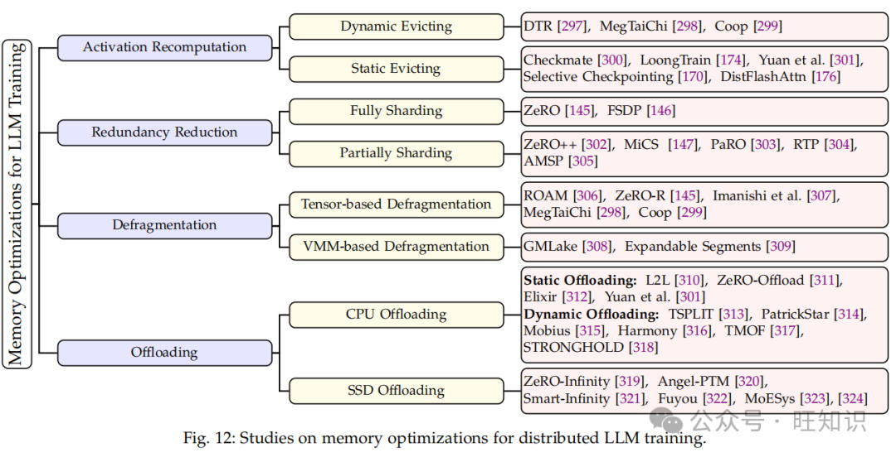

> 为了解决LLM训练的内存限制，提出了各种内存高效技术。这些包括激活重计算策略，通过增加计算换取减少内存使用；冗余减少方法，通过减少训练过程中的数据复制来最小化内存冗余；碎片化整理技术，通过优化内存分配和释放来减少碎片化，提高内存利用率；以及交换和卸载方法，利用CPU内存和NVMe SSDs来补充GPU内存。图12概述了这些优化在内存高效LLM训练中的分类。

6.1 激活重计算
---------

> 在模型训练的后向阶段，激活对于计算梯度至关重要。随着模型大小的增加，训练期间存储这些激活所需的内存可能超过GPU内存容量，从而限制了可以训练的模型规模。激活重计算\[325\]通过策略性地在前向传播期间丢弃某些激活，并在后向传播期间按需重新计算它们，提供了一种解决方案。这种方法已成为减少LLM训练中内存消耗的标准方法。有效激活重计算的关键是平衡内存节省与额外计算开销。我们将这些方法分为两种主要方法：静态逐出和动态逐出。

### 6.1.1 静态逐出

> 静态逐出涉及建立一个固定的计划，在前向传播期间丢弃激活，并在后向传播期间重新计算它们。Checkmate\[300\]将这个激活重计算问题表述为一个混合整数线性规划问题，以确定静态深度学习模型的最佳重新材料化计划。然而，Checkmate在扩展到像LLMs这样的大型模型时遇到困难，因为搜索空间巨大。最近，一些工作提出了针对LLM训练量身定制的激活重计算策略。Selective-checkpointing\[170\]选择性地丢弃内存密集型注意力模块的激活。FlashAttention\[115\]将注意力模块融合到一个单独的内核中，并且也采用选择性检查点来减少内存消耗。DistFlashAttn\[176\]解决了长序列中由于重新计算注意力模块而导致的高计算开销，采用了重新材料化感知的梯度检查点策略。具体来说，DistFlashAttn在FlashAttention内核的输出处而不是Transformer层边界处放置检查点，从而在后向传播期间消除了注意力模块的重新计算，只要求存储其输出。LoongTrain\[174\]引入了selective-checkpoint++，在长序列训练中通过将注意力模块添加到白名单中来进一步优化检查点过程。这种方法在前向传播期间保存白名单模块的输出，在后向传播期间检索这些存储的输出，而不是重新计算它们，继续计算图，从而减少了重新计算注意力的需要。与最近主要关注为LLM训练的注意力模块手工检查点策略的工作不同，Yuan等人\[301\]仔细测量了在模型训练期间重建每个激活张量所需的最小计算成本。他们通过枚举所有可能的检查点方法，推导出内存和计算成本的Pareto前沿。从这个Pareto前沿中，他们选择了一个最优平衡计算和内存成本的解决方案。

### 6.1.2 动态逐出

> 动态逐出根据训练过程的当前状态实时决定哪些激活要丢弃和重新计算。DTR\[297\]提出了一种贪婪在线算法，用于在运行时对静态和动态模型的张量进行启发式逐出和重新材料化。MegTaiChi\[298\]引入了一种动态张量逐出，利用在运行时跟踪的张量访问模式。Coop\[299\]提出了一种方法来缓解由于激活重计算方法在丢弃张量时不考虑它们的连续性而引起的内存碎片化问题。Coop采用高效的滑动窗口算法，确保只有连续的内存块被逐出，从而最小化内存碎片化。

### 6.2 冗余减少

> 传统的数据并行方法在所有GPU上复制整个模型状态，导致大量的冗余内存使用。冗余减少技术被提出来通过消除或减少每个设备上的内存冗余来优化内存使用。这些技术通常寻求在内存效率和引起的通信开销之间取得平衡，从而以可接受的成本促进更大规模或批量大小的训练。

### 6.2.1 全部分片

> 零冗余优化器（ZeRO）\[145\]通过在所有GPU上完全分片模型状态来优化内存冗余，通过三个阶段：ZeRO-1、ZeRO-2和ZeRO-3。ZeRO-1在所有GPU上全局分布优化器状态。在训练过程中，每个GPU进行独立的前向和后向传播来计算梯度，然后使用ReduceScatter操作在数据并行组内的所有GPU之间同步梯度。每个GPU负责更新特定部分的模型参数。随后，更新后的模型参数片段从其他GPU上收集，使用AllGather操作，确保所有GPU都有最新的模型参数。ZeRO-1将优化器状态的内存消耗从12Φ降低到12Φ/N，其中N是数据并行的大小。在ZeRO-1的基础上，ZeRO-2进一步在所有GPU上分片梯度，每个GPU只更新其参数片段，将用于存储梯度的内存需求从2Φ降低到2Φ/N。ZeRO-3除了优化器状态和梯度外，还分片参数。每个GPU只持有部分参数。当需要远程GPU上的参数进行即将到来的计算时，通过AllGather操作收集它们，并在之后丢弃。在ZeRO-3中，每个GPU只持有与其特定参数分区对应的权重、梯度和优化器状态，将整体内存消耗从16Φ降低到16Φ/N。ZeRO被许多框架广泛采用，如DeepSpeed\[183\]、PyTorch-FSDP\[146\]和ColossalAI\[253\]。

### 6.2.2 部分分片

> ZeRO面临着通信挑战，因为集体通信操作的延迟随着通信规模的增加而增加。在分布式LLM训练中，内存利用率和通信成本之间存在权衡。通过在较小的GPU组中分片模型状态，可以优化通信开销，这些小组是大型GPU集群中的较小GPU集合。这种方法减少了节点间通信和通信规模，尽管由于模型状态的冗余增加，可能会导致更高的内存使用。关键是要在通信规模和内存利用之间找到平衡\[305\]。已经提出了几种在ZeRO框架上构建的方法，以解决通信效率低下的问题，同时提高内存利用率。ZeRO++\[302\]按照ZeRO-3在全球所有设备上分片所有模型状态，并进一步在GPU的子组内引入参数的二次分片。在前向阶段，它利用主要分片在所有GPU上收集参数，并在子组内维护参数的二次分片，通常在同一节点内。在后向阶段，它从这个二次分片中收集参数，减少通信规模和节点间通信。此外，ZeRO++使用量化来压缩参数和梯度，有效地减少通信量，但以精度为代价。MiCS\[147\]和FSDP\[146\]在子组内分片所有模型状态组件，并在子组之间复制它们，从而减少通信规模和通信延迟，提高训练性能。AMSP\[305\]和PaRO\[303\]结合了三种灵活的分片策略，包括全副本、全分片和部分分片，允许模型状态的每个组件独立选择分片策略。AMSP制定了一个优化问题，以在内存约束下找到最小化通信成本的最佳分片策略。此外，AMSP提出了一种定制的通信和计算重叠策略，结合这些灵活的分片策略，实现优化的训练效率。RTP（Rotated Tensor Parallelism）\[304\]通过策略性地分片激活和旋转权重/梯度来最小化内存冗余。

### 6.3 碎片整理

> GPU内存碎片化指的是在相邻张量之间出现的分散、无法使用的内存块。由于不同张量的生命周期不同，以及一般深度学习框架（如PyTorch\[240\]和TensorFlow\[326\]）的内存分配和释放方案效率低下，这个问题在LLM训练中尤为突出。此外，像重计算和卸载这样的内存优化技术通过引入更频繁和不规则的内存分配和释放请求，加剧了这个问题\[299\]、\[306\]、\[308\]。碎片化问题可能导致高峰值内存和内存不足（OOM）错误，限制了批量大小和整体训练效率。碎片整理工作提出了通过内存管理技术来缓解这些问题。

### 6.3.1 基于张量的碎片整理

> 深度学习框架通常使用带有内存池的缓存分配器，以实现快速内存分配和释放，而不需要设备同步。已经提出了几种基于缓存分配器中张量分配和释放方案来减少内存碎片化的方法。ROAM\[306\]通过考虑张量的生命周期和大小，共同优化操作员的执行顺序和张量分配。它引入了一个高效的基于树的算法，搜索最大化张量重用和减少数据碎片化的执行计划。ROAM已在单GPU场景中进行了评估，特别是使用最大的模型是1.5B GPT-2 XL\[5\]，但尚未在具有更大模型的分布式训练场景中进行测试，其中计算图可能变得显著更大。Imanishi等人\[307\]提出了一种离线优化方法，将张量分配建模为二维装箱问题。在这个模型中，每个张量分配表示为一个垂直可移动的矩形，反映了模型训练期间的周期性分配模式。他们提出了一种使用模拟退火的启发式算法，优化分配的拓扑排序，旨在最小化碎片化。虽然有效，但这种方法在应用于LLMs时可能会遇到可扩展性问题，因为涉及的分配数量众多，模式复杂。MegTaiChi\[298\]和Coop\[299\]在减少内存消耗时考虑内存碎片化问题。

### 6.3.2 基于虚拟内存管理器的碎片整理

> GMLake\[308\]和PyTorch可扩展段\[309\]提出利用低级CUDA驱动应用程序编程接口的虚拟内存管理（VMM）功能来缓解碎片化。这个低级API为开发人员提供了直接控制GPU虚拟内存操作的功能，如保留、映射和管理虚拟内存地址。基于此，GMLake\[308\]引入了一种虚拟内存拼接机制，通过虚拟内存地址映射将非连续的内存块合并为更大的块，最小化数据移动和复制。同样，PyTorch的可扩展段\[309\]使分配的内存段能够扩展到更大的尺寸以供重用。这两种方法对不同模型和内存高效训练技术都是透明的，并且可以无缝集成到现有的深度学习框架中。此外，GMLake证明了在多GPU上具有出色的可扩展性，开销最小，不需要修改用户代码。PyTorch-v2.1也已经集成了可扩展段。

6.4 卸载
------

> 为了在较少的GPU上有效训练LLMs，提出了各种利用交换和卸载方法的工作。这些技术将部分计算和数据从GPU内存转移到外部资源，这些资源虽然价格低廉且速度较慢，但拥有巨大的容量。

### 6.4.1 CPU卸载

> 许多研究提出了有效利用CPU内存以增强分布式LLM训练的方法。这些技术大致可以分为两种主要方法：静态卸载和动态卸载。

**静态卸载。**静态卸载方法涉及预先确定的模型组件在GPU和CPU内存之间的分配。L2L\[310\]逐层管理和移动张量。L2L同步获取即将到来的计算层所需的张量到GPU内存，同时保持剩余层的张量存储在CPU内存中。L2L允许将模型扩展到任意深度，但无法在多GPU上扩展。相比之下，ZeRO-Offload\[311\]专注于多GPU训练。它将模型参数保持在GPU上，并将优化器状态和梯度存储在CPU内存中。此外，它将优化器更新计算卸载到CPU。这种方法使得使用16个V100s训练高达700B的模型成为可能。然而，ZeRO-Offload可能会留下一些未使用的GPU内存，并遭受缓慢的CPU优化器更新\[312\]。

> 为了解决这个问题，Elixir\[312\]使用搜索引擎通过利用预运行时模型分析来找到内存分区和卸载的最佳组合。与ZeRO-Offload不同，Elixir通过在GPU和CPU之间分割模型状态和优化器块，有效利用了所有可用的GPU内存。Mobius\[315\]通过引入流水线并行方案来解决在有限的GPU间带宽和高通信争用下的商品服务器上的多GPU训练问题。这个方案为每个GPU分配多个阶段，并在GPU和CPU内存之间动态交换它们。此外，Mobius通过预取和交叉映射优化通信，以减少开销和争用。Yuan等人\[301\]提出通过在流水线阶段的粒度下卸载和重新加载激活来减轻激活瓶颈，同时最大化激活传输与计算之间的重叠，从而避免放慢训练过程。与其他卸载工作相比，这项工作更侧重于改善计算和内存利用率之间的平衡，而不是在极其紧张的内存预算下进行训练。

### 6.4.2 动态卸载

> 动态卸载方法根据实时优化内存利用率和数据传输，在GPU和CPU内存之间适应性地分配模型或张量的分区。STRONGHOLD\[318\]提出在GPU和CPU内存之间动态卸载模型状态，并保持适当的工作窗口大小，以最小化卸载期间的GPU停顿。Harmony\[316\]采用基于启发式的调度器将计算和模型状态映射到物理设备。Harmony通过减少交换和快速的点对点交换来减少卸载开销。TMOF\[317\]引入了不相交交换和双向重叠协调机制，以防止交换和卸载期间的PCIe通道争用。对于MoE模型，MPipeMoE\[327\]设计了一种自适应和内存高效的流水线并行算法。具体来说，MPipeMoE通过消除内存冗余和自适应选择组件来决定是卸载还是重新计算所需张量，以减少内存需求。

> 为了促进更好的内存管理，一些研究提出了将张量分解为更细粒度单元的系统。TSPLIT\[313\]和PatrickStar\[314\]是两个动态内存管理系统，它们优化了GPU的峰值内存使用。TSPLIT将张量分解为微张量，并在微张量级别执行操作，实现精确和动态的内存操作。PatrickStar将模型数据组织成内存块，这些内存块在CPU和GPU内存之间动态分配，并优化CPU-GPU数据传输以及带宽利用。此外，TSPLIT使用模型引导的计划算法为每个张量找到最优的内存配置，而PatrickStar采用运行时内存跟踪、块逐出策略和设备感知操作员放置，进一步最小化CPU和GPU之间的数据移动。

### 6.4.3 SSD卸载

> 为了促进万亿规模LLMs的训练，仅依靠CPU卸载的方法是不足够的，因此提出了在训练期间将数据卸载到CPU内存和NVMe SSDs的几种方法。ZeROInfinity\[319\]将所有分片模型状态卸载到CPU或NVMe内存，并将激活卸载到CPU内存。这种方法支持在32个节点（总共512个V100s）上训练高达32T参数的模型。然而，CPU卸载对激活仍然需要大量的CPU内存。例如，存储10T模型的训练需要大约0.76TB的CPU内存，而对于100T模型则需要大约4TB。Fuyou\[322\]专注于在CPU内存容量有限且仅有单个GPU的商品服务器上训练LLMs。与ZeRO-Infinity相比，Fuyou进一步将激活卸载到SSDs，并结合SSD-CPU通信作为额外的优化维度。它还引入了同步的外核CPU优化器，与后向传播阶段重叠，并引入了自动激活交换机制，从而最大化GPU利用率。Smart-Infinity\[321\]提出使用近存储处理设备减少二级存储带宽需求，用于参数更新。MoESys\[323\]，\[324\]结合了各种存储设备（GPU、CPU内存和SSDs），以保存稀疏参数状态和密集参数状态，并提出了一种2D预取调度策略，以便MoE训练的参数计算可以与调度重叠。

7 通信优化
------

> 不同的并行机制引入了不同的网络通信流量模式。例如，张量并行需要在张量并行等级之间进行AllReduce操作。另一方面，数据并行在每个迭代结束时需要在数据并行等级之间进行AllReduce操作以同步梯度。流水线并行涉及在每个阶段结束时将激活值传递到下一个阶段。通常，训练框架将张量或序列并行通信组（这些组需要高带宽）放置在高带宽域内（例如，同一节点内），而将数据并行或流水线并行通信组（这些组的带宽需求较低）放置在高带宽域之间。图13显示了LLM训练实践中的通信热图，并很好地反映了不同并行策略带来的数据流量。从这个热图中可以观察到，LLM训练通信流量呈现出明显的模式和层次结构，大部分通信发生在较小的范围，只有一小部分流量穿过整个集群。这一洞见激发了像铁路优化拓扑\[62\]这样的方法，它减少了不必要的核心交换机以降低成本。本节介绍分布式LLM训练的集体通信性能优化的系统和技术。如图14所示，我们首先讨论集体通信库，它们利用预定义和合成算法。接下来，我们探索旨在重新组织通信操作以与计算重叠，从而减少延迟并加速训练过程的通信调度技术。最后，我们深入研究了网络内聚合（INA），它利用网络设备的计算能力来执行聚合操作，例如求和深度学习模型的梯度。

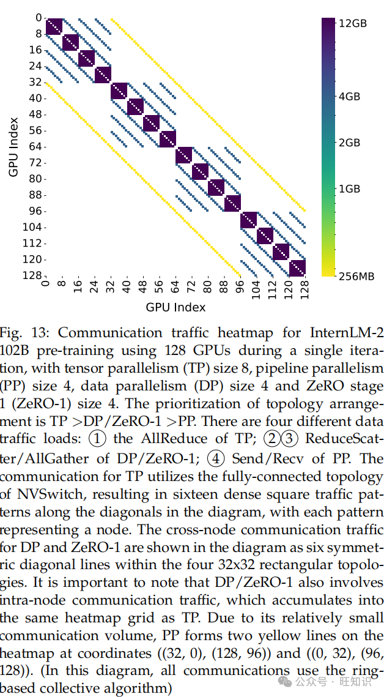

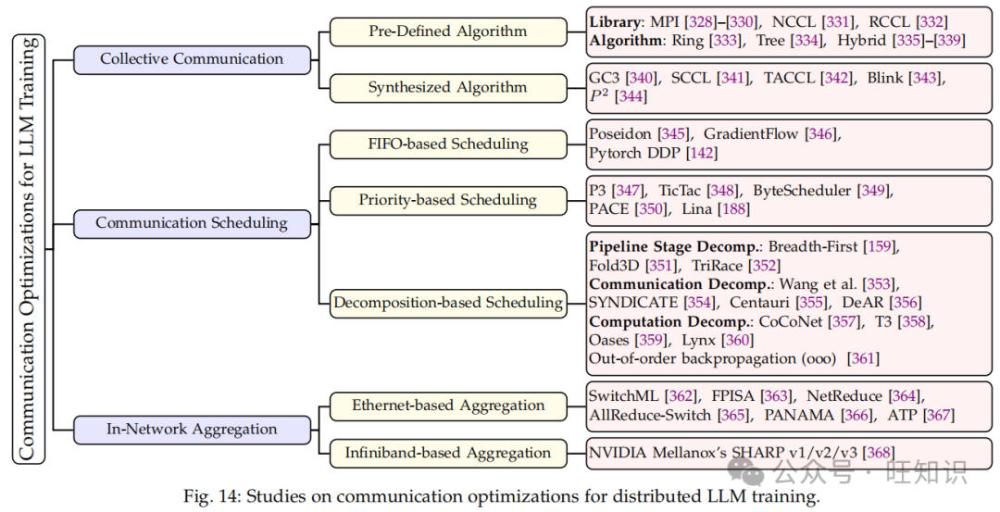

> 有效压缩模型参数和梯度可以显著减少分布式LLM训练期间的通信开销。各种研究探索了稀疏通信和量化方法。例如，ZeRO++\[302\]在通信之前将权重量化为FP16到INT8数据类型，以缩小每个模型参数。然而，这些工作通常涉及有损稀疏化或量化技术。我们没有调查有损数据压缩技术，因为这超出了这项工作的范围。

7.1 集体通信
--------

> 消息传递接口（MPI）是大规模科学应用在并行计算架构上的一种广泛采用的编程模型。MPI有几种实现，包括OpenMPI\[328\]、MPICH2\[329\]和MVAPICH\[330\]。这些库提供了多种CUDA感知原语，如AllReduce、AllGather和ReduceScatter，这些对于分布式LLM训练至关重要。在实践中，当前的训练框架更倾向于使用针对特定AI加速器的集体通信，这些通信具有预定义或合成算法。

### 7.1.1 预定义集体通信算法

> NVIDIA的NCCL\[331\]和AMD的RCCL\[332\]是高度优化的库，通常在它们各自的AI加速器上比基于MPI的集体通信库表现更好。这些库通常根据网络拓扑和输入张量大小等条件选择预定义算法来执行集体操作。

**环形算法。**环形算法用于像AllReduce这样的集体通信，以在所有GPU之间移动数据。在这个算法中，输入张量被分成多个块，并且在操作过程中逐个传输。这个流水线减少了每个设备等待数据的空闲时间。百度使用了带宽最优的环形AllReduce算法\[333\]进行分布式深度学习模型训练。Horovod\[143\]用NCCL替换了百度的环形AllReduce实现，并为分布式训练设计了用户友好的接口。

**树算法。**环形算法的延迟随着GPU设备数量的增加而增加\[346\]。双二叉树算法\[334\]被提出来解决这个问题。双二叉树依赖于这样一个事实：在二叉树中，一半或更少的等级是节点，一半或更多的等级是叶子。因此，可以使用叶子作为节点，反之亦然，为每个二叉树构建第二个树。这个算法在基于MPI的库、NCCL和RCCL中实现。

**混合算法。**几种方法提出了使用混合算法来处理具有异构节点内和节点间通信带宽的训练集群上的集体通信任务。两级AllReduce\[335\]将单个AllReduce操作分为三个步骤：节点内Reduce使用PCIe/NVLINK，节点间AllReduce使用网络，节点内Broadcast。2D-Torus AllReduce\[336\]和ACCL\[337\]将单个AllReduce操作分解为三个阶段：节点内基于环形的ReduceScatter，节点间基于树的AllReduce，节点内基于环形的AllGather。BlueConnect\[338\]将单个AllReduce操作分解为多个可并行化的操作，每个操作可以映射到不同的网络结构，利用每种特定结构的最佳预定义实现。Plink\[339\]可以探测网络拓扑，并有效地生成两级混合通信计划，利用数据中心网络中的局部性。

### 7.1.2 合成集体通信算法

> 一些方法已经出现，它们合成了针对硬件拓扑的集体通信算法和内核，旨在在许多情况下胜过通用预定义算法。

> GC3\[340\]引入了一个面向数据的特定领域语言（DSL），用于设计自定义的集体通信算法。它包括一个优化编译器，将这些算法转换为针对特定硬件配置优化的可执行形式。SCCL\[341\]将集体通信合成问题编码为可满足性模理论（SMT）公式。这种方法旨在推导出精确的时间表，用于Pareto最优算法，优化延迟和带宽利用率。TACCL\[342\]将寻找最优通信算法的问题表述为混合整数线性规划（MILP）问题。它利用通信草图抽象来有效收集必要信息并减小搜索空间，目标是最小化总体执行时间。Blink\[343\]通过在运行时探测每个作业的可用链接集来动态构建具有适当链路容量的拓扑。使用这个拓扑，它通过创建数据包生成树和生成CUDA代码来优化通信速率。P2\[344\]使用并行矩阵在系统级别划分并行轴，从而生成拓扑感知的并行放置和简化策略。通过模拟和预测通信成本，这种方法减少了实际评估的数量。

7.2 通信调度
--------

> 分布式训练中的通信调度重新组织通信操作，使其与计算重叠，从而减少延迟并加速训练过程。通信调度的关键概念涉及根据并行训练的数据依赖性重新排序通信操作。混合并行LLM训练需要多维通信调度方案来管理由数据、流水线、张量和序列并行生成的通信，以及它们的组合。

### 7.2.1 基于FIFO的调度

> 在后向阶段，而不是等待所有梯度计算完成后再启动通信，通信可以在每个梯度准备好后立即开始。这种无等待反向传播方法利用依赖于有向无环图来有效管理任务。Poseidon\[345\]使用先进先出（FIFO）队列来调度AllReduce操作员，确保每层在生成梯度后立即开始其通信。受到大型张量上集体通信效率的启发，GradientFlow\[346\]和Pytorch DDP\[142\]将多个顺序AllReduce通信操作合并为单个操作。这种方法通过等待短暂的时间，然后将多个梯度合并为一个AllReduce操作，避免了在网络上传输大量小张量。

### 7.2.2 基于优先级的调度

> FIFO方案通常是次优的，因为在后向阶段生成的通信序列与前向阶段的计算序列不同。这种不匹配可能导致通信阻塞计算，即使启用了重叠。因此，许多方法采用优先级队列来有效调度通信操作员。P3\[347\]以更细粒度调度AllReduce操作员，将当前层的梯度通信与下一层的前向计算重叠。与基于FIFO队列的调度不同，这种方法将层划分为固定大小的切片，并根据它们在前向传播中处理的顺序优先同步切片。因此，第一层获得最高优先级，优先级随着层的结束而递减。当使用参数服务器架构进行分布式模型训练时，TicTac\[348\]优先考虑加速底层计算图中的关键路径的传输。ByteScheduler\[349\]和PACE\[350\]被提出以在训练框架中推广基于优先级的通信调度。具体来说，ByteScheduler\[349\]引入了一个统一的抽象，以在不破坏框架引擎内原始依赖关系的情况下促进通信调度。ByteScheduler通过使用贝叶斯优化自动调整两个关键参数：分区大小和信用大小，实现了良好的性能。PACE\[350\]通过将原始AllReduce操作分割成更小的部分来实现抢占式通信。被抢占的AllReduce操作员可以在以后恢复。这种抢占策略防止了大通信张量的队首阻塞。此外，PACE使用动态规划方法将小通信张量融合，以减少处理大量小张量的开销，从而实现更有效的带宽利用。为了提高MoE系统中的带宽效率，Lina\[188\]优先考虑All-to-All操作而不是AllReduce。通常，专家并行（All-to-All）和数据并行（AllReduce）过程使用单独的CUDA流，可能导致没有协调的潜在重叠和带宽共享。Lina将张量分解为更小的块，确保All-to-All操作获得全部带宽，同时允许AllReduce微操作在空闲时间运行。此外，微操作使All-to-All操作与专家计算重叠。

### 7.2.3 基于分解的调度

> 一些进步集中在将通信和计算操作分解为细粒度任务，以更大的灵活性重新排序这些操作，以最大化重叠并优化执行效率。

**流水线阶段分解。**当使用传统的流水线并行时，每个GPU存储一层的连续段。Breadth-First\[159\]进一步将这些连续阶段分解为分布在不同GPU上的更细粒度的阶段，通过将第一个和最后一个GPU连接起来形成一个循环，使每个GPU被分配多个阶段。这允许给定的微批次更早地到达流水线的末端，减少流水线泡沫。Breadth-First使用广度优先调度策略实现更大的计算-通信重叠。Fold3D\[351\]采用全进全出的调度策略，使流水线的梯度同步过程与计算重叠。这涉及进一步折叠流水线内的模型片段，其中每个设备包含两个模型片段，允许一个片段的梯度同步与另一个片段的前向或后向计算重叠。异步流水线并行放宽了梯度和参数更新之间的数据依赖性。利用这一特性，TriRace\[352\]推迟参数更新以最大化计算与梯度通信的重叠。此外，TriRace将流水线阶段之间的双向P2P通信分解为两个单独的单向操作，并根据关键路径分析对它们进行优先级排序。

**通信分解。**通信原语可以被分解为具有高调度灵活性的细粒度操作。Wang等人\[353\]将通信操作（例如AllGather和ReduceScatter）分解为一系列细粒度的点对点集合。此外，计算操作（例如爱因斯坦求和）被划分为细粒度任务，每个任务执行部分计算。这种分解创造了更多的机会，使通信与计算重叠。SYNDICATE\[354\]将通信操作分割成更小的子操作，称为Motifs，并使用中央优化器使用马尔可夫链蒙特卡洛搜索来实现最优的重叠执行计划。Centauri\[355\]采用不同的方法，使用原语分区、组分区和工作负载分区将通信操作分解为细粒度的原子操作。然后使用工作负载感知调度、反向调度和弹性调度来调度这些操作，以最大化重叠效率。DeAR\[356\]还分解通信原语，特别是将AllReduce分解为AllGather和ReduceScatter。这种分解允许后续操作与模型的前向传播过程重叠，从而消除了等待两个通信步骤完成的需要。

**计算分解。**当使用张量并行时，在前向阶段需要一个AllReduce通信来同步矩阵乘法输出。CoCoNet\[357\]通过将输出划分为更小的块，并在计算每个结果块后立即启动AllReduce内核，来促进矩阵乘法和AllReduce的重叠。为了最小化等待AllReduce内核的时间，数据块以精心安排的顺序输入到矩阵乘法内核。T3\[358\]应用了一种硬件-软件共同设计方法，它透明地重叠矩阵乘法与通信，同时最小化资源争用。在硬件层面上，T3引入了一个跟踪和触发机制来协调生产者的计算和通信活动。此外，它采用了计算增强内存来处理通信过程中所需的相关计算操作。反向传播生成两种类型的梯度：输出梯度，用于计算前一层的梯度，以及权重梯度，用于更新层的权重参数。这些权重梯度需要使用AllReduce与其他等级同步。传统的框架同时执行权重和输出的梯度计算。Out-of-order backpropagation (ooo-backprop)\[361\]将权重和输出的梯度计算解耦，灵活地安排权重梯度计算的顺序。这允许更关键的计算被优先考虑和相应地调度。因此，ooo-backprop通过基于这种乱序计算策略的通信调度来优化整体性能。Zero Bubble\[156\]也使用这种方案来降低流水线并行的泡沫率。使用激活检查点时，训练框架需要在后向阶段重新计算激活。这种重新计算也涉及在张量并行时的AllReduce通信。Oases\[359\]通过始终将AllReduce通信作为重新计算单元的最后一个前向通信操作来减少冗余通信，并进一步将批量划分为更小的子批量，允许两个批量的通信和计算重叠。Lynx\[360\]也利用了重新计算和通信重叠的潜力，使用两种重新计算调度算法OPT和HEU来寻找最优或近似最优的重新计算调度策略，实现最佳的重叠和训练性能。

7.3 网络内聚合
---------

> 网络内聚合（INA）使用网络设备的计算能力来执行聚合操作，如求和深度学习模型的梯度。这种技术之前已被提出以加速大数据处理。值得注意的是，像NetAgg\[369\]、SwitchAgg\[370\]和CamDoop\[371\]这样的框架通过在直接连接拓扑内的高性能中间盒或服务器上执行数据聚合，展示了显著的性能优势。许多方法已被提出用于将网络内聚合应用于深度学习模型训练，旨在减少在后向阶段梯度的AllReduce操作期间节点间交换的数据。

### 7.3.1 基于以太网的聚合

  
 

> 许多基于以太网的网络内聚合系统依赖于可编程交换机，并且可以用于分布式LLM训练。SwitchML\[362\]支持在分布式训练的后向阶段将集体通信操作卸载到可编程网络交换机。由于完整的模型更新可能超过交换机的存储容量，SwitchML通过交换机流式传输聚合，每次处理有限数量的向量元素的聚合函数。SwitchML有两个限制。首先，处理浮点运算时，SwitchML不能直接对浮点张量执行集体通信（如AllReduce）。相反，它使用类似块浮点的方法将浮点值转换为32位整数。其次，SwitchML主要在DPDK上实现，虽然有RDMA功能实现，但很难与训练框架集成。为了更好地促进分布式模型训练，FPISA\[363\]在可编程交换机上直接运行P4\[373\]程序来实现浮点计算。因此，训练框架可以将FP16张量的集体通信操作卸载到交换机，而无需将它们转换为32位整数。NetReduce\[364\]支持与RoCE兼容的网络内聚合，充分利用RoCE的拥塞控制和可靠性设计，无需在交换机中进行昂贵的网络协议处理堆栈。NetReduce使用附加到以太网交换机的FPGA板进行了原型设计。AllReduce-Switch\[365\]与NetReduce密切相关，并且与其网络协议兼容。它引入了一种针对网络内聚合任务量身定制的新型交换机架构，并使用FPGA硬件实现了原型。PANAMA\[366\]和ATP\[367\]也通过它们为共享环境设计的网络内聚合框架为该领域做出了贡献。PANAMA专注于通过管理多个并发训练作业之间的带宽分配来优化网络负载。它解决了传统拥塞控制可能无法充分支持同时训练操作的挑战。ATP则支持多个并发租户同时运行多个作业，强调对共享环境中不同工作负载的支持。某些工作针对特定的训练工作负载进行了定制，使它们不适合分布式LLM训练。例如，Libra\[374\]是为使用参数服务器架构的稀疏模型训练而设计的。它将频繁更新的参数聚合卸载到可编程交换机，而将不经常更新的参数留给服务器处理。这种方法有效地减少了服务器负载。另一方面，iSwitch\[375\]是为强化学习训练任务中的参数聚合而设计的。尽管其基于FPGA的实现支持本地浮点运算，但它在显著较低的带宽下运行。此外，iSwitch在聚合期间存储了整个梯度向量，这对于强化学习工作负载是可行的，但对于大规模模型，尤其是LLMs来说，并不具有很好的扩展性。

### 7.3.2 基于InfiniBand的聚合

> NVIDIA Mellanox的可扩展层次聚合协议（SHARP）\[368\]是一种专有的网络内聚合方案，可在某些InfiniBand交换机和NVIDIA GPU上使用。SHARP建立在InfiniBand之上，利用链路层流量控制和无损失保证，并采用专用的片上浮点运算单元进行集体卸载。SHARPv1在InfiniBand EDR交换机上推出，SHARPv2在InfiniBand HDR交换机上增强，具有支持集体通信（例如Barrier、Reduce、AllReduce和Broadcast）、整数和浮点运算（16/32/64位）以及GPUDirect RDMA等功能。SHARPv2还使用流式聚合在线路速率下进行大型向量缩减，与NCCL集成，并可轻松用于现有的训练框架。在最新的InfiniBand NDR交换机上启用的SHARP已经为分布式LLM训练做好了生产准备，并已部署在许多训练集群中。除了InfiniBand，NVIDIA的NVSwitch-v3\[46\]也集成了SHARP，以加速基于GPU的集群中的集体操作。

8 容错
----

> LLM训练通常涉及从几周到几个月的延长训练周期，使用数万个GPU的集群。涉及的组件数量庞大，从底层基础设施到训练系统优化，需要强大的容错机制来确保训练过程的可靠性。这是因为系统中任何一点的错误都可能导致训练过程因同步训练而暂停。在本节中，我们首先介绍LLM训练的故障分析，然后研究快速故障检测和恢复的方法。

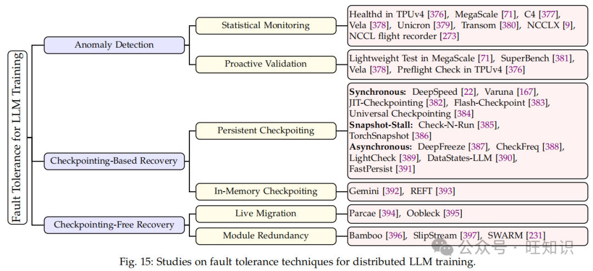

8.1 LLM故障分析
-----------

> 来自不同来源的实证证据强调了LLM训练中故障的频繁性。例如，在384个GPU的集群上，Bloom的平均每周经历1-2次GPU故障\[292\]。Meta的175B OPT模型在992个A100 GPU上进行了全面的培训记录\[398\]，在两周内记录了40多次中断，归因于硬件、基础设施和其他外部因素。更多近期的研究进一步强调了这一问题。Acme\[23\]在其使用超过1,000个A100 GPU的训练过程中平均报告每1-2天发生一次故障。字节跳动的MegaScale项目\[71\]，使用12,288个Ampere GPU，在几周内经历了100多次故障。Meta的LLaMA3在16,384个H100 GPU的集群上进行了54天的预训练，期间经历了466次作业中断\[9\]。频繁的故障主要是由于这些系统的复杂性和规模，以及延长的训练周期。整个训练系统包括我们之前调查过的各个组件的庞大数组。此外，同步训练进一步加剧了这个问题，因为任何单个节点的错误都可能导致整个作业失败，使系统特别容易受到即使是孤立的硬件或软件故障的影响。即使在单个节点上观察到的低至1.5%的日故障率，如Alibaba的集群\[383\]所观察到的，当扩展到具有1,000个GPU的系统时，也会转化为惊人的84.8%的日故障率。然而，训练系统规模的扩大趋势仍在继续，强调了容错机制在维护系统可靠性方面的挑战。这些故障背后的原因多种多样，来自LLM训练系统的各个组件。根据Acme\[23\]，最严重的影响来自硬件故障，如GPU（例如，CUDA-Error、ECC-Error）、NVLink和网络系统（例如，NCCL-Timeout-Error、Connection-Error）。Alibaba C4\[377\]也有类似的观察结果。C4进一步观察到，大多数错误（约82.5%）局限于特定节点甚至单个设备，尽管用户观察到的大多数错误是NCCL错误。LLaMA3预训练\[9\]还报告说，78%的故障是硬件问题。此外，最新一代GPU（A100和H100）倾向于表现出较高的错误率，可能由于快速发展、匆忙交付和增加的功耗\[377\]、\[399\]。除了硬件，分布式训练框架、数据预处理管道或库依赖中的软件相关问题可能导致崩溃或意外行为\[23\]、\[378\]、\[399\]。模型本身的复杂性质可以引入不稳定性，如损失尖峰、数值溢出或下溢、梯度爆炸或优化困难\[398\]、\[400\]。数据中心的外部因素，如停电或冷却系统故障，进一步导致系统不稳定。例如，集群服务器房间的高温也可能导致GPU过热，从而导致NVLink-Error或ECC-Error\[23\]或训练速度不稳定\[9\]。这些频繁和多样化的LLM故障导致GPU的显著浪费。这种效率低下主要表现为两种方式：故障恢复和性能下降。首先，LLM训练作业定期保存检查点，以维护进度。发生故障时，系统维护人员必须首先定位和诊断问题，然后通过回滚到先前的检查点来重新启动训练。然而，一些硬件故障可能很难主动检测，并且通常需要大量的时间来诊断和恢复，导致LLM训练的长时间停滞。其次，由于网络链路故障\[377\]或异常计算减速\[71\]导致的集群中的落后者，可以显著降低MFU，进一步加剧整体训练效率的下降。Meta的175B OPT模型的训练就是一个例子\[398\]。虽然基于MFU的理想训练时间估计为大约25天，但实际训练持续了大约57天。这意味着惊人的56%的总时间被浪费在处理各种故障上，突显了系统不稳定对资源利用率和LLM训练效率的严重影响。

8.2 异常检测
--------

> 快速检测和诊断LLM故障对于维护训练稳定性和效率至关重要。这个过程，称为异常检测，主要采用两种方法：统计监控和主动验证。

### 8.2.1 统计监控

> 统计监控是一种系统性的方法，用于观察和分析LLM训练过程中的各种指标和指示器。该方法涉及收集、处理和解释数据，以识别异常或与预期行为的偏差。在典型的设置中，每个GPU都有一个专用的监控进程，负责收集基本信息和运行时统计数据\[71\]、\[378\]、\[379\]。然后将这些统计数据作为心跳消息传输到中央监控节点进行进一步分析。未能发送心跳消息的节点被视为已失败。这个监控系统的主要目标是及时检测异常，允许快速恢复，以最小化训练中断并保持整体效率。LLM训练中监控的大多数运行时统计数据与硬件相关，包括GPU和网络指标。最近的工作\[71\]、\[378\]、\[379\]使用NVIDIA DCGM\[401\]收集与GPU相关的统计数据，包括SM块利用率、SM占用率、SM管道利用率、PCIe流量率、NVLink流量率等。一个经常出现的问题是GPU内存行重映射，它在硬件中无缝地用稀疏的单元替换已知的降级内存

> 单元。Vela\[378\]通过利用DCGM中的DCGM\_FI\_DEV\_ROW\_REMAP\_PENDING统计数据来检测这个问题。Megascale\[71\]和Transom\[380\]还通过分析训练日志中发生的错误来检测错误。除了GPU指标外，网络统计数据对于监控分布式训练性能至关重要。MegaScale\[71\]跟踪RDMA流量指标以检测潜在的异常。它还开发了可视化系统，手动识别效率低下的GPU。Unicorn\[379\]检测诸如NCCL超时、TCP超时和任务挂起等错误，并在训练期间延迟通知。C4\[377\]收集连接细节，如RDMA IP和QP号码，以及传输层的消息统计数据，包括传输计数、大小和持续时间，以检测训练减速和挂起。集体通信活动也可以通过PyTorch内置的NCCL飞行记录器\[273\]进行监控，该记录器将集体元数据和堆栈跟踪捕获到环形缓冲区，以便稍后诊断。Meta进一步与PyTorch共同设计了NCCLX\[9\]，允许PyTorch访问其内部状态，以实现快速准确的故障检测。NCCLX跟踪每个NCCLX通信的内核和网络活动，这可以帮助诊断通信问题。Vela\[378\]实现了一个增强的MultiNIC健康检查器，收集每对节点上每个端口的节点网络带宽数据。这些信息可以用来检测具有降级RoCE/GDR性能的节点。利用LLM训练的关键特征作为先验知识，Transom\[380\]开发了机器学习算法进行异常检测。统计监控还使Google的TPUv4超级计算机\[376\]具有弹性。每个TPUv4机器都配备了一个healthd守护进程，实时监控IC互联（芯片间互联）、PCIe链接和TPU ASIC。检测到的严重症状将通知集群调度程序采取适当措施，如驱逐受影响的作业或重新安排它们。

### 8.2.2 主动验证

> 主动验证提供了一种替代基于在线统计监控的反应性故障排除的方法，旨在在故障发生之前验证训练系统。然而，验证测试时间和准确性之间存在权衡，因为全面的验证可能会显著影响有效的训练时间。MegaScale\[71\]引入了一系列轻量级测试，包括网络主机和NCCL测试，以诊断广泛的潜在故障。Vela\[378\]采用了两级策略，定期在每个节点上运行轻量级测试，并且仅在节点空闲时执行更具侵入性的测试。Google的TPUv4超级计算机在用户作业之前实施了预飞行检查\[376\]，包括端到端检查和针对硬件健康的意向驱动检查器。SuperBench\[381\]是一个全面的基准测试套件，用于评估单个硬件组件，结合了一个选择器来平衡验证时间和潜在问题相关处罚。

8.3 基于检查点的恢复
------------

> 定期保存模型状态，即检查点，以及在发生故障后从最新检查点恢复计算是容错LLM训练的常见做法。然而，这带来了一个困境：频繁的检查点会带来高I/O开销，而不频繁的检查点在发生故障时会导致大量的进度损失。为了解决这个困境，设计了快速持久和内存中的检查点方法。

### 8.3.1 持久检查点

> 持久检查点涉及将模型状态保存到非易失性存储中，例如SSD和远程云存储，确保系统故障期间数据的持久性。该过程通常包括两个阶段：首先，快照阶段将模型状态从GPU复制到CPU内存，其次，持久阶段将快照写入持久性存储设备。尽管由于存储设备的低带宽而产生相当大的I/O开销，持久检查点仍然是由于其易用性和可靠性而广泛使用的一种容错方法。已经提出了先进的持久检查点方法，以减少训练停滞，从而实现更频繁的检查点，而不会显著影响性能。

**同步检查点。**为了保持模型参数的一致性，DeepSpeed的默认同步检查点\[22\]和Varuna\[167\]定期停止训练过程，以在数据并行等级0上同步执行持久存储的检查点。这种方法在快照和持久阶段导致GPU空闲时间，导致资源利用不足。认识到大多数故障可以归因于单个GPU或网络设备，JIT-Checkpointing\[382\]提出了一种替代策略。它在发生故障后立即进行即时检查点，允许从这些即时检查点恢复训练。这种方法显著降低了浪费GPU时间的成本，将其限制在最多一个微批次迭代的工作上。DLRover Flash-Checkpoint\[383\]利用分布式缓存服务加速迁移效率。Universal Checkpointing\[384\]引入了一种通用检查点表示，将分布式检查点存储与并行化技术解耦。Universal Checkpointing可以根据不同的需求轻松地将检查点从一个并行化策略转换为另一个。

**快照-停滞检查点。**为了在保持检查点一致性的同时减少LLM训练停滞，Check-N-Run\[385\]将快照和持久阶段解耦。它通过仅在快照阶段停滞训练并使用专用的后台CPU进程异步持久化快照，实现原子检查点。TorchSnapshot\[386\]通过张量分块和多线程磁盘写入进一步优化了这个过程。通过创建分块的快照，TorchSnapshot允许持久阶段通过并行写入更早地开始，从而减少整体训练停滞时间。MegaScale\[71\]和InternEvo\[18\]也采用快照-停滞方法进行快速检查点和恢复。快照阶段停滞训练几秒钟以捕获模型状态，而持久阶段异步地将检查点从CPU内存传输到分布式文件系统。MegaScale通过指定数据并行组中的单个工作器从分布式文件系统中读取来优化恢复过程，从而减轻了低带宽瓶颈。然后，这个工作器将检查点数据广播到其他GPU，实现整个系统的更快、更有效的恢复。为了节省存储空间，InternEvo还异步地将检查点从昂贵的热存储移动到更便宜的冷存储。

**异步检查点。**异步检查点旨在通过将快照和持久阶段与训练同时执行来最小化训练停滞。DeepFreeze\[387\]将轻量级（快照）和重量级（持久）持久策略应用于后台，将检查点跨数据并行GPU分片，以分布I/O工作负载。CheckFreq\[388\]仔细地将快照和持久阶段与后续迭代的前向和后向传递进行流水线化，确保在下一次参数更新之前完成快照。它还动态调整检查点频率，以平衡恢复成本和运行时开销。LightCheck\[389\]利用迭代间数据依赖性，引入分层检查点流水线以减少停滞。DataStates-LLM\[390\]通过预分配固定主机内存进行快照，并利用高效的计算、快照和持久分层流水线。FastPersist\[391\]识别了完全异步持久阶段的风险，并将其与下一次迭代的参数更新同步。它通过使用双缓冲固定内存提高SSD带宽利用率，并减少硬件争用，通过使用数据并行等级的一个子集进行检查点写入。

**8.3.2 内存中的检查点**

> 远程持久存储的低带宽严重限制了检查点的频率，内存中的检查点通过将检查点存储在其他计算节点的内存或专用的内存存储系统中来解决这个限制，显著减少了I/O开销，并实现了更高的检查点频率。Gemini\[392\]提出将检查点保存到CPU内存以实现更快的故障恢复，以及检查点放置策略以最小化检查点丢失和流量调度算法以减少与训练的干扰。REFT\[393\]异步地将模型状态缓存到主机内存和像Redis这样的内存存储中，绕过了检查点I/O，并实现了高检查点频率。它还利用纠删码实现了RAIM5（受RAID5启发，将“磁盘”替换为“内存”），以保护数据免受节点故障的影响。虽然这些方法通过实现更频繁的检查点而不带来性能惩罚，显著推进了LLM训练的容错能力，但它们可能无法提供与传统基于存储的方法相同的长期数据持久性。因此，结合内存和持久检查点的混合方法对于全面容错策略是必要的。

8.4 无检查点恢复
----------

> 无检查点恢复方法旨在通过消除在发生故障时重新启动和回滚到先前检查点的需求来最小化训练停滞。这些技术依赖于自动故障检测机制及时识别问题。当检测到故障时，无检查点方法自动解决问题，并允许训练过程在不中断的情况下继续。通过避免从检查点加载和重复计算的耗时过程，这些方法可以显著减少停机时间并提高整体训练效率。无检查点恢复策略大致可以分为两种主要方法：实时迁移和模块冗余。

### 8.4.1 实时迁移

> 实时迁移利用分布式LLM训练设置中固有的冗余，特别是不同数据并行管道中的模型副本，以在发生故障时恢复模型状态。当检测到故障时，实时迁移方法使用剩余的健康实例或通过将新实例纳入训练集群来动态重新配置并行化策略。然后，将当前模型状态传输到这些重新配置的节点，允许训练过程以最小的中断继续。Parcae\[394\]提出了三种不同的迁移机制，每种机制具有不同的通信开销，以有效地在不同的并行化策略之间传输模型状态。Oobleck\[395\]采用了基于流水线模板的方法进行实时迁移。它维护一组预定义的流水线模板，并在检测到故障时，迅速根据这些模板实例化新的异构流水线。

### 8.4.2 模块冗余

> 模块冗余与实时迁移类似，也利用模型状态的冗余。然而，它不是在不同GPU上恢复最新模型状态，而是通过将计算路由到冗余模块来继续训练。Bamboo\[396\]在持有同一流水线中相邻流水线阶段的GPU中放置一个冗余流水线阶段。这个冗余阶段在训练期间执行冗余计算，利用流水线泡沫，并在发生故障时作为正常阶段激活。SlipStream\[397\]利用跨模型副本流水线的冗余，将故障节点的计算路由到不同数据并行流水线中的节点。SWARM\[231\]提出了一个类似的解决方案，但更侧重于连接不良、异构和不可靠的设备。除了冗余计算外，SWARM还结合了实例迁移来重新平衡流水线，结合了冗余计算和实时迁移方法的方面。

9 结论和展望
-------

  
 

> LLMs的兴起已经改变了人工智能，使得像个人助手、代码生成和科学研究等应用成为可能。像GPT、LLaMA和Gemini这样的模型树立了新的标准，但训练这些庞大的模型，如在16384个GPU上进行的LLaMA-3的54天过程，提出了可扩展性、效率和可靠性方面的挑战。管理庞大的GPU集群需要创新的硬件和网络解决方案。高效的训练需要优化计算、通信和内存使用。可靠性涉及强大的机制，以便在长时间的训练期间检测和从故障中恢复。本综述回顾了LLM训练系统和基础设施的最新进展，突出了提高可扩展性、效率和可靠性的方法。传统的基于数字电路的计算系统，受摩尔定律和丹纳德缩放的指导，正面临满足训练和部署LLMs的计算需求的重大物理和经济限制。因此，AI行业需要创新的解决方案。一种有前景的方法是大规模光电集成技术，它用集成硅光子学取代传统的数字电路，增强计算和通信能力\[402\]。这种光电混合数据中心技术结合了光计算和光网络，提高了单节点计算能力，以及大规模分布式计算的效率。一些工作已经提出利用光网络进行LLM训练。例如，TopoOpt\[67\]优化了分布式训练中的光网络拓扑和并行化策略，提高了计算和通信效率。TPUv4\[42\]使用光电路开关动态重构其3D-Torus互连拓扑，改善了LLM训练中密集通信模式的数据流。此外，Taichi\[403\]探索了一种分布式衍射-干涉混合光子计算架构，有效地将光学神经网络扩展到百万神经元级别，能效为每秒160万亿次操作每瓦（TOPS/W）。未来可能需要在LLM训练和推理方面向硅光子学的范式转变。然而，这一转变将需要在系统设计和实施方面的广泛创新。

**参考资料**

> 标题：**Efficient Training of Large Language Models on Distributed Infrastructures: A Survey**

> 作者：Jiangfei Duan, Shuo Zhang, Zerui Wang, Lijuan Jiang, Wenwen Qu, Qinghao Hu, Guoteng Wang, Qizhen Weng, Hang Yan, Xingcheng Zhang, Xipeng Qiu, Dahua Lin, Yonggang Wen, Xin Jin, Tianwei Zhang, Peng Sun

> 单位：Shanghai AI Laboratory, Chinese University of Hong Kong, Fudan University, Nanyang Technological University, School of Computer Science (Peking University), etc.

> 链接：

[Efficient Training of Large Language Models on Distributed Infrastructures: A Survey](https://arxiv.org/abs/2407.20018)