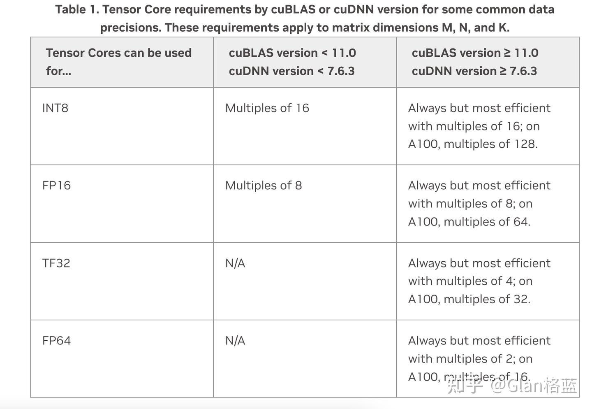
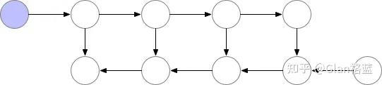
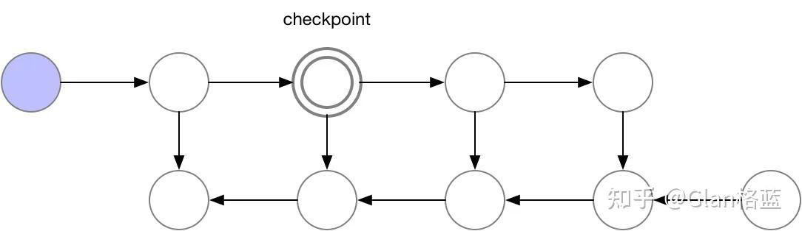
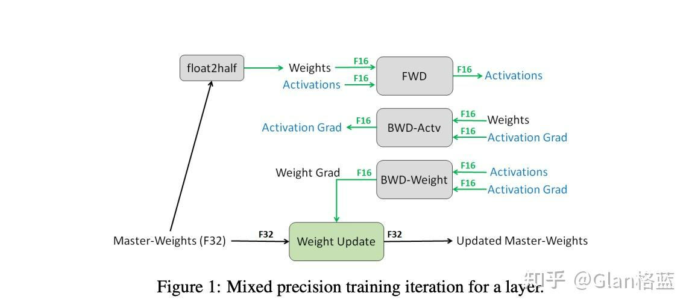
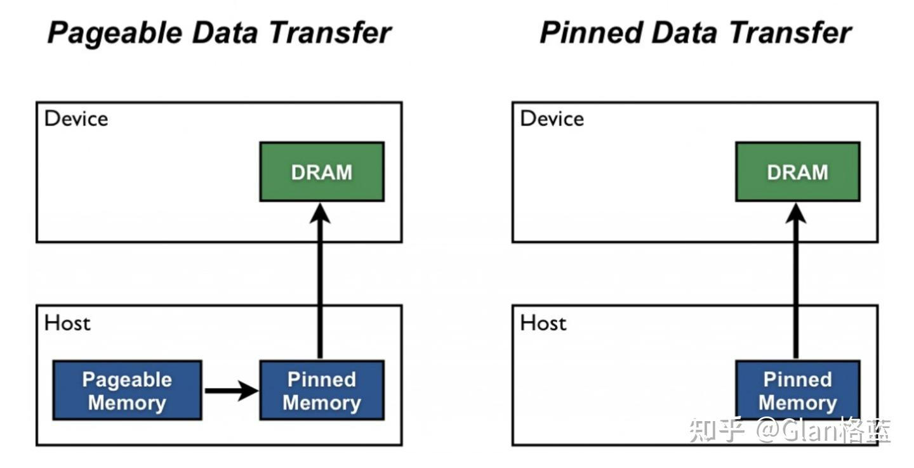

# LLM大模型之训练优化方法
> **作者: Glan格蓝**
> 
> **原文:** [**https://zhuanlan.zhihu.com/p/698787661**](https://zhuanlan.zhihu.com/p/698787661)

### 写在前面

在训练模型尤其是大模型的时候，如何**加快训练速度**以及**优化显存利用率**是一个很关键的问题。本文主要参考HF上的一篇文章[\[1\]](https://zhuanlan.zhihu.com/p/698787661#ref_1)，以及笔者在实际训练中的一些经验，给出一些比较实用的方法。全文共5千字，阅读大概需要10分钟，建议收藏~

先看一个总览的表：

| **方法** | **加快训练速度** | **优化显存利用率** |
| --- | --- | --- |
| Batch size choice | Yes | Yes |
| Gradient accumulation | No  | Yes |
| Gradient checkpointing | No  | Yes |
| Mixed precision training | Yes | (No) |
| Optimizer choice | Yes | Yes |
| Data preloading | Yes | No  |
| DeepSpeed Zero | No  | Yes |
| torch.compile | Yes | No  |

其实加快训练速度本质就是**提高数据吞吐量**，每秒能够处理多少samples，在不爆显存的情况下，尽可能的提高Batch size，但在如今模型参数巨大的情况下，可能一张卡都不够放模型，例如llama-2-7B以FP16加载，都需要接近13G的显存，如果以FP32加载，那就需要25G的显存，在消费级显卡30、40系只有24G显存的卡上就难以训练或者微调。关于不同精度占用的显存详细情况可以看这篇文章。

[Glan格蓝：LLM大模型之不同精度下显存占用与相互转换实践50 赞同 · 4 评论文章](https://zhuanlan.zhihu.com/p/658343628)

所以就有了一些列的优化显存利用率的方法。注：本篇先不讨论分布式训练的优化，将会在下篇文章讨论。

### 1.Batch size choice

增大Batch size既可以加快训练速度，又可以提高显存利用率。这个没啥原理，每秒能够处理的samples变多了，唯一需要祷告的就是不出现OOM。不过Batch size需要注意的是其值最好设置为2^N，为什么呢？这个和[矩阵乘](https://zhida.zhihu.com/search?content_id=243416388&content_type=Article&match_order=1&q=%E7%9F%A9%E9%98%B5%E4%B9%98&zhida_source=entity)、模型维度、硬件都有关系，不同的Batch size是会影响到计算效率的，这是NVIDIA官方做的关于Batch size的实验[\[2\]](https://zhuanlan.zhihu.com/p/698787661#ref_2),下面的图是NVIDIA推荐的Batch size：



### 2.Gradient Accumulation

[梯度累积](https://zhida.zhihu.com/search?content_id=243416388&content_type=Article&match_order=1&q=%E6%A2%AF%E5%BA%A6%E7%B4%AF%E7%A7%AF&zhida_source=entity)。这方法让俺想起了当年在学校实验室炼丹的过程，真是贫穷人士的灵丹妙药，**没有足够的显卡搞不了大的Batch size，但是想要有大Batch size的效果**，那就来试试梯度累积。

简单来说原理就是：每次来一个Batch size的数据，进行前向反向传播，保存梯度不清零，不更新模型参数，梯度积累到一定次数后，根据累积的梯度更新参数，然后梯度清零，进行下一次循环。所以该种方法加快不了训练速度，只是提高了显存的利用率，让你原来Batch size只能设置成2，现在可以设成8了！

先看一下不进行梯度累积的伪代码：

```text-plain
for batch in dataset:  # 遍历每个数据集的批次
    optimizer.zero_grad()  # 梯度清零

    outputs = model(inputs)  # 前向传播，计算输出
    loss = compute_loss(outputs, labels)  # 计算损失

    loss.backward()  # 反向传播，计算梯度
    optimizer.step()  # 更新模型参数
```

看下进行梯度累积的伪代码：

```text-plain
for batch in dataset:  # 遍历每个数据集的批次
    # 重置梯度
    if batch_index % num_accumulation_steps == 0:
        optimizer.zero_grad()  # 每 num_accumulation_steps 步重置一次梯度

    # 前向传播
    outputs = model(inputs)  # 计算输出
    loss = compute_loss(outputs, labels)  # 计算损失

    # 反向传播（累积梯度）
    loss.backward()  # 反向传播，计算并累积梯度

    # 累积了足够的梯度后更新参数
    if (batch_index + 1) % num_accumulation_steps == 0:
        optimizer.step()  # 更新模型参数
```

使用梯度累积时需要**注意学习率的设置**，毕竟小Batch size和大Batch size的学习率还是有区别的，经验的话就是尽量调大点。

### **3.Gradient checkpointing**

[梯度检查点](https://zhida.zhihu.com/search?content_id=243416388&content_type=Article&match_order=1&q=%E6%A2%AF%E5%BA%A6%E6%A3%80%E6%9F%A5%E7%82%B9&zhida_source=entity)。当你训练大一点的模型，Batch size已经设置成1了，但还是出现OOM了，此时如果换不了大显存的显卡，你还是想硬训，那可以试试梯度检查点。

原理还是比较简单的，因为在训练过程中，除了[load模型](https://zhida.zhihu.com/search?content_id=243416388&content_type=Article&match_order=1&q=load%E6%A8%A1%E5%9E%8B&zhida_source=entity)占了一大部分显存外，还有一部分占显存的就是为了在反向传播过程中计算梯度，保存的前向传播的所有激活值。梯度检查点就是选择性地保存一些的激活值，这样在反向传播过程中计算梯度时重新计算没保存的这部分激活值，就是**以时间换空间**。所以这种方法不会加快训练训练速度，还会减慢训练速度，因为部分节点会进行两次前向传播，但极大地提高了显存的利用率。根据HF给出的数据使用梯度检查点，会使训练速度大约降低20%。

下面是一些动图简单的反映了梯度检查点的过程。源于该篇blog[\[3\]](https://zhuanlan.zhihu.com/p/698787661#ref_3)：



> 正常的前向反向传播过程，需要保存的前向传播的所有激活值



> 选择第三个点作为检查点


> 这时，只需要保存第一个节点，选择的检查点以及最后一个节点，节省了第二个和第三个节点保存的显存，但反向传播的时候需要通过前向传播重新计算第二个和第三个节点的激活值

### **4.Mixed precision training**

[混合精度训练](https://zhida.zhihu.com/search?content_id=243416388&content_type=Article&match_order=1&q=%E6%B7%B7%E5%90%88%E7%B2%BE%E5%BA%A6%E8%AE%AD%E7%BB%83&zhida_source=entity)。要了解混合精度训练，首先要了解各个数值类型，请先看下面这篇文章，如果很熟悉可以略过：

[Glan格蓝：LLM大模型之精度问题（FP16，FP32，BF16）详解与实践374 赞同 · 20 评论文章](https://zhuanlan.zhihu.com/p/657886517)

正常模型训练的数值类型都是FP32，这个数值类型虽然精度和范围更大，但占用的显存和计算量也更大。所以混合精度训练就是在训练时一部分计算使用FP16，一部分计算使用FP32，加快训练速度同时也减少了显存占用（理论上应该是减少了显存占用，但实际上并没有特别明显）。但是注意：模型较小batch也较小，硬件也比较拉的情况下，混合精度训练可能会没有效果甚至会更慢。这时候训练速度主要消耗在IO（在GPU和GPU间传送数据），以及混合精度频繁进行FP16与FP32的转换。

那哪些计算使用FP16，哪些使用FP32呢？在NVIDIA的这篇Paper中[\[4\]](https://zhuanlan.zhihu.com/p/698787661#ref_4)



首先会拷贝一份FP32权重的副本，然后整个计算过程为：权重从FP32转成FP16进行前向传播并计算loss，然后继续使用FP16反向传播计算梯度，最后转成FP32更新到FP32的权重上，这样循环计算。**用FP32保存权重主要是为了避免溢出，保持一定的精度**。Paper中实验表明，用FP16保存权重会造成80%的精度损失。细节可以看下Paper。

目前torch实现的是自动混合精度，他会自动的管理精度，并不是像上面paper中的前向反向都使用FP16，比如[归一化](https://zhida.zhihu.com/search?content_id=243416388&content_type=Article&match_order=1&q=%E5%BD%92%E4%B8%80%E5%8C%96&zhida_source=entity)（batch normalization），梯度累积时等需要高精度的也还是用的FP32，细节可以看[\[5\]](https://zhuanlan.zhihu.com/p/698787661#ref_5)，还有如果显卡支持，还可以实现BF16，TF32等数据类型。下面是伪代码：

```text-plain
import torch
import torch.nn as nn
import torch.optim as optim
from torch.cuda.amp import autocast, GradScaler

# 定义模型、损失函数和优化器
model = MyModel().cuda()
criterion = nn.CrossEntropyLoss()
optimizer = optim.Adam(model.parameters(), lr=0.001)

# 初始化梯度缩放器
scaler = GradScaler()

for data, target in train_loader:
    data, target = data.cuda(), target.cuda()

    optimizer.zero_grad()

    # 在autocast上下文中进行前向传播和损失计算
    with autocast():
        output = model(data)
        loss = criterion(output, target)

    # 使用梯度缩放器进行反向传播计算梯度
    scaler.scale(loss).backward()

    # 更新优化器
    scaler.step(optimizer)

    # 更新缩放器
    scaler.update()
```

### 5.Optimizer choice

选择合适的优化器是既可以加快训练速度又可以提高显存利用率的。目前训练Transformer类模型最常用的优化器是Adam或AdamW（带权重衰减的Adam），Adam通过存储先前梯度的滚动平均值可以实现比较好的收敛，但这增加了与模型参数数量成正比的额外显存占用。如果安装了[NVIDIA/apex](https://link.zhihu.com/?target=https%3A//github.com/NVIDIA/apex)，那么adamw\_apex\_fused是训练速度最快的优化器。

HF的Trainer目前集成了很多优化器，也就是指定一个参数的是事情。`adamw_hf`, `[adamw_torch](https://zhida.zhihu.com/search?content_id=243416388&content_type=Article&match_order=1&q=adamw_torch&zhida_source=entity)`, `adamw_torch_fused`, `adamw_apex_fused`, `adamw_anyprecision`, `[adafactor](https://zhida.zhihu.com/search?content_id=243416388&content_type=Article&match_order=1&q=adafactor&zhida_source=entity)`, or `adamw_bnb_8bit`这些等等。

简单看下两种AdamW优化器的替代选择的显存对比

对于一个3B参数的模型，“google-t5/t5-3b”

标准AdamW优化器需要24G左右的显存，它每个参数使用8字节存储(8\*3 => 24GB)

Adafactor优化器需要12G左右的显存，它每个参数使用4字节存储(4\*3 => 12GB)

adamw\_bnb\_8bit（量化后的AdamW）优化器需要6G左右的显存，它每个参数使用2字节存储(2\*3 => 6GB)

但这这些显存占用明显改进的优化器，可能会带来收敛速度慢，精度下降等问题，还是要具体情况具体分析，俺一般使用adamw\_apex\_fused。

### 6.Data preloading

数据预加载。想要加快训练速度，很重要的一点就是要能够**以GPU可以处理的最大速度来提供数据**，使GPU的利用率达到100%。主要有以下两个方法加快数据供给。

DataLoader(pin\_memory=True, ...)，将数据预加载到CPU的[锁页内存](https://zhida.zhihu.com/search?content_id=243416388&content_type=Article&match_order=1&q=%E9%94%81%E9%A1%B5%E5%86%85%E5%AD%98&zhida_source=entity)中，什么是锁页内存，简单来说就是可直接访问该页CPU内存；未锁页的内存，会被更换到磁盘上，如果下次需要该页了，则需要重新加载到内存里。这就会需要额外的时间了。相关的一些资料[\[6\]](https://zhuanlan.zhihu.com/p/698787661#ref_6)[\[7\]](https://zhuanlan.zhihu.com/p/698787661#ref_7)原文中也给了了相应的速度:

锁页内存和[GPU显存](https://zhida.zhihu.com/search?content_id=243416388&content_type=Article&match_order=1&q=GPU%E6%98%BE%E5%AD%98&zhida_source=entity)之间的拷贝速度大约是6GB/s  
[可分页内存](https://zhida.zhihu.com/search?content_id=243416388&content_type=Article&match_order=1&q=%E5%8F%AF%E5%88%86%E9%A1%B5%E5%86%85%E5%AD%98&zhida_source=entity)和GPU显存间的拷贝速度大约是3GB/s



但要注意，如果数据量特别大，CPU的内存不是特别大的情况下，谨慎使用此参数，遇到过内存爆了的情况。。

第二个是DataLoader(num\_workers=4, ...)，给DataLoader使用更多的线程预加载数据。

### 7.DeepSpeed Zero

Deepspeed 核心就是四个字”[**显存优化**](https://zhida.zhihu.com/search?content_id=243416388&content_type=Article&match_order=1&q=%E6%98%BE%E5%AD%98%E4%BC%98%E5%8C%96&zhida_source=entity)“，其并不能加快训练速度，如果你显存够用是可以不使用Deepspeed 的，但训练大模型一般来说显存都不够用。关于Deepspeed 的使用可以看这篇回答：

[如何评价微软开源的分布式训练框架deepspeed？29 赞同 · 5 评论回答](https://www.zhihu.com/question/371094177/answer/3330130413)

### 8.Using torch.compile

PyTorch 2.0 引入了一个新的[编译函数](https://zhida.zhihu.com/search?content_id=243416388&content_type=Article&match_order=1&q=%E7%BC%96%E8%AF%91%E5%87%BD%E6%95%B0&zhida_source=entity)，无需对现有的 PyTorch 代码进行任何修改，只需添加一行代码即可优化代码：`model = torch.compile(model)`。即可进行训练和推理加速。关于原理知乎上有一个问题专门讨论了这个问题，可以关注一下：

[pytorch 2.0 torch.compile真的使你的训练变快了吗？290 关注 · 26 回答问题](https://www.zhihu.com/question/590338541)

以及官方的链接[\[8\]](https://zhuanlan.zhihu.com/p/698787661#ref_8)

上面的这些方法，如果使用HF的Trainer的话，都是在训练参数中就可以非常方便的实现，HF的Trainer的使用可以看这篇文章：

[Glan格蓝：LLM大模型之Trainer以及训练参数185 赞同 · 4 评论文章](https://zhuanlan.zhihu.com/p/662619853)

持续分享大模型相关内容，如果本篇文章对你有帮助，欢迎点赞关注~

参考
--

1.  [^](https://zhuanlan.zhihu.com/p/698787661#ref_1_0)\[1\] [https://huggingface.co/docs/transformers/perf\_train\_gpu\_one](https://huggingface.co/docs/transformers/perf_train_gpu_one)
2.  [^](https://zhuanlan.zhihu.com/p/698787661#ref_2_0)\[2\] [https://docs.nvidia.com/deeplearning/performance/dl-performance-fully-connected/index.html#batch-size](https://docs.nvidia.com/deeplearning/performance/dl-performance-fully-connected/index.html#batch-size)
3.  [^](https://zhuanlan.zhihu.com/p/698787661#ref_3_0)\[3\] [https://medium.com/tensorflow/fitting-larger-networks-into-memory-583e3c758ff9](https://medium.com/tensorflow/fitting-larger-networks-into-memory-583e3c758ff9)
4.  [^](https://zhuanlan.zhihu.com/p/698787661#ref_4_0)\[4\] [https://arxiv.org/pdf/1710.03740](https://arxiv.org/pdf/1710.03740)
5.  [^](https://zhuanlan.zhihu.com/p/698787661#ref_5_0)\[5\] [https://pytorch.org/docs/stable/amp.html](https://pytorch.org/docs/stable/amp.html)
6.  [^](https://zhuanlan.zhihu.com/p/698787661#ref_6_0)\[6\] [https://discuss.pytorch.org/t/when-to-set-pin-memory-to-true/19723](https://discuss.pytorch.org/t/when-to-set-pin-memory-to-true/19723)
7.  [^](https://zhuanlan.zhihu.com/p/698787661#ref_7_0)\[7\] [https://developer.nvidia.com/blog/how-optimize-data-transfers-cuda-cc/](https://developer.nvidia.com/blog/how-optimize-data-transfers-cuda-cc/)
8.  [^](https://zhuanlan.zhihu.com/p/698787661#ref_8_0)\[8\] [https://pytorch.org/tutorials/intermediate/torch\_compile\_tutorial.html](https://pytorch.org/tutorials/intermediate/torch_compile_tutorial.html)