# 从头预训练大模型实践经验
> 原文: [https://mp.weixin.qq.com/s/\_6--D3IWtJErWrEjd8hOpw](https://mp.weixin.qq.com/s/_6--D3IWtJErWrEjd8hOpw)

前言
--

如何从头训练一个基座大模型？

今天介绍一篇文章，其没有更多的理论依据，一切都是一些实践经验。Weights & Biases是一个强大的用于深度学习可视化的工具，可以实现对深度学习各项参数的可视化，本篇介绍的文章也是从这些大量的日志中总结的一些经验。

如果正在做基座大模型预训练的同学可以看看～

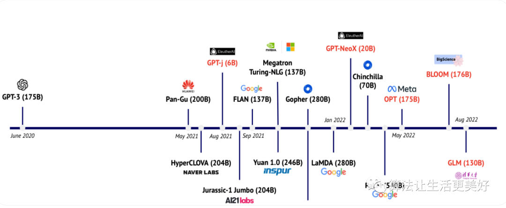

论文：《Current Best Practices for Training LLMs from Scratch》：`https://uploads-ssl.webflow.com/5ac6b7f2924c656f2b13a88c/6435aabdc0a041194b243eef_Current%20Best%20Practices%20for%20Training%20LLMs%20from%20Scratch%20-%20Final.pdf`

Introduction
------------

*   Build vs. Buy Pre-trained LLM Models

文章指出在训练大模型前，最好先考虑一下是否真的需要自己从头开始预训练一个大模型，通常来说有三个选择：

（1）不训练，直接调用现有大模型厂商（比如openai提供的chatgpt、GPT4）提供的API服务来商业落地。

（2）基于市面上已有的大模型基座（比如GPT-J、BLOOM等等）进行热启进行二次训练。

（3）完全从头开心训练一个大模型。

到底该选择哪个？文章也从各种缺点、优点以及应用场景等三个方面进行了总结：

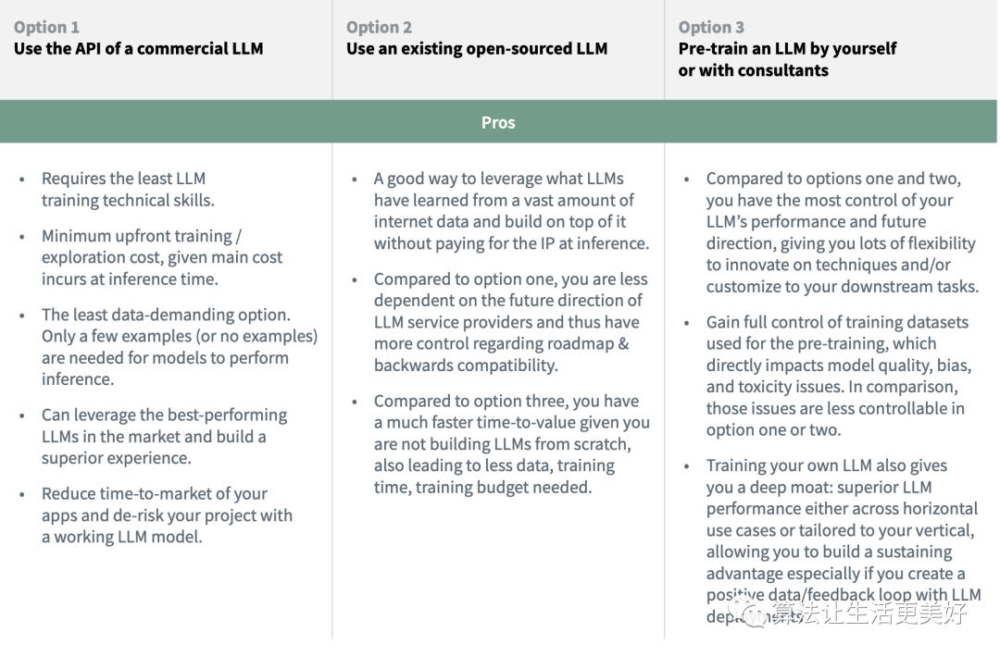

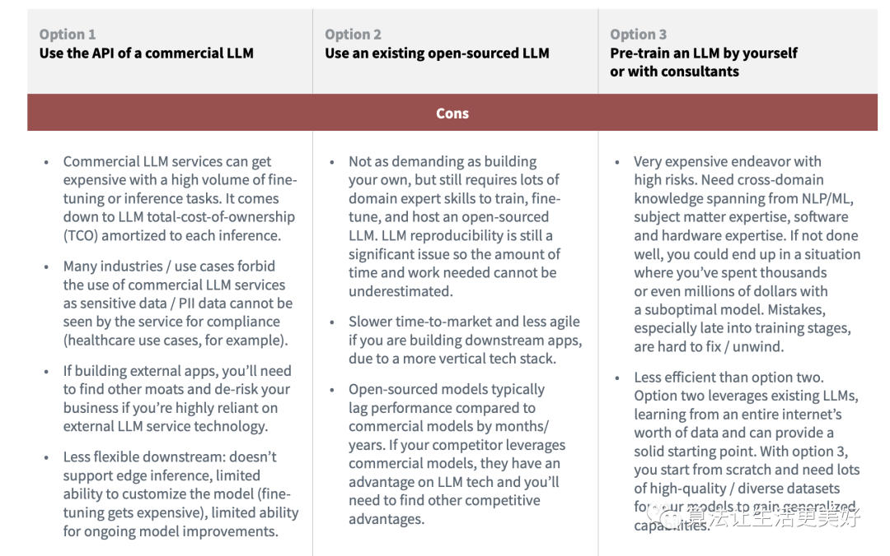

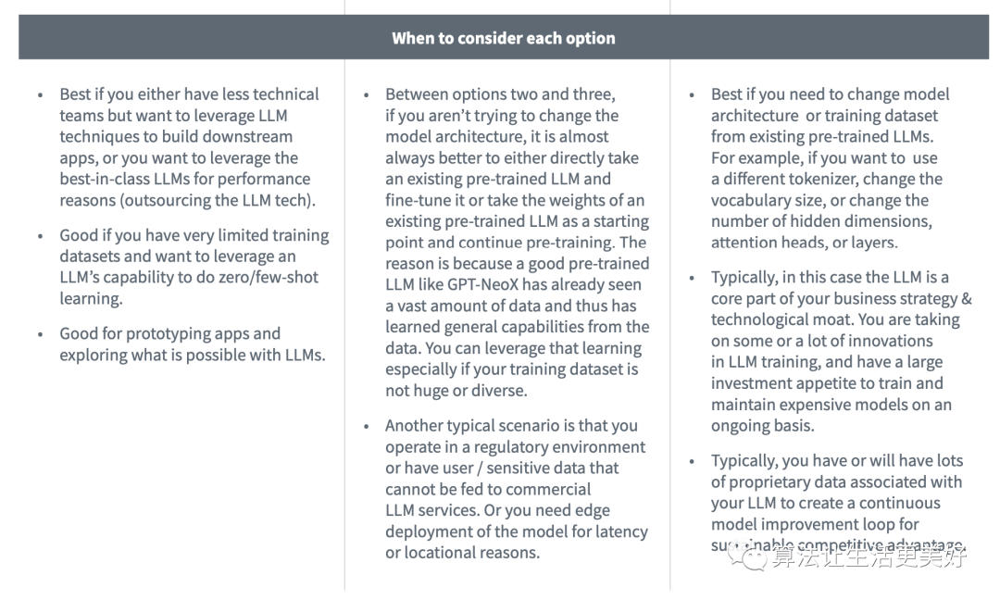

总结来说就是从（1）到（3），需要的投入越来越大，但是自主控制权和自身壁垒也随着会越来越高。

*   The Scaling Laws

在决定好了确实要训练大模后，紧接着面临的一个问题就是：训练多大的模型呢？

openai在早前2020年的一篇文章说不断的加大模型的参数量很重要，比增加训练数据量要重要的多，但是这一结论在随后2022年Deepmind的一篇文章发现了变化，Deepmind发现现在很多大模型其实都没有被更加充分的训练，为了证明这一点Deepmind训练了一个相比于Gopher更小的Chinchilla模型，其大小只有Gopher四分之一，但是它用了4.6倍的数据来训练，最后的效果优于Gopher。

Deepmind指出为了获得更好的性能，模型参数量和数据量应该同时增加，即如果预算愿意增加10倍的话，那最好在模型参数量和数据量分别拆开增加3.1倍扩大，如果是愿意增加100倍预算的话，那最好在模型参数量和数据量分别拆开增加10倍扩大。为此其还提供了了一个参考

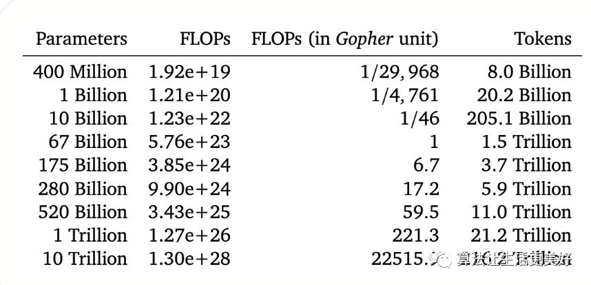

现在有很多模型其实是还没有得到充分训练：

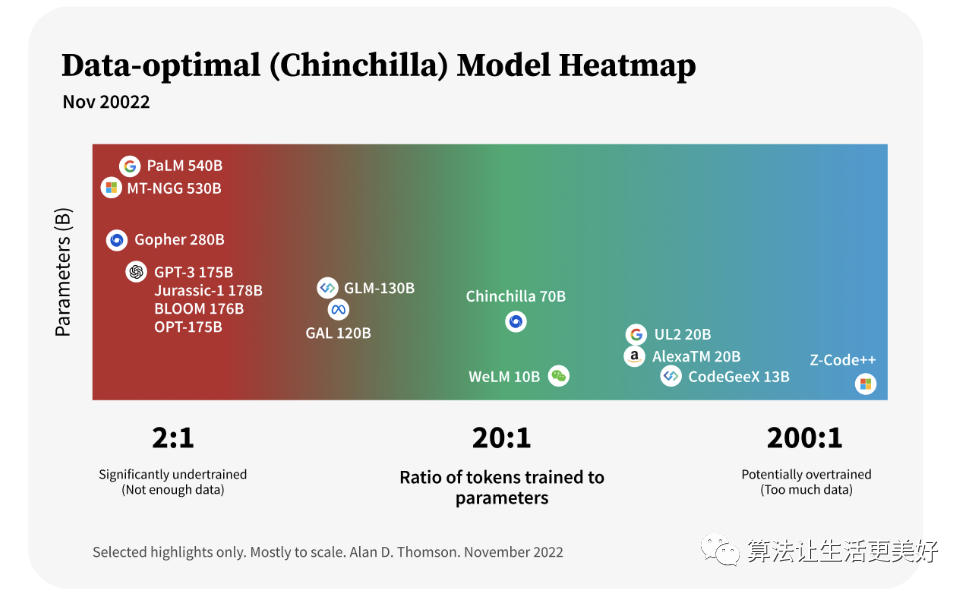

*   HARDWARE

在规划好了参数量以及数据后，接下来需要考虑的就是硬件了，训练大模型是非常吃GPU资源的，比如

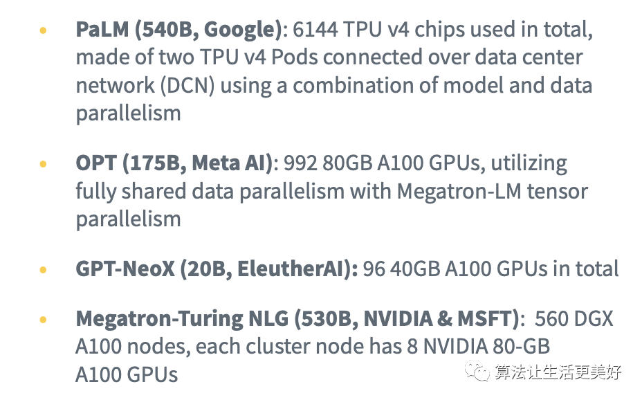

其中内存和计算利用效率是两个重要的考虑方面。

*   Techniques for Parallelization

并行化技术主要就是大规模利用GPU来进行并行化任务

（1）Data Parallelism

这是最常见的并行化手段，它主要是把数据分成多个块，然后每个节点就可以在本地独立的跑各自的数据任务，最后再和其他节点通信，进而汇总最后的结果；它的好处就是计算效率高，每个节点可以独自计算自己的任务且这种方法易于实现，但是缺点就是内存要求较高，因为它需要把模型在每个节点都完整的copy一份。

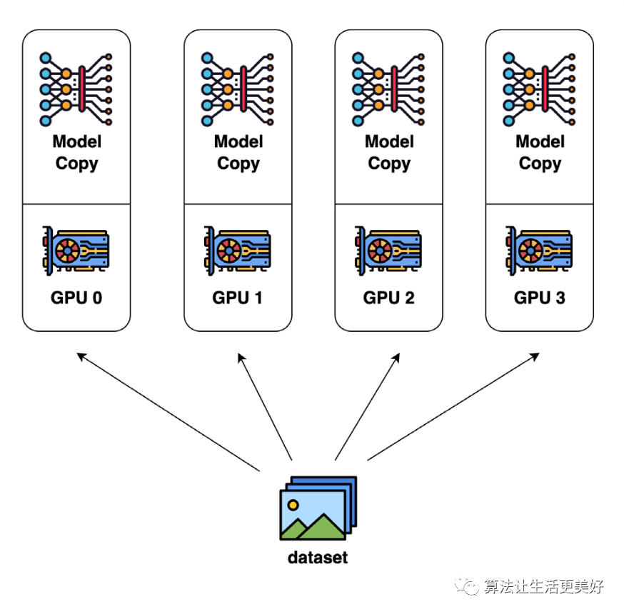

（2）Tensor Parallelism

张量并行就是将大型矩阵乘法分解为较小的子矩阵计算，然后使用多个GPU同时执行这些计算。这样可以通过异步性和减少节点之间的通信开销来加快训练时间。张量并行的好处是它具有提高了内存效率，但是缺点就是它在每次前向和反向传播中引入了额外的通信，因此需要较高通信带宽。

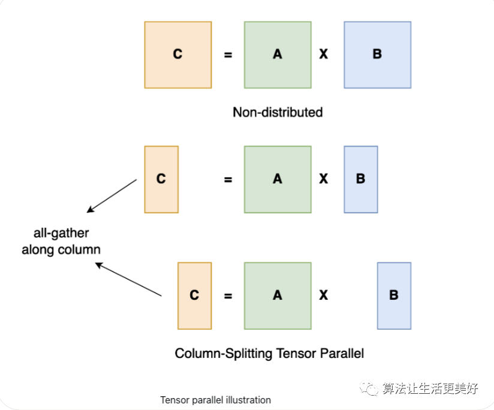

（3）Pipeline parallelism and model parallelism

Pipe并行和模型并行可以尽可能减少通信，显著的提高训练速度。如果对比上述张量并行来看的话，Pipe并行和模型并行属于“层间并行”，而张量并行属于“层内并行”，具体来说模型并行是将模型分割到多个GPU上，并对每个模型使用相同的数据；因此，每个GPU处理的是模型的一部分，而不是数据的一部分。同时这两种方法的缺点是：并行的程度受到模型深度的限制，因此无法无限扩展。

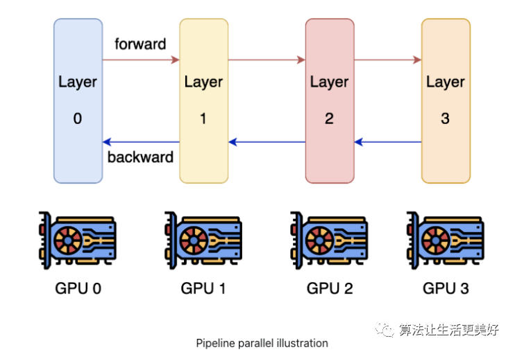

当然了还可以把上面的并行技术进行打包组合，一并利用起来，比如NVIDIA提出来的PTD-P方法是在多机之间利用pipeline parallelism，在单机多卡上面利用tensor parallelism和Data Parallelism；为了将这些技术更加方便的用到深度深度学习领域，一些深度学习框架比如TensorFlow, Torch等等都进行了很好的支持。

（4） Gradient accumulation

梯度累计是将多个batch的梯度进行累计，然后统一更新，其减少了多GPU之间的通信。

（5） Asynchronous stochastic gradient descent optimization

其主要思路就是**每次计算一个很小的batch，然后把梯度收集好，然后等到最后需要更新模型参数的时候再把这些梯度发回到servers**。

*   DATASET COLLECTION

硬件准备好后，接下来就是收集数据了，低质量的数据训练出来的模型也是很垃圾的。对高质量、海量、多样化的数据集进行仔细处理，直接有助于模型在下游任务中的性能以及模型的收敛。

数据多样性尤其重要，只有当模型见过足够多种类的数据后，他在后续多种下游任务中才有可能表现出惊艳的性能。所以可以尽可能使得数据\_**来源多样性**\_，比如公开开源语料，代码数据，教科书等等。同时作者还介绍了一下Pile这个数据集，它是一个开源的大规模数据集，十分珍贵。

*   DATASET PRE-PROCESSING

本节主要讲一些数据预处理的工作，这也是数据环节最重要的一环，其旨在得到一个高质量的数据。

（1）Data sampling

数据采样是一个最基本的手段，最容易想到的上采样一些高质量来源的数据，下采样一些低质量的数据。当然这也和最终想要一个什么样的模型有关，比如 Meta AI就是想训练一个science的大模型，所以其主要就是采样用一些paper的数据等等。甚至可以训练一个分类器来过滤数据。

（2）Data cleaning

对数据进行清洗和重新格式化，比如删除HTML代码或标记等等。此外，对于某些项目，还会纠正拼写错误、处理跨领域同形异义词，或者删除有偏见/有害言论等等，不过一些其他项目认为模型应该看到真实文本世界，并自动学会处理拼写错误和有害内容，所以不采用后面这些处理。

（3）Non-standard textual components handling

该部分就是需要把非文本的部分转化为文本，比如表情包等等

（4）Data deduplication

数据去重，比如常用的LSH。

（5） Downstream task data removal

数据泄漏就是怕测试数据集不小心正好在训练集中，所以可以使用下游任务数据移除方法（如n-grams）来删除在测试数据集中也存在的部分训练数据。

*   Tokenization

文本id化就是tokenizer的活了，作者在这里也进行了一番总结：

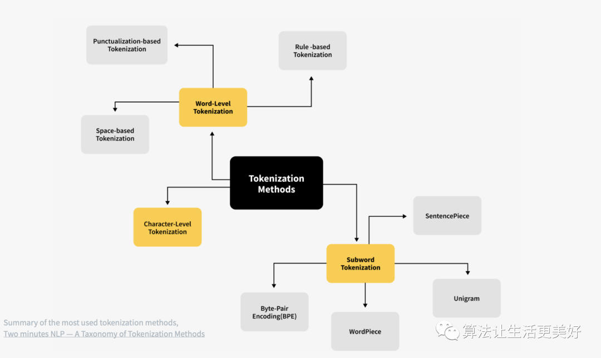

目前最流行的就是subword-based tokenizers比如byte-pair encoding (BPE)

同时作者也给出了在选择tokenizer的时候需要考虑的一些方面：

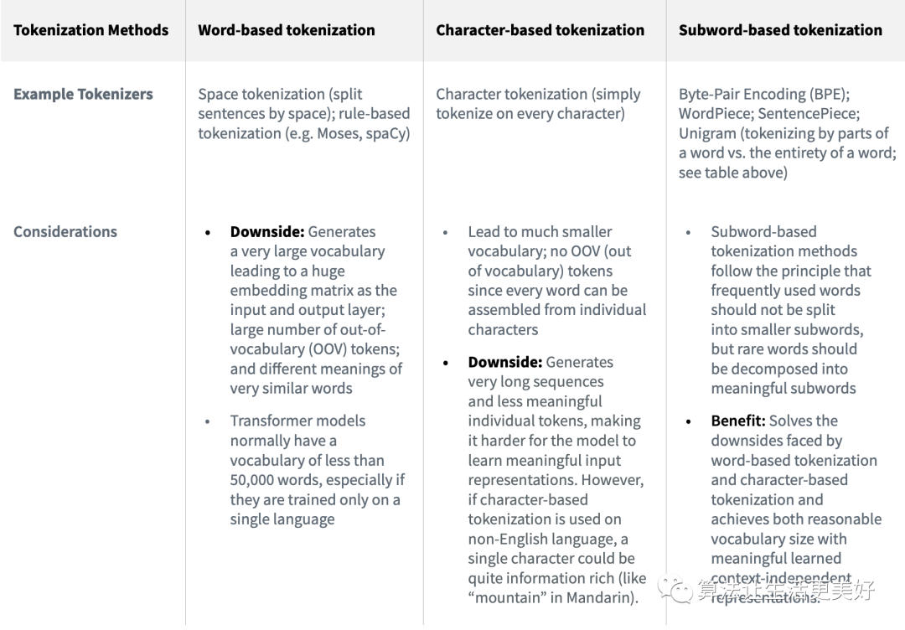

由于subword-based比较流行，作者进一步给了其更多的细节：

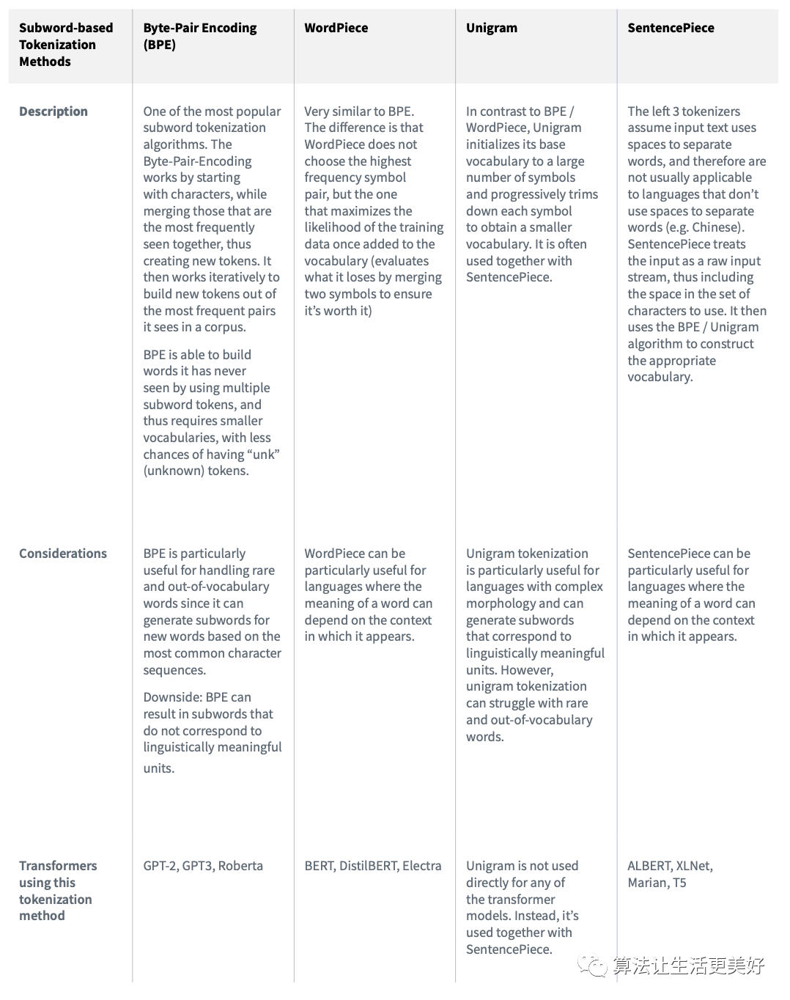

**吃果冻不吐果冻皮**

致力于分享AI前沿技术（如：LLM/MLOps/RAG/智能体）、AI工程落地实践、AI基建（如：算力、网络、存储）等。

165篇原创内容

公众号

*   PRE-TRAINING STEPS

训练一个拥有数十亿参数的语言模型是一个高度实验性的过程，需要进行大量的试错成本。所以\*\*可以从训练一个更小的模型开始，确保流程都没问题且有效果，然后逐渐扩大到模型的参数量。\*\*随着规模的扩大，会出现一些需要新的需要解决的问题。

（1）Model Architecture

为了降低试错成本，可以借鉴一些已经成功模型的框架比如GPT3的模型框架比如GPT-NeoX-20B、OPT-175B都是在GPT3的模型框架的基础上做了一些优化。

（2）Experiments and Hyperparameter Search

预训练过程涉及大量实验，这里面有大量的超参，比如：**权重初始化、位置嵌入、优化器、激活函数、学习率、权重衰减、损失函数、序列长度、层数、注意力头数、参数数量、稠密层与稀疏层、batchsize和dropout**等等。

这里一般会**结合手动试错和自动超参数优化**（HPO）的方式，来寻找最佳的配置组合以实现最佳性能。典型的需要进行自动搜索的超参数包括学习率、batchsize、dropout等。

但是毕竟训练一个百亿参数的模型是非常耗费资源的，所以不可能全部无脑搜索参数，这里可以借鉴一些已有的工作，此外，还有一些超参数需要在训练时进行调整，以平衡学习效率和训练收敛性：

学习率：前期线性增加，然后再衰减。batchsize开始时使用较小，然后逐渐增加到较大的size。

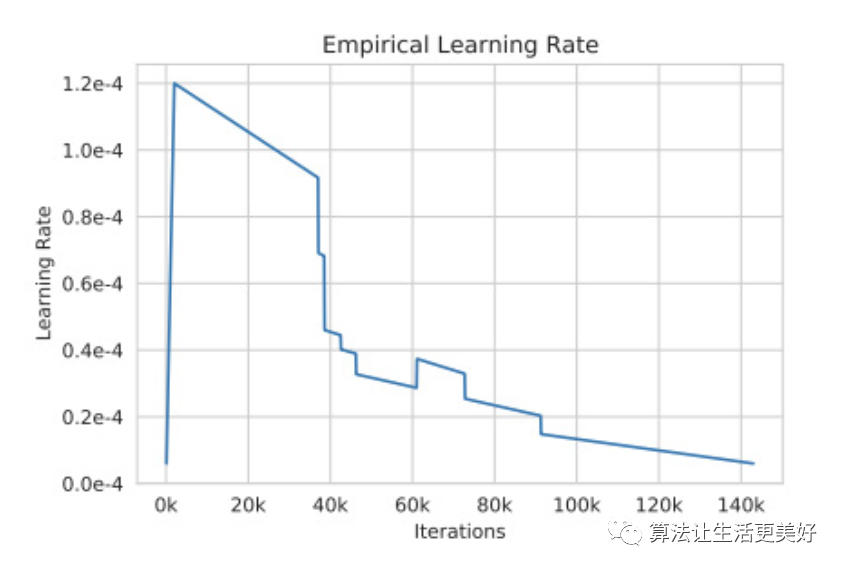

不过在训练这么大且复杂的大模型，就像其他任何足够大且复杂的项目一样，随时可能会出现各种问题。

（3）Hardware Failure

在训练过程中，硬件可能会随时出现一些故障问题，这个时候不得不手动进行自动重新启动，这个时候可以以保存的最后一次checkpoint热启继续训练，同时记得把故障的节点进行隔离。

（4）Training Instability

训练的稳定性也是一个最常见的基本挑战。在训练模型时学习率和权重初始化等超参数会直接影响模型的稳定性。比如当loss开始学崩时，同样可以从较早的checkpoint降低学习率然后重新开始训练。

模型越大loss越可能发生波动也就是学崩，目前还没有系统性的全面分析，下面是一些\_**实践经验**\_来提高模型收敛。

（a）Batch size: 在GPU资源允许的情况下，把size开到最大。

（b）Batch Normalization: 在mini-batch内对激活层归一化。

（c）Learning Rate Scheduling: 较高的学习率可能会导致loss振荡或发散，从而导致损失波动。可以随时间递减学习率，即逐渐减小模型参数的更新幅度，提高稳定性。常见的schedules包括step decay等等。不过事先很难确定要使用哪种学习率，但可以使用不同的学习率schedules方式来观察模型的反应。

（d）Weight Initialization: 好的模型权重初始化可以直接帮助模型最后的收敛，最常见的就是高斯噪声初始化，或者在Transformer模型中使用T-Fixup初始化。

（e）Model training starting point: 如果已经有一个在相关任务中训练好的预训练模型，那么可以基于其热启，这样可以大大提高模型的收敛。

（f）Regularization: 一些正则化技术比如dropout、权重衰减和L1/L2正则化，这些都可以通过减少过拟合和提高泛化能力来帮助模型更好地收敛。

（g）Data Augmentation: 通过数据增强对训练数据进行扩充也可以帮助模型更好地泛化并减少过拟合。

（h）Hot-swapping during training: 在训练奔溃的时候，可以手动调整optimizers和activation激活函数，甚至这个过程需要一整个团队全天候监控，然后看到学崩后就要看情况想办法应对性的调整。

（i）Other simple strategies mitigating the instability issue when encountered: 如果学崩，可以跳过loss波动期间出现的一些batch数据（这是因为当前特定batch数据与当前特定模型参数的组合导致了loss波动），即从之前的checkpoint重新热启开始训。

另外需要千万注意的就是确保保存和保留最终模型训练环境和checkpoint。这样，如果将来需要重新执行某些操作或复制某些内容，就可以接着做了。

同时还可以尝试一些消融研究。这可以帮助了解将模型的某些部分移除可能会对性能产生何种影响。消融研究可以大幅减小模型的大小，同时仍保留大部分模型的预测性能。

*   MODEL EVALUATION

训练好了模型，接下来就是评估模型了，通常会有很多benchmark数据集以评估其在逻辑推理、翻译、自然语言推理、问答等方面的能力。一些数据集如下：

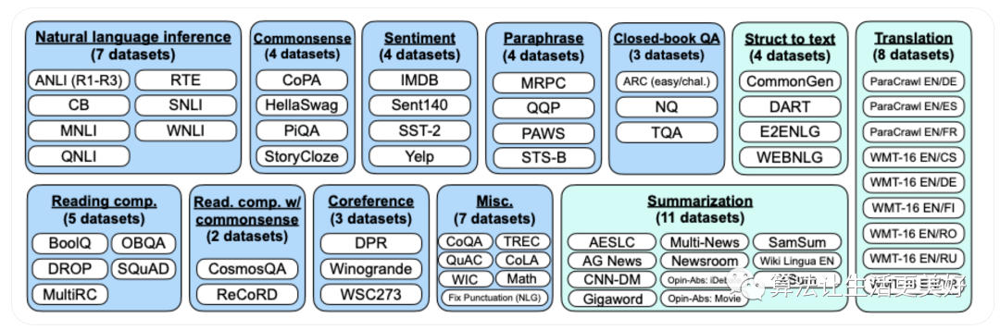

另外评估中还有一个术语n-shot学习，比如常见的就是Zero-shot、One-shot、Few-shot。

除了一些benchmark，NLP专业人员和领域专家都可以进行更专业的评估。

*   BIAS AND TOXICITY

由于训练大模型的语料很多都是基于网络文本的，但是网络文本是存在潜在风险：人类具有偏见，这些偏见会渗入数据中，而从这些数据中学习的模型可能会继承这些偏见。

所以作者也列举了一些针对这方面测评的benchmark，比如Social bias、Dialog safety等等。

那么怎么消除这些偏见呢？这里列举了一些方法：

（1）Training set filtering: 就是在训练集过滤出偏见数据。

（2）Training set modification: 该方法不是过滤训练数据，而是修改部分偏见数据以减少偏见。比如更改某些带有性别倾向的词语。

当然上面都是在训练之前的一些方法，一旦训练好后，也可以通过以下方法补救

（3）Prompt engineering: 为了避免偏见，可以做一些Prompt engineering。

（4）Fine-tuning: 继续预训练，针对性的训练消除偏见。

（5）Output steering: 在inference过程中添加一个过滤步骤，重新加权输出值，并将输出引导远离带有偏见的回答。

*   INSTRUCTION TUNING

在最后作者也稍微提了一下指令微调即SFT，虽然经过上面训练后，如果训练的很好的话已经得到一个不错的预训练模型了，但是零样本学习在阅读理解、问答和自然语言推理等许多任务中通常比少样本学习差得多。一个潜在的原因是，**在没有少样本示例的情况下，模型很难在与预训练数据格式不相似的提示上表现良好**。

所以进行指令微调是必要的，这一技术在2022年得到的极大的成功，指令微调在自然语言的任务上（例如，自然语言推理、问答、翻译）普遍有效，但对于推理等任务来说稍微复杂一些。为了改进这些任务，可以在调整过程中包含一些思维链，示例：

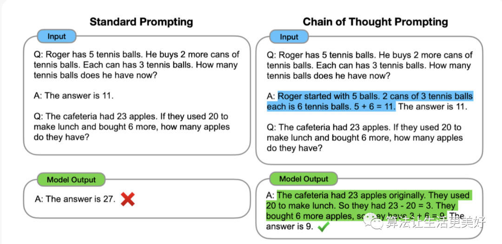

*   REINFORCEMENT LEARNING THROUGH HUMAN FEEDBACK (RLHF)

作者也提到了gpt三件套的最后一个：RLHF。

RLHF是指令调整的扩展，它在指令调整步骤之后添加了更多的步骤，以进一步融入人类反馈。

预训练经常编造事实、生成带有偏见或有害的回答，或者简单地不遵循用户的指令。这是因为许多其预训练目标即预测下一个token—与“安全地遵循用户的指令”这一目标相当不同。

这一技术大火是因为OpenAI在InstructGPT和chatgpt方面取得了一些成功。

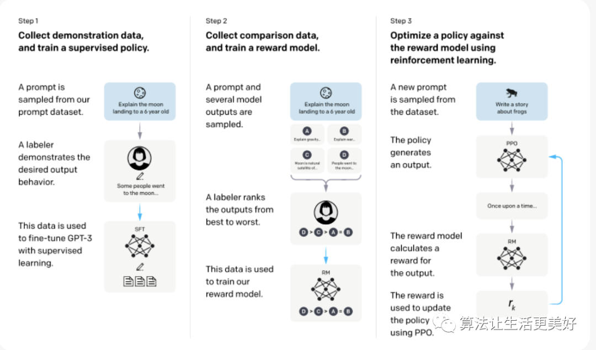

但是有些任务在使用了RLHF后性能可能会下降，这一现象被称为对齐税，现在也有一些公司专门提供了RLHF作为一项服务，感兴趣可以使用。

Conclusion
----------

训练一个大模型是不容易的，需不断的观察，反复修正实践，这一过程离不开对日志的频繁的分析和观察，其中Weight & Biases工具就起到了非常重要的作用。大家也可以试试，他可以实时同步，还是方便的。

总结
--

本篇给出了一些宝贵的经验，同时我们也看到如果从头开始训练一个大模型确实是一个浩大的工程，会遇到许多问题，是一个不断摸索和实验的过程，同时本篇也提出了另外一个很有趣的话题就是模型参数量和数据量的关系，到底是需要更大的模型更小的数据量，还是说模型还没有训练充分，其实需要增加数据量，作者也在附录提了一些OpenAI给的一些建议，不过总的来说，具体定量的分析现在还没有结论，但一个基本的大模型和海量数据是肯定的需要的了。