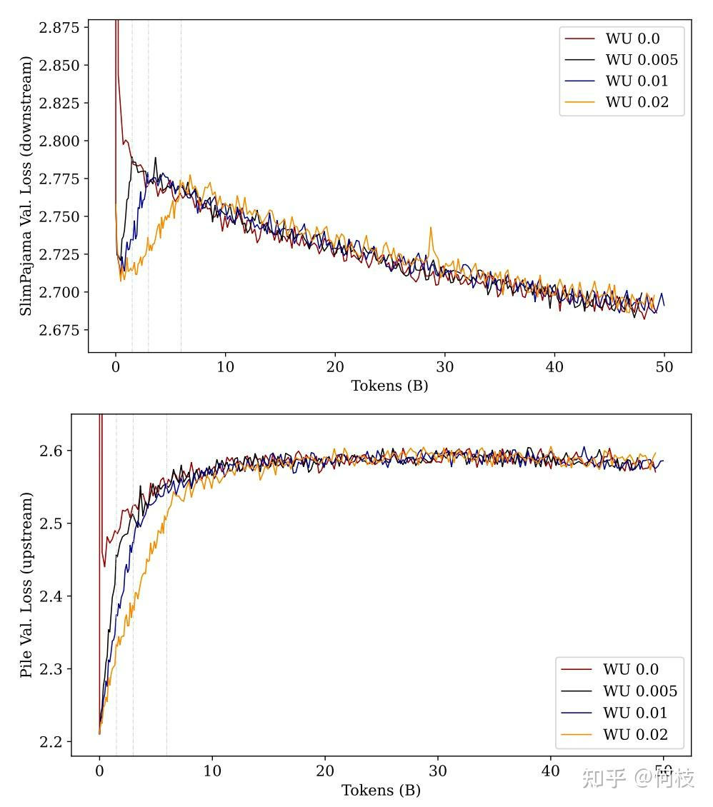
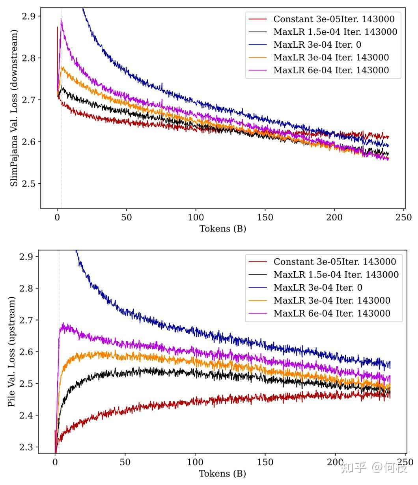
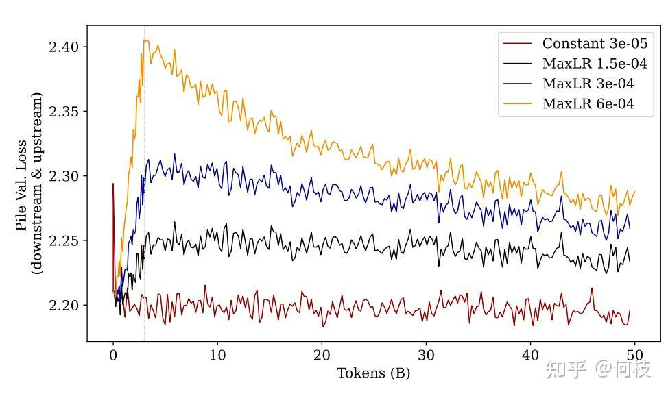

# 如何更好地继续预训练（Continue&PreTraining）
> _**作者: 何枝**_
> 
> **原文:** [_**https://zhuanlan.zhihu.com/p/654463331**_](https://zhuanlan.zhihu.com/p/654463331)

预训练（Pretraining）是一个非常消耗资源的工作，尤其在 LLM 时代。随着 \[[LLama2](https://link.zhihu.com/?target=https%3A//huggingface.co/meta-llama/Llama-2-7b)\] 的开源，越来越多人都开始尝试在这个强大的英文基座模型上进行中文增强。但，我们如何才能保证模型在既学到「中文知识」的情况下，又不丢掉原有的「英文知识」呢？

今天我们一起来看一篇分析 Continue Pretraining 的论文，

论文名称：

[https://arxiv.org/pdf/2308.04014](https://arxiv.org/pdf/2308.04014)

1\. 实验设定
--------

作者使用一个 410M 大小的模型 \[[Pythia](https://link.zhihu.com/?target=https%3A//huggingface.co/EleutherAI/pythia-410m-v0)\]，已经在 \[[Pile](https://link.zhihu.com/?target=https%3A//huggingface.co/datasets/EleutherAI/pile)\] 数据上进行过预训练，

然后在下游数据集 \[[SlimPajama](https://link.zhihu.com/?target=https%3A//www.cerebras.net/blog/slimpajama-a-627b-token-cleaned-and-deduplicated-version-of-redpajama)\] 上进行微调。

论文中直接使用 Loss 作为评估指标，即 Loss 越小，说明在上游（或下游）任务中的效果越强。

2\. 关键结论
--------

### 2.1 [warmup](https://zhida.zhihu.com/search?content_id=233564874&content_type=Article&match_order=1&q=warmup&zhida_source=entity) 的步数不会影响最终性能

warmup 是一种 finetune 中常用的策略，指学习率从一个很小的值慢慢上升到最大值。

那么，这个「慢慢上升」的阶段持续多久是最好的呢？

作者分别使用[训练步数](https://zhida.zhihu.com/search?content_id=233564874&content_type=Article&match_order=1&q=%E8%AE%AD%E7%BB%83%E6%AD%A5%E6%95%B0&zhida_source=entity)的：0%, 0.5%, 1%, 2% 这 4 种不同[预热步数](https://zhida.zhihu.com/search?content_id=233564874&content_type=Article&match_order=1&q=%E9%A2%84%E7%83%AD%E6%AD%A5%E6%95%B0&zhida_source=entity)来进行实验：

> 不同预热百分比步数的性能图，上图为下游任务 loss，下图为上游任务 loss

从上图中可以看到：**当模型经过「充分」训练后，不管多长的预热步数最后的性能都差不多。**

但，这种前提是「充分训练」，如果只看训练前期的话，使用更长的预热步数（黄色的线），

无论是「上游任务」还是「下游任务」，模型的 Loss 都要比其他预热步数要低（下游学的快，上游忘的慢）。

### 2.2 学习率越大，下游任务越好，上游任务越差

为了探究学习率对学习效果的影响，作者使用了 4 种不同的最大学习率进行[对比实验](https://zhida.zhihu.com/search?content_id=233564874&content_type=Article&match_order=1&q=%E5%AF%B9%E6%AF%94%E5%AE%9E%E9%AA%8C&zhida_source=entity)，

此外，还比对了和[从头训练](https://zhida.zhihu.com/search?content_id=233564874&content_type=Article&match_order=1&q=%E4%BB%8E%E5%A4%B4%E8%AE%AD%E7%BB%83&zhida_source=entity)（from scratch）模型的效果：

> 不同最大学习率的性能图，上图为下游任务 loss，下图为上游任务 loss

从图中可以看到：**经过充分训练后，学习率越大（紫色），下游性能最好，上游性能最差（忘得最多）。**

同样，我们看前期训练，尽管紫色线条在最后的 loss 是最低的，但在前期 loss 会增加的非常大，随后下降。

PS：解释一下这里为什么这么关注训练前期，是因为在真实训练中，我们可能不一定会增强图中所示的 250B 这么多的 tokens，尤其是在模型参数很大的情况中。所以，当资源不允许充分训练的情况下，较小的学习率和较长的 warmup 步数可能是一个不错的选择。

此外，图中还能看出：**未经过预训练的模型（蓝色）无论是上游任务还是下游任务，都不如预训练过的模型效果。**

这鼓励我们今天在进行训练任务时，最好选择一个已经过预训练的模型上继续训练（以利用其中的[先验知识](https://zhida.zhihu.com/search?content_id=233564874&content_type=Article&match_order=1&q=%E5%85%88%E9%AA%8C%E7%9F%A5%E8%AF%86&zhida_source=entity)）。

### 2.3 在初始预训练中使用 Rewarmup 会损伤性能

尽管 warmup 策略在 Finetune 和 Continue Pretraining 中都起到了更好的效果（相较于常量学习率），

但是，这建立在「切换了训练数据集（[数据分布](https://zhida.zhihu.com/search?content_id=233564874&content_type=Article&match_order=1&q=%E6%95%B0%E6%8D%AE%E5%88%86%E5%B8%83&zhida_source=entity)）」的前提下。

作者做了一个实验，不切换数据集，而是继续在之前的「预训练数据集（The Pile）」上继续训练：

> 继续在预训练数据集上进行预训练

从图中结果可以发现：**无论使用多大学习率的 warmup 策略，效果都不如使用常量学习率。**

这进一步证明，在原数据集上使用 warmup 接着训练会造成[性能损伤](https://zhida.zhihu.com/search?content_id=233564874&content_type=Article&match_order=1&q=%E6%80%A7%E8%83%BD%E6%8D%9F%E4%BC%A4&zhida_source=entity)，学习率越大则损伤越大，

且这种损伤是**无法在后续的训练中被找回的**。

PS：这里提示我们，当预训练中遇到了训练中断需要继续训练时，我们应该在重新开始训练时将学习率恢复到中断之前的状态（无论是数值还是衰减率）。

3\. 实验限制
--------

作者在论文的最后贴出了得出上述结论的一些局限性。

### 3.1 上下游数据分布类似

因为实验中选用的上游数据集 \[[Pile](https://link.zhihu.com/?target=https%3A//huggingface.co/datasets/EleutherAI/pile)\] 和下游数据集 \[[SlimPajama](https://link.zhihu.com/?target=https%3A//www.cerebras.net/blog/slimpajama-a-627b-token-cleaned-and-deduplicated-version-of-redpajama)\] 中存在一部分的数据重叠，

所以导致上下游数据的分布是比较相似的，但在我们真实的训练任务中，上下游数据的差异可能会比这大的多。

### 3.2 模型规模较小

论文中所使用的模型规模为 410M，这和今天人们 7B 起步的 LLM 规模相差甚远。

不过该团队打算在接下来的工作中继续在 3B 和 7B 的规模下进行尝试，期待他们最后的实验结论。