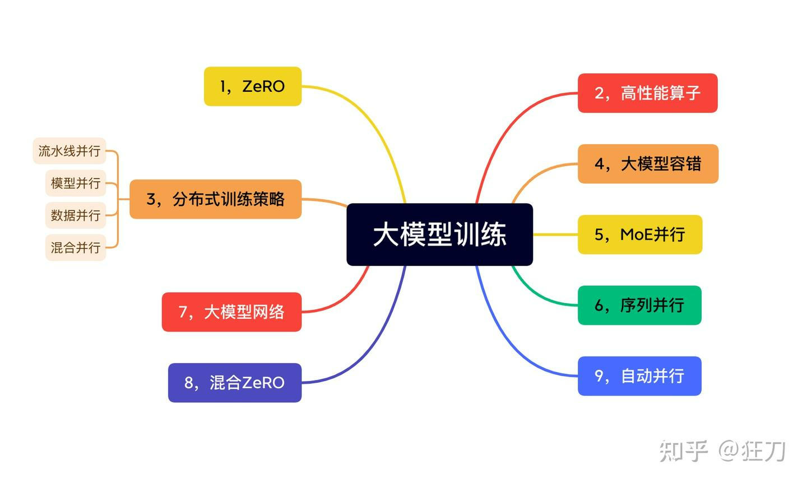

# 大模型训练工程优化技术
> **作者: 手抓饼熊**
> 
> **原文:** [**https://zhuanlan.zhihu.com/p/695863645**](https://zhuanlan.zhihu.com/p/695863645)

本文所述的大模型训练技术，特指工程方面的[优化技术](https://zhida.zhihu.com/search?content_id=242766726&content_type=Article&match_order=1&q=%E4%BC%98%E5%8C%96%E6%8A%80%E6%9C%AF&zhida_source=entity)，而非算法，算法非本人所长。

背景
--

1.  笔者去年写过一篇大模型训练的技术综述 （[狂刀：大模型训练技术综述](https://zhuanlan.zhihu.com/p/654028620)），现在回头来看，比较的粗浅，之前文章简单的列了大模型常见的一些技术，不免有些遗憾；
2.  大模型主要的训练技术如3D并行早在19年前（没有详细查证，可能不严谨）就已经有了，23年开始国内开始流行以LLM为主的大模型技术，23年到24年，大模型训练迭代非常之快，笔者认为，经过这一年的发展，大模型训练技术进一步得到了完善，且笔者认为大模型训练技术已接近收敛；
3.  大模型训练[技术栈](https://zhida.zhihu.com/search?content_id=242766726&content_type=Article&match_order=1&q=%E6%8A%80%E6%9C%AF%E6%A0%88&zhida_source=entity)十分的复杂，不同的企业，不同的部门，不同的业务需求，对训练所需要的技术是不一样的，如何根据业务特点，选择合适的大模型训练技术，是非常有性价比的；由于笔者在不同类型的企业、业务线都做过，且热衷于阅读一些论文，故希望将这些经验沉淀下来，以便有需要的人可以了解，同时自己成体系的总结；

目标
--

基于上述3个背景，笔者决定写一系列博客，主要希望满足如下几点：

1.  成体系的去介绍大模型训练相关的技术，这部分内容主要是详细的去分析主流论文、业界方案的特点，对于每个技术点，可能涉及几十篇文章，优点是比较的全面，缺点是，不一定好理解，可能需要感兴趣的同学自己去阅读对应文章；如笔者的[大模型训练（弹性容错）](https://www.zhihu.com/column/c_1769393963856023553) 专栏，目前翻译了业界主流的大模型容错方案，后续也会了解工业界方案，最终会整体做一个总结，内容量非常的多，但是论文翻译由于采用了ChatGPT，故阅读感受肯定不是很友善，有兴趣的建议直接去阅读原版引文，笔者只是论文的搬运工；
2.  成体系的介绍完大模型训练技术，笔者会整体介绍一些实战案例，笔者一致认为，好的方案是当前业务需求和已有基础设施的完美结合，比如如果全量微调一个7B模型，有搭载IB网络的H100和搭载100G网络的普通网卡的V100集群，我们会选择哪一个，框架上我们是使用Deepspeed还是Megatron，笔者会解答这些问题，并给出合理理由。

整体思路
----

大模型训练的整体技术栈如下图：

最底层是基础设施层，一般是云厂商或者智算中心提供，当然大模型业务也会根据自身需要，在这几个层面做一些事情。该层主要包括如下：

1.  [异构算力](https://zhida.zhihu.com/search?content_id=242766726&content_type=Article&match_order=1&q=%E5%BC%82%E6%9E%84%E7%AE%97%E5%8A%9B&zhida_source=entity)：具体包括A800、H800、华为910B等，一般大模型训练企业购买的就是该算力集群；
2.  网络：这部分是所有云厂商的差异化部分，一般机器内是由PCIE或者NVLINK，机器间采用RDMA（云厂商一般使用RoCE2或者IB），在网络之上就是根据[网络拓扑](https://zhida.zhihu.com/search?content_id=242766726&content_type=Article&match_order=1&q=%E7%BD%91%E7%BB%9C%E6%8B%93%E6%89%91&zhida_source=entity)特点，每个厂商会提供一个类似nccl的xccl，比如阿里有accl、腾讯有tccl、百度有bccl、华为有hccl等；
3.  调度：这部分一般使用K8S，然而K8S在大模型调度方面有一些限制（主要是构建在线应用调度的），故基于K8S，一般厂商会基于K8S构建适合自己的调度器，这部分非常重要，因为最上层的大模型弹性容错方案和这一块联系紧密；
4.  文件系统：这部分笔者使用过少，暂时不讨论；
5.  监控：这部分极其重要，我们知道大模型训练过程中，故障在所难免，大模型容错的基础是监控，如果监控做的不好，难以察觉问题，无从谈容错；

[分布式训练](https://zhida.zhihu.com/search?content_id=242766726&content_type=Article&match_order=1&q=%E5%88%86%E5%B8%83%E5%BC%8F%E8%AE%AD%E7%BB%83&zhida_source=entity)并行层
----------------------------------------------------------------------------------------------------------------------------------------------------------------------

1.  数据并行：这是非常常见的策略，笔者已经开了一个专栏去分享这部分内容，然而笔者分析的这部分内容核心不在于数据并行，笔者认为数据并行、ZeRO1、ZeRO2、ZeRO3等内容全网已经非常完善了，笔者主要分享的是混合ZeRO系列，如ZeRO++、MiCS等技术，详见

[大模型训练（数据并行/ZeRO）www.zhihu.com/column/c\_1769743469382139904](https://www.zhihu.com/column/c_1769743469382139904)

*   \_**流水线并行：**\_近年来流水线并行的文章非常非常的多，然后使用广泛的就只有Megatron-LM的流水线并行策略，笔者会分析这些文章，并且探索是否[Megatron-LM](https://zhida.zhihu.com/search?content_id=242766726&content_type=Article&match_order=2&q=Megatron-LM&zhida_source=entity)的流水线并行策略是最优的，还是有一些其他原因，导致工业界主要使用Megatron-LM方案（不过据笔者所致，各个大厂均有一些自己的流水线并行实现以解决bubble和显存不均衡问题）；
*   \_**Tensor并行：**\_该部分其实比较简单又比较难，简单在于Tensor并行本身比较简单，易于理解，难在于用Tensor并行时，如果采用计算和通信重叠，开发工作较难，不少论文对Tensor并行做了一些创新性研究，笔者后续会开辟专栏去分析；
*   \_**序列并行：**\_笔者已经开设专栏，分享主流的序列并行方案 [大模型训练（序列并行）](https://www.zhihu.com/column/c_1758860420298076160)，后续会在这个专栏再做一些更新，从背景、方案演化以及如何和其他并行方案一起使用等角度添加一些内容，详见：

[手抓饼熊：序列并行云台第29将20 赞同 · 2 评论文章](https://zhuanlan.zhihu.com/p/708670154)

[手抓饼熊：图解序列并行云台28将（上篇）130 赞同 · 33 评论文章](https://zhuanlan.zhihu.com/p/707204903)

[手抓饼熊：图解序列并行云台28将（云长单刀赴会）55 赞同 · 18 评论文章](https://zhuanlan.zhihu.com/p/707435411)

[手抓饼熊：图解序列并行云台28将（下篇）31 赞同 · 4 评论文章](https://zhuanlan.zhihu.com/p/707499928)

*   \_**MoE并行：**\_目前MoE的模型非常的广泛，然而MoE训练加速方式很早就有呈现，如google的gshard就是MoE加速的，笔者后续也会开设专栏，分享主流方案；
*   [_**混合并行**_](https://zhida.zhihu.com/search?content_id=242766726&content_type=Article&match_order=1&q=%E6%B7%B7%E5%90%88%E5%B9%B6%E8%A1%8C&zhida_source=entity)\_：\_混合并行和自动并行近年来论文也比较多，笔者也会尽量多选择一些论文进行分享。

算子[优化层](https://zhida.zhihu.com/search?content_id=242766726&content_type=Article&match_order=1&q=%E4%BC%98%E5%8C%96%E5%B1%82&zhida_source=entity)
-------------------------------------------------------------------------------------------------------------------------------------------------

2023年最主要的特点之一就是算子优化吧，FlashAttention的广泛使用（FlashAttention v1在22年就出来了），另外Nvidia开源的TransformerEngine库，也做了很多算子融合的工作，笔者亲测TransformerEngine在Llama 7B模型上性能比transformers库高很多很多。FlashAttention技术网上分析的太多太多，也特别的好，笔者不打算写，也写的不好，TransformerEngine笔者会开一个专栏分析其整体结构以及部分算子的实现。

其他优化方案
------

1.  [混合精度](https://zhida.zhihu.com/search?content_id=242766726&content_type=Article&match_order=1&q=%E6%B7%B7%E5%90%88%E7%B2%BE%E5%BA%A6&zhida_source=entity)：这部分笔者不会过多的分享，会结合[apex](https://zhida.zhihu.com/search?content_id=242766726&content_type=Article&match_order=1&q=apex&zhida_source=entity)，从工程角度看看源码；
2.  [梯度累积](https://zhida.zhihu.com/search?content_id=242766726&content_type=Article&match_order=1&q=%E6%A2%AF%E5%BA%A6%E7%B4%AF%E7%A7%AF&zhida_source=entity)：这部分笔者一直想深入去分析的一个点就是ZeRO2和ZeRO3和梯度累积一起使用时的限制和解决办法；
3.  重计算：这部分会结合Megatron-LM的流水线并行，一起去分析重计算使用方式；
4.  FP8训练：个人觉得FP8训练就像当年的BF16一样，未来一定会成为趋势；故笔者会分析一些问了，但是核心还是以Nvidia技术栈来从工程角度分析FP8的技术点；

分布式加速方案
-------

这部分主要分享预训练和微调如何选择分布式训练的方案，会结合特点，选择不同系列的卡型进行分析；

大模型容错
-----

笔者在2024年五一节假日期间读了一些大模型容错的论文，也开启专栏 [大模型训练（弹性容错）](https://www.zhihu.com/column/c_1769393963856023553)。目前还不成体系，后续会整体总结，总结其方案演进、整体技术等。

从从业者角度看这些技术
-----------

笔者重新以[思维图](https://zhida.zhihu.com/search?content_id=242766726&content_type=Article&match_order=1&q=%E6%80%9D%E7%BB%B4%E5%9B%BE&zhida_source=entity)的方式将这些技术整理，对这幅图的说明如下：

1.  大模型简单微调人员：如果仅仅需要微调一个模型，可以仅仅学习ZeRO、了解部分[高性能算子](https://zhida.zhihu.com/search?content_id=242766726&content_type=Article&match_order=1&q=%E9%AB%98%E6%80%A7%E8%83%BD%E7%AE%97%E5%AD%90&zhida_source=entity)（FlashAttention）即可；
2.  大模型预训练人员：这部分人员，除了对1和2技术点深入研究之外，还需要熟悉3-6，这部分人员一般会训练千卡千亿模型（字节的万卡模型），一般会需要熟悉分布式训练策略（3D并行）、大模型容错、序列并行、MoE并行，单独把序列并行和MoE并行拿出来是因为这两个技术不一定所有的预训练厂商都是用，但是3D并行和容错是预训练必须面对的；
3.  大模型研究人员：这部分人员出来对1-6深入研究外，可能还会研究混合ZeRO和自定并行；
4.  云厂商或者芯片厂商：这部分人员会额外多研究一些大模型网络的技术（xccl）；