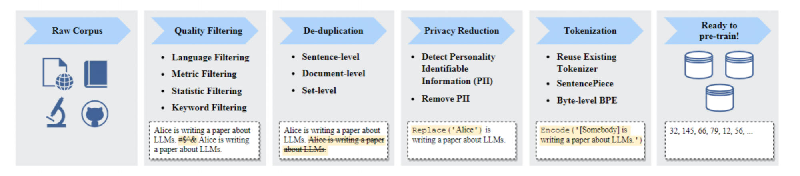

# Prompt工程
### 预训练语料处理技术

*   数据收集
*   数据处理
    *   去重
    *   过滤
    *   选择
    *   组合
*   Zero-Shot Prompting
*   Few-Shot Prompting
*   Chain-of-Thought (CoT) Prompting
*   Automatic Chain-of-Thought (Auto-CoT) Prompting
*   Tree-of-Thoughts (ToT) Prompting
*   [Prompt Engineering Guide](https://www.promptingguide.ai/zh)\]([https://www.promptingguide.ai/zh/techniques/fewshot](https://www.promptingguide.ai/zh/techniques/fewshot))