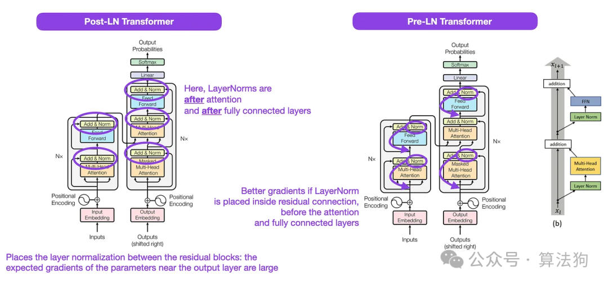
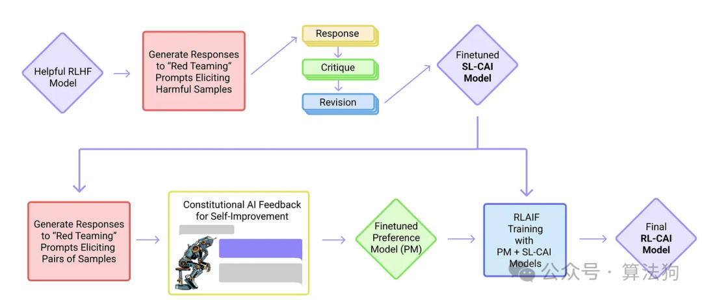

# Transformer的发家史-论文整理
> (1) Neural Machine Translation by Jointly Learning to Align and Translate (2014) by Bahdanau, Cho, and Bengio, [https://arxiv.org/abs/1409.0473](https://arxiv.org/abs/1409.0473)

> (2) Attention Is All You Need (2017) by Vaswani, Shazeer, Parmar, Uszkoreit, Jones, Gomez, Kaiser, and Polosukhin, [https://arxiv.org/abs/1706.03762](https://arxiv.org/abs/1706.03762)

> (3) On Layer Normalization in the Transformer Architecture (2020) by Xiong, Yang, He, K Zheng, S Zheng, Xing, Zhang, Lan, Wang, and Liu, [https://arxiv.org/abs/2002.04745](https://arxiv.org/abs/2002.04745)

> (4) Learning to Control Fast-Weight Memories: An Alternative to Dynamic Recurrent Neural Networks (1991) by Schmidhuber, [https://www.semanticscholar.org/paper/Learning-to-Control-Fast-Weight-Memories%3A-An-to-Schmidhuber/bc22e87a26d020215afe91c751e5bdaddd8e4922](https://www.semanticscholar.org/paper/Learning-to-Control-Fast-Weight-Memories%3A-An-to-Schmidhuber/bc22e87a26d020215afe91c751e5bdaddd8e4922)

> (5) Universal Language Model Fine-tuning for Text Classification (2018) by Howard and Ruder, [https://arxiv.org/abs/1801.06146](https://arxiv.org/abs/1801.06146)

> (6) BERT: Pre-training of Deep Bidirectional Transformers for Language Understanding (2018) by Devlin, Chang, Lee, and Toutanova, [https://arxiv.org/abs/1810.04805](https://arxiv.org/abs/1810.04805)

> (7) Improving Language Understanding by Generative Pre-Training (2018) by Radford and Narasimhan, [https://www.semanticscholar.org/paper/Improving-Language-Understanding-by-Generative-Radford-Narasimhan/cd18800a0fe0b668a1cc19f2ec95b5003d0a5035](https://www.semanticscholar.org/paper/Improving-Language-Understanding-by-Generative-Radford-Narasimhan/cd18800a0fe0b668a1cc19f2ec95b5003d0a5035)

> (8) BART: Denoising Sequence-to-Sequence Pre-training for Natural Language Generation, Translation, and Comprehension (2019) by Lewis, Liu, Goyal, Ghazvininejad, Mohamed, Levy, Stoyanov, and Zettlemoyer, [https://arxiv.org/abs/1910.13461](https://arxiv.org/abs/1910.13461).

> (9) Harnessing the Power of LLMs in Practice: A Survey on ChatGPT and Beyond (2023) by Yang, Jin, Tang, Han, Feng, Jiang, Yin, and Hu, [https://arxiv.org/abs/2304.13712](https://arxiv.org/abs/2304.13712)

> (10) FlashAttention: Fast and Memory-Efficient Exact Attention with IO-Awareness (2022), by Dao, Fu, Ermon, Rudra, and Ré, [https://arxiv.org/abs/2205.14135](https://arxiv.org/abs/2205.14135).

> (11) Cramming: Training a Language Model on a Single GPU in One Day (2022) by Geiping and Goldstein, [https://arxiv.org/abs/2212.14034](https://arxiv.org/abs/2212.14034).

> (12) loRA: Low-Rank Adaptation of Large Language Models (2021) by Hu, Shen, Wallis, Allen-Zhu, Li, L Wang, S Wang, and Chen, [https://arxiv.org/abs/2106.09685](https://arxiv.org/abs/2106.09685).

> (13) Scaling Down to Scale Up: A Guide to Parameter-Efficient Fine-Tuning (2022) by Lialin, Deshpande, and Rumshisky, [https://arxiv.org/abs/2303.15647](https://arxiv.org/abs/2303.15647).

> (14) Scaling Language Models: Methods, Analysis & Insights from Training Gopher (2022) by Rae and colleagues (78 co-authors!), [https://arxiv.org/abs/2112.11446](https://arxiv.org/abs/2112.11446)

> (15) Training Compute-Optimal Large Language Models (2022) by Hoffmann, Borgeaud, Mensch, Buchatskaya, Cai, Rutherford, de Las Casas, Hendricks, Welbl, Clark, Hennigan, Noland, Millican, van den Driessche, Damoc, Guy, Osindero, Simonyan, Elsen, Rae, Vinyals, and Sifre, [https://arxiv.org/abs/2203.15556](https://arxiv.org/abs/2203.15556).

> (16) Pythia: A Suite for Analyzing Large Language Models Across Training and Scaling (2023) by Biderman, Schoelkopf, Anthony, Bradley, O'Brien, Hallahan, Khan, Purohit, Prashanth, Raff, Skowron, Sutawika, and van der Wal, [https://arxiv.org/abs/2304.01373](https://arxiv.org/abs/2304.01373)

> (17) Training Language Models to Follow Instructions with Human Feedback (2022) by Ouyang, Wu, Jiang, Almeida, Wainwright, Mishkin, Zhang, Agarwal, Slama, Ray, Schulman, Hilton, Kelton, Miller, Simens, Askell, Welinder, Christiano, Leike, and Lowe, [https://arxiv.org/abs/2203.02155](https://arxiv.org/abs/2203.02155).

> (18) Constitutional AI: Harmlessness from AI Feedback (2022) by Yuntao, Saurav, Sandipan, Amanda, Jackson, Jones, Chen, Anna, Mirhoseini, McKinnon, Chen, Olsson, Olah, Hernandez, Drain, Ganguli, Li, Tran-Johnson, Perez, Kerr, Mueller, Ladish, Landau, Ndousse, Lukosuite, Lovitt, Sellitto, Elhage, Schiefer, Mercado, DasSarma, Lasenby, Larson, Ringer, Johnston, Kravec, El Showk, Fort, Lanham, Telleen-Lawton, Conerly, Henighan, Hume, Bowman, Hatfield-Dodds, Mann, Amodei, Joseph, McCandlish, Brown, Kaplan, [https://arxiv.org/abs/2212.08073](https://arxiv.org/abs/2212.08073).

> (19) Self-Instruct: Aligning Language Model with Self Generated Instruction (2022) by Wang, Kordi, Mishra, Liu, Smith, Khashabi, and Hajishirzi, [https://arxiv.org/abs/2212.10560](https://arxiv.org/abs/2212.10560)

