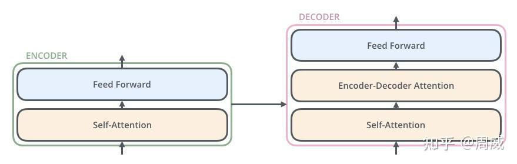
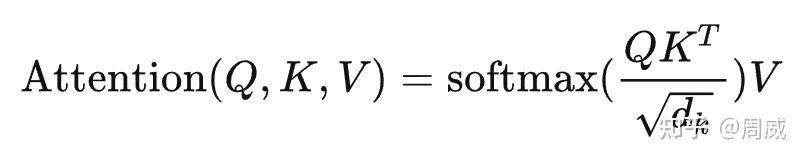
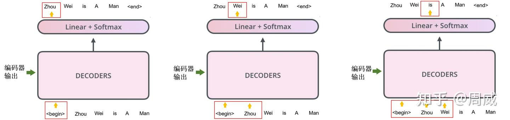

# Transformer系列Transformer模型与代码详解
> _**作者: 周威**_
> 
> **原文:** [_**https://zhuanlan.zhihu.com/p/616732254**_](https://zhuanlan.zhihu.com/p/616732254)

**1 前言**
--------

笔者在深度学习入门期间自学过Transformer,但是那时碍于急于求成,并未对其进行深度归纳与分享.

近期,笔者观察到不论是**自然语言处理\*\*\*\*模型**还是**视觉模型**,已经几乎从传统的CNN、RNN的网络结构设计**全面转向**基于Transformer的结构设计了.

如下图1所示,在ImageNet数据集上,基于Transformer的网络的精度几乎已经全面领先基于纯CNN设计的网络了.


图1

另外,最近大火的chatGPT,其核心也是基于Transformer构建的.这不禁重新燃起了我来做一期对于基础Transformer解析类文章的兴趣,便于**新手入门**和**老手复习**.

关于对Transformer的解析,网上已经有很多不错的相关教程了,这里推荐几个笔者认为写的不错的.

1.  知乎文章《[**详解Transformer (Attention Is All You Need)**](https://zhuanlan.zhihu.com/p/48508221)》,点赞7000+
2.  知乎文章《[**Transformer模型详解(图解最完整版)**](https://zhuanlan.zhihu.com/p/338817680)》,点赞4000+
3.  非常有名的英文教程《[**The Illustrated Transformer**](https://link.zhihu.com/?target=http%3A//jalammar.github.io/illustrated-transformer/)》,知乎文章(1)就是借鉴该教程的
4.  B站[李宏毅](https://zhida.zhihu.com/search?content_id=225182840&content_type=Article&match_order=1&q=%E6%9D%8E%E5%AE%8F%E6%AF%85&zhida_source=entity)视频《[**第5讲-Transformer-1\_哔哩哔哩\_bilibili**](https://link.zhihu.com/?target=https%3A//www.bilibili.com/video/BV1m3411p7wD%3Fp%3D32%26vd_source%3Dbeab624366b929b20152279cfa775ff6)》
5.  B站李沐视频 《精读论文\*\*<[**Attention Is All You Need**](https://arxiv.org/abs/1706.03762)**\*\*>**》
6.  本文

与现有文章不同的是,本文我们打算**结合相关的代码**,从**理论结合实践的角度**加深读者对Transformer的理解.本文采用的代码是:

[GitHub - hyunwoongko/transformer: Transformer: PyTorch Implementation of “Attention Is All You Need”](https://github.com/hyunwoongko/transformer)

**2 提出动机**
----------

Transformer提出的具体动机在现有文章中已经被阐明的很清楚了,总结而言就是:

(1)[递归神经网络](https://zhida.zhihu.com/search?content_id=225182840&content_type=Article&match_order=1&q=%E9%80%92%E5%BD%92%E7%A5%9E%E7%BB%8F%E7%BD%91%E7%BB%9C&zhida_source=entity)(RNN)或卷积神经网络(CNN)来处理序列数据时,在**长序列**上的表现不佳,因为它们**难以捕捉长期依赖关系**；

(2)递归神经网络(RNN),包括LSTM/GRU及其变体,只能从左向右依次计算或者从右向左依次计算,也就是当前时刻的计算依赖上一步计算的输入,**严重限制了模型的并行能力**；

所以,Transformer另辟蹊径,仅用**自注意力**(self-Attenion)和**前馈网络/**[**全连接层**](https://zhida.zhihu.com/search?content_id=225182840&content_type=Article&match_order=1&q=%E5%85%A8%E8%BF%9E%E6%8E%A5%E5%B1%82&zhida_source=entity)(Feed Forward Neural Network)就作为其主体框架,便获得对输入数据(文本、图像)较好的**并行处理能力**.另外,自注意力的使用使得模型对**较长序列输入**的处理能力也大大提升.

**3 方法与代码详解**
-------------

### 3.1 整体模型预览

本文我们以**自顶而下**的步骤来逐步解析Transformer中各个模块.为了更好地说明,这里我们借鉴了《[**The Illustrated Transformer**](https://link.zhihu.com/?target=http%3A//jalammar.github.io/illustrated-transformer/)》的[原理图](https://zhida.zhihu.com/search?content_id=225182840&content_type=Article&match_order=1&q=%E5%8E%9F%E7%90%86%E5%9B%BE&zhida_source=entity),没办法,这位老哥写的太好了,这里强烈建议大家去看一下原版.

假设我们要做一个语言翻译任务,如下图2所示,那么需要构建一个**翻译模型**,这里不妨这个模型就是基于Transformer构建的.该模型输入一段原始语言(看图片中可能是法文),输出英文翻译.


图2

具体地,该基于Transformer构建的翻译模型由两部分构成,分别是**编码器(encoder)和解码器(decoder)**,如下图3所示.


图3

编码器的输出作为解码器的输入.这里的编码器是将输入映射为[**特征表征**](https://zhida.zhihu.com/search?content_id=225182840&content_type=Article&match_order=1&q=%E7%89%B9%E5%BE%81%E8%A1%A8%E5%BE%81&zhida_source=entity)(可视为**待翻译句子的含义**),而解码器根据特征表征实现\*\*“含义—>目标语言”\*\*的转换.具体代码实现如下:

```text-plain
class Transformer(nn.Module):
    def __init__(self, src_pad_idx, trg_pad_idx, trg_sos_idx, enc_voc_size, dec_voc_size, d_model, n_head, max_len, ffn_hidden, n_layers, drop_prob, device):
        super().__init__()
        # 初始化源语言和目标语言的填充(padding)索引、目标语言的开始符号索引
        self.src_pad_idx = src_pad_idx  # 源语言填充索引
        self.trg_pad_idx = trg_pad_idx  # 目标语言填充索引
        self.trg_sos_idx = trg_sos_idx  # 目标语言开始符号索引
        self.device = device  # 设备(CPU或GPU)
        
        # 初始化编码器
        self.encoder = Encoder(
            d_model=d_model,  # 模型维度
            n_head=n_head,  # 多头注意力中的头数
            max_len=max_len,  # 序列的最大长度
            ffn_hidden=ffn_hidden,  # 前馈网络的隐藏层维度
            enc_voc_size=enc_voc_size,  # 编码器词汇表大小
            drop_prob=drop_prob,  # dropout概率
            n_layers=n_layers,  # 编码器层数
            device=device  # 设备(CPU或GPU)
        )
        
        # 初始化解码器
        self.decoder = Decoder(
            d_model=d_model,  # 模型维度
            n_head=n_head,  # 多头注意力中的头数
            max_len=max_len,  # 序列的最大长度
            ffn_hidden=ffn_hidden,  # 前馈网络的隐藏层维度
            dec_voc_size=dec_voc_size,  # 解码器词汇表大小
            drop_prob=drop_prob,  # dropout概率
            n_layers=n_layers,  # 解码器层数
            device=device  # 设备(CPU或GPU)
        )

    def forward(self, src, trg):
        # 创建源语言和目标语言的掩码
        src_mask = self.make_pad_mask(src, src, self.src_pad_idx, self.src_pad_idx)
        src_trg_mask = self.make_pad_mask(trg, src, self.trg_pad_idx, self.src_pad_idx)
        trg_mask = self.make_pad_mask(trg, trg, self.trg_pad_idx, self.trg_pad_idx) * \
                   self.make_no_peak_mask(trg, trg)
        
        # 编码器处理源语言输入
        enc_src = self.encoder(src, src_mask)
        # 解码器处理目标语言输入和编码器的输出
        output = self.decoder(trg, enc_src, trg_mask, src_trg_mask)
        return output
```

从代码的[forward函数](https://zhida.zhihu.com/search?content_id=225182840&content_type=Article&match_order=1&q=forward%E5%87%BD%E6%95%B0&zhida_source=entity)可以看出,作者先对模型的输入(src,trg)进行了**预处理**,获取到一些诸如**掩码**等信息.接着,将这些先喂给**编码器**(self.encoder)来获取**特征表征**(enc\_src),该**特征表征**和一些**掩码**被馈入**解码器**(self.decoder)中,输出张量翻译信息(output).


图4

如上图4所示,这个**编码器**和**解码器**的结构可以总结如下:

### **(1)编码器**

编码器由**一个嵌入层+六个编码层**构成,每个**编码层**由一个**自注意力**(self-Attenion)和一层**前馈网络**(Feed Forward Neural Network)组成,如下图5所示.需要注意的是,**自注意力**和**前馈网络**中均包含残差连接(目的是为了防止梯度消失,提高训练稳定性)；


图5

编码器的代码实现如下所示:

```text-plain
class Encoder(nn.Module):
    # 编码器的初始化函数
    def __init__(self, enc_voc_size, max_len, d_model, ffn_hidden, n_head, n_layers, drop_prob, device):
        super().__init__()
        # Transformer的嵌入层,用于将输入的词索引转换为固定维度的向量.
        # 这里还包括位置编码和dropout操作.
        self.emb = TransformerEmbedding(d_model=d_model,
                                        max_len=max_len,
                                        vocab_size=enc_voc_size,
                                        drop_prob=drop_prob,
                                        device=device)
        
        # 编码器由多个编码器层叠加而成,这里使用ModuleList来存储这些层.
        # 每个编码器层都包含自注意力机制和前馈神经网络.
        self.layers = nn.ModuleList([EncoderLayer(d_model=d_model,
                                                  ffn_hidden=ffn_hidden,
                                                  n_head=n_head,
                                                  drop_prob=drop_prob)
                                     for _ in range(n_layers)])

    # 编码器的前向传播函数
    def forward(self, x, s_mask):
        # 首先,输入x通过嵌入层,得到带有位置信息的词向量.
        x = self.emb(x)
        
        # 然后,这些词向量被依次传递到每一个编码器层.
        # 每个层都会使用自注意力机制来处理输入,然后通过前馈神经网络.
        # s_mask是用于自注意力机制中,防止模型“看到”未来信息的掩码.
        for layer in self.layers:
            x = layer(x, s_mask)
        
        # 最后,返回编码器的输出.
        return x
```

上述代码中的self.emb就是**嵌入层**,n\_layers被设定为6,表示该编码器由6层[**解码层**](https://zhida.zhihu.com/search?content_id=225182840&content_type=Article&match_order=1&q=%E8%A7%A3%E7%A0%81%E5%B1%82&zhida_source=entity)(EncoderLayer)构成.我们再进入EncoderLayer的定义,可见:

```text-plain
class EncoderLayer(nn.Module):
    def __init__(self, d_model, ffn_hidden, n_head, drop_prob):
        super(EncoderLayer, self).__init__()
        # 多头自注意力机制
        self.attention = MultiHeadAttention(d_model=d_model, n_head=n_head)
        # 第一个子层的层归一化
        self.norm1 = LayerNorm(d_model=d_model)
        # 第一个子层的dropout
        self.dropout1 = nn.Dropout(p=drop_prob)

        # 位置前馈网络
        self.ffn = PositionwiseFeedForward(d_model=d_model, hidden=ffn_hidden, drop_prob=drop_prob)
        # 第二个子层的层归一化
        self.norm2 = LayerNorm(d_model=d_model)
        # 第二个子层的dropout
        self.dropout2 = nn.Dropout(p=drop_prob)

    def forward(self, x, s_mask):
        # 1. 计算自注意力
        # 保存输入x的副本,用于后续的残差连接
        _x = x
        # 通过多头自注意力层处理x
        x = self.attention(q=x, k=x, v=x, mask=s_mask)
        
        # 2. 添加残差连接后进行层归一化
        # 首先对自注意力的输出应用dropout
        x = self.dropout1(x)
        # 然后将dropout的输出与原始输入_x相加,实现残差连接,最后应用层归一化
        x = self.norm1(x + _x)
        
        # 3. 位置前馈网络
        # 保存当前x的副本,用于后续的残差连接
        _x = x
        # 将x通过位置前馈网络
        x = self.ffn(x)
      
        # 4. 添加残差连接后进行层归一化
        # 首先对位置前馈网络的输出应用dropout
        x = self.dropout2(x)
        # 然后将dropout的输出与位置前馈网络之前的输入_x相加,实现残差连接,最后应用层归一化
        x = self.norm2(x + _x)
        return x
```

通过查看上述代码的forward函数,可见在每个编码层中执行了如下操作:

*   (1)自注意力操作( self.attention)
*   (2)相加和归一化(也就是残差连接)
*   (3)前馈网络运算(self.ffn,本质就是全连接层)
*   (4)相加和归一化(残差连接)

### **(2)解码器**

解码器由**一个嵌入层+六个解码层+一个输出层**构成,每个解码层由一个**自注意力**(self-Attenion),一个**编码-解码注意力**(Encoder- decoder Attention)和一层**前馈网络**(Feed Forward Neural Network)组成,如下图6所示；



图6

解码器的代码实现如下所示:

```text-plain
class Decoder(nn.Module):
    def __init__(self, dec_voc_size, max_len, d_model, ffn_hidden, n_head, n_layers, drop_prob, device):
        super().__init__()
        # Transformer解码器的嵌入层,将目标序列的词索引转换为词向量.
        # 同时,它也会加入位置信息,并应用dropout.
        self.emb = TransformerEmbedding(d_model=d_model,
                                        drop_prob=drop_prob,
                                        max_len=max_len,
                                        vocab_size=dec_voc_size,
                                        device=device)
        
        # 解码器由多个解码器层组成,这里使用ModuleList创建了n_layers个DecoderLayer.
        # 每个解码器层都包括自注意力、编码器-解码器注意力和前馈网络.
        self.layers = nn.ModuleList([DecoderLayer(d_model=d_model,
                                                  ffn_hidden=ffn_hidden,
                                                  n_head=n_head,
                                                  drop_prob=drop_prob)
                                     for _ in range(n_layers)])
        
        # 线性层,将解码器的输出转换为词汇表大小的向量,
        # 这样每个位置的向量都可以用来预测对应位置的词.
        self.linear = nn.Linear(d_model, dec_voc_size)

    def forward(self, trg, enc_src, trg_mask, src_mask):
        # 首先,目标序列通过嵌入层,得到带有位置信息的词向量.
        trg = self.emb(trg)
        
        # 然后,这些词向量被依次传递到每一个解码器层.
        # 每个层都会进行自注意力计算,编码器-解码器注意力计算,以及前馈网络的处理.
        # trg_mask用于防止模型在生成当前词时“看到”未来的词,实现自回归特性.
        # src_mask用于在编码器-解码器注意力中遮盖掉编码器输出中的填充位置.
        for layer in self.layers:
            trg = layer(trg, enc_src, trg_mask, src_mask)
        
        # 最后,通过一个线性层将解码器的输出转换为预测每个位置可能的词的概率分布.
        output = self.linear(trg)
        return output
```

其中,self.emb为**嵌入层**；n\_layers=6,这表明解码器由**6个解码层**(DecoderLayer)构成；最后,使用**输出层**(self.linear)将解码特征映射为字向量输出.这里,我们就**解码层**(DecoderLayer)展开,其具体实现代码如下:

```text-plain
class DecoderLayer(nn.Module):
    def __init__(self, d_model, ffn_hidden, n_head, drop_prob):
        super(DecoderLayer, self).__init__()
        # 自注意力机制,用于处理目标序列,提取序列内部的关联信息.
        self.self_attention = MultiHeadAttention(d_model=d_model, n_head=n_head)
        # 自注意力后的层归一化和dropout.
        self.norm1 = LayerNorm(d_model=d_model)
        self.dropout1 = nn.Dropout(p=drop_prob)

        # 编码器-解码器注意力机制,用于将编码器的输出和解码器的当前状态结合起来,提取目标序列和源序列之间的关联信息.
        self.enc_dec_attention = MultiHeadAttention(d_model=d_model, n_head=n_head)
        # 编码器-解码器注意力后的层归一化和dropout.
        self.norm2 = LayerNorm(d_model=d_model)
        self.dropout2 = nn.Dropout(p=drop_prob)

        # 位置前馈网络,对每个位置的表示进行进一步的处理.
        self.ffn = PositionwiseFeedForward(d_model=d_model, hidden=ffn_hidden, drop_prob=drop_prob)
        # 位置前馈网络后的层归一化和dropout.
        self.norm3 = LayerNorm(d_model=d_model)
        self.dropout3 = nn.Dropout(p=drop_prob)

    def forward(self, dec, enc, t_mask, s_mask):
        # 1. 计算自注意力
        # 保存dec的副本,用于后续的残差连接.
        _x = dec
        # 对dec进行自注意力计算.
        x = self.self_attention(q=dec, k=dec, v=dec, mask=t_mask)
        
        # 2. 添加残差连接并归一化
        x = self.dropout1(x)
        x = self.norm1(x + _x)  # 加上残差并通过层归一化.

        if enc is not None:
            # 3. 计算编码器-解码器注意力
            # 保存当前x的副本,用于后续的残差连接.
            _x = x
            # 使用编码器的输出enc作为k和v,当前解码器层的输出x作为q,计算编码器-解码器注意力.
            x = self.enc_dec_attention(q=x, k=enc, v=enc, mask=s_mask)
            
            # 4. 添加残差连接并归一化
            x = self.dropout2(x)
            x = self.norm2(x + _x)  # 加上残差并通过层归一化.

        # 5. 通过位置前馈网络
        _x = x
        x = self.ffn(x)
        
        # 6. 添加残差连接并归一化
        x = self.dropout3(x)
        x = self.norm3(x + _x)  # 加上残差并通过层归一化.
        return x
```

从上述代码可以看出,每个解码层比编码层**多了一个模块运算**,即**编码-解码注意力**及其残差连接.

再仔细一看,这个**编码-解码注意力**的k和v值为enc,其实也就是**编码器的输出**.也就是说,每层解码层的输入不光有上一解码层的输出(dec),还有编码器的最终输出(enc),和图4中展示的一致.

写到这里,Transformer的大致结构大家应该就有了初步的印象了.这里需要提一嘴的是,**编码-解码注意力**(Encoder- decoder Attention)的本质也是个**自注意力**,其唯一区别仅在**输入的来源**上.而**前馈网络**(Feed Forward Neural Network)其实就是**全连接层与**[**激活函数**](https://zhida.zhihu.com/search?content_id=225182840&content_type=Article&match_order=1&q=%E6%BF%80%E6%B4%BB%E5%87%BD%E6%95%B0&zhida_source=entity)**的组合**,并不需要进行重点解析.

那么这样一来,我们只需要理解**自注意力**的具体实现,也就掌握了Transformer的核心了.

### **3.2 自注意力**

**自注意力模块**,笔者最先接触的时候是在做**视觉任务**遇到了一个叫做**Non-local注意力模块**,其结构如下图7所示(具体见我之前写的[**知乎文章**](https://zhuanlan.zhihu.com/p/350760243)).事实上,该模块就是借鉴自注意力进行设计的.


图7

在Transformer中,每个单词向量(embeddings)被映射成三个不同的向量,分别叫做**Query向量**(Q)、**Key向量(K)和Value向量**(V),如下图8所示.具体是怎么个映射法呢,就是输入到三个**不同的全连接层**(内参分别为WQ、WK和WV)中即可.


图8

在每个单词向量都获取了其对应的三个Q、K、V向量后.对于任意单词,用它的**Query向量**(Q)去探索自身和其他单词的**Key向量(K),如下图9所示.具体探索方法就是两者进行点积**,某种意义上就是求解[**余弦相似度**](https://zhida.zhihu.com/search?content_id=225182840&content_type=Article&match_order=1&q=%E4%BD%99%E5%BC%A6%E7%9B%B8%E4%BC%BC%E5%BA%A6&zhida_source=entity),如果两者相似度较高,则**赋予较大的值**(下图中的Score)来反应两者的关系.


图9

上述计算可以大致把握两个单词之间的**相似度**(或者称为关联性,即图中的Score).之后,需要利用该相似度来衡量各单词相对于**所关注单词**(上图9中受关注的单词为thinking)的重要性,进而对各个单词所占权重进行调整.

具体地,作者先是对每个计算的相似度进行了**标准化**,然后使用**softmax函数**将标准化的相似度转换成了**注意力**,如下图10所示.


图10

接着,如图11所示,作者利用获取的注意力来**调整各单词Value向量(V)所占的权重**.最后,对加权后的各单词Value向量(V)进行**按位相加融合**,获取自注意力模块的输出(就是图10中的z1,z2).


图11

为了便于大家理解,上面的讲解是拆分进行的.在实际计算过程中,采用了**基于矩阵的计算方法**来提升运算效率,具体如下图12所示.

假设有2个单词,每个单词维度为4(当然这只是假设),那么输入X的维度就是2×4.然后通过三个不同权重的全连接层(权重维度为4×3)将输入X映射为三个维度为2×3的向量,即**Query向量**(Q)、**Key向量(K)和Value向量**(V).

那么上述关于自注意力的运算步骤可以用下面公式表示,即



更形象地,其图示为:


图12

其代码实现如下所示:

```text-plain
class MultiHeadAttention(nn.Module):
    def __init__(self, d_model, n_head):
        super(MultiHeadAttention, self).__init__()
        self.n_head = n_head  # 多头注意力中头的数量
        self.attention = ScaleDotProductAttention()  # 缩放点积注意力机制
        # 定义三个线性层,用于将输入的q、k、v分别转换为多头形式的q、k、v
        self.w_q = nn.Linear(d_model, d_model)
        self.w_k = nn.Linear(d_model, d_model)
        self.w_v = nn.Linear(d_model, d_model)
        # 定义一个线性层,用于将多个头的输出拼接后的结果转换回原始维度
        self.w_concat = nn.Linear(d_model, d_model)

    def forward(self, q, k, v, mask=None):
        # 1. 使用权重矩阵进行点积
        q, k, v = self.w_q(q), self.w_k(k), self.w_v(v)

        # 2. 按头数分割张量
        q, k, v = self.split(q), self.split(k), self.split(v)

        # 3. 执行缩放点积注意力计算相似度
        out, attention = self.attention(q, k, v, mask=mask)

        # 4. 将多头输出拼接并通过线性层
        out = self.concat(out)
        out = self.w_concat(out)

        # 5. 可视化注意力图(此处为待实现的部分)
        # TODO : 我们应该实现可视化

        return out

    def split(self, tensor):
        """
        按头数分割张量

        :param tensor: 输入的张量,形状为[batch_size, length, d_model]
        :return: 分割后的张量,形状为[batch_size, head, length, d_tensor]
        """
        batch_size, length, d_model = tensor.size()
        d_tensor = d_model // self.n_head  # 每个头处理的维度大小
        # 重新排列张量的维度,将其分割为多个头
        tensor = tensor.view(batch_size, length, self.n_head, d_tensor).transpose(1, 2)

        return tensor

    def concat(self, tensor):
        """
        split函数的逆操作,将分割的张量拼接回原始维度

        :param tensor: 分割后的张量,形状为[batch_size, head, length, d_tensor]
        :return: 拼接后的张量,形状为[batch_size, length, d_model]
        """
        batch_size, head, length, d_tensor = tensor.size()
        d_model = head * d_tensor  # 拼接后的维度大小

        tensor = tensor.transpose(1, 2).contiguous().view(batch_size, length, d_model)
        return tensor
```

其中self.attention(自注意力)定义为:

```text-plain
class ScaleDotProductAttention(nn.Module):
    """
    计算缩放点积注意力

    Query : 我们关注的句子(解码器中)
    Key : 用于与Query检查关系的每个句子(编码器中)
    Value : 与Key相同的每个句子(编码器中)
    """

    def __init__(self):
        super(ScaleDotProductAttention, self).__init__()
        self.softmax = nn.Softmax(dim=-1)  # Softmax操作,用于最后的归一化处理

    def forward(self, q, k, v, mask=None, e=1e-12):
        # 输入是四维张量
        # [batch_size, head, length, d_tensor]
        batch_size, head, length, d_tensor = k.size()

        # 1. 计算Query与Key的转置的点积,以计算相似度
        k_t = k.transpose(2, 3)  # 对Key进行转置
        score = (q @ k_t) / math.sqrt(d_tensor)  # 缩放点积

        # 2. 应用掩码(可选)
        if mask is not None:
            score = score.masked_fill(mask == 0, -1e9)  # 使用一个非常小的数来替换被掩码的位置

        # 3. 通过softmax使分数范围在[0, 1]之间
        score = self.softmax(score)

        # 4. 用分数乘以Value
        v = score @ v  # 最终的输出是加权的Value

        return v, score
```

需要注意的是,上面文字部分我们讲了那么多,其实是在讲解**单头自注意力**.然而,细心的小伙伴应该发现了上述代码定义的是**多头自注意力**.我们可以认为,当self.n\_head=1时,就是上面我们讲解的**单头自注意力**了.当然,在Transformer中,作者默认采用的是**多头自注意力**,这是为什么呢？

因为,相比单头自注意力,多头的优势主要体现在:

*   **更好的建模能力**: 利用多个注意力头可以**捕获序列中更多的信息和特征**,从而提升模型的建模能力.
*   **更好的**[**泛化能力**](https://zhida.zhihu.com/search?content_id=225182840&content_type=Article&match_order=1&q=%E6%B3%9B%E5%8C%96%E8%83%BD%E5%8A%9B&zhida_source=entity): 多头自注意力可以提高模型对新数据的**泛化能力**,因为它可以将不同方面的[特征编码](https://zhida.zhihu.com/search?content_id=225182840&content_type=Article&match_order=1&q=%E7%89%B9%E5%BE%81%E7%BC%96%E7%A0%81&zhida_source=entity)到不同的注意力头中,从而使模型更加全面地理解输入序列.那么多头是如何实现的呢？

如图13所示,假设self.n\_head=8,即**八头注意力**,对于每个头(序号为i)都执行一次单头注意力运算,获得相应的输出Zi.最后,对所有头所处的Zi进行**堆叠融合**后,利用**全连接层**将其映射成与单一注意力输出相同的尺寸即可.


图13

至此,关于Transformer的核心部分(即自注意力)就讲解完毕了.这里顺嘴提一下,从上述代码中可以看出,解码层中的**编码-解码注意力**(self.enc\_dec\_attention)的定义也是一个**多头自注意力**(MultiHeadAttention类),唯一区别在于其输入的**Query向量**(q)为前面解码器的输出(x),而**Key向量(k)和Value向量**(v)输入为编码器的输出(enc).

下面我们就Transformer另外两个重要的创新进行解析,分别为:

*   位置编码
*   [输入掩码](https://zhida.zhihu.com/search?content_id=225182840&content_type=Article&match_order=1&q=%E8%BE%93%E5%85%A5%E6%8E%A9%E7%A0%81&zhida_source=entity)

### **3.3 位置编码**

从上面的解析可以看出,自注意力对输入序列中各单词的**位置/顺序不敏感**,因为通过**Query向量**和**Key向量**的交互,每个单词的距离被缩小为一个常量.这样会导致一个很严重的问题,比如“我吃牛肉”这句话,在Transformer看来和“牛吃我肉”是没什么区别的.

为了缓解该问题,作者提出了**位置编码**.简而言之,就是在词向量输入到注意力模块之前,与该词向量等长的位置向量进行了按位相加,进而赋予了词向量相应的位置信息.

那么,如何获取该位置编码呢？作者给出了位置编码的定义公式,具体如下:


乍一看,变量有三,公式还有两个,着实不太好懂.这里需要注意,dmodel为**位置向量**的维度,前面提到该维度与词向量维度一致.变量pos为单词在句子中的位置,比如“我吃牛肉”,那么这个牛的pos=3.那么这个i又是什么东西呢？其实,这个2i和2i+1分别表示**位置向量的偶数位置和奇数位置**,自然而然地,2i<=d,2i+1<=d.

作者这样定义位置编码的原因在于:

*   使得Transformer可以更容易掌握单词间的**相对位置**,因为Sin(A+B)=Sin(A)Cos(B)+ Cos(A)Sin(B), Cos(A+B)= Cos(A)Cos(B)- Sin(A)Sin(B).那么知道某单词的位置编码后(如PE(pos)),其相对距离为k的单词的位置编码(PE(pos+k))可以根据Sin函数和Cos函数的性质快速计算出.
*   即使在测试的时候遇到比训练集中所有句子都长的句子,上述公式也可以给出一个合适的位置编码.

位置代码获取的代码实现如下:

```text-plain
class PositionalEncoding(nn.Module):
    """
    计算正弦波位置编码.
    """
    def __init__(self, d_model, max_len, device):
        """
        正弦波位置编码类的构造函数

        :param d_model: 模型的维度
        :param max_len: 最大序列长度
        :param device: 硬件设备设置
        """
        super(PositionalEncoding, self).__init__()

        # 与输入矩阵大小相同(用于与输入矩阵相加)
        self.encoding = torch.zeros(max_len, d_model, device=device)
        self.encoding.requires_grad = False  # 我们不需要计算梯度

        pos = torch.arange(0, max_len, device=device).float().unsqueeze(dim=1)
        # 1D => 2D,unsqueeze用于表示单词的位置

        _2i = torch.arange(0, d_model, step=2, device=device).float()
        # 'i'表示d_model的索引(例如,嵌入大小=50,则'i'=[0,50])
        # “step=2”意味着'i'乘以2(等同于2*i)

        self.encoding[:, 0::2] = torch.sin(pos / (10000 ** (_2i / d_model)))
        self.encoding[:, 1::2] = torch.cos(pos / (10000 ** (_2i / d_model)))
        # 计算位置编码,以考虑单词的位置信息

    def forward(self, x):
        # self.encoding
        # [max_len = 512, d_model = 512]

        batch_size, seq_len = x.size()
        # [batch_size = 128, seq_len = 30]

        return self.encoding[:seq_len, :]
        # [seq_len = 30, d_model = 512]
        # 它将与tok_emb相加: [128, 30, 512]
```

这里也提供一个图例加深读者理解,如图14所示.图中**每一行对应于一个词向量的位置编码**,可见该句子共有20个词(0-19),其中第一行是输入序列中第一个单词向量的位置编码.每一行包含512个值(即dmodel=512),每个值都是按照上述计算公式计算而来,介于1和 -1之间.**左半部分**的值由**正弦函数**计算获得,而**右半部分**的值由[**余弦函数**](https://zhida.zhihu.com/search?content_id=225182840&content_type=Article&match_order=1&q=%E4%BD%99%E5%BC%A6%E5%87%BD%E6%95%B0&zhida_source=entity)计算获得.在实现中,将这两部分计算出来的值**穿插拼接**起来,就可以形成每个单词对应的位置编码了.


图14

至此,关于位置编码的解析就结束了,相信大家在仔细看完上述解释和代码后,应当能够理解位置编码的含义了.

### **3.4 输入掩码**

输入掩码是笔者认为比较重要的一部分了.在深度学习中,**掩码**的作用一般是**让模型自动忽略一些内容**.

正常的翻译逻辑应该是,模型在接收原始语言的语句输入后(利用编码器进行编码),会利用解码器一个词一个词地逐个翻译.也就是,t时刻翻译的单词会考虑之前时刻(如t−1,t−2,...)已经翻译好的所有单词.在Transformer的测试阶段,这是这样执行的.

那么可能会有人会问,前面不是提到Transformer的一大亮点在于其**并行能力**吗？这不还是在等待前面翻译的内容作为后续的输入吗？

这里需要解释一下,这种情况只发生在测试阶段.在训练阶段,作者利用将**监督信息(即目标翻译)右移一位**作为解码器的输入(加上了一个起始符),并**设置掩码使得解码器在t时刻的翻译只能考虑输入目标翻译t时刻之前(如t−\*\*1**,**t**−**2,**.**.**.**)的内容,这是为了\*\*防止翻译信息的提前泄露**.如图15所示,我举了个例子,



图15

从上图15可以看到,翻译第t个单词时,都会用到目标翻译第1个到第t−1个单词作为输入.需要注意的是,这里的训练方式叫做**Teacher Forcing**,也就是不管你模型最后的输出是啥,你的输入都得是目标翻译的一部分,给你强行扭过来.当然,在测试/应用阶段,解码器前一时刻的输出将作为后面的输入,因为我们是无法在测试阶段提前获取目标翻译的.

为了实现这种“翻译第t个单词时用到目标翻译第1个到第t−1个单词作为输入”,作者引入了输入掩码,具体实现也很简单.这里借鉴《[**知乎文章: Transformer模型详解(图解最完整版)**](https://zhuanlan.zhihu.com/p/338817680)》的图来更好的说明,具体如下:


图16

假设输入到Transformer解码器的矩阵维度为5×6(也就是包含在内有5个单词,每个单词视作6维度),那么在翻译第一个单词时,只会用到起始符,而翻译第二个单词时只会用到起始符和第一个单词,后续类推,那么设置的**掩码矩阵**应该如上图16右边的Mask矩阵所示.

该Mask矩阵用在哪儿呢？这里通过查看自注意力的代码实现,如下:

```text-plain
class ScaleDotProductAttention(nn.Module):
    """
    计算缩放点积注意力

    Query: 我们关注的句子(解码器中)
    Key: 用于与Query检查关系的每个句子(编码器中)
    Value: 与Key相同的每个句子(编码器中)
    """

    def __init__(self):
        super(ScaleDotProductAttention, self).__init__()
        self.softmax = nn.Softmax(dim=-1)  # Softmax操作,用于最后的归一化处理

    def forward(self, q, k, v, mask=None, e=1e-12):
        # 输入是四维张量
        # [batch_size, head, length, d_tensor]
        batch_size, head, length, d_tensor = k.size()

        # 1. 计算Query与Key的转置的点积,以计算相似度
        k_t = k.transpose(2, 3)  # 对Key进行转置
        score = (q @ k_t) / math.sqrt(d_tensor)  # 缩放点积

        # 2. 应用掩码(可选)
        if mask is not None:
            score = score.masked_fill(mask == 0, -10000)  # 使用一个非常小的数来替换被掩码的位置

        # 3. 通过softmax使分数范围在[0, 1]之间
        score = self.softmax(score)

        # 4. 用分数乘以Value
        v = score @ v  # 最终的输出是加权的Value

        return v, score
```

可以发现,**Mask 操作是在自注意力模块计算Score后,以及使用 Softmax 之前使用的**.

**4 总结**
--------

写到这里,关于Transformer比较重要的点基本都讲解完毕了.如果大家一路看过来,能够理解我的所言所语,我相信应该会有所收获的.本期内容还是侧重于对基础Transformer的讲解,未来我打算多去分享一些基于Transformer设计的[网络模型](https://zhida.zhihu.com/search?content_id=225182840&content_type=Article&match_order=1&q=%E7%BD%91%E7%BB%9C%E6%A8%A1%E5%9E%8B&zhida_source=entity)以及实际应用.欢迎大家关注！

最后,希望大家能够关注我们的公众号**Deep Traffic**,一个专注于分享前沿领域知识(如人工智能、车联网等)的[微信公众平台](https://zhida.zhihu.com/search?content_id=225182840&content_type=Article&match_order=1&q=%E5%BE%AE%E4%BF%A1%E5%85%AC%E4%BC%97%E5%B9%B3%E5%8F%B0&zhida_source=entity)！

[http://weixin.qq.com/r/YUxyauTElLnrraAJ9xlz](http://weixin.qq.com/r/YUxyauTElLnrraAJ9xlz) (二维码自动识别)