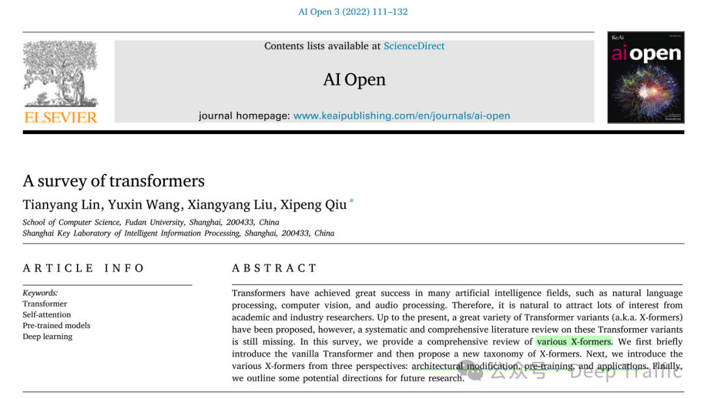
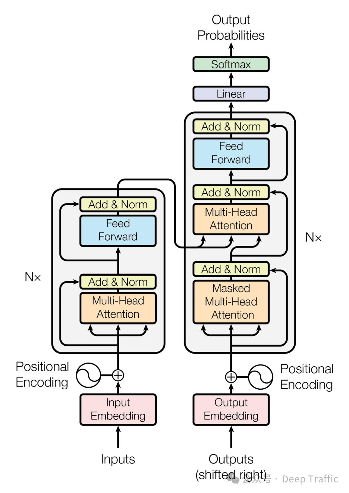
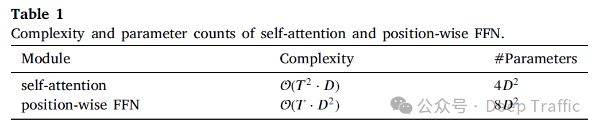
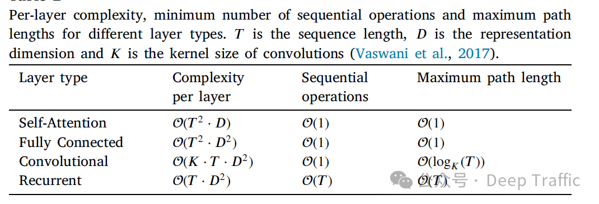
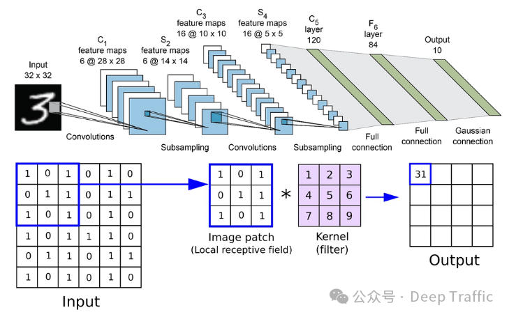

# 《A survey of transformers》
> _**作者: 周威**_
> 
> **原文:** [_**https://mp.weixin.qq.com/s/V8wqBQ7jz3yj5Br8KlAwmg**_](https://mp.weixin.qq.com/s/V8wqBQ7jz3yj5Br8KlAwmg)

Transformer综述(一): 稀疏注意力
-----------------------

1\. 前言
------

本文是之前笔者阅读《A survey of transformers》论文的学习笔记.如有错误解析,欢迎指出~

因为篇幅有限,本文主要围绕传统Transformer所存在的问题(即**计算和存储开销大**,自注意力的计算复杂度为)以及为了解决该问题而衍生出的一类Transformer变体(即**稀疏注意力**).

有关传统Transformer,我们已经在之前的文章进行了相应的解析,欢迎回顾:

[【Transformer系列】Transformer模型与代码详解](https://www.yuque.com/lebornyuan/llm/qhtv468kwnpnoeo4)

#### **1.1 Transformer与现有网络总体对比**

总体而言,相较于其他网络模型(全连接、CNN、RNN),Transformer的**运算复杂度**、**顺序操作数**和**最大路径长度**对比如下表所示(其中为序列长度、为特征维度):

这里的**运算复杂度**、**顺序操作数**和**最大路径长度**定义如下:

1.  **复杂度(Complexity)**: 这通常指的是计算复杂度,即执行某个操作或算法所需的计算资源量,比如时间复杂度或空间复杂度.在神经网络的上下文中,复杂度可以用来衡量模型在处理输入时所需的计算量.对于给定大小的输入,复杂度较高的操作或层类型需要更多的计算资源.复杂度通常与输入数据的大小(例如,序列的长度或维度)有关.
2.  **顺序操作(Sequential Operations)**: 这个指标衡量在处理数据时必须按顺序执行的操作数量.顺序操作的数量影响了并行计算的可能性.如果一个过程包含很多必须按特定顺序执行的步骤,则这个过程的并行化程度受限,这通常会导致处理速度变慢.在神经网络中,能够并行处理的操作通常更受欢迎,因为它们可以更有效地利用现代硬件(如GPU)来加速训练和推理过程.
3.  **最大路径长度(Maximum Path Length)**: 在神经网络的上下文中,这个指标通常指的是信号在网络中从输入到输出传播时经过的最长路径.这个长度直接影响到信息传播和梯度回传的效率,进而影响学习过程中的长期依赖问题.路径越长,模型在处理长距离依赖时可能越困难,因为梯度可能会消失或爆炸.理想情况下,较短的最大路径长度有助于更有效地学习长距离依赖关系.

#### **1.2 Transformer与现有网络具体对比**

作者在原文中提到:

**语句**: Transformer is often compared against convolutional and recurrent networks. Convolutional networks are known to impose the inductive biases of translation invariance and locality with shared local kernel functions. Similarly, recurrent networks carry the inductive biases of temporal invariance and locality via their Markovian structure.

**重点**: Transformer**缺少inductive biases(归纳偏置)**,因此更通用,但对小数据集更容易过拟合

对于上面这句话,这里我们拆开来逐步理解,首先了解下卷积神经网络(CNNs)中的归纳偏置.

卷积神经网络(CNNs)的**归纳偏置**主要体现在: **平移不变性**(translation invariance)和**局部性**(locality).其中:

*   **平移不变性**: 意味着如果输入数据中的特征平移了一定距离,模型仍然能够识别该特征.这是通过在输入数据的不同区域使用相同的卷积核(或滤波器)来实现的.这种做法假设了数据的重要特征是平移不变的,这在图像处理中尤其有用,因为图像中的对象无论出现在哪个位置,都应该被识别为同一类对象.
*   **局部性**: 通过局部连接和权重共享来实现.卷积神经网络的每个卷积核仅与输入数据的一个局部区域相连接,这意味着模型假设输入数据中的信息可以通过分析其局部区域来捕获.这种假设对于图像这样的数据特别合适,因为图像中的像素与其相邻像素之间通常有很强的相关性.

在循环神经网络(RNNs)中,其**归纳偏置**主要体现在: **时间不变性**(temporal invariance)和**局部性**(locality),通过其马尔可夫结构实现,其中:

*   **时间不变性**: RNNs假设数据中的信息是随时间变化的,但处理这些信息的方式在不同时间是一致的.这使得RNNs特别适用于处理序列数据,如文本或时间序列,其中数据点的顺序很重要.
*   **局部性**: 在RNNs中,当前状态的计算仅依赖于前一状态和当前输入.这种马尔可夫性质(即,未来状态仅依赖于当前状态,与更早的状态无关)使得RNN能够通过考虑数据的局部时间邻域来处理序列数据.

总结而言,CNN具有局部连接和权重共享的归纳偏置,这意味着CNN会假设相邻位置之间存在相关性,并且同一卷积核在整个输入上共享权重,这有助于提取局部特征.而Transformer**并没有这种局部连接和权重共享的假设**,每个位置的词语都可以与所有其他位置进行交互,使得模型更加灵活.

RNN具有对时序信息的天然偏置,它通过循环结构来处理序列数据,并且具有记忆能力,能够捕捉先前时刻的信息.相比之下,**Transformer并不具备显式的时序处理机制**,它通过self-attention机制来学习序列中各个位置之间的关系,而不依赖于固定的时序结构.

作者有提到

**语句**: Another closely related network type is Graph Neural Networks (GNNs) with message passing (Wu et al., 2021a). Transformer can be viewed as a GNN defined over a complete directed graph (with selfloop) where each input is a node in the graph. The key difference between Transformer and GNNs is that Transformer introduces no prior knowledge over how input data are structured — the message passing process in Transformer solely depends on similarity measures over the content

**重点**: Transformer可以被视为在一个完全连接的有向图上定义的一种特殊形式的GNN(每个输入都是图中的一个节点,并且节点之间存在自环)

我们如何理解上面的话呢？

关于图神经网络(GNNs),他是一类专门用于处理图结构数据的神经网络.在图结构数据中,数据项(节点)通过边相互连接,形成复杂的关系网络.GNNs通过一种称为**消息传递**(message passing)的机制来更新节点的表示.在每次迭代中,每个节点接收来自其邻居节点的信息,并根据这些信息更新自己的状态.这个过程允许信息在图中流动,从而使得节点能够捕获到其在图中的结构位置和邻居节点的信息.

相较之下,Transformer是一种主要用于处理序列数据(如文本)的模型,它通过**自注意力机制**来捕获序列中不同位置之间的关系.在Transformer中,每个序列位置的表示都是通过**计算它与序列中其他位置的相似度**,然后根据这些相似度加权合并其他位置的信息来更新的.这种机制允许模型**动态地**根据内容的相似性来决定信息的流动,而不是依赖于固定的结构.

从上述描述中,我们可以看到GNNs和Transformer在处理数据时都使用了**某种形式的“消息传递”机制**.然而,它们之间存在几个关键的区别:

1.  **数据结构**: GNNs专门设计用于处理图结构的数据,其中数据项之间的关系是显式定义的(通过边连接).而Transformer最初是为序列数据设计的,尽管它的自注意力机制使得它能够处理更一般的数据结构.
2.  **消息传递机制**: 在GNNs中,消息传递是基于图的结构的,节点只从其邻居节点接收信息.而在Transformer中,消息传递(或者说信息的更新)是基于内容的相似度的,每个位置都可以从序列中的任何其他位置接收信息.
3.  **先验知识**: GNNs利用了图结构作为先验知识,这意味着模型的设计和信息的流动是基于数据的结构的.相反,Transformer不引入关于数据结构的先验知识,它允许模型根据数据内容本身动态地学习信息的流动.

因此,虽然Transformer可以被视为**在一个完全连接的有向图上定义的一种特殊形式的GNN**(每个输入都是图中的一个节点,并且节点之间存在自环),但它与传统的GNNs在处理数据结构和信息流动方面有本质的区别.

**2\. Sparse Attention**
------------------------

讲完Transformer的基础知识和相应特点后,我们将脚步移到Transformer的一类**核心变体**中,即**Sparse Attention嵌入**的Transformer.

在Transformer模型中,**自注意力(Self-Attention)机制**是其核心组成部分,它允许模型在处理序列数据时动态地关注序列中的不同部分.然而,随着序列长度的增加,标准的自注意力机制的计算复杂度和内存需求也会**指数增加**,这限制了模型处理长序列数据的能力.

为了解决这个问题,研究者们提出了稀疏注意力(Sparse Attention)机制.

### **2.1 稀疏注意力(Sparse Attention)的基本概念**

稀疏注意力机制的核心思想是**在自注意力计算中引入稀疏性**,即不是让序列中的每个位置都与其他所有位置进行注意力计算,而是**仅选择部分位置进行计算**.这种选择可以基于不同的策略,例如**固定的模式**(如局部窗口)、**基于内容的选择**(如与当前位置最相关的其他位置),或者是**通过学习得到的模式**.通过这种方式,稀疏注意力机制减少了计算量和内存占用,使得模型能够更高效地处理长序列.

稀疏注意力的优点可以总结为:

1.  **减少计算复杂度**: 通过减少参与注意力计算的位置数,稀疏注意力显著降低了计算复杂度,使得模型能够处理更长的序列.
2.  **减少内存需求**: 稀疏操作减少了需要存储的注意力权重的数量,从而降低了模型的内存需求.
3.  **提高长距离依赖学习能力**: 某些稀疏模式(如分层或跳跃连接)可以帮助模型更有效地学习序列中的长距离依赖关系.

尽管稀疏注意力机制在处理长序列时具有明显的优势,但它也面临一些挑战:

1.  **选择稀疏模式**: 如何选择或设计有效的稀疏模式是一个开放的研究问题,不同的任务和数据可能需要不同的稀疏策略.
2.  **实现复杂度**: 与标准自注意力相比,稀疏注意力可能需要更复杂的实现,尤其是在优化计算效率方面.
3.  **性能影响**: 稀疏性可能会导致模型损失一些信息,特别是当重要信息分布在序列中被忽略的位置时.

总的来说,稀疏注意力是Transformer模型的一个重要扩展,它通过引入稀疏性来提高处理长序列的效率,同时也带来了新的挑战和研究方向.

### **2.2 观察到的稀疏性**

Child等人(2019)的研究发现,实际上在训练好的Transformer模型中,**注意力矩阵往往是稀疏的**,这意味着并不是每个令牌都需要关注其他所有令牌.有些令牌之间的相互作用可能对最终的输出贡献不大,可以被忽略.

基于上述观察,可以通过引入**结构化偏差**来减少每个查询(query)需要关注的键(key)对的数量.这种做法通过仅计算根据预定义模式选择的查询-键对之间的相似度得分来实现.如果一个令牌不应该关注另一个令牌,相应的得分会被设置为负无穷(-∞),这在实际实现中意味着这些项通常不会被存储在内存中,从而减少了内存占用.

通过这种方法,我们得到了一个**未归一化的注意力矩阵**,其中只有那些根据预定义模式应该被关注的令牌对之间会有非负无穷的得分,其他则为负无穷.这大大减少了计算量和内存需求,因为我们只计算和存储部分令牌对的得分.

这种方法有效地利用了Transformer模型注意力矩阵的稀疏性,通过结构化偏差减少了计算复杂度和内存需求,同时保持了模型的有效性.这对于处理长序列或在资源受限的环境中运行模型特别有用.

* * *

### **2.3 稀疏注意力的种类**

根据确定稀疏连接的度量标准,将这些方法分为两类: **基于位置的稀疏注意力**和**基于内容的稀疏注意力**.

*   **基于位置的稀疏注意力(position-based sparse attention)**: 这种方法是根据位置信息来确定哪些位置之间的注意力权重是稀疏的.在基于位置的稀疏注意力中,可能会使用一些规则或启发式方法来确定哪些位置之间的交互是重要的,而其他位置之间的交互可以被忽略或减少.这种方法通常依赖于位置之间的相对距离或其他位置特征来确定稀疏连接.
*   **基于内容的稀疏注意力(content-based sparse attention)**: 这种方法是根据输入内容的特征来确定哪些位置之间的注意力权重是稀疏的.在基于内容的稀疏注意力中,可能会根据输入数据的特征向量来动态地确定哪些位置之间的交互是重要的,从而实现稀疏连接.这种方法通常会根据输入数据的内容特征来自适应地调整注意力权重,以实现更高效的计算和更好的性能.

### **2.3.1 基于位置的稀疏注意力**

如上图所示,基于位置的稀疏注意力的**基本形式**大致可以分为:

#### **1\. Global Attention**

这种机制通过添加一些全局节点来工作,这些节点可以被看作是信息传播的枢纽.这些全局节点有能力关注序列中的每一个节点,这意味着它们可以捕获和累积整个序列的信息.同时,序列中的每个节点也都会关注这些全局节点.

这样,即使是序列中相距很远的节点,它们之间的信息也可以通过这些全局节点进行有效传播.通过这种方式,**全局节点充当了一个信息集散地**,帮助远距离的节点间接地相互“通信”.这样,即使在稀疏注意力的框架下,模型也能更好地捕捉长距离依赖性,从而提高了模型对序列数据的理解能力.

#### **2\. Band Attention**

“带状注意力”(也被称为滑动窗口注意力或局部注意力)是一种在处理数据时**考虑数据的局部性质**的注意力机制.

这种机制基于一个简单而强大的假设: 在很多类型的数据中,比如文本、图像和时间序列等,一个元素(或令牌、像素等)与其邻近元素的关联性通常要比与远处元素的关联性更强.因此,限制每个查询仅关注其邻近节点是一种自然且有效的方式.

因此,这种注意力通过将注意力限制在一个局部区域内,带状注意力机制能够显著减少计算量,因为它只计算和存储那些可能高度相关的元素对之间的关系.此外,这种方法还能帮助模型更加聚焦于局部上下文,这在很多任务中是非常有益的,比如在处理语言时捕捉短语层面的依赖关系,或在处理图像时关注局部特征.

#### **3\. Dilated Attention**

“扩张注意力”(Dilated Attention)是一种灵感来源于**扩张卷积神经网络**(Dilated CNNs)的注意力机制,旨在在不增加计算复杂度的情况下增加带状注意力的接受域(即模型能够感知到的输入范围).

扩张注意力采用了与扩张卷积类似的思想.在带状注意力(即局部注意力)的基础上,通过在关注的邻域内设置间隔(称为“扩张”),模型能够覆盖更远的输入元素,而不是仅仅关注紧密排列的邻近元素.扩张宽度(𝑤𝑑)表示在相邻关注点之间的间隔数.例如,当𝑤𝑑=1时,没有扩张,模型表现为标准的局部(带状)注意力；当𝑤𝑑>1时,模型在关注点之间跳过𝑤𝑑-1个点,从而扩大其接受域.通过这种方式,扩张注意力允许模型在不显著增加计算负担的情况下,捕获更长距离的依赖性.这对于处理需要理解长范围上下文信息的任务特别有价值,如某些自然语言处理和时间序列分析任务.

#### **4\. Random Attention**

随机注意力旨在增强模型处理非局部(或长距离)交互的能力,这是通过为每个查询随机抽样一些边来实现的.

这种方法的灵感来源于**随机图**的性质,特别是Erdős–Rényi随机图,以及这些图与完全图在谱属性上的相似性.在随机注意力机制中,对于每个查询,模型不是与所有其他元素进行交互,而是随机选择一些元素进行交互.这种方式类似于在一个随机图上操作,其中查询元素与被选中的元素之间存在边.通过这种随机采样,模型可以以较低的计算成本探索非局部交互,同时利用随机图的快速混合特性来增强信息传播.

#### **5\. Block Attention**

“块局部注意力”(Block Local Attention)是一种特殊的注意力机制,旨在提高处理长序列数据时的效率和效果.这种方法通过将输入序列划分为若干个不重叠的查询块(query blocks),并为每个查询块分配一个局部记忆块(memory block),来实现对长序列的高效处理.在这种机制下,一个查询块中的所有查询仅关注对应记忆块中的键(keys),而不是整个序列.这样做的目的是减少计算复杂度,并允许模型更专注于局部上下文信息,从而提高处理长序列数据时的性能.可以通过以下几种方式在块之间引入交互:

1.  **跨块连接**: 可以在块之间引入额外的连接,允许信息在不同块之间流动.这可以通过添加专门的跨块注意力层来实现,这些层专门处理块之间的交互,从而使模型能够捕获更长距离的依赖.
2.  **分层注意力**: 在这种方法中,模型首先在较小的块内部应用注意力,然后将多个块组合成更大的块,并在这些更大的块上应用注意力.这种分层或多尺度的方法可以帮助模型捕获从局部到全局的不同范围的依赖.
3.  **滑动窗口**: 另一种方法是在块之间使用滑动窗口技术.这意味着块的边界不是固定的,而是允许重叠.通过这种方式,块的每个部分都可以与其邻近块的一部分进行交互,从而增加了块之间的信息流.
4.  **稀疏注意力模式**: 还可以设计稀疏注意力模式,其中一些注意力头专门用于捕获块内的依赖,而其他注意力头则跨越块边界处理更远的依赖.这种混合方法结合了局部注意力的计算效率和全局注意力的能力.

现有一些方法主要是**通过组合上面提到的几种基本Attention**(如global attention、band attention等).

例如:

### **1\. Star-Transformer**

Star-Transformer是一种特别设计的神经网络架构,用于处理自然语言处理(NLP)任务,同时旨在减少计算资源的需求并保持模型性能.这种架构通过结合带状注意力(band attention)和全局注意力(global attention)来实现这一目标.下面是对这种设计的详细解释:

**1\. 带状注意力与全局注意力**

*   **带状注意力**: 这是一种稀疏的注意力模式,其中每个节点只与其相邻的节点直接相连.在Star-Transformer中,带宽设置为3,这意味着每个节点直接与其左右两侧的节点相连(如果存在的话).这种设计减少了计算复杂度,因为它限制了每个节点需要直接交互的节点数量.
*   **全局注意力**: Star-Transformer中只包含一个全局节点,这个全局节点与图中的所有其他节点相连.这意味着任何两个非相邻的节点都可以通过这个共享的全局节点间接相连.全局节点的引入保证了网络能够捕捉长距离依赖,因为它为任意两个节点之间提供了一条通过全局节点的路径.

**2.星形图结构**

这种结合带状注意力和全局注意力的设计形成了一种星形(star-shaped)图结构.在这个结构中,全局节点位于中心,而其他所有节点则围绕着这个中心节点排列,通过带状注意力和全局节点与其他节点相连.这种设计的直观效果是,每个节点都通过一条路径与全局节点相连,而且相邻节点之间还保持了直接的连接.

**3\. 优势**

Star-Transformer的设计优势在于:

1.  **计算效率**: 通过限制每个节点的直接连接数量(带状注意力)并引入一个全局节点来间接连接所有非相邻节点,Star-Transformer显著减少了计算复杂度.
2.  **捕捉长距离依赖**: 尽管采用了稀疏的注意力模式,通过全局节点的引入,模型仍然能够有效地捕捉长距离依赖,因为全局节点为图中任意两个节点提供了一条间接的连接路径.
3.  **灵活性**: 这种架构在处理自然语言处理任务时提供了一种平衡计算效率和模型性能的方法,尤其适用于资源受限的环境.

### **2\. Longformer**

Longformer是一种为处理长文本设计的Transformer模型,通过引入一种新的注意力机制结构来提高处理长序列时的效率和性能.这种新的注意力机制结构结合了带状注意力(band attention)和内部全局节点注意力(internal global-node attention),以及扩展了接受域的稀疏注意力策略,如膨胀窗口注意力(dilated window attention).下面是对这些概念的详细解释:

**1\. 带状注意力(Band Attention)**

带状注意力是一种局部注意力机制,其中每个token只关注其在序列中的邻近token.这种方法的计算成本比全局自注意力(self-attention,标准Transformer中使用的注意力机制)要低,因为它限制了每个token需要计算注意力权重的token数量.

**2.内部全局节点注意力(Internal Global-Node Attention)**

内部全局节点注意力是Longformer的一个关键特性,它允许模型在保持计算可行性的同时捕获长距离依赖.在这种机制下,某些特定的token被指定为全局节点,这些全局节点可以与序列中的所有其他token进行注意力交互.在不同的任务中,全局节点的选择可能不同.例如,在文本分类任务中,\[CLS\] token(一种特殊的token,通常用于表示整个输入序列的聚合信息)被用作全局节点；在问答任务中,所有与问题相关的token都被视为全局节点.

**3.膨胀窗口注意力(Dilated Window Attention)**

为了在不显著增加计算成本的情况下增加模型的接受域(即模型能够考虑的上下文范围),Longformer采用了膨胀窗口注意力.这种方法类似于在卷积神经网络中使用的膨胀卷积,通过在标准带状注意力窗口中引入固定间隔的空白,使得每个token能够关注更远的其他token.这样,模型能够在不显著增加计算复杂度的情况下,捕获更广泛的上下文信息.

**4.总结**

Longformer通过这些创新的注意力机制结构,有效地平衡了计算效率和模型性能,使其能够处理比标准Transformer模型更长的文本序列.这些特性使Longformer特别适合于需要处理大量文本数据的NLP任务,如文档级别的文本分类、问答等.通过精心设计的注意力模式,Longformer能够在保持较低计算成本的同时,有效地捕捉长距离依赖和全局上下文信息.

### **3\. ETC**

Extended Transformer Construction (ETC) 是与 Longformer 同时期提出的一种改进的 Transformer 模型,旨在更有效地处理长文本和结构化输入.ETC 通过结合带状注意力(band attention)和外部全局节点注意力(external global-node attention),以及引入一个掩码机制(masking mechanism)和对比预测编码(Contrastive Predictive Coding, CPC)的预训练方法,来提高模型处理长序列数据的能力和效率.下面分别解释这些概念:

**1.带状注意力(Band Attention)**

与 Longformer 中的带状注意力类似,ETC 的带状注意力限制了每个 token 只与其邻近的 token 交互(即在一个局部窗口内),从而减少了计算复杂度.这种局部注意力机制有助于模型专注于输入序列中相邻信息的处理.

**2.外部全局节点注意力(External Global-Node Attention)**

ETC 引入了外部全局节点的概念,这些全局节点不同于序列中的普通 token,它们被设计来捕获整个输入序列的全局信息.这些全局节点可以与输入序列中的所有 token 进行交互,从而帮助模型捕获长距离依赖关系.这种设计允许模型在保持较低计算成本的同时,处理更长的序列.

**3.掩码机制(Masking Mechanism)**

ETC 引入了掩码机制来处理结构化输入,这使得模型能够更灵活地处理各种类型的输入数据(例如,文档、表格等).通过使用掩码来指示输入数据的结构,ETC 能够更有效地理解和利用这些结构信息,从而提高模型的性能.具体地,掩码机制通过使用特殊的标记(即掩码)来标示输入数据中的结构信息.例如,在处理表格数据时,可以使用不同的掩码来区分行和列；在处理文档时,可以使用掩码来标示标题、段落的开始和结束等.这些掩码在模型的输入阶段被加入到数据中,作为模型理解数据结构的线索.

在实际应用中,掩码通常以向量的形式加入到输入数据中,与数据中的每个token或元素相对应.在模型训练过程中,这些掩码向量会指示模型注意力机制如何在不同元素之间分配权重,从而影响模型的信息聚焦点.例如,可以通过掩码来减少模型对某些不重要信息的关注,或增强模型对关键信息的聚焦,以此来优化模型的学习过程.

**4.对比预测编码(Contrastive Predictive Coding, CPC)**

ETC 采用了对比预测编码(CPC)作为其预训练方法.CPC 是一种无监督学习方法,它通过学习区分给定上下文中的真实未来序列和随机采样的序列来训练模型.这种方法有助于模型学习到更丰富的序列表示,从而提高在下游任务中的性能.

**5.总结**

ETC 通过结合带状注意力、外部全局节点注意力、掩码机制和CPC预训练方法,提出了一种改进的 Transformer 架构,旨在更有效地处理长序列和结构化输入.这些创新使 ETC 在处理长文本和复杂数据结构时,既保持了高效的计算性能,又能捕获丰富的上下文信息和长距离依赖,从而在多种 NLP 任务中实现优异的性能.

### **4\. BigBird**

BigBird 是一种改进的 Transformer 模型,它通过引入额外的随机注意力机制来近似全注意力(full attention),从而有效地处理长序列数据.除了随机注意力之外,BigBird 也使用了带状(band)和全局(global)注意力机制.这些设计共同使得 BigBird 能够在保持计算效率的同时,捕获长距离依赖关系,适用于广泛的自然语言处理任务.

**1.BigBird的关键设计**

1.  **带状注意力(Band Attention)**: 限制注意力机制的聚焦范围,使得每个token只与其周围的一小部分token进行交互,减少了计算复杂度.
2.  **全局注意力(Global Attention)**: 为了捕获全局信息,一些特定的token(如CLS token)被赋予全局注意力,可以与序列中的所有其他token进行交互.
3.  **随机注意力(Random Attention)**: 在带状和全局注意力的基础上,BigBird 引入了随机注意力,即随机选择一些token对进行注意力计算.这种随机性的引入有助于模型更好地捕捉到序列中的长距离依赖关系,并在一定程度上近似全注意力模型的性能.

**2.理论分析: 稀疏编码器和解码器模拟图灵机**

BigBird 的理论分析揭示了,通过使用稀疏编码器和稀疏解码器,这样的模型能够模拟任何图灵机(Turing Machine).这一发现对于理解稀疏注意力模型的成功具有重要意义.

*   **图灵机**: 是一种抽象的计算模型,能够模拟任何算法的计算过程.图灵机由一条无限长的纸带(存储数据),一个读写头(用于读写纸带上的符号),一组状态和一套转移规则组成.图灵机能够执行任意复杂的计算任务,是计算理论中的一个核心概念.
*   **稀疏模型模拟图灵机**: BigBird 通过其稀疏的注意力机制(包括带状、全局和随机注意力)能够有效地处理长序列数据,并通过这种方式,模型能够模拟图灵机的计算能力.这意味着,尽管BigBird 使用的是稀疏的注意力机制,但它仍然具有非常强大的计算能力,能够执行复杂的算法和处理复杂的任务.

这一理论分析解释了为什么稀疏注意力模型(如BigBird)能够在各种任务上取得成功.它们通过高效的稀疏注意力机制,不仅减少了计算资源的需求,同时还保持了模型的强大计算能力,使得模型能够处理长序列数据,并在自然语言处理等领域表现出色.

### **5\. Sparse Transformer**

Sparse Transformer 是一种专为处理大规模序列数据设计的模型,它通过采用稀疏注意力机制来降低计算复杂度,同时保持模型性能.这种模型特别适用于处理那些传统Transformer模型因序列长度过长而难以处理的任务.Sparse Transformer 的关键在于它采用了分解的(factorized)注意力机制,这种机制根据数据的不同类型设计了不同的稀疏模式.

**1.不同类型数据的稀疏模式**

**(1)周期性结构数据**: 对于具有周期性结构的数据(例如,图像),Sparse Transformer 使用带状(band)注意力和跳跃(strided)注意力的组合.周期性结构意味着数据中的某些模式会以一定的间隔重复出现.带状注意力能够帮助模型聚焦于局部区域内的信息,而跳跃注意力则允许模型以固定的步长跳过一些元素,从而捕获更远距离的依赖关系.这种组合使得模型能够有效地处理图像等具有明显周期性结构的数据.

**(2)非周期性结构数据**: 对于没有明显周期性结构的数据(例如,文本),Sparse Transformer 使用块状局部(block local)注意力与全局(global)注意力的组合.块状局部注意力使得模型能够聚焦于输入序列中的小块区域,从而有效地捕捉局部依赖关系.而全局注意力则允许模型关注输入序列中的固定位置(称为全局节点),以捕获整个序列的全局信息.这种设计使得模型能够有效地处理文本等非周期性结构的数据,既保留了对局部信息的敏感性,又能够把握整体的上下文信息.

**2.稀疏Transformer的优势**

通过这种分解的稀疏注意力机制,Sparse Transformer 能够根据数据的特性选择最合适的稀疏模式,从而有效地处理不同类型的大规模序列数据.这种方法不仅显著降低了计算复杂度,使得模型能够处理更长的序列,而且还保持了对数据结构特性的敏感性,提高了模型处理复杂数据结构的能力.因此,Sparse Transformer 在多个领域,特别是在处理长序列数据的任务中,展现出了强大的性能和潜力.

### **6\. BP-Transformer**

一种专门处理文本数据设计的transformer模型,它通过构建一个二叉树来优化信息的流动和处理.在这个二叉树中,所有的单词(或称为tokens)都是叶子节点,而内部节点则是包含多个tokens的跨度(span)节点.这种结构的目的是为了更有效地处理和理解文本数据中的信息.

在这个二叉树的图结构中,边的构建方式是每个叶子节点都与其相邻的叶子节点以及包含更长距离tokens的更高级别的跨度节点相连.这种方法可以被看作是全局注意力(global attention)的一种扩展,其中全局节点是层次化组织的,并且任何两个tokens都通过二叉树中的路径相连.

**1\. BP-Transformer的核心思想**

BP-Transformer的核心在于通过构建一个二叉树来优化文本数据的处理,这个二叉树的设计思路是模拟文本中信息的层次结构和连接方式.在这个二叉树中,最底层的叶子节点代表文本中的单个词汇(tokens),而上层的节点则代表这些词汇形成的短语或句子的集合(即跨度span).这种结构使得模型能够在不同层次上捕捉文本信息,从单个词汇到整个句子的层面.

在BP-Transformer中,每个节点不仅与其直接相邻的节点相连,还与包含更多tokens的高层节点相连.这种设计使得信息能够在树中自底向上和自顶向下流动,有效地捕捉长距离依赖关系.例如,一个词汇不仅与其相邻的词汇有关,还可能与距离较远的词汇有紧密的联系.通过这种结构,模型能够更全面地理解文本中的上下文信息.

传统的Transformer模型中,捕捉长距离依赖关系需要大量的计算资源,因为每个token都需要与序列中的其他所有token进行比较.而在BPT中,通过将文本分解为跨度并构建层次化的结构,模型能够更有效地管理和利用长距离上下文信息,从而减少计算成本.

**2\. BP-Transformer的设计**

*   **二进制划分(BP)**: BPT通过二进制划分输入序列为不同的多尺度跨度,引入了一种从细粒度到粗粒度关注上下文信息的归纳偏置,随着相对距离的增加,上下文信息的表示越来越粗糙."span"是指通过二进制划分(Binary Partitioning, BP)得到的文本片段或者节点.在BPT模型的设计中,输入序列被递归地划分成不同尺度的跨度(spans),这些跨度代表了不同层次的文本信息,从细粒度的单词或短语到粗粒度的句子或段落.
*   **图神经网络**: BPT可以被视为一种图神经网络,其节点是多尺度跨度.一个token节点可以关注较近上下文的小尺度跨度和较远上下文的大尺度跨度.在BPT的实现中,每个span或span token可以被视为图中的一个节点,这些节点通过图自注意力(Graph Self-Attention)机制进行信息的更新和传递.Span token的表示是通过对其内部包含的文本信息进行编码得到的,这种表示能够捕捉到跨度内部的文本特征及其在整体文本结构中的位置信息.
*   **位置信息表示**: BPT将相对位置的概念从序列推广到树状结构,以更好地捕捉位置偏差

**3\. BPT的优势**

1.  **层次化处理长距离上下文**: BPT以层次化的方式模拟长距离上下文,这有助于处理长文本数据.
2.  **减少计算成本**: 通过减少边的数量,BPT降低了计算成本.
3.  **引入粗到细的连接**: BPT通过粗到细的连接近似语言的合理归纳偏置,使得模型更易于训练

### **7\. Image Transformer**

Image Transformer探索了两种类型的稀疏注意力机制在图像领域的应用.这两种注意力机制的设计旨在有效处理图像数据,同时尽量减少计算成本.下面是对这两种注意力机制的具体解释:

**1\. 将图像像素按光栅扫描顺序展平,然后应用块局部稀疏注意力**

这种方法首先将图像按照光栅扫描的顺序(即从左到右,从上到下的顺序)展平成一个一维序列.然后,这个序列被分割成多个小块,每个块内的像素只与块内的其他像素以及相邻块的像素进行交互.这种“块局部稀疏注意力”机制能够大幅减少计算量,因为它限制了每个像素需要关注的其他像素的数量.这种方法适合处理图像中的局部模式和结构,因为它假设图像中重要的信息通常局限于局部区域内.

**2\. 二维块局部注意力**

与第一种方法不同,二维块局部注意力直接在二维平面上操作,不需要将图像展平.在这种方法中,图像被划分成多个二维的小块(query blocks),每个小块只与其周围的小块(memory blocks)进行交互.这种方法更自然地保持了图像的二维结构,更适合捕捉图像中的二维空间关系.

这两种方法的共同点在于,它们都试图通过引入局部注意力机制来减少计算成本,同时保持对图像中重要信息的捕捉能力.通过将注意力限制在局部区域,这些方法能够更高效地处理大型图像数据,同时减少内存消耗.

### **8\. Axial Transformer**

Axial Transformer是处理视觉数据时采用的一种稀疏注意力模式.Axial Transformer是一种设计用来高效处理图像数据的Transformer模型,它通过在图像的每个轴向上独立应用注意力模块来减少计算复杂度.下面是对这种方法的具体解释:

**1\. 轴向注意力机制**

Axial Transformer的核心思想是将图像沿着每个轴(即水平轴和垂直轴)分别处理.具体来说,它在图像的每个轴向上独立应用注意力模块,这意味着每个注意力模块只在一个方向上混合信息,而保持另一个方向上的信息独立.这样做的好处是能够显著减少注意力机制的计算量,因为每次只处理一个维度的信息.

**2\. 实现方式**

具体实现上,可以将图像沿水平轴和垂直轴分别展平,然后分别对这两个方向的像素序列应用注意力机制.这种处理方式可以理解为先沿一个方向对图像进行展平,然后应用带有间隔的注意力(strided attention),间隔大小分别为图像的宽度和高度.这样,每个注意力模块只处理沿一个方向的像素,而忽略另一个方向的像素.

**3\. 效果和优势**

这种轴向(Axial)的处理方式使得模型能够更高效地处理大尺寸图像,因为它大大减少了需要计算的注意力权重的数量.同时,通过分别沿水平和垂直方向混合信息,Axial Transformer能够有效地捕捉图像中的空间关系和特征.

总之,Axial Transformer通过在图像的每个轴向上独立应用注意力模块,实现了对图像数据的高效和有效处理.这种方法的提出,展示了在设计注意力模式时考虑数据的固有结构(如图像的二维空间结构)的重要性,同时也为处理大规模视觉数据提供了一种新的思路.

图解:

**步骤1: 编码所有先前的通道和帧(左图)**

在处理一个新的通道之前,模型首先需要对所有先前的通道和帧进行编码.这一步骤使用了8个块(block)的无遮蔽(unmasked)行注意力和无遮蔽列注意力.这里的“无遮蔽”意味着在计算注意力时,每个元素都可以“看到”行或列中的所有其他元素.这一步骤的目的是捕捉图像中的全局信息,为后续的处理步骤提供上下文.

**步骤2: 对每一行应用注意力,整合之前的行(中图)**

在对所有先前的通道和帧进行编码之后,模型接下来会对当前处理的每一行应用4个块的无遮蔽行注意力和遮蔽列注意力.这一步骤的目的是整合之前已经采样的行信息到当前的编码表示中.这里的“遮蔽列注意力”确保了在处理当前行时,只有之前的行(即当前行之上的行)被考虑,从而满足因果性原则.这样做可以使模型在生成图像的每一行时考虑到上面的所有行,但不会“看到”下面的行.

**步骤3: 更新编码表示并采样新行(右图)**

最后,为了确保条件信息满足因果性,模型会将编码表示向上移动一行.然后,使用4个块的遮蔽行注意力来运行内部解码器,以采样图像中的新行.这里的“遮蔽行注意力”确保了在生成每个像素时,只考虑该像素左侧的像素,这同样是为了满足因果性原则.

总之,Axial Transformer通过分步骤地在图像的行和列上应用不同类型的注意力机制,有效地处理二维张量数据.每一步骤都旨在确保模型在生成图像的每一部分时,能够考虑到图像中的空间关系和因果性原则,从而生成高质量的图像.

### **2.3.2 基于内容的稀疏注意力**

上面解析了部分经典的基于位置的稀疏注意力,作者是这样引入基于内容的稀疏注意力的:

**语句**:Another line of work creates a sparse graph based on input content, i.e., the sparse connections are conditioned on inputs. A straightforward way of constructing a content-based sparse graph is to select those keys that are likely to have large similarity scores with the given query. To efficiently construct the sparse graph, we can recur to Maximum Inner Product Search (MIPS) problem, where one tries to find the keys with maximum dot product with a query without computing all dot product terms.

**理解**: 这段描述提到的是一种基于输入内容创建稀疏图的方法,特别是在处理自注意力机制时的一种优化策略.在标准的 Transformer 模型中,自注意力机制需要计算查询(query)与所有键(key)之间的相似度,这在处理长序列时会导致巨大的计算负担.为了解决这个问题,可以构建一个基于内容的稀疏图,从而**只关注与给定查询最相关的一小部分键,而不是所有键**.下面将详细解释这个过程:

*   **稀疏连接**: 在稀疏图中,每个查询不是与所有键计算相似度,而是只与一部分键(即稀疏连接)进行交互.这些连接是基于输入内容的,意味着它们是根据查询和键之间的相关性条件动态确定的.
*   **选择关键键**: 构建稀疏图的一个直接方法是选择那些与给定查询有较大相似度得分的键.这意味着,对于每个查询,我们只关注那些最可能与其高度相似的键,从而减少计算量.

**最大内积搜索(MIPS)**

*   **MIPS问题**: 为了高效地构建这种基于内容的稀疏图,可以利用最大内积搜索(Maximum Inner Product Search,MIPS)问题的解决方案.MIPS的目标是找到与查询具有最大点积(dot product)的键,而不需要计算查询与所有键之间的点积.
*   **效率**: 通过解决MIPS问题,可以快速识别出与给定查询最相关的键,从而构建稀疏图.这种方法避免了计算查询与所有键之间的相似度,显著提高了计算效率.

**结论**

通过基于输入内容创建稀疏图,并利用MIPS问题来高效地选择与查询最相关的键,可以在保持模型性能的同时显著减少自注意力机制的计算负担.这种方法特别适用于处理长序列数据,使模型能够更高效地捕捉序列中的重要信息,而忽略那些不太相关的部分.这对于提高自然语言处理、图像处理等领域中 Transformer 模型的效率和可扩展性具有重要意义.

下面讲聊几个关于基于内容的稀疏注意力的方法:

### **1\. Routing Transformer**

Routing Transformer 是一种改进的 Transformer 模型,旨在解决标准 Transformer 在处理长序列数据时遇到的效率和性能问题.Transformer 模型由于其自注意力机制(Self-Attention Mechanism)的特性,在处理长序列时会遇到计算复杂度高和内存消耗大的问题,因为每个元素都需要与序列中的其他所有元素计算注意力得分.Routing Transformer 通过引入一种称为“路由”的机制来解决这个问题,从而提高处理长序列的效率.

Routing Transformer试图通过将查询(queries)和键(keys)聚类到相同的中心向量(centroid vectors)上,来减少计算自注意力时的计算复杂度.下面是对这个过程的逐步解释:

**1\. k-means聚类**

*   **聚类**: Routing Transformer使用k-means算法将查询集合()和键集合()聚类到k个中心向量()上.这意味着每个查询和键都被分配到最近的中心向量,形成了k个不同的聚类.
*   **局部注意力**: 在这种设置下,每个查询只关注与其属于同一聚类的键.这大大减少了每个查询需要关注的键的数量,从而减轻了计算负担.

**2\. 中心向量的更新**

*   **更新规则**: 聚类中心向量在训练过程中通过指数移动平均(Exponentially Moving Average, EMA)方法更新.对于每个中心向量(),它的更新取决于分配给该聚类的查询和键的向量之和,除以该聚类的计数的指数移动平均.
*   **公式**: 更新中心向量的公式如下:

其中,()表示当前在聚类()中的向量数量,()是一个超参数,控制着更新的速度.

**3\. 索引集合的定义**

*   **索引集合**: 对于第()个查询,它关注的键的索引集合()定义为所有与该查询属于同一聚类的键的索引集合: 这意味着每个查询只计算与它属于同一聚类的键之间的注意力得分.

通过这种方式,Routing Transformer能够有效地减少自注意力机制的计算复杂度,特别是在处理长序列时.通过将查询和键聚类到相同的中心向量,然后仅在同一聚类内计算注意力,这种方法能够在保持模型性能的同时,显著提高计算效率.

这里需要说明随着学习过程中展开,模型学到的representation是变化的,这会导致聚类中心的变化,因此需要利用EMA对齐进行慢慢更新.

### **2\. Reformer**

Reformer是一种改进版的Transformer模型,旨在解决原始Transformer模型处理长序列数据时的计算和存储效率问题.Reformer主要通过以下两种创新技术来提高效率:

**1\. 局部敏感哈希注意力(Locality-Sensitive Hashing Attention)**

原始的Transformer模型在计算自注意力(self-attention)时,每个元素都需要与序列中的所有其他元素进行比较,导致计算复杂度和存储需求随序列长度的平方增长.Reformer通过引入局部敏感哈希(LSH)技术来对输入序列进行分桶(bucketing),使得每个元素只需要与同一桶内的元素计算注意力得分.这种方法将自注意力的计算复杂度从原来的O(n^2)降低到O(nlogn),显著提高了处理长序列的效率.

**2\. 可逆残差层(Reversible Residual Layers)**

在深度学习模型中,为了在反向传播过程中计算梯度,需要存储前向传播过程中的中间激活值,这在处理长序列时会占用大量的内存.Reformer通过使用可逆残差层来解决这一问题.这种设计允许模型在反向传播时重建前向传播的中间激活值,而无需显式地存储它们,从而大幅减少了内存需求.

通过这些创新,Reformer能够在保持Transformer模型优点的同时,显著提高处理长序列数据的效率,减少计算资源和内存的需求.这使得Reformer在自然语言处理(NLP)和其他需要处理长序列数据的领域中具有广泛的应用潜力.

Reformer分解为几个关键步骤和概念:

**(1)局部敏感哈希(LSH)**

局部敏感哈希是一种哈希方法,它保证相似的项(在这里指查询(queries)和键(keys))有很高的概率被映射到同一个哈希桶(bucket)中.这种方法的基本思想是,通过哈希函数将数据项分组,使得相似度高的项更可能落在同一个组中,从而减少需要比较的项的数量,提高计算效率.

**(2)LSH函数的计算**

Reformer使用随机矩阵方法作为LSH函数.给定一个随机矩阵(R),其大小为(),其中()是键向量的维度,(b)是桶的数量.对于任何输入向量(x)(可以是查询或键),LSH函数通过计算()和(),然后对这两个结果取arg max(即选择最大值的索引),来决定(x)应该被哈希到哪一个桶中.这个过程可以用公式表示为: 这里的()是(x)通过LSH函数映射得到的桶索引.

**(3)LSH注意力机制**

在Reformer中,每个查询()只会与那些与其映射到同一个桶中的键-值对进行交互.这通过下面的条件确定哪些键-值对应该被考虑: 这意味着,对于第(i)个查询,只有当键()的哈希值与()的哈希值相同,即它们被哈希到同一个桶中时,()对应的键-值对才会被考虑.

**(4)效率提升**

通过这种方式,Reformer大幅减少了计算自注意力时需要比较的键-值对的数量.在传统的Transformer中,每个查询都需要与序列中的所有键进行比较,导致计算复杂度随序列长度的平方增长.而在Reformer中,通过将键-值对分桶,每个查询只需要与少数几个同桶内的键-值对进行比较,从而将复杂度降低到接近线性,极大地提高了处理长序列数据的效率.

**(5)复习一下哈希表**哈希表(Hash Table)是一种通过哈希函数将键(Key)映射到表中一个位置来访问记录的数据结构,这种结构可以实现快速的数据插入、查找和删除操作.哈希表的核心思想是使用哈希函数将被存储对象的键值转换成数组的索引.

哈希表主要由两个部分组成:

1.  **哈希函数**: 负责将输入(通常是键值)转换成一个整数,这个整数被用作数组的索引.好的哈希函数应该能够均匀分布输出值,以减少哈希冲突(两个键映射到同一个位置)的概率.
2.  **数组**: 存储实际的数据记录(或者指向数据记录的指针).数组的每个槽位可以直接通过哈希函数计算出的索引访问.

### **3\. SAC(Sparse Adaptive Connection)**

Sparse Adaptive Connection(SAC)是一种在自然语言处理(NLP)中用于改进模型性能的技术.它的核心思想是将输入序列视为一个图(graph),并通过学习在序列的不同元素(tokens)之间构建注意力边(attention edges),这些边代表了节点之间的关联强度,可以帮助模型更好地理解和处理输入数据,从而为特定任务提供更好的性能.

这种连接是“自适应稀疏”的,意味着模型会学习在哪些节点之间创建连接,以及如何调整这些连接的稀疏程度,以最佳地服务于任务需求.

具体地,SAC使用一个基于长短期记忆网络(LSTM)的边预测器来决定在哪些节点(即tokens)之间构建边.

在实际应用中,我们通常没有关于节点之间应该如何连接的“真实答案”(ground truth).换言之,没有明确的指导告诉模型哪些边是应该存在的.为了解决这个问题,SAC使用强化学习来训练边预测器.强化学习是一种让模型通过试错来学习如何完成任务的方法.在这种设置下,边预测器的“行为”是决定在哪些节点之间构建连接,通过评估这些决策对任务性能的影响,预测器逐渐学习如何最有效地构建图.

另外,在Sparse Adaptive Connection (SAC) 中,使用了距离编码(distance encoding),其目的是为了捕获和表示图中节点之间的结构关系,尤其是它们之间的距离或位置关系.距离编码为模型提供了一种方式,使其能够理解和利用节点之间的相对或绝对位置信息,从而改善对图结构的理解和处理.

### **4.Sparse Sinkhorn Attention**

在一般的自注意力机制中,每个输入元素(例如,序列中的单词或句子)都会被转换成三种向量: query(查询向量)、key(键向量)和value(值向量).通过计算query和所有key之间的相似度,去决定每个元素应该给予序列中其他元素多少“注意力”.

而在Sparse Sinkhorn Attention方法中,会首先将queries和keys分割成多个块.这意味着,而不是让每个query与所有的keys进行比较,我们将它们分组,以便每个query只与一小部分keys进行比较.

具体地,Sparse Sinkhorn Attention方法中,每个query块被分配一个对应的key块.这意味着,一个query只能“注意”到分配给它的key块中的keys.这种分配减少了计算复杂度,因为我们不再需要计算每个query与所有keys之间的相似度.

key块对query块的分配是通过一个排序网络控制的,该网络使用Sinkhorn归一化产生一个双重随机矩阵(doubly stochastic matrix).这个矩阵作为排列矩阵,表示分配.双重随机矩阵的特点是其所有行和列的和都等于1,这确保了分配的均匀性和公平性.这里需要说明的是,Sinkhorn归一化(Sinkhorn Normalization),这是一种数学过程,用于将任意正方形矩阵转换为双重随机矩阵.双重随机矩阵(Doubly Stochastic Matrix)是一种特殊的矩阵,其所有行和列的和都等于1,且矩阵中的所有元素都非负.这种矩阵在多项式分配、优化和机器学习中有着广泛的应用.

Sparse Sinkhorn Attention将点积注意力的内存复杂度从O()降低到O(),其中是基于序列长度n的一个因子.SORTCUT变体进一步将复杂度降低到线性时间O(),其中是一个用户定义的预算超参数,远小于.

**3\. 总结**
----------

以上就是我关于阅读《A survey of transformers》论文的学习笔记,当然这只是一部分,尤其关注于**稀疏注意力**这块.

此外,该论文中还介绍了很多变体,诸如Linearized attention、Query prototyping and memory compression、Low-rank self-attention、Attention with prior等等,在后续的文章中我们会继续进行相应的解析,欢迎关注.