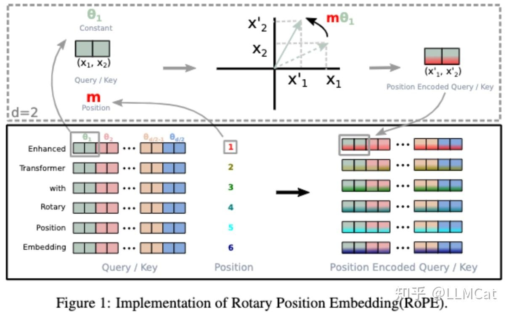

# [LLM理论系列] RoPE 方法
> _**作者: LLMCat**_ 
> 
> _**原文:**_ [_**https://zhuanlan.zhihu.com/p/20052942525**_](https://zhuanlan.zhihu.com/p/20052942525)

RoPE是一种用于Transformer架构中的位置[编码方法](https://zhida.zhihu.com/search?content_id=253032937&content_type=Article&match_order=1&q=%E7%BC%96%E7%A0%81%E6%96%B9%E6%B3%95&zhida_source=entity)，旨在更好地处理序列数据中的位置信息。在Transformer模型中，[位置编码](https://zhida.zhihu.com/search?content_id=253032937&content_type=Article&match_order=2&q=%E4%BD%8D%E7%BD%AE%E7%BC%96%E7%A0%81&zhida_source=entity)是一个关键组件，它向模型提供序列中每个元素的位置信息。传统的[绝对位置编码](https://zhida.zhihu.com/search?content_id=253032937&content_type=Article&match_order=1&q=%E7%BB%9D%E5%AF%B9%E4%BD%8D%E7%BD%AE%E7%BC%96%E7%A0%81&zhida_source=entity)和相对位置编码虽然在某些场景下有效，但也存在一些局限性。例如，绝对位置编码在处理长序列时可能会出现位置信息混淆的问题，而相对位置编码在计算复杂度和内存占用方面可能较高。RoPE通过将[位置信息](https://zhida.zhihu.com/search?content_id=253032937&content_type=Article&match_order=4&q=%E4%BD%8D%E7%BD%AE%E4%BF%A1%E6%81%AF&zhida_source=entity)以旋转的方式融入到模型的表示中，有效地解决了这些问题。

1 RoPE原理介绍
----------

RoPE (Rotary Position Embedding) 是一种通过旋转操作来编码位置信息的方法。它对query和key向量进行位置相关的变换：

$$qm=fq(xm,m) kn=fk(xn,n) $$

当计算两个[位置向量](https://zhida.zhihu.com/search?content_id=253032937&content_type=Article&match_order=1&q=%E4%BD%8D%E7%BD%AE%E5%90%91%E9%87%8F&zhida_source=entity)的内积时，结果会自然包含它们之间的相对位置信息：

$$⟨fq(xm,m),fk(xn,n)⟩=g(xm,xn,m−n)$$

$$

RoPE通过以下方式实现这个目标(其中的Re是取实部)： $$ $$ f\_q (x\_m, m) = (W\_q x\_m) e^{im\\theta} $$

$$ f\_k (x\_n, n) = (W\_k x\_n) e^{in\\theta} $$

$$ g(x\_m, x\_n, m-n) = \\text{Re} \\left\[ (W\_q x\_m) (W\_k x\_n)^\* e^{i(m-n)\\theta} \\right\] $$

其中，θ是一个与维度相关的参数序列：$\\theta\_{i} = 10000^{-2(i-1)/d}, \\quad \\text{其中 } i \\text{ 从 } 1 \\text{ 到 } d/2$。这个设计让不同维度有不同的[旋转频率](https://zhida.zhihu.com/search?content_id=253032937&content_type=Article&match_order=1&q=%E6%97%8B%E8%BD%AC%E9%A2%91%E7%8E%87&zhida_source=entity)，帮助模型更好地区分不同的相对位置。

在实际代码实现中，RoPE的计算公式为： $$ F (x, m) = \\begin{bmatrix} X\_1 \\ X\_2 \\ X\_3 \\ X\_4 \\ \\vdots \\ X\_{d-1} \\ X\_d \\end{bmatrix} \\otimes \\begin{bmatrix} \\cos m\\theta\_1 \\ \\cos m\\theta\_1 \\ \\cos m\\theta\_2 \\ \\cos m\\theta\_2 \\ \\vdots \\ \\cos m\\theta\_{d/2} \\ \\cos m\\theta\_{d/2} \\end{bmatrix} + \\begin{bmatrix} -x\_2 \\ X\_1 \\ -x\_4 \\ X\_3 \\ \\vdots \\ -x\_d \\ X\_{d-1} \\end{bmatrix} \\otimes \\begin{bmatrix} \\sin m\\theta\_1 \\ \\sin m\\theta\_1 \\ \\sin m\\theta\_2 \\ \\sin m\\theta\_2 \\ \\vdots \\ \\sin m\\theta\_{d/2} \\ \\sin m\\theta\_{d/2} \\end{bmatrix} $$

如下图所示，RoPE实际上是将向量的每两个维度看作[复平面](https://zhida.zhihu.com/search?content_id=253032937&content_type=Article&match_order=1&q=%E5%A4%8D%E5%B9%B3%E9%9D%A2&zhida_source=entity)上的一个点，然后根据位置信息对这个点进行旋转：

这种设计使得每两个维度都会根据其在序列中的位置进行特定角度的旋转，从而在计算[注意力分数](https://zhida.zhihu.com/search?content_id=253032937&content_type=Article&match_order=1&q=%E6%B3%A8%E6%84%8F%E5%8A%9B%E5%88%86%E6%95%B0&zhida_source=entity)时自然地包含了相对位置信息。不同维度使用不同的θ值，可以让模型更好地区分不同的相对距离。

2 RoPE与传统方法的对比
--------------

我们可以从多个维度分析对比：

**计算复杂度**

*   RoPE：只需要对每个位置的向量进行旋转操作，[时间复杂度](https://zhida.zhihu.com/search?content_id=253032937&content_type=Article&match_order=1&q=%E6%97%B6%E9%97%B4%E5%A4%8D%E6%9D%82%E5%BA%A6&zhida_source=entity)为$O(nd)$，其中d为隐藏维度
*   相对位置编码：需要考虑每对位置间的关系，所以要两两计算 $O(n^{2}d)$
*   绝对位置编码：时间复杂度是$O(nd)$

**内存占用**

*   RoPE：RoPE通过旋转操作将位置信息嵌入到模型中，只需要存储旋转角度θ的[计算参数](https://zhida.zhihu.com/search?content_id=253032937&content_type=Article&match_order=1&q=%E8%AE%A1%E7%AE%97%E5%8F%82%E6%95%B0&zhida_source=entity)，不需要额外存储相对[距离矩阵](https://zhida.zhihu.com/search?content_id=253032937&content_type=Article&match_order=1&q=%E8%B7%9D%E7%A6%BB%E7%9F%A9%E9%98%B5&zhida_source=entity)，内存占用较低，$O(1)$。
*   相对位置编码：需要存储每个位置之间的相对距离矩阵，内存占用 $O(n^{2})$。
*   绝对位置编码：只需要存储一个固定大小的位置编码向量，内存占用较低，$O(1)$。

**长序列处理能力**

*   RoPE：
    *   **外推性能强**：天然支持外推到更长序列，因为位置编码是通过函数计算而非查表得到
    *   相对位置信息的编码更加平滑，不会随着序列长度增加而显著衰减
    *   需要注意：在超长序列场景下，由于使用[三角函数](https://zhida.zhihu.com/search?content_id=253032937&content_type=Article&match_order=1&q=%E4%B8%89%E8%A7%92%E5%87%BD%E6%95%B0&zhida_source=entity)，可能会出现数值精度问题
*   相对位置编码：
    *   和绝对位置编码相比，能够更好地捕捉序列中的相对位置关系，适用于长序列任务。
    *   **外推性能较差**：因为对相对距离有上限截断，超过这个范围的相对位置关系无法很好表示，在超长序列上的表现可能不如RoPE稳定
*   绝对位置编码：
    *   在长序列中，绝对位置编码可能会导致位置信息混淆，模型难以区分不同位置的元素，从而影响性能。
    *   对于较长的序列，绝对位置编码的效果会显著下降。
    *   **完全无法外推**：对于可学习的绝对位置编码，完全无法外推，因为超出训练长度的位置没有对应的编码向量
    *   Sinusoidal位置编码（[正弦位置编码](https://zhida.zhihu.com/search?content_id=253032937&content_type=Article&match_order=1&q=%E6%AD%A3%E5%BC%A6%E4%BD%8D%E7%BD%AE%E7%BC%96%E7%A0%81&zhida_source=entity)），在理论上可以外推，但由于模型在训练时只见过特定长度范围的位置编码，实际使用效果很差。

3 RoPE的变体
---------

关于RoPE的变体，我会在后续文章中进行介绍，欢迎关注！