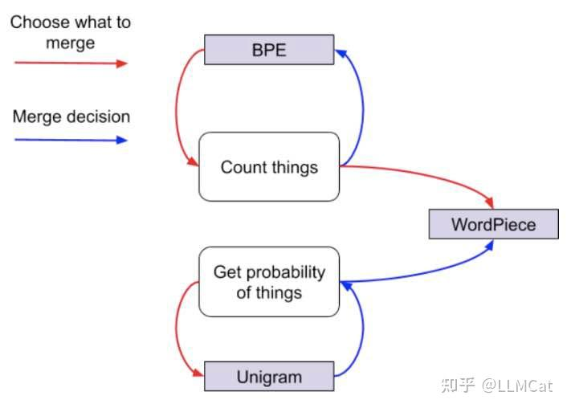

# 【LLM进阶系列】系列文章总结5大Tokenization方法：从原理对比到实战选择
> **作者: LLMCat​**
> 
> **原文: https://zhuanlan.zhihu.com/p/21177838818**

Tokenization方法系列文章:

*   [\[LLM理论系列\] Tokenization方法1：BPE 详解](https://zhuanlan.zhihu.com/p/20877214508)
*   [\[LLM理论系列\] Tokenization方法2：Byte-level BPE (BBPE)](https://zhuanlan.zhihu.com/p/20932759954)
*   [\[LLM理论系列\] Tokenization方法3：WordPiece](https://zhuanlan.zhihu.com/p/21052436181)
*   [\[LLM理论系列\] Tokenization方法4：Unigram Language Model (ULM)](https://zhuanlan.zhihu.com/p/21062260659)
*   [\[LLM理论系列\] Tokenization方法5：SentencePiece](https://zhuanlan.zhihu.com/p/21175209013)

最近一周,我写了一系列的文章，深入讨论了主流的[tokenization](https://zhida.zhihu.com/search?content_id=253258002&content_type=Article&match_order=1&q=tokenization&zhida_source=entity)方法,整理成了一系列文章与大家分享。上面就是这些文章的目录,希望对大家有帮助。

在这篇文章中,我想对前面几篇文章做一个总结,并给出一些实战建议。相信读完这篇文章,你会对tokenization有一个更清晰的认识。

tokenization(分词)是NLP和LLM领域的"基础能力"了。简单来说,就是把一段文本切成一个个小块(我们称之为token)。这些token可能是单词的一部分,或者只单个字符。"切"token的过程是tokenization的核心,直接影响着LLM能不能真正理解文本的含义。

回顾tokenization的发展历程,最开始只是用空格简单分一分,或者定几个规则来切分。但很快就发现问题了 - 遇到生僻词或新词(OOV问题)就很难处理了。于是研究人员先是尝试字符级的分词(naive tokenization),后来发展出了更好用的"子词"(subword)分词方法。现在主流的LLM基本都在用子词分词,因为它既能处理OOV问题,又能保持词义的完整性,可以说是相当聪明的解决方案。

不过,这些方法也不存在谁一定比谁强的说法。选择哪种方法,得具体问题具体分析。比如处理英文,用空格分词可能就够用了;但处理中文、日文这种连续文本,就得用更高级的招数。而且不同的应用场景,对分词的要求也不一样。比如做机器翻译,可能更在意词的细节;做情感分析,可能更关心完整的词义。所以说,选择合适的tokenization方法,需要我们权衡多个因素。

**主流的tokenization方法总结**
-----------------------

主流的tokenization方法主要分为三大类:Word-Level(词级)、Character-Level(字符级)和Subword-Level(子词级)。目前主流的LLM基本都采用Subword-Level的方法,所以我们重点来看看这类方法。

*   **BPE (Byte Pair Encoding)**: 从最基础的字符开始,通过不断合并高频字符对来构建词表。它的核心思想是"高频优先",频率越高的字符对越容易被合并成一个新的子词。  
     
*   **BBPE (Byte-level BPE)**: BPE的改进版本,把处理单位从字符变成了字节。这样做的好处是词表可以控制在256个基础字节,大大降低了模型的复杂度。  
     
*   **WordPiece**: 看起来和BPE很像,但在选择要合并哪对子词时,它考虑的不只是频率,还会看这对子词的[概率分布](https://zhida.zhihu.com/search?content_id=253258002&content_type=Article&match_order=1&q=%E6%A6%82%E7%8E%87%E5%88%86%E5%B8%83&zhida_source=entity)。这让它能更好地捕捉语言中的语义信息。  
     
*   **ULM (Unigram Language Model)**: 用语言模型的方式来做分词,通过训练一个Unigram模型来找出最常见的子词单元。和BPE/WordPiece相比,ULM更注重子词的概率分布而不是简单的频率统计。  
     
*   **SentencePiece**: 一个很特别的方法,它把空格也当作普通字符来处理,用下划线"\_"来标记。底层可以用BPE或ULM的算法,但处理方式更加语言无关。最重要的是,它可以完美还原原始文本,连空格都不会丢。  
     

有一张非常经典的图片，描述了BPE,WordPiece和Unigram的区别。

BPE与WordPiece在选择合并的子词对时，是基于频率的统计，而ULM是基于概率的统计。

在决定合并哪个子词对时，BPE与WordPiece是基于频率的统计，而ULM是基于概率的统计。

下面是这些方法的对比表格:

| 特征  | BPE | BBPE | WordPiece | ULM | SentencePiece |
| --- | --- | --- | --- | --- | --- |
| 基本单位 | 字符  | 字节  | 字符  | 字符  | 字符(含空格) |
| 词表大小 | 较大  | 最小(256) | 较大  | 较大  | 较大  |
| 训练速度 | 快   | 快   | 中等  | 慢   | 取决于算法 |
| 语言无关性 | 中等  | 强   | 中等  | 中等  | 强   |
| 可逆性 | 不可逆 | 可逆  | 不可逆 | 不可逆 | 可逆  |
| OOV处理 | 一般  | 优秀  | 一般  | 一般  | 优秀  |
| 主要应用 | GPT-2 | GPT-3/4 | BERT | \-  | T5/ALBERT |
| 空格处理 | 忽略  | 作为字节 | 忽略  | 忽略  | 特殊字符 |

**如何选择合适的Tokenization方法?**
--------------------------

虽然现在大多数[开发者](https://zhida.zhihu.com/search?content_id=253258002&content_type=Article&match_order=1&q=%E5%BC%80%E5%8F%91%E8%80%85&zhida_source=entity)不会从头训练LLM，更多是做继续预训练或微调，但了解如何选择合适的tokenization方法依然很重要。因为不同的tokenization方法在不同阶段会有不同的表现。这里我结合实践经验，总结了一些选择建议，希望能帮助大家做出更好的决策。

### **1\. 基于语言特点选择**

*   **处理英语等有明显分隔符的语言**
    *   首选BPE/WordPiece: 这类语言词边界清晰,用基础方法就能达到不错效果
    *   考虑BBPE: 如果需要处理emoji、特殊符号等,BBPE会更合适
*   **处理中文/日语等连续文本**
    *   优先SentencePiece: 无需预分词,避免[误差传播](https://zhida.zhihu.com/search?content_id=253258002&content_type=Article&match_order=1&q=%E8%AF%AF%E5%B7%AE%E4%BC%A0%E6%92%AD&zhida_source=entity),效果更好
    *   可选ULM: 基于概率的建模更适合捕捉这类语言的语义

### **2\. 根据应用场景选择**

*   **通用NLP任务**
    *   WordPiece是BERT家族的标配,在各类任务上表现稳定
    *   BPE是GPT系列的选择,在大规模语言建模方面优势明显
*   **多语言任务**
    *   BBPE: 字节级处理让多语言共享更自然
    *   SentencePiece: 语言无关设计,特别适合多语言模型
*   **垂直领域**
    *   医疗: 建议用能保持专业术语完整的方法(如定制的WordPiece)
    *   代码: BBPE对特殊字符的处理更友好

### **3\. 考虑资源约束**

*   **资源受限场景**
    *   BBPE: 最小词表(256字节)是最优选择
    *   优化版BPE: 可灵活调整词表大小平衡效果
*   **资源充足场景**
    *   ULM: 训练慢但分词质量高
    *   SentencePiece: 可以尝试更大词表提升效果

### **4\. 实战建议**

**新手入门建议**

*   从BBPE开始: 简单稳定,适应性强
*   主攻中文/日语: 直接上手SentencePiece

**项目优化方向**

*   先找到瓶颈: 词表大小?训练速度?效果?
*   再对症下药选方案

**特殊场景处理**

*   需要完美还原: BBPE/SentencePiece
*   追求速度: BPE/BBPE
*   重视效果: ULM/WordPiece

**混合方案参考**

*   特殊字符用BBPE + 常规文本用BPE
*   英文BPE + 中文SentencePiece

### **关键参数设置**

*   **词表大小参考值**
    *   普通任务: 32k-50k
    *   专业领域: 50k-100k
    *   多语言: 100k+
*   **训练数据量**
    *   基础要求: 100MB+纯文本
    *   多语言建议: 更大规模确保覆盖

**写在最后**
--------

通过这些介绍,我们可以看到子词[分词技术](https://zhida.zhihu.com/search?content_id=253258002&content_type=Article&match_order=1&q=%E5%88%86%E8%AF%8D%E6%8A%80%E6%9C%AF&zhida_source=entity)巧妙解决了传统分词的痛点。它既能[控制模型](https://zhida.zhihu.com/search?content_id=253258002&content_type=Article&match_order=1&q=%E6%8E%A7%E5%88%B6%E6%A8%A1%E5%9E%8B&zhida_source=entity)参数规模,又能保持语义完整性,还实现了更均衡的词汇分布。不过要注意的是,这些方法主要针对英文设计,用于中文时可能需要适当调整才能发挥最佳效果。

以上就是我对tokenization方法选择的一些思考和建议,都是实践中的真实体会。如果觉得有帮助,欢迎点赞收藏关注，不要只收藏不点赞。。也欢迎在评论区交流讨论,一起学习进步～