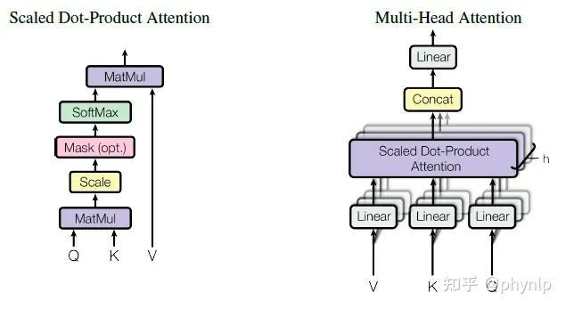
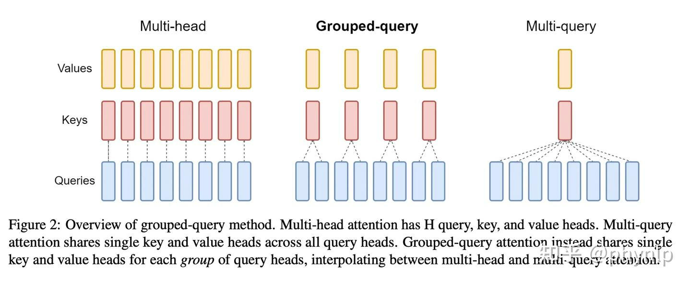
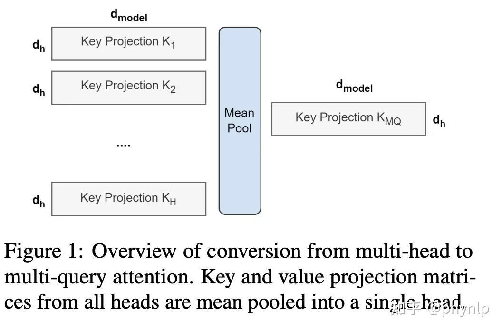
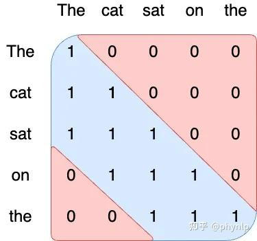
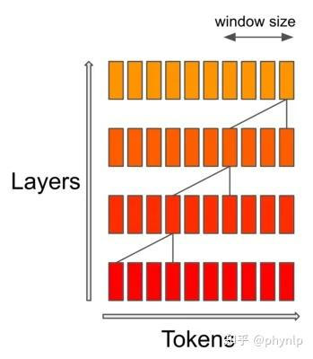
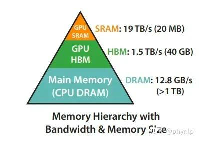
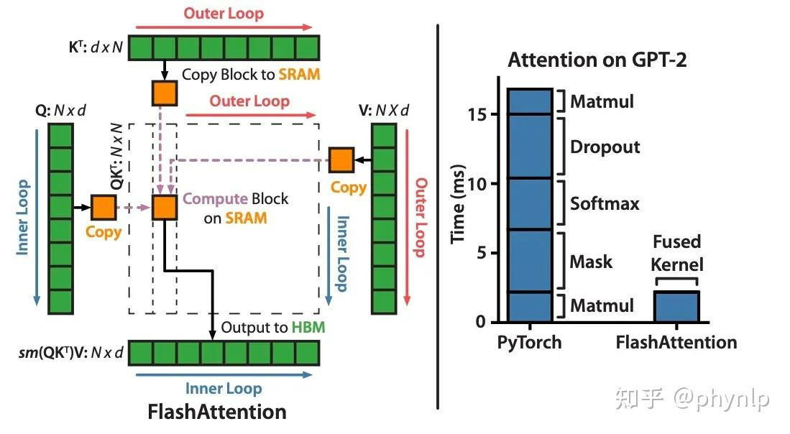

# LLM中Attention实现方式汇总
> _**作者: phynlp**_
> 
> _**原文:**_ [_**https://zhuanlan.zhihu.com/p/15348185464**_](https://zhuanlan.zhihu.com/p/15348185464)

Multi-Head Attention
--------------------



> MHA 原理示意图

Attention的计算复杂度与文本长度的二次方成正比，相关的计算过程如下。

1.  Embedding lookup table: 输入文本长度为n（n个token），经过embedding table后，每一个token返回一个大小为（1, d）的向量，d对应embedding的维度大小。对于长度为n的文本，embedding table给出embedding matrix矩阵 X 大小为(n, d)
2.  MHA （Multi head Attention）:
    1.  作用：MHA (Multi Head Attention layer)的目标在于重构文本中的token的[embedding](https://zhida.zhihu.com/search?content_id=252092423&content_type=Article&match_order=5&q=embedding&zhida_source=entity)表示，重构的出发点在于(1)考虑context中token的语义相关性（2）token的位置相关性（通过position embedding 体现）。
    2.  映射计算：embedding matrix X 进入MHA后，会并行处理h个head的[attention layer](https://zhida.zhihu.com/search?content_id=252092423&content_type=Article&match_order=1&q=attention+layer&zhida_source=entity)。处理过程如下，X通过[线性映射](https://zhida.zhihu.com/search?content_id=252092423&content_type=Article&match_order=1&q=%E7%BA%BF%E6%80%A7%E6%98%A0%E5%B0%84&zhida_source=entity)为h个head，得到Attention heads的Q、K、V。对应的维度信息为Q(h, n, k)、K(h, n, k) 和V(h, n, v)，其中hk=hv=O(d)。实现过程相当于X（n, d）与h个维度为（d, k）、(d, k)和（d, v）的矩阵相乘得到，对应的时间复杂为 O(hndk)=O(nd2)_。矩阵相乘(a, b)_(b, c)的时间复杂度为 O(abc) ，h对应矩阵个数也就是head个数。
    3.  Attention计算：简单来讲，n个token每个都要与其他token进行Attention的计算，时间复杂度为 O(n2) 。详细的计算过程为：

QK转置相乘(经过 Softmax 归一)然后与V相乘，获取最终的embedding。Q(h, n, k)、K(h, n, k)计算复杂度为 O(hnkn)=O(n2hk)=O(n2d)_。attention score维度为_(h,n,n)_，与V(h, n, v)相乘的_[_时间复杂度_](https://zhida.zhihu.com/search?content_id=252092423&content_type=Article&match_order=3&q=%E6%97%B6%E9%97%B4%E5%A4%8D%E6%9D%82%E5%BA%A6&zhida_source=entity)\_为\_O(hnnv)=O(n2hv)=O(n2d)

通过上述分析可以看出MHA的整体复杂度为 O(n2d)+O(nd2) 。

MHA的整体复杂度与context 长度 n的二次方成正比，与模型的规模d(embedding size)的二次方成正比。

增大context的长度，会带来计算复杂度的二次方增大。

Attention实现机制优化
---------------

### Multi-Query Attention (MQA)

对于[multi-head attention](https://zhida.zhihu.com/search?content_id=252092423&content_type=Article&match_order=1&q=multi-head+attention&zhida_source=entity)，每个head对应的k矩阵和v矩阵不同，所以对于每个token都有h（head数目）个k矩阵和v矩阵。

在模型推理的过程中，为了防止重新计算，会缓存之前token对应的Keys和Values。因此GPU显存占用会随着预测的token数目而增加。

Multi-Query Attention 通过在不同head中共享K和V，即不同的head具有相同的key和value，降低了存储的k矩阵和v矩阵的数目，对于每个token存储的[matrix](https://zhida.zhihu.com/search?content_id=252092423&content_type=Article&match_order=3&q=matrix&zhida_source=entity)数目由2h个，降低为两个matrix。同事也降低了计算复杂度。

Multi-Query Attention极大的提高了推理速度。

### Group Query Attention



Group Query Attention是对所有head的Query分组为不同的group，对一个group内的query，共享key和value。GQA的效果与MHA的效果相当，训练速度与MQA相当，提高了训练速度的同时，效果相比MQA有提高。

**GQA 的实现**



```text-plain
# init时k和v用self.num_key_value_heads * self.head_dim初始化，当self.num_key_value_heads小于self.num_heads时，参数量变少
self.q_proj = nn.Linear(self.hidden_size, self.num_heads * self.head_dim, bias=False)
self.k_proj = nn.Linear(self.hidden_size, self.num_key_value_heads * self.head_dim, bias=False)
self.v_proj = nn.Linear(self.hidden_size, self.num_key_value_heads * self.head_dim, bias=False)

# forward时，通过repeat_kv方法，将hidden states 从(batch, num_key_value_heads, seqlen, head_dim) 变成 (batch, num_attention_heads, seqlen, head_dim)，相当于是复制了self.num_key_value_groups份
self.num_key_value_groups = self.num_heads // self.num_key_value_heads

key_states = key_states.view(bsz, q_len, self.num_key_value_heads, self.head_dim).transpose(1, 2)
value_states = value_states.view(bsz, q_len, self.num_key_value_heads, self.head_dim).transpose(1, 2)

key_states = repeat_kv(key_states, self.num_key_value_groups)
value_states = repeat_kv(value_states, self.num_key_value_groups)
```

**内存开销计算**

使用 MHA 结构的[自回归模型](https://zhida.zhihu.com/search?content_id=252092423&content_type=Article&match_order=1&q=%E8%87%AA%E5%9B%9E%E5%BD%92%E6%A8%A1%E5%9E%8B&zhida_source=entity)，在推理过程中，会维护一个巨大的 k/v cache。它的内存开销公式为：

```text-plain
batch * max_seq_len * n_heads * head_dim * sizeof(half) * 2
```

而对于 GQA 来说，k/v cache 的内存开销公式变成：

```text-plain
batch * max_seq_len * n_kv_heads * head_dim * sizeof(half) * 2
```

n\_heads / n\_kv\_heads 就是 group 的大小。可见，使用 GQA 可以把 k/v cache 降低到 MHA的1/group 的水平。非常利好 Attention 这种访存密集型的计算。

### SWA (Sliding Window Attention)

通过优化attention的实现，降低attention与[context length](https://zhida.zhihu.com/search?content_id=252092423&content_type=Article&match_order=1&q=context+length&zhida_source=entity)的长度依赖关系。这种对attention结构的优化，会同时提升训练和推理的性能。

sliding window attention 将计算复杂度由$O(n^2)$变为$O(n)$。

**注意力的时间复杂度是序列长度的二次方**，[**空间复杂度**](https://zhida.zhihu.com/search?content_id=252092423&content_type=Article&match_order=1&q=%E7%A9%BA%E9%97%B4%E5%A4%8D%E6%9D%82%E5%BA%A6&zhida_source=entity)**是序列长度的一次方**。在推理时，由于缓存的可用性降低，会造成更高的延迟和更小的吞吐量。为了减少这样的问题，提出了[窗口注意力机制](https://zhida.zhihu.com/search?content_id=252092423&content_type=Article&match_order=1&q=%E7%AA%97%E5%8F%A3%E6%B3%A8%E6%84%8F%E5%8A%9B%E6%9C%BA%E5%88%B6&zhida_source=entity)，在每一个注意力层每个token最多能注意前W个token。





注意力的传递通过层数的增加而向后传递。每一层注意力层，信息可以传递W tokens。经过两层注意力层，信息可以传递2W tokens。比如对于16k 序列长度和4k的滑动窗口，通过4层，信息可以实现整个序列长度的传递。因此序列越长，在[滑动窗口](https://zhida.zhihu.com/search?content_id=252092423&content_type=Article&match_order=2&q=%E6%BB%91%E5%8A%A8%E7%AA%97%E5%8F%A3&zhida_source=entity)长度固定的情况下，为了实现整个序列长度的传递，需要的注意力层数越多。

Attention底层实现优化
---------------

### FlashAttention

FlashAttention 解决attention计算过程中，频繁访问HBM的问题，将attention计算block化，直接在SRAM中进行。

在GPU中底层对[算子](https://zhida.zhihu.com/search?content_id=252092423&content_type=Article&match_order=1&q=%E7%AE%97%E5%AD%90&zhida_source=entity)的优化，会同时提升模型的训练和推理性能。考虑到Attention在GPU的计算过程以及GPU的结构，优化Attention在GPU中的实现。

GPU中的两个核心部分，SRAM运算速度快但是存储量小，HBM运算速度慢但是存储量大。GPU中的operation运算过程，是从HBM拷贝数据进行运算，完成运算后再将数据存储到HBM.



FlashAttention通过以下两个操作实现了attention的加速实现。

1.  利用了GPU中存储的差异性。将数据从HBM拷贝到SRAM中，计算时从SRAM中读取数据，SRAM相比HBM读取和写入速度更快。
2.  SRAM相比HBM速度快，但是存储量小，因此采用分块block的形式计算QK的[矩阵乘法](https://zhida.zhihu.com/search?content_id=252092423&content_type=Article&match_order=1&q=%E7%9F%A9%E9%98%B5%E4%B9%98%E6%B3%95&zhida_source=entity)。即实现了并行block的softmax计算。为了保证分块block计算的softmax值与原有的softmax值不变，采用了block的 softmax计算。

FlashAttention将Q、K和V切分为block，进行block的计算，提高operation的处理速度。



### PagedAttention

PagedAttention解决attention计算过程中的[内存分配](https://zhida.zhihu.com/search?content_id=252092423&content_type=Article&match_order=1&q=%E5%86%85%E5%AD%98%E5%88%86%E9%85%8D&zhida_source=entity)问题，防止内存的浪费，更好的分配内存，可以实现更大的batch size和吞吐量。

传统KV Cache存在的问题主要包括：

1.  **显存占用大**：对于大型模型如LLaMA-13B中的单个序列，KV Cache可能占用高达1.7GB的内存。
2.  **动态变化**：KV Cache的大小取决于序列长度，而序列长度具有高度可变和不可预测的特点，这对有效管理KV Cache构成挑战。
3.  [**内存碎片**](https://zhida.zhihu.com/search?content_id=252092423&content_type=Article&match_order=1&q=%E5%86%85%E5%AD%98%E7%A2%8E%E7%89%87&zhida_source=entity)**化和过度预留**：由于显存碎片和过度预留，现有系统浪费了60%-80%的显存。
4.  **内部碎片化：在**[**静态批处理**](https://zhida.zhihu.com/search?content_id=252092423&content_type=Article&match_order=1&q=%E9%9D%99%E6%80%81%E6%89%B9%E5%A4%84%E7%90%86&zhida_source=entity)**策略下，一个请求结束后，其剩余的空间就被浪费掉了**。
5.  **外部碎片化**：由于KV Cache是一个巨大的矩阵，且**必须占用连续内存**，操作系统如果**只分配大的连续内存，势必有很多小的内存空间被浪费掉**

**PagedAttention 的优势**

相当于小空间内存的动态分配，可以实现非连续的内存存储，解决了传统KV Cache连续[动态内存分配](https://zhida.zhihu.com/search?content_id=252092423&content_type=Article&match_order=1&q=%E5%8A%A8%E6%80%81%E5%86%85%E5%AD%98%E5%88%86%E9%85%8D&zhida_source=entity)造成的内存空间浪费。

ref:

[https://cloud.tencent.com/developer/article/2316226](https://link.zhihu.com/?target=https%3A//cloud.tencent.com/developer/article/2316226)

[https://arxiv.org/pdf/2309.06180.pdf](https://link.zhihu.com/?target=https%3A//arxiv.org/pdf/2309.06180.pdf)

[https://arxiv.org/pdf/2305.13245.pdf](https://link.zhihu.com/?target=https%3A//arxiv.org/pdf/2305.13245.pdf)

[https://zhuanlan.zhihu.com/p/672698614](https://zhuanlan.zhihu.com/p/672698614)

[https://zhuanlan.zhihu.com/p/62](https://zhuanlan.zhihu.com/p/626079753)