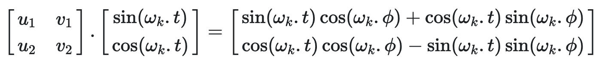
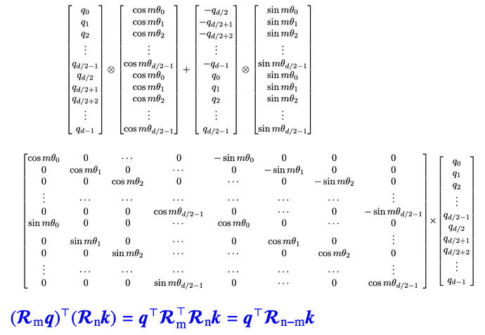

# LLM学习笔记-位置编码篇
* * *

created: 2025-01-24T00:20 updated: 2025-01-26T02:18
---------------------------------------------------

> _**作者: 老张哈哈哈**_
> 
> _**原文:**_ [_**https://www.cnblogs.com/laozhanghahaha/p/18303726**_](https://www.cnblogs.com/laozhanghahaha/p/18303726)

在Transformer模型中,位置编码(Positional Encoding)的引入是为了补充自注意力机制(Self-Attention)在捕捉序列位置信息方面的不足.自注意力机制是Transformer的核心,但它对输入序列的位置信息并不敏感.具体来说,Transformer模型对输入序列中的每个元素进行处理时是并行的,而不是像传统的循环神经网络(RNN)那样按顺序处理.因此,如果没有位置信息,Transformer模型无法区分序列中元素的先后顺序.  
**位置编码的主要作用如下**:

*   提供位置信息: 位置编码为每个序列元素提供其在序列中的位置,使得模型可以识别和区分序列中不同位置的元素.
*   增强模型的表达能力: 通过加入位置编码,模型不仅可以学习元素的内容信息,还可以学习元素的位置信息,从而更好地捕捉序列中的依赖关系和模式.
*   与自注意力机制结合: 位置编码与自注意力机制结合,使得模型能够同时关注到序列中元素的相对位置和全局上下文信息,这对于处理长距离依赖和全局信息非常重要.

**为什么不直接用token的索引作为它的位置编码？**

*   因为序列长度是可变的,因此token的索引也随之变化,当句子非常长的时候索引也会变的非常大.此外直接用索引作为位置编码会损害模型的泛化能力,即缺乏处理没见过的长度的能力.
*   用normalize把索引归一化到0-1之间会产生另一个问题.同一个归一化的值,比如0.1, 在不同长度的序列中表示的位置不同,这就会导致不同长度序列中,第m个token与第n个token的相对距离是变化的,这不利于绝对位置和相对位置的计算.

**理想情况下,位置编码应满足以下条件**

*   为每个时间步骤(单词在句子中的位置)输出唯一的编码.
*   任何两个时间步骤之间的距离在不同长度的句子之间应该是一致的.
*   我们的模型应该方便地推广到更长的句子.它的值应该是有界的.
*   它必须是确定性的.

基于以上原因我们采取其他方法进行位置编码.在本篇文章中,我会主要介绍Transformer结构模型中常见的位置编码,主要包括固定位置编码、可学习位置编码和旋转位置编码RoPE.

[固定位置编码](https://www.cnblogs.com/laozhanghahaha/p/18303726##%E5%9B%BA%E5%AE%9A%E4%BD%8D%E7%BD%AE%E7%BC%96%E7%A0%81)  
[可学习位置编码](https://www.cnblogs.com/laozhanghahaha/p/18303726##%E5%8F%AF%E5%AD%A6%E4%B9%A0%E4%BD%8D%E7%BD%AE%E7%BC%96%E7%A0%81)  
[旋转位置编码](https://www.cnblogs.com/laozhanghahaha/p/18303726##%E6%97%8B%E8%BD%AC%E4%BD%8D%E7%BD%AE%E7%BC%96%E7%A0%81)

\>固定位置编码
--------

### \>Transformer论文中用到的固定位置编码

其形式为  


pos是位置,i是维度索引,d\_model是嵌入总维度.每个维度的位置编码都对应一个正弦波,波长从2π到10000 · 2π,对应的频率从高频到低频.你可以把这个位置编码想象成一个包含d\_model/2对的sin和cos向量, 每一对sin和cos都对应一个频率.

这里我解释一下波长和频率的计算,后边的旋转矩阵会用到.

对于一个正弦函数, y = Asin(Bx + C) + D. 其波长为λ=2π/|B| 和周期计算一样,为从一个最高点到下一个最高点的距离. 频率与波长成反比关系.波长越长,变化越慢,即频率越低.回到我们的位置编码,从位置编码公式中我们不难得出,波长的计算和  有关.

*   对于较小的 i,分母较小,波长较短, 频率较高,当i=0时, 波长为2π, 频率为1/2π.这意味着正弦和余弦函数的变化较快.
*   对于较大的 i,分母较大,波长较长, 频率较低,当i=d/2时, 波长为10000 · 2π,频率为1/(10000 · 2π).这意味着正弦和余弦函数的变化较慢.

### \>位置编码python实现

```text-plain
def sinusoidal_pos_embedding(seq_length, d_model, base):
    sin_cos_val = np.power(base,  2 * (np.arange(d_model) // 2) / d_model)
    pos_embed = np.zeros((seq_length, d_model))
    for k in range(seq_length):
        pos_embed[k, 0::2] = np.sin(k/sin_cos_val)
        pos_embed[k, 1::2] = np.cos(k/sin_cos_val)
    return pos_embed

P = sinusoidal_pos_embedding(seq_length=100, d_model=512, base=10000)
cax = plt.matshow(P)
plt.gcf().colorbar(cax)
plt.savefig('sinusoidal.png')
```

得到  


从图中可以看出,当维度较低时,频率高变化快,随着维度增大,频率变低.相邻两个token的位置编码的差异主要在左边低维度部分,即高频部分.

### \>相对位置编码

选用正弦编码的另一个原因是因为它可以方便计算相对位置编码,原文如下

We chose this function because we hypothesized it would allow the model to easily learn to attend by relative positions, since for any fixed offset k, PEpos+k can be represented as a linear function of PEpos

对于每一个频率为ωk的sine-cosine对,都有一个线性变换矩阵 满足以下等式  


#### \>证明

M为一个2✖️2矩阵,我们想要找到一组u1, v1, u2, v2使得  
  
利用三角函数知识sin(a+b) = sin(a)cos(b)+cos(a)sin(b), cos(a+b) = cos(a)cos(b)-sin(a)sin(b), 展开右边的式子可得  
  
即  
  
求解这个等式得到  
  
线性变换矩阵M为  
  
从M的表达式可以看出,变换矩阵M和t无关,感兴趣的同学会发现M矩阵和[旋转矩阵](https://en.wikipedia.org/wiki/Rotation_matrix)有点相似.因此我们可以通过一对正弦-余弦,M,将位置编码pt+ϕ 表示为位置编码pt 的线性函数,其中任意偏移量为 ϕ.此属性使模型能够轻松学习通过相对位置进行关注.

### \>为什么使用正弦位置编码

1.  sin、cos值在\[-1, 1\]之间,保证了位置编码矩阵的每个值都处于一个稳定范围
2.  每个位置的位置编码都是唯一的,这有利于绝对位置编码
3.  不同位置之间的位置编码也可以进行计算, 这有利于相对位置计算
4.  正弦位置编码具备远程衰减性,即随着两个token间距离的增大,这两个token的位置编码的内积会变小.这是符合直觉的,一般来说距离越远的两个token,关联性也就越小

\>可学习位置编码
---------

与固定的位置编码不同,学习的位置嵌入是通过训练模型来学习的.这种方法的基本思想是为每个位置创建一个可训练的嵌入向量,并在训练过程中更新这些向量.

实现方式

*   初始化嵌入矩阵: 为每个位置初始化一个嵌入向量.例如,如果序列长度是 seq\_length,嵌入维度是 d\_model,那么初始化的嵌入矩阵大小将是 \[seq\_length, d\_model\].
*   学习嵌入向量: 在模型训练过程中,这些嵌入向量会像其他模型参数一样被优化.
*   应用嵌入向量: 在将嵌入向量输入到模型中时,将输入序列中的每个位置映射到其对应的嵌入向量.例如,如果输入序列是 \[token1, token2, ..., tokenN\],则位置嵌入是 \[pos\_embedding1, pos\_embedding2, ..., pos\_embeddingN\].

### \>可学习位置编码的python实现

```text-plain
import torch
import torch.nn as nn

class LearnedPositionEmbedding:
    def __init__(self, seq_length, d_model):
        super(LearnedPositionEmbedding, self).__init__()
        self.position_embedding = nn.Embedding(seq_length, d_model)
    def forward(inputs_id):
        positions = torch.range(0, inputs_id.size(1),dtype=torch.long, device=inputs_id.device)
        positions = positions.unsqueeze(0).expand_as(inputs_id)
        position_embedding = self.position_embedding(positions)
        return position_embedding
```

### \>可学习位置编码的优缺点

#### \>优点

*   灵活性: 学习的位置嵌入可以根据任务和数据的不同而自动调整,而不是依赖于固定的数学函数.
*   适应性: 这种方法允许模型更好地适应特定任务中的位置模式.

#### \>缺点

*   序列长度的限制: 可学习位置嵌入通常需要预先定义一个最大序列长度(max length).如果输入序列长度超过了这个预定义的最大长度,模型就无法处理这些超长序列,因为没有为这些超长序列的位置预留嵌入向量
*   计算和存储开销: 了支持较长的序列,可学习位置嵌入需要存储更多的嵌入向量,这会增加模型的参数数量,从而增加计算和存储的开销.对于特别长的序列,这个问题会更加突出.
*   泛化能力有限: 可学习位置嵌入在训练时只能学习到固定范围内位置的嵌入.如果在推理阶段遇到比训练时更长的序列,模型可能无法很好地泛化到这些新的位置.因此,可学习位置嵌入在处理未见过的长序列时可能表现不佳.

\>旋转位置编码
--------

旋转位置编码提出的出发点在于用绝对位置表示相对位置.回想一下transformer结构中query, key, value(下文用q、k、v表示)的计算  
  
xm表示m位置处的词嵌入.q、k、v在计算时考虑到了token的绝对位置信息m、n.计算q、k的内积得到注意力权重,再与v 计算加权得到最终结果.一种常见的把位置信息添加到q、k、v中的方法是将位置编码与词嵌入直接相加  
  
其中位置编码可以通过训练的方式获得,也可以直接采用正余弦位置编码

### \>目的

虽然q、k计算时用到了绝对位置编码,但是我们希望两者的内积结果能包含相对位置信息,即我们希望得到如下等式  


#### \>求解

首先我们先把场景限制在2维.利用向量在二维平面的几何性质和他的复数形式,我们可以得到表达式  
  
fq、fk可以进一步表达为矩阵相乘的方式  
  
其中右边第一项为旋转矩阵.

进一步的,我们把2维表达式推广到d维, d为偶数.我们把d维分成d/2个子空间,整理得到如下表达式  
  
其中,右边第一项即为旋转位置编码  
  
我们可以得到  


从以上表达式我们可以看出,通过将**q, k乘上包含绝对位置信息的旋转位置编码,得到了包含相对位置信息的内积结果**.由于旋转位置编码过于稀疏会导致算力浪费,在实际应用中我们并不采用上述形式,而是采用如下计算形式  


### \>旋转位置编码的python实现

```text-plain
class sinusoidalPositionalEmbedding(nn.Embedding):
    def __init__(self, d_model, max_position_embedding, device=None):
        super().__init__()
        self.inv_freq = 1 / (10000(torch.arange(0, d_model, 2).float().to(device) / d_model))
        self.max_seq_length = max_position_embedding

        pos = torch.arange(0, self.max_seq _length, device=self.inv_freq.device, dtype=self.inv_freq.dtype)
        freq = torch.enisum('i,j->ij', pos, self.inv_freq) 
        emb = torch.cat((freq, freq), -1)
        dtype = torch.get_default
        self.cos = embed.cos()[None, None, :, :].to(dtype)
        self.sin = embed.sin()[None, None, :, :].to(dtype)
    def forward(self, x, seq_length=None):
        if seq_length > self.max_seq_length:
            self.max_seq_length = seq_length
            pos = torch.arange(0, self.max_seq _length, device=x.device, dtype=self.inv_freq.dtype)
            freq = torch.enisum('i,j->ij', pos, self.inv_freq) 
            emb = torch.cat((freq, freq), -1)
            self.cos = embed.cos()[None, None, :, :].to(x.dtype)
            self.sin = embed.sin()[None, None, :, :].to(x.dtype)
        return (self.cos[:, :, :seq_length, ...].to(x.dtype),
                  self.sin[:, :, :seq_length, ...].to(x.dtype))
   
def rotate_half(x):
    x1 = x[:, :x.shape[-1]//2]
    x2 = x[:, x.shape[-1]//2:]
    return torch.cat((-x2, x1), dim = -1)

def apply_rotraty_pos_embedding(q, k, cos, sin,position_ids):
    # The first two dimensions of cos and sin are always 1, so we can `squeeze` them.
    cos = cos.squeeze(1).squeeze(0)  # [seq_len, dim]
    sin = sin.squeeze(1).squeeze(0)  # [seq_len, dim]
    cos = cos[position_ids].unsqueeze(1)  # [bs, 1, seq_len, dim]
    sin = sin[position_ids].unsqueeze(1)  # [bs, 1, seq_len, dim]
    q_embed = q * cos + rotate_half(q) * sin
    k_embed = k * cos + rotate_half(k) * sin    
    return q_embed, k_embed
```

要注意的一点是,上述实现是参考llama3中的rope实现,而不是原始roformer中rope的实现.llama3中rope的实现参考以下矩阵计算,这也是一种正确的旋转矩阵编码.实际上只要我们的矩阵R满足下图中蓝色的等式,那它就是旋转矩阵的一种有效形式.但要注意在训练和推理时使用相同的形式.  


### \>为什么要用旋转位置编码

*   更好的理解序列信息: 通过利用绝对位置表示相对位置,更好的捕捉到了token间的信息,帮助模型更好的理解和处理不同长度的序列
*   具备远程衰减性: 根据[《Attention Is All You Need》](https://arxiv.org/pdf/1706.03762)论文中提出的,RoPE也进行如下设置θi=  这种设置具备远程衰减性,即内积结果会随着相对位置的增加而减少.此属性与直觉相一致: 相对距离较长的一对token应该具有较少的相关性
*   兼容性强RoPE编码可以很容易地集成到现有的模型架构中,特别是基于Transformer的模型.其设计简单,不需要对模型架构做大的改动,从而方便了模型的升级和优化.

ref:  
[Attention Is All You Need](https://arxiv.org/pdf/1706.03762)  
[Fixed Positional Embeddings](https://cyrilzakka.github.io/llm-playbook/nested/fixed-pos-embed.html)  
[A Gentle Introduction to Positional Encoding in Transformer Models, Part 1](https://machinelearningmastery.com/a-gentle-introduction-to-positional-encoding-in-transformer-models-part-1/)  
[Transformer Architecture: The Positional Encoding](https://kazemnejad.com/blog/transformer_architecture_positional_encoding/)  
[ROFORMER: ENHANCED TRANSFORMER WITH ROTARY POSITION EMBEDDING](https://arxiv.org/pdf/2104.09864)