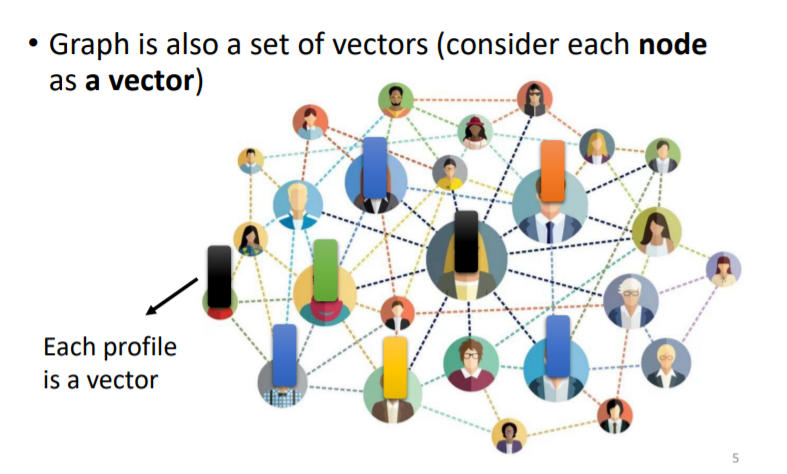
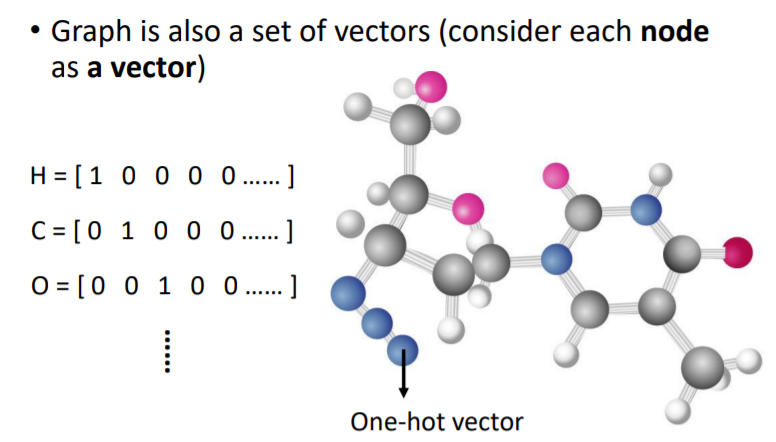
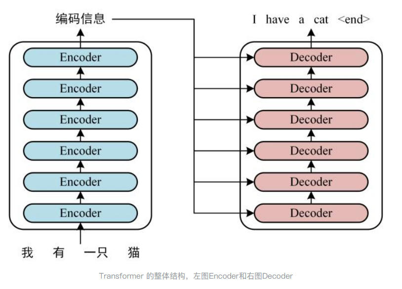

# 已完结 从Attention到Transformer
> _来源于李宏毅机器学习课程_ 
> 
> _PDF:_ [_**https://speech.ee.ntu.edu.tw/~hylee/ml/ml2021-course-data/self\_v7.pdf**_](https://speech.ee.ntu.edu.tw/~hylee/ml/ml2021-course-data/self_v7.pdf)
> 
> _**等记完笔记一定要把它的图重新画一遍**_
> 
> [_**https://www.zhihu.com/question/341222779/answer/2304884017**_](https://www.zhihu.com/question/341222779/answer/2304884017)

前置知识
----

模型的输入
-----

### 单向量输入

比较简单的问题是输入输出都是单向量,这样一个 简单的 Model 就可以解决


### 多向量输入

但当问题比较复杂,变成多个向量,且向量的数量不定


假设任务是文字处理,用向量表示每一个单词


最简单的编码方式就是 one-hot,即每个单词对应一个向量,那这就丢失了语义


> word embedding 是带语义的编码方式([了解原理](https://www.youtube.com/watch?v=X7PH3NuYW0Q))

在语音识别中会将语音输入以 宽度为 25ms,步长为 10ms 的窗口转化成向量组(至于为什么是 25ms 和 10ms,别问,就是古圣先贤帮你调整好的)


在图相关的任务(例如社交网络以及分子等...)中,是将每一个节点当作向量,采用 one-hot 编码的形式



模型的输出
-----

模型的输出有三种可能

### 输入输出的向量数量一样

由于输入输出的向量数量一样,也就是每一个向量都有一个输出,任务会比较简单,比如词性标注(POS tagging),语音识别,Graph 网络


### 多输入单输出


### 输出数量未知 也就是 seq2seq 任务

典型场景: 翻译,语音辨识

*   方案 1 逐一击破

各个击破向量,给每一个向量都配一个模型,然后得到一个输出


存在的问题是,两个 saw 所代表的意义是不同的,但是对于相同的 FC 它是没办法区分的

那么用一个窗口把前后几个都考虑进来不就好了,对 没错就是方案 2

*   方案 2 滑动窗口

用窗口将前后几个的向量都框起来


但这个方案依旧有问题,如果想做到效果最好就要框住整个输出,那还得统计输入多大,ok 统计就统计问题也不大,那你这个 FC 得多大,运算量直接上天,所以有了方案 3,千呼万唤始出来 **Self-Attention 机制**

*   方案 3 **Self-Attention 机制**

可以算是结合了方案 1 和方案 2,去除了缺点,留下了优点


Self-Attention 模块会读取整个输入向量组的信息,为向量 A 计算出一个考虑整个输入向量组的 A',然后就可以用用方案 1 了

这也就是为什么说方案 3 是结合了方案 1 和方案 2

> 说向量真不如说 Vector 顺口,可能就是翻译的不够好

当然 Self-Attention 可以重复使用(人工智能本质是套娃)

最有名的文章就是以 Attention 机制为核心 Module 的 Tranformer 模型 《[Attention Is All You Need](https://arxiv.org/abs/1706.03762)》


Transformer 详解
--------------

Transformer 是一个 seq2seq 问题的解决方案

Transformer 的整体结构
-----------------

Transformer 的核心思想是通过自注意力机制捕捉输入序列中的全局依赖关系,避免了传统 RNN 的序列计算瓶颈.其整体结构包括:

*   **编码器(Encoder)**: 将输入序列映射为一系列隐藏表示.
*   **解码器(Decoder)**: 根据编码器的输出和已生成的部分输出序列,逐步生成目标序列.

### 1\. Encoder 的编码过程

Encoder 的职责是将输入序列(如一句话)编码为一个固定维度的上下文向量(或一组向量).假设输入序列为 $X={x\_{1}, x\_{2},\\dots,x\_{T}}$ ,其中 $x\_{i}$是输入序列中的第 i 个 token(如汉字).

### **编码过程**

1.  **Token 嵌入**:  
    将每个 token $x\_i$ 映射为一个固定维度的词向量 $e\_i ：e\_i = \\text{Embedding}(x\_i)$

其中,Embedding 是一个词嵌入矩阵,将每个 token 映射为向量.

1.  **上下文编码**:  
    使用 RNN、LSTM、GRU 或 Transformer 等模型对词向量序列 {$e\_1, e\_2, \\dots, e\_T$} 进行编码,生成上下文向量 $h ：h = \\text{Encoder}(e\_1, e\_2, \\dots, e\_T)$

其中, $h$可以是单个向量(如 RNN 的最后一个隐藏状态)或一组向量(如 Transformer 的输出).

### 2\. Decoder 的解码过程

Decoder 的职责是基于 Encoder 提供的上下文信息 h ,逐步生成输出序列 $Y = {y\_1, y\_2, \\dots, y\_{t}}$ .每个输出 $y\_{t}$ 是一个向量,其维度与词库的大小相同,表示每个 token 的概率分布.

### **解码过程**

1.  **初始输入**:  
    Decoder 的初始输入通常是起始 token start 和 Encoder 的上下文向量 h .
2.  **逐步生成**:  
    对于每一步 $t$ ,Decoder 生成一个输出向量 $y\_t ：y\_t = \\text{Decoder}(h, y\_{t-1})$

其中:

*   $h$: Encoder 的上下文向量
*   $y\_{t-1}$: 上一步生成的 token（或初始的 `<start>` token）
*   $y\_t$: 当前步的输出向量

1.  **输出向量**  
    输出向量 $y\_t$的维度与词库大小相同，表示每个 token 的概率分布。例如，如果词库包含 5000 个汉字，则 $y\_t$是一个 5000 维的向量，每个元素表示对应汉字的概率。
2.  **Token 选择**  
    根据输出向量 $y\_t$，选择概率最高的 token 作为当前步的输出： $\\text{token}\_t = \\arg\\max(y\_t)$
3.  **重复生成**  
    将当前步生成的 token 作为下一步的输入，重复上述过程，直到生成结束 token `<end>`。



Attention 机制
------------

### How Attention Works？


第一步,以 $a^{1}$为例,计算出$a^{2}$$a^{3}$$a^{4}$与$a^{1}$的相关系数 $\\alpha$,有很多计算方法,Transformer 中用的是 Dot-Product

$Dot-Product: \\alpha\_{1,4}=f(a^{1},a^{4})=a^{1}·W^{q} × a^{4}·W^{k}=q^{1}×k^{4}$


上图公式 markdown 代码

\\begin{align}

& a\_{1,1}=q^{1}k^{1}, a\_{1,2}=q^{1}k^{2}, a\_{1,3}=q^{1}k^{3}, a\_{1,4}=q^{1}k^{4}\\\\

& a\_{1,i}^{\\prime} = Softmax(a\_{1,1})= \\frac{(a\_{1,i})}{\\sum\_{j=1}^{4}\\exp(a\_{1,j})}\\\\

& b^{1}=\\sum\_{i=1}^{4}a\_{1,i}^{\\prime} \* v^{i}

\\end{align}

$q,k,v$ 分别代表 Query(查询)、Key(键) 和 Value(值).它们是通过对输入进行线性变换得到的,具有明确的物理意义,共同决定了注意力机制如何聚焦于输入的不同部分.

> 为什么$q^{1}k^{1}$如此重要？

> 为什么要用 Softmax？ 别的激活函数也可以,Relu 等等

#### 矩阵形式的 Self-Attention


A 是注意力分数矩阵,A' 是 Softmax 归一化后的注意力权重矩阵,O 是输出矩阵,I是输入矩阵.

其中 $W^q, W^k$是需要通过训练学习的,没有其他参数需要学习

公式图片对应的 markdown 代码，直接放代码语雀渲染起来太慢了... 页面一卡一卡的

```text-plain
\begin{align}
& 令I=[a^1,a^2,a^3,a^4]则有 \\
& Q = [q^1; q^2; q^3; q^4]=W^q * I=W^q * [a^1,a^2,a^3,a^4] 是 Query 矩阵\\
& K = [k^1; k^2; k^3; k^4]=W^k * I=W^k*[a^1,a^2,a^3,a^4] 是 Key 矩阵\\
& V = [v^1; v^2; v^3; v^4] \\

& A = \frac{K^T Q} {\sqrt{d_k}} = \begin{bmatrix}
k^1 \
k^2 \
k^3 \
k^4 \
\end{bmatrix} 
[q^1,q^2,q^3,q^4]
/\sqrt{d_k}
\begin{bmatrix}
a_{1,1} & a_{1,2} & a_{1,3} & a_{1,4} \
a_{2,1} & a_{2,2} & a_{2,3} & a_{2,4} \
a_{3,1} & a_{3,2} & a_{3,3} & a_{3,4} \
a_{4,1} & a_{4,2} & a_{4,3} & a_{4,4} \
\end{bmatrix} /\sqrt{d_k} \
& A' = \text{Softmax}(A), \
& O = A'V = \begin{bmatrix}
a^{\prime}{1,1} & a^{\prime}{1,2} & a^{\prime}{1,3} & a^{\prime}{1,4} \
a^{\prime}{2,1} & a^{\prime}{2,2} & a^{\prime}{2,3} & a^{\prime}{2,4} \
a^{\prime}{3,1} & a^{\prime}{3,2} & a^{\prime}{3,3} & a^{\prime}{3,4} \
a^{\prime}{4,1} & a^{\prime}{4,2} & a^{\prime}{4,3} & a^{\prime}{4,4} \
\end{bmatrix} [v^1,v^2,v^3,v^4]=[b^1,b^2,b^3,b^4]\
& b^i = a^{\prime}{i,1}v^i+a^{\prime}{i,2}v^i+a^{\prime}{i,3}v^i+a^{\prime}{i,4}v^i\
\end{align}
```

### 多头注意力机制

> 为什么需要多的 Head 呢？
> 
> 这涉及到 QKV 三个矩阵的物理意义,Q 矩阵是表示相关性的,但相关性有很多种定义,可以认为多头注意力可以表示更清晰的相关性


其实多头注意力可以认为是相同的 输入用 两个$W^{k,1},W^{q,1};W^{k,2},W^{q,2}$矩阵得到两个输出再进行数据处理.将$\[q^{i,1},q^{i,2}\]=\[T^{i,1},T^{i,2}\]将q^{i,1}视作新的q^i即可$,也就是

$b^i=W^O \\begin{bmatrix}b^{i,1}\\b^{i,2}\\end{bmatrix}$,就是多了一个 $W^O$这个需要学习的参数矩阵罢了

但是,上面的下标 1234 只是为了方便教学加上去的,对于 Self-Attention 来说$\[a^1,a^2,a^3,a^4\]$并没有任何的区别,也就是缺少**位置信息,但是位置信息有时又特别有用,例如在翻译的时候动词是不太可能出现在句首的,如果缺失位置信息则会影响模型效果**

解决方法是 Positional Encoding,但是这个$e^i$是人类决定的(hand crafted),如果只编码到 128,当输入序列长度是 129 的时候就有问题

Transformer 中的 Positional Encoding 是通过 sin,cos 函数来确定的(~**别问为什么,问就是古圣先贤试出来的**~),聪明的你☞也可以提出自己的方法(当然这应该是数学专业的事情) 下面这篇论文是讲 Positional Encoding 的

[Learning to Encode Position for Transformer with Continuous Dynamical Model](https://arxiv.org/abs/2003.09229)


Positional Encoding 是如何参与到注意力机制的计算中的？

通过直接将位置信息$e^i$与$a^i$相加

### Self-Attention 的应用

#### 语言模型: Transformer ,[BERT](https://arxiv.org/abs/1810.04805)

#### 语音识别

由于前面说的将语音转化成向量的窗口长度为 25ms,步长为 10ms,那么 10s 的语音就会有 L=1000 个向量

而对于一个长度为$n$的序列,序列中向量的嵌入维度(维数)是$d$Self-Attention 机制需要 $O(n^2_d+n_d^2)$的时间复杂度和$O(n^2+n\*d)$的空间复杂度()


#### 图像处理


#### Self-Attention vs CNN

CNN 其实只是一个简化版的 Self-Attention.

[On the Relationship between Self-Attention and Convolutional Layers](https://arxiv.org/abs/1911.03584)

CNN 适合小数据量(10M,一千万张,神尼玛的小资料量),Self-Attention 适合大数据量 [https://arxiv.org/pdf/2010.11929](https://arxiv.org/pdf/2010.11929)


#### Self-Attention vs RNN

1.  RNN 其实就是一个串行的 Self-Attention 机制
2.  RNN 只考虑已经输入的序列,Self-Attention 是考虑了序列前后的所有内容,但是 RNN 其实可以是双向的,所以这只能算是一个小差别
3.  RNN 需要更大的内存

RNN 相关内容详见 [https://www.youtube.com/watch?v=xCGidAeyS4M](https://www.youtube.com/watch?v=xCGidAeyS4M)


[Transformers are RNNs: Fast Autoregressive Transformers with Linear Attention](https://arxiv.org/abs/2006.16236)

#### for Graph

Self-Attention 也可以做知识图谱,Attention Matrix 其实是一个邻接矩阵(涉及到图论的知识),就变成了一种 GNN(详见课程[https://www.youtube.com/watch?v=eybCCtNKwzA&feature=youtu.be](https://www.youtube.com/watch?v=eybCCtNKwzA&feature=youtu.be))


### Self-Attention 的改进

[Long Range Arena: A Benchmark for Efficient Transformers](https://arxiv.org/abs/2011.04006)


为了降低Self-Attention的时间和空间复杂度,研究者提出了多种优化方法,主要包括:

*   **稀疏注意力(Sparse Attention)**:  
    只计算部分位置的注意力分数,减少 $n^2$的计算量和存储量.例如,Longformer和BigBird.
*   **局部注意力(Local Attention)**:  
    限制每个位置只关注其邻近区域,而不是整个序列.例如,Sliding Window Attention.
*   **低秩近似(Low-Rank Approximation)**:  
    将注意力矩阵分解为低秩矩阵,减少计算量和存储量.例如,Linformer.
*   **分块计算(Chunking)**:  
    将序列分成若干块,分别计算注意力.例如,Reformer.
*   **线性注意力(Linear Attention)**:  
    通过数学变换将注意力计算复杂度从 $O(n^2)$降低到 $O(n)$.例如,Performer.

由于计算量减少,加快了速度.效果自然也会打折扣,需要做平衡,正所谓 **阴阳相济,取舍有度**

[Efficient Transformers: A Survey](https://arxiv.org/abs/2009.06732)

Encoder of Transformer
----------------------

Transformer 的 Encoder 结构如下,在进行位置编码后的输入重复输入 Block ,使得 Encoder 变成一个**深度神经网络**


Block 中的 Multi-Head Attention 在前面讲过,那么 Block 里面的 Add 和 Norm 是什么呢？其实就是 ResNet 和 Layer Normalization

  
danger

### 梯度消失与梯度爆炸问题

在**深度神经网络**中,随着网络层数的增加,梯度在反向传播过程中会不断相乘.如果这些梯度值小于1,多次相乘后梯度会趋近于0,导致**梯度消失**；如果梯度值大于1,多次相乘后梯度会急剧增大,导致**梯度爆炸**.这两个问题都会使模型难以训练.

### ResNet 的解决方案

何恺明提出的 **ResNet(Residual Network)** 通过引入 **残差连接(Residual Connection)** 有效缓解了梯度消失和梯度爆炸问题.其核心思想是:

*   传统的神经网络层直接学习目标映射$H(x) $.
*   ResNet 改为学习残差映射 $F(x) = H(x) - x$,最终的输出为 $H(x) = F(x) + x$.
*   这种结构使得网络更容易学习恒等映射,即使深层网络的梯度也能有效传播.

[Deep Residual Learning for Image Recognition](https://ieeexplore.ieee.org/document/7780459)

### Layer Normalization

[LN 和 BN 有什么区别](https://www.yuque.com/lebornyuan/llm/is1dty15r9gxqs0s)

对每个样本 ( n ),在特征维度 ( C, H, W ) 上计算均值和方差:

$\\mu\_n = \\frac{1}{C \\cdot H \\cdot W} \\sum\_{c=1}^{C} \\sum\_{h=1}^{H} \\sum\_{w=1}^{W} X\_{n, c, h, w}$

$\\sigma\_n^2 = \\frac{1}{C \\cdot H \\cdot W} \\sum\_{c=1}^{C} \\sum\_{h=1}^{H} \\sum\_{w=1}^{W} (X\_{n, c, h, w} - \\mu\_n)^2$

$\\hat{X}_{n,c,h,w} = \\frac{X_{n,c,h,w} - \\mu\_{n}}{\\sqrt{\\sigma\_{n}^{2} + \\epsilon}}$

图就是 Transformer Encoder 的一个基础模块 .

在 Self-Attention 模块的输出上加上对应位置的输入本身(Resnet 真是一个天才的设计),然后对每一个结合后的输出做 Layer Normalization([LN 和 BN 有什么区别](https://www.yuque.com/lebornyuan/llm/is1dty15r9gxqs0s))

> BERT 其实就是 Transformer 的 Encoder

1.  **为什么 Layer Normalization 放在那个地方？**

这篇论文给你答案 [On Layer Normalization in the Transformer Architecture](https://arxiv.org/abs/2002.04745)

右图(a) 为原始的 transformer 的设计,但它并不一定是最优设计

右图(b) 为论文中的设计

1.  **为什么是Layer Normalization ？**

[PowerNorm: Rethinking Batch Normalization in Transformers](https://arxiv.org/abs/2003.07845)解答了为什么 BN 不如 LN,提出一个 Power Normalization


Decoder
-------

### 两种 Decoder

在机器学习和深度学习中,**Decoder** 是生成模型或序列到序列(Seq2Seq)模型的重要组成部分,用于将编码后的信息解码为目标输出.根据应用场景和模型结构的不同,Decoder 可以分为两种主要类型:

#### 1\. 自回归 Decoder(Autoregressive Decoder)

自回归 Decoder 是一种逐步生成输出的解码器,每次生成一个 token(如单词、字符或像素),并将前一步的输出作为下一步的输入.这种 Decoder 常用于序列生成任务,如机器翻译、文本生成和语音合成.

**特点**

*   **逐步生成**: 每次生成一个 token,依赖于之前生成的 token.
*   **递归结构**: 通常使用循环神经网络(RNN)、长短期记忆网络(LSTM)或 Transformer 的自回归机制.
*   **应用场景**:
    *   机器翻译(如 Seq2Seq 模型)
    *   文本生成(如 GPT 系列模型)
    *   语音合成(如 Tacotron)

**公式**

假设 Decoder 的输入是编码器的输出 $h$ 和上一步生成的 token ($y\_{t-1}$),则第 (t) $步的输出为:y\_t = \\text{Decoder}(h, y\_{t-1})$ 其中:

$h$是编码器的输出(上下文向量)； $y\_{t-1}$是上一步生成的 token； $y\_t$是当前步生成的 token.

**示例**

在机器翻译中,Decoder 逐步生成目标语言的句子:

1.  输入: 编码器的输出$h$和起始 token `<start>`.
2.  输出: 第一个单词$y\_1$.
3.  将$y\_1$作为下一步的输入,生成第二个单词$y\_2$
4.  重复直到生成结束 token `<end>`.

#### 2\. 非自回归 Decoder(Non-Autoregressive Decoder)

非自回归 Decoder 是一种并行生成输出的解码器,一次性生成所有 token,而不依赖于前一步的输出.这种 Decoder 通常用于加速生成过程,但可能会牺牲一定的生成质量.

**特点**

*   **并行生成**: 一次性生成所有 token,不依赖于前一步的输出.
*   **高效性**: 生成速度比自回归 Decoder 快,适合实时应用.
*   **应用场景**:
    *   实时机器翻译(如 Non-Autoregressive Transformer, NAT)
    *   图像生成(如 GAN 中的生成器)
    *   语音合成(如 Parallel WaveGAN)

**公式**

假设 Decoder 的输入是编码器的输出$h$,则一次性生成所有 token:$Y = \\text{Decoder}(h)$ 其中:

$h$是编码器的输出(上下文向量)； $Y = {y\_1, y\_2, \\dots, y\_T}$是生成的完整序列.

**示例**

在非自回归机器翻译中,Decoder 一次性生成目标语言的句子:

1.  输入: 编码器的输出$h$
2.  输出: 完整的翻译句子$Y = {y\_1, y\_2, \\dots, y\_T}$

#### 自回归 Decoder 与非自回归 Decoder 的对比

| **特性** | **自回归 Decoder** | **非自回归 Decoder** |
| --- | --- | --- |
| **生成方式** | 逐步生成,依赖前一步输出 | 并行生成,不依赖前一步输出 |
| **生成速度** | 较慢  | 较快  |
| **生成质量** | 通常较高 | 可能较低 |
| **应用场景** | 机器翻译、文本生成、语音合成 | 实时翻译、图像生成、语音合成 |
| **模型复杂度** | 较高  | 较低  |
| **典型模型** | Seq2Seq、GPT、Tacotron | NAT、GAN、Parallel WaveGAN |

#### 选择 Decoder 的依据

1.  **任务需求**:
    *   如果需要高质量的生成结果,选择自回归 Decoder.
    *   如果需要快速生成,选择非自回归 Decoder.
2.  **计算资源**:
    *   自回归 Decoder 需要更多的计算资源和时间.
    *   非自回归 Decoder 更适合资源受限的场景.
3.  **实时性要求**:
    *   自回归 Decoder 适合非实时任务.
    *   非自回归 Decoder 适合实时任务.

Dncoder of Transformer - AT
---------------------------

Encoder将输入序列编码为一个上下文向量,Decoder 接受 Encoder 的输出后(通过 Cross-Attention 接受)基于此上下文向量生成目标序列.

在解码过程中,Decoder在每个时间步生成一个输出向量,该向量的维度等于词嵌入(embedding)的维度,而词嵌入的维度通常与词库(词汇表)的大小相关.

> 以中文为例,词库为每个汉字分配一个对应的词嵌入向量,向量的维度即为词嵌入空间的维度.

输出向量进行 $Softmax$ 之后,给每个字对应的位置一个 0-1 内的分数,分数最大的作为输出


Decoder 的结构比 Encoder 复杂一点,但其实如果 Decoder 去掉 Cross-Attention 的部分,他们是很像的

### Msked Multi-Head Attention

Decoder 中使用的是 **Masked Multi-Head Attention**,原来 Attention 机制要求每一个输出都考虑输入的全序列,MaskedAttention 要求只看左边的,不看右边的

例如 输出 $b^2$ 只看 $a^1, a^2$,忽略 $a^3, a^4$


为什么需要加 Mask？也很简单,因为在 Encoder 中,输入是一次给出的,$b^1$可以考虑$a^1, a^2, a^3, a^4$,但是 Decoder 的时候,$a^1, a^2, a^3, a^4$是依次由 Decoder 给出的,在计算$b^1$的时候只有$a^1$

* * *

由于下一时刻输出依赖于上一时刻的输出,就又出现一个问题了,输出几个向量呢？不知道！如果没有结束符他就一直不停了.我们是希望机器自主学习决定的

因此还需要加入一个结束符作为输出的结束标识.

所以,一个完整的翻译$ Input = \[机，器，学，习\]$的过程如下


完整的输出是$\[机，器，学，习，End\]$

上图公式的 markdown 代码

\\begin{align\*}

EncoderedInput &= Encoder(Embedding(Input)) \\\\

OutputPosition\_1 &= Decoder(EncoderedInput, Begin) \\\\

DecoderOuput\_1 &= Voc(max(Position)) = 机 \\\\

\\\\

OutputPosition\_2 &= Decoder(EncoderedInput, OutputPosition\_1 ) \\\\

DecoderOuput\_2 &= Voc(max(Position)) = 器 \\\\

\\\\

OutputPosition\_3 &= Decoder(EncoderedInput, OutputPosition\_1 , OutputPosition\_2) \\\\

DecoderOuput\_3 &= Voc(max(Position)) = 学 \\\\

\\\\

OutputPosition\_4 &= Decoder(EncoderedInput, OutputPosition\_1, ..., OutputPosition\_3) \\\\

DecoderOuput\_4 &= Voc(max(Position)) = 习 \\\\

\\\\

OutputPosition\_5 &= Decoder(EncoderedInput, OutputPosition\_1, ..., OutputPosition\_4) \\\\

DecoderOuput\_5 &= Voc(max(Position)) = End \\\\

\\end{align\*}  
 

\## AT VS NAT !\[\](https://cdn.nlark.com/yuque/0/2024/png/42982692/1735543692019-8103e2f0-54bb-4b84-8faf-e06cf3c5e387.png)

NAT 是给它一排 Begin 符号,一次性把整个句子输出.但是问题是**怎么知道给几个 Begin 符号呢？**

好问题！确实没法知道,下面是几个解决办法

1.  **训练一个分类器来决定输出的句子长度**
    *   **思路**: 在生成句子之前,先预测句子的长度.可以通过一个额外的分类器(例如一个神经网络)来实现,输入是源句子(或上下文),输出是目标句子的长度.
    *   **实现细节**:
        *   输入: 源句子(例如编码器的输出或上下文表示).
        *   输出: 目标句子的长度(通常是一个离散的类别,例如 1 到最大长度).
        *   训练: 可以使用交叉熵损失函数来训练这个分类器,目标长度可以从训练数据中获取.
    *   **优点**: 生成的句子长度更可控,避免了生成过长或过短的句子.
    *   **缺点**: 需要额外的模型和训练过程,增加了复杂性.
2.  **直接生成大量 Begin 符号,然后截取到 End**
    *   **思路**: 在生成时,直接生成一个固定数量的 Begin 符号(例如最大可能长度),然后通过模型生成句子,直到遇到 End 符号(例如 `<EOS>`)为止,截取到 End 符号的位置.
    *   **实现细节**:
        *   输入: 源句子(例如编码器的输出或上下文表示).
        *   输出: 一个固定长度的序列(例如最大长度),每个位置生成一个词或符号.
        *   截取: 生成过程中,遇到 `<End>` 符号时停止,截取到该位置.
    *   **优点**: 实现简单,不需要额外的模型.
    *   **缺点**: 可能会生成冗余的符号(例如超过实际句子长度的部分),浪费计算资源.
3.  **其他更专业的解决方案**
    *   **长度预测与生成联合训练**:
        *   将长度预测和句子生成联合训练,而不是单独训练一个分类器.例如,在损失函数中加入长度预测的损失.
    *   **动态长度调整**:
        *   在生成过程中动态调整长度.例如,使用启发式方法或基于概率的方法来决定何时停止生成.
    *   **基于 Transformer 的 NAT 模型**:
        *   一些 NAT 模型(例如 NAT with Fertility)通过预测每个源词对应的目标词数量(Fertility)来间接控制句子长度.
    *   **基于 CRF 的方法**:
        *   使用条件随机场(CRF)来建模句子长度和生成序列之间的关系.

Cross-Attention
---------------


*   **crossattention 和 普通attention有啥区别呢？**

**Cross-Attention** 和 **普通 Attention(Self-Attention)** 的核心计算机制是完全相同的,唯一的区别在于 Q、K、V 三个矩阵的来源.普通 Attention 它的 QKV 都来自同一段序列,**Cross-Attention** 的 KV 来自 Endocder 的输出,Q 来自 Masked Self-Attention 的输出


[Rethinking and Improving Natural Language Generation with Layer-Wise Multi-View Decoding](https://arxiv.org/abs/2005.08081)

Transformer 的 Traning
---------------------


希望输出的位置编码与 label 中的位置编码的交叉熵越小越好,所以问题就变成了

*   **Label**: $\\text{Label} = \[y\_1, y\_2, \\dots, y\_n\] $,表示目标序列的位置编码.
*   **Decoder 输出**: $Y = \[\\hat{y}\_1, \\hat{y}\_2, \\dots, \\hat{y}\_n\]$,表示 Decoder 生成的位置编码.
*   **目标**: 最小化 Decoder 输出 Y 与 Label 之间的交叉熵.

$Min(\\text{Cross-Entropy}(Y, \\text{Label})) = -\\sum\_{i=1}^n y\_i \\log(\\hat{y}\_i)$

> 其实这里和分类问题特别像

### **具体步骤**

1.  **Decoder 输出**: Decoder 生成的位置编码 $Y = \[\\hat{y}\_1, \\hat{y}\_2, \\dots, \\hat{y}\_n\]$.
2.  **Softmax 归一化**: 对 Decoder 的输出进行 Softmax 操作,将其转换为概率分布:$\\hat{y}\_i = \\text{Softmax}(\\hat{y}\_i)$
3.  **计算交叉熵**: 使用交叉熵公式计算 Decoder 输出与 Label 之间的差异:$\\text{Loss} = -\\sum\_{i=1}^n y\_i \\log(\\hat{y}\_i)$
4.  **反向传播与优化**: 通过反向传播计算梯度,并使用优化算法(如 SGD、Adam)更新模型参数,以最小化损失函数.

与上面说的不同,在训练时给 Decoder 的输入的不是 Decoder 给出的输出,而是**正确的结果**

一些碎碎念
-----

**在训练的时候是每一个 Decoder 的输出和正确的输出两个向量做交叉熵，但其实这样并不能保证整个句子的交叉熵是最小的(也就是局部最优与全局最优的区别)。或许可以通过增大 batchsize 来略微解决呢**

1.  硬给它通过 RL 去优化

将 Decoder 作为 Agent，将交叉熵损失函数 作为 Reward

[Sequence Level Training with Recurrent Neural Networks](https://arxiv.org/abs/1511.06732)

**如何解决这个训练与测试的时候给 Decoder 的输入是不同的这个问题呢？**

1.  **Scheduled Sampling**

在测试的时候给它一些错误的，但这个方法会伤害到 Transformer 并行化的能力

[Scheduled Sampling for Sequence Prediction with Recurrent Neural Networks](https://arxiv.org/abs/1506.03099)

[Scheduled Sampling for Transformers](https://arxiv.org/abs/1906.07651)

[Parallel Scheduled Sampling](https://arxiv.org/abs/1906.04331)

