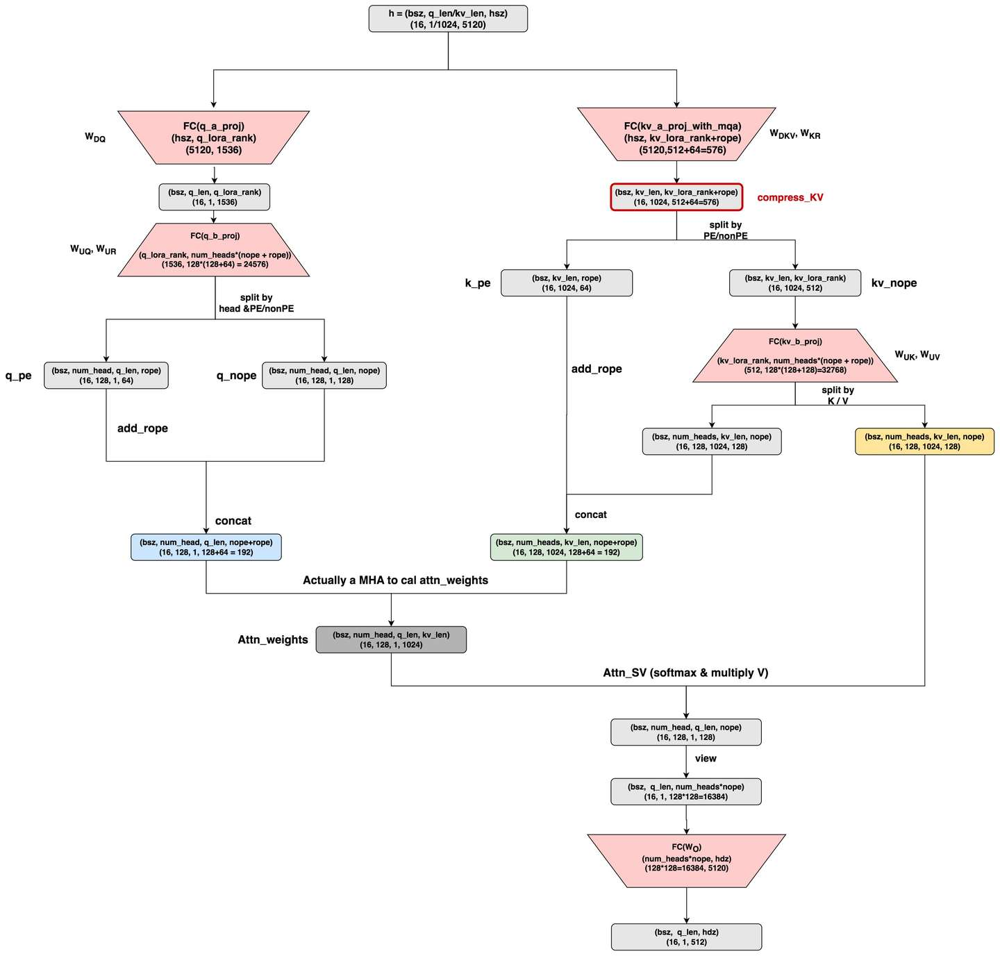
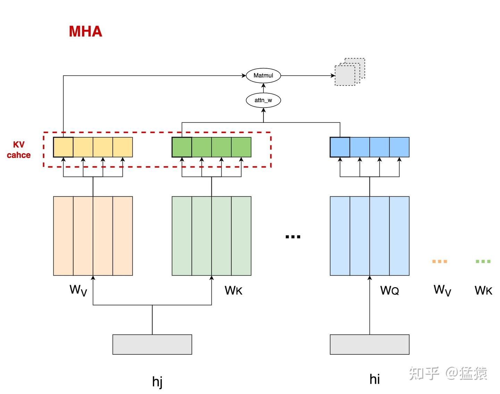
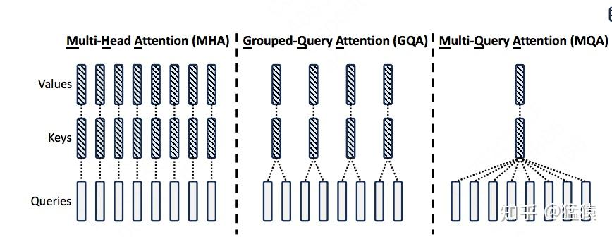
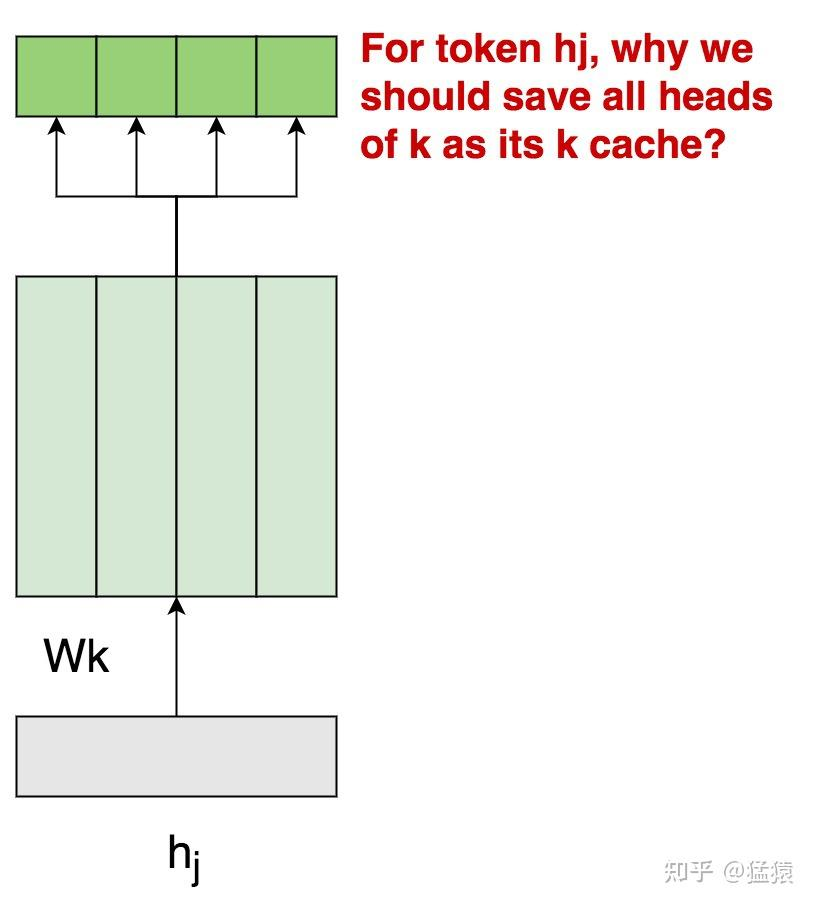
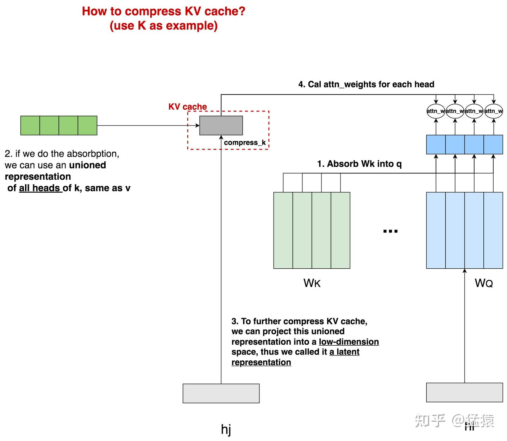
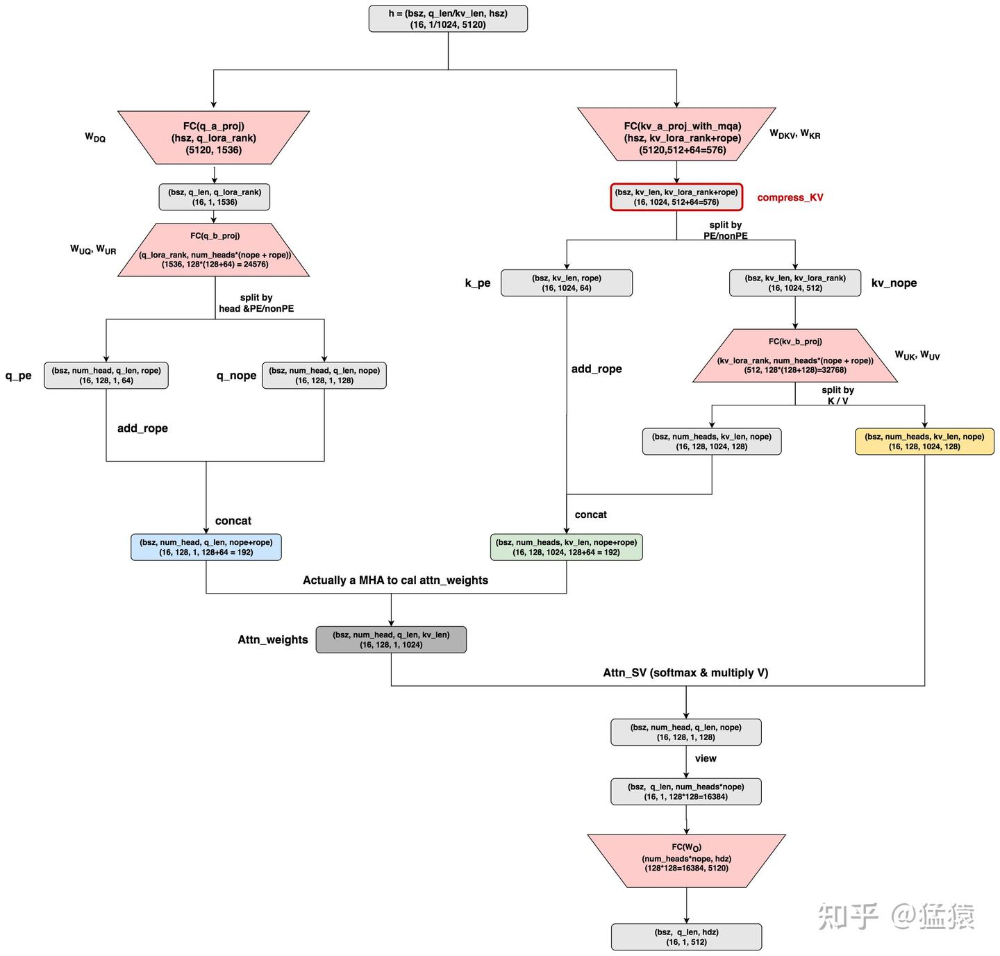

# 再读MLA，还有多少细节是你不知道的
> 作者: 猛猿
> 
> 原文: [https://zhuanlan.zhihu.com/p/19585986234](https://zhuanlan.zhihu.com/p/19585986234)

**关于MLA，在本文开头想先简单记录下我了解它的心路历程：**  
 

*   我第一次了解MLA，是在它刚出来的档口。**在我读过它的原生实践后，我发现它既不省**[**KV cache**](https://zhida.zhihu.com/search?content_id=252939704&content_type=Article&match_order=1&q=KV+cache&zhida_source=entity)**，还徒增了计算量**。这个问题让我困扰了很久，当时网上对MLA细节的讨论还不多，所以我一直觉得是我没懂它，再加上没有实际的业务需求，它就被我放一边了。别人问起我MLA，我都回答不知道，因为我确实没想明白。
    

*   直到最近dpsk v3的风刮起来，再加上实际体验后它的推理速度确实很快（当然我知道不止于MLA），所以又有了重新认识MLA的兴趣。而幸运的是，此时网上已经有关于MLA的诸多讨论了，这样就能和我的理解相互校验。在这一次的重新认识中，我发现我之前的认知并没有错，**原生MLA确实存在上述的2个问题，并且**[**开源社区**](https://zhida.zhihu.com/search?content_id=252939704&content_type=Article&match_order=1&q=%E5%BC%80%E6%BA%90%E7%A4%BE%E5%8C%BA&zhida_source=entity)**已有了各种对原生MLA的优化方法**，这里我主要参考了：  
     
    
    *   [**章明星老师关于MLA优化的思路**](https://zhuanlan.zhihu.com/p/700214123)**（代码在**[**这里**](https://link.zhihu.com/?target=https%3A//github.com/madsys-dev/deepseekv2-profile/tree/main)**）**。_**本文第二部分介绍的各种MLA优化思路也来自于此**_**，我推荐大家都看看这份资料，写得非常具有启发性。**  
         
        
    *   [**知乎上一篇对MLA计算量的分析**](https://zhuanlan.zhihu.com/p/714761319)**。在这个分析思路的启发下，本文按照自己的理解重新做了MLA各种优化方法的计算量和KV cache分析，算出的结果和章明星老师团队做的**[**实验分析结果**](https://link.zhihu.com/?target=https%3A//github.com/madsys-dev/deepseekv2-profile/blob/main/workspace/blog/optimizing-mla.md)**吻合。**
        

我个人认为，首次学习MLA的难点之一是它的算法设计颇为“绕”，不管是用数学公式，或者是用流程图，似乎都很难一下找到它设计的核心思想。**所以本文第一部分将会抛开各种复杂的计算细节，先根据我自己的理解抽象出MLA的设计方案。基于此再来谈计算细节和各种优化。**  
  
**一、MLA的基本思想**

### **1.1 MLA，MQA与**[**GQA**](https://zhida.zhihu.com/search?content_id=252939704&content_type=Article&match_order=1&q=GQA&zhida_source=entity)  
 

我们先来快速复习一下[decoder架构](https://zhida.zhihu.com/search?content_id=252939704&content_type=Article&match_order=1&q=decoder%E6%9E%B6%E6%9E%84&zhida_source=entity)的MHA的运作流程，如下图：

  
  
这里head\_num = 4，图中刻画了head0的运算过程，包括 `attn_weights = Matmul(q, k)` 以及 `attn_sv = Matmul(attn_weights, v)`，图中虚线灰框表示 hi 在head0上的结果是由包括其在内的若干前置tokens计算结果汇总而来。为了表达简便，这里省去了诸如softmax， WO 的计算过程。**图中被红色虚线框圈起来的部分，就是大家熟知的将被用在推理阶段的KV cache。**  
  
  
KV cache的存在，本来是为了避免在推理阶段对前置序列的重复计算的。但是，**随着前置序列的长度变长**（我们记为kv\_len），需要读取的**KV cache也将越来越大**，数据的传输成本增加，这就使得**attn计算逐渐变成**[**memory bound**](https://zhida.zhihu.com/search?content_id=252939704&content_type=Article&match_order=1&q=memory+bound&zhida_source=entity)。**我们采取了一些策略来缓解KV cache过大的问题，其中2种就是大家熟知的MQA和GQA**。  
  
  
MQA和GQA的运作方式如下：  
 

*   **在MQA的情况下，一个token所有的heads都共享同一个k和v**。这样在降低param weights大小的同时，还让原本需要保存[num\_heads](https://zhida.zhihu.com/search?content_id=252939704&content_type=Article&match_order=1&q=num_heads&zhida_source=entity)份的[kv cache](https://zhida.zhihu.com/search?content_id=252939704&content_type=Article&match_order=1&q=kv+cache&zhida_source=entity)降低为只需保存1份。
    
*   但是，MQA可能造成模型效果上的损失，毕竟原来对于1个token，它的每个head都有各自的k、v信息的，现在却被压缩为一份。**所以GQA作为一种折衷的方案出现了**，即将1个token的head分成num\_group组，每个group内共享同一个k，v信息，使得信息压缩不像GQA那样严重。
    

  
  
**但是，不管是MQA还是GQA，对于1个token来说，总是存在heads上k、v信息被压缩的情况。那么是否有一种办法，能在尽量不压缩head上k，v信息的情况下，节省kv cache，提高整体推理速度呢？**那么接下来，我们就来大致看一下MLA的设计思想。

### **1.2 MLA的整体设计思想**

  
⚠️：**在本节中，我们会以K cache为例，抽象出MLA的核心优化思想**。V cache的优化思想也是同理，但不在这节赘述，而是合并到后文对于MLA的细节讲解中。  
  
  
现在先让我们回到MHA上（图1.1），来思考一个问题：**为什么对于一个token，我们需要保存它所有heads上的K值作为K cache呢？**

  
主要原因我们在上文解释过：**这是因为每个k\_head附带有不同的信息，它将用这份独有的信息和对应的q\_head进行attn的计算**，用公式表示即为\\(attn\\\_weights = (W\_{Q}h\_{i})^{T} \* (W\_{K}h\_{j})\\)，这里的\\(W\_{Q}, W\_{K}\\)是合并了所有head对应的param weight后的表达。  
  
  
**我们现在的总目标是节省K cache，当你再次端详上面这幅图时，一个idea在你的头脑中出现：**  
 

*   当前我要存的K cache是4个k\_head（图中深绿色框），**但如果我能从这4个k\_head中抽取出1份共有的信息**，然后在做attn计算时，**每个head都用这1份共有的信息做计算**，那么我也只需存这1份共有信息作为K cache了。这样我就**把K cache从原来num\_heads = 4变成num\_heads = 1**，这不就能节省K cache了吗？
    
*   但是等等，**现在共有的k\_head信息是抽取出来了，那么相异的k\_head信息呢？**（**简单来说，就是由**WK**不同head部分学习到的相异信息**）。我们当然是希望k\_head间相异的信息也能保留下来，那么该把它们保留至哪里呢？当你回顾attn\_weights的[计算公式](https://zhida.zhihu.com/search?content_id=252939704&content_type=Article&match_order=1&q=%E8%AE%A1%E7%AE%97%E5%85%AC%E5%BC%8F&zhida_source=entity)时，一个想法在你脑中闪现：**q部分不是也有heads吗！我可以把每个k\_head独有的信息转移到对应的q\_head上吗！写成公式解释就是：**  
     
    
    *   原来 \\(attn\\\_weights = (W\_{Q}h\_{i})^{T} \* (W\_{K}h\_{j}) \\)，括号表示运算顺序，即先各自算2个括号内的，再做 \* 计算
        
    *   现在 \\(attn\\\_weights=(h\_i^TW\_Q^TW\_K)∗hj\\) ，同理括号表示运算顺序。
        
    *   **也就是说，这里我们通过矩阵乘法的**[**交换律**](https://zhida.zhihu.com/search?content_id=252939704&content_type=Article&match_order=1&q=%E4%BA%A4%E6%8D%A2%E5%BE%8B&zhida_source=entity)**，巧妙地把1个token上k\_heads独有的信息转移到了对应的q\_head上来，这样1个token上k\_heads间共享的相同信息就能被我们当作K cache存储下来。**
        

  
（在这里，你可以抽象地把 hj 理解成是4个k\_heads共享的信息，但最终K cache的形式还会在这基础上有所变化。我知道此时你脑海中一定有很多疑惑。但我们先不要纠结细节的问题，因为在后文会展示全部细节，这里我们要做的是从宏观上理解MLA设计的核心思想。）  
  
  
现在我们更具体地画出上面这套“信息转移”方案的具体流程：  
 

⚠️ ⚠️⚠️：**再次说明，在本部分，我们侧重于抽象出MLA的优化思路，大家在阅读上面这幅图时，请不要带入任何具体的细节（例如矩阵尺寸）等去做计算，这部分细节我们会在下文详细介绍。** 我们来详细看这幅图：  
 

*   **对于每个token的k\_heads，我们需要抽取出它们的相异信息**，而这个相异信息本质上是由 WK 维护的。观测到所有tokens都共享1个 WK ，所以我们对于\\(q\\\_heads\\)，我们只需做1次对于 WK 的吸收，就能统一获取所有tokens的所有k\_heads上的相异信息。
    
*   **对于每个tokens的k\_heads，我们还需要抽取出它们的相同信息**，而这个相同信息应该是每个tokens的所有k\_heads共享一份，同时不在不同tokens间共享。那么我们自然而然想到，可以学习一个linear参数矩阵，从原始token hj 中提取出这份共有信息，以此作为我们的K cache。而不管是从“信息提取”还是从“进一步节省K cache大小”的角度来说，似乎这个linear参数参数矩阵如果能把 hj 压缩到一个更低维的空间，会收获更紧密的信息表达和更小的存储量，这也是图中compress\_k的由来。
    
*   **最后，我们使用压缩后了共有信息的compress\_k，和吸收了相异信息的q\_head做计算，得到**[**attn\_weights**](https://zhida.zhihu.com/search?content_id=252939704&content_type=Article&match_order=4&q=attn_weights&zhida_source=entity)。
    

对v cache的优化也是同理，这里额外提几点：

*   事实上，**当我们考虑到v cache优化时，上图中的compress\_k其实应该被理解成compress\_kv**，**也就是它是1个token所有k\_heads和v\_heads的共有信息**。
    
*   WV 可以和 WO 作吸收，我们在后文会讲这块细节。
    

  
好，到此为止，我们抽象出了MLA的整体优化思路，从中你可以发现：  
 

*   虽然从形式上来说，MLA和MQA/GQA很像，似乎都是通过压缩k/v\_heads的数量来节省KV cache大小的。**但MLA是压缩num\_heads，不压缩信息（把信息转移到了q\_heads上）；而MQA/GQA则在一定程度上对信息做了压缩**。
    
*   **从这一点上看，我个人认为MLA其实更应该理解成是MHA的变种优化，而并非MQA/GQA的变种优化。**
    

  
  
**二、MLA的运作流程**
--------------------

### **2.1 CD (CacheDecompressed, dpsk MLA的原生实现）**

现在我们可以来看MLA的运作细节了。

  
  
 

*   本图参考自huggingface上dpsk v2的MLA原生实现，代码在[这里](https://link.zhihu.com/?target=https%3A//huggingface.co/deepseek-ai/DeepSeek-V2/blob/main/modeling_deepseek.py%23L682)。
    
*   关于MLA的更多细节，例如“为什么要区分nope和rope维度”，“为什么要做low rank压缩”等，已经有前人的分析珠玉在前，因此本文不做重点阐述，更多细节请参考：  
     
    
    *   [https://kexue.fm/archives/10091](https://link.zhihu.com/?target=https%3A//kexue.fm/archives/10091)
        
    *   [https://arxiv.org/pdf/2405.04434](https://link.zhihu.com/?target=https%3A//arxiv.org/pdf/2405.04434)
        

*   这里假设q\_len = 1，kv\_len = 1024，nope表示非pe部分的[head\_dim](https://zhida.zhihu.com/search?content_id=252939704&content_type=Article&match_order=1&q=head_dim&zhida_source=entity)，rope表示pe部分的head\_dim。其余维度已标注在图中。其中红色表示param\_weights，其中：  
     
    
    *   `q_b_proj`：是q计算中的[升维矩阵](https://zhida.zhihu.com/search?content_id=252939704&content_type=Article&match_order=1&q=%E5%8D%87%E7%BB%B4%E7%9F%A9%E9%98%B5&zhida_source=entity)，它包含了 WUQ,WUR 两部分，分别表示对q的nope/rope部分的计算。
        
    *   `**kv_a_proj_with_mqa**`**：是对原始hidden\_states的压缩矩阵，它包含了**WDK,WKR**两部分，分别用于计算compress\_kv（即抽取k\_heads和v\_heads的共同信息）**，以及计算k\_pe的部分。
        
    *   `kv_b_proj`：它包含了 WUK,WUV 两部分，分别表示对 k\_nope 和 v 部分的计算。
        
    *   **以上符号表示皆遵从dpsk原始论文，下标**D**表示Down降维，**U**表示Up升维，**R**表示做Rope（诸如**K**就表示和K的rope相关）。**
        

好，现在关于这个MLA的原生实现，我们来讨论几个有意思的点：  
  
  
**（1）在MLA中，每个head\_dim的尺寸更大了**。观察到原始hidden\_size = 5120，如果按照num\_heads = 128来看的话，正常来说一个head\_dim = 40 (5120/128=40)。但是在MLA中，一个head\_dim = 128，远大于40。也就说MLA其实是用比一般MHA更大的head\_dim（或者也可能是num\_heads）来做attn计算的，然后在最终的 WO 矩阵中映射回原来的[hidden\_size](https://zhida.zhihu.com/search?content_id=252939704&content_type=Article&match_order=2&q=hidden_size&zhida_source=entity)。对此我个人给出一些简单猜测：**如果推理阶段KV cache造成的memory bound的问题已经得到解决的话，那么训练时我就能少一点后顾之忧，然后通过提升模型的复杂度来取得与MHA比肩或更好的效果（训练阶段还有别的优化方式）。这样当我回到推理阶段时，我的整体计算强度就上去了（每读1次，算的次数更多了）只要没有达到**[**compute bound**](https://zhida.zhihu.com/search?content_id=252939704&content_type=Article&match_order=1&q=compute+bound&zhida_source=entity)**的界限，这样的提升就是有好处的**。  
  
  
**（2）原生MLA的计算最终展开成了MHA的计算**。这一点可以参见图中q（蓝色），k（绿色），v（黄色），它们最终都变成了标准MHA的计算。从理论上来说，这一点也不奇怪，因为我们在第一部分说过MLA就是MHA的变种，只是它在MHA的基础上做了信息从k/v\_head向q\_head的转移。**嗯?!!但是等等，从上图这个原生MLA上来看，虽然产出了compress\_kv，但是好像并没有做什么信息转移呀**，也就是粗糙来看目前的计算流程还是 \\(attn\\\_weights=(W\_Qh\_i)^T∗(W\_Kh\_j)\\) 而不是转移后的 \\(attn\\\_weights=(h\_i^TW\_Q^TW\_K)∗hj\\) 呀：  
 

*   是的，如果你有这个疑惑，**那么恭喜你发现了原生MLA的问题，也就是它没有做任何的信息转移。**
    
*   同时，原生MLA保存的KV cache并不是图中绘制的compress\_kv，而是图中已经成形的完整的k（绿色）和v（黄色），这一点在上面的代码中可以看见。
    
*   **再有，考虑到这里head\_dim = 128（远大于同num\_heads数量下的标准head\_dim=40），所以原生MLA增加算力所付出的代价是，KV cache显存反而增加了。**
    

  
  
基于这些，我们管原生MLA的实现方式为**CD**（**CacheDecompressed**），即存储的KV cache是没有经过任何压缩的。我们马上就来看后一些做过“信息转移/吸收”的优化方法，不过在此之前，我们先对原生MLA的计算量和KV cache做一个分析。  
  
  
**CD**（**CacheDecompressed**）  
zh表格效果有点鸡肋...我直接从我笔记里截图了

| operation | shape | MFLOPs | MFLOPs/per\_token | KV cache大小 per\_token (fp16) |
| --- | --- | --- | --- | --- |
| FC(q\_a\_proj) | \[bSz, q\_len, hsZ\] _\[hsz, q\_Lora\_rank\]=\[16, 1,5120\]_\[5120,1536\] | 251.66 MFLOPs   2_16_1_5120_1536 | 15.73MFLOPs   251.66/16/1 |     |
| FC(q\_b\_proj) | \[bSz,q\_len,q\_lora\_rank\]_\[q\_lora\_rank,num\_heads_(npe + rope)\]=\[16,1,1536\]_\[1536,128_(128+64)=\[24567\]\] | 1207.52 MFLOPs   2_16_1_1536_24567 | 75.47 MFLOPs   1207.52/16/1 |     |
| FC(kv\_a\_proj\_with\_may) | \[bSx,q\_len,hdZ\]_\[hdZ,kv\_lora\_rank_npe\]   \=\[16,1,5120\]\*\[5120,(5+12+64)=\[576\]\] | 94.37 MFLOPs   2_16_1_5120_576 | 5.90 MFLOPs   94.37/16/1 |     |
| Attn\_QK   (计算attn weights） | \[bSx,num-heads,q\_len,(npe+rope)\]_\[bSx,num\_heads,(npe+rope),kv\_len\]_   _\=\[16,128,1,(128+64)=\[192\]\]_\[16,128,(128+64)=\[192\],1024\] | 8053.31 MFLOPs   2_16_1_128_1024\*192 | 0.05 MFLOPs   8053.31/16/1024 | K cache per token:   \[bsz,num\_heads(kv\_len,(npe+rope)\]   \>=(2_16_128_1024_192)/(16_1024)_   _\=49152bytes=48kBVcache per tokeon:_   _\[bsz,num\_heads(kv\_len,npe)\]_   _\=(2_16_128_1024_128)/(16_1024)   \=32768 bytes=32kBTotal KV cache per toker=80kB |
| Attn\_SV   (attn Weights \* V) | \[bSx,num\_heads,q\_len ,kv\_ len\]_\[bSx,num\_heads ,kv\_len,nope\]_   _\=\[16,128,1,1024\]_\[16,128,1024,128\] | 536.87 MFLOPs   2_16_128_1024_128 | 0.03 MFLOPs   536.87/16/1024 |     |
| FC(o.Proj) | \[bSx,q\_len,num\_heads_nop\]_\[num\_heads_npe, hddZ\]_   _\=\[16,128_128=16384\]_\[128_128=16384,5120\] | 2684.35 MFLOPs   2_16_1_16384_5120 | 167.77 MFLPOS   2684.35/16/1(forq) |     |
| Total |     | 5580.08 MFLOPs | 264.95 MFLOPs | 80 kB |

我们对这张表格做一些说明：  
 

*   **这张表格描述的是推理阶段的Attn部分相关的计算量(MFLOPs, Million FLOPs)和KV Cache大小(per layer per token, kB)。后面这类型的表格都是同理**。
    
*   首先，再次声明，在CD方法下，我们存储的是图中MHA形态的K，V值（绿色，黄色框）。所以KV相关的计算量都是从这两个框之后开始的，大家可以对着图看。
    
*   表格的前3行，是每个做query的token必须要执行的操作。其中，对于`kv_a_proj_with_mqa`这个操作，是当前做query的token也会产出自己的KV值。
    
*   MFLOPs/per\_token：这个指标更准确的说是 MFLOPs/per\_layer/per\_token，衡量的是单token的计算量。我们知道1个token有分q部分和kv部分，**那么表格中除以1的就可以理解为是q部分相关的计算量，除以1024的可以理解成是kv部分相关的计算量。通过这种方式，可以帮助我们更好理解计算量是如何在q和kv之间转移的，我们在后文会更好感受这个“转移”**
    
*   **我们接下来会对比除CD外的MLA优化方法，这里提前预告下，在这些比较中，你会发现CD的计算量是最小的（不难理解，因为它相当于是从流程图最靠近下方的部分开始计算的），但是它的KV cache是最大的**。注意，这里我们说的计算量小，是CD相比于别的MLA优化方法，而不是CD相比于head\_dim=40的标准MHA。
    
*   **最后总结一下，在CD中，单token KV cache = 80 KB ，单token KV相关的计算量为 0.08 MFLOPs**。
    

###   
  
**2.2 CC (CacheCompressed）**

好，在进入大家从第一部分开始就心心念念的“k/v\_head信息向q转移（或者理解成被q吸收）”这个优化介绍前，我们先介绍基于原生实践和这个优化的一个中间态：**CC** (**CacheCompressed**）。**在这个中间态中，我们终于是以compress\_kv为kv cache了，但是我们没做任何吸收。之所以要介绍这个中间态，是方便大家更好感受“吸收”的好处**。  
  
  
我们直接对着2.1的图，列出CC表格：

| operation | shape | MFLOPs | MFLOPs/per\_token | KV cache大小/per\_token(fp16) |
| --- | --- | --- | --- | --- |
| FC(q\_a\_proj) | \[bsz, q\_len, hsz\] \* \[hsz, q\_lora\_rank\] = \[16, 1, 5120\] \* \[5120, 1536\] | 251.66 MFLOPs | 15.73 MFLOPs | 251.66/16/1 |
| FC(q\_b\_proj) | \[bsz, q\_len, lora\_rank\] \* \[lora\_rank, num\_heads\*(npe + rope)\] = \[16, 1, 1536\] \* \[1536, 128\*(128+64)=24567\] | 1207.52 MFLOPs | 75.47 MFLOPs | 1207.52/16/1 |
| FC(kv\_a\_proj\_with\_mq a) | \[bsz, kv\_len, hdz\] \* \[hdz, kv\_lora\_rank + rope\] = \[16, 1, 5120\] \* \[5120, (512+64)=576\] | 94.37 MFLOPs | 5.90 MFLOPs | 94.37/16/1 |
| FC(kv\_b\_proj) | \[bsz, kv\_len, kv\_lora\_rank\] \* \[kv\_lora\_rank, num\_heads\*(npe+npe)\] = \[16, 1024, 512\] \* \[512, 128\*(128+128)=32768\] | 549755.81 MFLOPs | 33.55 MFLOPs | 549755.81/16/1024 |
| Attn\_QK (计算attn\_weights) | \[bsz, num\_heads, q\_len, (npe+rope)\] \* \[bsz, num\_heads, (npe+rope), kv\_len\] = \[16, 128, 1, (128+64)=192\] \* \[16, 128, (128+64)=192, 1024\] | 805.31 MFLOPs | 0.05 MFLOPs | 805.31/16/1024 |
| Attn\_SV (attn\_weights \* V) | \[bsz, num\_heads, q\_len, kv\_len\] \* \[bsz, num\_heads, kv\_len, npe\] = \[16, 128, 1, 1024\] \* \[16, 128, 1024, 128\] | 536.87 MFLOPs | 0.03 MFLOPs | 536.87/16/1024 |
| FC(o\_proj) | \[bsz, o\_len, num\_heads_npe\] \* \[num\_heads_npe, hdz\] = \[16, 1, 128_128=16384\] \* \[128_128=16384, 5120\] | 2684.35 MFLOPs | 167.77 MFLOPs | 2684.35/16/1 |
| **Total** |     | 550109.23 MFLOPs | 298.5 MFLOPs | 1.13kB |
|     |     |     |     |     |

  
不难发现，在这个中间态CC优化的MLA下：

*   单token KV cache = 1.13 KB ，相比CD有了显著降低。
    
*   单token的kv计算量 = 33.55 + 0.05 + 0.03 = 33.63 MFLOPs。主要犯罪嫌疑人就在`kv_b_proj`上。简单来说，在没有做吸收/转移前，一个 WUK 矩阵需要作用在kv\_len = 1024条数据上，但是现在它只需要被q\_len=1条数据算1次就好了，即我们把属于kv的计算量转移到了q上。
    

###   
  
**2.3 A\_CC（AbsorbCacheCompressed）**

现在，终于来到我们心心念念的涉及吸收的优化了  
 

| operation | shape | MFLOPs | MFLOPs/per\_token | KV cache大小/per\_token(fp16) |
| --- | --- | --- | --- | --- |
| FC(q\_a\_proj) | \[bsz, q\_len, hsz\] \* \[hsz, q\_lora\_rank\] = \[16, 1, 5120\] \* \[5120, 1536\] | 251.66 MFLOPs | 15.73 MFLOPs | 251.66/16/1 |
| FC(q\_b\_proj) | \[bsz, q\_len, lora\_rank\] \* \[lora\_rank, num\_heads\*(npe + rope)\] = \[16, 1, 1536\] \* \[1536, 128\*(128+64)=24567\] | 1207.52 MFLOPs | 75.47 MFLOPs | 1207.52/16/1 |
| FC(kv\_a\_proj\_with\_mqa) | \[bsz, kv\_len, hdz\] \* \[hdz, kv\_lora\_rank + rope\] = \[16, 1, 5120\] \* \[5120, (512+64)=576\] | 94.37 MFLOPs | 5.90 MFLOPs | 94.37/16/1 |
| FC(kv\_b\_proj) | \[bsz, kv\_len, kv\_lora\_rank\] \* \[kv\_lora\_rank, num\_heads\*(npe+npe)\] = \[16, 1024, 512\] \* \[512, 128\*(128+128)=32768\] | 549755.81 MFLOPs | 33.55 MFLOPs | 549755.81/16/1024 |
| Attn\_QK, step1: Matmul(q, nope, q\_absorb) | \[bsz, num\_heads, q\_len, nope\] \* \[num\_heads, nope, kv\_len\] = \[16, 128, 1, 128\] \* \[128, 128, 512\] | 268.44 MFLOPs | 16.78 MFLOPs | 268.44/16/1 |
| Attn\_QK, step2: Matmul(step1.concat(q, pe), compress\_kv.concat(k, pe)) | \[bsz, num\_heads, q\_len, kv\_len\] \* \[bsz, kv\_len, kv\_lora\_rank + rope\] = \[16, 128, 1, 512\] \* \[512, 128, 1536\] | 2415.91 MFLOPs | 0.15 MFLOPs | 2415.91/16/1024 |
| Attn\_SV, step1: Matmul(Attn\_QK, compress\_kv) | \[bsz, num\_heads, q\_len, kv\_len\] \* \[bsz, kv\_len, kv\_lora\_rank\] = \[16, 128, 1, 1024\] \* \[1024, 128, 512\] | 2147.48 MFLOPs | 0.13 MFLOPs | 2147.48/16/1024 |
| Attn\_SV, step2: Matmul(step1\_out, absorb) | \[bsz, num\_heads, q\_len, kv\_lora\_rank\] \* \[num\_heads, kv\_lora\_rank, nope\] = \[16, 128, 1, 512\] \* \[512, 128, 128\] | 268.44 MFLOPs | 16.78 MFLOPs | 268.44/16/1 |
| FC(o\_proj) | \[bsz, q\_len, num\_heads_npe\] \* \[num\_heads_npe, hdz\] = \[16, 1, 128\*128=16384\] \* \[16384, 5120\] | 2684.35 MFLOPs | 167.77 MFLOPs | 2684.35/16/1 |
| **Total** |     | 9338.17 MFLOPs | 298.7 MFLOPs | 1152 bytes = 1.13KB |

*   单token KV cache = 1.13 KB
    
*   单token的KV计算量 = 0.15 + 0.13 = 0.28 MFLOPs
    
*   达到了节省KV cache的同时，维持单token KV计算量不变的需求。
    

  
  
这里解释下为什么A\_CC相比于CC，总计算量降低了很多，但单token计算量却没有变化：

*   这是因为单token计算量分成作用在q和作用在kv上的。而q对应的seq\_len = 1，kv对应的seq\_len=1024
    
*   A\_CC相比于CC，把原来属于单kv的计算量转移到q上了，而q的seq\_len=1，对总计算量的影响本来就少。
    

###   
  
**2.4 A\_CC\_ME**

  
最后，这个优化其实就是在A\_CC的基础上，在计算attn\_weights的时候，把nope和rope的部分拆开算，然后再求和。这样做是为了避开无用的数据拷贝和广播（可以看代码，你会发现A\_CC为了做数据拼接，是先初始化一个一个拼接好的空张量，再往里塞数据，这样就是2倍的显存开销。而避开拼接各自算各自的，可以直接复用已有的数据）  
 

| operation | shape | MFLOPs | MFLOPs per token | KV cache大小per\_token (fp16) |
| --- | --- | --- | --- | --- |
| FC(a\_qa\_proj) | \[bsz, q\_len, hsz\] \* \[hsz, q\_lora\_rank\] = \[16, 1, 5120\] \* \[5120, 1536\] | 251.66 MFLOPs | 15.73 MFLOPs | 251.66/16/1 |
| 2 \* 16 \* 1 \* 5120 \* 1536 |     |     |     |     |
| FC(q\_b\_proj) | \[bsz, q\_len, q\_lora\_rank\] \* \[q\_lora\_rank, num\_heads \* (rope + rope)\] = \[16, 1536\] \* \[1536, 128\] \* \[128, 64\]=244567 | 1207.52 MFLOPs | 75.47 MFLOPs | 1207.52/16/1 |
| 2 \* 16 \* 1 \* 1536 \* 24567 |     |     |     |     |
| FC(kv\_a\_proj\_with\_moa) | \[bsz, q\_len, hdz\] \*\[hdz, kv\_lora\_rank + rope\] = \[16, 5120\] \* \[5120, 576\]=576\] | 94.37 MFLOPs | 5.90 MFLOPs | 94.3.7/16/1 |
| 2 \* 16 \* 1 \* 5120 \* 576 |     |     |     |     |
| Attn\_QK, step1: Matmul(q\_nope, q\_absorb) 这里的q\_absorb就是W^Q/K | \[bsz, num\_heads, q\_len, nope\] _\[num\_heads, nope, kv\_lora\_rank\] = \[16, 128, 1, 128\]_\[128, 128, 512\] | 2684.44 MFLOPs | 167.78 MFLOPs | 2684.44/16/1 |
| 2 \* 16 \* 128 \* 1 \* 128 \* 512 |     |     |     |     |
| Attn\_QK, step2: Matmul(\[step1, compress\_kv\]) Matmul(\[step1.concat(q.pe), compress\_kv\].concat(kv\_pe)) （实际计算时，后者（compress\_kv）广播了num\_heads份） | \[bsz, num\_heads, q\_len, kv\_lora\_rank \]_\[ bsz, kv\_lora\_rank, k\_v\_len\] = \[16, 128, 1, 512\]_\[16, 512, 1024\] | 2147.48 MFLOPs | 0.13 MFLOPs | KV cache = compressed\_kv\[bsz, kv\_len, kv\_lora\_rank + rope\]=\[16, 1024, 512+64=576\]/(16\*1024)=115.2bytes = 1.13KB |
| 2 \* 16 \* 128 \* 1 \* 512 \* 1024 |     | 2147.48/16/1024 |     |     |
| Attn\_QK, step3 Matmul(\[q.pe, k.pe\]) | \[bsz, num\_heads, q\_len, rope \]_\[ bsz, rope, kv\_len\] = \[16, 128, 1, 64\]_\[16, 64, 1024\] | 2684.44 MFLOPs | 0.02 MFLOPs | 2684.44/16/1024 |
| 2 \* 16 \* 128 \* 1 \* 64 \* 1024 |     |     |     |     |
| 最后step2 + step3累加出attn.weights, 加法计算量忽略 |     |     |     |     |
| Attn\_SV, step1: Matmul(Attn\_QK, compress\_kv) （实际计算时，后者（compress\_kv）广播了num\_heads份） | \[bsz, num\_heads, q\_len, kv\_len\]_\[bsz, kv\_len, kv\_lora\_rank\] = \[16, 128, 1, 1024\]_\[16, 1024, 512\] | 2147.48 MFLOPs | 0.13 MFLOPs | 2147.48/16/1024 |
| 2 \* 16 \* 128 \* 1 \* 1024 \* 512 |     |     |     |     |
| Attn\_SV, step2: Matmul(step1, out\_absorb) 这里的out\_absorb就是W^V | \[bsz, num\_heads, q\_len, kv\_lora\_rank\]\*\[num\_heads, kv\_lora\_rank, |     |     |     |

**三、MLA可以用TP吗**
---------------

  
现在，回来看一个经常被讨论的问题：**MLA可以做TP吗？因为看样子，对于每一个token来说，它所有的num\_heads上的kv信息已经被压缩成compress\_kv了，好像是不能再切分了？**为了解答这个问题，我们这里再贴出2.1中的流程图：

我们着重关注流程图中红色部分（也就是param\_weights），大家回想一下之前的介绍：尽管compress\_kv已经被抽取成类似单头的形式了（1个token只有1个，且不区分heads），但是它能这样做的原因是因为kv\_heads上的信息转移去q\_heads了，对了！q还是有heads的呀！！  
  
  
**所以这边，我们先给出结论：MLA可以做TP，但是它可能需要一些定制化的TP方式，而不是套用惯常decoder模型的TP方式。**  
  
  
我们首先来看一下，dpsk官方是如何在上面这张流程图中做TP切分的，详细代码可以参见[这里](https://link.zhihu.com/?target=https%3A//github.com/deepseek-ai/DeepSeek-V3/blob/ee4c4ea32bfd89e197616b80e713466954c51c75/inference/model.py%23L409)：

从图里来说：

*   在TP的情况下，一个tp\_group内的每个tp\_rank都共享相同的compress\_kv。（这里有一个优化方案，那就是可以通过类似cache pool的方式，只维护一份compress\_kv，然后每个tp\_rank都从上面去取，就能避免数据的重复存储了/）
    
*   在dpsk官方给出的tp示例中，图中所有带num\_heads的红色矩阵是按照num\_heads做TP划分的，这一点不难理解，因为q依然是按照heads划分的，而kv的信息又是被吸收到各个q\_heads上的
    
*   而对于 q\_a\_proj 和 kv\_a\_proj\_with\_mqa，dpsk官方是不切的，即各个tp\_rank上重复维护同样的param\_weights。但这不意味着这两个param\_weights不能再切分，例如实践上，你可以用col/row对他们做切分，只要保证在输入输出的位置做好正确的通信即可。具体的方式则要看实际应用场景。