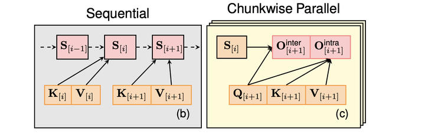

# Lightning Attention 是如何克服传统线性注意力机制需要累加求和的缺陷的？
1/18 update: 做了一个视频介绍linear attention一些近期进展

https://www.bilibili.com/video/BV1MDwAeWEoM/?vd\_source=035872531a338721ba64a57a1cdc1ebc

\--- 分割线 ---

* * *

看来大家对linear attention的一些经典算法和发展历史都了解甚少。。。忍不了来写个睡前回答

其实linear attention的思想很简单，就是把

\\(\\mathbf{O} = \\operatorname{softmax}(\\mathbf{Q}\\mathbf{K}^\\top) \\mathbf{V}\\)

的softmax去掉，变成了

\\(\\mathbf{O} = (\\mathbf{Q}\\mathbf{K}^\\top) \\mathbf{V}\\)

然后借助矩阵乘法结合律得到

\\(\\mathbf{O} = \\mathbf{Q}(\\mathbf{K}^\\top \\mathbf{V})\\)

在[双向注意力](https://zhida.zhihu.com/search?content_id=709262406&content_type=Answer&match_order=1&q=%E5%8F%8C%E5%90%91%E6%B3%A8%E6%84%8F%E5%8A%9B&zhida_source=entity)里，比方说古代的bert时期，以及计算机视觉领域中，这样就已经足够了，大家开开心心地在线性时间内算两个很大的矩阵乘法，甚至都不需要写kernel就能很高效

但是在autoregressive modeling中，我们需要有[causal mask](https://zhida.zhihu.com/search?content_id=709262406&content_type=Answer&match_order=1&q=causal+mask&zhida_source=entity)。 训练和推理的形式分别是：

\\(\\mathbf{O} = \\operatorname{softmax}(\\mathbf{Q}\\mathbf{K}^\\top \\odot \\mathbf{M}) \\mathbf{V} \\in \\mathbb{R}^{L\\times d} \\\\ \\mathbf{o\_t} = \\sum\_{j=1}^t \\frac{\\exp(\\mathbf{q}\_t^\\top \\mathbf{k}j)}{\\sum\_{l=1}^t\\exp(\\mathbf{q}^\\top\_t \\mathbf{k}\_l)}\\mathbf{v}\_j  \\in \\mathbb{R}^d\\)

同样地，把去掉softmax之后，我们可以得到

\\(\\mathbf{O} = (\\mathbf{Q}\\mathbf{K}^\\top \\odot \\mathbf{M}) \\mathbf{V}  \\in \\mathbb{R}^{L \\times d} \\\\ \\mathbf{o}\_t = \\sum\_{j=1}^t (\\mathbf{q}\_t^\\top \\mathbf{k}\_j) \\mathbf{v}\_j  \\in \\mathbb{R}^d\\)

由于这个 \\(\\mathbf{M}\\) 的存在，我们不能直接利用矩阵乘法的结合律得到上面先算KV矩阵乘法的线性形式（因为矩阵乘法跟[矩阵点乘](https://zhida.zhihu.com/search?content_id=709262406&content_type=Answer&match_order=1&q=%E7%9F%A9%E9%98%B5%E7%82%B9%E4%B9%98&zhida_source=entity)是不可以交换的）。另外提一下，很多早期的[线性注意力](https://zhida.zhihu.com/search?content_id=709262406&content_type=Answer&match_order=1&q=%E7%BA%BF%E6%80%A7%E6%B3%A8%E6%84%8F%E5%8A%9B&zhida_source=entity)的文章都有QK上的[activation](https://zhida.zhihu.com/search?content_id=709262406&content_type=Answer&match_order=1&q=activation&zhida_source=entity) function（被称为kernel function，因为是从softmax attention的softmax operator的kernelization的角度出发的，跟传统机器学习的kernel method异曲同工），并且有一个整体的normalization的分母项。但在[The Devil in Linear Transforme](https://link.zhihu.com/?target=https%3A//arxiv.org/abs/2210.10340)r 中证明了分母带来数值问题，所以在最近的linear attention中几乎全部去掉了，取而代之的是加上output normalization。另外，[Fine-Tuning Pre-trained Transformers into Decaying Fast Weights](https://link.zhihu.com/?target=https%3A//arxiv.org/abs/2210.04243)发现QK的activation啥也不设就good enough，后续的RetNet/GLA也不用激活函数，所以这两个term都省掉了）

在自回归linear attention的开山之作

[Transformers are RNNs: Fast Autoregressive Transformers with Linear Attention](https://link.zhihu.com/?target=https%3A//arxiv.org/abs/2006.16236)

当中指明了，linear attention的inference形式可以写成RNN的形式：

\\(\\mathbf{o}\_t = \\sum\_{j=1}^t \\mathbf{v}\_j(\\mathbf{k}\_j^\\top \\mathbf{q}\_t)  \\mathbf{k}\_j^\\top \\mathbf{q}\_t = \\mathbf{q}\_t^\\top \\mathbf{k}\_j \\in \\mathbb{R} \\\\ = \\underbrace{(\\sum\_{j=1}^t\\mathbf{v}\_j\\mathbf{k}\_j^\\top)}\_{\\text{记作} \\quad\\mathbf{S}\_t \\in \\mathbb{R}^{d\\times d}}\\mathbf{q}\_t  \\text{By associativity}\\)

那么不难看出，linear attention自回归计算output的过程可以写成一个RNN

\\(\\mathbf{S}\_t = \\mathbf{S}\_{t-1} + \\mathbf{v}\_t\\mathbf{k}\_t^\\top \\in \\mathbb{R}^{d\\times d}, \\quad \\mathbf{o}\_t = \\mathbf{S}\_t \\mathbf{q}\_t \\in \\mathbb{R}^{d}\\)

这样我们就可以通过训练RNN的形式，在线性的时间内训练线性注意力。

**但是如果用这种最基本的循环来训练有非常多的问题。**

第一点，如果使用[autograd](https://zhida.zhihu.com/search?content_id=709262406&content_type=Answer&match_order=1&q=autograd&zhida_source=entity)，那么，每一个时刻的[hidden state](https://zhida.zhihu.com/search?content_id=709262406&content_type=Answer&match_order=1&q=hidden+state&zhida_source=entity) \\(\\mathbf{S}\_t\\) 都会被保存下来给反向传播算梯度。保存中间hidden state在之前的RNN训练里面没啥问题，**但是在这里却是一个大问题。** 为什么呢？因为传统RNN 每个时刻的hidden state的大小是 \\(\\mathcal{O}(d)\\)，而linear attention每个时刻的hidden state大小是 \\(\\mathcal{O}(d^2)\\)，如果全部存下来需要 \\(\\mathcal{O}(Ld^2)\\)，那是万万不可接受的（你可以想象，输入的QKV才3Ld, 一般d>>3, 那么你基本就显存爆炸寄了不用玩了）

[Transformers are RNNs: Fast Autoregressive Transformers with Linear Attention](https://link.zhihu.com/?target=https%3A//arxiv.org/abs/2006.16236) 里面提出了一个**memory-efficient 训练的解决方案。**

在这个方案里， \\(\\mathbf{S}\_t\\) 在前向传播的过程中是不会被保存的。 由于只有 \\(\\mathbf{q}\_{t}\\) 的梯度依赖于 \\(\\mathbf{S}\_t\\) 。那我们索性在backward的时候重新算一遍 \\(\\mathbf{S}\_t\\) ，但这时的output算的不是 \\(\\mathbf{o}\_t\\)，而是 \\(\\mathbf{dq}\_t = \\mathbf{S}\_t \\mathbf{do}\_t\\)

而 \\(\\mathbf{k}\_t, \\mathbf{v}\_t\\) 的梯度不依赖于 \\(\\mathbf{S}\_t\\)，可以直接通过平常的BPTT来算出来。

到此为止，memory的问题解决了。

**第二个问题**，[循环训练](https://zhida.zhihu.com/search?content_id=709262406&content_type=Answer&match_order=1&q=%E5%BE%AA%E7%8E%AF%E8%AE%AD%E7%BB%83&zhida_source=entity)并行度太差了。此外，linear attention的recurrent update全部都是element-wise的操作（外积，点乘，...），根本没有一丁点矩阵乘法的影子，而矩阵乘法在GPU上非常高效（相同数量的FLOPs,在A100上用tensor cores算半精度矩阵乘法的效率是其他操作的16倍，所以现代的算法都是怎么矩阵乘法怎么来，这也是为什么[注意力机制](https://zhida.zhihu.com/search?content_id=709262406&content_type=Answer&match_order=1&q=%E6%B3%A8%E6%84%8F%E5%8A%9B%E6%9C%BA%E5%88%B6&zhida_source=entity)最先被提出来，然后直接席卷deep learning，因为它训的快呀。）

在parallel形式中，我们不需要算任何hidden state，只通过Q K V来得到output，但是需要 \\mathcal{O}(L^2) 复杂度。在Recurrent形式中，我们需要算每个time step的hidden state，但是只需要 \\mathcal{O}(L) 的复杂度。

那么存不存在一个介于两者之间算法，能够减少recurrent state的数量从而减少循环的次数，同时复杂度依然是线性的呢？ 答案就是linear attention的第三种形式：[chunkwise parallel form](https://zhida.zhihu.com/search?content_id=709262406&content_type=Answer&match_order=1&q=chunkwise+parallel+form&zhida_source=entity)（最早应该是在[Transformer Quality in Linear Time](https://link.zhihu.com/?target=https%3A//arxiv.org/abs/2202.10447) 提出的，现在所有的线性注意力训练都是基于chunkwise parallel form）。当chunk size C=1的时候，它和recurrent form等价，当C=L的时候，它跟parallel form等价。这是一个exact的算法，而不是一个approximate的算法，所以chunk size不影响output的大小（我在给talk的时候发现很多人有这样的疑问，觉得chunkwise算法是approximate的，所以在这里需要特别强调一下。）

核心思想如下：

*   把input序列分成若干个大小为C的等长chunk，只算每个chunk最后的hidden state
*   在chunk-level的hidden state上进行recurrence
*   每个chunk通过前一个chunk的[last hidden state](https://zhida.zhihu.com/search?content_id=709262406&content_type=Answer&match_order=1&q=last+hidden+state&zhida_source=entity)来aggregate历史信息，在chunk内部则是用一个attention的parallel形式直接得到output，而不是通过当前hidden state来算output。

更加formal的来说，记 \\(\\mathbf{S}\_{\[i\]} := \\mathbf{S}\_{iC}\\) 为第i个chunk最后的state （C是chunk size别忘了）， 记\\(\\square\_{\[i\]} = \\square\_{iC+1:(i+1)C} \\in \\mathbb{R}^{C \\times d} for \\square \\in \\{\\mathbf{Q}, \\mathbf{K}, \\mathbf{V}, \\mathbf{O}\\}\\)为 QKVO对应的chunk submatrix，

记\\(\\square\_{\[i\]}^r = \\square\_{iC+r}\\) 为第i个chunk第r个位置上的token对应的表示，那么这个过程可以写成：

\\(\\mathbf{S}\_{\[i\]}^r = \\mathbf{S}\_{\[i\]} + \\sum\_{t=1}^{r} \\mathbf{v}\_{\[i\]}^t \\mathbf{k}\_{\[i\]}^{t\\top} \\\\ \\mathbf{o}\_{\[i\]}^r = \\mathbf{S}\_{\[i\]}^r \\mathbf{q}\_{\[i\]}^r = \\mathbf{S}\_{\[i\]}\\mathbf{q}\_{\[i\]}^r + \\sum\_{t=1}^{r} \\mathbf{v}\_{\[i\]}^t (\\mathbf{k}^{t\\top}\_{\[i\]} \\mathbf{q}\_{\[i\]}^r)\\)

然后又注意到，外积的和可以用矩阵乘法表示： \\(\\sum\_{t=1}^{C} \\mathbf{v}\_{\[i\]}^t \\mathbf{k}\_{\[i\]}^{t\\top} = \\mathbf{V}\_{\[i\]}\\mathbf{K}\_{\[i\]}^\\top ，\\)

这样，整个上面的过程可以写成下面的形式：

\\(\\mathbf{S}\_{\[t+1\]} = \\mathbf{S}\_{\[t\]} + \\mathbf{V}\_{\[t\]}^\\top \\mathbf{K}\_{\[t\]}  \\in \\mathbb{R}^{d\\times d} \\\\ \\mathbf{O}\_{\[t\]} = \\mathbf{Q}\_{\[t\]} \\mathbf{S}\_{\[t\]}^\\top + (\\mathbf{Q}\_{\[t\]}\\mathbf{K}\_{\[t\]}^\\top \\odot \\mathbf{M}) \\mathbf{V}\_{\[t\]}  \\in \\mathbb{R}^{C\\times d}\\)

Chunkwise parallel form的核心优势在于：

*   总共的循环的次数由recurrent form的L 降低到了 L/C
*   在C是16的倍数的情况下，我们可以利用tensor cores来加速整体计算
*   整体的复杂度是 \\(\\mathcal{O}(Ld^2+LCd)\\)。在C固定的情况下，整体复杂度对sequence length L是线性的。（通常情况下，C取64，128，或者256这三个值来balance整体的计算复杂度和并行度）

这个过程可以用下图表示：

from [https://sustcsonglin.github.io/blog/2024/deltanet-2/](https://sustcsonglin.github.io/blog/2024/deltanet-2/)

这样，我们linear attention循环训练的第二个痛点：没有序列上的并行度，以及不能利用tensor core加速的问题也解决啦。

但是，如果仅仅用pytorch来实现chunkwise算法的话，速度会跟[flashattention](https://zhida.zhihu.com/search?content_id=709262406&content_type=Answer&match_order=1&q=flashattention&zhida_source=entity)有一定的差距，这是因为我们没有进行I/O cost的优化。比方说，每次算output的时候， \\(\\mathbf{Q}\_{\[t\]} \\mathbf{S}\_{\[t\]}^\\top + (\\mathbf{Q}\_{\[t\]}\\mathbf{K}\_{\[t\]}^\\top \\odot \\mathbf{M}) \\mathbf{V}\_{\[t\]}\\) 加号两边的 \\(\\mathbf{Q}\_{\[t\]}\\) 明显可以复用：只需要load一遍省去重复读取的开销。同时，我们中间的attention矩阵 \\((\\mathbf{Q}\_{\[t\]}\\mathbf{K}\_{\[t\]}^\\top \\odot \\mathbf{M})\\) 也没有必要写到HBM里面去，可以在SRAM里面一次做了。 诸如此类的I/O优化还有很多，在这里我就不一一列举啦。Flashattention的成功正是靠着fused kernel的I/O优化：

在[Gated Linear Attention Transformers with Hardware-Efficient Training](https://link.zhihu.com/?target=https%3A//arxiv.org/abs/2312.06635) 中，我们提到了两种chunkwise linear attention的硬件优化方式：

第一种是

flash linear attention (nonmaterialization version)

这个方式总共的I/O读取是最少的，因为每个QKV block都只被读了一次，而hidden state从始至终都没有被在SRAM里面，没有被写到HBM里面一次过。这样，如果[batch size](https://zhida.zhihu.com/search?content_id=709262406&content_type=Answer&match_order=1&q=batch+size&zhida_source=entity)和number of head提供的并行度足够大，我们用这种方式来训练linear attention就已经绰绰有余了。

I/O优化可以有4倍的运行速度的提升。

但是呢，在大规模训练里面，batch size往往很小，batch size \* num\_ head 乘起来可能还没有GPU里的Streaming Multiprocessors的数量多，“喂不饱”GPU，并行度没打满。

这就需要我们有sequence dimension上面的并行度（这也是flashattention2的核心思想）。针对这个常见的case（large-scale training几乎单卡的batch size都开不大），我们可以用到另外一种materialize hidden state的形式，可以分为两步：

*   第一步：我们只算hidden state，并且materialize chunk-level state。
*   第二步：我们对于每个chunk来并行计算output，打满并行。

这样我们就拥有了sequence length上的并行度，很有利于小batch，long sequence的场景。

第一个I/O-aware的算法也基本和同期工作[lightningattention](https://zhida.zhihu.com/search?content_id=709262406&content_type=Answer&match_order=1&q=lightningattention&zhida_source=entity)的思想一致（我跟lightningattention一作[@Doraemonzz](https://www.zhihu.com/people/ea59b7e0726d2e15c54e2a87e334d6f6) 交流很多。如果我没记错的话，lightningattention第一版应该是没有第二种materialization版本的形式的，只有第一种的fused chunkwise form，没有sequence维度上的并行。）

此外，[lightning attention](https://zhida.zhihu.com/search?content_id=709262406&content_type=Answer&match_order=1&q=lightning+attention&zhida_source=entity)主要是为了[Transnormer](https://link.zhihu.com/?target=https%3A//arxiv.org/abs/2307.14995)架构服务的（[retnet](https://link.zhihu.com/?target=https%3A//arxiv.org/abs/2307.08621)同期工作，都是linear attention + scalar-valued data-independent decay for each chunk)，所以他们的算法里，还需要把decay的term考虑进去。这个credits公道来讲，是要给retnet的：

retnet让很多人第一次注意到chunkwise的形式（包括当时年幼刚踏进序列建模的sonta）而且decay的融入法很有insight，直接启发了mamba2的chunkwise算法（跟retnet的没啥区别，只不过data-indepedent decay变成了data-dependent decay)。GLA则是融入了一些更加fine-grained的decay term，chunkwise算法跟retnet的算法也大差不差。

最后值得一提是，我们上面的I/O-aware算法并不一定是最优的(比方说kernel大师tridao教育我，第二个版本每个chunk计算量太小了，应该同时多算几个chunk，再存一个final state，来增强计算intensity。xLSTM团队应该也采用了类似的思路来优化他们的mLSTM训练)，但核心思路都大差不差，都是基于chunkwise的算法。Minimax分布式chunkwise训练也是自然的推广。

最后，我和 维护的[https://github.com/fla-org/flash-linear-attention](https://link.zhihu.com/?target=https%3A//github.com/fla-org/flash-linear-attention) 就旨在把chunkwise算法科普到户，让整个领域没有人再用hardware-inefficient的recurrent form来训linear attention （比方说已经教育了hazyresearch的好姐妹；xlstm团队；rwkv团队等等来用chunkwise算法训他们的线性注意力 XD）。