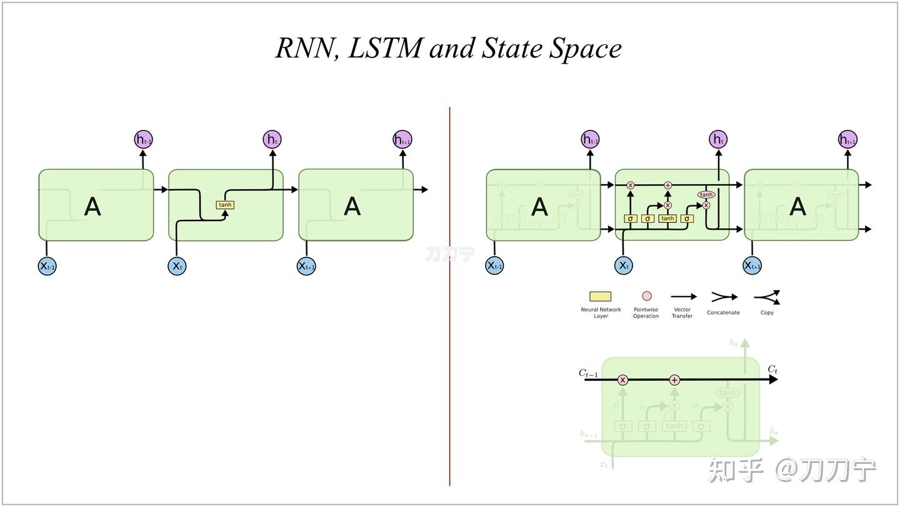

# 简单图解一下线性注意力机制
> _**作者: 刀刀宁**_
> 
> _**原文: https://zhuanlan.zhihu.com/p/718156896**_

[线性注意力机制](https://zhida.zhihu.com/search?content_id=247720361&content_type=Article&match_order=1&q=%E7%BA%BF%E6%80%A7%E6%B3%A8%E6%84%8F%E5%8A%9B%E6%9C%BA%E5%88%B6&zhida_source=entity)的文章有很多了，在本篇笔记中，我们简单的对各种方法进行一下图解比较，**串一下当前的线性注意力机制**，涉及的公式极少，主打一个把逻辑脉络梳理一下。本文会从 state space model [中间状态模型](https://zhida.zhihu.com/search?content_id=247720361&content_type=Article&match_order=1&q=%E4%B8%AD%E9%97%B4%E7%8A%B6%E6%80%81%E6%A8%A1%E5%9E%8B&zhida_source=entity)这样一条主线，来梳理 RNN、LSTM 再到 Retentive、GLA 等 Linear Attention 的改进版，最后再到 Mamba、Mamba-2、RWKV 等方法。

线性注意力机制的好处看起来太多了，甚至可以用**多快好省**来形容。理论复杂度低，本身的速度快，结构简单直接，上下文长度线性依赖，KVCache 不需要额外存储，优化起来也容易。但是相比 full attention 来说，线性注意力机制的表达能力，确实也差一截。并且没法完全丢弃历史信息，很像 RNN 中遗忘和依赖关系，所以又有各种改进方法。

同时，线性注意力也有很多并行和 IO 感知的优化，不然复杂度线性了，并行和运算速度还不如 full attention，岂不是丢人丢大发了。所以如何结合硬件（其实主要是 CUDA GPU 的特点）来做好注意力机制的系统级优化，也是方法中不可忽略的问题。

### **Part 1，Linear Attention 与非必要 softmax**

Linear Attention Transformers ([\*Transformers are RNNs: Fast Autoregressive Transformers with Linear Attention (mlr.press)](https://link.zhihu.com/?target=https%3A//proceedings.mlr.press/v119/katharopoulos20a/katharopoulos20a.pdf))，论文是 2020 年的。

为了帮助理解，先翻出苏神 2020 的文章，[线性 Attention 的探索：Attention 必须有个 Softmax 吗？](https://link.zhihu.com/?target=https%3A//spaces.ac.cn/archives/7546)，以及 [超无聊的：Gated Linear Attention Transformers with Hardware-Efficient Training](https://zhuanlan.zhihu.com/p/672824235) 来看一下将 softmax 函数去掉之后的 attention 机制。这里去掉了公式和证明，需要的同学可以移步前面几篇文档。

现在下图左图是原来的 attention，[矩阵乘法](https://zhida.zhihu.com/search?content_id=247720361&content_type=Article&match_order=1&q=%E7%9F%A9%E9%98%B5%E4%B9%98%E6%B3%95&zhida_source=entity)顺序以及计算复杂度，L 是序列也就是上下文的长度，当前复杂度是 L 平方级的，这时我们所熟悉的。而下图右图则是将 softmax 去掉，用近似的函数 sim 来替代并且改变了 QKV 的计算顺序（这也就是本文中提到的典型**线性注意力机制**），这时神奇的事情发生了，中间结果从 L\*L 的矩阵变成了 d\*d 的，同时复杂度变成了 d 平方 L 线性的（当然 d 如果是 4096 这个级别，d 平方已经在千万级别也不小了，这时还有工作可以考虑减小 d 等等），但是整个运算过程确实和 L 的长度呈[线性相关性](https://zhida.zhihu.com/search?content_id=247720361&content_type=Article&match_order=1&q=%E7%BA%BF%E6%80%A7%E7%9B%B8%E5%85%B3%E6%80%A7&zhida_source=entity)了。

好，那么疑问来了，这只是 softmax 的原因吗？

刚开始我是这样以为的，但是随着后续的深入我发现其实这和 softmax 关系不大，让我们带着疑问继续往后面看。

这 part 还没结束，刚刚我们展示的是 prefill 阶段或者是整体大矩阵相乘的阶段，那么现在让我们看一下如果是在 自回归阶段或者生成阶段，一个 token 一个 token 进行输出时，[矩阵计算](https://zhida.zhihu.com/search?content_id=247720361&content_type=Article&match_order=1&q=%E7%9F%A9%E9%98%B5%E8%AE%A1%E7%AE%97&zhida_source=entity)又是怎么的呢？

那么如下图左图就是我们熟悉的 full attention 的形式，而右图则是在这样的线性注意力机制，每一次解码时的矩阵乘法过程，略有不同的是，每一次计算出的中间结果 d\*d 的矩阵，是可以直接叠加到历史中间矩阵的。那么这个中间矩阵，我们可以称之为 _State Space Model ，_也就是可以理解为是一种中间状态模型，而每一次新的 SSM 则可以和之前的所有 SSM 直接进行相加。这在数学上和前面的 prefill 阶段[大矩阵乘法](https://zhida.zhihu.com/search?content_id=247720361&content_type=Article&match_order=1&q=%E5%A4%A7%E7%9F%A9%E9%98%B5%E4%B9%98%E6%B3%95&zhida_source=entity)是一样的了。

然后我们再看一下在不同长度时候，full attention 和 [linear attention](https://zhida.zhihu.com/search?content_id=247720361&content_type=Article&match_order=1&q=linear+attention&zhida_source=entity) 两者的区别，full attention 的 L 在增加， attention 第二步的矩阵长度就在增加，而 linear attention 中的 SSM 大小则一直是 d\*d。

### **Part 2，Linear Attention 的 state space 和 full attention 的本质区别**

再进一步来看的话，full attention 因为每一次都增加了运算长度，进而保留了每一个 query 和历史上每一个生成的 token 之间的关系，而 linear attention 因为每次都在更新 SSM ，所有信息都保留在了 SSM 里，SSM 大小不变，叠加进去的具体次数的信息因为加法操作后失去了 query 的指向标签，在运行时是无法再将具体哪一次的信息单独抽取出来的。

同时，既不能强调什么，也不能丢弃什么，也就是说重点也不能突出，非重点也不会忘记，就好像一锅粥一样。左脑都是面粉，右脑都是水，脑子一动就都是浆糊。没法精炼提取太多有价值的信息出来。

这时大家应该对于两者的区别有所直观感受了， softmax 除了在当次加大了重点，抛弃了非重点之外，更重要的是因为 softmax 的存在，QKV 的运算公式变成了 L 平方，进而保留了所有 token 和 token 之间的相对关系，使得信息与信息关系全部得到的完整的保留。重点的需要强调的一旦运算就得到了突出，非重点的该遗忘的多次运算后就选择了遗忘。同时，无法有效的对当前语义和之前某个具体节点进行有效的依赖。

因此，我们可以理解为 SSM 实现了对每一个历史步骤的记录和压缩，但是忽略了具体的步数索引。

### **Part 3，RNN、LSTM 与 cell state、**[**state space model**](https://zhida.zhihu.com/search?content_id=247720361&content_type=Article&match_order=2&q=state+space+model&zhida_source=entity)

这时我们自然而然的想到了什么，是不是这就是 RNN ？RNN 中的那个 hidden state ，就是这里的一个 state space model 的中间状态矩阵。

所以 Linear Attention Transformers 的论文名字就叫 **Transformers are RNNs**: Fast Autoregressive Transformers with Linear Attention。

是不是很熟悉的感觉，RNN 也是同样面临无法有效的对当前语义与之前某个具体节点进行有效的依赖的问题，所以就有了 LSTM 这样的技术，LSTM 是长短期记忆，它通过一系列门控和[组合机制](https://zhida.zhihu.com/search?content_id=247720361&content_type=Article&match_order=1&q=%E7%BB%84%E5%90%88%E6%9C%BA%E5%88%B6&zhida_source=entity)，使得在下图右下图中的 hidden state space 中的状态可以根据输入捕捉到历史信息中关联最紧密的某些信息。

帮助理解：[LSTM 网络原理：通过图解，一步一步“走过”LSTM](https://link.zhihu.com/?target=https%3A//xiaosheng.blog/2017/09/16/what-is-lstm)，[《Understanding LSTM Networks》](https://link.zhihu.com/?target=http%3A//colah.github.io/posts/2015-08-Understanding-LSTMs/)。

因此，大家可以发现，[长短期记忆](https://zhida.zhihu.com/search?content_id=247720361&content_type=Article&match_order=2&q=%E9%95%BF%E7%9F%AD%E6%9C%9F%E8%AE%B0%E5%BF%86&zhida_source=entity)网络（LSTM）的关键在于[单元状态](https://zhida.zhihu.com/search?content_id=247720361&content_type=Article&match_order=1&q=%E5%8D%95%E5%85%83%E7%8A%B6%E6%80%81&zhida_source=entity)（cell state），而这实际上就是本文中的[状态空间](https://zhida.zhihu.com/search?content_id=247720361&content_type=Article&match_order=1&q=%E7%8A%B6%E6%80%81%E7%A9%BA%E9%97%B4&zhida_source=entity)（state space），即贯穿图顶部的水平线。单元状态类似于一条输送带，它在整个链条上持续运行，仅存在一些微小的[线性相互作用](https://zhida.zhihu.com/search?content_id=247720361&content_type=Article&match_order=1&q=%E7%BA%BF%E6%80%A7%E7%9B%B8%E4%BA%92%E4%BD%9C%E7%94%A8&zhida_source=entity)。而我们需要的信息则能够以不变的、或者我们期望的状态持续流动下去。

### **Part 4，Linear Attention Recurrent Representation**

在 RNN 和 LSTM 中的 hidden state 的暗线，我们现在可以把 Linear Attention 拿过来进行套用表示了，可以发现，和 RNN 、LSTM 来进行对比就会发现，状态线是一样的，而输入则由直接输入变成了 QKV 三类键值。而相比 full attention，KV 先乘和之前 t-1 的 SSM 进行叠加得到 t 的 SSM ，再和 Q 相乘得到输出。

### **Part 5，Linear Attention 的变种：Retention 与 GLA**

一旦图解之后，就发现这条技术线上的几个热门方法都可以往套了。

例如：[Retentive Network: A Successor to Transformer for Large Language Models](https://link.zhihu.com/?target=http%3A//arxiv.org/abs/2307.08621)，当然，其实我用的这个图的雏形就是来自于 retention 这篇论文之中。

其实核心公式也不复杂，增加了一个用来控制对之前 SSM 状态的一个加权控制。

如果回到我们上面的图片逻辑表达方式上，就可以简单表达为如下图的形式：

如此简洁的结构必然存在一定的问题，其与循环神经网络（RNN）和[长短期记忆网络](https://zhida.zhihu.com/search?content_id=247720361&content_type=Article&match_order=2&q=%E9%95%BF%E7%9F%AD%E6%9C%9F%E8%AE%B0%E5%BF%86%E7%BD%91%E7%BB%9C&zhida_source=entity)（LSTM）具有一定的类比性，需要更为复杂的带有遗忘门（forget gate）的注意力机制/状态空间结构。并且这里的遗忘门是输入数据依赖的，并非如保留机制（retention）中人为固定的。

[Gated Linear Attention Transformers with Hardware-Efficient Training](https://link.zhihu.com/?target=http%3A//arxiv.org/abs/2312.06635)，arXiv 2312.06635

因此，GLA 模型的结构与 LSTM/GRU 类似，其门控不依赖于上一层[递归](https://zhida.zhihu.com/search?content_id=247720361&content_type=Article&match_order=1&q=%E9%80%92%E5%BD%92&zhida_source=entity)的状态，并且具有[非线性结构](https://zhida.zhihu.com/search?content_id=247720361&content_type=Article&match_order=1&q=%E9%9D%9E%E7%BA%BF%E6%80%A7%E7%BB%93%E6%9E%84&zhida_source=entity)，主要是 G 矩阵也类似 QKV 的结构得到的。在门控计算完成后，整个模型依然属于线性循环神经网络（RNN）的范畴。

注意这里的⊙符号代表 element-wise 的计算，称为 hadamard 乘法，不是矩阵乘法。

同理，我们再回到熟悉的 [recurrent](https://zhida.zhihu.com/search?content_id=247720361&content_type=Article&match_order=1&q=recurrent&zhida_source=entity) 表示形式上来，我们发现将公式揉出来的对应结构图，变复杂不少，输入输出各增加了一个新的[门控机制](https://zhida.zhihu.com/search?content_id=247720361&content_type=Article&match_order=1&q=%E9%97%A8%E6%8E%A7%E6%9C%BA%E5%88%B6&zhida_source=entity)。

GLA 应当也算当下效果较好的 Linear Attention 的改进版。

### **Part 6，Mamba**

Mamba 结构其实和 Linear Attention 关系不大，和 RNN 系列更像，我们今天在这里一起进行一下类比，对比学习效率高。

中文博客中可以参考七月在线的 [一文通透想颠覆Transformer的Mamba：从SSM、HiPPO、S4到Mamba\_mamba模型](https://link.zhihu.com/?target=https%3A//blog.csdn.net/v_JULY_v/article/details/134923301) ，另外英文博客可以参考：[A Visual Guide to Mamba and State Space Models](https://link.zhihu.com/?target=https%3A//newsletter.maartengrootendorst.com/p/a-visual-guide-to-mamba-and-state)。整体讲的都很清晰。其中也详细讲解了 Mamba 与 RNN 的关系，也涉及到了 SSM 的关系。

回到我们的故事线上，先看一下 Mamba 的 S4 结构，S4 结构的公式本身并不复杂，我们可以根据公式简单的对 其 recurrent 结构进行表示（这个图严格意义上说不是非常准确）。这里的 ABCD 四个矩阵，其中 A 是一个结构化的 HiPPO 矩阵，其作用是为了对 hidden state 进行加权。

接下来我们看一下 S4 到 S6，主要是增加了 selective 和 scan 两类操作，S4 的问题在于线性不变性（Linear Time Invariance）中，SSM 依赖的 A、B 和 C 不会随不同的输入而变化。

而 selective 的处理方式是给这每个维度或者叫做每个通道都维护一个独立的 SSM。这个维度或者通道当然是模型设计者手工设计出来的，但是其物理含义也是显而易见，不同的维度维护了不同的信息，这和 [multihead](https://zhida.zhihu.com/search?content_id=247720361&content_type=Article&match_order=1&q=multihead&zhida_source=entity) Attention 中不同的注意力头，维护了不同的注意力，是一样的。

而 scan 更多是为了支持在 selective 机制下进行 parallel 处理时候的加速过程。细节不展开了。

有了 selective 和 scan 机制之后，mamba 模型就可以更加高效的、有选择性的关注必须关注的、过滤掉可以忽略的，信息。

### **Part 7，Mamba-2**

Mamba 很火，学术界水文神器，但是实测效果一言难尽，现在又出来了 Mamba2，我暂时还没跟进实测效果，但是其中提出了一些新的概念，如 SSM 衍生的 SSA、SSD。作者是 Tri Dao 和 Albert Gu，和Mamba 一样。题目直接就是：Transformers are SSMs，[arXiv 2405.21060](https://link.zhihu.com/?target=http%3A//arxiv.org/abs/2405.21060)，大家也可以移步七月在线的解读版本查看详情：[一文通透mamba2「力证Transformer are SSM」：从SSM、半可分矩阵、SMA、SSD到mamba2](https://link.zhihu.com/?target=https%3A//blog.csdn.net/v_JULY_v/article/details/140131413) ，还有[机器之心](https://zhida.zhihu.com/search?content_id=247720361&content_type=Article&match_order=1&q=%E6%9C%BA%E5%99%A8%E4%B9%8B%E5%BF%83&zhida_source=entity)版本：[再战Transformer！原作者带队的Mamba 2来了，新架构训练效率大幅提升](https://link.zhihu.com/?target=https%3A//www.jiqizhixin.com/articles/2024-06-04-7)。以及 tri dao 的博客：[State Space Duality (Mamba-2) Part I - The Model](https://link.zhihu.com/?target=https%3A//goombalab.github.io/blog/2024/mamba2-part1-model/)

其中，SSA 是 state space Attention，SSD 是 state space duality，好玩吧，大家又碰头了，前面我们提到 mamba 的结构中，没有 QKV，好，现在他来了，闪亮登场。

我们可以理解 SSD 是个 dual model 的双模逻辑，有点像比亚迪的 DMi，但是更像是风靡一时的掼蛋，从大规则上看是升级，小规则上看则是斗地主。

Mamba-2 的 SSD 设计初衷，从大的逻辑上看，是个 full Attention 结构，但是通过各种 mask 和分块模式，将整体转换为一个有一个小的分块，每一个分块内部则是一个“线性”的 SSM 模式。SSD 就如上图右图中的重叠部分，即有 SSM 的特点又有 SMA 的特点。

而实际上，在下图左图来看，其实这个图和我本篇笔记想做的事情正好相反，我是希望通过画图可视化所有方法成为一种 recurrent 形式的表示，而下图右图则将几个常见方法放回 full attention的下[三角矩阵](https://zhida.zhihu.com/search?content_id=247720361&content_type=Article&match_order=1&q=%E4%B8%89%E8%A7%92%E7%9F%A9%E9%98%B5&zhida_source=entity)，通过 Mask 和权重颜色，完成对这些方法的一种统一表示。例如，前面我们分析的 retentive 网络事实上就是一种从中间三角逐渐向左下角衰减的权重形式。而今天 SSD 想用的方法则是通过 1-SS 这种方式，形成一种分块的、逐渐衰减的、可以控制的注意力机制。而具体实现上，则是通过分块后的局部低秩（Low-Rank）矩阵的方法。表达归表达，实现归实现嘛。

这样也从另外一个角度说明，从底层数学角度，recurrent 和 full attention 都可以用统一的方式进行描述和表达。Transformers are RNNs，Transformers are SSM，哈哈。

当然，这只是 Mamba-2 注意力模块的部分，关于 Mamba 的全流程框架，以及一些细节，比如 multihead SSM 等等，本文暂时先按下不表。

另外，我认为，Mamba2 有点过于复杂了，雕花味道太冲了，并且它硬要把 full attention 的优势点往 mamba 这种纯 rnn 模型上怼，说好听是 dual 双模，说不好听就是变相承认 mamba 不太行。并且这几个月来看，业界反应也是不温不火。所以 Mamba2 咋样，且行且看吧。

### **Part 8，RWKV**

好，到了最后一道菜了，也是大火的 RWKV。

RWKV 的文档很多了，[一起啃大模型：RWKV解读：在Transformer的时代的新RNN](https://zhuanlan.zhihu.com/p/656323242)，苏建林的：[如何评价最新的RWKV论文 (arXiv 2305.13048)？](https://www.zhihu.com/question/602564718/answer/3062973388)，作者的：[PENG Bo：RWKV：用 RNN 达到 Transformer 性能，且支持并行模式和长程记忆，既快又省显存，已在14B参数规模检验](https://zhuanlan.zhihu.com/p/599150009)

从结构图可以看出，RWKV 中的 time mixing 模块，就是我们本文比较关注的重点，如何通过 SSM 的 hidden state，来将我们熟悉的 Transformer 中的 Attention 部分替换为 RWKV 独有的 recurrent 方式。所以，RWKV就是一个的线性 RNN 模型，算不算和 GLA 相类似的结构，表面上肯定是不一样的，底层逻辑上是否相似或有本质区别，研究不够深入暂时先不能做出判断。

### **总结：**

这篇笔记憋了不短时间了，要学习和思考的东西不少。

我通过 state space model 的 recurrent 表达形式，把前面各种方法的大体思路进行了一定的梳理和总结，很多细节没有展开，或者存在一些错误，还请各位小伙伴帮忙批评指正。我再慢慢更新这篇笔记。

同时，本文没有分析各个方法的运算友好程度，运算优化方式等等方面，另外本文没有太考虑这些方法的训练方法，包括常规训练和长文本训练外推的逻辑等等。

* * *

*   [刀刀宁：笔记：学习推理加速半年之总结与迷思](https://zhuanlan.zhihu.com/p/704938096)
    
*   [刀刀宁：聊聊大模型推理服务之投机推理](https://zhuanlan.zhihu.com/p/699166575)
    
*   [刀刀宁：聊聊大模型推理服务之长上下文](https://zhuanlan.zhihu.com/p/698138500)
    
*   [刀刀宁：聊聊大模型推理服务中的优化问题](https://zhuanlan.zhihu.com/p/677650022)
    
*   [刀刀宁：聊聊大模型推理中的分离式推理](https://zhuanlan.zhihu.com/p/706469785)
    
*   [刀刀宁：聊聊大模型推理中的 KVCache 压缩](https://zhuanlan.zhihu.com/p/708946312)
    
*   [刀刀宁：聊聊大模型推理中 KVCache 压缩方法的性能评测](https://zhuanlan.zhihu.com/p/709684237)
    
*   [刀刀宁：聊聊大模型推理中的 Prompt Compression](https://zhuanlan.zhihu.com/p/710508401)
    
*   [刀刀宁：笔记：简单回顾一下机器视觉领域推理加速技术](https://zhuanlan.zhihu.com/p/713916261)
    
*   [刀刀宁：聊聊大模型推理的动态稀疏化之二：MInference1 与 PowerInfer2](https://zhuanlan.zhihu.com/p/711399792)
    
*   [刀刀宁：聊聊大模型推理中的 KVCache 之异构缓存](https://zhuanlan.zhihu.com/p/714288577)
    
*   [刀刀宁：聊聊大模型推理中的 KVCache 异构缓存之二](https://zhuanlan.zhihu.com/p/715921106)
    

*   [刀刀宁：量化那些事之 KVCache 的量化](https://zhuanlan.zhihu.com/p/691537237)
    
*   [刀刀宁：量化那些事之 Diffusion 量化](https://zhuanlan.zhihu.com/p/693474068)
    
*   [刀刀宁：笔记：Llama.cpp 代码浅析（一）：并行机制与KVCache](https://zhuanlan.zhihu.com/p/670515231)
    
*   [刀刀宁：笔记：Llama.cpp 代码浅析（四）：量化那些事](https://zhuanlan.zhihu.com/p/672983861)
    
*   [大模型推理加速技术的学习路线是什么?](https://www.zhihu.com/answer/3380020160)
    

编辑于 2024-09-13 09:39・IP 属地湖南