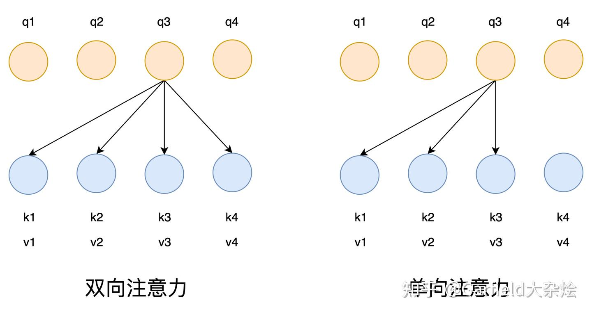
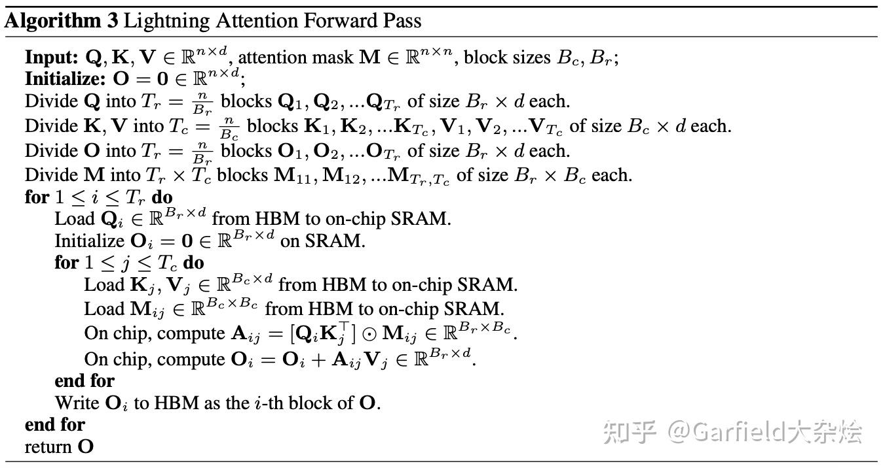
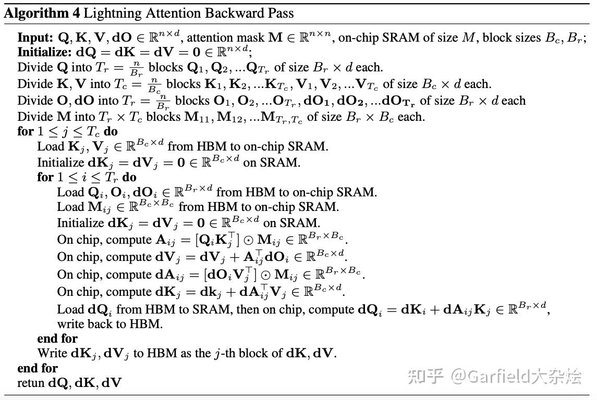
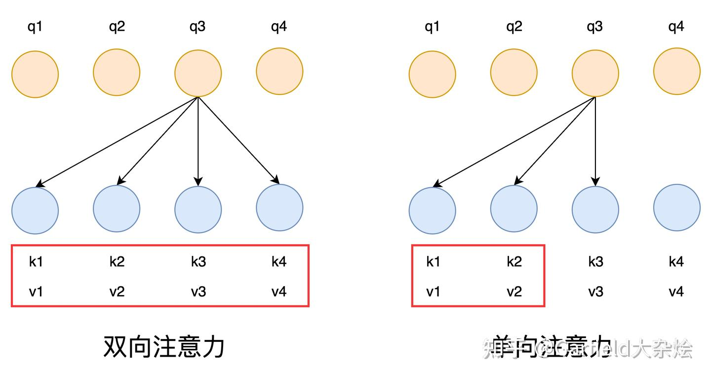
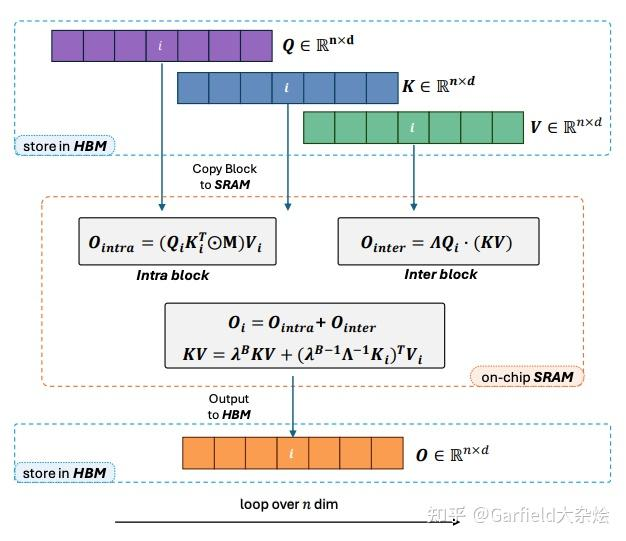
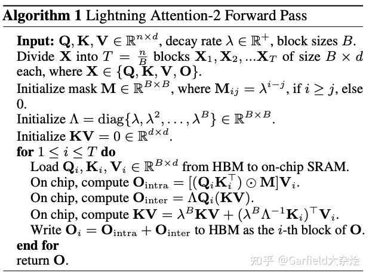
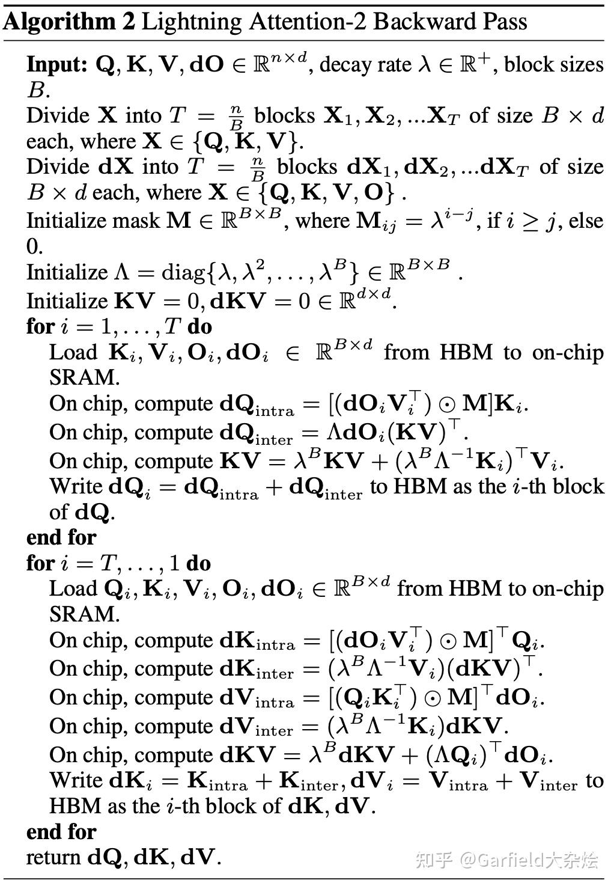

# 线性注意力进化史
> **作者: Garfield大杂烩**
> 
> **原文: https://zhuanlan.zhihu.com/p/20473885314**

引言
--

[MiniMax-01: Scaling Foundation Models with Lightning Attention](https://link.zhihu.com/?target=https%3A//filecdn.minimax.chat/_Arxiv_MiniMax_01_Report.pdf)表明自己是第一个将[线性注意力](https://zhida.zhihu.com/search?content_id=253116978&content_type=Article&match_order=1&q=%E7%BA%BF%E6%80%A7%E6%B3%A8%E6%84%8F%E5%8A%9B&zhida_source=entity)应用到如此大规模的模型，他所使用的核心技术就是Lightning Attention。

那为什么线性注意力20年在文章[Transformers are RNNs: Fast Autoregressive Transformers with Linear Attention](https://link.zhihu.com/?target=https%3A//arxiv.org/abs/2006.16236)中就提出了，现在才出第一个线性注意力的大模型呢？

本文就从[线性注意力机制](https://zhida.zhihu.com/search?content_id=253116978&content_type=Article&match_order=1&q=%E7%BA%BF%E6%80%A7%E6%B3%A8%E6%84%8F%E5%8A%9B%E6%9C%BA%E5%88%B6&zhida_source=entity)入手，详细探讨其起源、存在的显著局限性，以及Lightning Attention的具体实现细节。

原始注意力
-----

现在主流的有两类模型，一种是应用双向注意力的`bert`类模型，另一种是应用单向注意力的`gpt`类模型，他们所使用的注意力其实是有细微差别的。

*   双向注意力（bert类），就是传统认知中标准的注意力

\\(Attention⁡(Q,K,V)=softmax⁡(QK^{T}⊙Md)V\\)

*   单向注意力（因果模型，`gpt`类），只能看到当前和前面的`token`，所有要在`softmax`之前乘上一个掩码矩阵，`M`为单向掩码矩阵

\\(Attention⁡(Q,K,V)=softmax⁡(QK^{T}⊙Md)V\\)

其中`Q、K、V`每个矩阵的维度都是`[n, d]`，即`[序列长度，隐层维度]`，此时 QK^{T} 的维度是`[n, n]`，所以整体复杂度是 O(n2d) 。其中d是固定大小， n2 随着序列长度平方增加，就主导了整体的复杂度。

线性注意力
-----

原始注意力中softmax的作用主要是引入非线性（取概率化再与V乘都是次要的），那就可以将其换成其他的[非线性激活函数](https://zhida.zhihu.com/search?content_id=253116978&content_type=Article&match_order=1&q=%E9%9D%9E%E7%BA%BF%E6%80%A7%E6%BF%80%E6%B4%BB%E5%87%BD%E6%95%B0&zhida_source=entity)。 \\(Attention(Q,K,V)=(ϕ(Q)ϕ(K)^{T})V\\) 这里的 ϕ 代表所使用的激活函数，有很多种可以选择（论文常用的有 `1+elu`）。这里的归一化就先省略掉了，有一些论文就将K矩阵的归一化放到分母上（或者说K矩阵归一化的逆）。

此时观察，使用softmax必须等 \\(QK^{T} \\) 先计算完，而使用其他的激活函数只对单个Q或者K进行运算，不需要绑定 \\(QK^{T}\\) 。所以就可以将左乘变成右乘 \\((ϕ(Q)ϕ(K)T)V=ϕ(Q)(ϕ(K)TV) 此时 ϕ(K)TV\\) 的复杂度是 \\(O(d^2)\\) ，所以整体复杂度变成了 \\(O(nd^2)\\) ，随着序列长度`n`线性增长，此时就是线性注意力了。

（可选）：通常线性注意力的公式还有如下形式

\\(O=Δ^{-1}QK^{T}\*V\\) （可选）其中，Δ起到了归一化的作用。Δ的每个对角元素是 \\(K^{T} ∗1\\) 的值,这反映了每个键向量的重要程度。将 \\(Δ^{-1}\\) 乘到结果上,就相当于对注意力输出进行了逆归一化。相当于只对K归一化，Q本身就是一个合适的查询向量，不需要归一化。

因果模型存在的问题
---------

注意上面的线性注意力是类bert模型的情况下，并没有与掩码矩阵相乘，此时可以顺畅的先右乘来降低复杂度。但现在的大模型都是生成模型，使用的因果模型结构，都是单向注意力，就必须要乘以掩码矩阵，所以不能顺畅的右乘了。 左乘线性注意力公式如下，输出为O，每个step的输出为当前的 qt 乘以前面的 kj ，再乘以 vj 累加求和。此时 QK^{T} 可以正常进行矩阵运算，然后使用 ⊙ （Hadamard Product）进行逐元素相乘，得到掩码后的矩阵。

\\(O=(QK^{T}⊙M)V\\)

\\(o\_t =\\sum\_{j=1}^{t}{{({q}\_t^T{k}\_j)}{v}\_j}\\)

此时注意，上面公式的运算涉及 ⊙ ，它不适用于[矩阵乘法交换律](https://zhida.zhihu.com/search?content_id=253116978&content_type=Article&match_order=1&q=%E7%9F%A9%E9%98%B5%E4%B9%98%E6%B3%95%E4%BA%A4%E6%8D%A2%E5%BE%8B&zhida_source=entity)和结合律，即无法 \\( Q(K^{T}⊙MV)\\)。 ⊙ 是逐元素相乘，所以两个矩阵的维度必须相同，即使将M的位置放到前面，\\( K^{T}V \\) 的维度是\[d, d\]，也无法与M逐元素相乘。

累加求和操作的限制
---------

双向注意力模型（bert）中使用的线性注意力如下，可以先算KV

\\((ϕ(Q)ϕ(K)^{T})V=ϕ(Q)(ϕ(K)^{T}V)\\)

QKV的维度都为\[n, d\]，这里假设序列长度为4，双向和单向注意力如下图



*   双向注意力计算 K和V的矩阵如下，得到的 KTV 的维度是\[d, d\]

\\(K^T = \[k\_1^T, k\_2^T, k\_3^T, k\_4^T\] =  \\begin{bmatrix}  k\_{11} & k\_{21} & k\_{31} & k\_{41} \\\\  k\_{12} & k\_{22} & k\_{32} & k\_{42} \\\\  \\vdots & \\vdots & \\ddots & \\vdots \\\\  k\_{1d} & k\_{2d} & k\_{3d} & k\_{4d}  \\end{bmatrix}\\)

\\(V =  \\begin{bmatrix}  v\_1 \\\\  v\_2 \\\\  v\_3 \\\\  v\_4  \\end{bmatrix} =  \\begin{bmatrix}  v\_{11} & v\_{12} & \\cdots & v\_{1d} \\\\  v\_{21} & v\_{22} & \\cdots & v\_{2d} \\\\  v\_{31} & v\_{32} & \\cdots & v\_{3d} \\\\  v\_{41} & v\_{42} & \\cdots & v\_{4d}  \\end{bmatrix}\\)

\\(K^T V = \[k\_1^T v\_1 + k\_2^T v\_2 + k\_3^T v\_3 + k\_4^T v\_4\] =  \\begin{bmatrix}  \[K^T V\]\_1 \\\\  \[K^T V\]\_2 \\\\  \\vdots \\\\  \[K^T V\]\_d  \\end{bmatrix}\\)

此时计算 \\(q\_3 \\) 的注意力输出就可以使用以下方法。注意这是点积，\\(q\_3 \\) 是一个向量，\\(K^TV\\) 是一个矩阵，向量在与矩阵点积的时候会进行广播拓展，复制成多份分别与矩阵中的向量点积。 \\(\\left\[K^TV\\right\]\_1\\) 是一个向量，\\(q\_3 \\left\[K^TV\\right\]\_1\\) 点积后会得到一个值，所以 \\(q\_3 K^TV\\) 最终的结果是一个向量，长度为隐层维度 d。 \\(q\_3 K^TV = q\_3 \\begin{bmatrix} \\left\[K^TV\\right\]\_1 \\ \\left\[K^TV\\right\]\_2 \\ \\vdots \\ \\left\[K^TV\\right\]\_d \\end{bmatrix} = \\begin{bmatrix} Q\_3 \\left\[K^TV\\right\]\_1 \\ Q\_3 \\left\[K^TV\\right\]\_2 \\ \\vdots \\ Q\_3 \\left\[K^TV\\right\]\_d \\end{bmatrix}\\)

也可以使用以下代码测试

```text-plain
q3 = torch.tensor([1, 2, 3, 4, 5, 6])
print(q3)

# [n, d] = [4, 6]
kT = torch.tensor([[1, 1, 1, 1], 
                   [2, 2, 2, 2], 
                   [3, 3, 3, 3], 
                   [4, 4, 4, 4],
                   [5, 5, 5, 5],
                   [6, 6, 6, 6]])
v = torch.tensor([[1, 1, 1, 1, 1, 1], 
                  [1, 1, 1, 1, 1, 1], 
                  [1, 1, 1, 1, 1, 1], 
                  [1, 1, 1, 1, 1, 1]])

print('kT @ v', kT @ v)
# q与(k.T @ v)的点积
result = torch.matmul(q, kT @ v)
print('result', result)
```

此时 \\(K^T V\\) 的结果是双向的，\\(k\_3\\) 的输出矩阵中使用了 \\(v\_4\\) ，这样双向注意力就可以顺畅的右乘得到 \\(K^T V\\) 结果再与 Q 相乘，得到所有 token 的输出。 但因模型的注意力是单向的，\\(K^T V\\) 在计算的时候前面的 K 不能与后面的 V 相乘，所以只能一个个算然后累加求和。\\( o\_1 = q\_1(k\_1^Tv\_1) o\_2 = q\_2(k\_1^Tv\_1 + k\_2^Tv\_2) o\_3 = q\_3(k\_1^Tv\_1 + k\_2^Tv\_2 + k\_3^Tv\_3) o\_4 = q\_4(k\_1^Tv\_1 + k\_2^Tv\_2 + k\_3^Tv\_3 + k\_4^Tv\_4)\\) 这样的累加操作无法进行高效的矩阵乘法，虽然计算复杂度降低了，但实际运算的效率并不高。

Lightning Attention
-------------------

到这里可以引出`MiniMax-01` 中所使用的`Lightning Attention`了，但其实这个注意力有两个版本，`MiniMax-01`中所提到的就是是`Lightning Attention-2`，那咱们先看看第一个版本做了什么。

### Lightning Attention-1

源自：[TransNormerLLM: A Faster and Better Large Language Model with Improved Transformer](https://link.zhihu.com/?target=https%3A//arxiv.org/abs/2307.14995)

Lightning Attention-1针对于原始注意力取消了softmax，使用Swish激活函数代替。即先变成了 \\(Attention⁡(Q,K,V)=(ϕ(Q)ϕ(K)^{T}⊙M)V\\) 然后还是先左乘计算，并没有解决线性注意力的根本问题，但是借鉴了 `flash attention` 中的硬件加速。

其前向和反向传播流程如下，就是将QKV切块，放到高速SRAM中去计算。虽然变快了，但此时的复杂度还是 \\(O(n^2d)\\) 。





### Lightning Attention-2

源自：[Lightning Attention-2: A Free Lunch for Handling Unlimited Sequence Lengths in Large Language Models](https://link.zhihu.com/?target=https%3A//arxiv.org/abs/2401.04658)

Lightning Attention-2 解决了因果模型在计算单向注意力时，需要进行累加和操作导致无法矩阵运算的情况，实现了单向注意力先计算右乘，成功将复杂度降为 \\(O(nd^2)。 o\_1 = q\_1(k\_1^Tv\_1) o\_2 = q\_2(k\_1^Tv\_1 + k\_2^Tv\_2) o\_3 = q\_3(k\_1^Tv\_1 + k\_2^Tv\_2 + k\_3^Tv\_3) o\_4 = q\_4(k\_1^Tv\_1 + k\_2^Tv\_2 + k\_3^Tv\_3 + k\_4^Tv\_4) \\)再将这个累加和公式拿过来，配合下图观察发现，之前的问题是每次计算 \\(QK^T\\) 都在整个序列上计算，这样每次都是所有序列的 token 互相注意到。那如果在序列这个维度拆分成小份，比如图中右侧先计算 \\(k\_1\\) 和 \\(k\_2\\)，然后用于 \\(q\_3\\) 的计算就完全没有问题，\\(k\_4\\) 后面的就不计算了。这样就既能矩阵运算，又能符合单向掩码。 公式中也可以发现，当前 step 之前的 k 和 v 是可以相乘的，比如 \\(q\_3\\) 在计算时，可以将 \\(k\_1^Tv\_1 + k\_2^Tv\_2 + k\_3^Tv\_3\\) 使用矩阵操作运算。所以 Lightning Attention-2 将大矩阵拆开，类似 flash attention 拆成多个 block。



这些 block 不能拆分成 n 份，这样 block 的意义就没有了，for 循环计算反而更慢。所以每个 block 中会有多个时间步的 token。 此时这些 block 就可以分为两类，一类是块内（intra block），一类是块间（inter block）。块内代表当前块 q 的序列下标和 k v 序列下标相同，块间即不同。 块内在计算 \\(q\_i\\) 时直接矩阵右乘很容易算上 \\(k\_{i+1}v\_{i+1}\\) ，所以块内使用传统的左乘并与掩码矩阵相乘。块间计算时就可以先右乘计算 K^tV，因为之前的 kv 是可以双向注意力的。然后将之前的 kv 结果缓存下来并更新，用于下一个 step 计算。 下图是 Lightning Attention-2 的结构图，\\(\\lambda\\) 是它的模型所使用的位置编码，忽略即可。



以下是前向传播和反向传播流程。





问题：M矩阵维度是\[B, B\]，相当于每一个块代表了多个序列步n，在对角线位置是1，那在这个块内前面的q就可以注意到后面的kv了

解答：M矩阵维度虽然是\[B, B\]，但只是这么切割，其内部值仍然是下三角。