# 2023年人工智能体&AI&Agent&开发与应用全面调研&概念、原理、开发、应用、挑战、展望
* * *

> **作者: 吃果冻不吐果冻皮**
> 
> **原文:** [**https://mp.weixin.qq.com/s/PWLBX1XnH\_72OoyBi7JEww**](https://mp.weixin.qq.com/s/PWLBX1XnH_72OoyBi7JEww)

人工智能(AI)领域正在快速发展。**今天的AI智能体(AI Agent)能够自己感知、决策和行动。随着大语言模型(LLM)驱动的AI智能体\*\***(AI Agent)的\*\*\*_兴起，我们正处于一个新时代的边缘：**AI**智能体可能会形成自己的社会，与人类和谐共存。_\*

牛顿曾说过：“如果说我看得更远，那是因为我站在巨人的肩膀上”。现在这些巨人，就是人工智能体，他们来帮助承担繁重的工作。

在今天的文章中，我们将介绍一些可以在个人和企业中使用的最佳开源人工智能体和多智能体框架，并将讨论如下内容：

*   人工智能体(AI Agent)如何创造创新和效率的机会。
*   哪些多智能体(Multi Agent)框架提供最佳功能。
*   何时最好地实施人工智能体来解决现实世界的实际问题
*   自主智能体将对人工智能驱动的任务管理产生什么影响。

我们还深入探讨了智能体架构的一些机遇、挑战和趋势。

1 人工智能体(AI Agent)简介
-------------------

ChatGPT、DALL-E 3 或 Midjourney 等工具使用基于提示的界面进行人机交互。这意味着您需要用自然语言编写一组指令（通常随后进行大量的重复提示尝试）才能获得有意义的响应。考虑到人工智能模型的能力，它的速度很慢，而且违反直觉。我们需要更好、更有效的方式来与人工智能交互。

1.1 人工智能体(AI Agent)角色
---------------------

**人工智能体(AI Agent)，扮演着AI监工的角色。它们以自我导向的循环方式工作，为人工智能设置任务、确定优先级和重新确定任务的优先级，直到完成总体目标。**

1.2 人工智能体(AI Agent)原理
---------------------

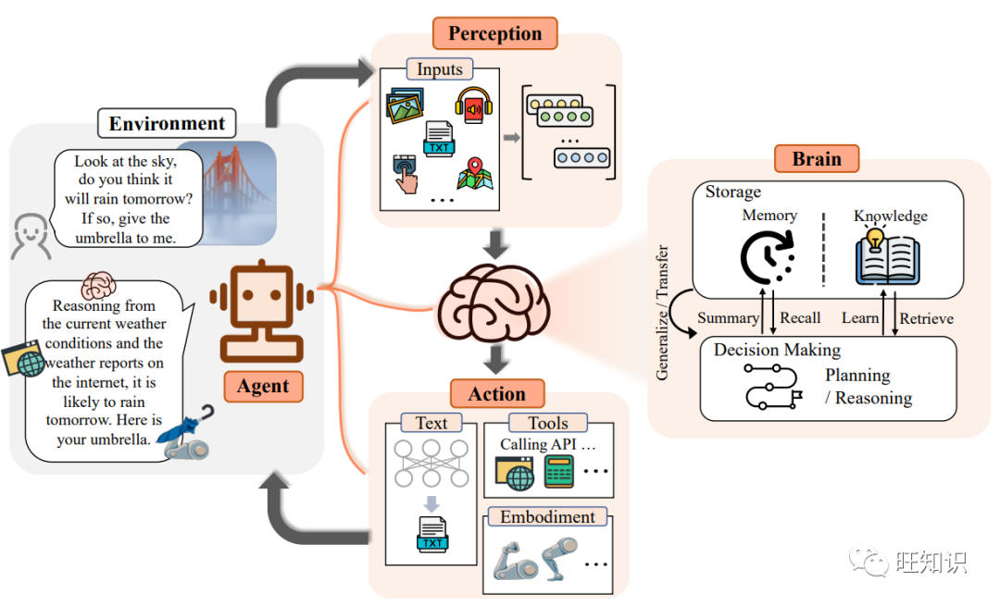

图源：[https://arxiv.org/pdf/2309.07864.pdf](https://arxiv.org/pdf/2309.07864.pdf)

人工智能体(AI Agent)总体框架由大脑、感知、行动三个关键部分组成 ：

*   \*\*大脑(Brain)：\*\*大脑主要由一个大型语言模型组成，不仅存储知识和记忆，还承担着信息处理和决策等功能，并可以呈现推理和规划的过程，能很好地应对未知任务。
*   \*\*感知(Perception)：\*\*感知模块的核心目的是将Agent的感知空间从纯文字领域扩展到包括文字、听觉和视觉模式在内的多模态领域。
*   \*\*行动(Action)：\*\*在Agent的构建过程中，行动模块接收大脑模块发送的行动序列，并执行与环境互动的行动。

人类在感知环境后，大脑会对感知到的信息进行整合、分析和推理，并做出决策。随后，他们利用神经系统控制自己的身体，做出适应环境或创造性的行动，如交谈、躲避障碍或生火。\*\*当一个Agent拥有类似大脑的结构，具备知识、记忆、推理、规划和概括能力以及多模态感知能力时，它也有望拥有类似人类的各种行动来应对周围环境。\*\*在Agent的构建过程中，行动模块接收大脑模块发送的行动序列，并执行与环境互动的行动。

1.3 人工智能体(AI Agent)优势
---------------------

大语言模型驱动的人工智能体(AI Agent)有如下优势：

*   \*\*语言交互：\*\*他们理解和产生语言的固有能力确保了无缝的用户交互。
*   \*\*决策能力：\*\*大语言模型有能力推理和决策，使他们善于解决复杂的问题。
*   \*\*灵活适配：\*\*Agent的适应性确保它们可以针对不同的应用进行成型。
*   \*\*协作交互：\*\*Agent可以与人类或其他Agent协作，为多方面的交互铺平道路。

1.4 人工智能体(AI Agent)应用
---------------------

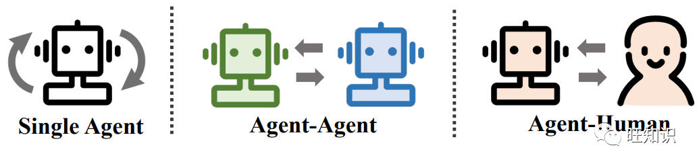图源：[https://arxiv.org/pdf/2309.07864.pdf](https://arxiv.org/pdf/2309.07864.pdf)

人工智能体(AI Agent)的用例广泛且多样。这些智能体由大型语言模型(LLM)进行驱动，可用于各种场景，包括：

*   \*\*单智能体应用：\*\*Agent可以作为个人助理，帮助用户摆脱日常任务和重复劳动。他们能够独立分析、计划和解决问题，减轻个人的工作压力，提高任务解决效率。
*   \*\*多智能体系统：\*\*Agent可以以协作或竞争的方式相互交互。这使他们能够通过团队合作或对抗性互动来实现进步。在这些系统中，Agent可以共同完成复杂的任务或相互竞争以提高其性能。
*   \*\*人机合作：\*\*Agent可以与人互动，为人提供帮助并更高效、安全地执行任务。他们可以理解人类的意图并调整他们的行为以提供更好的服务。人类反馈还可以帮助Agent提高性能。
*   \*\*专业领域：\*\*Agent可以针对特定领域进行训练和专门化，例如软件开发、科学研究或其他行业特定任务。他们可以利用大规模语料库的预训练以及泛化到新任务的能力，在这些领域提供专业知识和支持。

这些只是人工智能体(AI Agent)的几个示例。这些智能体的多功能性使其适合广泛的应用和行业。

1.5 智能体社会(Agent Society)
------------------------

智能体社会(Agent Society)是一个概念，其中使用语言模型创建的人工智能智能体在模拟环境中相互交互。这些智能体可以像人类一样行动、做出决策并参与社交活动。

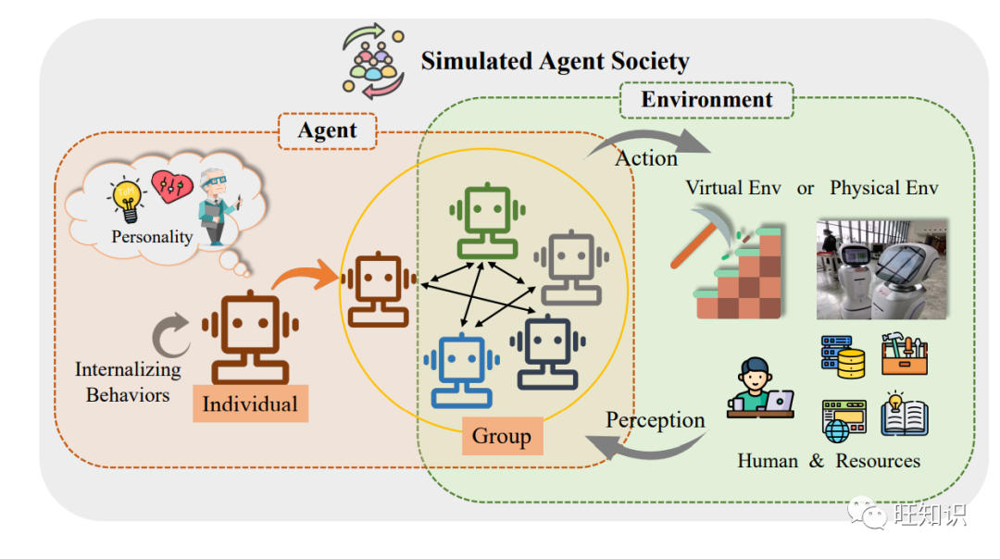图源：[https://arxiv.org/pdf/2309.07864.pdf](https://arxiv.org/pdf/2309.07864.pdf)

它帮助我们了解人工智能体如何在类似社会的环境中协同工作和行为。这种模拟可以提供对协作、政策制定和道德考虑的见解。总体而言，智能体社会帮助我们探索人工智能智能体的社交方面及其在现实和受控环境中的交互。

2 人工智能体(AI Agent)最佳开发框架
-----------------------

有许多框架可以帮助创建人工智能体(AI Agent)，以下是一些最好的框架：

2.1 🦜️🔗 LangChain
-------------------

**框架网址：**[**https://github.com/langchain-ai/langchain**](https://github.com/langchain-ai/langchain)

LangChain是一个用于开发由语言模型支持的应用程序的框架。它使应用程序能够：

*   \*\*感知上下文：\*\*将语言模型连接到上下文源（提示说明、小样本示例、响应的内容等）
*   \*\*推理：\*\*依靠语言模型进行推理（关于如何根据提供的上下文进行回答、采取什么操作等）

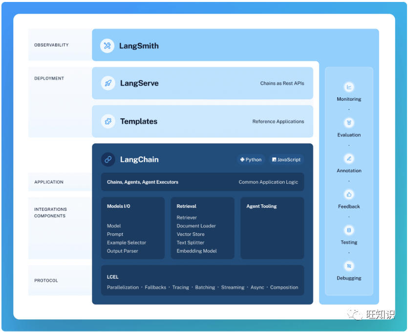  
图源：[https://github.com/langchain-ai/langchain](https://github.com/langchain-ai/langchain)

LangChain框架有以下几个核心组成部分：

*   \*\*LangChain库：\*\*Python和JavaScript库。包含无数组件的接口和集成、将这些组件组合成链和Agent的基本运行时，以及链和Agent的现成实现。
*   \*\*LangChain模板：\*\*一系列易于部署的参考架构，适用于各种任务。
*   \*\*LangServe：\*\*用于将LangChain链部署为RESTAPI的库。
*   \*\*LangSmith：\*\*一个开发者平台，可让您调试、测试、评估和监控基于任何LLM框架构建的链，并与LangChain无缝集成。

2.2  AutoGen
-----------------------------------------------------

**框架网址：**[**https://github.com/microsoft/autogen**](https://github.com/microsoft/autogen)

AutoGen是一个支持使用多个智能体(Agent)开发LLM应用程序的框架，这些Agent可以相互对话来解决任务。AutoGen的智能体是可定制的、可对话的，并且无缝地允许人类参与。AutoGen应用可以采用大语言模型、人工输入和使用工具的各种模式的组合运作。

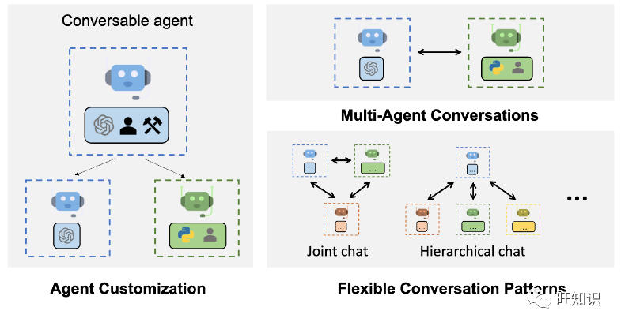  
图源：[https://github.com/microsoft/autogen](https://github.com/microsoft/autogen)

*   \*\*AutoGen可以轻松构建基于多智能体对话的下一代LLM应用程序。\*\*它简化了复杂的LLM工作流程的编排、自动化和优化。它最大限度地提高了LLM模型的性能并克服了它们的弱点。
*   \*\*它支持复杂工作流程的多种对话模式。\*\*借助可定制和可对话的Agent，开发人员可以使用AutoGen构建各种涉及对话自主性、智能体数量和智能体对话拓扑的对话模式。
*   \*\*它提供了一系列具有不同复杂性的工作系统。\*\*这些系统涵盖各种领域和复杂性的广泛应用。这演示了AutoGen如何轻松支持不同的对话模式。
*   \*\*AutoGen提供增强的LLM推理。\*\*它提供API统一和缓存等实用程序，以及错误处理、多配置推理、上下文编程等高级使用模式。

\*\*  
\*\*

2.3 💡 PromptAppGPT
-------------------

**框架网址：**[**https://github.com/mleoking/PromptAppGPT**](https://github.com/mleoking/PromptAppGPT)

\*\*PromptAppGPT是首个基于LLM的自然语言应用开发框架：支持全自动编译、运行、界面生成，支持无代码配置实现流程调度，支持几十行低代码实现AutoGPT类全自主智能体(Autonomous Agent)。

\*\*\*\*PromptAppGPT显著降低了Agent开发门槛：\*\***无需下载任何软件，打开网址(**[**https://promptappgpt.wangzhishi.net/)就能开发。**](https://promptappgpt.wangzhishi.net/)%E5%B0%B1%E8%83%BD%E5%BC%80%E5%8F%91%E3%80%82)

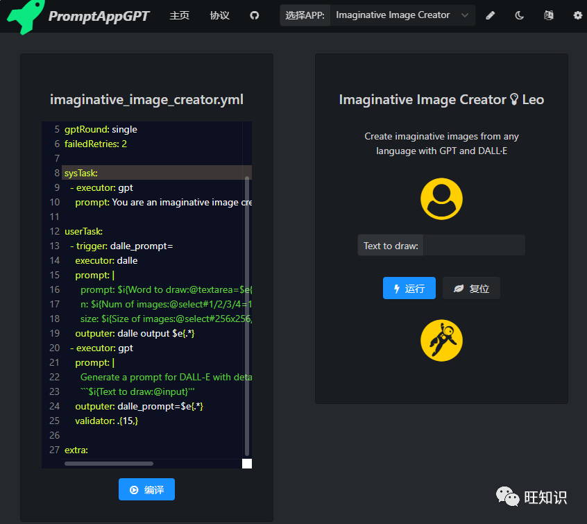图源：[https://github.com/mleoking/PromptAppGPT](https://github.com/mleoking/PromptAppGPT)

PromptAppGPT包含基于低代码提示的开发、GPT文本生成、DALLE图像生成、在线提示编辑器+编译器+运行器、自动用户界面生成、支持插件扩展等功能：

*   ⚡基于低代码提示的快速应用程序开发
*   🧠用于文本生成的GPT3/4执行器
*   🍯用于图像生成的Dalle执行器
*   🔌自定义扩展执行器（插件）
*   #️⃣在线提示编辑器、编译器和运行器
*   ⚙️自动生成用户界面
*   🧨英文和中文用户界面

PromptAppGPT同时包含以下内置智能体示例：

*   \*\*所有执行器(All Executors)：\*\*使用所有执行器的应用程序。
*   \*\*我的ChatGPT(My ChatGPT)：\*\*聊天机器人应用。
*   \*\*创意图像生成器(Imaginative Image Creator)：\*\*使用GPT和DALL·E从任何语言创建富有想象力的图像的智能体。
*   \*\*披萨订单机器人(Pizza Order Bot)：\*\*收集披萨餐厅订单的自动化智能体。
*   \*\*通用翻译器(Universal Translator)：\*\*将任何语言的文本翻译成英语/中文/法语/西班牙语的智能体。
*   \*\*英语润色师(English Improver)：\*\*进行英语翻译和润色的智能体。
*   \*\*网页和图像搜索(Web & ImageSearcher)：\*\*使用Bing搜索搜索网页和图像的智能体。
*   \*\*我的AutoGPT(My AutoGPT)：\*\*一个类似于AutoGPT，能够完全自主使用GPT和执行器(插件)来实现任何目标的智能体。

3 人工智能体(AI Agent)最佳应用项目
-----------------------

3.1 AutoGPT
-----------

**项目网址：**[**https://github.com/Significant-Gravitas/AutoGPT**](https://github.com/Significant-Gravitas/AutoGPT)

AutoGPT由SignificantGravitasLtd.视频游戏公司的创始人ToranBruceRichards开发，是2023年3月推出的早期Agent之一。它也是当今GitHub上最受欢迎的Agent项目。

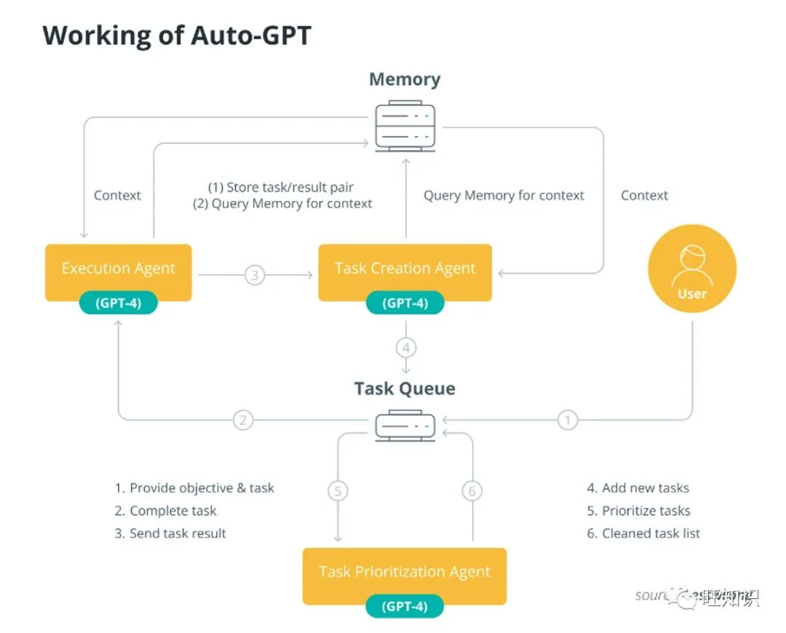  
AutoGPT工作原理。图源：lesswrong.com

AutoGPT背后的想法很简单—它是一个完整的工具包，用于为各种项目构建和运行自定义AI Agent。该工具使用OpenAI的GPT-4和GPT-3.5大语言模型(LLM)，允许为各种个人和商业项目构建Agent。

3.2 BabyAGI
-----------

**项目网址：**[**https://github.com/yoheinakajima/babyagi**](https://github.com/yoheinakajima/babyagi)

BabyAGI是任务驱动自主智能体的精简版。Python脚本只有140个字的代码，根据官方GitHub存储库，“使用OpenAI和矢量数据库（例如Chroma或Weaviate）来创建、确定优先级和执行任务。”

自推出以来，BabyAGI已扩展到多个有趣的项目。有些像twitter-agent🐣或Slack上的BabyAGI将智能体的力量带到了现有平台。其他人添加插件和附加功能或将BabyAGI移植到其他语言（例如Babyagi-perl）。

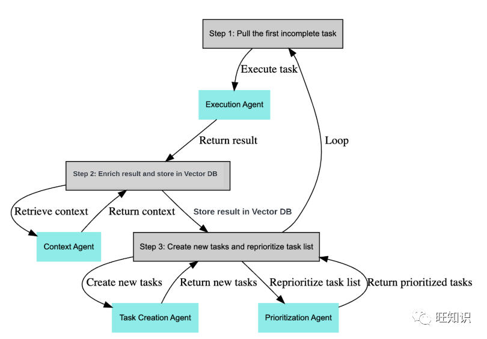BabyAGI Agent循环。图源：github.com/yoheinakajima/babyagi

**3.3 SuperAGI**

\*\*项目网址：\*\*[**https://github.com/TransformerOptimus/SuperAGI**](https://github.com/TransformerOptimus/SuperAGI)

SuperAGI是AutoGPT的更灵活且用户友好的替代方案。将其视为开源AI智能体的集成者，其中包含构建、维护和运行自己的Agent所需的一切。它还包括插件和云版本，可以在其中进行测试。

该框架具有多个人工智能模型、图形用户界面、与矢量数据库的集成（用于存储/检索数据）以及性能洞察。还有一个带有工具包的市场，可让您将其连接到流行的应用程序和服务，例如GoogleAnalytics。

SuperAGI包含如下特性：

*   **配置、生成和部署自主AI Agent**\-创建生产就绪且可扩展的自主Agent。
*   **使用工具包扩展Agent功能**\-将我们市场中的工具包添加到Agent工作流程中。
*   **图形用户界面**\-通过图形用户界面访问Agent。
*   **操作控制台**\-通过向Agent提供输入和权限来与他们交互。
*   **多个向量数据库**\-连接到多个向量数据库以增强Agent的性能。
*   **性能遥测**\-深入了解Agent的性能并进行相应优化。
*   **优化令牌使用**\-控制令牌使用以有效管理成本。
*   **Agent记忆存储**\-使Agent能够通过存储记忆来学习和适应。
*   **模型**\-针对特定业务用例的自定义微调模型。
*   **工作流程**\-使用ReActLLM的预定义步骤轻松自动化任务。

3.4 🚀🎬 ShortGPT
-----------------

\*\*项目网址：\*\*\*\*https://\*\***github.com/RayVentura/ShortGPT**

ShortGPT是一个用于自动化内容创建的强大框架。它简化了视频创建、素材来源、配音合成和编辑任务。

ShortGPT可以处理大多数典型的视频相关任务，例如编写视频脚本、生成画外音、选择背景音乐、编写标题和描述，甚至编辑视频。该工具适用于跨平台的短视频内容和长视频内容相关任务。

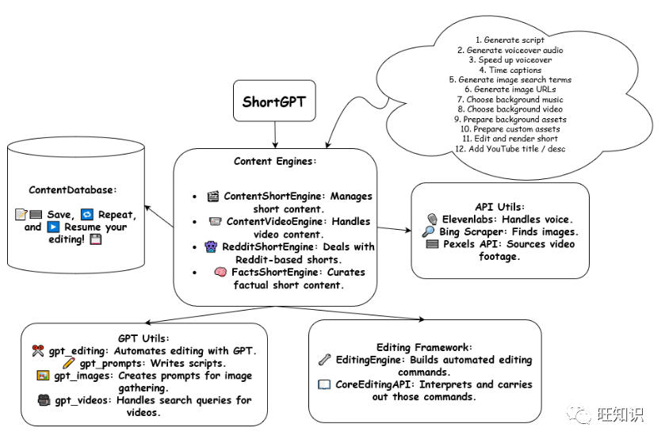ShortGPT循环和功能。图源：github.com/RayVentura/ShortGPT

ShortGPT框架包含以下主要特性：

*   \*_🎞️_\*\*\*自动编辑框架：\*\*使用面向LLM的视频编辑语言简化视频创建过程。
*   \*_📃_\*\*\*脚本和提示：\*\*为各种LLM自动编辑流程提供即用型脚本和提示。
*   \*_🗣️_\*\*\*配音/内容创作：\*\*支持多种语言，包括英语🇺🇸、西班牙语🇪🇸、阿拉伯语🇦🇪、法语🇫🇷、波兰语🇵🇱、德语🇩🇪、意大利语🇮🇹、葡萄牙语🇵🇹、俄语🇷🇺、普通话🇨🇳、日语🇯🇵、印地语🇮🇳、韩语🇰🇷以及其他30多种语言（使用EdgeTTS）
*   \*_🔗_\*\*\*字幕生成：\*\*自动生成视频字幕。
*   \*_🌐🎥_\*\*\*资源来源：\*\*从互联网获取图像和视频片段，根据需要连接网络和PexelsAPI。
*   \*_🧠_\*\*\*内存和持久性：\*\*确保使用TinyDB自动编辑变量的长期持久性。

3.5 ChatDev
-----------

\*\*项目网址：\*\*[**https://github.com/OpenBMB/ChatDev**](https://github.com/OpenBMB/ChatDev)

ChatDev是一家虚拟软件公司，通过担任不同角色的各种智能体进行运营，包括首席执行官、首席产品官、首席技术官、程序员、审阅者、测试员、美术设计师。这些智能体形成了一个多智能体组织结构，并因“通过编程彻底改变数字世界”的使命而团结在一起。ChatDev中的Agent通过参加专门的功能研讨会进行协作，包括设计、编码、测试和记录等任务。

ChatDev的主要目标是提供一个易于使用、高度可定制和可扩展的框架，该框架基于大型语言模型(LLM)，是研究集体智慧的理想场景。

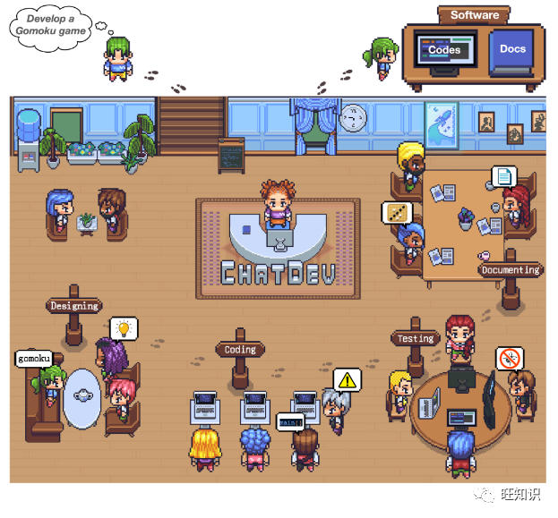  
图源：[https://github.com/OpenBMB/ChatDev](https://github.com/OpenBMB/ChatDev)

CoPilot、Bard、ChatGPT和许多其他工具都是强大的编码助手。但像ChatDev这样的项目可能很快就会与他们展开竞争。ChatDev被称为“一家虚拟软件公司”，它使用的不是一个而是多个智能体，这些Agent在传统开发组织中扮演不同的角色。每个智能体都分配有独特的角色，可以协作处理各种任务，从设计软件到编写代码和文档。

3.6 MetaGPT
-----------

**项目网址：**[**https://github.com/geekan/MetaGPT**](https://github.com/geekan/MetaGPT)

MetaGPT是另一个开源人工智能体框架，试图模仿传统软件公司的结构。与ChatDev类似，Agent被分配产品经理、项目经理和工程师的角色，并且他们在用户定义的编码任务上进行协作。

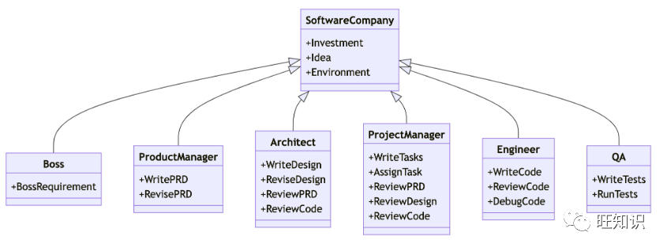  
软件公司多角色示意图。图源：[https://github.com/geekan/MetaGPT](https://github.com/geekan/MetaGPT)

到目前为止，MetaGPT只能解决中等挑战性的任务—比如编写蛇游戏或构建简单的实用应用程序——但它是一个有前景的工具，未来可能会迅速发展。生成一个完整的项目将花费大约2美元的OpenAI接口调用费用。

3.7 Camel
---------

\*\*项目网址：\*\*[**https://github.com/camel-ai/camel**](https://github.com/camel-ai/camel)

简而言之，Camel是早期的多智能体框架之一，它使用独特的角色扮演设计来使多个智能体能够相互通信和协作。

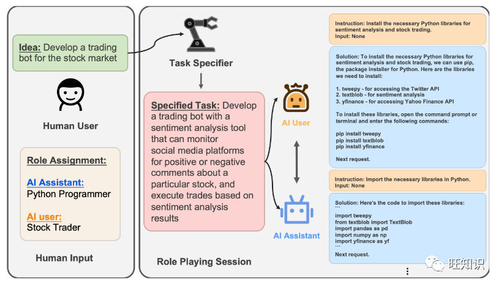  
CAMEL框架中两个ChatGPT智能体之间的对话。  
图源：[https://github.com/camel-ai/camel](https://github.com/camel-ai/camel)

一切都始于人类定义的任务。该框架利用LLM的强大功能，动态地将角色分配给Agent，指定和开发复杂的任务，并安排角色扮演场景以实现Agent之间的协作。

3.8 JARVIS
----------

\*\*项目网址：\*\*\*\*https://\*\***github.com/microsoft/JARVIS**

JARVIS处理任务规划、模型选择、任务执行和内容生成。通过访问HuggingFace中心中的数十个专用模型，JARVIS利用ChatGPT的推理能力将最佳模型应用于给定任务。这使得它对于各种任务（从简单的摘要到对象检测）都具有相当不错的灵活性。

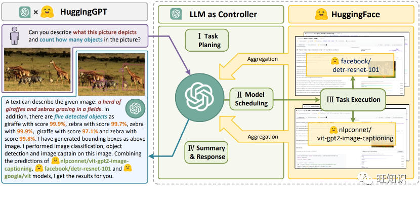JARVIS整体框架。图源：[https://github.com/microsoft/JARVIS](https://github.com/microsoft/JARVIS)

JARVIS引入了一个协作系统，该系统由作为控制器的大语言模型和作为协作执行器的众多专家模型（来自 HuggingFace Hub）组成。系统的工作流程由四个阶段组成：

*   \*\*任务规划：\*\*使用ChatGPT分析用户的请求，了解他们的意图，并将其分解为可能的可解决的任务。
*   \*\*模型选择：\*\*为了解决计划的任务，ChatGPT根据描述选择Hugging Face上托管的专家模型。
*   \*\*任务执行：\*\*调用并执行每个选定的模型，并将结果返回给ChatGPT。
*   \*\*响应生成：\*\*最后，使用ChatGPT整合所有模型的预测，并生成响应。

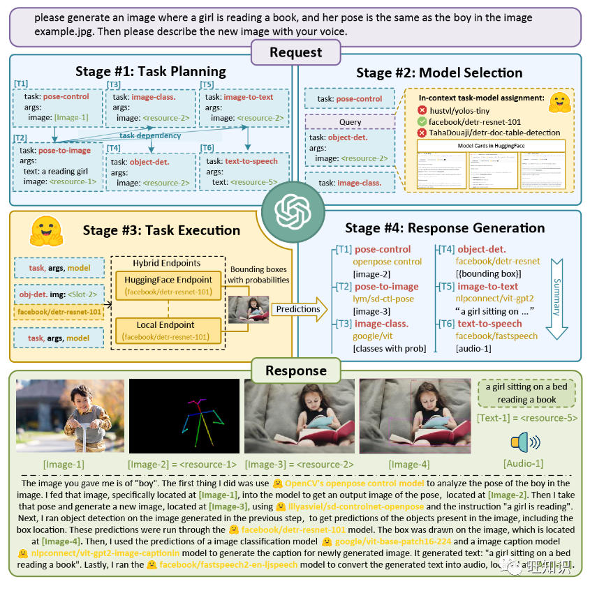  
JARVIS工作流程示例。图源：[https://github.com/microsoft/JARVIS](https://github.com/microsoft/JARVIS)

3.9 OpenAGI
-----------

**项目网址：**[**https://github.com/agiresearch/OpenAGI**](https://github.com/agiresearch/OpenAGI)

OpenAGI是一个开源AGI（通用人工智能）研究平台，结合了小型专家模型（为情感分析或图像去模糊等任务量身定制的模型）和任务反馈强化学习(RLTF)，以提高其输出。它汇集了ChatGPT等流行平台、LLaMa2等大语言模型以及其他专业模型，并根据任务上下文动态选择正确的工具。

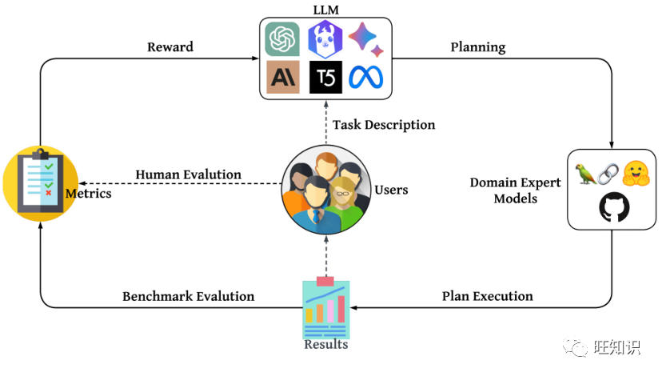  
OpenAGI框架。图源：[https://github.com/agiresearch/OpenAGI](https://github.com/agiresearch/OpenAGI)

OpenAGI是一个开源AGI研究平台，专门设计用于提供复杂的多步骤任务，并附带特定于任务的数据集、评估指标和各种可扩展模型。OpenAGI将复杂的任务表述为自然语言查询，作为LLM的输入。LLM随后选择、综合和执行OpenAGI提供的模型来解决任务。此外，该项目还提出了任务反馈强化学习（RLTF）机制，以任务解决结果作为反馈，提高LLM的任务解决能力。因此，LLM负责综合各种外部模型来解决复杂的任务，而RLTF则提供反馈以提高其任务解决能力，从而为自我改进的AI提供反馈循环。，LLM操作各种专家模型来解决复杂任务的范例是实现AGI的一种有前途的方法。

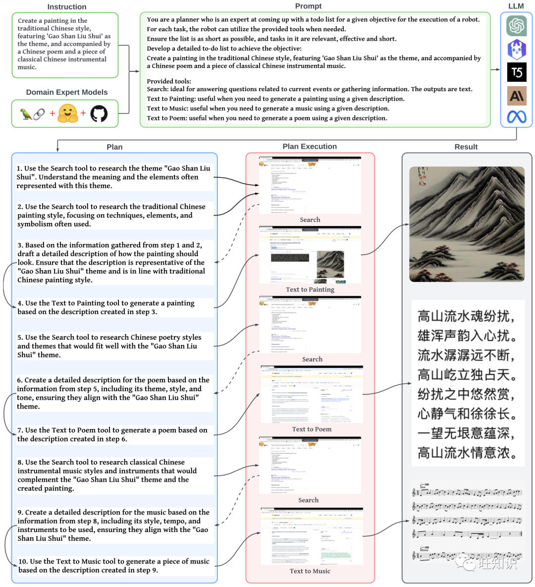  
指导OpenAGI创作一幅以“高山流水”为主题的国画，并配以一首生成的中国古诗词和一首与画作相一致的音乐。OpenAGI首先在网上搜索“理解”“高山流水”的古老故事，然后基于大语言模型和领域专家模型的协作逐步生成绘画、诗歌和音乐。所创作的绘画、诗歌、音乐都与古代故事相吻合。图源：[https://github.com/agiresearch/OpenAGI](https://github.com/agiresearch/OpenAGI)

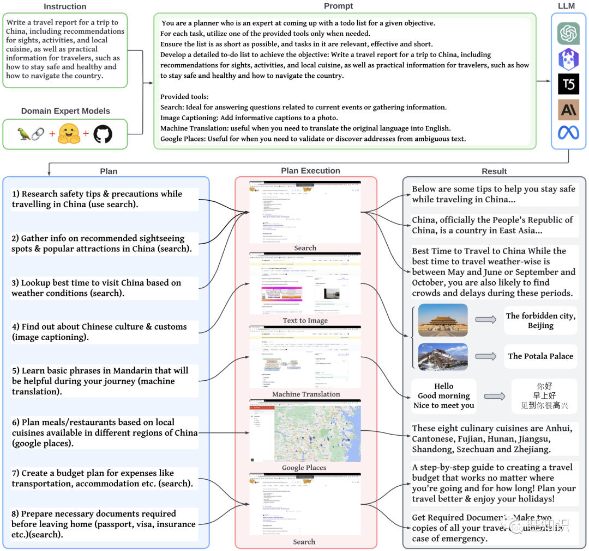指示OpenAGI创建中国之旅的旅行报告，包括景点、活动和当地美食的推荐，以及为旅行者提供的实用信息，例如如何保持安全和健康以及如何在该国旅游。图源：[https://github.com/agiresearch/OpenAGI](https://github.com/agiresearch/OpenAGI)

3.10  XAgent
-----------------------------------------------------

**框架网址：**[**https://github.com/OpenBMB/XAgent**](https://github.com/OpenBMB/XAgent)

XAgent是一个开源实验性大型语言模型(LLM)驱动的自主智能体，可以自动解决各种任务。它被设计为一个通用Agent，可以应用于广泛的任务。XAgent仍处于早期阶段，开发人员正在努力改进它。🏆XAgent旨在创建一个可以解决任何给定任务的超级智能Agent。

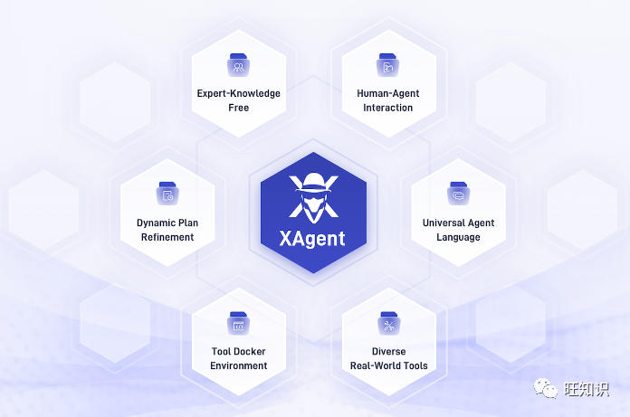  
XAgent组成。图源：[https://github.com/OpenBMB/XAgent](https://github.com/OpenBMB/XAgent)

XAgent的设计具有以下特点：

*   \*\*自主性：\*\*XAgent可以自动解决各种任务，无需人工参与。
*   \*\*安全：\*\*XAgent旨在安全运行。无论如何运行它，所有操作都限制在docker容器内！
*   \*\*可扩展性：\*\*XAgent被设计为可扩展的，可以轻松添加新工具来增强特工能力甚至新特性！
*   \*\*GUI：\*\*XAgent为用户与Agent交互提供了友好的GUI。也还可以使用命令行界面与Agent交互。
*   \*\*与人合作：\*\*XAgent可以与人协作处理任务。它不仅能够在旅途中遵循人的指导来解决复杂的任务，而且在遇到挑战时还可以寻求人的帮助。

XAgent由三部分组成：

*   \*_🤖_\*\*\*Dispatcher：\*\*负责动态实例化任务并将任务分派给不同的Agent。它允许添加新的Agent并提高Agent的能力。
*   \*_🧐_\*\*\*Planner：\*\*负责生成和修正任务计划。它将任务划分为子任务并为它们生成里程碑，允许Agent逐步解决任务。
*   \*_🦾_\*\*\*Actor：\*\*负责执行行动以实现目标并完成子任务。Actor利用各种工具来解决子任务，它也可以与人协作来解决任务。

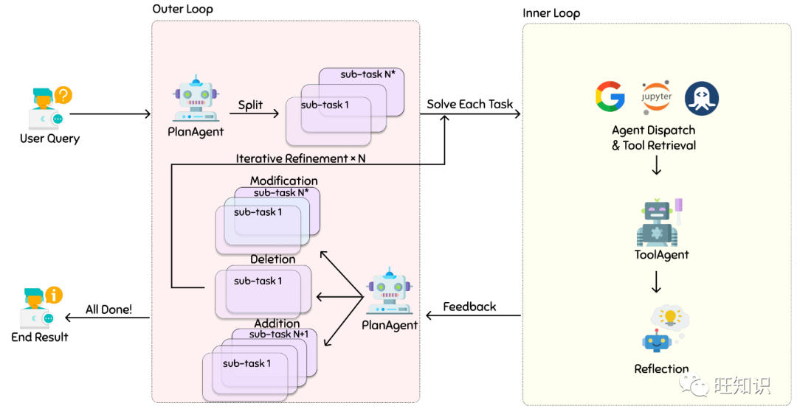

XAgent工作流程。图源：[https://github.com/OpenBMB/XAgent](https://github.com/OpenBMB/XAgent)

4 人工智能体(AI Agent)的作用和挑战
-----------------------

4.1 人工智能体(AI Agent)的作用
----------------------

“那么，我可以使用智能体做什么呢？”这是一个很好的问题，我们很想说出“一切”，但考虑到当前的技术状况，这与事实相去甚远。尽管如此，即使在其初始阶段，人工智能体也可以通过以下方式让生活和工作变得更轻松：

*   🔎简化研究和数据收集。
*   ✏️生成多种不同风格和语气的内容。
*   🌐爬行网络并提取关键见解。
*   💭总结文档和电子表格。
*   🔀在语言之间翻译内容。
*   🤝充当创意任务的虚拟助手。
*   ⚡️自动化管理任务，例如安排和跟踪。

\*\*Agent未来将不断演进，从需要人交互的基于提示的工具转变为在自我引导循环中运行的全自主系统。\*\*毕竟，这就是人工智能工具应有的样子—自动、可信、可靠，不需要冗长的提示或审查每个步骤。

假设您想要分析电动汽车(EV)行业过去十年的市场趋势。您可以在做其他事情时将这些任务委托给智能体，而不是手动收集数据、阅读无数文章和解析财务报告。

即使使用像ChatGPT这样的工具，人仍然需要随时掌握最新动态。Agent可以帮助找到正确的信息、做笔记并组织一切。如果已经有一些数据，Agent将在几秒钟内给出充实关键的见解。

有时，一个项目可能过于复杂，以至于一个Agent无法管理。通过多Agent设置，每个Agent负责处理项目的一部分。一个Agent可以收集数据，而另一个可以创建报告大纲。然后，第三个Agent可以编译信息并生成实际内容。

4.2 人工智能体(AI Agents)的挑战
-----------------------

\*\*全自主智能体(\*\*\*\*Autonomous Agents)仍然处于人工智能工具的狂野西部，它们在很大程度上是实验性的，需要一定的技术知识来设置、部署和维护。\*\*这对于DIY项目来说非常好，但如果只想完成工作，那么这并不是一种即插即用的体验。可以在技术上将开源Agent与现有工作流程结合起来。但这需要时间、专业知识和资源。

当然，还有幻觉的问题。\*\*由于Agent依赖大语言模型来生成信息，因此他们同样容易陷入没有事实依据的怪异叙述中。\*\*Agent运行的时间越长，就越有可能捏造和扭曲现实。从生产力的角度来看，这造成了一些困境。有一些环节的简单方案，包括：限制Agent的运行时间、缩小任务范围、让一个人参与循环来审查输出等等。

通过部署多个具有专业知识和独特技能的Agent，可以获得更好的结果-因此多智能体框架可能会更受欢迎。

5 总结与展望
-------

人工智能的发展，随着GPT-4、Bard和LlaMa2等人工智能模型更快、更准确和更大规模的迭代即将出现，我们可能会在未来几个月看到更多令人兴奋的突破。尤其是人工智能体(AI Agent)的兴起，标志着数字领域的巨大转变。这些智能体具有理解、创造和交互的能力，它们不仅仅是工具，而且是各个领域的潜在合作者。当我们站在这场革命的风口浪尖时，必须负责任地利用他们的能力。

当今可用的工具和平台使我们能够为不同的任务定制Agent，但我们也必须保持警惕并考虑这些进步的道德影响。人类与人工智能之间的桥梁从未如此短，随着我们前进，和谐共存似乎不仅可能，而且迫在眉睫。

**在可以预见的未来，Agent将重新定义我们对工作、规划和协作的看法。它们将彻底改变生产力并增强传统工作流程。那么，您准备好加入这场革命了吗？**

参考资料：

1.  Taskade, Top 11 Open-Source Autonomous Agents & Frameworks: The Future of Self-Running AI, [https://www.taskade.com/blog/top-autonomous-agents](https://www.taskade.com/blog/top-autonomous-agents).
2.  BILAL MANSOURI, What Are LLM Agents ? An Overview of Their Capabilities, [https://gptpluginz.com/llm-agents/](https://gptpluginz.com/llm-agents/).
3.  Zhiheng Xi et. al., The Rise and Potential of Large Language Model Based Agents: A Survey, [https://arxiv.org/pdf/2309.07864.pdf](https://arxiv.org/pdf/2309.07864.pdf).