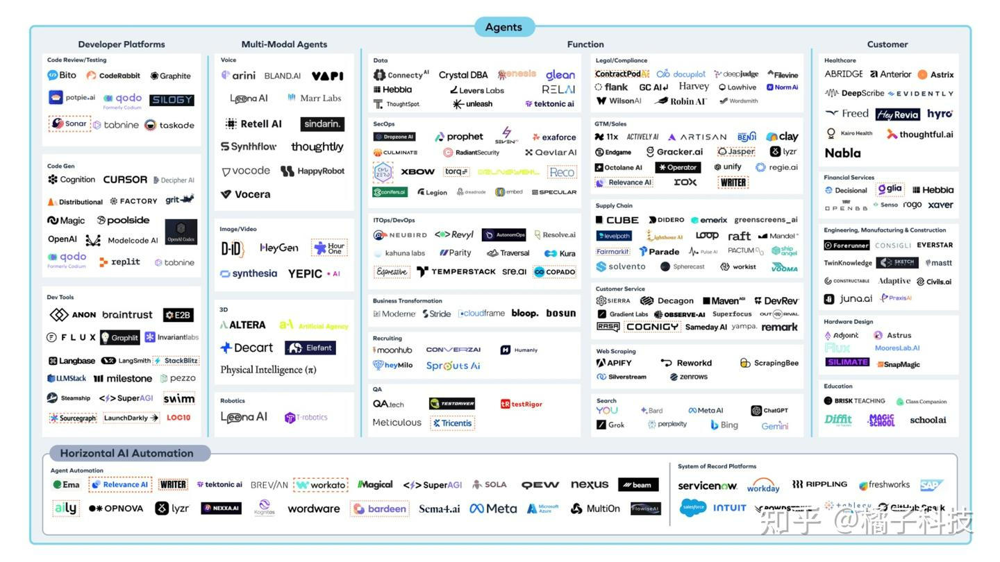
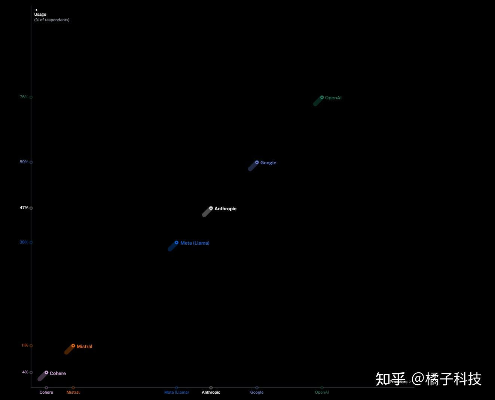
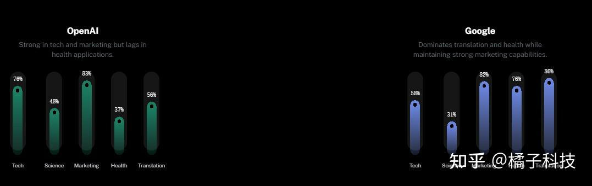
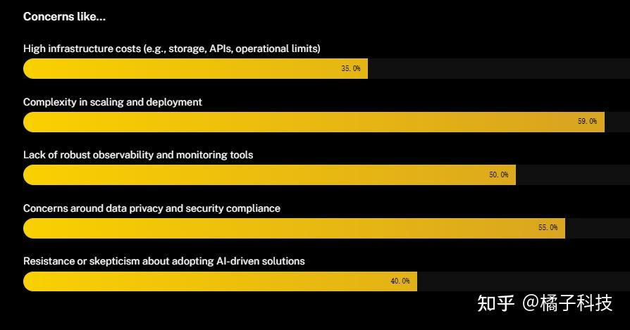
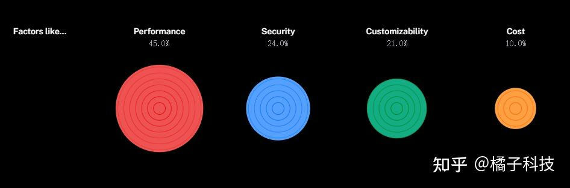
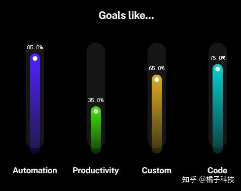
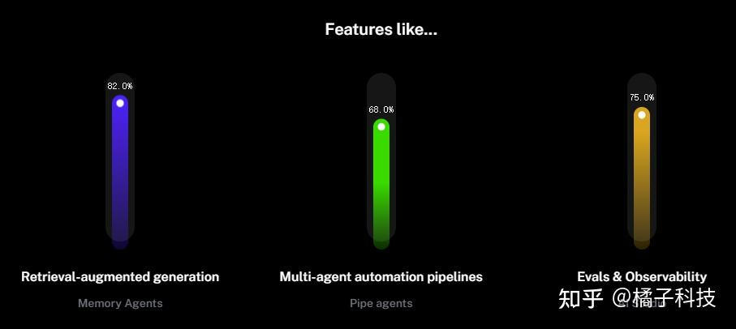
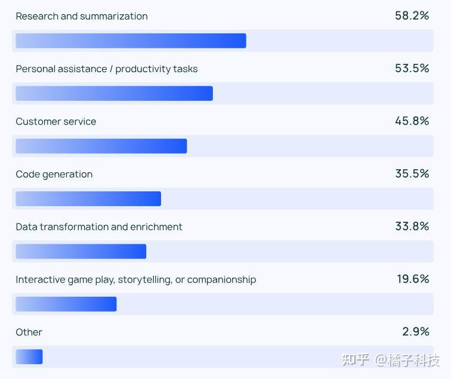
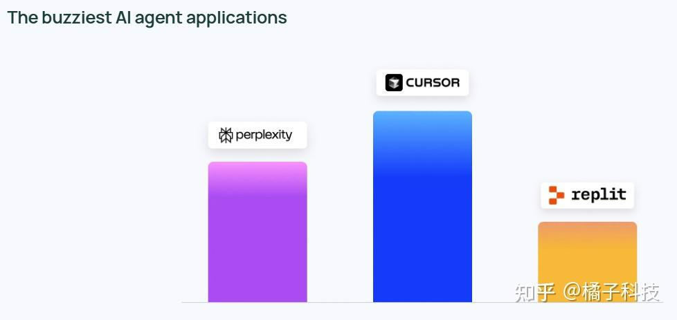

# 2024年终总结AI&Agents
> _**作者: 橘子科技**_
> 
> _**原文:**_ [_**https://zhuanlan.zhihu.com/p/15244174291**_](https://zhuanlan.zhihu.com/p/15244174291)

agent是各家大厂,创业公司都比较关注,宣传的一个比一个牛逼,但是年底了,有多少应用真实落地?

大模型需要2K以上的集群,不是每家都可以训练玩得起,但是AI Agent是应用系统集成商,只要有推理卡或者只需要使用[API](https://zhida.zhihu.com/search?content_id=252071550&content_type=Article&match_order=1&q=API&zhida_source=entity)接口就可以调用.全球有100多家企业宣称自家有Agent平台,真实应用水平谁知道那？

> 全球AI Agent平台和应用

langchain【1】调研了1300名从业者(包括工程师,产品经理和企业领导高管),另外一家公司langbase【2】收集36,000 名开发人员(10个国家,使用1840 亿token和 7.86 亿个 API 请求)收集了宝贵的见解.看看大家真实的agent是什么样子.

Agent最成功的案例是什么？请读完最后一项彩蛋,有惊喜哦！！！.

langbase--开发人员使用哪些 LLM 供应商来构建 AI agent?
---------------------------------------

langbase调研了10个国家3400名开发人员,使用最多的是OpenAI,Google,[Anthropic](https://zhida.zhihu.com/search?content_id=252071550&content_type=Article&match_order=1&q=Anthropic&zhida_source=entity)三家公司,从使用曲线上看,明显和模型刷榜能力成正比.Meta 的 [Llama](https://zhida.zhihu.com/search?content_id=252071550&content_type=Article&match_order=1&q=Llama&zhida_source=entity)、Mistral 和 [Cohere](https://zhida.zhihu.com/search?content_id=252071550&content_type=Article&match_order=1&q=Cohere&zhida_source=entity) 规模虽小但影响力不断增长,凸显出充满活力的市场格局.

令人疑惑的是,中国的通义千问,[DeepSeek](https://zhida.zhihu.com/search?content_id=252071550&content_type=Article&match_order=1&q=DeepSeek&zhida_source=entity)等没有上榜,估计是没有调研到中国的开发者,或者无意中的歧视？

> LLM供应商

langbase--AI模型的应用领域
-------------------

OpenAI 在科技和营销应用领域处于领先地位,在翻译任务中应用广泛.Anthropic 在技术任务中备受青睐,但在营销和翻译领域的使用率较低.谷歌的模型在健康和翻译领域占据主导地位,在语言和医学领域展现出优势.Meta 广泛应用于科技应用,而 Cohere 则因其在科学和营销等多个领域的均衡使用而受到重视.

> LLM应用领域

langbase--阻碍在工作流程中更广泛采用人工智能代理的主要问题
----------------------------------

扩展和部署的复杂性是首要问题,其次是数据隐私和安全合规性.缺乏强大的监控工具和高昂的基础设施成本也阻碍了采用.对人工智能驱动解决方案的抵制或怀疑反映了持续的担忧,表明需要更透明、更用户友好的人工智能实施平台.

> 阻碍应用主要问题

langbase--影响LLM选择的因素
--------------------

在选择大型语言模型 (LLM) 时,大多数受访者优先考虑准确性,其次是安全性和可定制性.成本是影响最小的因素.大家都不差钱,谁好用用谁家的产品呗.

langbase--采用 AI 技术的主要目标是什么？
---------------------------

自动化和简化工作是采用 AI 的首要任务,公司提倡使用AI为主,可提高公司效率并简化流程.

休闲娱乐应该也是重要的用途,比如AI作画/合成照片,生成歌词,生成小作文.可能老外没有中国人会玩.

langbase--哪些 AI 基础设施功能对于满足您的迫切需求至关重要?
-------------------------------------

大多数受访者需要多智能体检索增强生成 (RAG) 功能来改进上下文信息处理.评估工具对于确保 AI 系统按预期运行也很重要.多智能体管道是实现生产中复杂任务的关键.

**大家都很诚实,RAG最容易上手,智能问答,或者直接基于RAG的生成,效果最好(虽然RAG的效果也没达到预期,总比不靠谱的**[**垂域大模型**](https://zhida.zhihu.com/search?content_id=252071550&content_type=Article&match_order=1&q=%E5%9E%82%E5%9F%9F%E5%A4%A7%E6%A8%A1%E5%9E%8B&zhida_source=entity)**强很多).**

langchain--[智能体](https://zhida.zhihu.com/search?content_id=252071550&content_type=Article&match_order=3&q=%E6%99%BA%E8%83%BD%E4%BD%93&zhida_source=entity)应用场景
--------------------------------------------------------------------------------------------------------------------------------------------------------------

人们使用代理来做什么？代理既处理日常任务,也为知识工作打开了新的可能性.

‍  
代理的主要用例包括进行研究和总结(58%),其次是简化任务以提高个人生产力或协助(53.5%).  
‍  
这些表明人们希望有人(或某物)为他们处理耗时的任务.用户可以依靠人工智能代理从大量信息中提取关键见解,而不是筛选无尽的数据进行[文献综述](https://zhida.zhihu.com/search?content_id=252071550&content_type=Article&match_order=1&q=%E6%96%87%E7%8C%AE%E7%BB%BC%E8%BF%B0&zhida_source=entity)或研究分析.同样,人工智能代理通过协助安排和组织等日常任务来提高个人生产力,让用户专注于重要的事情.  
‍  
效率提升不仅限于个人.客户服务(45.8%)是代理用例的另一个主要领域,帮助公司处理查询、故障排除并加快团队的客户响应时间.

langchain--Agent成功案例: [Cursor](https://zhida.zhihu.com/search?content_id=252071550&content_type=Article&match_order=1&q=Cursor&zhida_source=entity)成为最大的赢家
----------------------------------------------------------------------------------------------------------------------------------------------------------

langchain的1300份答案中,表现最抢眼的是Cursor.紧随其后的是 Perplexity 和 [Replit](https://zhida.zhihu.com/search?content_id=252071550&content_type=Article&match_order=1&q=Replit&zhida_source=entity) 等重量级应用程序.

‍  
Cursor 是一款人工智能代码编辑器,可帮助开发人员通过智能自动完成和上下文帮助编写、调试和解析代码.Replit 还通过设置环境、配置并让您在几分钟内构建和部署功能齐全的应用程序来加速[软件开发生命周期](https://zhida.zhihu.com/search?content_id=252071550&content_type=Article&match_order=1&q=%E8%BD%AF%E4%BB%B6%E5%BC%80%E5%8F%91%E7%94%9F%E5%91%BD%E5%91%A8%E6%9C%9F&zhida_source=entity).Perplexity 是一款人工智能答案引擎,可以使用网络搜索回答复杂查询并在其响应中链接来源.

更详细的内容,请参考langchain和langbase的调研报告.从真是使用情况看真的不容乐观.大模型只有在准确度上超过人类,才有大规模使用推广Agent的可行性(个人观点,一个串行的多任务系统,0.99\_0.99\*0.\_99...,系统越复杂,可靠性越低,可以自动化能力越弱).

\[1\][LangChain State of AI Agents Report](https://link.zhihu.com/?target=https%3A//www.langchain.com/stateofaiagents)

\[2\][State of AI Agents | Langbase Research](https://link.zhihu.com/?target=https%3A//langbase.com/state-of-ai-agents%23deployment-challenges)