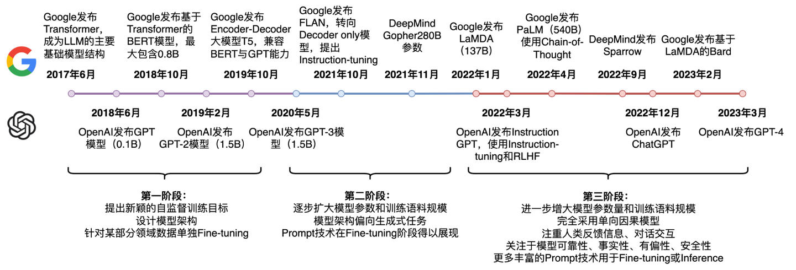
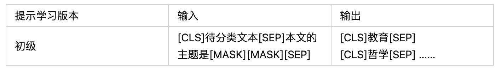
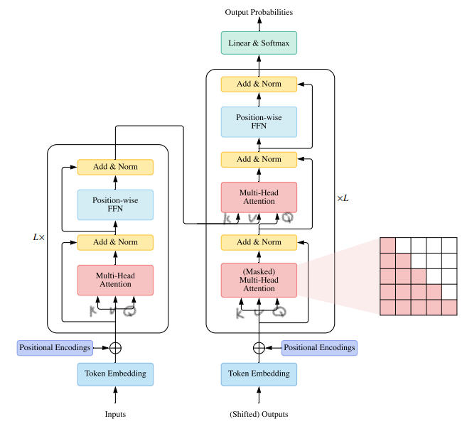
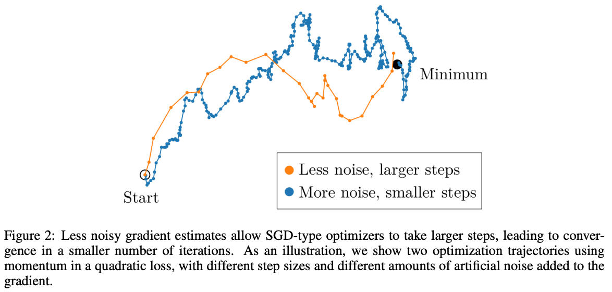
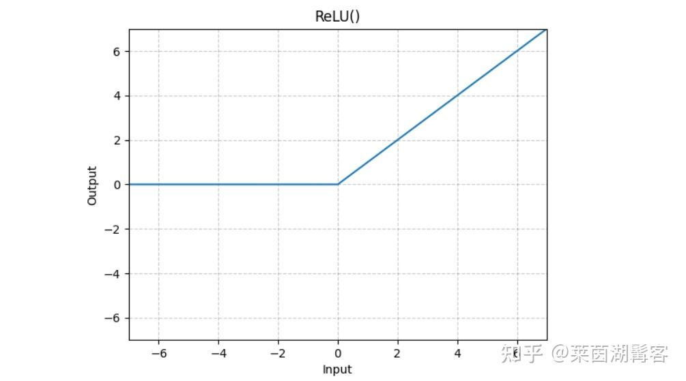
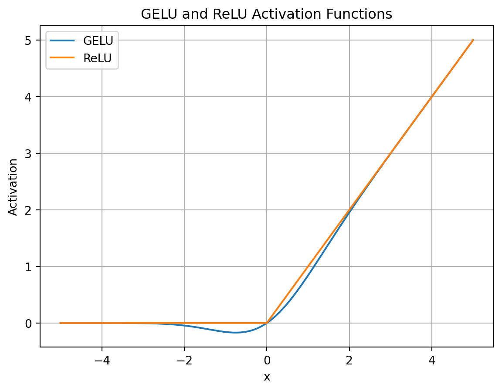
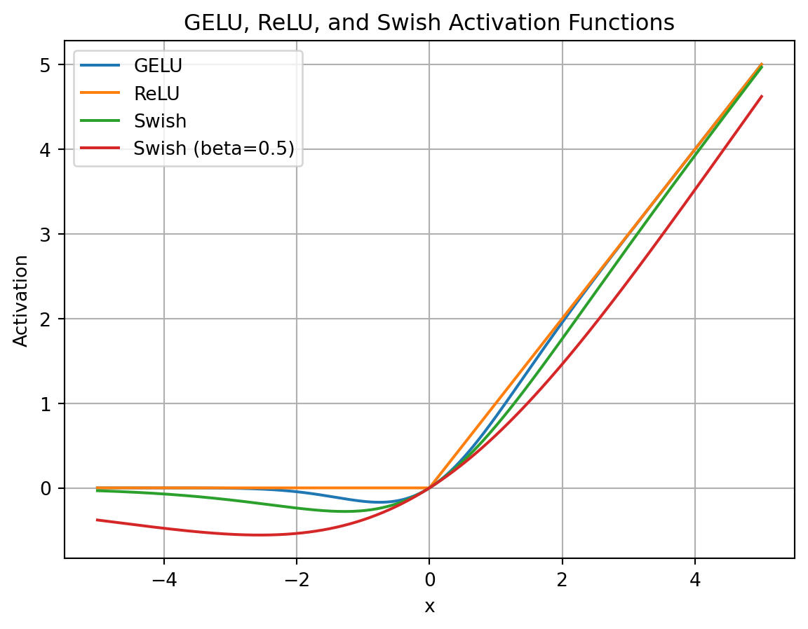
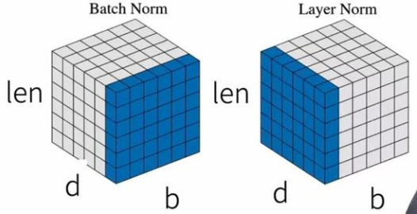

# LLM技术&ICL&Principle（持续更新）
> _**作者: 凛冬将至**_
> 
> _**原文:**_ [_**https://zhuanlan.zhihu.com/p/5530180196**_](https://zhuanlan.zhihu.com/p/5530180196)

⚠️⚠️⚠️ 这是一篇1.7W+字长文，慎入...，一直想梳理LLM相关所有的技术点（渊源由来）、原理、实现方式等，以及业内相关重要paper，希望能够有一个透彻的了结，为此特地耗时3个月+整理整个系列...

LLM技术：ICL Principle（持续更新）(1.7W+字)

*   LLM技术：Pretrian（持续更新）(6k+字)
*   LLM技术：SFT（持续更新）(9k+字)
*   LLM技术：RLHF系列精华（持续更新）(8.5k+字)
*   LLM技术：Train & Infra（持续更新）(8.3k+字)
*   LLM技术：RAG&Agent（持续更新）(1w+字)
*   VLM技术：SD(持续更新)(7k+字)
*   VLM技术：TTS&ASR(持续更新)(8k+字)

**读前必看**：借鉴业内各位大神的无私分享（由衷感谢），从LLM-ICL架构、激活、LN、attention、外推几个方面，涉及公式原理、来源演变、实现方式三个维度分别展开总结，以及相关主要paper及关键技术点推荐【还在不断勘误中，欢迎讨论指正】...

* * *

LLM打破了传统在PLM+finetune的方式，而是直接在应用预训练+prompt解决下游任务。（可是实现无监督、低资源场景，利用的是PLM中存储到的先验知识）



*   In-Context Learning 综述：[https://arxiv.org/pdf/2301.00234.pdf](https://link.zhihu.com/?target=https%3A//arxiv.org/pdf/2301.00234.pdf)

**技术变迁史**：

*   [https://zhuanlan.zhihu.com/p/395115779](https://zhuanlan.zhihu.com/p/395115779)
*   [https://www.zhihu.com/question/504324484/answer/2857106275](https://www.zhihu.com/question/504324484/answer/2857106275)

**第一范式：基于统计机器学习模型的范式**，如 tf-idf 特征+朴素贝叶斯等机器算法；

**第二范式：基于深度学习模型的范式**，如 word2vec 特征 + LSTM 等深度学习算法，相比于第一范式，模型准确有所提高，特征工程的工作也有所减少；

**第三范式：基于预训练模型 + finetuning的范式**，如 BERT + finetuning 的NLP任务，相比于第二范式，模型准确度显著提高，但是模型也随之变得更大，但小数据集就可训练出好模型；

*   LM的出现证明了“语言模型本身对语言有一定的“理解”甚至“生成”能力，对所观测到的文本数据的概率进行预测，缺少语言的认知。”
*   该阶段核心在于"**目标函数**"的设计，LM迁就下游任务进行确定，无监督+有监督的结合

**第四范式：基于预训练模型 + Prompt + 生成的范式**，如 BERT + Prompt 的范式相比于第三范式，模型训练所需的训练数据显著减少。

前言
--

**提示学习(Prompt Learning)**：在不显著改变预训练语言模型结构和参数的情况下，通过向输入增加“提示信息”、将下游任务改为文本生成任务

**优势**: 在合适prompt的条件下，完全通过无监督train而得的LM就可以用了解决大量的下游任务，这样就可以实现少样本甚至零样本学习。

在该范式下的**重点**即设计最合适的prompt让LM可以理解要解决的任务。



**模型架构**:

*   **Encoder-Decoder架构**：输入双向注意力，输出单向注意力。代表：T5,BART
*   **Causal Decoder架构**：从左到右的单向注意力。代表：GPT,LLama,BLOOM
*   **Prefix Decoder架构**：输入双向注意力，输出单向注意力，是Encoder-Decoder和Causal Decoder的折中方案。代表：GLM,U-PaLM

**语言模型**: 根据已有词预测下一个词，训练目标为最大似然函数:

L(x)=∑ni=1logP(xi|x<i)

*   Causal Decoder 结构会在 所有 token 上计算损失，而 Prefix Decoder 只会在 输出上 计算损失。

**去噪自编码器**: 随机替换掉一些文本段，训练语言模型去恢复被打乱的文本段。目标函数为:

LDAE(x)=logx(xˇ|xxˇ)

*   采用去噪自编码器作为训练目标的任务有GLM-130B、T5。

**架构核心模块**：



**Q1: 为什么现在的LLM都是Decoder only的架构？**\*

1.  decoder-only的泛化性能更好
2.  注意力满秩优势：下三角矩阵，必然是满秩的，建模能力更强
3.  预训练任务难度问题
4.  上下文学习为decoder-only架构带来的更好的few-shot性能
5.  Causal attention就是decoder-only的单向attention）具有隐式的位置编码功能

_答案来自:_\_ \_[_https://www.zhihu.com/question/588325646/answer/3357252612_](https://www.zhihu.com/question/588325646/answer/3357252612)

**Q2: batch\_size=256走一步和以batch\_size=1从同一个点出发256次再平均有什么区别？**

*   用大batch size配合大的learning rate，和用小batch size和小learning rate最终到达的效果是一样的。



_答案来自:_\_ \_[_https://www.zhihu.com/question/376908009/answer/3338427477_](https://www.zhihu.com/question/376908009/answer/3338427477) An Empirical Model of Large-Batch Training

KL散度衡量的是两个概率分布的距离吗？

*   [https://www.zhihu.com/question/345907033/answer/3072696582](https://www.zhihu.com/question/345907033/answer/3072696582)

**国内前沿LLM技术汇总**:

LLM激活函数
-------

激活函数是为了向模型引入非线性变换能力。

### sigmoid

δ(x)=11+e−x

### ReLU激活

ReLU即Rectified Linear unit:

ReLU(x)=max(0,x)={x,x>00,x≤0



计算简便、不易受梯度消失干扰，且更高效、鲁棒、线性可分。

*   ReLU的导数非0即1，避免了链式求导中累乘带来的衰减问题，不过ReLU在零点不连续，指定0/1即可。神经元个数（即网络宽度）的增加，多个分段函数RELU(⋅)的叠加可以逼近复杂非线性变换。

**使用ReLU的FFN的公式**:

FFNRELU(x)=max(xW1+b1)W2+b2

### GELU激活

GELU即Gaussian Error Linear Unit，是ReLU的平滑版本：

GELU(x)=x∗Φ(x)=12(1+erf()x2)≈12x(1+tanh(2π(x+0.044715x3)))

其中Φ(x)表示高斯分布的累计分布函数。



*   平滑连续的激活函数，处理高斯分布的数据时表现更好
*   计算涉及到误差函数和指数函数，计算量更大

GELU的FFN层可以表示：

FFNGELU(x,W1,W2)=GELU(xW1)W2

### GeGLU & SwiGLU激活

**swish**函数是一种门控激活函数，是对带有非零负值梯度的ReLU平滑版本：

swish(x)=x⋅θ(βx)



**SiLU**是Swish的特例：

SiLU(x)=x⋅Sigmoid(x)

**GLU**即Gated Linear Unit，称为门控线性单元：

GLU(x,W,V,b,c)=f(xW+b)⊗(xV+c)

**SwiGLU**即Swish-based GLU，将GLU的relu激活函数替换为了swish函数：

SwiGLU(x,W,V,b,c)=Swishβ(xW+b)⊗(xV+c)

**基于SwiGLU的FFN**：

FFNSwiGLU(x,W,V,W2)=(SiLU(xW)⊗xV)W2

*   引入了更多的权重矩阵，通常会对隐藏层的大小做一个缩放，从而保证整体的参数量不变。
*   LLaMA、Baichuan、Qwen等系列模型虽然在config.json中显示的激活函数是SiLU，实际是基于SiLU搭建的SwiGLU，应用时一般会省略偏置项，具体如下：

SwiGLU(x,W,V,b,c)=SiLU(xW+b)⊗(xV+c)

```text-plain
def swiglu(x):
    return F.silu(self.w1(x)) * self.w3(x)
```

*   **可微性**: SiLU与GLU的结合，SwiGLU同样具备SiLU无上界、有下界、非单调和平滑的优势，计算梯度时不会遇到不连续点，从而在训练过程中提供更稳定和有效的梯度传播。
*   **门机制自适应性**: 更好地捕捉复杂的特征表示，提高模型的表达能力和准确性。
*   被应用于 Transformer 架构中的前馈神经网络（FFN）层，显著增强了模型的性能

Normlization技术
--------------

1.  调整输入数据特征的分布，使其分布更均匀，致使训练稳定，可以**缓解梯度消失或梯度爆炸问题**。
2.  将不同特征的值范围映射到相似的区间，快速地找到全局最优解或局部最优解，**加速收敛**。
3.  能够更好地学习到数据的统计特性，从而提高其对新数据的适应能力，提升**泛化**。

_ref_: [https://blog.csdn.net/sinat\_37574187/article/details/140846061](https://link.zhihu.com/?target=https%3A//blog.csdn.net/sinat_37574187/article/details/140846061)

### LayerNormalization

LN是对每个样本里的元素进行归一化，用于稳定参数训练过程，有助于减缓梯度爆炸和梯度消失。

LN(y)=x−μσ+ϵ+β

其中μ 为 x 的均值，σ 为 x 的方差，γ 和 β 是可训练的模型参数，γ 是缩放参数，新分布的方差 γ2 ； β 是平移系数，新分布的均值为 β 。 ε 为一个小数，添加到方差上，避免分母为0。

```text-plain
def layerNorm(feature):
    size = feature.shape
    alpha = torch.nn.Parameter(torch.ones(size[-1]))
    beta = torch.nn.Parameter(torch.ones(size[-1]))
    input_dtype = feature.dtype
    feature = torch.nn.Parameter(feature.to(torch.float32))

    mean = feature.mean(-1, keepdim=True)
    std = feature.std(-1, keepdim=True)
    feature = alpha * (feature - mean)
    return (feature / (std + 1e-6) + beta).to(input_dtype)
```

LN对每个样本的每层进行归一化，减少了每层输入分布的变化，有助于提高模型的训练效果。LN通过减少内部层的耦合程度，有助于网络更好地泛化到新数据，提升模型的泛化能力。

### BatchNormalization（对比LN）

BN是对每个特征/通道里的元素进行归一化，不适合序列长度会变的应用。



注：len是序列长度，b是batch，d是每个token的hidden\_dim。BN层可以对每一个特征进行归一化，LN层对每一个样本进行归一化。

**BN的主要步骤**:

1.  **Standardization**：首先对 个 进行 Standardization，得到零均值方差分布 ̂。
2.  **scale and shift**：然后再对 ̂ 进行scale and shift(缩放并平移)得到 ，具有新的均值 方差

xib←xi(b)−μiσ(xi)2+ϵyi(b)=BN(xi)(b)=γ⋅(xib)+β

其中xi(b)表示当前输入的第b-th个当前batch样本中第i-th层输入节点的值，xi是\[xi1,xi2,...,xim\]构成的行向量，长度为m，

*   [https://blog.csdn.net/qq\_40924873/article/details/124578485](https://link.zhihu.com/?target=https%3A//blog.csdn.net/qq_40924873/article/details/124578485)

**作用**：

*   抑制梯度消失
*   训练过程更加稳定，加速优化过程
*   减小了参数初始化带来的影响，对权重初始化不再敏感
*   具有一定的正则化作用

**BatchNorm是对batch内不同样本的同一特征进行归一化，LayerNorm是对同一样本的不同特征进行归一化。**

### RMSNormalization

RMSNorm=xRMS(x)⋅γ其中：RMS(x)=1d∑i=1dxi2

RMSNorm相比一般的LayerNorm，减少了计算均值和平移系数的部分，在模型训练中的训练速度更快，模型效果表现与LayerNorm基本相当，甚至有所提升(LN取得成功的原因可能是缩放部分的缩放不变性（re-scaling)，而不是平移部分的平移不变性)。

```text-plain
class RMSNorm(torch.nn.Module):
    def __init__(self, dim: int, eps: float = 1e-6):
        super().__init__()
        self.eps = eps
        self.weight = nn.Parameter(torch.ones(dim))

    def _norm(self, x):
        return x * torch.rsqrt(x.pow(2).mean(-1, keepdim=True) + self.eps)  ###RMS Norm公式

    def forward(self, x):
        if rms_norm is not None and x.is_cuda:
            return rms_norm(x, self.weight, self.eps)
        else:
            output = self._norm(x.float()).type_as(x)
            return output * self.weight
```

### DeepNorm

xl+1=LN(α⋅xl+subLayer(xl,θl))

其中：subLayer是第l个Transformer的子层（注意力或前馈网络），θl是其参数

可以缓解爆炸式模型更新的问题，把模型更新限制在常数，使得模型训练过程更稳定。具体地，Deep Norm方法在执行LN之前，up-scale了残差连接（ >1）；另外，在初始化阶段down-scale了模型参数( <1)。

### Pre-Norm & Post-Norm

在Add后进行Norm叫Post-Norm，而Norm之后再Add叫Pre-Norm。

**Pre-Norm工作流程**：

x+subLayer(LN(x))

*   对输入先进行 LayerNorm。
*   将标准化后的输出传入子层（如多头注意力或前馈网络）。
*   使用残差连接（Residual Connection）将输入与子层的输出相加。

**将部分参数进行归一化，部分参数直接加在后面(没有正则化），可以防止发生梯度消失或者梯度爆炸，模型训练的稳定性更强。但一定程度降低深度导致最终效果变差。（易训练）**

**Post-Norm工作流程**：

LN(x+subLayer(x))

*   将输入传入子层。
*   将子层输出与输入相加（残差连接）。
*   对残差连接的结果进行 LayerNorm。

**Post-Norm在残差之后进行归一化，对参数正则化的效果更强。**

LLM长度外推技术
---------

### 0.外推技术基础

位置编码的目的是让模型能够知道不同位置的文本存在不同的语义，对于文本序列有结构性的理解。

而**LLM训练的目标是更好更优美的学习到更长的语义内容，而一切的核心就在于位置编码的设计。**

位置编码的优势，**Attention原理说起**:

am,n=exp(qmTknd)∑j=0Nexp(qmTkjd)

_**注**\_：在未加入位置信息的情况下，无论\_\_q\_\_和\_\_k\_\_所处的位置如何变化，其之间的注意力权重\_\_a_(**m**,**n**)\__均不会发生变化，即与位置无关，不符合语义直觉。_

**LLM阶段常见的外推技术**：

1.  **位置插值**：以RoPE为基础的，如NTK-aware、动态NTK、NTK-by-parts 和YaRN；线性插值（PI）；位置编码相关的 ALiBi；
2.  **架构层面**：LongLoRA微调技术等长度外推技术；
3.  **先进注意力**： GQA, SWA，LM-INFINITE，StreamingLLM ；

### 1.训练式位置编码

训练式位置编码的做法是线性分配一个数值给每个时间步，比如语句中第一个词分配的初始位置编码为1，第二个词分配为2，以此类推，直到最后一个词分配为语句长度N。典型代表就是BERT、GPT等模型。

*   实现：将位置编码和词token一样作为可以训练的参数，比如最大长度设置为512，向量维度设置为768，那么一条语句就会得到512X768的矩阵作为初始向量，并随着训练进行更新。训练式位置编码的优点是简单容易实现，缺点则是没有外推性。比如原生BERT最长只能处理512长度的语句，如果任务中文本大于512则会进行截断操作。

qm=f(q,m)=q+qm

*   代码实现：[https://cloud.tencent.com/developer/article/2196111](https://link.zhihu.com/?target=https%3A//cloud.tencent.com/developer/article/2196111)

### 2.Sinusoidal位置编码

三角函数式位置编码：通过正弦和余弦函数注入词的顺序来编码位置信息增强模型输入

谷歌在Transformer模型中提出的一种绝对位置编码: 通过正弦和余弦函数来编码位置信息

{pk,2i=sin(k/100002i/d)pk,2i+1=cos(k/100002i/d)

其中：d: 词向量的维度，k: 位置索引，2i和2i+1表示位置向量的分量索引，pk,2i和pk,2i+1分别表示位置k的位置向量的第2i和第2i+1个分量.

**Sinusoidal位置编码特点**：

*   **周期性**: 每个分量是正/余弦函数，具有周期性，**波长越长，频率越低**。
*   **远程衰减**: 对于两个相同的词向量，如果它们之间的**距离越近，则内积分数越高，反之则越低**。

由于Sinusoidal位置编码的备周期性和远程衰减的特性，所以**理论上也具备一定长度外推的能力**。

*   代码实现：[https://cloud.tencent.com/developer/article/2196111](https://link.zhihu.com/?target=https%3A//cloud.tencent.com/developer/article/2196111)

### 3.RoPE位置编码

对比 Transformer 绝对位置编码，ROPE 通过将向量以复数方式推理，通过将一个向量旋转某个角度，巧妙地实现了以添加绝对位置编码的方式，在 attention 中计算了相对位置信息。Sinusoidal 位置编码是加性的，而 RoPE 可以视为乘性的。在\\theta方案上，RoPE 同样沿用了 Sinusoidal 位置编码的方案，即\\theta\_i=1000^{-2i/d}(具备衰减性)。

**推导过程**也可参考大佬：[https://mp.weixin.qq.com/s/-1xVXjoM0imXMC7DKqo-Gw](https://link.zhihu.com/?target=https%3A//mp.weixin.qq.com/s/-1xVXjoM0imXMC7DKqo-Gw)

扩展到多维的情况:

注：\\theta可以是一个任意常量，随机初始化两个向量q和k，将q固定在位置0上，k的位置从0开始逐步变大，依次计算q和k之间的内积。随着q和k的相对距离的增加，它们之间的内积分数呈现出一定的震荡特性，缺乏了重要的远程衰减性。

借鉴Sinusoidal位置编码: \\theta = 10000^{-2i/d}, 其中base = 10000，高维矩阵更新为：

等效为：

随机初始化两个向量q和k，将q固定在位置0上，k的位置从0开始逐步变大，依次计算q和k之间的内积。我们发现随着q和k的相对距离的增加，它们之间的内积分数呈现出远程衰减的性质，这正是我们希望的。

**RoPE 的 self-attention 操作的流程**：对于 token 序列中的每个词嵌入向量，首先计算其对应的 query 和 key 向量，然后对每个 token 位置都计算对应的旋转位置编码，接着对每个 token 位置的 query 和 key 向量的元素按照 两两一组 应用旋转变换，最后再计算 query 和 key 之间的内积得到 self-attention 的计算结果。

**内积与相对距离的关系**：

**base的不同取值会影响远程衰减的程度**：

当base大于500时，随着base的提升，远程衰减的程度会逐渐削弱。当base=1时，即将所有\\theta都设为1的情况，将完全失去远程衰减特性。

```text-plain
# LLAMA实现方式
def precompute_freqs_cis(dim: int, end: int, theta: float = 10000.0):
    freqs = 1.0 / (theta  (torch.arange(0, dim, 2)[: (dim // 2)].float() / dim))
    t = torch.arange(end, device=freqs.device)  # type: ignore
    freqs = torch.outer(t, freqs).float()  # type: ignore
    freqs_cis = torch.polar(torch.ones_like(freqs), freqs)  # complex64
    return freqs_cis

def apply_rotary_emb(
    xq: torch.Tensor,
    xk: torch.Tensor,
    freqs_cis: torch.Tensor,
) -> Tuple[torch.Tensor, torch.Tensor]:
    xq_ = torch.view_as_complex(xq.float().reshape(*xq.shape[:-1], -1, 2))
    xk_ = torch.view_as_complex(xk.float().reshape(*xk.shape[:-1], -1, 2))
    freqs_cis = reshape_for_broadcast(freqs_cis, xq_)
    xq_out = torch.view_as_real(xq_ * freqs_cis).flatten(3)
    xk_out = torch.view_as_real(xk_ * freqs_cis).flatten(3)
    return xq_out.type_as(xq), xk_out.type_as(xk)

# PLAM实现方式：
class RotaryEmbedding(nn.Module):
    def __init__(self, dim):
        super().__init__()
        inv_freq = 1.0 / (10000  (torch.arange(0, dim, 2).float() / dim))
        self.register_buffer("inv_freq", inv_freq)

    def forward(self, max_seq_len, *, device):
        seq = torch.arange(max_seq_len, device=device, dtype=self.inv_freq.dtype)
        freqs = einsum("i , j -> i j", seq, self.inv_freq)
        return torch.cat((freqs, freqs), dim=-1)

def rotate_half(x):
    x = rearrange(x, "... (j d) -> ... j d", j=2)
    x1, x2 = x.unbind(dim=-2)
    return torch.cat((-x2, x1), dim=-1)
    
def apply_rotary_pos_emb(pos, t):
    return (t * pos.cos()) + (rotate_half(t) * pos.sin())
```

**base的性质研究: 与LLM的长度外推息息相关，如NTK-Aware Scaled RoPE、NTK-by-parts、Dynamic NTK等长度外推方法，本质上都是通过改变base，从而影响每个位置对应的旋转角度，进而影响模型的位置编码信息，最终达到长度外推的目的。目前大多长度外推工作都是通过放大base以提升模型的输入长度，例如Code LLaMA将base设为1000000，LLaMA2 Long设为500000，但更大的base也将会使得注意力远程衰减的性质变弱，改变模型的注意力分布，导致模型的输出质量下降。**

**重要参考**:

*   [https://spaces.ac.cn/archives/9675](https://link.zhihu.com/?target=https%3A//spaces.ac.cn/archives/9675)
*   [https://kevinng77.github.io/posts/notes/articles/%E7%AC%94%E8%AE%B0rope.html#rope-%E6%97%8B%E8%BD%AC%E4%BD%8D%E7%BD%AE%E7%BC%96%E7%A0%81](https://link.zhihu.com/?target=https%3A//kevinng77.github.io/posts/notes/articles/%25E7%25AC%2594%25E8%25AE%25B0rope.html%23rope-%25E6%2597%258B%25E8%25BD%25AC%25E4%25BD%258D%25E7%25BD%25AE%25E7%25BC%2596%25E7%25A0%2581)

### 4.主流位置编码技术系列

### 4.1 NBCE（Naive Bayes-based Context Extension）

使用朴素贝叶斯思想来扩展LLM的Context处理长度，无需对模型进行微调，也不依赖于模型架构，具有线性效率，而且具备一定的效果。NBCE理解: 并行输入，每段独立解码，在输出层对每一个预测token的概率矩阵进行融合（PCW是在输入进行融合），最大程度确保注意力不被分散，取最小熵的pooling作为预测最优结果。NBCE实质就是用LLM的熵作为相似度对Context进行检索，每步生成都会更新检索结果。

适用场景是：假设要预测的答案可以分为若干个片段，每个片段只依赖于一个Context。

**由来**：要根据S1,S2,⋯,Sn若干个给定的context，生成T，根据“贝叶斯公式+独立假设”： \\small{\\begin{aligned} log p(T|S\_1, S\_2, ...,S\_n)&=\\sum^{k=1}\_{n}P\[log p(T|S\_k)\] -(n-1)log p(T)+常数\\ &= (\\beta+1) \\overline{P\[log p(T|S\_k)\]} - \\beta log p(T) + 常数 \\end{aligned}}

其中: p(T|S\_k)和p(T)都可以直接用现有的LLM进行计算，而且只要是语言模型都行，跟架构无关，也不需要用长文本微调。p(T|S\_k)是单个Context所预测的概率，p(T)则无Context（或者Context为空）的概率，并且多个Context可以放在同一个batch中并行计算，计算量随着Context数的增加是线性增长的。

但是会出现Greedy Search好而Random Sample差的情况呢？Random Sample是“按照分布采样”，它的效果差说明Max Pooling的结果不是一个合理的分布；而Greedy Search只关心最大概率者，而不关心分布的合理性，它的效果好告诉我们概率最大的token正确性较高。

**为了改善Random Sample的效果，我们将Pooling方式改为直接输出不确定性最低的那个分布，即得到NBCE**:

P\[logp(T|S)\]=logp(T|S\_k) \\其中k=argmin{H\_1,H\_2,⋯,H\_n}, H\_i = - \\sum\_T p(T|S\_i) log p(T|S\_i) \\

NBCE的实现需要修改一下解码函数中的logits构建方式，跟解码算法的选择并不冲突：

**重要参考**:

*   [https://kexue.fm/archives/9617](https://link.zhihu.com/?target=https%3A//kexue.fm/archives/9617)
*   Github: [https://github.com/bojone/NBCE](https://link.zhihu.com/?target=https%3A//github.com/bojone/NBCE)

```text-plain
outputs = model(input_ids=input_ids,
                        attention_mask=attention_mask,
                        return_dict=True,
                        use_cache=True,
                        past_key_values=past_key_values
                       )
        past_key_values = outputs.past_key_values
        # ===== 核心代码开始 =====
        beta = 0.25
        probas = torch.nn.functional.softmax(outputs.logits[:, -1], dim=-1)
        logits = probas.log()
        k = (probas * logits).sum(dim=-1)[1:].argmax() + 1
        logits_max = logits[k]
        logits_uncond = logits[0]
        logits = (1 + beta) * logits_max - beta * logits_uncond
        # ===== 核心代码结束 =====
        
        # 构建分布，采样
        tau = 0.01  # tau = 1是标准的随机采样，tau->0则是贪心搜索
        probas = torch.nn.functional.softmax(logits[None] / tau , dim=-1)
        next_tokens = torch.multinomial(probas, num_samples=1).squeeze(1)
```

### 4.2 线性内插（Position Interpolation，PI）

*   Extending Context Window of Large Language Models via Positional Interpolation

PI的**核心思想**是通过缩放位置索引，使得模型能够处理比预训练时更长的序列，而不损失太多的性能。

其数学表达式如下所示：

f^{'}(x,m) = f(s, \\frac{mL}{L^{'}}) \\

其中，x 是 token embedding、m 是位置索引，L’ 是扩展后的序列长度，L 是训练时的序列长度。

**应用逻辑**：计算推断时序列长度与训练时序列长度的比值，这个比值作为缩放比；

```text-plain
class LlamaRotaryEmbedding(nn.Module):
    def __init__(self, dim, max_position_embeddings=2048, base=10000, device=None, scaling_factor=1.0):
        super().__init__()
        self.scaling_factor = scaling_factor
        self.dim = dim
        self.max_position_embeddings = max_position_embeddings
        self.base = base
        inv_freq = 1.0 / (self.base  (torch.arange(0, self.dim, 2, dtype=torch.int64).float().to(device) / self.dim))
        # ......
        self.max_seq_len_cached = max_position_embeddings
        t = torch.arange(self.max_seq_len_cached, device=device, dtype=torch.int64).type_as(self.inv_freq)
        t = t / self.scaling_factor
        freqs = torch.outer(t, self.inv_freq)

        # ......
```

其中，self.scaling\_factor 是缩放比 L/L’，inv\_freq 是\\theta\_i.

lama基于rotary embedding在2048长度上预训练，该方法通过将position压缩到0~2048之间，从而达到长度外推的目的

longchat将模型微调为上下文长度外扩为16384，压缩比为 8。例如，position\_ids = 10000 的 token 变为position\_ids = 10000 / 8 = 1250，相邻 token 10001 变为 10001 / 8 = 1250.125

**缺点**:

1.  线性插值会将三角函数的周期整体变大，导致分辨率变低（更加密集，分不清位置变化），相邻两个位置的差异变小。
2.  线性内插方法在不同频率的分布变化不一致，导致位置关系不统一，模型进一步学习难度也更大。

### 4.3 ALIBI

*   [https://arxiv.org/pdf/2108.12409](https://link.zhihu.com/?target=https%3A//arxiv.org/pdf/2108.12409)

核心思想是利用query, key之间的线性偏置来调整自注意力机制中的权重分配。

*   实现相对简单，计算资源消耗较少，适用于大规模模型的部署和优化
*   处理长文本和复杂语义结构时同样表现出色。

将原先的 attention score 计算方式改为：

矩阵：

1.  第一项：同传统transformer，是自注意力得分（q和k的内积）。
2.  第二项：是一个相对距离的矩阵，即q和k的索引的差值。
3.  第三项：坡度m（m的取值见下图）：

对于n个header的话，m的取值就是2^{\\frac{-8}{n}}

**效果分析**：面对更长的输入序列的时候，perplexity更加稳定

```text-plain
# 计算坡度
def get_slopes(n): 
    def get_slopes_power_of_2(n):
        start = (2(-2-(math.log2(n)-3)))
        ratio = start
        return [start*ratioi for i in range(n)]

    if math.log2(n).is_integer():
        return get_slopes_power_of_2(n)                   
    else:                                                 
        closest_power_of_2 = 2math.floor(math.log2(n))  
        return get_slopes_power_of_2(closest_power_of_2) + 
             get_slopes(2*closest_power_of_2)[0::2][:n-closest_power_of_2]

# alibi + mask 
def buffered_future_mask(self, tensor):
    dim = tensor.size(1)
    # self._future_mask.device != tensor.device is not working in TorchScript. This is a workaround.
    if (
        self._future_mask.size(0) == 0
        or (not self._future_mask.device == tensor.device)
        or self._future_mask.size(1) < self.args.tokens_per_sample
    ):
        self._future_mask = torch.triu(
                utils.fill_with_neg_inf(torch.zeros([self.args.tokens_per_sample, self.args.tokens_per_sample])), 1
            )
        self._future_mask = self._future_mask.unsqueeze(0) + self.alibi # 这里！！！
    self._future_mask = self._future_mask.to(tensor)
    return self._future_mask[:tensor.shape[0]*self.args.decoder_attention_heads, :dim, :dim]
```

*   参考: [https://zhuanlan.zhihu.com/p/632780188](https://zhuanlan.zhihu.com/p/632780188)

### 4.4 NTK-aware/DynamicNTK

为了解决线性内插的问题，引入了非线性内插，最有名的是NTK-aware。

**核心思想**: 把外推和内插结合起来——**高频外推、低频内插**。即对所有维度采用非均匀缩放，对于高频（低维）部分缩放程度小一点，对于低频（高维）部分缩放程度大一点。具体通过对θ中的base，10000进行缩放来完成。

```text-plain
def ntk_scaled_init(self, dim, max_position_embeddings=2048, base=10000, device=None):
    [[The]] method is just these three lines
    max_position_embeddings = 16384
    a = 8 [[Alpha]] value
    base = base * a  (dim / (dim-2)) [[Base]] change formula
    old_init(self, dim, max_position_embeddings, base, device)
```

注：根据ntk\_alpha去动态调整RoPE中的base，ntk\_alpha 等于1时base=10000，ntk\_alpha 大于1时，base增大，base增大会使得向量内积远程衰减的更缓慢。

**NTK-aware RoPE的局限性**: 位置插值利用缩放因子s对RoPE embedding的所有维度进行均等缩放会损害embedding中的高频信息。

* * *

DynamicNTK相比于NTK-aware，增加了实时调整缩放系数的部分，每次前向传递的过程中，位置嵌入更新缩放因子:

\\lambda = max(1, L^{'}/ L) \\

其中L^{'}是当前序列的序列长度，再与NTK-aware结合就是**DynamicNTK**.

```text-plain
def forward(self, x, position_ids):
        # difference to the original RoPE: inv_freq is recomputed when the sequence length > original length
        # 当序列长度 > 原始长度时，重新计算inv_freq
        seq_len = torch.max(position_ids) + 1
        if seq_len > self.max_position_embeddings:
            # base值根据原始base，缩放因子，序列长度重新计算
            base = self.base * (
                (self.scaling_factor * seq_len / self.max_position_embeddings) - (self.scaling_factor - 1)
            )  (self.dim / (self.dim - 2))
            inv_freq = 1.0 / (
                base  (torch.arange(0, self.dim, 2, dtype=torch.int64).float().to(x.device) / self.dim)
            )
            self.register_buffer("inv_freq", inv_freq, persistent=False)  # TODO joao: this may break with compilation

        cos, sin = super().forward(x, position_ids)
        return cos, sin
```

后续优化有：NTK-by-parts(少量微调)、Dynamic NTK(无需微调) **重要参考**:

*   [https://zhuanlan.zhihu.com/p/670149880](https://zhuanlan.zhihu.com/p/670149880)
*   [https://www.cnblogs.com/mudou/p/18309199](https://link.zhihu.com/?target=https%3A//www.cnblogs.com/mudou/p/18309199)

### 4.5 YaRN

PI线性缩放所有位置索引，并平等地对待每个维度；NTK-aware则实现了高频外推和低频内插，缓解了高频也就是低维的压力，使模型能够更好地区分不同位置间的精细区别。

给定RoPE中一个具体的维度i，则这个维度的波长被定义为：

波长描述了在维度i处嵌入的旋转位置执行全旋转(2π)所需的token的长度，维度越高波长越长。

引出问题：PI和“NTK-aware”插值是一种“盲”插值方法，对所有RoPE隐藏维度没有做任何针对性的处理。YaRN是一种“有针对性的”插值方法，即有对RoPE的不同维度做出不同处理。

无论数据样本或者扩展上下文窗口上的令牌位置怎么样，在计算自注意力公式中引入温度系数t对困惑度ppl有着一致的影响。重新定义公式：

softmax(\\frac{q^{T}\_m k\_n}{\\sqrt{t} \\sqrt{d}}) \\

\*_只需要将两个位置的旋转位置嵌入各自缩放为原来的_\*1/\\sqrt{t}**即可，而无需做其他任何操作。最后将NTK-by-parts技术和上面自注意力计算公式结合，便得到了YaRN。**

\\frac{1}{\\sqrt{t}} = 0.1 ln S + 1 \\

YaRN在对原始预训练数据进行微调后，在上下文窗口扩展方面达到了最先进的性能。与此同时，通过与称为动态缩放的推理时间技术相结合，Dynamic-YaRN允许超过2倍的上下文窗口扩展而无需任何微调。

**NTK-by-parts插值方案**：[https://zhuanlan.zhihu.com/p/897061302](https://zhuanlan.zhihu.com/p/897061302)

### 4.6 CLEX（Continuous Length Extrapolation）

[https://arxiv.org/pdf/2310.16450](https://link.zhihu.com/?target=https%3A//arxiv.org/pdf/2310.16450)

PI，NTK，YaRN都是具有一定外推能力的，即要扩展到目标长度可以在小于目标长度上训练。但是他们都有一个问题，即如果要实现外推效果（设置更大的t)，就会一定程度上损害原始context length (或较短的一部分)内的性能。**本质上：都是设定一个t>1.0，通过微调使得模型在t\*ori\_context\_length的长度上的推理效果更好，t越大，支持的长度越长，但是在较短的context\_length上，PPL效果变差了**。

CLEX scale RoPE核心思想是通过动态系统建模来学习与目标长度相关的缩放向量，维持在较短长度上性能(甚至更好)，外推到超过训练长度。

**技术细节**:

*   训练微调中，通过动态调整缩放因子，使得模型能够适应不同的输入长度。（实现方式: L为原始context length，对于每个batch，随机采样t \\in \[1,t^{max}\]，其中t^{max}=\\frac{max\_context\_len}{L}，训练长度实际: max\_context\_len = t\*L，这样在训练过程中既能微调到t\_max对应的长度，也有机会微调t=1.0对应的原始长度，保持不同长度都有较低的PPL结果。）
*   训练过程中采用了对比训练等技术，提高模型在长上下文任务中的泛化能力。

ref: [https://zhuanlan.zhihu.com/p/645770522](https://zhuanlan.zhihu.com/p/645770522) [https://zhuanlan.zhihu.com/p/684907262](https://zhuanlan.zhihu.com/p/684907262) [https://zhuanlan.zhihu.com/p/683234251](https://zhuanlan.zhihu.com/p/683234251)

LLM Attention技术演变
-----------------

**★★★推荐：缓存与效果的极限拉扯：从MHA、MQA、GQA到MLA:** [**https://zhuanlan.zhihu.com/p/700588653**](https://zhuanlan.zhihu.com/p/700588653)

**★★★transformer的细节到底是怎么样的？:** [**https://www.zhihu.com/question/362131975/answer/3297483297**](https://www.zhihu.com/question/362131975/answer/3297483297)

*   代码实现: [https://blog.csdn.net/yangyanbao8389/article/details/140158725](https://link.zhihu.com/?target=https%3A//blog.csdn.net/yangyanbao8389/article/details/140158725)
*   [https://blog.csdn.net/qq128252/article/details/138704958](https://link.zhihu.com/?target=https%3A//blog.csdn.net/qq128252/article/details/138704958)

### Attention原理

标准的自注意力机制为：

其中x是input，W\_q、W\_k、W\_v是query、key、value的投影矩阵。

多头注意力就是将多个单头注意力的结果拼接起来：

其中W\_o是线性层的变换矩阵，用于还原拼接后的维度。

### \- 基础：MHA（Multi-Head Attention, 多头注意力）

多头注意力MHA等价于多个独立的单头注意力的拼接

假设输入的（行）向量序列为x\_1, x\_2, ..., x\_n，其中x\_i \\in \\mathbb{R}\_d ，那么MHA可以形式地记为:

注：这里省略了Attention矩阵的缩放因子，常见的设置是d\_k=d\_v=d/h。

LLAMA2-7b: d=4096,h=32,d\_k=d\_v=128

LLAMA2-70b: d=8192,h=64,d\_k=d\_v=128

### \- 延伸: MQA，即“Multi-Query Attention”

paper: Fast Transformer Decoding: One Write-Head is All You Need

MQA的思路很简单，直接让所有Attention Head共享同一个K、V, 直接将KV Cache减少到了原来的1/h，从公式上看：取消MHA所有的k，v的上标。

*   MQA的模型: PaLM、StarCoder、Gemini

### \- 延伸: GQA，即“Grouped-Query Attention”

paper: GQA: Training Generalized Multi-Query Transformer Models from Multi-Head Checkpoints

GQA的思想：就是将所有Head分为g个组（g可以整除h），每组共享同一对K、V。MHA到MQA的过度版本。

注：GQA提供了MHA到MQA的自然过渡，当g=h时就是MHA，g=1时就是MQA，当1<g<h时，它只将KV Cache压缩到g/h，压缩率不如MQA，但同时也提供了更大的自由度，效果上更有保证

*   GQA的模型：LLAMA2-70B，以及LLAMA3全系列，TigerBot、DeepSeek-V1、StarCoder2、Yi、ChatGLM2、ChatGLM3等

### \- 延伸: MLA，即“Multi-head Latent Attention

从低秩投影的角度引入MLA，结合Dot-Attention形式，通过一种近似恒等变换从另一个投影维度使得q, k, v的计算更加丰富（此处原理复杂，推导见大佬博客），来增强了GQA的能力，并且推理时可以保持同样大小的KV Cache。

对于不兼容ROPE的问题: MLA，采取了一种混合的方法——每个Attention Head的Q、K新增d\_r个维度用来添加RoPE。

注：在推理时KV Cache只需要存c\_i，新增的带RoPE的维度就可以用来补充位置信息

```text-plain
class BaseAttention(torch.nn.Module):
    def __init__(self):
        super(BaseAttention, self).__init__()
        self.softmax = torch.nn.Softmax(dim=-1)
 
    def attention(self, q, k, v, mask=None, dropout=None):
        attn = torch.matmul(q, k.transpose(-2, -1)) / math.sqrt(q.shape[-1])
 
        if mask is not None:
            attn = attn + mask
        
        attn = self.softmax(attn)
        if dropout is not None:
            attn = dropout(attn)
        output = torch.matmul(attn, v)
        return output
 
 
class Attention(BaseAttention):
 
    def __init__(self, hidden_size, dropout=None):
        super(Attention, self).__init__()
        self.q_proj = torch.nn.Linear(hidden_size, hidden_size)
        self.k_proj = torch.nn.Linear(hidden_size, hidden_size)
        self.v_proj = torch.nn.Linear(hidden_size, hidden_size)
        self.softmax = torch.nn.Softmax(dim=-1)
        
        if dropout is not None:
            self.dropout = torch.nn.Dropout(p=dropout)
        else:
            self.dropout = None
    
    def forward(self, x, mask=None):
        q = self.q_proj(x)
        k = self.k_proj(x)
        v = self.v_proj(x)
        output = self.attention(q, k, v, mask, self.dropout)
        return output
 
 
class MHAttention(BaseAttention):
 
    def __init__(self, hidden_size, num_heads=32, dropout=None):
        super(MHAttention, self).__init__()
        self.num_heads = num_heads
        self.softmax = torch.nn.Softmax(dim=-1)
        self.q_proj = torch.nn.Linear(hidden_size, hidden_size)
        self.k_proj = torch.nn.Linear(hidden_size, hidden_size)
        self.v_proj = torch.nn.Linear(hidden_size, hidden_size)
        
        if dropout is not None:
            self.dropout = torch.nn.Dropout(p=dropout)
    
    def forward(self, x, mask=None):
        bs, seq_len, hidden_size = x.shape
 
        q = self.q_proj(x).view(bs, seq_len, self.num_heads, -1).transpose(1, 2)
        k = self.k_proj(x).view(bs, seq_len, self.num_heads, -1).transpose(1, 2)
        v = self.v_proj(x).view(bs, seq_len, self.num_heads, -1).transpose(1, 2)
        output = self.attention(q, k, v, mask, self.dropout)
        output = output.view(bs, seq_len, hidden_size)
        return output
 
 
class MQAttention(BaseAttention):
 
    def __init__(self, hidden_size, num_heads=32, dropout=None):
        super(MQAttention, self).__init__()
        self.num_heads = num_heads
        self.softmax = torch.nn.Softmax(dim=-1)
        assert hidden_size % num_heads == 0
        self.q_proj = torch.nn.Linear(hidden_size, hidden_size)
        self.k_proj = torch.nn.Linear(hidden_size, hidden_size // num_heads)
        self.v_proj = torch.nn.Linear(hidden_size, hidden_size // num_heads)
        
        if dropout is not None:
            self.dropout = torch.nn.Dropout(p=dropout)
    
    def forward(self, x, mask=None):
        bs, seq_len, hidden_size = x.shape
 
        q = self.q_proj(x).view(bs, seq_len, self.num_heads, -1).transpose(1, 2)
        k = self.k_proj(x).view(bs, seq_len, -1, hidden_size // self.num_heads).transpose(1, 2)
        v = self.v_proj(x).view(bs, seq_len, -1, hidden_size // self.num_heads).transpose(1, 2)
        output = self.attention(q, k, v, mask, self.dropout)
        output = output.view(bs, seq_len, hidden_size)
        return output
 
 
class GQAttention(BaseAttention):
 
    def __init__(self, hidden_size, num_heads=32, num_kv_heads=8, dropout=None):
        super(GQAttention, self).__init__()
        assert hidden_size % num_heads == 0 and num_heads % num_kv_heads == 0
 
        self.num_heads = num_heads
        self.num_kv_heads = num_kv_heads
        self.num_group = num_heads // num_kv_heads
        self.softmax = torch.nn.Softmax(dim=-1)
        self.q_proj = torch.nn.Linear(hidden_size, hidden_size)
        self.k_proj = torch.nn.Linear(hidden_size, hidden_size // num_heads * num_kv_heads)
        self.v_proj = torch.nn.Linear(hidden_size, hidden_size // num_heads * num_kv_heads)
        
        if dropout is not None:
            self.dropout = torch.nn.Dropout(p=dropout)
    
    def repeat_kv(self, feature, num_group): [[llama2源码]]
        bs, num_kv_heads, seq_len, head_dims = feature.shape
        if num_group == 1:
            return feature
        feature = feature[:, :, None, :, :].expand(bs, num_kv_heads, num_group, seq_len, head_dims)
        return feature.reshape(bs, num_kv_heads * num_group, seq_len, head_dims)
 
    def forward(self, x, mask=None):
        bs, seq_len, hidden_size = x.shape
 
        q = self.q_proj(x).view(bs, seq_len, self.num_heads, -1).transpose(1, 2)
        k = self.k_proj(x).view(bs, seq_len, -1, hidden_size // self.num_heads).transpose(1, 2)
        v = self.v_proj(x).view(bs, seq_len, -1, hidden_size // self.num_heads).transpose(1, 2)
        k, v = self.repeat_kv(k, self.num_group), self.repeat_kv(v, self.num_group)
        output = self.attention(q, k, v, mask, self.dropout)
        output = output.view(bs, seq_len, hidden_size)
```

前沿技术阅读材料(持续更新)
--------------

### \[Paper\]: T-FREE: Tokenizer-Free Generative LLMs via Sparse Representations for Memory-Efficient Embeddings

_**Abstract**_: 分词器在LLMs中用于将文本分割成子词并转换成整型表示，但它存在计算开销大、词汇表使用效率低、嵌入层和头层过大等问题，并且对于代表性不足的语言性能下降。paper提出了T-FREE，一种无需分词器的新型LLMs嵌入方法，通过稀疏表示实现内存效率。ont-hot编码有大量的信息冗余。T-FREE 的一个关键动机是直觉上，拼写上的微小差异（例如前导空格或大写）没有足够的熵来证明完全独立的标记是合理的，因此通过multi-hot编码，既能更好的表示不同token之间的关联性，又可以大大降低embedding的大小，降低编码长度。最终在不降低性能的情况下，减少了85%的词汇表。

### \[Paper\]: NTK-aware/DynamicNTK

_**Abstract**_: 非线性内插改变RoPE 的 base，具体就是外推和内插结合起来——高频外推、低频内插。DynamicNTK相比于NTK-aware，增加了实时调整缩放系数的部分。

NTK-aware虽然克服了线性插值的缺点，但是它是通过公式尽量使得每个频率处的位置变化和插值前保持一致，实际也不一致。NTK-aware插值或者混合进制插值策略会导致某些维度越界。

NTK-by-parts(少量微调)、Dynamic NTK(无需微调)

### \[Paper\]: YaRN

_paper:_\_ \_[_https://arxiv.org/pdf/2309.00071_](https://link.zhihu.com/?target=https%3A//arxiv.org/pdf/2309.00071)

_**Abstract**_: YaRN在对原始预训练数据进行微调后，在上下文窗口扩展方面达到了最先进的性能。与此同时，通过与称为动态缩放的推理时间技术相结合，Dynamic-YaRN允许超过2倍的上下文窗口扩展而无需任何微调。

### \[Paper\]: CLEX Paper: [https://arxiv.org/pdf/2310.16450](https://link.zhihu.com/?target=https%3A//arxiv.org/pdf/2310.16450)

_**Abstract**_: PI，NTK，YaRN都是具有一定外推能力的，即要扩展到目标长度可以在小于目标长度上训练。但是他们都有一个问题，即如果要实现外推效果（设置更大的 )，就会一定程度上损害原始context length (或较短的一部分)内的性能。

总的来说就是现有的方法都是设定一个t>1.0，通过微调使得模型在t\*ori\_context\_length的长度上的推理效果更好，t越大，支持的长度越长，但是在较短的context\_length上，ppl效果变差了。

### \[Paper\]: LongLoRA

_paper:_\_ \_[_https://arxiv.org/pdf/2309.12307_](https://link.zhihu.com/?target=https%3A//arxiv.org/pdf/2309.12307)

_**Abstract**_: LongLoRA是基于LoRA对长上下文推理优化的版本：长度外推（Long）+LoRA+Short-Shift-attn加速

### \[Paper\]: LM-Infinite: SIMPLE ON-THE-FLY LENGTH GENERALIZATION FOR LARGE LANGUAGE MODELS

_paper:_\_ \_[_https://arxiv.org/pdf/2308.16137_](https://link.zhihu.com/?target=https%3A//arxiv.org/pdf/2308.16137) _**Abstract**_: 通过局部注意力的方式使LLM无需微调即可进行超长上下文推理（全部算完，通过mask只取局部区域的attn进行后续处理，计算量挺大的），这是一种动态长度泛化解决方案，即 LM-Infinite。它仅涉及 Λ 形注意力mask（以避免过多的注意标记）和距离限制（以避免看不见的距离），同时不需要参数更新或学习。

随着长度的增加，如果我们要区分出新的距离因素，那么，注意力的 logit 就必须增长到无限大。即便我们不考虑距离因素，那么当推理长度增加时，attention score 的分布会趋于平坦，导致信息的丢失。论文也通过 Attention Entropy 会趋于无限大进行了观点验证。

_ref:_ [_https://zhuanlan.zhihu.com/p/656709745_](https://zhuanlan.zhihu.com/p/656709745)

### \[Paper\]: StreamingLLM

paper: [https://arxiv.org/pdf/2309.17453](https://link.zhihu.com/?target=https%3A//arxiv.org/pdf/2309.17453)

_**Abstract**_: 使得在有限序列长度下训练的大型语言模型在无需任何微调的情况下，推广到无限序列长度的输入和输出。

StreamingLLM和LM-Infinite其实用的基本相同的方法。 仅在最近令牌的KV状态上保持固定大小的滑动窗口。尽管确保了在该高速缓存最初被填充之后恒定的存储器使用和解码速度，但是一旦序列长度超过该高速缓存大小，即，甚至仅仅驱逐第一个令牌的KV，也会得到极高的PPL。

### \[Paper\]: Compress Context

_paper:_\_ \_[_https://arxiv.org/pdf/2310.06201_](https://link.zhihu.com/?target=https%3A//arxiv.org/pdf/2310.06201)

_**Abstract**_: 在超长上下文场景下，过往内容中大部分都和当前输入无关，但产生了大量的计算成本。因此考虑在一个给定的输入上下文中修剪冗余内容，从而降低计算成本，更好地利用固定的上下文长度在LLM。

重点就在于选择一个合理的方式修剪内容。

### \[Paper\]: FlagEmbedding

_paper:_\_ \_[_https://arxiv.org/pdf/2401.03462_](https://link.zhihu.com/?target=https%3A//arxiv.org/pdf/2401.03462)

_**Abstract**_: FlagEmbedding能将任意文本映射为低维稠密向量，以用于检索、分类、聚类或语义匹配等任务，并可支持为大模型调用外部知识。

### \[Paper\]: InfLLM: Training-Free Long-Context Extrapolation for LLMs with an Efficient Context Memory

_paper:_\_ \_[_https://arxiv.org/pdf/2402.04617_](https://link.zhihu.com/?target=https%3A//arxiv.org/pdf/2402.04617)

_**Abstract**_: InfLLM 将遥远的上下文存储到额外的内存单元中，并采用有效的机制来查找与令牌相关的单元以进行注意力计算。因此，InfLLM 允许 LLM 有效地处理长序列，同时保持捕获长距离依赖性的能力。

### \[Paper\]: ROPE: Rotary Position Embedding

_**Abstract**_: 对比 Transformer 绝对位置编码，ROPE 通过将向量以复数方式推理，巧妙地实现了以添加绝对位置编码的方式，在 attention 中计算了相对位置信息。

_paper:_\_ \_[_https://arxiv.org/pdf/2306.15595_](https://link.zhihu.com/?target=https%3A//arxiv.org/pdf/2306.15595)

_详细原理可参考：_[_https://kevinng77.github.io/posts/notes/articles/%E7%AC%94%E8%AE%B0rope.html#rope-%E6%97%8B%E8%BD%AC%E4%BD%8D%E7%BD%AE%E7%BC%96%E7%A0%81_](https://link.zhihu.com/?target=https%3A//kevinng77.github.io/posts/notes/articles/%25E7%25AC%2594%25E8%25AE%25B0rope.html%23rope-%25E6%2597%258B%25E8%25BD%25AC%25E4%25BD%258D%25E7%25BD%25AE%25E7%25BC%2596%25E7%25A0%2581)

### \[Paper\]: ALIBI: TRAIN SHORT, TEST LONG: ATTENTION WITH LINEAR BIASES ENABLES INPUT LENGTH EXTRAPOLATION

_**Abstract**_: 核心思想是利用一个和query, key之间的距离成比例的一个“惩罚项”来偏置query-key的注意力得分。

将原先的 attention score 计算方式改为：

### \[Paper\]: Editing Large Language Models

*   git: [https://github.com/zjunlp/EasyEdit](https://link.zhihu.com/?target=https%3A//github.com/zjunlp/EasyEdit)

*   编辑大型语言模型的技术,其目标是在不对其他输入产生负面影响的情况下,有效地改变大型语言模型在特定领域中的行为。在指定的领域内,支持对模型的行为进行有效的数据更改，同时确保对其他输入没有不利影响。如上图所示，可通过模型编辑技术，把对问题「谁是现在的美国总统」的回答特朗普，修改成拜登。
*   保护模型的参数 Additional Parameters 这种范式在语言模型内部引入了额外的可训练参数。这些参数在修改后的知识数据集上进行训练,而原始模型参数保持静态。代表的技术有 T-Patcher、CaliNET 和 GRACE。 Memory-based Mode 记忆模型是一种将所有编辑示例明确存储在内存中，并使用检索器提取与每个新输入最相关的编辑事实，以引导模型生成编辑事实的方法。如果输入与内存中的任何编辑匹配，反事实模型的预测将基于输入和最可能的编辑。否则，如果输入超出所有编辑的范围，将给出原始模型的预测。代表的技术有 SERAC、MemPrompt、IKE 和 MeLLo。
*   修改模型的参数 会对一部分模型的参数θ进行更新，它会应用一个更新∆矩阵来编辑模型 Meta-learning 通过元学习的方法，使用一个超参数的网络去学习编辑LLM所需的Δ 。同时通过采用梯度的低秩分解来转换微调语言模型的梯度,这可以更好地应用于LLM。代表的技术 KE 和 MEND Locate-Then-Edit 模型最初识别的参数与特定知识对应，通过对目标参数的更新对其进行修改。代表的技术 KN、ROME、MEMIT和 PMET

### \[Paper\]: MEGALODON: Efficient LLM Pretraining and Inference with Unlimited Context Length

_**Abstract**_：

_code:_\_ \_[_https://github.com/XuezheMax/megalodon_](https://link.zhihu.com/?target=https%3A//github.com/XuezheMax/megalodon)

### \[Paper\]: Extending Context Window of Large Language Models via Positional Interpolation

_**Abstract**_：提出一种 Linear 的 position Interpolation （线性内插）方案，该方案可以使得原先上下文长度为 2000左右的 llama 模型，再仅通过 1000 steps 的微调之后，获得 32768 的窗口长度。并且在原先 2000 窗口长度的任务上，不会降低模型回复质量。

### \[Paper\]: NTK-Aware Scaled RoPE allows LLaMA models to have extended (8k+) context size without any fine-tuning and minimal perplexity degradation

_**Abstract**_：Neural Tangent Kerne 通过非线性插值方案，改变RoPE 的 base，可以取得更好的效果。

### \[Paper\]: Interleaving Retrieval with Chain-of-Thought Reasoning for Knowledge-Intensive Multi-Step Questions. 2023年7月20日\[pdf\]

_**Abstract**_: LLM通过CoT可以解决多步的推理问题，但对于知识更新的问题（不包含知识或者更新不及时），目前的方案是：将问题作为源预先输入模型学习，然后从外部知识中检索得到答案。为了解决这一问题，paper提出了IRCoT，将检索与CoT交叉进行多步质量保证的新方法，指导CoT检索，并反过来使用检索结果来改进CoT。

### \[Paper\]: Self-Consistency Improves Chain of Thought Reasoning in Language Models.

Dynamic Prompt Learning via Policy Gradient for Semi-structured Mathematical Reasoning. Selection-Inference: Exploiting Large Language Models for Interpretable Logical Reasoning.

_**Abstract**_: Chain-of-Thought 虽然可以显式展示模型的推理过程，但存在推理过程错误、答案正确的假阳性情况。本文对 Chain-of-Thought 的多步推理过程进行细化，将逻辑推理过程分解为两个模块：Selection 和 Inference。为了限制模型的推理过程，Inference 阶段只能参考 Selection 模块选取的上下文信息进行新事实的生成。Selection 模块中，选取的内容通过预训练语言模型对上下文进行打分比较确定，从而避免了语言模型自行编造选取的证据。

数学问题相关：

*   [https://mp.weixin.qq.com/s?\_\_biz=MzI4MDYzNzg4Mw==&mid=2247553837&idx=4&sn=0fa575aa1948c123bacc1627a4433fb7&chksm=ebb72bf9dcc0a2efb731fd2a97a99225f11be09b70e1efa2523013944c8880b31910617a69da&scene=27](https://link.zhihu.com/?target=https%3A//mp.weixin.qq.com/s%3F__biz%3DMzI4MDYzNzg4Mw%3D%3D%26mid%3D2247553837%26idx%3D4%26sn%3D0fa575aa1948c123bacc1627a4433fb7%26chksm%3Debb72bf9dcc0a2efb731fd2a97a99225f11be09b70e1efa2523013944c8880b31910617a69da%26scene%3D27)

### \[Paper\]: Cross-Task Generalization via Natural Language Crowdsourcing Instructions. Swaroop Mishra, Daniel Khashabi, Chitta Baral, Hannaneh Hajishirzi. \[pdf\], \[project\], 2022.03

_**Abstract**_: AI模型如何通过理解指令泛化到一个新的任务是一个长期的挑战，

### \[Paper\]: Fantastically Ordered Prompts and Where to Find Them: Overcoming Few-Shot Prompt Order Sensitivity. 2021.04

_**Abstract**_: papaer提出Prompt 中 Example 的排列顺序对模型性能有较大影响。 Ref: [https://www.cnblogs.com/metaz/p/16798692.html](https://link.zhihu.com/?target=https%3A//www.cnblogs.com/metaz/p/16798692.html)

### \[Paper\]: Demystifying Prompts in Language Models via Perplexity Estimation. 2022.12

_**Abstract**_: LLM的few/zero-shot能力很大程度上依赖于Prompt的设计，paper提出PPL越低，Prompt越好。关于创建prompts文章提出了两点： （1）、基于GPT3套写或者回译；（2）基于PPL选择最优的prompts。

### \[Paper\]: Finetuned Language Models Are Zero-Shot Learners instruction tuning. 2021.09

finetuning language models on a collection of tasks described via instructions, substantially improves zero-shot performance on unseen tasks

_**Abstract**_: papaer提出一种提高语言模型零样本学习能力的简单方法，名为instruction tuning，它在数据集集合上微调语言模型，从而大大提高了unseen 任务上的零样本性能。instruction tuning：使用超过60个由自然语言指令表达的NLP数据集的混合数据 finetune 模型。这个结果模型称为 FLAN,就是 Finetuned Language Net。为了评估FLAN在不可见任务上的 zero-shot 性能，我们根据NLP数据集的任务类型将其分组，并保留每个组进行评估，同时在所有其他组上对FLAN进行指令调优，这种设置能够保证，在 instruction tuning 的时候，没有见过任何推理时的任务。 instruction tuning中增加任务集群（组）的数量可以提高不可见任务的性能，而且只有在足够的模型规模下，instruction tuning的好处才会显现出来。 Instruction tuning的动机是提高语言模型对NLP指令的响应能力。其想法是，通过使用监督来教LM执行通过指令描述的任务，LM将学会遵循指令，甚至对不可见任务也会这样做。

Ref: [https://zhuanlan.zhihu.com/p/538013856](https://zhuanlan.zhihu.com/p/538013856)

### \[Paper\]: Learning To Retrieve Prompts for In-Context Learning. NAACL 2022

_**Abstract**_: Papaer提出prompt的选取方法：Efficient Prompt Retriever（EPR）的检索方法。具体：BM25和SBERT等方法，先基于文本相似度挑选一个候选集，然后再对候选集中的每一条数据进行评估，选取得分最高的 k条示例作为正例集合，选取得分最低的 k 条示例作为负例集合。有了正例集合和负例集合之后，使用对比学习的方法训练retrever，目标函数:

_Ref:_\_ \_[_https://blog.csdn.net/buzhidao2333shuosha/article/details/127871722_](https://link.zhihu.com/?target=https%3A//blog.csdn.net/buzhidao2333shuosha/article/details/127871722)

### \[Paper\]: Automatic Chain of Thought Prompting in Large Language Models. 2022.10

_**Abstract**_: Motivation：Auto-CoT 其实也是受到了 Manual-CoT 的启发，既然 Manual-CoT 比 Zero-Shot-CoT 的性能要好，而且性能好的关键就在于人工设计的问题、中间推理步骤和答案的样例，那么就可以考虑将这部分进行自动化，从而节省人工成本。 Auto-CoT 包括两个主要阶段： （i）问题聚类：将给定数据集中的问题划分为几个聚类； （ii）演示抽样：从每个聚类中选择一个代表性问题，并使用简单的启发式方法使用 Zero-Shot-CoT 生成其推理链。总体过程如上图所示。

通过多样性选取有代表性的问题，对于每一个采样的问题拼接上“Let’s think step by step”（类似于 Zero-Shot-CoT ）输入到语言模型，让语言模型生成中间推理步骤和答案，然后把这些所有采样的问题以及语言模型生成的中间推理步骤和答案全部拼接在一起，构成少样本学习的样例，最后再拼接上需要求解的问题一起输入到语言模型中进行续写。最终模型续写出了中间的推理步骤以及答案，并且质量非常高。

值得一提的是，在十个数据集上 Auto-CoT 是可以匹配甚至超越 Manual-CoT 的性能，也就说明自动构造的 CoT 的问题、中间推理步骤和答案样例比人工设计的还要好，而且还节省了人工成本。在 Auto-CoT 中，其实也是用到了很多个“Let’s think step by step”对每个采样的问题分别触发中间推理步骤和答案，这也是为什么叫它 “Let's think not just step by step but also one by one”。

### \[Paper\]: Iteratively Prompt Pre-trained Language Models for Chain of Thought. 2022.03

_**Abstract**_: PLMs对于复杂的多步推理任务存在限制，类似CoT逻辑，paer提出一种迭代Prompt框架（ iterative context-aware prompter,），通过学习动态合成当前步骤上下文条件下的提示来解决这些限制。

### \[Paper\]: Least-to-Most Prompting Enables Complex Reasoning in Large Language Models. 2022.05

_**Abstract**_: papaer提一种新的Prompt工程构建方式（[https://arxiv.org/pdf/2205.10625.pdf](https://link.zhihu.com/?target=https%3A//arxiv.org/pdf/2205.10625.pdf)）：分治方法，即问题差拆分，逐步解决。

### \[Paper\]: Chain-of-Thought Tuning: Masked Language Models can also Think Step By Step in Natural Language Understanding

_**Abstract**_: 链式思考调优（CoT）是一种通过中间步骤用自然语言形式引导大规模语言模型（LLMs）将复杂任务分解为多步推理的技术。从链式思考（CoT）的角度来看，CoT的两步推理框架使得MLMs能够实现任务分解，CoT的指令微调允许中间步骤以自然语言形式使用。通过MLMs，可以将CoT的成功扩展到自然语言理解任务。在两个自然语言理解任务（层次分类和关系抽取）上对CoT进行实验验证，结果表明CoT优于基线模型，达到了最先进的性能。

### \[Paper\]: Chain of Thought Prompting Elicits Reasoning in Large Language Models. 2022.01

_**Abstract**_: CoT的Motivation就是结合in-context few-shot prompting 以及多步中间推理，通过大模型来改善数学计算、常识推理的效果，和传统的prompt相比呢，COT的区别在于在答案之间多了中间推到的逻辑推理过程。总的来说：允许语言模型将一个多步骤的问题分解为可以单独解决的中间步骤。 实验结论就是： （1）、100B（1000亿参数）参数量以下的模型效果不好，侧面反映了他们的instruct fine-tune不够，COT很难激发他的in-context 推理能力。而在100B以上模型效果很好，甚至超过了之前基于监督训练的SOTA模型。 （2）、prompt的设计非常重要，怎么能更好的激发模型输出比较好的效果，如：prompt里加入和那些等式长度相同的点号，发现效果也不好，说明了并非设想的那样，增加了长度之后效果不会变好。

_Ref:_\_ \_[_https://zhuanlan.zhihu.com/p/610241799_](https://zhuanlan.zhihu.com/p/610241799)

### \[Paper\]: On the Effect of Pretraining Corpora on In-context Learning by a Large-scale Language Model. 2022.04

_**Abstract**_: Prompt Tuning for ICL (prompt selection and prompt formulation strategies, 本文研究语料库对预训练模型的上下文学习的影响。在本文，作者研究了预训练语料库的来源和大小对 HyperCLOVA（以韩语为主的 GPT-3 模型）中的上下文学习的影响。作者发现： （1）上下文学习的表现在很大程度上取决于语料库领域的来源，而训练前语料库的大小并不一定决定语境内学习的出现； （2）当一个语言模型在多个语料库的组合上进行训练时，即使每个语料库不单独导致语境内学习，上下文学习能力也会出现； （3）使用与下游任务相关的语料库进行预训练并不总能保证下游任务在上下文学习中的竞争性表现，尤其是在小样本环境下； （4）语言建模（以困惑度衡量）与上下文学习之间的关系并不总是相关。

### \[Paper\]: Calibrate Before Use: Improving Few-shot Performance of Language Models. 2021.2

_**Abstract**_: GPT-3通过提供包含一些训练示例的自然语言提示可以执行许多任务。这种少量学习可能是不稳定的: 提示格式的选择，训练示例，甚至示例的顺序都可能导致准确性。我们证明，这种不稳定性源于语言模型对预测某些答案的偏见，例如，倾向于预测出常见的label或者倾向于预测离结尾最近的样本label，或者倾向于预测一些常见的词。为了减轻这种情况，本文提出了一种context-free input（Contextual Calibration）来解决这个问题。

_Ref:_\_ \_[_https://zhuanlan.zhihu.com/p/395497537_](https://zhuanlan.zhihu.com/p/395497537)

### \[Paper\]: Improving In-Context Few-Shot Learning via Self-Supervised Training. 2022.5

_**Abstract**_: 自监督预训练使许多 NLP 任务的小样本学习成为可能。但是预训练目标通常并不专门针对上下文小样本学习进行调整。在本文中，作者建议在预训练和下游小样本使用之间的中间训练阶段使用自我监督，目的是教模型在上下文中进行小样本学习。作者在两个基准上提出并评估了四个自我监督目标。作者发现中间自我监督阶段产生的模型优于强基线。消融研究表明，有多个因素会影响下游性能，例如训练数据量和自我监督目标的多样性。 人类注释的跨任务监督和自我监督是互补的。定性分析表明，自监督训练模型更能满足任务要求。

### \[Paper\]: MetaICL: Learning to Learn In Context. NAACL 2022

_**Abstract**_: _提出了一种新的Meta训练框架（Meta-training for In-Context Learning），主要的工作是提出了一个新的训练和数据输入的方式提升大模型的ICL能力。MetaICL基本思想：基于多任务的元训练（Meta-training）+ 针对目标任务的少样本推理（K-shot Interence）。让模型学会如何根据数据集自动调整语境学习策略，然后再进行语境学习。在Meta-training的过程中，论文的作者使用了数十个不同领域的NLP的任务作为元训练任务（Meta-training Task）对于模型进行训练，来提升模型进行少样本学习的能力。MetalCL具体训练过程：对于每一个元训练任务，利用K-shot Learning，将元训练任务中随机抽取出的任务中的k个样本的x和y，和第k+1个样本的x连接起来作为一个输入，输入到模型中，预测对应的第k+1个样本的y。其中，前k个样本相当于提供了对于任务的描述信息。MetalCL对目标任务的推理过程也采用了与训练过程相同的输入方式来处理预测的样本：不需要任务描述，只需将该任务的k个训练样本与目标输入相拼接即可。_

_**Ref**_: [_https://zhuanlan.zhihu.com/p/450731895_](https://zhuanlan.zhihu.com/p/450731895) [_https://zhuanlan.zhihu.com/p/600766194_](https://zhuanlan.zhihu.com/p/600766194)

### \[Paper\]: Larger language models do in-context learning differently

_**Abstract**_: _LLM中的ICL示例的输入-标签映射会覆盖语义先验知识。语义上不相关的标签的ICL学习能力随着模型规模而涌现，随着ICL样本数量的增加，对ICL有正向作用，且能力随着模型规模而涌现。_

### \[Paper\]: Rethinking the Role of Demonstrations: What Makes In-Context Learning Work?

_**Abstract**_: _1、用random label替换gold label只会轻微影响性能(0-5%)。这一趋势在几乎所有的模型（700M->175B）上都是一致的，表明：Ground Truth 信息输入标签对并不是实现性能提高的必要条件。_

_2、ICL的性能收益主要来自独立规范的“输入空间”和“标签空间” ，以及”正确一致的演示格式“_

_3、ICL性能与预训练期间的术语频率高度相关_

### \[Paper\]: A Survey for In-context Learning. Qingxiu Dong, Lei Li, Damai Dai, Ce Zheng, Zhiyong Wu, Baobao Chang, Xu Sun, Jingjing Xu, Lei Li, Zhifang Sui. \[pdf\], 2022.12

_**Ref**_: [_https://blog.csdn.net/qq\_28385535/article/details/128789038_](https://link.zhihu.com/?target=https%3A//blog.csdn.net/qq_28385535/article/details/128789038) [_https://zhuanlan.zhihu.com/p/601717121_](https://zhuanlan.zhihu.com/p/601717121) [_https://github.com/dongguanting/In-Context-Learning\_PaperList_](https://link.zhihu.com/?target=https%3A//github.com/dongguanting/In-Context-Learning_PaperList)

注：“ 欢迎讨论，不断修正，共同提升！欢迎关注公众号【DeepLearning-AI】，沟通加v: VincensChan！”

[http://weixin.qq.com/r/mp/zz8cBMvESZY2rY9n92rd](http://weixin.qq.com/r/mp/zz8cBMvESZY2rY9n92rd) (二维码自动识别)

发布于 2024-12-28 21:13・IP 属地广东

### 内容所属专栏

[LLM技术演变](https://www.zhihu.com/column/c_1856446735838216192)
-------------------------------------------------------------

站在巨人的肩膀上，才能看的不那么近，不会那么孤独

订阅专栏

[LLM](https://www.zhihu.com/topic/20660508)

[ICL](https://www.zhihu.com/topic/28850608)

[LLM（大型语言模型）](https://www.zhihu.com/topic/26797383)

已赞同 1添加评论

分享

喜欢收藏申请转载

已赞同 1

分享

> 理性发言，友善互动

> 还没有评论，发表第一个评论吧