# LLM训练基础&但其实这篇是讲全流程的
> _**作者: janbox**_
> 
> _**原文:**_ [_**https://zhuanlan.zhihu.com/p/6345302826**_](https://zhuanlan.zhihu.com/p/6345302826)

一、基本步骤
------

训练[llm](https://zhida.zhihu.com/search?content_id=250291658&content_type=Article&match_order=1&q=llm&zhida_source=entity),基本分为三步: pretrain -> sft(chat model) -> dpo/RLHF(helpful & Safety).  
辅助的环节: 数据处理,评估

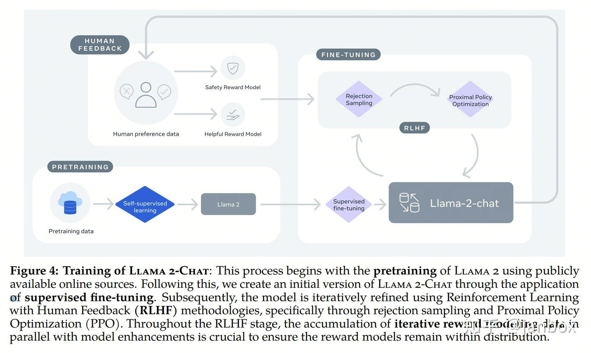

二、[模型结构](https://zhida.zhihu.com/search?content_id=250291658&content_type=Article&match_order=1&q=%E6%A8%A1%E5%9E%8B%E7%BB%93%E6%9E%84&zhida_source=entity)
-----------------------------------------------------------------------------------------------------------------------------------------------------------

*   目前比较成熟,一般采用 gpt架构,Llama/Llama2
    *   Transformer-Decoder结构
    *   PreLayerNorm-RMSNorm-[Root Mean Square Layer Normalization](https://link.zhihu.com/?target=https%3A//proceedings.neurips.cc/paper_files/paper/2019/file/1e8a19426224ca89e83cef47f1e7f53b-Paper.pdf)
    *   ROPE[旋转位置编码](https://zhida.zhihu.com/search?content_id=250291658&content_type=Article&match_order=1&q=%E6%97%8B%E8%BD%AC%E4%BD%8D%E7%BD%AE%E7%BC%96%E7%A0%81&zhida_source=entity)(替换绝对/相对位置编码)
    *   SwiGLU[激活函数](https://zhida.zhihu.com/search?content_id=250291658&content_type=Article&match_order=1&q=%E6%BF%80%E6%B4%BB%E5%87%BD%E6%95%B0&zhida_source=entity)(替换ReLU)-[GLU Variants Improve Transformer](https://link.zhihu.com/?target=https%3A//arxiv.org/pdf/2002.05202v1.pdf)
*   在模型结构不改变的情况下,模型的优化主要在于 分词、参数选择、训练数据,同时也包括对attention方法的选择
*   [优化方法](https://zhida.zhihu.com/search?content_id=250291658&content_type=Article&match_order=1&q=%E4%BC%98%E5%8C%96%E6%96%B9%E6%B3%95&zhida_source=entity)需进行实验评估效果,或直接采用他人较好的方法

三、训练数据
------

| 训练阶段 | 说明  | 常见数据集 |
| --- | --- | --- |
| [pre-train](https://zhida.zhihu.com/search?content_id=250291658&content_type=Article&match_order=1&q=pre-train&zhida_source=entity)   (continual-train) | 收集、整理清洗,分类筛选,多语言无需特别加工,主要是数据分布合理,质量保障 | C4(T5),RedPajama,Pile,Wudao,ROOTS(BLOOM) |
| sft | [指令微调](https://zhida.zhihu.com/search?content_id=250291658&content_type=Article&match_order=1&q=%E6%8C%87%E4%BB%A4%E5%BE%AE%E8%B0%83&zhida_source=entity):数据需要人工加工,已经有一些公开数据集了主要目的是让机器学会一些思考、回答问题的方法 |     |
| RLHF | 需要单独组织,人工整理数据主要目的是在回答的helpful、safety等方面符合人类标准 | [https://github.com/anthropics/hh-rlhf/blob/master/README.md](https://link.zhihu.com/?target=https%3A//github.com/anthropics/hh-rlhf/blob/master/README.md) |

四、Tokenizer([分词器](https://zhida.zhihu.com/search?content_id=250291658&content_type=Article&match_order=1&q=%E5%88%86%E8%AF%8D%E5%99%A8&zhida_source=entity))
------------------------------------------------------------------------------------------------------------------------------------------------------------

分词器把句子切分为一个一个的token,作为模型的输入.  
通常情况下,Tokenizer有三种粒度: word/char/subword.  
llm使用的 Tokenizer 一般为subword.常见的方法有:

*   Byte-Pair Encoding (BPE): [字节对编码](https://zhida.zhihu.com/search?content_id=250291658&content_type=Article&match_order=1&q=%E5%AD%97%E8%8A%82%E5%AF%B9%E7%BC%96%E7%A0%81&zhida_source=entity)
    *   本质是一种[数据压缩](https://zhida.zhihu.com/search?content_id=250291658&content_type=Article&match_order=1&q=%E6%95%B0%E6%8D%AE%E5%8E%8B%E7%BC%A9&zhida_source=entity)方法.2015年Sennrich 通过论文[Neural Machine Translation of Rare Words with Subword Units](https://link.zhihu.com/?target=https%3A//readpaper.com/pdf-annotate/note%3FpdfId%3D4518062209728405505)将这个算法使用在生成Tokenizer的词表上,做法是先将每个文本词(Word)拆分成 Char粒度的字母序列,然后通过迭代地合并最频繁出现的字符或字符序列来实现生成Tokenizer最终词表的过程
    *   最早OpenAI GPT-2 与Facebook RoBERTa均采用此方法进阶版BBPE构建 Subword 向量,也是目前最常用的Tokenizer方法之一
*   Byte-level BPE(BBPE)
    *   2019年12月,论文: [Neural Machine Translation with Byte-Level Subwords](https://link.zhihu.com/?target=https%3A//readpaper.com/pdf-annotate/note%3FpdfId%3D4498433294026301441%26noteId%3D1905877401569905152) 在基于BPE基础上提出以Byte-level为粒度的分词算法Byte-level BPE,即BBPE.解决中文、日文等语言时的词表OOV问题,BBPE考虑将一段文本的UTF-8编码(UTF-8保证任何语言都可以通用)中的一个字节256位不同的编码作为词表的初始化基础Subword.
    *   但对中文、日文不友好.中文字符 UTF8 为三字节,编码效率低
    *   Llama 使用
*   WordPiece: 对BPE的改变是使用语言本身的分布概率代替词频进行编码
*   SentencePiece
    *   固定词汇表,空格还原; 内部支持BPE、wordpiece编码; 快速且轻量级
    *   参考: [https://zhuanlan.zhihu.com/p/630696264](https://zhuanlan.zhihu.com/p/630696264)
    *   Yi 使用

以下为几个LLM的Tokenizer的情况:

| 模型  | 训练数据量 | 模型参数 | 训练数据范围 | 词表大小 | [分词算法](https://zhida.zhihu.com/search?content_id=250291658&content_type=Article&match_order=2&q=%E5%88%86%E8%AF%8D%E7%AE%97%E6%B3%95&zhida_source=entity) | 分词器(Tokenizer)后端 |
| --- | --- | --- | --- | --- | --- | --- |
| LLaMA | 1T～1.4T tokens(其中,7B/13B使用1T,33B/65B使用1.4T) | 7B～65B | 以英语为主要语言的拉丁语系 | 32000 | BBPE | 基于SentencePiece工具实现 |
| ChatGLM-6B | 约 1T tokens | 6B  | 中英双语 | 130528 | BBPE | 基于SentencePiece工具实现 |
| Bloom | 1.6TB预处理文本,转换为 350B 唯一 tokens | 300M~176B | 46种自然语言,13种编程语言 | 250680 | BBPE | HuggingFace 的 tokenizers (类SentencePiece) |

五、训练耗时
------

主要计算耗时在pretrain环节,Llama2的训练开销如下:

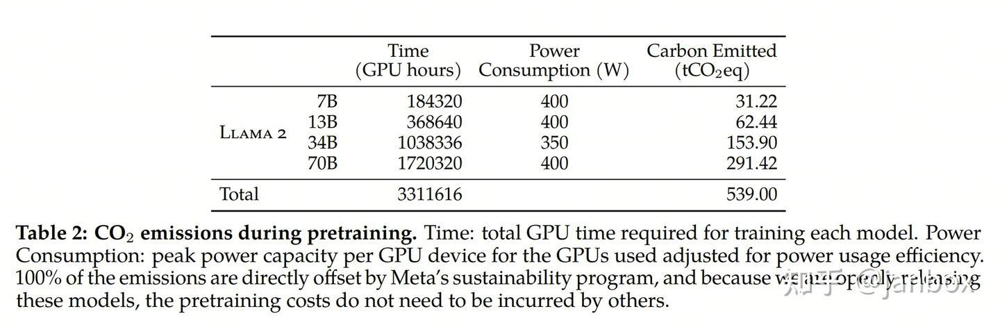

sft/RLHF训练,需要多次迭代,逐步调优.需要人的评价(human-feedback),用于训练奖励模型、强化学习

六、模型评估
------

[模型评估](https://zhida.zhihu.com/search?content_id=250291658&content_type=Article&match_order=2&q=%E6%A8%A1%E5%9E%8B%E8%AF%84%E4%BC%B0&zhida_source=entity)用来衡量模型的优劣,已经形成了多种评估方法及指标

*   在[自然语言处理](https://zhida.zhihu.com/search?content_id=250291658&content_type=Article&match_order=1&q=%E8%87%AA%E7%84%B6%E8%AF%AD%E8%A8%80%E5%A4%84%E7%90%86&zhida_source=entity)能力的常见评价: 阅读理解、知识问答、推理、数学、代码等
*   安全性、有用性: (有用并符合人类价值观)

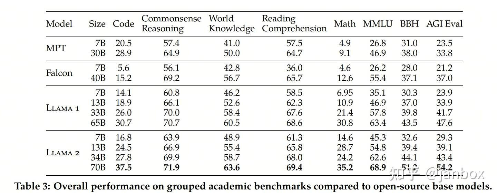

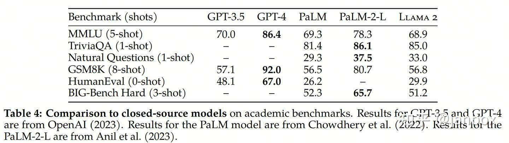

七、训练过程预测及控制
-----------

在模型结构基本不变的情况下,模型的优化在于训练数据、参数等的匹配,训练过程的优化及预估

### 7.1 OpenAI的scale 定律

论文: Scaling Laws for Neural Language Models ([https://arxiv.org/pdf/2001.08361v1.pdf](https://link.zhihu.com/?target=https%3A//arxiv.org/pdf/2001.08361v1.pdf))

*   图1表明,语言模型表现与模型参数量N(Embedding除外)、训练Token数D、训练总计算量C都呈现[幂定律](https://zhida.zhihu.com/search?content_id=250291658&content_type=Article&match_order=1&q=%E5%B9%82%E5%AE%9A%E5%BE%8B&zhida_source=entity):

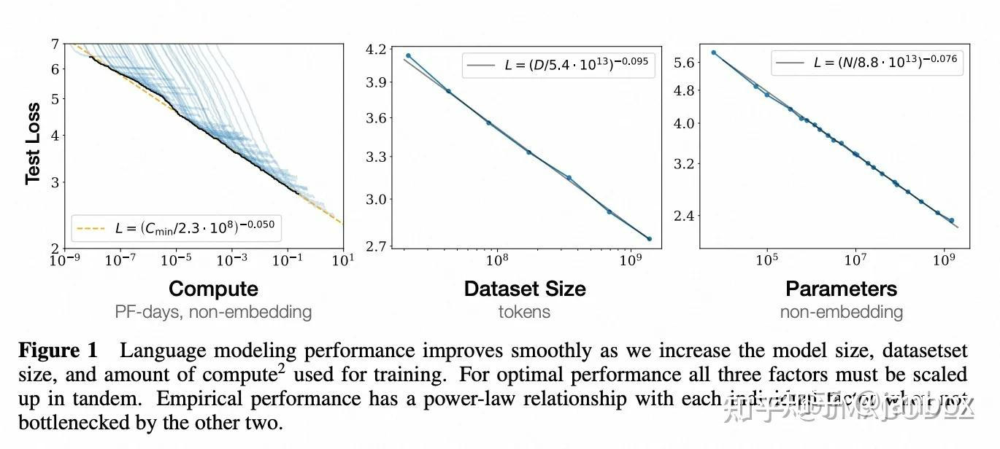

*   图2表明,模型大小从768~1.5B在不同Token数(22M-23B)上训练的过程:

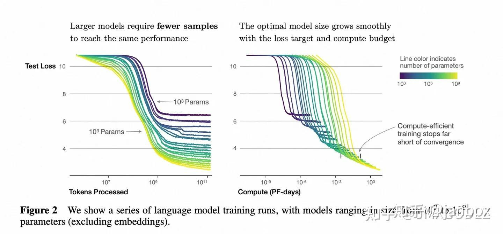

*   图3表明,随着计算量增加需要了解计算资源如何高效的分配.论文中以计算能力增加10亿倍为例,对于最优效率训练,大部分计算资源用于增加模型大小,小部分用于数据增加,同时数据增加大部分用于增加batch大小,很少用于增加模型[串行训练](https://zhida.zhihu.com/search?content_id=250291658&content_type=Article&match_order=1&q=%E4%B8%B2%E8%A1%8C%E8%AE%AD%E7%BB%83&zhida_source=entity)的step数

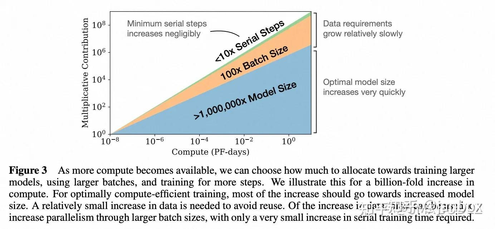

关键结论:

*   模型表现强依赖于模型规模(模型参数量N(Embedding除外)、训练Token数D、训练总计算量C);
*   平滑幂定律: 模型表现与三个因子均遵循幂定律,不受另外两个因子限制;
*   过拟合的通用性: 当同时提升N/D时,模型性能提升; 但如果固定其中一个,模型表现取决于比例N^{0.74}/D.(与下文DeepMind工作冲突)
*   训练的通用性: 训练曲线遵循可预测的幂律,其参数独立于模型大小.通过推断训练曲线的早期部分,可以大致预测如果训练更长时间会达到的损失.
*   迁移学习表现与测试性能相关: 当在不同于[训练分布](https://zhida.zhihu.com/search?content_id=250291658&content_type=Article&match_order=1&q=%E8%AE%AD%E7%BB%83%E5%88%86%E5%B8%83&zhida_source=entity)的文本上[评估模型](https://zhida.zhihu.com/search?content_id=250291658&content_type=Article&match_order=1&q=%E8%AF%84%E4%BC%B0%E6%A8%A1%E5%9E%8B&zhida_source=entity)时,结果与训练验证集上的结果强相关,并且损失大致上存在一个恒定的偏差.换句话说,将模型迁移到不同的分布会产生一个恒定的偏差,模型在训练集上的表现越好,迁移学习的效果也越好.
*   样本效率: 大模型比小模型更具样本效率,可以通过更少的优化步骤和更少的数据达到相同的性能水平.
    *   收敛效率低: 在固定的计算预算C下,但没有其他限制的情况下,通过训练非常大的模型并在收敛之前显著停止,可以获得最佳性能.因此,最大计算效率的训练将比基于更多样本训练小型模型收敛的效率高得多,随着训练计算的增加,数据需求增长非常缓慢,即 D ∼ C ^{0.27}.
*   最佳的batchsize: 这些模型的理想batchsize仅与损失的幂指数相关,并且可以通过测量梯度噪声尺度\[MKAT18\]来确定; 对于可以训练的最大模型,在收敛时Token数大约为1-2百万.

总体来说,这些结果表明,随着适当地提高模型大小、数据和计算能力,语言建模性能会平稳、可预测地提高.更大的语言模型将比其他模型表现更好,并且更具样本效率.

### 7.2 DeepMind:大模型训练计算优化[实证分析](https://zhida.zhihu.com/search?content_id=250291658&content_type=Article&match_order=1&q=%E5%AE%9E%E8%AF%81%E5%88%86%E6%9E%90&zhida_source=entity)

论文: Training Compute-Optimal Large Language Models ([https://arxiv.org/pdf/2203.15556.pdf](https://link.zhihu.com/?target=https%3A//arxiv.org/pdf/2203.15556.pdf))  
核心问题: 给定训练参数量的情况下,如何配置模型参数量以及训练Token数.  
与OpenAI提出大[模型缩放](https://zhida.zhihu.com/search?content_id=250291658&content_type=Article&match_order=1&q=%E6%A8%A1%E5%9E%8B%E7%BC%A9%E6%94%BE&zhida_source=entity)法则不同的是,DeepMind认为当前许多大模型是训练不充分的;

*   OpenAI在《Scaling Laws for Neural Language Models》中,指出在给定计算量的时候,模型性能的提升主要在于增加参数规模而不是增加数据量;
*   本文则指出在每条曲线的最小值的左侧,模型太小了——在较少数据上训练的较大模型将是一种改进.在每条曲线的最小值的右侧,模型太大——在更多数据上训练的较小模型将是一种改进.最好的模型处于最小值.

在文中,作者探讨了三种不同的策略来评估和确定在给定训练参数量的情况下,最佳的模型参数量与训练 Token 数的配比:

*   方法一: 固定模型大小,改变训练Token数;
*   方法二: 等值[浮点运算](https://zhida.zhihu.com/search?content_id=250291658&content_type=Article&match_order=1&q=%E6%B5%AE%E7%82%B9%E8%BF%90%E7%AE%97&zhida_source=entity)能力剖析(IsoFLOP profiles);
*   方法三: 拟合参数[损失函数](https://zhida.zhihu.com/search?content_id=250291658&content_type=Article&match_order=1&q=%E6%8D%9F%E5%A4%B1%E5%87%BD%E6%95%B0&zhida_source=entity);

结论:  
这三个实验得到了相同的结论: 计算量增加后,模型参数量大小与训练Token数应该同比增加.根据方法1,预测的模型大小需要的训练Token数如下表:

| Parameters | FLOPs | FLOPs (in Gopher unit) | Tokens |
| --- | --- | --- | --- |
| 400 Million | 1.92E+19 | 1//29,968 | 8.0 Billion |
| 1 Billion | 1.21E+20 | 1//4,761 | 20.2 Billion |
| 10 Billion | 1.23E+22 | 1//46 | 205.1 Billion |
| 67 Billion | 5.76E+23 | 1   | 1.5 Trillion |
| 175 Billion | 3.85E+24 | 6.7 | 3.7 Trillion |
| 280 Billion | 9.90E+24 | 17.2 | 5.9 Trillion |
| 520 Billion | 3.43E+25 | 59.5 | 11.0 Trillion |
| 1 Trillion | 1.27E+26 | 221.3 | 21.2 Trillion |
| 10 Trillion | 1.30E+28 | 22515.9 | 216.2 Trillion |

### 7.3 重复Token对模型性能的影响

To Repeat or Not To Repeat: Insights from Scaling LLM under Token-Crisis([https://arxiv.org/pdf/2305.13230.pdf](https://link.zhihu.com/?target=https%3A//arxiv.org/pdf/2305.13230.pdf))  
(10多个结论)

*   模型参数规模与tokens数量需要匹配: 模型参数规模的增长与模型需要的tokens数量基本是呈线性的.
*   多轮[epoch](https://zhida.zhihu.com/search?content_id=250291658&content_type=Article&match_order=1&q=epoch&zhida_source=entity)的训练会降低模型性能.此外,如果tokens数量不够,模型参数规模越大,越容易出现过拟合的现象！
*   更大规模的数据集会缓解重复[epochs](https://zhida.zhihu.com/search?content_id=250291658&content_type=Article&match_order=1&q=epochs&zhida_source=entity)对模型性能下降的影响
*   提高数据集的质量也无法挽救重复训练带来的[过拟合](https://zhida.zhihu.com/search?content_id=250291658&content_type=Article&match_order=3&q=%E8%BF%87%E6%8B%9F%E5%90%88&zhida_source=entity)
*   参数数量和FLOPs在重复训练上的影响: 发现,FLOPs较大的模型性能会更好一点,但是依然无法有效降低重复训练带来的模型损失
*   小计算量模型的过拟合趋势与大计算量的差不多
*   多样的训练目标可以减轻多Epoch下降吗？如果语言模型的训练目标多样化,那么实际上更加可能受到多epoch带来的性能损失.
*   Dropout是一个被[大语言模型](https://zhida.zhihu.com/search?content_id=250291658&content_type=Article&match_order=1&q=%E5%A4%A7%E8%AF%AD%E8%A8%80%E6%A8%A1%E5%9E%8B&zhida_source=entity)忽视的正则技术,虽然慢,但是可以降低多epochs的影响
*   在训练过程中逐渐使用dropout是有效的策略.如果前期训练不用dropout,在后续的迭代中使用dropout也是有效的！
*   dropout对不同规模模型的影响不同: 尽管前面已经证明dropout使用可以降低多epochs的影响,但是在不同规模模型下是不同的.对于规模较大的模型,dropout不能有效降低多epochs带来的坏处！
*   通过MoE扫描确定稠密模型的最佳超参数: MoE的模型表现与大模型真正的训练有类似的趋势,因此用MoE去提前预估大模型的性能,做[参数调优](https://zhida.zhihu.com/search?content_id=250291658&content_type=Article&match_order=1&q=%E5%8F%82%E6%95%B0%E8%B0%83%E4%BC%98&zhida_source=entity)是一个非常好的思路.

### 7.4 sft数据需要多少

参考链接: [https://mp.weixin.qq.com/s/DVH-vlOpGik8iwW4KnPlkw](https://link.zhihu.com/?target=https%3A//mp.weixin.qq.com/s/DVH-vlOpGik8iwW4KnPlkw)  
通过[消融实验](https://zhida.zhihu.com/search?content_id=250291658&content_type=Article&match_order=1&q=%E6%B6%88%E8%9E%8D%E5%AE%9E%E9%AA%8C&zhida_source=entity)研究训练数据的多样性、质量和数量的影响,对于对齐的目的,扩大输入多样性和输出质量有可衡量的积极影响,而仅仅扩大数量可能没有.

*   《LIMa: Less Is More for Alignment》一文的消融实验显示,当扩大数据量而不同时扩大提示多样性时,收益会大大减少,而在优化数据质量时,收益会大大增加.
*   《MAYBE ONLY 0.5% DATA IS NEEDED》一文的实验表明,特定任务的模型可能从固定的任务类型中获益,以获得更高的性能; 指令格式的多样性可能对特定任务模型的性能影响很小; 即使是少量的数据(1.9M tokens)也能为特定任务模型的指令调整带来可喜的结果.

### 7.5 训练估算

参考: LLM训练指南:模型参数、计算量、显存、计算时间计算 [https://zhuanlan.zhihu.com/p/639872915](https://zhuanlan.zhihu.com/p/639872915)  
参数量:

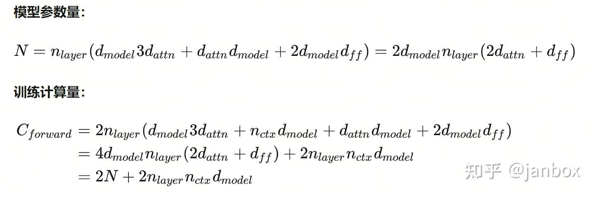

训练时间:

八、[模型微调](https://zhida.zhihu.com/search?content_id=250291658&content_type=Article&match_order=1&q=%E6%A8%A1%E5%9E%8B%E5%BE%AE%E8%B0%83&zhida_source=entity)
-----------------------------------------------------------------------------------------------------------------------------------------------------------

(参考资料: 复刻ChatGPT语言模型系列 二: 参数微调)  
全量参数微调: Full Fine-tuning  
PEFT(Parameter Efficient Fine-Tuning): 包括 Lora, P-tuning,Adapter.三种方法都是在Transformer的结构中局部扩展一些可调参数.

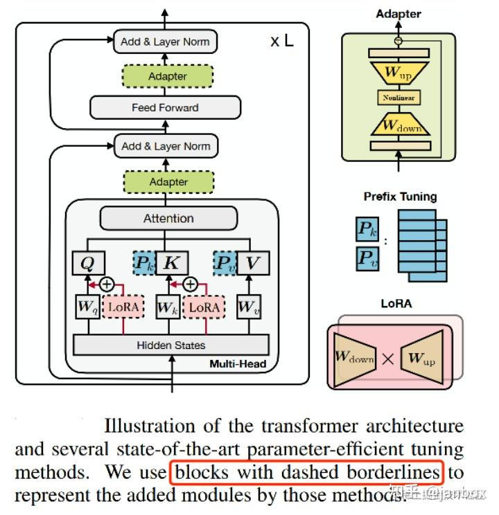

### 8.1 Lora

*   全参训练非常昂贵.微软提出了[低秩自适应](https://zhida.zhihu.com/search?content_id=250291658&content_type=Article&match_order=1&q=%E4%BD%8E%E7%A7%A9%E8%87%AA%E9%80%82%E5%BA%94&zhida_source=entity)(LoRA),它冻结了预训练的模型权重,将可训练的[秩分解矩阵](https://zhida.zhihu.com/search?content_id=250291658&content_type=Article&match_order=1&q=%E7%A7%A9%E5%88%86%E8%A7%A3%E7%9F%A9%E9%98%B5&zhida_source=entity)注入到Transform架构的每一层,极大地减少了下游任务的可训练参数的数量.
*   AdaLora:
    *   **分配到更多可微调参数到重要的参数矩阵**中可以提高模型的效果,根据参数对Loss的影响大小来来调整LoRa[矩阵的秩](https://zhida.zhihu.com/search?content_id=250291658&content_type=Article&match_order=1&q=%E7%9F%A9%E9%98%B5%E7%9A%84%E7%A7%A9&zhida_source=entity)
    *   AdaLORA只裁剪[奇异值矩阵](https://zhida.zhihu.com/search?content_id=250291658&content_type=Article&match_order=1&q=%E5%A5%87%E5%BC%82%E5%80%BC%E7%9F%A9%E9%98%B5&zhida_source=entity),并不裁剪奇异向量,因此训练过程中更容易恢复被误删的奇异值.
    *   AdaLORA的P和Q[正交矩阵](https://zhida.zhihu.com/search?content_id=250291658&content_type=Article&match_order=1&q=%E6%AD%A3%E4%BA%A4%E7%9F%A9%E9%98%B5&zhida_source=entity),而LORA的A和B非正交.AdaLORA训练过程中裁剪操作不会影响其他奇异值对应的奇异向量,因此训练会更稳定泛化性能更好
*   QLora: 通过量化减少显存使用

### 8.2 P-tuning

*   Prefix-tuning: 在 transformer的每一层输入增加一个前缀向量(可以微调),固定模型的原有参数.
*   Prompt-tuning: 仅在transformer的第一层输入增加前缀向量,其他同prefix-tuning
*   P-tuning: 将Prompt转换为可以学习的[Embedding层](https://zhida.zhihu.com/search?content_id=250291658&content_type=Article&match_order=1&q=Embedding%E5%B1%82&zhida_source=entity),并用MLP+LSTM的方式来对Prompt Embedding进行一层处理
*   P-tuning V2: 把prompt转换后的embeding,作为每一层的输入,以持续发挥作用 (类似prefix-tuning)

### 8.3 Adapter

*   AdapterTuning(论文: Parameter-Efficient Transfer Learning for NLP),该方法设计了Adapter结构,并将其嵌入Transformer的结构里面,针对每一个Transformer层,增加了两个Adapter结构(分别是多头注意力的投影之后和第二个feed-forward层之后),在训练时,固定住原来预训练模型的参数不变,只对新增的 Adapter 结构和 Layer Norm 层进行微调,从而保证了训练的高效性.
*   AdapterFusion: 融合[多任务](https://zhida.zhihu.com/search?content_id=250291658&content_type=Article&match_order=1&q=%E5%A4%9A%E4%BB%BB%E5%8A%A1&zhida_source=entity)信息的Adapter的变体,在 Adapter 的基础上进行优化,通过将学习过程分为两阶段来提升下游任务表现.
*   AdapterDrop: 不是每一层均加入 Transformer中均 加入 Adapter,以加速学习和推理性能.效果基本不下降

### 8.4 MAM Adapter

论文: TOWARDS A UNIFIED VIEW OF PARAMETER-EFFICIENT TRANSFER LEARNING  
MAM(mix-and-match): 把上面的几种PEFT的方法进行抽象并泛化,新增其他的形式: Parallel Adapter(PA), Scaled PA(SPA)等

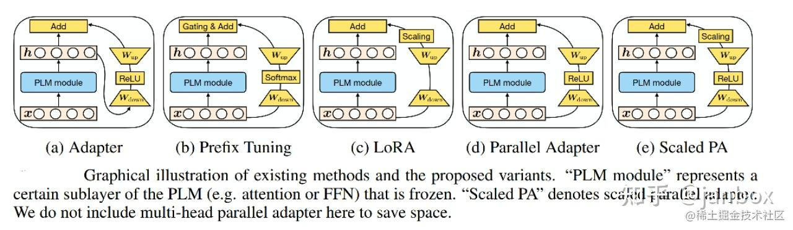

不同的形式的差异如下:

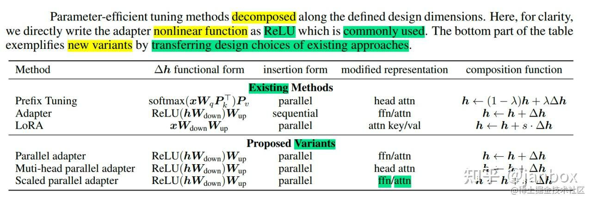

作者对Adapter的放置和软提示(soft prompt)进行了详细的调查.得出如下结论:

*   并行放置的Adapter优于顺序放置的Adapter,并且与 FFN 并行放置的Adapter优于多头注意力(MHA)并行放置的Adapter(模型修改的位置如下图中所示,蓝色表示修改Attention、红色表示修改FFN).
*   软提示可以通过仅更改 0.1% 的参数来有效地修改注意力

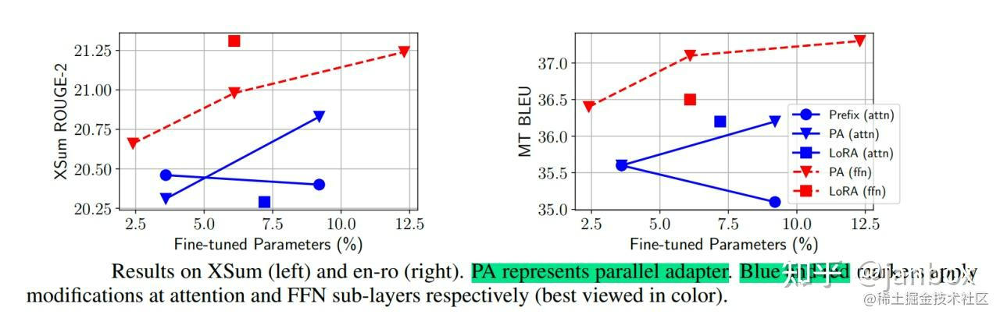

最终模型 MAM Adapter 是用 FFN 层的并行Adapter和软提示的组合.通过最终的实验结果,可以看到 MAM Adapter 在仅用了6.7%参数量(相比全量微调)的情况下,在Xsum和MT这两个任务上达到了和全量微调相近的效果,并且该方法大大优于 BitFit 和 Prompt Tuning,并始终优于 LoRA、Adapter 和 Prefix Tuning

### 8.5 UniPELT

论文: A Unified Framework for Parameter-Efficient Language Model Tuning  
通过一个门控参数来统一 Lora/p-tuning/Adapter,混合了三种微调方式

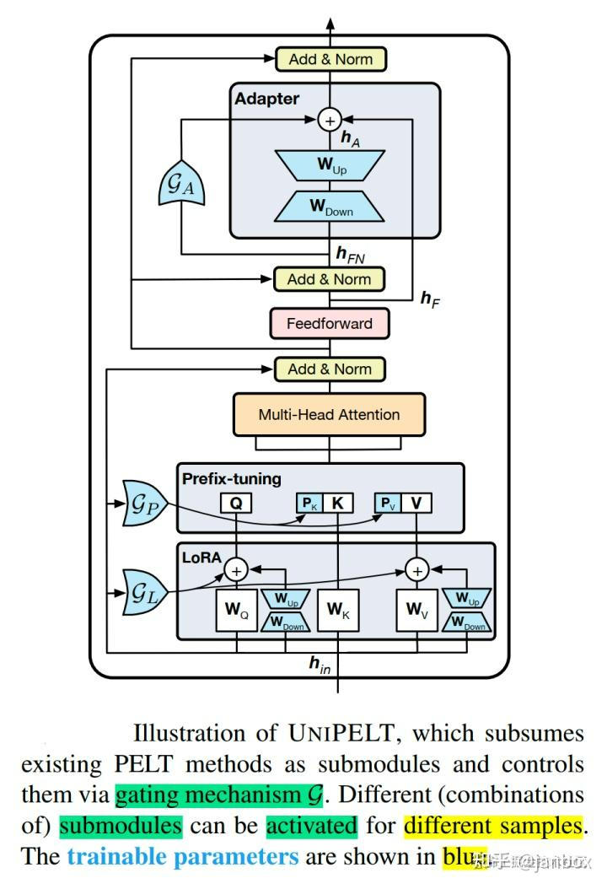

UniPELT 仅用 100 个示例就在低数据场景中展示了相对于单个 LoRA、Adapter 和 Prefix Tuning 方法的显著改进.在更高数据的场景中,UniPELT 的性能与这些方法相当或更好.

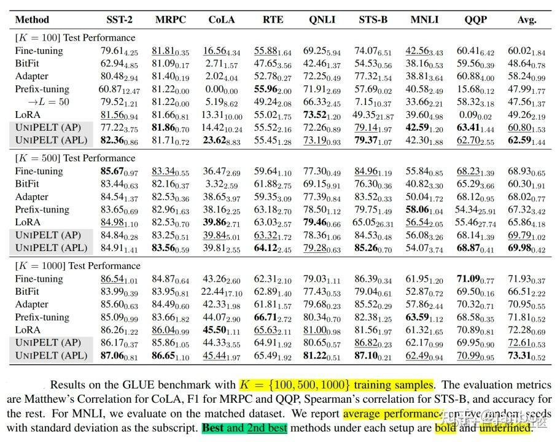

性能对比如下:

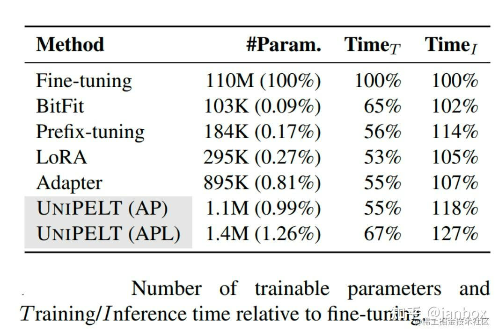

附录:
---

### 附A: 参考资料

*   复刻ChatGPT语言模型系列: [https://zhuanlan.zhihu.com/p/627832567](https://zhuanlan.zhihu.com/p/627832567)
    *   [(一)基座模型选取](https://zhuanlan.zhihu.com/p/627832567)
    *   [(二)参数高效微调](https://zhuanlan.zhihu.com/p/663412945)
    *   (三)指令学习微调
    *   [(四)文本生成解码](https://zhuanlan.zhihu.com/p/629909354)
    *   (五)强化学习RLHF
    *   (六)LLM模型评估
*   LLM训练指南系列
    *   Token及模型参数准备 [https://zhuanlan.zhihu.com/p/636812912](https://zhuanlan.zhihu.com/p/636812912)
    *   模型参数、计算量、显存、计算时间计算 [https://zhuanlan.zhihu.com/p/639872915](https://zhuanlan.zhihu.com/p/639872915)
*   数据集
    *   大规模[语料库](https://zhida.zhihu.com/search?content_id=250291658&content_type=Article&match_order=1&q=%E8%AF%AD%E6%96%99%E5%BA%93&zhida_source=entity): [https://zhuanlan.zhihu.com/p/639998600](https://zhuanlan.zhihu.com/p/639998600)

### 附B: 重要论文

*   Llama: [https://arxiv.org/pdf/2302.13971.pdf](https://link.zhihu.com/?target=https%3A//arxiv.org/pdf/2302.13971.pdf)
*   Llama2: [https://arxiv.org/pdf/2307.09288.pdf](https://link.zhihu.com/?target=https%3A//arxiv.org/pdf/2307.09288.pdf)

### 附C: 重要开源

*   Meta opt-175B 模型及训练(日志): [https://github.com/facebookresearch/metaseq/blob/main/projects/OPT/README.md](https://link.zhihu.com/?target=https%3A//github.com/facebookresearch/metaseq/blob/main/projects/OPT/README.md)