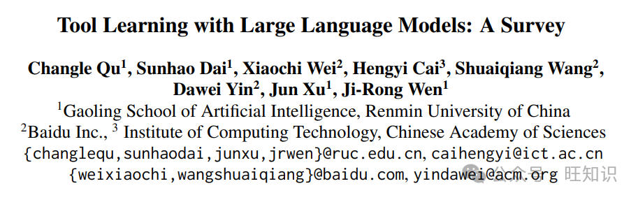
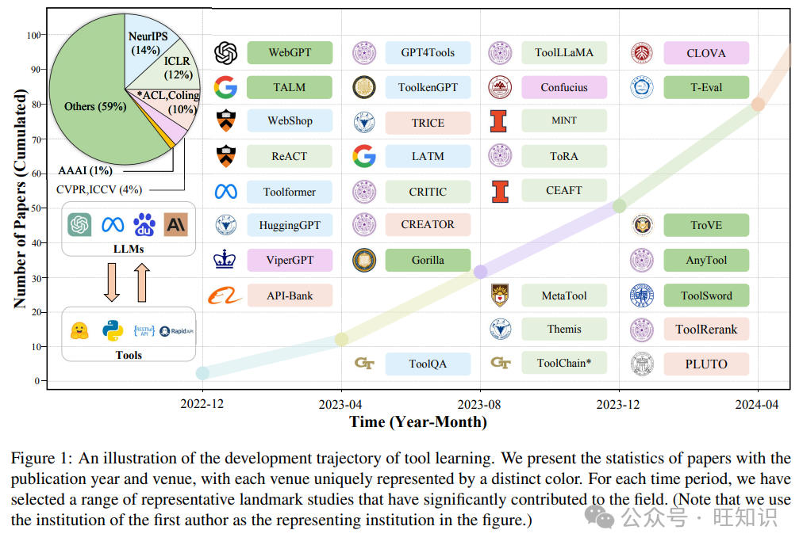
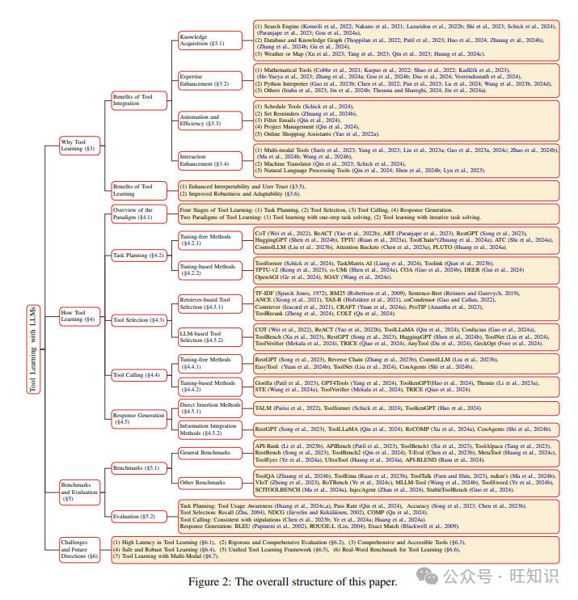
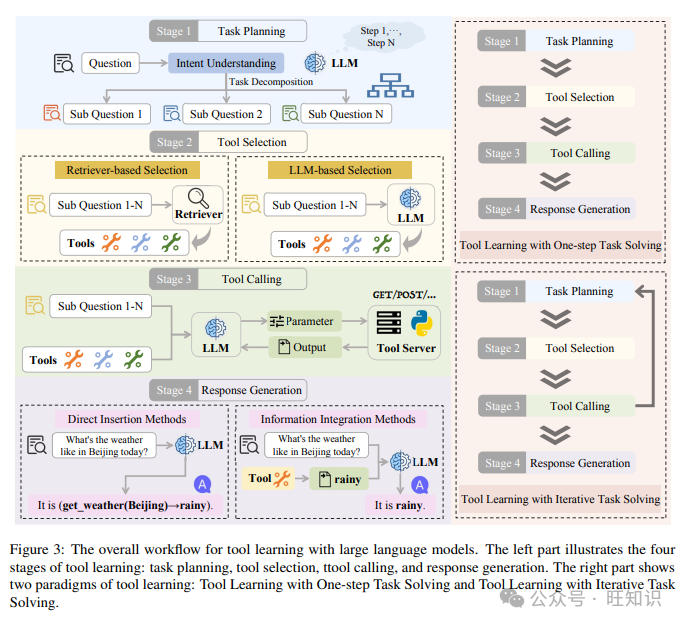
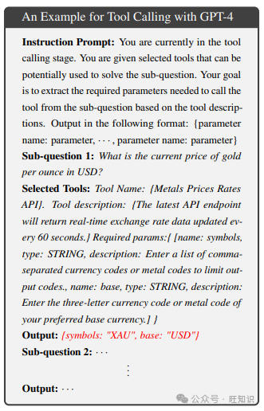
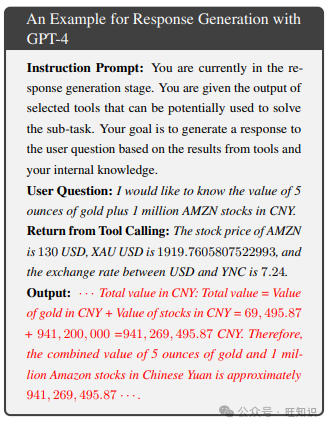

# 大语言模型工具学习全面综述&背景、定义、范式、评估、趋势
> 近期，大语言模型的工具学习已成为增强LLMs能力、解决高度复杂问题的一个有前景的范式。尽管这个领域得到了越来越多的关注和快速发展，但现有的文献仍然分散且缺乏系统性的组织，为新入门者设置了障碍。这一差距促使我们对现有的LLMs工具学习作品进行全面的综述。在这项综述中，我们从两个主要方面（**1）工具学习的好处是什么，以及（2）工具学习是如何实施的**，进行了文献回顾，从而全面理解LLMs的工具学习。我们首先通过从六个具体方面回顾工具整合的好处和工具学习范式的固有好处来探索“为什么”。在“如何”方面，我们根据工具学习工作流程的四个关键阶段的分类法系统回顾了文献：任务规划、工具选择、工具调用和响应生成。此外，我们还提供了现有基准和评估方法的详细总结，根据它们与不同阶段的相关性进行分类。最后，我们讨论了当前的挑战并概述了潜在的未来方向，旨在激发研究人员和工业开发者进一步探索这一新兴和有前景的领域。

我们翻译解读最新论文：大语言模型工具学习综述，文末有论文链接。

1 引言
----

> 在历史上，人类不断寻求创新，利用日益复杂的工具来提高效率和增强能力（Washburn, 1960; Gibson等人，1993）。这些工具，扩展了我们的智力和体力，对推动社会和文化进化至关重要（Von Eckardt, 1995）。从原始的石器到先进的机械，这一进步扩大了我们的潜力，超越了自然限制，使我们能够更复杂、更高效地管理任务（Shumaker等人，2011）。今天，我们正在经历一场新的技术复兴，这一复兴是由人工智能的突破推动的，特别是通过大型语言模型的发展。像ChatGPT这样的开创性模型展示了显著的能力，在自然语言处理（NLP）任务的一系列领域，包括摘要（El-Kassas等人，2021; Zhang等人，2024c）、机器翻译（Zhang等人，2023a; Feng等人，2024）、问答（Yang等人，2018; Kwiatkowski等人，2019）等方面取得了显著进展。然而，尽管LLMs拥有令人印象深刻的能力，它们在进行复杂计算和提供准确、及时的信息方面常常遇到困难，因为它们依赖于固定和参数化的知识（Mallen等人，2022; Vu等人，2023）。这种固有的局限性经常导致响应在表面上看似合理但事实上可能是错误的或过时的（通常被称为幻觉）（Ji等人，2023; Zhang等人，2023c），给用户带来了重大风险并误导了用户。随着LLMs能力的不断提升，预计LLMs将变得精通使用工具来解决复杂问题，就像人类一样（Qin等人，2023），这被称为LLMs的工具学习。工具学习作为解决LLMs这些局限性的一个有希望的解决方案，通过使LLMs能够与外部工具动态交互（Schick等人，2024; Qin等人，2024; Tang等人，2023）。这种方法不仅增强了LLMs的问题解决能力，而且还扩大了它们的功能范围（Yao等人，2022a; Lazaridou等人，2022a; Lu等人，2023）。例如，LLMs可以使用计算器工具执行复杂计算，通过天气API获取实时天气更新，并通过解释器执行编程代码（Pan等人，2023; Wang等人，2024d）。这种整合显著提高了它们对用户查询的响应准确性，促进了更有效和可靠的用户交互。随着这个领域的不断发展，工具增强的LLMs预计将在NLP的未来发挥关键作用（Parisi等人，2022; Karpas等人，2022），提供更多功能强大和适应性强的解决方案（Nakano等人，2021; Surís等人，2023）。

2 背景
----

> 在本节中，我们提供了与工具学习相关的概念和术语的概述。

**什么是工具？**在增强LLMs的背景下，工具的定义非常广泛。Mialon等人（2023）将工具描述为“外部使用的一个不附加或可操纵的附加环境对象，以更有效地改变另一个对象的形式、位置或状态。”另一方面，Wang等人（2024）定义工具为“语言模型使用的工具是一个计算机程序的功能接口，该程序在语言模型外部运行，语言模型生成功能调用和输入参数以使用该工具。”同样，我们认为任何通过外部手段增强LLMs的方法都符合工具的定义。值得注意的是，检索增强生成（RAG）是工具学习的一个特定实例，其中搜索引擎被用作LLMs的工具。同时，“工具”的定义在不同论文中常常保持模糊和不一致。例如，一些研究明确定义了工具和API，认为工具包括多个API的聚合（Patil等人，2023；Xu等人，2023；Qin等人，2024）。相反，其他研究将每个API视为一个独立的工具（Anantha等人，2023；Li等人，2023b；Tang等人，2023）。在本综述中，我们按照文本中早期建立的工具定义，将每个API视为一个单独的工具。

**什么是工具学习？** 工具学习指的是“旨在释放LLMs与各种工具有效交互以完成复杂任务的能力”（Qin等人，2024）的过程。这种范式显著提高了LLMs解决复杂问题的能力。例如，当ChatGPT接收到用户查询时，它会评估是否需要调用特定工具。如果需要工具，ChatGPT将透明地使用该工具概述问题解决过程，解释其响应背后的逻辑，从而确保用户获得一个知情的答案。此外，在初始解决方案失败的情况下，ChatGPT将重新评估其工具选择，并采用替代方案生成新响应。

3 为什么需要工具学习？
------------

> 在本节中，我们将从两个主要角度详细说明工具学习对LLMs的多方面重要性：工具整合的好处和工具学习范式本身的好处。一方面，将工具整合到LLMs中可以在多个领域增强能力，即知识获取、专业能力增强、自动化和效率以及交互增强。另一方面，采用工具学习范式增强了响应的稳健性和生成过程的透明度，从而提高了可解释性和用户信任，同时改善了系统的稳健性和适应性。后续小节将详细阐述这六个方面，概述为什么工具学习对LLMs很重要。

3.1 知识获取
--------

> 尽管LLMs在各个领域展示了其巨大的能力（Ouyang等人，2022），它们的能力仍然受到预训练期间学习的知识范围的限制（Mallen等人，2022）。这种嵌入的知识是有限的，缺乏获取更新信息的能力。此外，LLMs的有效性还受到用户提示的影响，这些提示可能并不总是精心制作的。因此，LLMs容易产生表面上看似合理但可能包含事实错误的内容包括幻觉。一个有前景的方法是将LLMs与能够动态获取和整合外部知识的能力相结合。例如，使用搜索引擎工具可以使LLMs访问当代信息（Komeili等人，2022；Nakano等人，2021；Lazaridou等人，2022b；Shi等人，2023；Schick等人，2024；Paranjape等人，2023；Gou等人，2024a），而整合数据库工具则允许LLMs访问结构化数据库以检索特定信息或执行复杂查询，从而扩大了它们的知识库（Thoppilan等人，2022；Patil等人，2023；Hao等人，2024；Zhuang等人，2024b；Zhang等人，2024b；Gu等人，2024）。此外，连接天气工具可以获取实时的天气更新、预报和历史数据（Xu等人，2023；Tang等人，2023；Huang等人，2024c），与地图工具的接口使LLMs能够获取和提供地理数据，帮助导航和基于位置的查询（Qin等人，2023）。通过这些增强，LLMs可以超越传统的限制，提供更准确和上下文相关的输出。

3.2 专业能力增强
----------

> 鉴于LLMs是在包含通用知识的数据集上训练的，它们通常在专业领域表现出不足。虽然LLMs展示出对基本数学问题的强大的问题解决能力，在加法、减法操作上表现出色，并且在乘法任务上展现出合理的熟练度，但当面对除法、指数、对数、三角函数和其他更复杂的复合函数时，它们的能力显著下降（Dao和Le，2023；Wei等人，2023）。这种局限性扩展到代码生成任务（Chen等人，2021；Austin等人，2021）以及化学和物理问题（Inaba等人，2023）等，进一步突显了它们在更专业领域的专业知识差距。因此，使用特定工具来增强LLMs的领域特定专业知识是可行的（He-Yueya等人，2023；Kadlˇcík等人，2023；Jin等人，2024b；M. Bran等人，2024）。例如，LLMs可以使用在线计算器或数学工具执行复杂计算、解方程或分析统计数据（Cobbe等人，2021；Karpas等人，2022；Shao等人，2022；Kadlˇcík等人，2023；He-Yueya等人，2023；Zhang等人，2024a；Gou等人，2024b；Das等人，2024；Veerendranath等人，2024）。此外，集成外部编程资源，如Python编译器和解释器，允许LLMs接收代码执行反馈，这对于改进代码以符合用户需求和优化代码生成至关重要（Gao等人，2023b；Chen等人，2022；Pan等人，2023；Lu等人，2024；Wang等人，2023b，2024d；Wu等人，2024b）。这种方法不仅减少了LLMs在专业知识上的差距，还增强了它们在专业应用中的实用性。

3.3 自动化与效率
----------

> LLMs本质上是语言处理器，缺乏独立执行外部操作的能力，例如预订会议室或预订机票（Wang等人，2024f）。将LLMs与外部工具集成，可以通过简单地用所需参数填充工具界面来促进这些任务的执行。例如，LLMs可以采用任务自动化工具来自动化诸如日程安排（Schick等人，2024）、设置提醒（Zhuang等人，2024b）和过滤电子邮件（Qin等人，2024）等重复性任务，从而提高它们对用户帮助的实用性。此外，通过与项目管理和工作流程工具的接口，LLMs可以帮助用户管理任务、监控进度和优化工作流程（Qin等人，2024）。此外，与在线购物助手的集成不仅简化了购物流程（Yao等人，2022a），还提高了处理效率和用户体验。再者，采用数据处理工具使LLMs能够直接进行数据分析和可视化（Qin等人，2023），从而简化了用户的数据操作过程。

3.4 交互增强
--------

> 由于现实世界中用户查询的多样性和多面性，可能包含多种语言和模态，LLMs经常面临在持续理解不同类型的输入方面遇到的挑战。这种变异性可能导致在辨别实际用户意图方面的歧义（Wang等人，2024b）。部署专用工具可以显著增强LLMs的感知能力。例如，LLMs可以利用多模态工具，如语音识别和图像分析，以更好地理解和响应更广泛的用户输入（Surís等人，2023；Yang等人，2023；Liu等人，2023a；Gao等人，2023a，2024c；Zhao等人，2024b；Ma等人，2024b；Wang等人，2024b）。此外，通过与机器翻译工具的接口，LLMs有能力将它们不太精通的语言转换为它们更有效理解的语言（Schick等人，2024；Qin等人，2023）。此外，集成高级自然语言处理工具可以增强LLMs的语言理解能力，从而优化对话管理和意图识别（Qin等人，2024；Shen等人，2024b；Lyu等人，2023）。这些进步可能包括使用上下文理解模型来提升聊天机器人系统性能的平台。最终，提高感知输入和感官感知对于LLMs在管理复杂用户交互方面的能力发展至关重要。

3.5 提高可解释性和用户信任
---------------

> 当前LLMs的一个重要问题是它们的不透明、“黑箱”特性，这并没有向用户透露决策过程（Linardatos等人，2020；Zhao等人，2024a），因此在可解释性方面严重不足。这种不透明性经常导致对LLMs提供响应的可靠性持怀疑态度，并使得确定它们的正确性变得具有挑战性（Weidinger等人，2021）。此外，可解释性在高风险领域尤为重要，如航空、医疗保健和金融（Qin等人，2023；Theuma和Shareghi，2024），在这些领域准确至关重要。因此，理解和解释LLMs对于阐明它们的行为至关重要（Zhao等人，2024a）。一些研究通过使LLMs能够生成带有引用的文本来增强它们的准确性和可解释性（Gao等人，2023c；Sun等人，2023a）。相反，通过使用工具学习，LLMs可以展示它们的决策过程的每一步，从而使它们的操作更加透明（Qin等人，2023）。即使在错误输出的情况下，这种透明度也允许用户快速识别和理解错误来源，这有助于更好地理解和信任LLMs的决策，从而增强有效的人机协作。

3.6 改进的鲁棒性和适应性
--------------

> 现有研究表明，LLMs对提示中的用户输入高度敏感（Wallace等人，2019；Jin等人，2020；Wu等人，2024a）。这些输入的微小修改可能会引起响应的实质性变化，突显了LLMs缺乏鲁棒性。在现实世界中，不同的用户有不同的兴趣和提问方式，导致提示的多样性。提出将专业工具整合作为一种策略，以减少对训练数据中统计模式的依赖（Qin等人，2023；Shen等人，2024b；Schick等人，2024；Qin等人，2024；Hao等人，2024）。这种增强提高了LLMs对输入扰动的抵抗力和对新环境的适应性。因此，这种整合不仅在不确定条件下稳定了模型，还降低了与输入错误相关的风险。

4 如何进行工具学习？
-----------

> 在本节中，我们将首先介绍工具学习的整体范式，包括四个不同的阶段和两种典型的范式。然后，我们将详细回顾工具学习工作流程中每个阶段的最新进展，并提供使用GPT-4进行工具学习以解决特定问题的真实示例，这些示例旨在帮助新入门者更好地理解每个阶段涉及的内容以及如何实现。

4.1 工具学习的整体范式
-------------

> 在本节中，我们将介绍工具学习的整体过程，包括所涉及的四个阶段和两种范式。

**工具学习的四个阶段**。如图3左部分所示，工具学习的标准过程包括**任务规划、工具选择、工具调用和响应生成四个阶段**，这在与工具相关的众多工作中被采用（Song等人，2023；Shen等人，2024b；Ruan等人，2023a；Shen等人，2024a）。该过程概述了工具增强型LLMs与用户交互的流程：给定一个用户问题，初步阶段涉及LLMs分析用户请求以理解其意图，将其分解为潜在可解决的子问题。随后，选择适当的工具来解决这些子问题。这个工具选择过程根据是否使用检索器分为两种类型：**基于检索器的工具选择和基于LLM的工具选择**。最近，人们越来越关注最初使用检索器过滤出适合的前k个工具（Qin等人，2024；Gao等人，2024a；Anantha等人，2023）。这种需求源于现实世界的系统通常拥有大量的工具，由于长度和延迟的限制，将所有工具的描述作为输入提供给LLMs是不切实际的（Qu等人，2024）。随后，用户查询以及选定的工具提供给LLMs，使其能够选择最佳工具并配置工具调用所需的必要参数。**这要求LLMs具备使用工具的敏锐意识，并能够正确选择所需的工具**。此外，LLMs必须从用户查询中提取正确的工具参数，这个过程不仅要求参数内容的准确性，还要求遵守工具参数的特定格式要求。在调用工具之后，LLMs利用工具返回的结果为用户制定更优越的响应。

**工具学习的两种范式**。如图3右部分所示，使用工具学习的方法可以分为两种类型：**一步任务解决的工具学习和迭代任务解决的工具学习**。这些也被称为Wang等人（2024c）中的无反馈规划和有反馈规划，以及Huang等人（2024b）中的分解优先和交错分解。在早期的工具学习研究中（Schick等人，2024；Shen等人，2024b；Lu等人，2024），主要范式是一步任务解决的工具学习：在接收到用户问题后，LLMs会分析用户请求以理解用户意图，并立即计划所有需要解决的问题的子任务。然后，LLMs会根据选定工具返回的结果直接生成响应，而不考虑过程中可能出现的错误或根据工具反馈改变计划。随后的研究引入了一种被称为迭代任务解决的工具学习的新范式（Li等人，2023b；Song等人，2023；Qin等人，2024；Gao等人，2024a）。这种方法不会预先承诺完整的任务计划。相反，它允许与工具进行迭代交互，根据工具反馈逐步调整子任务。这使LLMs能够逐步解决问题，根据工具返回的结果不断完善计划，从而提高解决问题的能力。

4.2 任务规划
--------

> 通常，在现实世界场景中，用户查询往往包含复杂的意图。因此，首先进行任务规划，全面分析用户意图至关重要。这个阶段涉及将用户问题分解为多个子问题，以实现指定目标。此外，考虑到某些任务之间固有的依赖关系，规划者还负责描绘分解任务之间的依赖关系和执行顺序，从而促进子问题之间的相互联系。例如，以下是使用GPT-4进行任务规划的真实示例：

**使用GPT-4进行任务规划的示例**

指令提示：您目前处于任务规划阶段。您收到一个需要多步操作和推理的用户查询。您将用户的问题分解为子问题，并且只有在分解后输出这些子问题。确保通过最少数量的子问题全面覆盖原始问题。用户问题：我想知道5盎司黄金加上100万股AMZN股票的人民币价值是多少。输出：1.目前每盎司黄金的美元价格是多少？2.目前亚马逊（AMZN）每股的美元股价是多少？3.目前美元和人民币（CNY）之间的汇率是多少？

> 这个示例使用一步任务解决的工具学习范式，因为工具学习与迭代任务解决范式在分阶段演示中不太方便。从这个示例中，我们可以看到GPT-4将用户的问题分解为三个子问题。由于GPT-4的内部知识不包含最新信息，因此需要获取黄金和亚马逊（AMZN）股票的最新价格，以及美元和人民币之间的最新汇率。通过这种方式分解查询，GPT-4可以逐步解决复杂问题，展示其逻辑分析能力和处理多步任务的能力。接下来，我们将介绍两个类别中的最新进展：无需微调的方法和基于微调的方法。

### 4.2.1 无需微调的方法

> 现有研究表明（Paranjape等人，2023；Zhang，2023；Li等人，2024），LLMs的固有能力通过例如少次或甚至零次提示的有效方法，如few-shot或zero-shot prompting，能够进行有效的规划。例如，一些研究（Huang等人，2022；Chern等人，2023；Xu等人，2024b）利用提示将复杂任务分解为更简单的子任务，从而促进结构化行动计划。ART（Paranjape等人，2023）构建了一个任务库，当遇到现实世界任务时，从中检索示例作为少次提示。RestGPT（Song等人，2023）引入了一种名为Coarse-to-Fine Online Planning的迭代任务规划方法，使LLMs能够逐步细化任务分解过程。HuggingGPT（Shen等人，2024b）利用复杂的提示设计框架，将基于规范的指令与基于演示的解析方法相结合。ToolChain\*（Zhuang等人，2024a）通过构建整个动作空间作为决策树的规划机制，其中树中的每个节点代表一个潜在的API函数调用。TPTU（Ruan等人，2023a）引入了一个专为基于LLM的AI智能体设计的有结构框架，包含两种不同类型的代理：**一步代理和序列代理**。Attention Buckets（Chen等人，2023a）通过独特的RoPE角度并行操作，形成互补的不同波形，减少LLMs遗漏关键信息的风险。ControlLLM（Liu等人，2023b）引入了一种称为Thoughts-on-Graph (ToG)的范式，利用深度优先搜索（DFS）在预先构建的工具图上识别解决方案。PLUTO（Huang等人，2024a）使用一种自回归规划方法，通过迭代生成假设、进行聚类分析和选择不同的子查询进行细化，直到完全满足初始查询需求。ATC（Shi等人，2024a）直接通过编程使用一系列工具，并提出了一种黑盒探测方法，使LLM能够作为工具学习者独立识别和记录工具使用情况，从而教会自己有效地掌握新工具。

### 4.2.2 基于微调的方法

> 尽管LLMs在零次或少次设置中展示了令人印象深刻的性能，但与经过微调的模型相比，它们仍然不够有效（Erbacher等人，2024）。Toolformer（Schick等人，2024）采用API调用，实际上帮助模型预测未来的token以微调GPT-J，这增强了LLMs有效使用工具的意识和能力。TaskMatrix.AI（Liang等人，2024）利用来自人类反馈的强化学习（RLHF）来利用通过人类反馈获得的知识和洞察力，从而增强基础模型。Toolink（Qian等人，2023b）通过将目标任务分解为解决问题的工具包，然后使用模型利用这些工具通过链式求解（CoS）方法回答问题。TPTU-v2（Kong等人，2023）开发了一个LLM微调器，使用精心策划的数据集对基础LLM进行微调，以便微调后的LLM能够更好地进行任务规划和API调用，特别是针对特定领域的任务。α-UMi（Shen等人，2024a）提出了一种新颖的两阶段训练范式，首先对基础大型语言模型进行广泛的微调，然后将其复制为规划器，以便在规划任务上进行进一步的微调。COA（Gao等人，2024b）训练LLMs首先解码带有抽象占位符的推理链，然后调用领域工具通过填写具体知识来实现每个推理链。DEER（Gui等人，2024）通过自动生成具有多个决策分支的工具使用示例，在各种场景中激发LLMs的决策意识，并通过提出新的工具采样策略来增强LLMs对未见工具的泛化能力。SOAY（Wang等人，2024e）首先让LLM基于复杂的用户输入生成一个可行的API调用计划，即解决方案，然后允许LLM基于生成的解决方案生成可执行的API调用代码。

4.3 工具选择
--------

> 在任务规划阶段之后，LLMs已经将用户问题分解为多个子问题。为了更好地解决这些子问题，有必要选择合适的工具。工具选择过程涉及通过检索器选择或直接允许LLMs从提供的工具列表中挑选。当工具数量过多时，通常使用工具检索器来识别给定查询中最相关的前K个工具，这个过程称为基于检索器的工具选择。如果工具数量有限，或者在接收到工具检索阶段检索到的工具后，LLMs需要根据工具描述和子问题选择适当的工具，这称为基于LLM的工具选择。例如，以下是使用GPT-4进行工具选择的示例：

**使用GPT-4进行工具选择的示例**

指令提示：您目前处于工具选择阶段。您获得了可能用于解决子问题的候选工具列表。在候选工具中，选择一个相关工具列表，这些工具将有助于解决子问题。子问题1：每盎司黄金的当前价格是多少美元？候选工具：1.金属价格汇率API：最新的API端点将每60秒返回实时汇率数据。2.Medium：获取Medium的官方新闻。3.加密货币市场：最近发布的加密货币视频。输出：1.金属价格汇率API：最新的API端点将每60秒返回实时汇率数据。

> 从这个示例中，我们可以看到对于获取黄金价格的子问题，GPT-4可以正确选择所需的工具。具体来说，面对多个候选工具时，**GPT-4可以分析每个工具的特性并选择最适合回答问题的工具**。在这个示例中，GPT-4选择了金属价格汇率API，因为它提供了黄金价格的实时更新信息。这展示了GPT-4在工具选择方面的准确性和有效性。接下来，我们将按照前两个阶段的方式介绍最新进展，分为基于检索器的工具选择和基于LLM的工具选择两类。

### 4.3.1 基于检索器的工具选择

> 现实世界的系统通常包含大量工具，由于长度限制和延迟限制，将所有工具的描述输入LLMs是不切实际的。因此，为了充分利用工具增强型LLMs的潜力，开发一个高效的工具检索系统至关重要。该系统旨在通过从大量工具集中高效选择给定查询最适宜的前K个工具，从而弥合LLMs广泛能力与输入大小实际限制之间的差距。最先进的检索方法可以分为两类：**基于术语的和基于语义的**。

> 基于术语的方法。基于术语的方法（即稀疏检索），如TF-IDF（Sparck Jones, 1972）和BM25（Robertson等人，2009），将文档和查询表示为高维稀疏向量。这些方法使用精确的术语匹配来实现查询和文档之间的高效对齐。例如，Gorilla（Patil等人，2023）使用BM25和GPT-Index构建检索器，以实现工具检索。

> 基于语义的方法。相反，基于语义的方法（即密集检索）使用神经网络学习查询和工具描述之间的语义关系（Reimers和Gurevych, 2019；Xiong等人，2021；Hofstätter等人，2021；Gao和Callan, 2022；Izacard等人，2021），然后使用余弦相似度等方法计算语义相似度。最近，人们对开发和改进更高效的工具检索器越来越感兴趣。一些研究（Kong等人，2023；Qin等人，2024；Gao等人，2024a）训练SentenceBert模型作为工具检索器，实现了相关工具的高效检索。CRAFT（Yuan等人，2024a）指示LLMs根据给定的查询生成虚构的工具描述，然后使用这个虚构的工具进行搜索。Anantha等人（2023）基于任务分解的概念提出了ProTIP。COLT（Qu等人，2024）提出了一种使用图神经网络（GNNs）的新型工具检索方法，认为传统工具检索方法中常被忽视的关键维度是确保检索到的工具的完整性。在召回阶段之外，Zheng等人（2024）还考虑了工具检索的重新排名阶段。他们考虑了已见和未见工具之间的差异，以及工具库的层次结构。基于这些考虑，他们提出了一种自适应和层次意识的重新排名方法，ToolRerank。同时，我们也可以直接使用现成的嵌入（OpenAI, 2024；Team等人，2024）来获取用户查询和工具描述的表示。总之，构建一个高效的工具检索器至关重要。

### 4.3.2 基于LLM的工具选择

> 在工具库数量有限的情况下，或者在接收到工具检索阶段检索到的工具后，将这些工具的描述和参数列表与用户提供的用户查询一起纳入输入上下文是可行的。随后，LLMs的任务是根据用户查询从可用的工具列表中选择适当的工具。鉴于查询的解决偶尔对工具的调用顺序敏感，因此需要序列化工具调用，其中一个工具的输出可能作为另一个的输入参数。因此，这要求LLMs具有高度的推理能力。它必须根据目前掌握的信息和需要获取的信息，熟练地选择正确的工具。现有方法也可以分为无需微调的方法和基于微调的方法。

> 无需微调的方法。无需调整的方法利用LLMs通过策略性提示（Song等人，2023；Shen等人，2024b）进行上下文学习的能力。例如，Wei等人（2022）引入了“让我们一步一步思考”的指令，有效地将其纳入提示结构中。在这一论述的基础上，Yao等人（2022b）提出了ReACT，一个框架，将推理与行动结合起来，使LLMs不仅能够证明行动，而且能够根据环境反馈（例如，工具的输出）来完善它们的推理过程。这一发展标志着通过促进推理和行动之间更动态的交互，增强了LLMs的适应性和决策能力。在这些见解的基础上，Qin等人（2024）提出了DFSDT方法，通过结合深度优先搜索策略来解决错误传播问题，提高了决策的准确性。ToolNet（Liu等人，2024）将众多工具组织成有向图来解决LLMs面临的挑战，允许LLMs从初始工具节点开始，通过图形迭代选择下一个工具，直到任务解决。GeckOpt（Fore等人，2024）**通过添加意图驱动的门控来缩小工具选择范围。**

> 基于微调的方法。基于调整的方法直接在工具学习数据集上微调LLMs的参数，以掌握工具使用。Toolbench（Xu等人，2023）分析了开源LLMs在工具学习过程中面临的挑战，建议通过微调以及使用演示检索和系统提示可以显著提高LLMs在工具学习中的有效性。TRICE（Qiao等人，2024）提出了一个两阶段框架，最初使用行为克隆对LLMs进行指导调整，以模仿工具使用的行为，然后通过使用工具执行反馈的RLEF进一步强化模型。ToolLLaMA（Qin等人，2024）使用从DFSDT方法派生的指令-解决方案对LLaMA 7B模型进行微调，显著提高了其工具使用能力。Confucius（Gao等人，2024a）承认工具复杂性的多样性，并提出了一个新颖的工具学习框架。ToolVerifier（Mekala等人，2024）引入了一种自我验证方法，在工具选择期间通过自问对比问题来区分接近的候选项。

4.4 工具调用
--------

> 在工具调用阶段，LLMs需要根据工具描述中概述的规范从用户查询中提取所需参数，并向工具服务器请求数据。这一过程要求LLMs不仅要正确提取参数的内容和格式，而且要严格遵守规定的输出格式以防止生成多余的句子。例如，以下是使用GPT-4进行工具调用的示例：

**使用GPT-4进行工具调用的示例**

指令提示：您目前处于工具调用阶段。您获得了可能用于解决子问题的选定工具。您的目标是根据工具描述从子问题中提取调用工具所需的参数。按照以下格式输出：{参数名: 参数值，...} 子问题1：每盎司黄金的当前价格是多少美元？选定工具：工具名称：{金属价格汇率API}。工具描述：{最新的API端点将每60秒返回实时汇率数据。} 所需参数：{\[name: symbols, type: STRING, description: 输入以逗号分隔的货币代码或金属代码列表以限制输出代码。, name: base, type: STRING, description: 输入您首选的基础货币的三位货币代码或金属代码。\]}

输出：{symbols: "XAU", base: "USD"}

子问题2：……

……

输出：……

> 从这个示例中，我们可以看到GPT-4能够根据提供的用户问题和选定工具的文档，提取调用工具所需的必要参数。具体来说，**GPT-4可以解析工具描述中的关键信息，并准确识别需要提供的参数。**接下来，我们将按照前两个阶段的方式介绍最新进展，分为无需调整的方法和基于调整的方法。

### 4.4.1 无需调整的方法

> 无需调整的方法主要利用少次示例方法来提供参数提取的演示或基于规则的方法，从而增强LLMs识别参数的能力（Hsieh等人，2023；Song等人，2023；Liu等人，2023b, 2024）。Reverse Chain（Zhang等人，2023b）利用逆向思维，首先为任务选择一个最终工具，然后让LLMs填充所需参数；如果缺少任何参数，则根据描述选择一个额外的工具来完成它们并完成任务。EasyTool（Yuan等人，2024b）通过提示ChatGPT重写工具描述，使它们更简洁，并将工具功能指导直接纳入描述中，从而增强了LLMs对工具功能和参数要求的理解。ConAgents（Shi等人，2024b）引入了一个多代理协作框架，其中包括一个专门的执行代理，负责参数提取和工具调用。

### 4.4.2 基于微调的方法

> 一些研究使用基于微调的方法来增强LLMs的工具调用能力（Patil等人，2023；Qiao等人，2024；Mekala等人，2024）。例如，GPT4Tools（Yang等人，2024）通过使用LoRA优化技术进行微调，将工具使用能力集成到开源LLMs中，使用由ChatGPT生成的工具使用指令数据集。Toolkengpt（Hao等人，2024）使用称为“toolkens”的特殊标记来无缝调用工具，在预测toolken时切换到特殊模式以生成所需的输入参数，并将输出重新集成回生成过程中。Themis（Li等人，2023a）通过以自回归方式集成工具使用和推理过程，提高了RMs的可解释性和评分可靠性，动态确定调用哪些工具，如何传递参数，并有效地将结果纳入推理过程。STE（Wang等人，2024a）协调生物系统中的三个关键机制，用于工具的成功使用：试错、想象和记忆，帮助LLMs准确使用其训练有素的工具。此外，**考虑到在工具使用过程中调用错误频繁发生，如输入参数格式不正确、输入参数超出工具可接受范围以及工具服务器错误，必须集成错误处理机制。这些机制旨在根据调用失败时返回的错误消息来改进操作。这可以确保更具弹性和适应性的系统，即使在操作中断的情况下也确保工具学习的连续性和效率。**

4.5 响应生成
--------

> 鉴于工具输出的多样性和复杂性，可能包括文本、数字、代码和图像等各种格式，直接将这些结果呈现给用户通常是不切实际的。接收到工具的输出后，LLMs必须综合与用户查询相关的信息，并整合它们自己的知识来构建全面响应。例如，以下是使用GPT-4进行响应生成的示例：

**使用GPT-4进行响应生成的示例**

指令提示：您目前处于响应生成阶段。您获得了可以潜在用于解决子任务的选定工具的输出。您的目标是基于工具的结果和您的内部知识生成对用户问题的响应。用户问题：我想知道5盎司黄金加上100万股AMZN股票的人民币价值是多少。工具调用返回：AMZN的股价是130美元，XAU USD是1919.7605807522993，USD和CNY之间的汇率是7.24。输出：……总价值以人民币计：总价值 = 黄金的价值 + 股票的价值 = 69495.87 + 941200000 = 941269495.87人民币。因此，5盎司黄金和100万股亚马逊股票在中国元的价值大约是941269495.87……

> 从这个示例中，我们可以看到GPT-4可以通过结合工具的结果和它的内部知识来提供更好的响应。具体来说，**GPT-4使用工具提供的实时数据，如黄金和亚马逊股票的价格以及汇率，来计算用户问题最终答案。这展示了GPT-4整合多个信息源并执行复杂计算的能力。**我们将这个阶段的最新进展分为两类：直接插入方法和信息整合方法。

### 4.5.1 直接插入方法

> 早期工作中采用的方法涉及直接将工具的输出插入到生成的响应中（Parisi等人，2022；Schick等人，2024；Hao等人，2024；Wang等人，2024f）。例如，如果用户查询是“今天天气怎么样？”LLMs会产生一个响应，如“It’s Weather()”，然后替换为工具返回的结果（例如，从“It’s Weather().”变为“It’s rainy.”）。然而，由于工具的输出是不可预测的，这种方法可能会影响用户体验。

### 4.5.2 信息整合方法

> 大多数方法选择将工具的输出作为输入整合到LLMs中，使LLMs能够根据工具提供的信息制定更优越的回复（Shen等人，2024b；Wang等人，2023a；Qian等人，2023a）。然而，由于LLMs的上下文长度有限，一些工具的输出不能直接输入。因此，出现了各种方法来解决这个问题。例如，RestGPT（Song等人，2023）**使用预创建的模式简化了冗长的结果，这是一种详细说明示例、格式和可能错误的文档**。ToolLLaMA（Qin等人，2024）采用截断方法，将输出剪短以适应长度限制，这可能会丢失解决用户查询所需的信息。相反，ReCOMP（Xu等人，2024a）开发了一个压缩器，**将冗长的信息压缩成更简洁的格式，只保留最有用的信息**。ConAgents（Shi等人，2024b）提出了一种无需模式的方法，使观察代理能够根据指令动态生成一个函数，适应提取目标输出。一些研究表明，**使用工具反馈来完善LLMs生成的响应比在调用工具后生成响应更有效**（Jacovi等人，2023；Nathani等人，2023；Gou等人，2024a）。

5 基准测试和评估
---------

> 在这一部分，我们将系统地总结和分类专门为工具学习的不同阶段量身定制的基准测试和评估方法。这提供了一个结构化的概览，用于验证工具学习方法的有效性和效率。

5.1 基准测试
--------

> 随着工具学习研究的进步，已经开发并提供了相当数量的基准测试。在我们的综述中，我们编制了26个流行的基准测试的列表，如表1所示。每个基准测试评估工具学习的不同方面，为各自领域做出了重要贡献。我们将这些基准测试分为两类：通用基准测试和其他基准测试。

**通用基准测试**。鉴于目前对LLMs有效使用工具的能力存在不确定性，已经建立了大量的基准测试来评估LLMs的工具学习能力。由于工具学习包括四个不同的阶段，现有的基准测试侧重于评估LLMs在不同阶段的能力。例如，MetaTool（Huang等人，2024c）基准测试旨在评估LLMs是否能够识别使用工具的必要性，并适当选择最合适的工具来满足用户需求。这种评估特别关注任务规划和工具选择阶段。

**其他基准测试**。除了通用基准测试外，还有一些专门为特定任务设计的基准测试。例如，ToolQA（Zhuang等人，2024b）专注于通过使用外部工具增强LLMs的问答能力，开发了一个包含问题的数据集，这些问题LLMs只有在这些外部工具的帮助下才能回答。ToolTalk（Farn和Shin，2023）专注于LLMs在多轮对话中使用工具的能力。VIoT（Zhong等人，2023）专注于使用VIoT工具与LLMs的能力。RoTBench（Ye等人，2024c）、ToolSword（Ye等人，2024b）和ToolEmu（Ruan等人，2023b）是强调工具学习中鲁棒性和安全性问题的基准测试。这些基准测试突出了提高LLMs在工具学习应用中的鲁棒性和安全性的关键必要性。MLLM-Tool（Wang等人，2024b）和m&m's（Ma等人，2024b）将工具学习扩展到多模态领域，评估LLMs在多模态情境中使用工具的能力。同时，StableToolBench（Guo等人，2024）主张创建一个大规模且稳定的工具学习基准测试。SCITOOLBENCH（Ma等人，2024a）引入了一个名为工具增强科学推理的新任务，扩展了LLMs应用的工具学习前沿。GeoLLM-QA（Singh等人，2024）旨在捕获LLMs处理复杂遥感工作流程，其中LLMs处理复杂数据结构、微妙推理和与动态用户界面的交互。最后，ToolLens（Qu等人，2024），承认现实世界中的用户查询通常简洁但意图模糊复杂，创建了一个专注于工具检索阶段的基准测试。

5.2 评估
------

> 在这一部分，我们将介绍与工具学习的各个阶段相对应的评估方法。

**任务规划**。LLMs的任务规划能力可以通过几种方式进行评估。首先，至关重要的是评估LLMs是否正确识别给定查询是否需要外部工具，衡量工具使用意识的准确性（Huang等人，2024c,a）。接下来，应该评估所提出任务规划在解决查询方面的有效性，使用ChatGPT提供的通过率（Qin等人，2024）**或人类评估**（Song等人，2023）等指标。此外，可以通过将其与金标准解决方案进行比较，定量分析LLMs生成的计划的精确度，确保其一致性和准确性（Song等人，2023；Chen等人，2023b；Qin等人，2024）。

**工具选择**。现有工作采用几种指标从不同角度评估工具选择的有效性，包括召回率（Recall）、NDCG和COMP。

> 在这个阶段，**LLMs需要生成指定格式的工具调用请求。LLMs执行工具调用功能的效率可以通过评估LLMs输入的参数是否与工具文档中规定的一致性来衡量（**Chen等人，2023b；Ye等人，2024a；Huang等人，2024a）。这包括验证提供的参数是否符合特定工具的要求，包括确认是否包含了所有必需的参数，以及输出参数是否满足所需的范围和格式。

**响应生成**。工具学习最终目标是提高LLMs有效处理下游任务的能力。因此，工具利用的有效性通常基于解决这些下游任务的性能来评估（Tang等人，2023；Ye等人，2024a）。这要求LLMs整合整个过程中收集的信息，直接回应用户查询。可以使用ROUGE-L（Lin，2004）、精确匹配（Blackwell等人，2009）、F1（Basu等人，2024）等指标来评估最终响应的质量。

6 挑战与未来方向
---------

> 在这一部分，我们将识别当前LLMs工具学习中的挑战，并提出一些有前景的未来研究方向。

6.1 工具学习中的高延迟
-------------

> 在推理过程中，LLMs常常面临高延迟和低吞吐量的挑战（Miao等人，2023），当集成工具学习时，这些挑战变得更加明显。例如，即使使用ChatGPT插件的简单查询也可能需要5秒钟才能解决，与更快的搜索引擎相比，显著降低了用户体验。探索减少延迟的方法至关重要，例如提高LLMs在工具使用方面的意识，使它们能够更好地评估何时真正需要使用工具。此外，保持工具的简单性和响应性也很重要。**应避免向单个工具添加太多功能，以保持效率和有效性。**

6.2 严格而全面的评价
------------

> 尽管当前研究在工具学习方面展示了LLMs的显著进步，通过各种应用的实证研究证明了这一点，但在建立坚实的定量指标来评估和理解LLMs如何有效使用工具方面仍存在明显差距。此外，尽管已经提出了许多策略来增强LLMs的工具学习能力，但对这些方法进行全面比较评估仍然缺失。例如，虽然人类评估能够准确反映人类的偏好，但它与显著的成本相关，并表现出重复性问题，缺乏普遍适用性。虽然自动化评估方法ToolEval（Qin等人，2024）提高了评估的效率和可重复性，但它并不一定反映用户的真实偏好。需要一个严格而全面的评价框架，**全面考虑效率、精确度、成本和实用性**。具体来说，这个框架应该为不同阶段的改进提供独立评估和归因分析，明确划分它们对最终响应的具体贡献。这可能涉及定义新的评估指标和构建模拟现实世界复杂性的评估环境。

6.3 全面且易于访问的工具
--------------

> 虽然现有的努力主要集中在利用工具来增强LLMs的能力上，但这些工具的质量对工具学习的性能至关重要（Wang等人，2024f）。目前大多数工具是从现有数据集或公共API聚合而来，这限制了它们的可访问性和全面性。此外，**现有的数据集只包含有限的工具集，无法覆盖广泛的用户查询**（Lyu等人，2023）。这些限制了工具学习的实际应用性和深度。此外，当前的工作从不同的来源获取工具，如公共API（Tang等人，2023）、RESTful API（Song等人，2023）、Rapid API（Qin等人，2024）、Hugging Face（Patil等人，2023；Shen等人，2024b, 2023）或OpenAI插件列表（Huang等人，2024c）。这些工具的不同来源导致描述格式的差异，阻碍了工具学习统一框架的发展。**迫切需要开发和编制更全面且易于访问的工具集。鉴于手动创建工具的巨大开销，一个可行的方法是使用LLMs进行工具集的大规模自动构建（Cai等人，2024；Wang等人，2024g）。此外，工具集应该涵盖更广泛的领域，提供多样化的功能，以满足不同领域特定需求。我们认为，全面且易于访问的工具集将显著加速工具学习的发展。**

6.4 安全且稳健的工具学习
--------------

> 当前研究主要强调LLMs在结构化环境中使用工具的能力，却忽视了现实世界应用中不可避免的噪声和新兴的安全考虑。

6.5 统一的工具学习框架
-------------

> 如第4节所述，工具学习过程可以分为四个不同的阶段。然而，现有的研究主要集中在特定问题的某一阶段上，导致方法分散且缺乏标准化。这给实际场景中的可扩展性和通用性带来了重大挑战。迫切需要探索和发展一个全面的解决方案，将任务规划、工具选择、工具调用和响应生成整合到一个统一的工具学习框架中。

6.6 真实世界工具学习基准
--------------

> 尽管在工具学习领域已经进行了大量工作，但现有基准中的大多数查询是由LLMs生成的，而不是来自真实世界的用户查询。这些合成查询可能无法准确反映真正的人类兴趣以及用户进行搜索的方式。迄今为止，还没有发布包含用户与增强工具的LLMs之间真实互动的工具学习数据集。发布这样的数据集以及建立相应的基准，被认为将显著推进工具学习的发展。

6.7 多模态工具学习
-----------

> 虽然许多研究已经关注于将LLMs与外部工具连接起来以扩展应用场景，但现有的大多数LLMs工具学习工作仅限于基于文本的查询。这种限制可能导致对真正用户意图的解释产生歧义。LLMs有望通过整合视觉和听觉信息来增强对用户意图的理解。越来越多地使用多模态数据，如图像、音频、3D和视频，为进一步发展提供了重大机遇。这包括探索多模态LLMs在工具使用方面的能力，以及结合多模态工具生成更优越的响应。一些开创性的研究项目已经探索了这一领域。例如，Wang等人（2024b）提出了MLLM-Tool，这是一个结合了开源LLMs和多模态编码器的系统，使学习到的LLMs能够意识到多模态输入指令，并随后选择正确匹配的工具。尽管有这些初步努力，但多模态输入的工具学习探索尚未得到广泛研究。全面了解多模态LLMs在工具使用方面的能力对推进该领域至关重要。

7 结论
----

> 在这篇论文中，我们通过回顾约100篇论文，提供了一个全面的工具学习与LLMs的综述。我们首先对“工具”和“工具学习”的概念进行了简要介绍，为初学者提供了基础的概述和必要的背景知识。然后我们详细阐述了工具整合和工具学习范式的好处，从六个具体方面强调了为什么工具学习对LLMs至关重要。此外，为了更详细地介绍如何进行工具学习，我们将工具学习过程分解为四个不同的阶段：**任务规划、工具选择、工具调用和响应生成**。每个阶段都进行了深入讨论，整合了最新的研究进展，以全面理解每个步骤。此外，我们总结并分类了针对这些工具学习阶段的现有基准和评估方法，提供了评估协议的结构化概览。最后，我们强调了一些潜在的挑战，并确定了这一不断发展的领域未来的研究方向。我们希望本综述能为热衷于导航工具学习与LLMs这一新兴领域的研究人员和开发人员提供一个全面而宝贵的资源，从而为未来的研究工作铺平道路。

**参考资料**

> 标题：Tool Learning with Large Language Models: A Survey  
> 作者：Changle Qu, Sunhao Dai, Xiaochi Wei, Hengyi Cai, Shuaiqiang Wang, Dawei Yin, Jun Xu, Ji-Rong Wen  
> 单位：Gaoling School of Artificial Intelligence, Renmin University of China; Baidu Inc.; Institute of Computing Technology, Chinese Academy of Sciences  
> 链接：[https://arxiv.org/abs/2405.17935v2](https://arxiv.org/abs/2405.17935v2)

[Tool Learning with Large Language Models: A Survey](https://arxiv.org/abs/2405.17935v2)