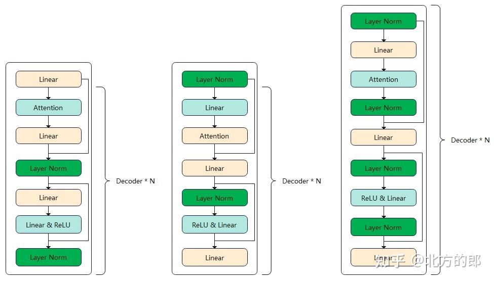
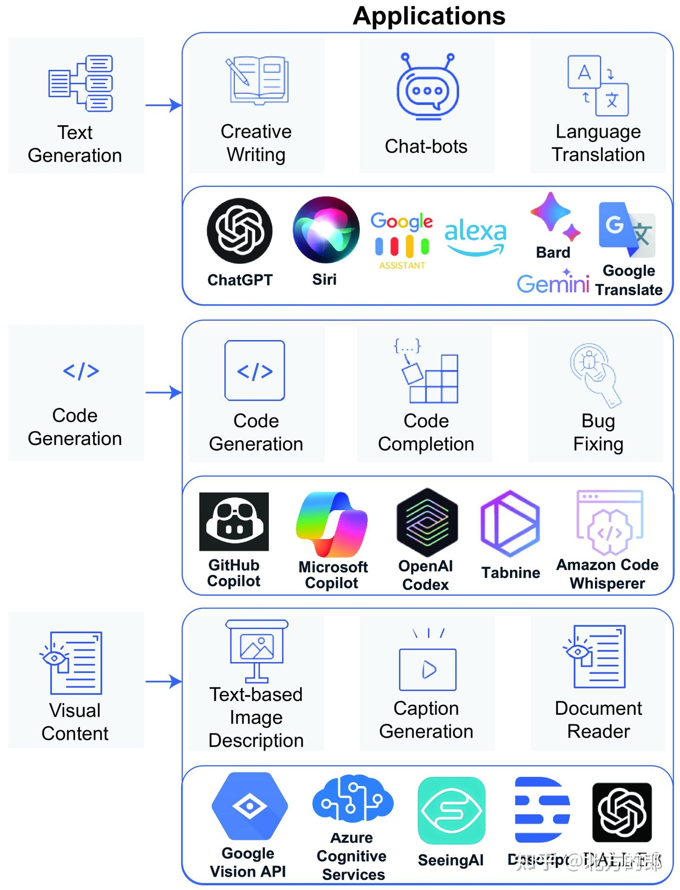

# 大语言模型架构全景图&趋势、基准与挑战
> _**作者: 北方的郎**_
> 
> _**原文:**_ [_**https://zhuanlan.zhihu.com/p/14943417217**_](https://zhuanlan.zhihu.com/p/14943417217)

前一段时间忙于项目，文档看的少。这两天集中看了一些文档，给自己充充电，感觉这篇大模型纽约大学研究者发表的综述写的不错，挺全、挺细致的。

论文地址：[Survey of different Large Language Model Architectures: Trends, Benchmarks, and Challenges](https://link.zhihu.com/?target=https%3A//arxiv.org/abs/2412.03220)

以下为论文的关键信息整理：

前言
--

2017年，Transformer架构的问世，为自然语言处理（NLP）技术带来了颠覆性的变革。一种名为大语言模型（LLM）的深度学习模型应运而生，它们在理解自然语言和生成连贯回应方面展现出超凡的能力。LLM的复杂性远超传统神经网络，往往包含数十个神经网络层，并拥有数十亿甚至数万亿的参数。这些模型通常在大数据集上进行训练，并基于Transformer模块构建架构。如今，LLM的多功能性使其能够执行各种任务，从文本生成和语言翻译到问答、代码生成和分析，甚至扩展到处理和解释多种数据模态，包括图像、音频和视频。这种增强功能使多模态大语言模型（MLLM）具备视频编辑、图像理解和字幕生成等视觉内容处理能力。本文将全面概述LLM的最新进展，从LLM的演变历程开始，深入探讨MLLM的出现和特点，并分析最先进的MLLM的技术特性、优势和局限性。此外，我们将对这些模型进行对比分析，并讨论其挑战、潜在局限性和未来发展方向。

I. 简介
-----

LLM在多个NLP任务中展现出卓越的技能，包括：

*   文本生成： 根据相关指令从结构化输入生成连贯的文本。
*   逻辑推理： 基于给定场景的逻辑进行分析和推理。
*   机器翻译： 在不同语言框架之间进行翻译。
*   摘要： 对内容进行上下文缩减。
*   多模态支持： 除了文本内容，LLM还能处理和输出各种格式，包括图像、视频和机器人环境中的交互。

LLM的发展可追溯到2018年GPT和BERT的出现。这些模型以其独特的架构服务于LLM的不同领域。当代LLM主要基于Transformer架构，可以分为以下几类：

*   自编码： 主要基于编码器，适用于上下文NLP任务，例如BERT及其衍生物。
*   自回归： 以解码器为中心，适用于生成任务，例如GPT系列。
*   编码器-解码器： 结合了编码器和解码器结构，兼顾了前两种类型的优势，但也有一些妥协，例如Pangu系列（Pangu-α和Pangu-Σ）。

II. 背景
------

LLM主要包含三种架构类别：仅编码器、仅解码器和编码器-解码器。每种类别都有其独特的优势和限制，并在各种应用和环境中找到其相关性。本节解释了现代LLM背后的架构，从通用的Transformer架构开始，然后探索基于该架构的三个类别。

### A. Transformer

Transformer架构由Vaswani等人于2017年提出，它通过并行处理标记的能力，打破了传统循环序列到序列模型（如LSTM网络和RNN）的顺序处理限制。Transformer的关键创新在于其多头自注意力机制，它允许模型并行训练。概念上，Transformer架构由编码器和解码器两部分组成。编码器将输入序列映射到更高维的嵌入空间，而解码器则从这些嵌入中生成输出序列。通常，Transformer模型包含多个编码器和解码器层。图2展示了Transformer模型的架构。

与其他传统模型不同，Transformer能够通过同时处理输入数据的所有部分，实现更快速和更高效的并行处理。为了解决在没有内在顺序处理的情况下保持序列信息的问题，Transformer使用了一种称为位置编码的技术。该机制允许每个标记（例如句子中的单词）编码其在序列中的相对位置。位置编码至关重要；没有它，Transformer会将句子视为一个词袋，完全忽略了单词的顺序。

位置编码使用涉及正弦和余弦函数的特定数学公式。该公式确保序列中的每个位置都获得唯一的编码。通过将此编码附加到标记的嵌入中，模型可以了解标记在序列中的位置。精确的公式如下：

E(pos, 2i) = sin(pos / 10000^(2i/dim))

E(pos, 2i + 1) = cos(pos / 10000^(2i/dim))

其中pos表示序列中的标记位置，i从0到dim/2，分别表示偶数和奇数位置。

正弦和余弦函数的选择特别有利，因为它们为嵌入空间中的位置信息提供了独特且一致的方式。这种设置不仅简化了模型根据相对位置进行注意力的学习，而且还使模型能够泛化到训练期间遇到的序列长度之外的长度。这种方法的美妙之处在于它赋予模型从数据中识别模式的能力，并增加了位置上下文。这种简单而深刻的方法对于Transformer模型在从文本生成和语言翻译到图像识别等语言之外的领域的成功至关重要。

### B. 自编码模型

自编码模型，也称为“仅编码器模型”，主要针对以理解为中心的自然语言处理任务，例如BERT、ERNIE和ALBERT。它们通过双向学习和掩码等训练技术，在上下文理解方面表现出色。然而，它们也存在一些局限性：

*   受限于固定长度的输入序列。
*   内在的上下文依赖性可能会阻碍文本生成。
*   由于其组成缺乏解码器，下游任务适应性需要微调。

### C. 自回归模型

这些模型，包括GPT和LLaMA系列，近年来备受关注。它们的自回归设计意味着标记生成依赖于先前标记，这使得它们非常适合生成任务。这些模型提供了：

*   接受不同输入长度的灵活性，使其擅长扩展数据生成。
*   在少样本或零样本任务中的熟练程度，避免了特定微调的需求。
*   然而，它们无法捕获整体上下文，因此在生成过程中只能从前置标记中获取洞察。

### D. 序列到序列模型

T5和GLM等模型结合了前两种类型的优势，擅长将输入序列映射到固定长度的嵌入，使解码器能够生成上下文相关的输出。这使得它们特别适用于条件生成任务，例如摘要、翻译和问答，其中输出紧密依赖于提供的输入。

编码器和解码器组件的集成使Seq2Seq模型能够处理复杂的输入，但也带来了以下缺点：

组合增加了参数数量，可能影响效率。

训练此类模型需要大量的计算资源，因为对齐输入和输出序列很复杂。

### E. 变分自编码器（_Variational auto-encoder_）

变分自编码器（VAE）是一种复杂的生成模型，它通过整合概率建模来发展一个有意义且通用的潜在空间，从而从传统的自编码器（AE）中演变而来。与标准的AE不同，VAE的编码器产生由均值和方差定义的概率分布，而不是单个确定性点。

VAE使用概率编码来创建一个动态和可适应的潜在空间，不仅允许数据重建，而且还允许通过从学习的概率分布中采样来生成新数据。这增强了模型的泛化能力，并确保潜在空间中的平滑过渡，这对于数据生成和增强等任务至关重要。它利用重参数化技巧，在反向传播过程中保持梯度流动，使潜在变量保持可微性，从而实现传统的训练。VAE的目标函数在重建损失和Kullback-Leibler（KL）散度之间进行权衡，重建损失评估解码器样本与原始输入的准确性，而KL散度通过鼓励后验接近标准高斯分布来促进潜在分布的逼近。这种双重关注确保了精确的输入重建和平滑、连续的潜在空间，使VAE成为图像生成、数据增强和异常检测等应用的强大工具。

### F. 生成对抗网络（_Generative Adversarial Network_）

生成对抗网络（GAN）是Goodfellow等人于2014年提出的一类深度学习框架。GAN由两个神经网络组成，即生成器和判别器，它们通过对抗过程同时进行训练。生成器的目标是创建类似于真实数据的合成数据，而判别器的角色是区分真实和合成数据。随着时间的推移，随着训练的进行，生成器越来越擅长创建真实数据，而判别器越来越擅长区分真实和假数据，如图所示。

  

III. 以前基于领域的LLM综述（Previous Domain-based LLM Surveys）
----------------------------------------------------

本节对现有的大语言模型（LLM）调查进行综合分析。我们根据这些调查论文所涉及的主题对它们进行比较评估。调查按时间顺序排列，使读者能够跟踪研究重点随时间的演变。通过检查这些调查中的内容，读者可以深入了解高级LLM开发所取得的进展。类别包括：

*   架构： 讨论的LLM的架构设计细节，包括模型类型和配置，包括仅解码器、仅编码器和解码器-编码器模型。
*   数据集： 用于训练和评估LLM的数据集信息。
*   预训练： 用于训练基础LLM的方法和技术。
*   微调： 将预训练LLM适应特定任务或领域的策略，以提高特定领域的性能。
*   基准： 评估LLM/MLLM性能的评估指标和基准数据集。
*   挑战： 识别挑战和优化LLM开发和部署的技术。
*   MLLM： 讨论多语言语言模型及其特定考虑因素。
*   应用： 最先进LLM的现实世界应用和用例。

IV. LLMS的比较分析
-------------

本节使用各种基准对主要语言模型进行比较分析，这些基准评估了模型在语言理解、推理和多模态任务中的能力。这些基准旨在评估语言理解和认知能力的各个方面。

### A. 主要基准

MMLU（大量多任务语言理解）： 包含57个任务，涵盖从人类概念到高中考试的各种主题，评估语言模型在广泛主题上的全面理解和泛化能力。

SuperGLUE： 设计为高级基准，用于评估和促进AI模型在推理和预测能力方面的改进，这些能力超越了GLUE基准。

HellaSwag： 设计用于测试模型的一般知识和使用日常知识完成场景的能力。

ARC（AI2推理挑战）： 提供小学水平的多项选择题，测试模型理解和应用推理技能的能力。

WinoGrande： 包含大量winograd方案，用于测试AI模型的常识推理能力

### B. 多模态LLM基准

NLVR2（真实世界视觉推理）： 评估AI模型使用自然语言进行视觉推理的能力。它要求模型确定给定的自然语言陈述是否准确地描述了图像对。

视觉问答（VQA）基准： 评估AI系统回答与给定图像相关问题的能力。该多模态基准结合了自然语言处理和图像识别，以测试模型对视觉内容的全面理解，以及与概念和事实查询相关联的能力。

V. LLMS的微调技术
------------

LLM的微调方法在各种应用中使用，包括领域专业化、性能改进和偏差缓解。本文详细介绍了两种关键的微调方法：低秩适应（LoRA）和持续学习（CL）。

### A. LLMS中的低秩适应（_LOW-RANK ADAPTATION IN LLMS_）

LoRA提供了一种有效的方法来微调基于Transformer的语言模型。该技术通过将原始权重矩阵分解为低秩更新来减少可训练参数的数量，从而显著降低计算开销。它还推广了全微调，理论上允许模型通过选择合适的r来逼近全秩权重矩阵的表示能力。

### B. 持续学习

CL是一种方法，它专注于随着时间的推移使模型适应新任务，同时避免先前学习信息的灾难性遗忘。它利用PEFT方法引入最小的、任务特定的更新到模型的参数中。这些策略通过包含基于熵的分类器用于适配器选择和确保任务之间知识转移的策略，帮助模型在一系列任务中保持性能。

### C. 上下文窗口扩展（_CONTEXT WINDOW EXTENSION_）

上下文窗口扩展是指将LLM适应处理超过其最初定义的上下文长度的输入序列。通过PEFT，例如LongLoRA，LLM可以高效地微调以扩展其上下文窗口，使其能够处理更长的输入序列而不会显着增加计算需求。

### D. 视觉指令微调（_VISUAL INSTRUCTION TUNING_）

一种引人注目的PEFT技术是视觉指令微调，其中LLM（传统上基于文本）被适应以处理视觉输入，使其能够执行图像字幕和视觉问答等任务。通过视觉指令微调将视觉和语言处理集成到LLM中，代表了多模态AI能力的重大飞跃。该过程涉及使用LLM（如GPT-4）生成语言-图像指令遵循数据，然后使用这些数据微调一个能够理解和交互文本和视觉输入的模型。生成的模型被称为LLaVA（大型语言和视觉助手），展示了令人印象深刻的跨模态对话能力，并在科学问答等任务上设置了新的准确率基准。

VI. 最先进的LLM
-----------

本节概述了基于其架构和所属系列的大语言模型（LLM）。这将提供对各种LLM及其各自设计框架的全面理解。

  
  

### A. 自编码模型

BERT： 2018年发布的先驱模型，利用仅编码器架构，显著提高了自然语言理解模型的能力。

BERT变体： 包括BERT-wwm、BERT-wwm-ext、SpanBERT、DistillBERT、TinyBERT、VisualBERT和MacBERT等，针对不同任务和效率进行了改进。

RoBERTa： 通过动态掩码策略增强了BERT的训练过程的鲁棒性，并采用更大的批量大小、更大的训练语料库和更深的训练迭代来优化性能。

ERNIE： 采用多级掩码策略来优化中文语言的性能，并引入了对话语言模型（DLM）技术。

ALBERT： 通过因式分解嵌入参数化来优化训练，并引入了句子顺序预测（SOP）任务来替代BERT中的NSP任务。

ELECTRA： 采用生成对抗网络（GAN）技术，通过预测所有单词而不是仅预测掩码的单词来提高效率。

DeBERTa： 引入了解耦注意力机制，以解决传统自编码模型中掩码语言模型（MLM）的局限性。

Transformer-XL： 通过引入段级递归和状态重用以解决处理长序列的挑战。

### B. 自回归模型

GPT： 2018年发布的先驱模型，引入了自回归技术，并采用了无监督学习和上下文学习训练策略。

Pathways和PaLM： 基于Pathways架构，PaLM是第一个使用该架构训练的语言模型，拥有高达540B的参数。PaLM-E是PaLM的扩展，集成了语言路径和视觉路径，使其能够理解和处理文本和图像。

  
  

Microsoft KOSMOS-1： 基于magneto transformer架构，KOSMOS-1使用CLIP ViT-L/14模型来捕获图像特征，并采用XPOS技术来协调训练标记和预测标记之间的长度差异。

Megatron： Nvidia提出的框架，用于解决LLM训练中的并行计算问题，通过层内并行、层间并行和数据并行来加速模型训练。

LLaMA： Meta开发的模型，旨在提高模型能力的同时保持较小的尺寸，适用于本地部署。LLaMA系列包括LLaMA、Alpaca、Guanaco、Vicuna、Dolly、LLaMA 2和Video-LLaMA等，针对不同参数大小和模态支持进行了改进。

Gopher和DeepMind： Gopher是DeepMind开发的模型，拥有从44M到280B不等的参数。Chinchilla是Gopher的继任者，目标是提高模型大小和训练数据之间的比例。DeepMind还开发了视觉模型Flamingo，用于少样本学习。

其他自回归模型： 包括Jurassic系列、Claude系列、Falcon、DALL-E、Whisper和Codex等，涵盖了图像生成、音频到文本转换和代码生成等领域。

Google模型： 包括Meena、LaMDA、ALIGN、GaLM和Gemini等，针对特定领域和任务进行了优化。

Microsoft模型： 包括Phi系列和mPLUG系列，Phi系列专注于小模型和高精度，mPLUG系列专注于多模态支持。

其他模型： 包括AlexaTM、PLATO系列、WuDao系列、Cogview、Lawformer、OPT、YaLM、BLOOM和Galactica等，展示了LLM在各个领域的应用潜力。

C. 序列到序列模型

BART： 结合了BERT的双向编码器特征和GPT的自回归解码器特征，在序列生成任务中表现出色。

基于T5： 包括T5、mT5和T0等，提供了一种通用的预训练模型框架，并针对机器翻译和提示工程进行了改进。

Pangu： 包括Pangu-α、Pangu-Coder和Pangu-Σ，针对中文语料库和代码生成进行了优化。

Switch Transformer： 利用LLM中的稀疏性来加速训练和推理，通过混合专家（MoE）和简化的稀疏路由来减少计算复杂性。

GLM： 引入了自动回归空白填充来改进掩码和填充技术，并以其较小的参数数量在SuperGLUE基准上优于BERT。

ChatGLM和VisualGLM： 分别为BART和GLM的对话和视觉对话版本，展示了LLM在交互和多模态任务中的潜力。

VII. LLMS的预训练方法
---------------

预训练是LLM开发的关键阶段，涉及使用大量文本数据训练模型以学习语言模式、结构和上下文细微差别。本文介绍了各种最先进的预训练方法，包括训练数据减少、神经架构搜索、渐进学习和混合精度训练。

VIII. LLMS的挑战
-------------

LLM面临着一些挑战，包括数据问题、模型压缩、分布式计算和多模态支持。

### A. 数据问题

数据质量： 数据的相关性、丰富性和冗余性对LLM的性能至关重要。数据质量问题可能会导致模型学习到不准确或不可靠的知识。

数据偏差： 训练数据中经常存在人类语言或其他数据输入形式中的偏差，这可能会导致模型对特定主题的偏见理解。

数据规模： LLM需要大量数据来提高准确性和对提示的理解，这给数据收集、处理和存储带来了挑战。

### B. 模型压缩

模型压缩技术旨在优化模型的内部结构以提高效率，同时不显着降低性能。三种主要技术包括剪枝、量化和知识蒸馏。

  

### C. 分布式计算

由于LLM的规模巨大，传统的单设备训练或部署方法不足以处理与这些模型相关的巨大数据集和参数规模。分布式计算已成为解决这些挑战的关键解决方案。目前，三种主要的分布式计算方法被用于解决这些挑战：数据并行、张量并行和流水线并行。

### D. 多模态支持

多模态支持是LLM面临的一个重大挑战，特别是在视觉Transformer (ViT)的出现之后，它展示了变换器在视觉任务中的潜力。与传统的LLM不同，训练具有多模态支持的模型更复杂，因为需要在不同模态之间对齐表示。这为这些多模态LLM引入了不同的训练任务。

### E. 提示工程

提示工程是一种技术，通过策略性地制定包含内容和指令的输入查询来加快LLM在上下文中的理解速度。该技术比预训练和微调更简单，并允许用户与LLM交互以控制标记数据流。

IX. LLMS的应用
-----------

LLM通过利用其理解和生成人类语言的能力，改变了各个领域。它们的应用范围很广，包括文本生成、代码生成、视觉内容理解和设计自动化。

X. 结论
-----

本文全面回顾了LLM及其在NLP领域的演变。它探索了LLM在各个NLP任务中的各种技能，包括文本

> 作者：北方的郎  
> 链接：undefined