# 大模型训练常见知识总结
> **作者:** **致Great**
> 
> **原文: https://mp.weixin.qq.com/s/pP-4wN1ItYxcWbZ7CCNzSQ**

随着LLM学界和工业界日新月异的发展，不仅预训练所用的算力和数据正在疯狂内卷，后训练（post-training）的对齐和微调等方法也在不断更新。下面笔者根据资料整理一些关于大模型训练常见概念解释。

**1 Pre-training（预训练）**
-----------------------

预训练是指在模型的初始阶段，使用大量数据对模型进行训练，以便让模型学习到通用的特征和知识。这些特征和知识可以是语言模型中的词嵌入，或者是图像识别模型中的视觉模式。

*   通常发生在模型开发的早期阶段。
*   目的是在大规模数据集上学习通用特征，为后续任务奠定基础。
*   不针对特定任务，而是追求广泛的适用性。

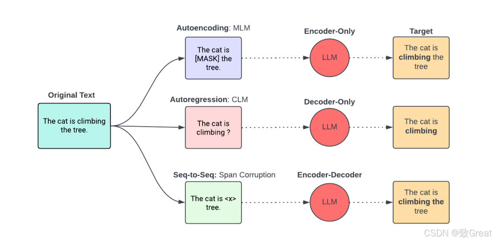

**2 Post-training（后训练）**
------------------------

后训练是指在预训练模型的基础上，针对特定的任务或数据集进行额外的训练。这个阶段通常涉及到微调（Fine-tuning），即调整预训练模型的参数以适应新的任务。

*   发生在预训练之后，模型部署前或部署初期。
*   针对特定的任务或数据集进行额外训练，以优化模型性能。
*   可以包括Fine-tuning（微调）和Reinforcement Learning from Human Feedback（RLHF，人类反馈的强化学习）等方法。

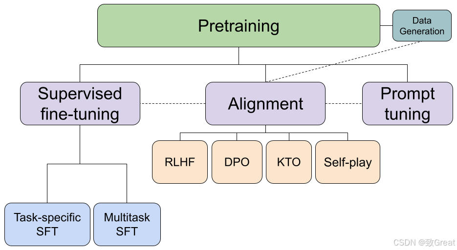

### **2.1 Llama 3.1后训练**

在后训练过程中，Meta AI团队采用了一种相对简单的方法，包括监督微调（SFT）、拒绝采样和直接偏好优化（DPO）。他们观察到，像带PPO的RLHF这样的强化学习算法与这些技术相比，稳定性较低且更难扩展。值得注意的是，SFT和DPO步骤在多轮中反复迭代，融合了人工生成和合成数据。在描述更多细节之前，他们的工作流程如下图所示。

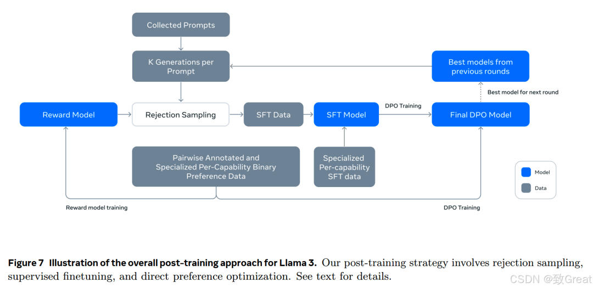

### **2.2 大模型性能提升之路**

**【从Qwen2,Apple Intelligence Foundation,Gemma 2,Llama 3.1看大模型的性能提升之路】**阿里巴巴的 Qwen 2、苹果的基础模型（AFM）、谷歌的 Gemma 2 和 Meta 的Llama 3.1

这四种模型在预训练和后训练方面都采用了略有不同的方法。当然，方法论是重叠的，但没有哪一种训练流程完全相同。对于预训练，一个共同的特点似乎是所有方法都使用多阶段预训练流程，其中一般核心预训练之后是上下文延长步骤，有时是高质量退火步骤。下图再次一目了然地展示了预训练中采用的不同方法。

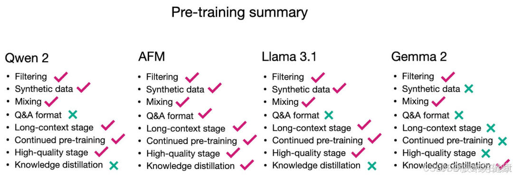

在训练后，也没有一个流程是完全相同的。似乎拒绝采样现在已成为训练后过程中的常见做法。然而，在 DPO 或 RLHF 方面，目前还没有达成共识或偏好。

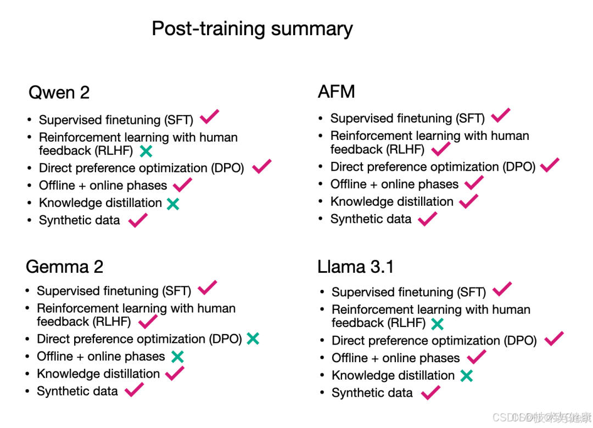

**3 Continue Training（持续训练）**
-----------------------------

持续训练是指在模型已经进行了预训练和可能的后训练之后，继续在新数据上进行训练，以不断更新和改进模型的性能。

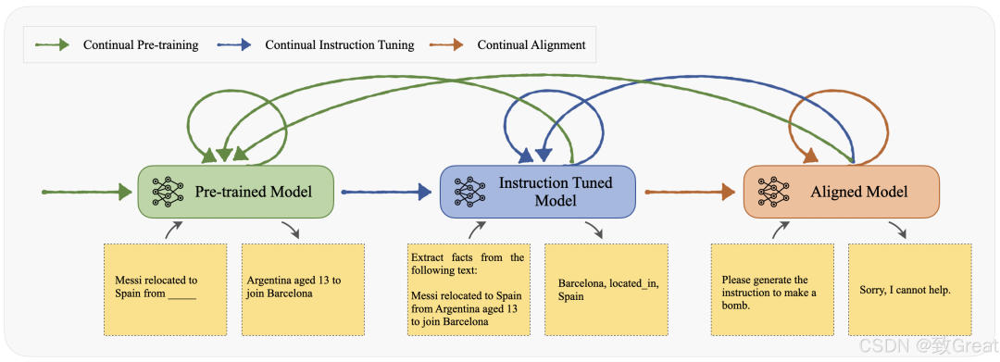

*   可能在模型部署后的任何阶段进行。
*   目的是不断适应新数据，保持模型性能的稳定和提升。
*   持续训练可以包含后训练作为其中的一个阶段。

**4 Pre-training、Post-training、Continue training的区别**
-----------------------------------------------------

### **4.1 对比**

| **概念** | **Pre-training（预训练）** | **Post-training（后训练）** | **Continue Training（持续训练）** |
| --- | --- | --- | --- |
| **定义** | 预训练是指在模型的初始阶段，使用大量数据对模型进行训练，以便让模型学习到通用的特征和知识。这些特征和知识可以是语言模型中的词嵌入，或者是图像识别模型中的视觉模式。 | 后训练是指在预训练模型的基础上，针对特定的任务或数据集进行额外的训练。这个阶段通常涉及到微调（Fine-tuning），即调整预训练模型的参数以适应新的任务。 | 持续训练是指在模型已经进行了预训练和可能的后训练之后，继续在新数据上进行训练，以不断更新和改进模型的性能。 |
| **应用** | 在自然语言处理（NLP）中，预训练模型如 BERT 或 GPT 通过在大规模文本语料库上进行训练，学习语言的通用模式。在计算机视觉中，预训练模型如 ResNet 或 VGG 通过在大型图像数据集（如 ImageNet）上进行训练，学习视觉特征。 | 例如，在 NLP 中，一个预训练的 BERT 模型可能会在特定领域的文本上进行后训练，以提高在该领域的性能。在强化学习中，后训练可能涉及到在预训练策略的基础上进行进一步的优化和调整。 | 这在实时系统或需要不断适应新数据的场景中很常见，如推荐系统或股票市场预测模型，它们需要不断地从新数据中学习以保持其准确性和相关性。 |
| **目的** | 预训练的目的是构建一个强大的特征提取器，这个特征提取器可以在后续的任务中被重用或微调。 | 后训练的目的是让模型能够适应特定的任务或数据分布，提高模型在这些特定场景下的性能。 | 持续训练的目的是使模型能够适应随时间变化的数据分布，保持其长期的有效性和适应性。 |

### **4.2 区别**

*   **训练阶段:** 预训练通常发生在模型开发的早期阶段，后训练和持续训练则可能在模型部署后进行。

> Pre-training（预训练）：通常发生在模型开发的早期阶段。目的是在大规模数据集上学习通用特征，为后续任务奠定基础。不针对特定任务，而是追求广泛的适用性。

> Post-training（后训练）：发生在预训练之后，模型部署前或部署初期。针对特定的任务或数据集进行额外训练，以优化模型性能。可以包括Fine-tuning（微调）和Reinforcement Learning from Human Feedback（RLHF，人类反馈的强化学习）等方法。

> Continue training（持续训练）：可能在模型部署后的任何阶段进行。目的是不断适应新数据，保持模型性能的稳定和提升。持续训练可以包含后训练作为其中的一个阶段。

*   **数据使用:** 预训练使用广泛的数据集来学习通用特征，后训练和持续训练则使用更具体或更新的数据。

> Pre-training：使用广泛的数据集，追求数据的多样性和规模。Post-training：使用更具体或更新的数据，针对特定任务进行优化。Continue training：不断引入新数据，保持模型的时效性和准确性。

*   **目标任务:** 预训练不针对特定任务，而后训练和持续训练则针对特定的应用或任务进行优化。

> Pre-training：不针对特定任务，而是学习通用的语言特征和结构。Post-training：针对特定的应用或任务进行优化，如医疗咨询、金融分析等。Continue training：保持模型的通用性，同时适应特定任务的变化。

*   **Post-training和SFT、RLHF的关系：** 后训练通常指的是在一个模型预训练（Pre-training）之后，针对特定的任务或数据集进行的额外训练。这个阶段可以包括Fine-tuning（微调）和Reinforcement Learning from Human Feedback（RLHF，人类反馈的强化学习）等方法。
*   **Post-training和Continue Training的关系：** 持续训练可以包含后训练作为其中的一个阶段。例如，一个模型可能首先在大量数据上进行预训练，然后进行后训练以适应特定任务，之后进入持续训练阶段，不断在新数据上进行训练以保持其性能。

### **4.3 举例说明**

假设一个语言模型在大规模文本数据集上进行了预训练，学习了语言的基本结构和语义。之后，为了使模型更好地回答特定领域的问题，如医疗咨询，开发者可能会在医疗领域的数据上进行后训练，这包括了SFT和RLHF等方法来进一步提升模型的领域特定性能。

随后，模型部署到实际应用中，为了保持其回答质量并适应用户提问方式的变化，模型会进入持续训练阶段，不断在新的用户互动数据上进行训练。这样，模型不仅在最初部署时表现良好，而且能够持续适应环境变化，保持其长期的有效性和相关性。

**5 监督训练**
----------

在监督学习中（也称为从演示中学习或“指令微调”），我们会收集一组人类编写的文本，这些文本以问题或指令的形式出现，并包含了期望的输出。例如，这些文本可以是某一问题和答案，或者是像带有人类编写总结的summarize the following text {text}这样的任务。通过在相同的“给定前缀预测下一个token”的目标上继续训练模型，但这次是在指令-输出对集合上，模型学会通过执行指令来响应。即模型接收到给定问题的正确输出的演示，并学会复制输出结果。我们希望通过这种方式将其泛化到训练中尚未出现的问题中去。

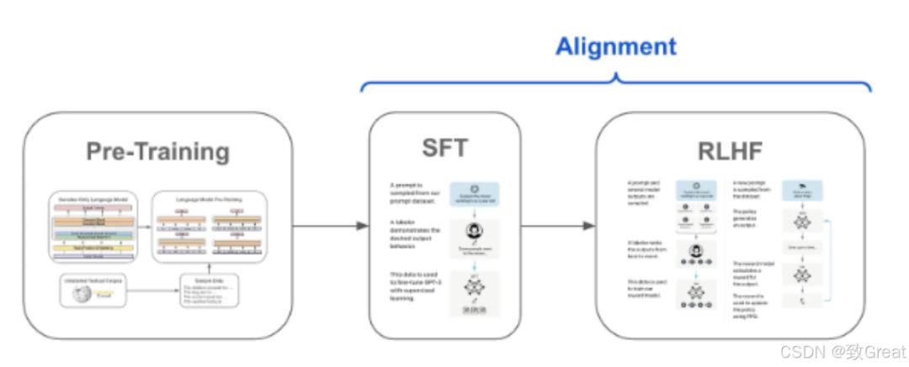

**6 自监督学习**
-----------

大型语言模型本质上就是神经网络，也就是一种机器学习的方法。机器学习中的监督学习需要人类帮助标注数据。然而遗憾的是，ChatGPT 底层的大型语言模型参数如此的多，如果使用监督学习，必然需要大量的人类标记数据，这几乎是不可能的。自监督学习主要是利用辅助任务（pretext）从大规模的无监督数据中挖掘自身的监督信息，通过这种构造的监督信息训练模型，从而学习到对下游任务有价值的表征。

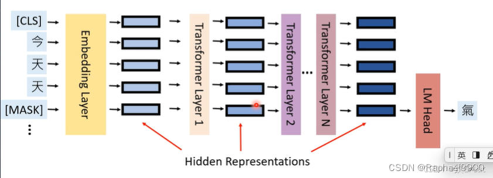

**7 自回归模型**
-----------

GPT 是如何在人类的文本数据上实现自监督学习？用一句话就可以讲明白：用文本的前文来预测后文。

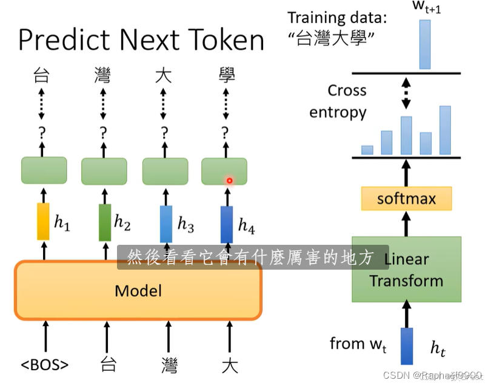

**8 PT、SFT**
------------

在大模型领域，PT和SFT分别代表预训练（Pre-training）和监督微调（Supervised Fine-tuning）。这两个概念通常用于构建和优化深度学习模型，特别是自然语言处理（NLP）领域的模型。

*   预训练（Pre-training，简称PT）：预训练是一种无监督学习方法，模型通过大量无标签数据进行训练，以捕捉数据的底层结构和模式。在自然语言处理领域，预训练模型通常学习词汇、语法和句子结构等基本特征。预训练的目的是让模型学会一定程度的通用知识，为后续的微调阶段打下基础。
*   监督微调（Supervised fine-tuning，简称SFT）：微调是一种有监督学习方法，通过在有标签数据上对预训练模型进行进一步训练，以适应特定的任务。这个过程使得模型能够利用预训练阶段学到的通用知识，结合新数据的标签信息，使模型在特定任务上表现更好。
    
    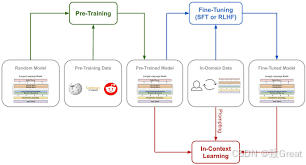
    

**9 上下文学习**
-----------

对于大型语言模型来说，即需要大量的数据标记成本，也需要算力成本和时间成本。然而，不同场景下任务的需求是不一样的，不可能根据每个任务都去微调模型。能否不进行微调就让模型学习完成不同的任务呢？答案是可以的，这个神奇的技术称为 上下文学习 （In Context Learning）。它的实现非常简单，只需要给到模型一些引导，将一些事先设定的文本输入到大型语言模型中，就像手把手教人学会某项技能一样，大型语言模型就能神奇的学习到如何处理后续的新任务。遗憾的是，为什么大型语言模型具有上下文学习的能力仍然是一个迷，业内把这个能力称为“涌现”。

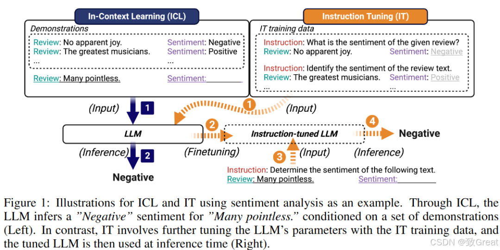

**思维链**
-------

“思维链”是指在思考问题或探索主题时，一个思想引发另一个思想，形成一系列相互关联的思维环节。这种思维过程可以是线性或非线性的，通过连接和扩展思想，帮助我们更全面地理解问题，促进创新性思考，思维链是认知过程中的重要组成部分。

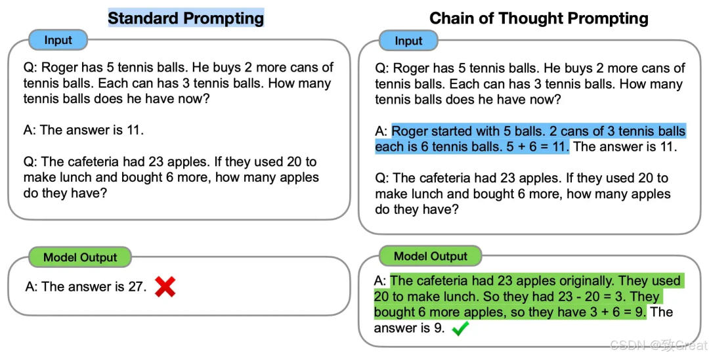

**强化学习（RL）**
------------

在强化学习中，我们为模型提供指令，但并不提供人工编写的答案。模型需要自己生成答案。评分机制（例如人类）会读取生成的答案，并告诉模型这些答案的质量，模型的目标是如何回答以获得高分。

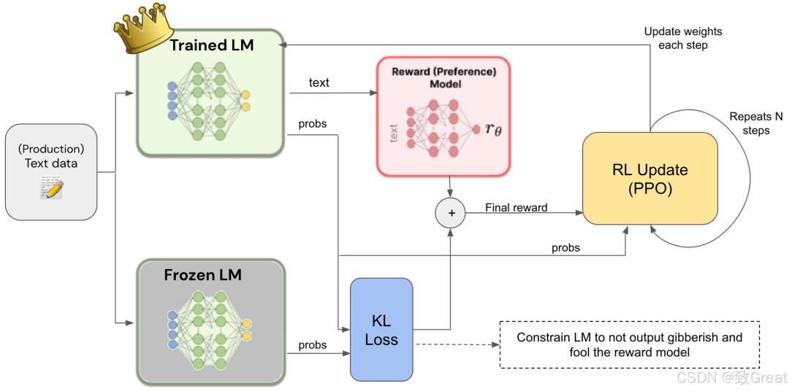

**P- Tuning**
-------------

是GPT模型微调中的一种技术，是在Fine-tuning方法基础上进行改进而形成的一种参数高效的微调方法。P-tuning只有少量参数参与训练，训练计算复杂度相对较小，适合少数据量场景。它的原理是将人工提示词模板转换成可学习的连续向量，通过下游任务的学习来优化连续向量，从而自动学出好的自动提示模板。

**LoRA**
--------

假设有一个预训练好的语言模型，包含了大量的预训练好的参数。现在要使用这个模型来解决一个特定的下游任务，例如情感分析。为了适应这个特定的任务，需要微调模型。

使用LoRA方法，首先将预训练模型的参数冻结，即保持不变。然后，在冻结的预训练模型之上，添加一些新的层，这些层将用于适应新的任务。例如，可以添加一个分类器层，用于将文本分类为正面或负面情感。在这个过程中，只有新添加的层的参数将被训练，而预训练模型的的其他参数将被保持不变。这样，只需要训练一小部分参数，就可以快速微调模型，同时保持了预训练模型的性能。因此，LoRA方法可以在不增加模型大小和计算成本的情况下，实现更好的模型性能和更快的训练速度。

**参考资料**
--------

*   **大模型黑话指南（一）**
*   **详析Pre-training Post-training与Continue training差异**
*   **Pre-training、Post-training、Continue training的区别**
*   **关于大模型训练微调的几个概念**
*   **大模型Post-Training**
*   **Post Pretraing 技术解析**
*   **【从Qwen2,Apple Intelligence Foundation,Gemma 2,Llama 3.1看大模型的性能提升之路】**
*   **新型大语言模型的预训练与后训练范式，Meta的Llama 3.1语言模型**